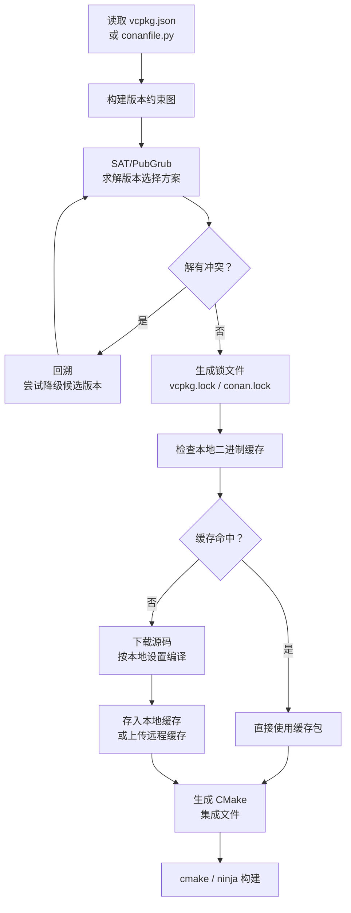

---
tags:
  - build-systems
  - tier3
  - dependency-management
  - vcpkg
  - conan
  - semver
---
# 构建系统的依赖管理

> [!abstract] TL;DR
> C/C++ 生态长期缺乏统一的依赖管理方案，开发者在"手动管理子模块"与"系统包管理器"之间挣扎数十年。vcpkg（微软，manifest 模式）和 Conan（JFrog，二进制缓存）是当前主流答案。语言原生型工具（cargo/npm/pip）比系统型工具（vcpkg/Conan）拥有更好的版本解析一致性，但 C++ ABI 兼容性问题使"二进制包"方案天然更复杂。

## 概述与定位

### C/C++ 依赖管理的历史困境

在 Cargo（2015）和现代 vcpkg/Conan 出现之前，C/C++ 项目的依赖管理经历了以下演化：

1. **手动复制源码**：将第三方库源码放入 `third_party/` 目录，版本升级靠手工 diff
2. **系统包管理器**（`apt`/`brew`/`yum`）：版本由操作系统决定，跨平台一致性极差
3. **Git submodules**：解决了版本固定问题，但构建集成依然需要手动配置
4. **CMake ExternalProject**：在构建期间下载，但无法共享二进制缓存

### 包管理器分类

| 类型 | 代表工具 | 特点 |
|------|---------|------|
| 语言内置型 | cargo / npm / pip / go mod | 与语言工具链深度集成，版本解析一致性好 |
| 系统型（C++专用） | vcpkg / Conan | 处理 ABI 兼容性，支持二进制缓存 |
| 系统型（通用） | apt / brew / nix | 版本由发行版决定，不适合精确锁定 |

## 原理与机制

### SemVer 版本解析

语义化版本（Semantic Versioning）规定版本号格式为 `MAJOR.MINOR.PATCH`：

| 变更类型 | 影响版本段 | 含义 |
|---------|----------|------|
| 不兼容 API 变更 | MAJOR | 需要调用方适配 |
| 向后兼容新功能 | MINOR | 可安全升级 |
| 向后兼容 bug 修复 | PATCH | 应当升级 |

各语言生态的版本范围语法对比：

| 语法 | 工具 | 等价范围 |
|------|------|---------|
| `^1.2.3` | Cargo / npm | `>=1.2.3, <2.0.0` |
| `~1.2.3` | Cargo / npm | `>=1.2.3, <1.3.0` |
| `~=1.2.3` | pip (PEP 440) | `>=1.2.3, <1.3.0` |
| `>=1.2.3` | 所有 | 最小版本下界 |
| `==1.2.3` | pip | 精确版本 |

### 依赖图解析算法

现代包管理器普遍采用基于 SAT 或 PubGrub 的算法解决依赖图版本选择问题：

```
输入：{ A: ">=1.0", B: "^2.0" }
传递依赖：A@1.2 依赖 C@^1.0；B@2.3 依赖 C@^1.5

求解过程：
1. 选择 A 最新兼容版本 → A@1.2
2. 选择 B 最新兼容版本 → B@2.3
3. C 的约束取交集：^1.0 ∩ ^1.5 = >=1.5, <2.0
4. 选择 C@1.8（满足两者）
输出：{ A@1.2, B@2.3, C@1.8 }
```

当约束集无解时（钻石依赖冲突），算法需回溯并尝试降级其中一个包。

### 私有仓库 vs 公共仓库

企业环境通常同时使用内部私有仓库（Artifactory/Nexus）和公共仓库（crates.io/PyPI/npm）。版本解析时的优先级配置至关重要（见安全章节的依赖混淆攻击）。

## 结构/算法/伪代码详解

### vcpkg manifest 模式示例

```json
// vcpkg.json —— manifest 模式（推荐，类似 Cargo.toml）
{
  "name": "my-project",
  "version": "1.0.0",
  "dependencies": [
    "boost-filesystem",
    "nlohmann-json",
    {
      "name": "openssl",
      "version>=": "3.1.0"
    },
    {
      "name": "fmt",
      "features": ["unicode"]
    }
  ],
  "builtin-baseline": "2024.01.12",
  "overrides": [
    {
      "name": "zlib",
      "version": "1.3.1"
    }
  ]
}
```

```bash
# 安装所有 manifest 依赖
vcpkg install

# 集成到 CMake
vcpkg integrate cmake
# 或者在 CMake 命令行中传递 toolchain
cmake -B build -DCMAKE_TOOLCHAIN_FILE=/path/to/vcpkg/scripts/buildsystems/vcpkg.cmake
```

### Conan conanfile.py 示例

```python
# conanfile.py —— Python 脚本格式，支持动态逻辑
from conan import ConanFile
from conan.tools.cmake import CMakeToolchain, CMakeDeps, cmake_layout

class MyProjectConan(ConanFile):
    name = "my-project"
    version = "1.0.0"
    settings = "os", "compiler", "build_type", "arch"
    
    requires = [
        "boost/1.83.0",
        "openssl/3.1.4",
        "fmt/10.2.1",
    ]
    
    tool_requires = [
        "cmake/3.27.0",
        "ninja/1.11.1",
    ]
    
    def layout(self):
        cmake_layout(self)
    
    def generate(self):
        tc = CMakeToolchain(self)
        tc.generate()
        deps = CMakeDeps(self)
        deps.generate()
```

```bash
# 安装依赖并生成 CMake 集成文件
conan install . --output-folder=build --build=missing

# 创建并上传包到本地缓存
conan create . --profile=release

# 查看依赖图
conan graph info .
```

### CMake 集成示例

```cmake
# CMakeLists.txt —— 结合 vcpkg 或 Conan
cmake_minimum_required(VERSION 3.20)
project(MyProject)

# vcpkg 模式：通过 toolchain 自动设置
find_package(fmt CONFIG REQUIRED)
find_package(OpenSSL REQUIRED)
find_package(nlohmann_json CONFIG REQUIRED)

add_executable(my-app src/main.cpp)
target_link_libraries(my-app PRIVATE
    fmt::fmt
    OpenSSL::SSL
    nlohmann_json::nlohmann_json
)
```

### 依赖解析流程 Mermaid



## 工具视角与实战

### pip-compile 锁文件（Python 生态）

```bash
# requirements.in —— 只写直接依赖
django>=4.2
celery[redis]
psycopg2-binary

# 生成精确锁文件（包含所有传递依赖的精确版本+哈希）
pip-compile requirements.in --generate-hashes -o requirements.txt

# 安装锁定版本
pip install -r requirements.txt
```

### vcpkg port 系统

vcpkg 的每个"port"是一个包含 `portfile.cmake`（构建脚本）和 `vcpkg.json`（元数据）的目录。用户可以创建自定义 overlay port 覆盖官方版本：

```bash
# 使用自定义 overlay port
vcpkg install mylib --overlay-ports=./my-ports

# 查看可用包
vcpkg search fmt

# 列出已安装包
vcpkg list
```

### Conan 二进制包缓存

Conan 的核心优势是**二进制包缓存**：同一版本的包针对不同的 `settings`（编译器/ABI/平台）组合缓存独立的二进制，避免重复编译：

```bash
# 上传到企业内部 Conan 服务器（Artifactory）
conan remote add mycompany https://artifactory.example.com/artifactory/api/conan/conan-local
conan upload "boost/1.83.0" -r mycompany --all

# 下载预编译二进制（若服务器有对应 profile 的包）
conan install . -r mycompany
```

## 安全性与正确使用

### 依赖混淆攻击（Dependency Confusion）

依赖混淆攻击由 Alex Birsan 于 2021 年首次公开披露。攻击原理：

1. 攻击者发现目标公司在内部仓库中使用名为 `company-internal-lib` 的私有包（通过泄露的 `package.json`/`requirements.txt` 等）
2. 攻击者向 **公共仓库**（PyPI/npm/crates.io）上传同名但版本号更高的恶意包
3. 包管理器的默认行为是**优先选择版本号最高的包**，且公共仓库优先级往往高于私有仓库
4. 开发者/CI 环境安装时自动拉取了恶意包

**防御措施**：

```toml
# pip: 在 pip.conf 中强制使用私有仓库（index-url 优先）
[global]
index-url = https://artifactory.example.com/pypi/simple/
extra-index-url = https://pypi.org/simple/
# 注意：extra-index-url 的包会与 index-url 合并版本比较！
# 更安全的方案：完全不使用 extra-index-url，走代理镜像
```

```json
// npm: 在 .npmrc 中为内部包配置 scope 锁定
@mycompany:registry=https://npm.example.com/
```

```bash
# Cargo: 在 .cargo/config.toml 中配置 source replacement
[source.crates-io]
replace-with = "vendored-sources"

[source.vendored-sources]
directory = "vendor"
```

### 哈希固定

所有现代锁文件机制都支持内容哈希固定：

```
# Cargo.lock 中的哈希示例
[[package]]
name = "serde"
version = "1.0.197"
source = "registry+https://github.com/rust-lang/crates.io-index"
checksum = "3fb1c873e1b9b056a4dc4c0c198b24c3ffa059243875552b2bd0933b1aee4ce2"
```

哈希固定确保即使攻击者替换了同版本号的包内容，校验也会失败。

### 供应链审计工具

```bash
# Cargo
cargo audit                     # RustSec 漏洞数据库
cargo deny check licenses       # 许可证合规检查

# npm
npm audit
npm audit --json | jq '.vulnerabilities'

# Python
pip-audit                       # 查询 PyPI Advisory Database
safety check -r requirements.txt
```

## 小结

依赖管理是现代软件工程的基础设施。语言内置型工具（Cargo/npm/pip）在其生态内提供了最佳体验；C++ 生态由于历史包袱和 ABI 复杂性，vcpkg 和 Conan 各有侧重——vcpkg 以与 CMake 的无缝集成见长，Conan 以可编程的 conanfile.py 和企业级二进制缓存见长。无论使用哪种工具，**锁文件提交 + 哈希固定 + 私有仓库优先** 是防范供应链攻击的基本三件套。

## 相关阅读

- [vcpkg 官方文档](https://learn.microsoft.com/en-us/vcpkg/)
- [Conan 2.0 文档](https://docs.conan.io/)
- [Dependency Confusion 攻击论文（Alex Birsan）](https://medium.com/@alex.birsan/dependency-confusion-4a5d60fec610)
- [PEP 440 版本规范](https://peps.python.org/pep-0440/)

---
[[00.构建系统横向对比总览|⬆ 系列总览]] | [[08.Cargo与Rust构建系统|← 上一章]] | [[10.增量构建与缓存机制|→ 下一章]]
