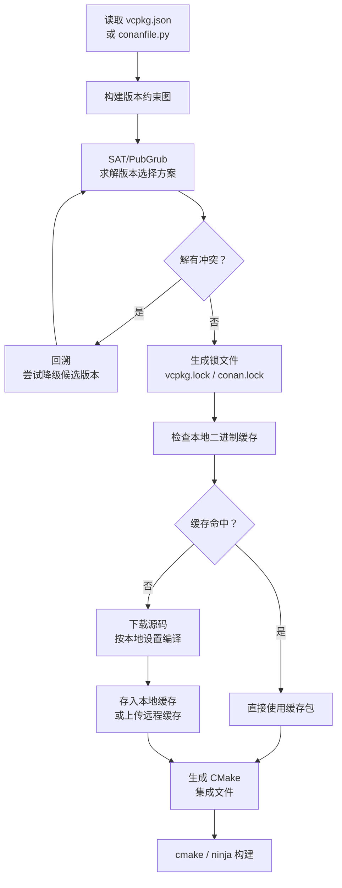

---
tags:
  - build-systems
  - tier3
  - dependency-management
  - vcpkg
  - conan
  - semver
---
# 构建系统的依赖管理

> [!abstract] TL;DR
> C/C++ 生态长期缺乏统一的依赖管理方案，开发者在"手动管理子模块"与"系统包管理器"之间挣扎数十年。vcpkg（微软，manifest 模式）和 Conan（JFrog，二进制缓存）是当前主流答案。语言原生型工具（cargo/npm/pip）比系统型工具（vcpkg/Conan）拥有更好的版本解析一致性，但 C++ ABI 兼容性问题使"二进制包"方案天然更复杂。

## 概述与定位

### C/C++ 依赖管理的历史困境

在 Cargo（2015）和现代 vcpkg/Conan 出现之前，C/C++ 项目的依赖管理经历了以下演化：

1. **手动复制源码**：将第三方库源码放入 `third_party/` 目录，版本升级靠手工 diff
2. **系统包管理器**（`apt`/`brew`/`yum`）：版本由操作系统决定，跨平台一致性极差
3. **Git submodules**：解决了版本固定问题，但构建集成依然需要手动配置
4. **CMake ExternalProject**：在构建期间下载，但无法共享二进制缓存

每种方案都在"可重现性"和"便利性"之间做了不同取舍，没有一种能同时满足：精确版本锁定、跨平台二进制共享、构建系统深度集成、ABI 兼容性保证这四个目标。这正是 C++ 依赖管理至今仍比 Rust/Go 复杂的根本原因——不是工具不够好，而是 C++ 语言本身没有标准 ABI（Application Binary Interface），相同的源码用不同编译器版本、不同标准库版本、甚至不同编译选项编译出来的二进制都可能不兼容。

### 包管理器分类

| 类型 | 代表工具 | 特点 |
|------|---------|------|
| 语言内置型 | cargo / npm / pip / go mod | 与语言工具链深度集成，版本解析一致性好 |
| 系统型（C++专用） | vcpkg / Conan | 处理 ABI 兼容性，支持二进制缓存 |
| 系统型（通用） | apt / brew / nix | 版本由发行版决定，不适合精确锁定 |

语言内置型工具能做到版本解析一致性好，本质原因是它们运行在一个语言单一、ABI 稳定（或根本不存在 ABI 问题，如解释型语言）的上下文中。Cargo 的每个 crate 版本对应一个唯一的编译单元，Rust 的 monomorphization 机制决定了泛型代码按需实例化，不存在"相同符号不同定义"的 ODR（One Definition Rule）违反问题。而 C++ 的 `std::string` 在 libstdc++ 6.0 和 libstdc++ 9.0 之间可能是不同的内存布局，这使得二进制包必须携带"编译环境指纹"。

## 原理与机制

### SemVer 深层语义

语义化版本（Semantic Versioning）规定版本号格式为 `MAJOR.MINOR.PATCH`：

| 变更类型 | 影响版本段 | 含义 |
|---------|----------|------|
| 不兼容 API 变更 | MAJOR | 需要调用方适配 |
| 向后兼容新功能 | MINOR | 可安全升级 |
| 向后兼容 bug 修复 | PATCH | 应当升级 |

各语言生态的版本范围语法对比：

| 语法 | 工具 | 等价范围 |
|------|------|---------|
| `^1.2.3` | Cargo / npm | `>=1.2.3, <2.0.0` |
| `~1.2.3` | Cargo / npm | `>=1.2.3, <1.3.0` |
| `~=1.2.3` | pip (PEP 440) | `>=1.2.3, <1.3.0` |
| `>=1.2.3` | 所有 | 最小版本下界 |
| `==1.2.3` | pip | 精确版本 |

SemVer 的悖论在于：版本号语义是一种承诺，但承诺是否被遵守无法机械验证。一个常见陷阱是所谓的"Hyrum 定律"——任何有足够多用户的 API，其所有可观测行为，包括未文档化的行为，都会被某些用户依赖。因此即使是 PATCH 级别的修复，也可能破坏依赖了原有行为（包括 bug 行为）的下游用户。这解释了为什么 `cargo update`（拉取最新兼容版本）有时仍然会引入回归。

**Pre-release 版本规则**：SemVer 规范规定 pre-release 版本（如 `1.0.0-alpha.1`）在稳定版本比较中优先级低。`1.0.0-alpha.1 < 1.0.0`，且 `^1.0.0` 不会选取 `1.0.0-alpha.1`，只有显式要求 pre-release 才会被选中。这一规则在 Cargo、npm 中都有实现，但 pip 的 PEP 440 命名有所不同（`a1`/`b1`/`rc1` 而非 `-alpha.1`）。

**`0.x.y` 的特殊语义**：`^0.2.3` 等价于 `>=0.2.3, <0.3.0` 而非 `<1.0.0`，因为 SemVer 将 `0.x` 视为"开发阶段，minor 号也可能破坏 API"。这是 Cargo 和 npm 都遵循的规范，但经常被开发者忽略，成为依赖冲突的常见来源。

### 版本求解本质：NP 难与 SAT 问题

依赖图的版本选择问题在理论上是 NP 难的——它可以被规约为布尔可满足性问题（SAT）。直觉上理解：每个包的每个可用版本对应一个布尔变量（选/不选），每条依赖约束对应一组子句，要求"如果选了 A@1.2，则必须选某个满足 `B@^2.0` 的 B 版本"。当依赖图足够复杂时，找到满足所有约束的版本组合需要指数级回溯搜索。

实践中，大多数项目的依赖图并不会触发最坏情况，因为：
1. 版本数量有限（一般每个包的可用版本在数十到数百之间）
2. 约束往往不严格（`^` 允许较宽的范围）
3. PubGrub 等算法有高效的启发式剪枝

但当企业内部维护了数百个内部包、每个包都有精确版本约束时，版本解析耗时可以达到数分钟，这是大型 C++ 项目使用 Conan 时的真实痛点。Conan 2.0 重写了依赖解析引擎来缓解这一问题。

Go 语言的 MVS（Minimum Version Selection）算法是解决依赖求解复杂度的另一条路：它不是"找到满足所有约束的最新版本组合"，而是"取每个约束中所有要求的版本中最小值的上界"，总是选择能满足约束的最低版本。MVS 的时间复杂度是线性的，完全避免了回溯，且结果是确定性的（不依赖包发布顺序）。代价是可能选到过旧的版本（安全修复未被纳入），以及不支持像 Cargo `^1` 这样的"宽泛约束"——Go 模块始终使用精确最低版本约束。

### 锁文件（Lock File）的可重现构建作用

锁文件是"在某个时间点运行包管理器时得到的版本选择结果的快照"。它的作用是将"依赖解析"与"依赖安装"解耦：首次解析后生成锁文件，后续安装直接使用锁文件，跳过重新解析，同时保证所有环境安装相同的版本。

没有锁文件的构建是"浮动的"：`npm install` 在今天和三个月后可能安装不同版本的传递依赖，因为期间某个传递依赖发布了新版本。这类构建漂移（build drift）是 CI"在我机器上好好的"问题的主要来源之一。

各工具的锁文件对比：

| 工具 | 锁文件名 | 内容 |
|------|---------|------|
| Cargo | `Cargo.lock` | 版本 + 来源 URL + SHA-256 哈希 |
| npm | `package-lock.json` | 版本 + 完整性哈希（SRI） |
| pip | `requirements.txt`（通过 pip-compile 生成） | 版本 + 哈希 |
| Conan | `conan.lock` | 版本 + profile 指纹 |
| vcpkg | `vcpkg.json` baseline | Git commit SHA |

哈希固定（hash pinning）是锁文件安全性的核心：即使攻击者替换了仓库上同名同版本的包内容，哈希校验也会失败，防止供应链投毒。这要求锁文件必须提交到版本控制，并在 CI 中验证锁文件与实际安装一致（`npm ci` 而非 `npm install`，`pip install --require-hashes` 等）。

### vcpkg vs Conan 的 ABI 兼容问题

C++ 二进制包的"ABI 指纹"包含以下维度：
- 编译器及版本（GCC 12 vs GCC 13）
- C++ 标准库（libstdc++ vs libc++）
- C++ 标准版本（C++17 vs C++20）
- 异常处理模型（`-fexceptions` vs `-fno-exceptions`）
- Debug/Release 模式
- 目标架构（x86_64 vs aarch64）

**vcpkg** 的策略是"从源码编译"——vcpkg 默认不分发预编译二进制，而是在用户机器上根据当前工具链编译所有依赖。这规避了 ABI 兼容性问题（因为所有库都用相同工具链编译），但代价是首次安装耗时（编译 Boost 可能需要 20 分钟）。vcpkg 的"binary caching"功能允许将编译结果缓存到 NuGet/Azure Artifacts/GitHub Actions Cache，后续复用。

**Conan** 则通过 Profile 系统显式管理 ABI 指纹：每个 Profile 文件描述编译器版本、标准库、编译选项等，Conan 以 Profile 哈希作为二进制包缓存的 key。如果远程缓存中有与当前 Profile 匹配的预编译包，直接下载；否则从源码编译。这使 Conan 在企业环境中能实现真正的"二进制包复用"——CI 服务器编译一次，所有开发者直接拉取。

两者的本质差异：vcpkg 优先保证正确性（从源码编译消除 ABI 歧义），Conan 优先保证效率（预编译二进制包）。选型时，跨平台项目且团队对 ABI 理解不深时倾向 vcpkg；企业内固定工具链、追求 CI 速度时倾向 Conan。

### 依赖地狱与钻石依赖解决策略

**钻石依赖**（Diamond Dependency）是指：A 依赖 B 和 C，B 依赖 D@1.0，C 依赖 D@2.0，此时 D 出现了两个版本要求。解决策略：

- **允许多版本共存**（npm/Cargo）：B 和 C 各自链接自己需要的 D 版本。代价是二进制大小增加，且若 D 有全局状态（单例、内存分配器），多版本会导致未定义行为
- **强制单一版本**（Go modules 的 MVS 策略）：选择所有约束中满足的最低版本（Minimum Version Selection）。MVS 保证结果确定且无需回溯，但可能选到过旧的版本
- **报告冲突让用户解决**（pip 的默认行为）：提示用户手动指定约束

Cargo 允许不同 major 版本的 crate 同时存在（如 `serde 1.x` 和 `serde 0.9.x` 可共存），但同一 major 版本只能有一个。`cargo tree --duplicates` 会列出存在多版本的 crate，这通常意味着某条依赖链还未升级到最新主版本。传递依赖冲突的排查流程：先用 `cargo tree -p conflicting-crate` 查看所有引用它的路径，再决定是升级直接依赖、还是通过 `[patch.crates-io]` 暂时覆盖版本。

### 私有仓库优先级配置

企业环境中私有仓库的优先级配置是安全关键点（与依赖混淆攻击直接相关）：

```toml
# Cargo：.cargo/config.toml 中配置替换源，完全屏蔽公共仓库
[source.crates-io]
replace-with = "internal-registry"

[source.internal-registry]
registry = "https://crates.example.com/index"
```

此配置让 `crates-io` 完全替换为内部仓库，而非两个仓库并存合并搜索——这是与 pip 的 `extra-index-url`（双仓库并存）的根本区别，也是为什么 Cargo 的混淆攻击面比 pip 小的原因。

## 结构/算法/伪代码详解

### vcpkg manifest 模式示例

```json
// vcpkg.json —— manifest 模式（推荐，类似 Cargo.toml）
{
  "name": "my-project",
  "version": "1.0.0",
  "dependencies": [
    "boost-filesystem",
    "nlohmann-json",
    {
      "name": "openssl",
      "version>=": "3.1.0"
    },
    {
      "name": "fmt",
      "features": ["unicode"]
    }
  ],
  "builtin-baseline": "2024.01.12",
  "overrides": [
    {
      "name": "zlib",
      "version": "1.3.1"
    }
  ]
}
```

```bash
# 安装所有 manifest 依赖
vcpkg install

# 集成到 CMake
vcpkg integrate cmake
# 或者在 CMake 命令行中传递 toolchain
cmake -B build -DCMAKE_TOOLCHAIN_FILE=/path/to/vcpkg/scripts/buildsystems/vcpkg.cmake
```

### Conan conanfile.py 示例

```python
# conanfile.py —— Python 脚本格式，支持动态逻辑
from conan import ConanFile
from conan.tools.cmake import CMakeToolchain, CMakeDeps, cmake_layout

class MyProjectConan(ConanFile):
    name = "my-project"
    version = "1.0.0"
    settings = "os", "compiler", "build_type", "arch"
    
    requires = [
        "boost/1.83.0",
        "openssl/3.1.4",
        "fmt/10.2.1",
    ]
    
    tool_requires = [
        "cmake/3.27.0",
        "ninja/1.11.1",
    ]
    
    def layout(self):
        cmake_layout(self)
    
    def generate(self):
        tc = CMakeToolchain(self)
        tc.generate()
        deps = CMakeDeps(self)
        deps.generate()
```

```bash
# 安装依赖并生成 CMake 集成文件
conan install . --output-folder=build --build=missing

# 创建并上传包到本地缓存
conan create . --profile=release

# 查看依赖图
conan graph info .
```

### CMake 集成示例

```cmake
# CMakeLists.txt —— 结合 vcpkg 或 Conan
cmake_minimum_required(VERSION 3.20)
project(MyProject)

# vcpkg 模式：通过 toolchain 自动设置
find_package(fmt CONFIG REQUIRED)
find_package(OpenSSL REQUIRED)
find_package(nlohmann_json CONFIG REQUIRED)

add_executable(my-app src/main.cpp)
target_link_libraries(my-app PRIVATE
    fmt::fmt
    OpenSSL::SSL
    nlohmann_json::nlohmann_json
)
```

### 依赖解析流程 Mermaid



## 工具视角与实战

### pip-compile 锁文件（Python 生态）

```bash
# requirements.in —— 只写直接依赖
django>=4.2
celery[redis]
psycopg2-binary

# 生成精确锁文件（包含所有传递依赖的精确版本+哈希）
pip-compile requirements.in --generate-hashes -o requirements.txt

# 安装锁定版本
pip install -r requirements.txt
```

### vcpkg port 系统与 overlay

vcpkg 的每个"port"是一个包含 `portfile.cmake`（构建脚本）和 `vcpkg.json`（元数据）的目录。用户可以创建自定义 overlay port 覆盖官方版本：

```bash
# 使用自定义 overlay port
vcpkg install mylib --overlay-ports=./my-ports

# 查看可用包
vcpkg search fmt

# 列出已安装包
vcpkg list
```

vcpkg 的 overlay port 机制是其企业定制能力的核心。当官方 port 版本不满足需求（如需要私有补丁，或官方版本过新引入不兼容），可以在 `my-ports/libname/` 目录放置自定义 `portfile.cmake` 和 `vcpkg.json`，这些自定义 port 会优先于 vcpkg 内置的版本被选取。这比 Conan 的方案（需要创建并上传一个完整的 Conan 包配方）轻量得多，适合需要频繁打补丁的企业场景。

### Conan 二进制包缓存

Conan 的核心优势是**二进制包缓存**：同一版本的包针对不同的 `settings`（编译器/ABI/平台）组合缓存独立的二进制，避免重复编译：

```bash
# 上传到企业内部 Conan 服务器（Artifactory）
conan remote add mycompany https://artifactory.example.com/artifactory/api/conan/conan-local
conan upload "boost/1.83.0" -r mycompany --all

# 下载预编译二进制（若服务器有对应 profile 的包）
conan install . -r mycompany
```

Conan 的 `--build=missing` 标志是实践中的关键参数：它告诉 Conan，若远程缓存中没有匹配当前 profile 的预编译包，则从源码构建。在 CI 初始化阶段，通常需要 `--build=missing` 来"预热"缓存；日常开发则不应使用此标志（否则每次 profile 变化都会触发重新编译）。

## 安全性与正确使用

### 依赖混淆攻击（Dependency Confusion）

依赖混淆攻击由 Alex Birsan 于 2021 年首次公开披露。攻击原理：

1. 攻击者发现目标公司在内部仓库中使用名为 `company-internal-lib` 的私有包（通过泄露的 `package.json`/`requirements.txt` 等）
2. 攻击者向 **公共仓库**（PyPI/npm/crates.io）上传同名但版本号更高的恶意包
3. 包管理器的默认行为是**优先选择版本号最高的包**，且公共仓库优先级往往高于私有仓库
4. 开发者/CI 环境安装时自动拉取了恶意包

**不同工具的漏洞敞口差异**：

- **pip + extra-index-url**：两个仓库合并搜索，取最高版本，攻击窗口最大
- **npm + 无 scope**：类似 pip，公共仓库与私有仓库合并，高版本胜出
- **npm + scoped package（`@mycompany/xxx`）**：仅查询 scope 对应的私有仓库，攻击者无法在公共 npm 注册一个正式 `@mycompany/xxx` 包（scope 属于 org），攻击窗口关闭
- **Cargo + source replacement**：完全替换 crates-io，不存在"双仓库合并"问题
- **vcpkg**：默认从 GitHub 的 vcpkg ports 仓库拉取配方，内部库通过 overlay 覆盖而非注册到公共仓库，天然无混淆问题

**防御措施**：

```toml
# pip: 在 pip.conf 中强制使用私有仓库（index-url 优先）
[global]
index-url = https://artifactory.example.com/pypi/simple/
extra-index-url = https://pypi.org/simple/
# 注意：extra-index-url 的包会与 index-url 合并版本比较！
# 更安全的方案：完全不使用 extra-index-url，走代理镜像
```

```json
// npm: 在 .npmrc 中为内部包配置 scope 锁定
@mycompany:registry=https://npm.example.com/
```

```bash
# Cargo: 在 .cargo/config.toml 中配置 source replacement
[source.crates-io]
replace-with = "vendored-sources"

[source.vendored-sources]
directory = "vendor"
```

### 哈希固定

所有现代锁文件机制都支持内容哈希固定：

```
# Cargo.lock 中的哈希示例
[[package]]
name = "serde"
version = "1.0.197"
source = "registry+https://github.com/rust-lang/crates.io-index"
checksum = "3fb1c873e1b9b056a4dc4c0c198b24c3ffa059243875552b2bd0933b1aee4ce2"
```

哈希固定确保即使攻击者替换了同版本号的包内容，校验也会失败。

### 供应链审计工具

```bash
# Cargo
cargo audit                     # RustSec 漏洞数据库
cargo deny check licenses       # 许可证合规检查

# npm
npm audit
npm audit --json | jq '.vulnerabilities'

# Python
pip-audit                       # 查询 PyPI Advisory Database
safety check -r requirements.txt
```

## 小结

依赖管理是现代软件工程的基础设施。语言内置型工具（Cargo/npm/pip）在其生态内提供了最佳体验；C++ 生态由于历史包袱和 ABI 复杂性，vcpkg 和 Conan 各有侧重——vcpkg 以与 CMake 的无缝集成和"源码编译保正确性"见长，Conan 以可编程的 conanfile.py 和企业级二进制缓存见长。依赖版本求解在理论上是 NP 难问题，但现代工具（PubGrub/MVS）通过智能启发式在实践中将平均复杂度降到可接受范围；Go 的 MVS 用"选最低满足版本"的线性算法彻底规避了回溯问题，是另一种值得借鉴的设计思路。无论使用哪种工具，**锁文件提交 + 哈希固定 + 私有仓库隔离（而非合并）** 是防范供应链攻击的基本三件套，其中"隔离"比"优先级"更安全——完全屏蔽公共仓库的 Cargo source replacement 策略比 pip 的 extra-index-url 策略安全得多。

## 相关阅读

- [vcpkg 官方文档](https://learn.microsoft.com/en-us/vcpkg/)
- [Conan 2.0 文档](https://docs.conan.io/)
- [Dependency Confusion 攻击论文（Alex Birsan）](https://medium.com/@alex.birsan/dependency-confusion-4a5d60fec610)
- [PEP 440 版本规范](https://peps.python.org/pep-0440/)

---
[[00.构建系统横向对比总览|⬆ 系列总览]] | [[08.Cargo与Rust构建系统|← 上一章]] | [[10.增量构建与缓存机制|→ 下一章]]
