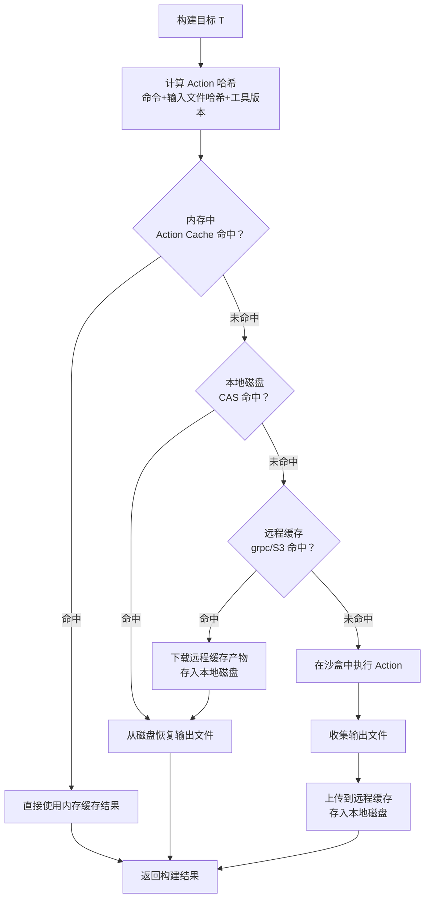

---
tags:
  - build-systems
  - tier3
  - incremental-build
  - cache
  - ccache
  - sccache
  - bazel
---
# 增量构建与缓存机制

> [!abstract] TL;DR
> 增量构建通过跳过未变更目标的重新编译来缩短构建时间。三种主流策略在精确度上递增：mtime 比较（Make）→ 内容哈希（Ninja/ccache）→ Action Graph Hash（Bazel）。缓存污染和远程缓存认证是安全层面需重点关注的风险。ccache 适合单机 C/C++ 场景，sccache 支持远程 S3/GCS 存储，Bazel 提供端到端可重现的沙盒缓存。

## 概述与定位

### 增量构建的价值

在大型项目中，全量构建可能需要数十分钟乃至数小时。增量构建的目标是在代码变更后，仅重新构建受影响的目标：

| 项目规模 | 全量构建 | 增量构建（单文件改动） |
|---------|---------|-------------------|
| 小型（<10万行） | 30s | <5s |
| 中型（~100万行） | 5min | 10-30s |
| 大型（>1000万行） | 30-60min | 1-5min |

### 全量 vs 增量的权衡

增量构建并非没有代价：
- **误判风险**：依赖跟踪不完整时，可能遗漏应该重建的目标（脏构建）
- **维护成本**：精确的依赖图需要工具或用户显式声明
- **调试复杂度**：增量构建结果异常时，`clean` 后全量重建是常见的排查手段

"脏构建"（dirty build）是增量构建的最危险失效模式：因为依赖关系追踪遗漏，某个目标的输出看似最新，实则是基于过时输入编译的。脏构建不会报错，只会产生行为异常的二进制——这类 bug 极难定位，常被误认为"编译器 bug"或"随机故障"。Make 的 mtime 策略和 Bazel 的 Action Hash 策略在脏构建风险上存在量级差异：Make 的手写规则容易遗漏头文件依赖，而 Bazel 的沙盒执行从根本上消除了隐式依赖遗漏的可能，因为沙盒环境中只有显式声明的输入文件可见。

## 原理与机制

### 三种失效检测策略详细对比

#### 策略一：mtime 比较（Make）

Make 检查目标文件的最后修改时间（mtime）是否晚于所有依赖文件的 mtime：

```makefile
output.o: input.c header.h
    gcc -c input.c -o output.o
```

若 `input.c` 的 mtime > `output.o` 的 mtime，则重新编译。

**局限性**：
- `touch input.c` 即可触发不必要的重建（mtime 变化但内容不变）
- 网络文件系统上的 mtime 精度问题
- 无法检测编译器选项变化（`-O0` 换 `-O2` 后不会重建）
- 跨机器的构建缓存共享无法使用

**时间戳陷阱（clock skew）**：在分布式环境或 NFS 挂载的文件系统中，不同机器的系统时钟可能不同步。如果构建机器的时钟比文件服务器快，可能出现"目标文件的 mtime 新于刚创建的源文件 mtime"的情形，导致 Make 错误地跳过应该重建的目标。反之，时钟慢时又会触发不必要的全量重建。Git 的做法是在 checkout 时将所有文件 mtime 设为当前时间，这会让 Make 在 git checkout 后触发完整重建，是刻意设计的正确行为——不如此则 Make 可能用旧的构建产物当作"最新的"而跳过重建。`touch` 命令也是一个常见的误操作来源：开发者有时 `touch` 某个文件来"强制重建"，但在 Ninja/ccache 环境下，touch 不改变文件内容，哈希不变，缓存仍然命中，达不到预期效果。

#### 策略二：内容哈希（Ninja/ccache）

ccache 对编译器输入进行哈希，包括：
- 预处理后的源文件内容（展开所有 `#include`）
- 编译器版本字符串
- 编译选项（`CFLAGS`）

仅当哈希值变化时才重新编译，与 mtime 无关。

```
缓存键 = Hash(预处理源码 || 编译器版本 || 编译选项 || 目标架构)
```

**ccache 的两种操作模式**是理解其性能特征的关键：

**Preprocessor mode（预处理模式，默认）**：ccache 先调用编译器的预处理器（`-E`），将所有 `#include` 展开、宏替换，得到完整的翻译单元文本，再对该文本计算哈希。优点是哈希精确——如果某个头文件内容没变（即使 mtime 变了），哈希不变，缓存命中。缺点是每次都要运行预处理步骤，有约 10-30% 的额外时间开销。当预处理之后哈希命中（`cache hit (preprocessed)`），ccache 直接返回缓存的 `.o` 文件，不需要调用真正的编译器。

**Direct mode（直接模式）**：ccache 记录上一次编译时哪些头文件被包含及其内容哈希（存在 manifest 文件中），直接检查这些文件是否变化，无需执行预处理。命中时（`cache hit (direct)`）速度显著更快（可从数百毫秒降到数十毫秒），但首次编译或头文件集合变化时需要退回预处理模式生成新 manifest。命中率统计中 `cache hit (direct)` 越高越好；若大量 `cache hit (preprocessed)` 而 `direct` 极少，说明 manifest 失效频繁，可能是头文件频繁增删导致的。

开启 Direct mode：`export CCACHE_DIRECT=1`（或 `ccache.conf` 中 `direct_mode = true`）。

**`__DATE__` / `__TIME__` 的特殊处理**：ccache 能检测源文件中是否使用了这两个宏。若检测到，ccache 会将该编译单元标记为"时间戳敏感"，不纳入缓存（否则今天缓存的 `.o` 明天还会命中，但里面嵌入的时间戳是错误的）。这是 ccache 自动处理的正确行为，但会导致含 `__DATE__` 的文件永远缓存未命中。修复方法是用 `SOURCE_DATE_EPOCH` 替代，或通过 `CCACHE_SLOPPINESS=time_macros` 强制忽略时间宏差异（仅当确信时间差异不影响正确性时使用）。

#### 策略三：Action Graph Hash（Bazel）

Bazel 在内容哈希基础上进一步引入 **Action**（构建动作）的概念：

```
Action = {
    命令行: ["gcc", "-c", "input.c", "-O2", "-o", "output.o"],
    输入文件: {input.c: sha256(...), header.h: sha256(...)},
    环境变量: {...},
    工具版本: {gcc: "12.3.0"}
}
Action哈希 = SHA256(serialize(Action))
```

Bazel 在沙盒环境中执行 Action，完全隔离系统环境，确保相同 Action 哈希在任何机器上产生相同输出（**完全可重现**）。

**Bazel Action Cache Key 的完整组成**：Action 哈希不仅包含输入文件的内容哈希，还包含：命令行参数（每个字节都纳入）、执行平台（os/cpu/toolchain 版本）、显式声明的环境变量（未声明的变量被沙盒过滤，这是与 ccache 的关键差异——ccache 无法检测到环境变量中编译行为的隐式变化，而 Bazel 强制要求显式声明所有影响输出的环境变量）、以及构建依赖工具（如 protoc）的版本哈希。这确保了当 protobuf 编译器版本升级时，所有依赖其输出的 targets 都会失效并重新构建。

Bazel 使用 **Merkle tree** 表示输入文件集合：每个文件哈希为叶节点，目录内容（文件名 + 哈希列表）递归哈希为目录节点，最终形成根哈希。这使得在分布式场景（远程执行，见 ch11）中，Worker 只需检查根哈希是否已在本地 CAS 中，若已有则无需传输任何文件，实现精确的 delta 传输。

### 三种策略正确性与性能的权衡

| 特性 | Make (mtime) | ccache (内容哈希) | Bazel (Action哈希) |
|------|------------|-----------------|-------------------|
| 检测内容变化 | ✗ | ✓ | ✓ |
| 检测编译选项变化 | ✗ | ✓ | ✓ |
| 检测环境变量变化 | ✗ | ✗（部分） | ✓（显式声明） |
| 跨机器共享缓存 | ✗ | 部分支持 | ✓ |
| 完全可重现 | ✗ | ✗ | ✓ |
| 配置复杂度 | 低 | 中 | 高 |
| 脏构建风险 | 高 | 中 | 极低 |

mtime 策略的"性能换正确性"是最极端的——它在正确性上妥协最多，但配置成本最低。ccache 的内容哈希在正确性上大幅优于 mtime，且对已有 CMake/Make 项目的侵入性极低（只需设置 `CMAKE_*_COMPILER_LAUNCHER`）。Bazel 的 Action Hash + 沙盒在正确性上几乎无懈可击，但需要重写构建描述文件（`BUILD` 文件），迁移成本高。

### 缓存失效的根本原因

缓存失效（Cache Invalidation）是计算机科学的经典难题。在构建系统中，常见原因：

1. **隐式依赖**：源文件依赖了未被显式声明的头文件或系统库
2. **环境差异**：编译器路径、系统头文件版本、环境变量未纳入哈希
3. **时间戳注入**：代码中使用 `__DATE__`/`__TIME__` 宏导致每次构建哈希不同
4. **非确定性工具**：某些工具输出含随机性（UUID、地址随机化），破坏哈希稳定性

**sccache 的分布式缓存后端**：sccache 支持 Amazon S3、Google Cloud Storage、Azure Blob Storage 和 Redis 作为远程缓存后端。其工作方式与 ccache 类似（内容哈希），但缓存存储在云端，团队所有成员和 CI 服务器共享同一缓存池。sccache 还支持 Rust 编译缓存（通过拦截 `rustc` 调用），而 ccache 仅支持 C/C++/Objective-C。在实际部署中，sccache 的 S3 后端对于 CI 场景效果显著：CI 的每个 PR 构建可以从主分支构建的缓存中复用大量编译产物，将首次构建时间从数十分钟压缩到数分钟。

## 结构/算法/伪代码详解

### ccache 配置示例

```bash
# 安装
apt install ccache         # Debian/Ubuntu
brew install ccache        # macOS

# 环境变量配置（加入 ~/.bashrc 或 ~/.zshrc）
export CCACHE_DIR="$HOME/.ccache"
export CCACHE_MAXSIZE="10G"
export CCACHE_COMPRESS=1
export CCACHE_COMPRESSLEVEL=6

# 将 ccache 包装器置于 PATH 前端
export PATH="/usr/lib/ccache:$PATH"
# 或者使用 CMake 集成
cmake -B build -DCMAKE_C_COMPILER_LAUNCHER=ccache \
               -DCMAKE_CXX_COMPILER_LAUNCHER=ccache

# 查看缓存统计
ccache -s
# cache directory                     /home/user/.ccache
# primary config                      /home/user/.ccache/ccache.conf
# cache hit (direct)                  1523
# cache hit (preprocessed)            234
# cache miss                          456
# files in cache                      3891
# cache size                          2.3 GB / 10.0 GB
```

### sccache 远程 S3 配置

```bash
# 安装（Rust 编写，支持远程缓存）
cargo install sccache
# 或下载预编译二进制
curl -L https://github.com/mozilla/sccache/releases/latest/download/sccache-v0.7.7-x86_64-unknown-linux-musl.tar.gz | tar xz

# S3 远程缓存配置（环境变量）
export SCCACHE_BUCKET="my-build-cache"
export SCCACHE_REGION="us-east-1"
export SCCACHE_S3_USE_SSL=true
# AWS 凭证通过 AWS_ACCESS_KEY_ID / AWS_SECRET_ACCESS_KEY 或 IAM Role 提供

# GCS 配置
export SCCACHE_GCS_BUCKET="my-gcs-cache"
export SCCACHE_GCS_RW_MODE=READ_WRITE

# 集成到 CMake
cmake -B build -DCMAKE_C_COMPILER_LAUNCHER=sccache \
               -DCMAKE_CXX_COMPILER_LAUNCHER=sccache

# 查看统计
sccache --show-stats
```

### Bazel 本地缓存配置

```bash
# .bazelrc —— 项目级 Bazel 配置
# 本地磁盘缓存
build --disk_cache=/tmp/bazel-disk-cache

# 远程缓存（只读模式，不上传）
build --remote_cache=grpcs://cache.example.com:443
build --remote_cache_compression=true

# 本地缓存大小限制
build --local_cache_size_mb=10240

# 显示缓存命中/未命中统计
build --show_progress_rate_limit=0.5
build --experimental_remote_cache_async
```

### Make 自动依赖生成（`.d` 文件）

手写 `Makefile` 时，使用 GCC 的 `-MMD -MP` 选项自动生成头文件依赖：

```makefile
# Makefile
CC = gcc
CFLAGS = -Wall -O2 -MMD -MP   # -MMD 生成 .d 文件，-MP 为每个头文件添加伪目标

SRCS = main.c utils.c parser.c
OBJS = $(SRCS:.c=.o)
DEPS = $(SRCS:.c=.d)

-include $(DEPS)   # 包含自动生成的依赖文件（- 表示文件不存在时不报错）

%.o: %.c
	$(CC) $(CFLAGS) -c $< -o $@

program: $(OBJS)
	$(CC) $(OBJS) -o $@
```

生成的 `main.d` 内容示例：
```makefile
main.o: main.c utils.h config.h
utils.h:
config.h:
```

`-MMD` 的工作原理是让 GCC 在预处理阶段记录所有被 `#include` 的文件路径，并将这张依赖表输出为 `.d` 文件（Makefile 片段格式）。`-include $(DEPS)` 将这些片段纳入主 Makefile，使 Make 在下次运行时能感知到头文件变化。`-MP` 为每个头文件添加一个空的伪目标，防止在头文件被删除后 Make 因找不到依赖而报错（伪目标使 Make 将其视为"已满足"）。这是弥补 Make mtime 策略"无法自动发现头文件依赖"缺陷的标准补丁，但依然无法追踪编译器版本变化或编译选项变化。

### 缓存决策树 Mermaid



## 工具视角与实战

### ccache 统计分析与命中率调优

```bash
# 详细统计
ccache -sv

# 清空统计计数（不删除缓存内容）
ccache -z

# 清空全部缓存
ccache -C

# 查找缓存中的条目（调试用）
CCACHE_DEBUG=1 ccache gcc -c test.c
```

**命中率分析实践**：理想状态下，稳定代码库的 ccache 命中率应超过 80%。若命中率低，常见排查思路：

- **检查 `CCACHE_BASEDIR`**：若不同机器/CI 环境的源码路径不同（`/home/user/proj` vs `/workspace/proj`），编译产物中嵌入的路径会不同，导致哈希不匹配。设置 `CCACHE_BASEDIR` 为源码根目录，让 ccache 将绝对路径替换为相对路径再计算哈希，可使跨路径缓存复用成为可能。
- **检查是否启用了 Direct mode**：`ccache -s | grep "cache hit (direct)"` 若全为 0，说明 manifest 机制未生效
- **检查 `__DATE__`/`__TIME__` 使用**：`grep -r '__DATE__\|__TIME__' src/ --include="*.c" --include="*.cpp"` 找出永远无法缓存的文件，考虑用 `SOURCE_DATE_EPOCH` 替代
- **检查 PCH（预编译头）**：PCH 通常含有绝对路径，会破坏跨路径缓存复用，需要特殊配置

### Bazel 缓存分析

```bash
# 查看输出目录位置
bazel info output_base
bazel info output_path

# 显示每个 action 的缓存状态（命中 H / 未命中 M）
bazel build //... --explain=/tmp/bazel-explain.log
cat /tmp/bazel-explain.log | grep "^  Reason:"

# 强制清空并全量重建
bazel clean
bazel clean --expunge   # 同时清空远程缓存条目的本地引用
```

### Ninja 调试

```bash
# 显示实际执行的命令（而非摘要）
ninja -v

# 显示依赖关系
ninja -t deps output.o

# 显示构建图（需要 dot/graphviz）
ninja -t graph | dot -Tsvg -o build-graph.svg

# 模拟执行（不实际运行，只显示哪些目标会重建）
ninja -n
```

## 安全性与正确使用

### 缓存污染攻击

若远程缓存服务器遭到入侵，攻击者可以：
1. 将恶意构建产物（含后门的 `.so` / 可执行文件）写入缓存
2. 当其他开发者或 CI 构建时，缓存命中直接下载并使用恶意产物，绕过源码审计

**防御措施**：
- 对所有远程缓存连接强制使用 mTLS 双向认证
- 生产构建不使用远程缓存的写权限（只读模式）
- 定期轮换缓存密钥并清空缓存

缓存污染的危险性在于它绕过了代码审查——被污染的缓存中的恶意二进制不需要对应的恶意源码，所以 SAST（静态分析）扫描源码不能发现此类攻击。SLSA（见 ch12）的 L3 要求通过"构建可重现性验证"来对抗这类攻击：如果构建是完全可重现的，可以在隔离环境中重新构建并与缓存产物的哈希比对，不一致时立即警报。Bazel 的沙盒执行 + Action Hash 机制使得可重现构建成为默认行为，而非需要额外投入才能实现的目标。

### 远程缓存认证配置

```bash
# Bazel 使用 mTLS 认证远程缓存
build --remote_cache=grpcs://cache.example.com:443
build --tls_client_certificate=/etc/ssl/client.crt
build --tls_client_key=/etc/ssl/client.key
build --tls_certificate=/etc/ssl/ca.crt

# 使用 Google Cloud IAM 令牌
build --google_default_credentials=true
build --remote_cache=grpcs://remotebuildexecution.googleapis.com

# sccache S3 使用 IAM Role（推荐，无需明文密钥）
# 在 EC2/ECS 上使用实例角色，自动获取临时凭证
```

### 哈希冲突概率

SHA-256 碰撞概率（生日攻击）：
- 在 $n = 10^{12}$（万亿）个构建产物的情况下，SHA-256 碰撞概率约为 $10^{-54}$，在工程实践中可忽略不计
- ccache 默认使用 MD4（速度快），但在安全敏感场景可配置 `hash_dir = true` 启用更强哈希

## 小结

增量构建策略的选择应与项目规模匹配：小型 C/C++ 项目用 ccache 即可立竿见影；中大型项目引入 sccache 共享团队缓存；超大型单仓（monorepo）则需要 Bazel 的 Action Graph Hash + 沙盒执行才能保证正确性和可重现性。Make 的 mtime 策略在现代大型项目中已经过时，应仅在极简脚本场景保留。时间戳陷阱（clock skew、touch 误触发、`__DATE__` 宏注入）是 mtime 和内容哈希策略各自最具代表性的边界情形，理解这些陷阱有助于在实践中选择正确的策略层级。ccache 的 Direct mode 与 Preprocessor mode 的区别体现了"速度换精确度"的经典工程权衡——在大型项目中 Direct mode 的性能收益显著，但需要理解其局限性才能正确配置。缓存污染攻击说明了"高效缓存"和"安全供应链"之间的张力，mTLS 认证和只读模式是远程缓存的最低安全基线。

## 相关阅读

- [ccache 官方文档](https://ccache.dev/documentation.html)
- [sccache GitHub](https://github.com/mozilla/sccache)
- [Bazel Remote Caching](https://bazel.build/remote/caching)
- [Ninja Build —— 依赖跟踪设计](https://ninja-build.org/manual.html#_dependencies)

---
[[00.构建系统横向对比总览|⬆ 系列总览]] | [[09.构建系统的依赖管理|← 上一章]] | [[11.分布式构建与远程执行|→ 下一章]]
