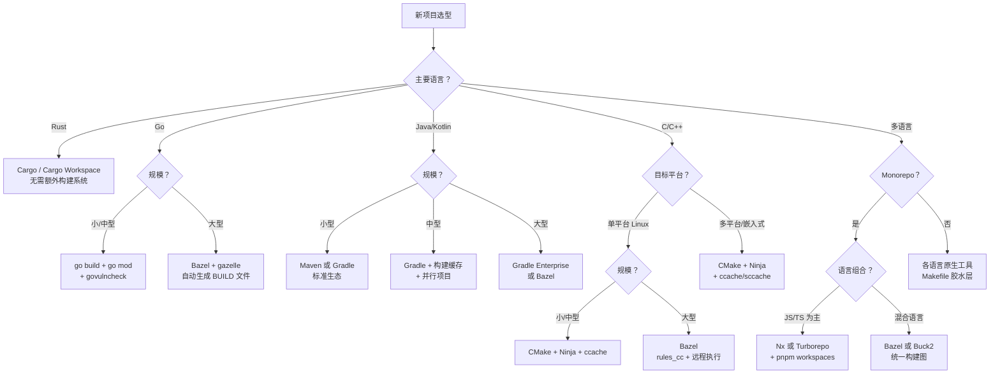

---
tags:
  - build-systems
  - tier3
  - performance
  - profiling
  - tooling-selection
---
# 构建系统性能优化与实战选型

> [!abstract] TL;DR
> 构建性能是开发效率的核心瓶颈。构建时间由前端解析、依赖解析、编译、链接和 IO 五段组成，各段的优化手段不同。Amdahl 定律决定了并行化的理论上限：链接等强串行步骤无法通过增加 CPU 核数线性加速。实战选型应综合考量项目规模、语言生态、团队规模和基础设施投入，避免"选型过重"或"选型过轻"两类错误。

## 概述与定位

### 构建性能为何重要

开发者平均每天触发 10-50 次构建。若每次构建等待时间从 5 分钟缩短到 30 秒：

```
节省时间 = (5min - 0.5min) × 50次/天 × 250工作日 × 团队人数
         = 4.5 × 50 × 250 = 56,250 分钟/人/年 ≈ 938 小时/人/年
```

对于 20 人团队，这相当于每年节省约 **10 个人月**的工程时间。

### 选型失误的代价

| 失误类型 | 现象 | 代价 |
|---------|------|------|
| 选型过轻 | 用 Make 管理 100 万行 C++ | 构建速度慢，依赖追踪不准确，CI 不稳定 |
| 选型过重 | 用 Bazel 管理 3 人小项目 | 学习曲线陡峭，`BUILD` 文件维护成本高 |
| 生态不匹配 | 用 Makefile 构建 JVM 项目 | 绕过了 Maven/Gradle 的依赖管理生态 |
| 工具链割裂 | 同一仓库混用 Make + CMake + Gradle | 增量构建跨边界失效，工具链维护成本翻倍 |

## 原理与机制

### 构建时间的组成分析

一次典型的 C++ 项目构建时间分解：

```
总构建时间
├── 前端解析（约 5-15%）
│   ├── Makefile/CMakeLists.txt 解析
│   └── 依赖图构建（目标 DAG）
├── 依赖解析（约 2-8%）
│   └── 包管理器版本求解（vcpkg/Conan）
├── 预处理+编译（约 40-65%，可高度并行）
│   ├── #include 展开（头文件密集项目可占编译 50%）
│   └── 代码生成+优化（-O2/-O3 时显著增加）
├── 链接（约 15-40%，**近乎串行**）
│   ├── 全程序链接（LTO 时尤其耗时）
│   └── 符号解析
└── IO 操作（约 5-15%）
    ├── 读取源文件和头文件
    └── 写入目标文件和最终产物
```

### Amdahl 定律在并行构建中的应用

Amdahl 定律描述了并行化的理论加速上限：

$$S(n) = \frac{1}{(1-p) + \frac{p}{n}}$$

其中 $p$ 为可并行部分占比，$n$ 为处理器数量。

实际示例（链接占总时间 30% 且无法并行）：
- $p = 0.7$（编译部分可并行）
- $1-p = 0.3$（链接串行部分）
- 使用 32 核：$S = 1/(0.3 + 0.7/32) ≈ 2.9$（理论最大加速 2.9 倍）
- 使用 128 核：$S = 1/(0.3 + 0.7/128) ≈ 3.2$（收益递减明显）

**结论**：优化链接步骤（ThinLTO / 增量链接 / 分布式链接）往往比增加 CPU 核数更有效。

### 并行度调优策略

```bash
# 自动检测 CPU 核数
NPROC=$(nproc)            # Linux
NPROC=$(sysctl -n hw.ncpu)  # macOS

# Make：-j 并行作业数
make -j $(nproc)
# 经验值：CPU 密集型编译用 nproc，内存密集型（LTO/链接）用 nproc/2

# Ninja：默认自动使用所有核心
ninja                     # 自动并行
ninja -j 8                # 显式指定

# Bazel：本地并行 + 作业限制
bazel build //... --jobs=$(nproc) --local_ram_resources=HOST_RAM*.8

# 分离 CPU 密集型（编译）和内存密集型（链接）Pool
# Bazel 的 execution_group 机制
```

## 结构/算法/伪代码详解

### 性能优化清单

#### 并行度优化

```bash
# 1. 确认当前并行度是否充分利用 CPU
# 在构建期间监控 CPU 使用率
vmstat 1 | awk '{print $13"%"}' &  # Linux

# 2. 分离编译和链接的并行度（Bazel）
# BUILD 文件中为链接目标设置独立资源约束
cc_binary(
    name = "my-app",
    ...
    exec_properties = {
        "mem": "8g",   # 链接需要大内存
    },
)
```

#### 编译缓存优化

```bash
# ccache 命中率分析
ccache -s | grep "cache hit"
# 若命中率 <70%，常见原因：
# 1. CCACHE_BASEDIR 未设置导致绝对路径差异
export CCACHE_BASEDIR=/workspace
# 2. 时间戳宏（__DATE__/__TIME__）导致哈希变化
# 检查：grep -r '__DATE__\|__TIME__' src/ --include="*.cpp"
# 3. 头文件使用 #pragma once 但路径不稳定
```

#### 增量构建优化

```bash
# 识别"过宽的 glob"导致的大范围失效
# Bazel 中避免：
glob(["src/**/*.cc"])  # 任何新文件都会导致规则重建

# 改为精确列举或有界 glob：
glob(["src/module_a/*.cc", "src/module_b/*.cc"])

# 检查哪些文件改动触发了大范围重建
bazel query 'rdeps(//..., //src:header.h)' | wc -l
# 若超过 1000，说明 header.h 是"过度共享的头文件"，需要拆分
```

#### 链接优化

```bash
# 使用 ThinLTO（增量式链接时间优化）替代全程序 LTO
# CMake 配置
set(CMAKE_INTERPROCEDURAL_OPTIMIZATION_RELEASE ON)  # 启用 LTO
# 使用 lld（LLVM 链接器）替代 ld（GNU 链接器），速度快 3-5 倍
set(CMAKE_EXE_LINKER_FLAGS "-fuse-ld=lld")

# 使用 mold（Rust 编写的现代链接器，比 lld 更快）
set(CMAKE_EXE_LINKER_FLAGS "-fuse-ld=mold")
```

### 实战选型矩阵表

| 维度 | 小型项目（<10人，<10万行） | 中型项目（10-50人，10-100万行） | 大型项目（50+人，100万行+） |
|------|------------------------|------------------------------|--------------------------|
| **单语言 Rust** | Cargo（唯一选择） | Cargo Workspace | Cargo Workspace + sccache |
| **单语言 Go** | go build + go mod | go build + go mod | Bazel（gazelle 自动生成） |
| **单语言 Java/Kotlin** | Maven 或 Gradle | Gradle + 构建缓存 | Gradle Enterprise 或 Bazel |
| **C++ 多平台** | CMake + Ninja | CMake + Ninja + ccache | Bazel 或 CMake + sccache |
| **多语言 Monorepo** | 脚本化 Makefile | Bazel 或 Nx（JS 生态） | Bazel 或 Buck2 |
| **移动端（iOS/Android）** | Xcode / Gradle | Xcode + fastlane | Bazel（rules_apple/rules_android） |
| **嵌入式 C** | Make | CMake + cross-compilation | Yocto / Buildroot |

### 常见构建性能陷阱列表

1. **过度依赖全局重建（`make clean all`）**：CI 中每次全量构建，丧失增量优势。解决：引入 ccache 或 Bazel 远程缓存。

2. **Glob 过宽导致大范围失效**：`glob(["**/*.h"])` 使任何头文件变动都触发所有目标重建。解决：收窄 glob 范围或精确列举。

3. **头文件依赖未追踪**：手写 Makefile 未使用 `-MMD -MP`，头文件改动后不重建。解决：添加自动依赖生成。

4. **链接时 LTO 全开**：`-flto` 全程序优化将链接时间从秒级拉到分钟级。解决：开发构建关闭 LTO，仅 Release 构建启用 ThinLTO。

5. **编译器版本漂移**：CI 机器编译器版本不统一，导致 ccache 缓存频繁失效。解决：使用 Docker 固定工具链版本。

6. **过多小目标**：Bazel BUILD 文件将每个目录拆分为数十个 `cc_library`，调度开销超过编译时间。解决：合并粒度适中的目标。

7. **预编译头文件（PCH）滥用**：PCH 在并行构建时成为瓶颈（需要串行预编译）。解决：仅对真正高频包含的头文件使用 PCH。

### 实战选型决策树 Mermaid



## 工具视角与实战

### hyperfine 基准测试

```bash
# 安装
brew install hyperfine
# 或
cargo install hyperfine

# 对比全量构建和增量构建
hyperfine \
  --prepare 'cargo clean' \
  --warmup 0 \
  'cargo build' \
  --export-markdown results.md

# 对比不同并行度
hyperfine \
  "make -j1" \
  "make -j4" \
  "make -j8" \
  "make -j$(nproc)" \
  --warmup 1

# 对比有缓存和无缓存
hyperfine \
  --prepare 'ccache -C' \
  --runs 5 \
  'cmake --build build'  # 无缓存基准

hyperfine \
  --runs 5 \
  'cmake --build build'  # 有缓存（第二次起命中）
```

### strace 文件访问分析

```bash
# 分析构建过程实际访问了哪些文件
strace -e trace=openat -f \
  -o /tmp/build-trace.txt \
  make -j4

# 统计最频繁访问的文件（找出热点头文件）
grep "openat" /tmp/build-trace.txt | \
  grep -oP '"[^"]+\.h"' | \
  sort | uniq -c | sort -rn | head -20

# 常见发现：某个"全局头文件"被数百个编译单元包含
# → 优化：将该头文件拆分，减少不必要的包含
```

### Bazel Profile 分析

```bash
# 生成 Profile
bazel build //... \
  --profile=/tmp/bazel-profile.json \
  --experimental_profile_cpu_usage

# 在 Chrome 浏览器中分析
# 打开 chrome://tracing，加载 /tmp/bazel-profile.json
# 或使用 Bazel 自带的 pprof 格式
bazel analyze-profile /tmp/bazel-profile.json

# 重要指标：
# - Critical Path（关键路径）：决定构建最短时间的串行依赖链
# - Action count / cache hit rate：缓存效率
# - Worker CPU utilization：并行度是否充分
```

### Ninja 构建图可视化

```bash
# 生成依赖关系 DOT 图
ninja -t graph > build.dot

# 仅显示特定目标的依赖
ninja -t graph my-app > my-app.dot

# 转换为 SVG（需要 graphviz）
dot -Tsvg build.dot -o build-graph.svg

# 分析哪些目标的构建时间最长
ninja -t compdb > compile_commands.json
# 结合 ClangBuildAnalyzer 分析头文件包含热点
ClangBuildAnalyzer --all ./build --output build-analysis.bin
ClangBuildAnalyzer --analyze build-analysis.bin
```

## 安全性与正确使用

### 构建脚本竞态条件

并行构建中，多个 Make/Ninja 任务同时写入同一输出文件时会产生竞态：

```makefile
# 危险：多个目标写入同一文件（并行执行时产生竞态）
generated.h: tool-a tool-b
    tool-a > generated.h   # tool-a 和 tool-b 可能同时运行
    tool-b >> generated.h

# 正确：使用中间文件+原子重命名
generated.h: tool-a.out tool-b.out
    cat tool-a.out tool-b.out > generated.h.tmp
    mv generated.h.tmp generated.h

# 或者显式声明串行依赖
tool-b.out: tool-a.out   # 确保先后顺序
    ...
```

### CI/CD 权限最小化

```yaml
# GitHub Actions 最小权限配置
permissions:
  contents: read          # 仅读取仓库内容
  packages: write         # 仅推送容器镜像（需要时）
  id-token: write         # 仅用于 OIDC（需要时）
# 不给予：actions:write, secrets:write, deployments:write

jobs:
  build:
    runs-on: ubuntu-latest
    # 限制构建环境的网络访问（防止数据外泄）
    # 使用 self-hosted runner + 网络策略
```

### 构建时间监控与告警

```bash
# 记录每次构建时间（加入 CI 脚本）
BUILD_START=$(date +%s)
bazel build //...
BUILD_END=$(date +%s)
BUILD_DURATION=$((BUILD_END - BUILD_START))

# 若构建时间超过阈值，发送告警
if [ $BUILD_DURATION -gt 300 ]; then
    echo "::warning::构建时间 ${BUILD_DURATION}s 超过 5 分钟阈值"
fi

# 将数据推送到监控系统（如 Datadog/Prometheus）
curl -X POST https://metrics.example.com/api/v1/series \
  -d "{\"series\": [{\"metric\": \"build.duration\", \"points\": [[$(date +%s), $BUILD_DURATION]]}]}"
```

## 小结

构建性能优化是"投入-产出"极高的工程活动，但需要先做**分析再优化**，而非凭直觉添加并行度或换用"更重"的工具。核心优化优先级：增量构建正确性 > 本地缓存（ccache）> 并行度调优 > 远程共享缓存（sccache）> 远程执行（RBE）。选型决策应从团队实际规模和痛点出发，避免为小项目引入 Bazel 这类高复杂度工具。工具选定后，用 `hyperfine` 建立基准，用 `bazel --profile` 或 `strace` 定位瓶颈，再针对性优化。

## 相关阅读

- [hyperfine —— 命令行基准测试工具](https://github.com/sharkdp/hyperfine)
- [Bazel Performance Profiling](https://bazel.build/advanced/performance/build-performance-breakdown)
- [mold —— 现代高速链接器](https://github.com/rui314/mold)
- [ClangBuildAnalyzer —— 头文件包含热点分析](https://github.com/aras-p/ClangBuildAnalyzer)
- [Amdahl's Law（维基百科）](https://en.wikipedia.org/wiki/Amdahl%27s_law)

---
[[00.构建系统横向对比总览|⬆ 系列总览]] | [[12.构建系统安全性与供应链|← 上一章]] | [[00.构建系统横向对比总览|↑ 系列完结，返回总览]]
