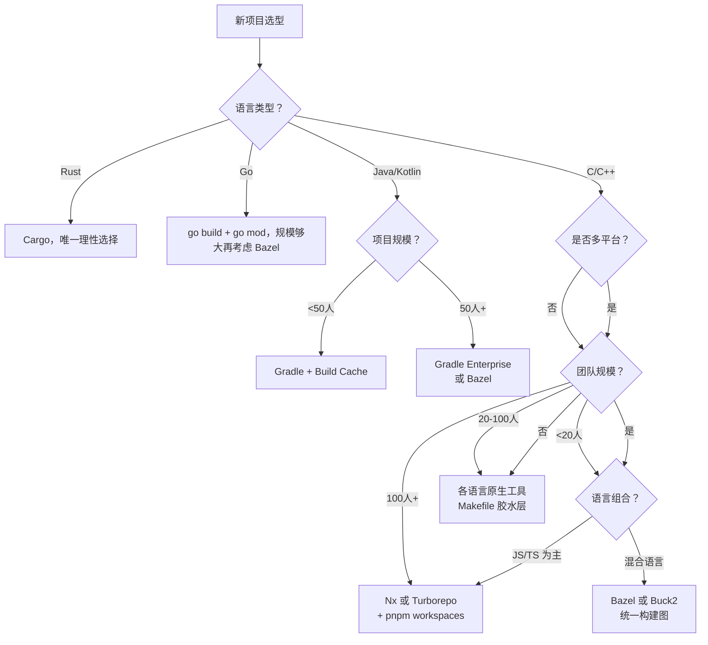

---
tags:
  - build-systems
  - tier3
  - performance
  - profiling
  - tooling-selection
---
# 构建系统性能优化与实战选型

> [!abstract] TL;DR
> 构建性能是开发效率的核心瓶颈。构建时间由前端解析、依赖解析、编译、链接和 IO 五段组成，各段的优化手段不同。Amdahl 定律决定了并行化的理论上限：链接等强串行步骤无法通过增加 CPU 核数线性加速。实战选型应综合考量项目规模、语言生态、团队规模和基础设施投入，避免"选型过重"或"选型过轻"两类错误。

## 概述与定位

### 构建性能为何重要

开发者平均每天触发 10-50 次构建。若每次构建等待时间从 5 分钟缩短到 30 秒：

```
节省时间 = (5min - 0.5min) × 50次/天 × 250工作日 × 团队人数
         = 4.5 × 50 × 250 = 56,250 分钟/人/年 ≈ 938 小时/人/年
```

对于 20 人团队，这相当于每年节省约 **10 个人月**的工程时间。

构建速度还影响到"心流"（flow state）的维持。研究表明，等待超过 10 秒会打断开发者的注意力集中状态；超过 2 分钟则几乎必然导致上下文切换（查邮件、刷新闻）。缩短构建时间不仅节省等待时间，还减少了上下文切换成本——这部分隐性损失往往是等待时间本身的 2-3 倍。因此，将增量构建从 5 分钟优化到 30 秒，实际带来的生产力提升远超简单的时间比值。

### 选型失误的代价

| 失误类型 | 现象 | 代价 |
|---------|------|------|
| 选型过轻 | 用 Make 管理 100 万行 C++ | 构建速度慢，依赖追踪不准确，CI 不稳定 |
| 选型过重 | 用 Bazel 管理 3 人小项目 | 学习曲线陡峭，`BUILD` 文件维护成本高 |
| 生态不匹配 | 用 Makefile 构建 JVM 项目 | 绕过了 Maven/Gradle 的依赖管理生态 |
| 工具链割裂 | 同一仓库混用 Make + CMake + Gradle | 增量构建跨边界失效，工具链维护成本翻倍 |

"选型过重"的风险经常被低估。Bazel 的 `BUILD` 文件需要为每个目标显式列出源文件（不允许 `glob` 自动发现新文件，或仅允许有界 glob），在快速迭代阶段会显著拖慢开发节奏。一个典型模式是：中小团队早期引入 Bazel（出于"未来扩展性"的考虑），却在日常开发中花费大量时间维护 `BUILD` 文件，最终反而比用 CMake 更慢。工具选型应基于当前痛点，而非假设中的未来需求。

## 原理与机制

### 构建时间的组成分析与测量方法

一次典型的 C++ 项目构建时间分解：

```
总构建时间
├── 前端解析（约 5-15%）
│   ├── Makefile/CMakeLists.txt 解析
│   └── 依赖图构建（目标 DAG）
├── 依赖解析（约 2-8%）
│   └── 包管理器版本求解（vcpkg/Conan）
├── 预处理+编译（约 40-65%，可高度并行）
│   ├── #include 展开（头文件密集项目可占编译 50%）
│   └── 代码生成+优化（-O2/-O3 时显著增加）
├── 链接（约 15-40%，**近乎串行**）
│   ├── 全程序链接（LTO 时尤其耗时）
│   └── 符号解析
└── IO 操作（约 5-15%）
    ├── 读取源文件和头文件
    └── 写入目标文件和最终产物
```

**各段的测量手段**：

- **前端解析**：`cmake --trace-expand` 可以追踪 CMakeLists.txt 的解析过程；Bazel 的 `bazel build --profile` 会将前端阶段单独计时
- **编译**：ClangBuildAnalyzer（分析 Clang 的 `-ftime-trace` 输出）可以显示每个编译单元的时间，以及各头文件被 `#include` 的累计时间——这是发现"头文件包含热点"的关键工具
- **链接**：`time ld/lld ...` 直接测量链接时间；`nm --print-size binary | sort -k2 -rn` 可以发现符号表膨胀问题
- **IO**：`strace -e trace=openat,read,write -f make 2>&1 | grep -c openat` 统计文件访问次数；`iostat -x 1` 监控磁盘 IO 利用率

识别真正的瓶颈段是优化的第一步。常见误区是"直觉认为编译是瓶颈"就猛增 CPU 核数，但实际上链接占 35% 且无法并行——此时增加核数对总时间几乎没有改善。

### Amdahl 定律在并行构建的应用

Amdahl 定律描述了并行化的理论加速上限：

$$S(n) = \frac{1}{(1-p) + \frac{p}{n}}$$

其中 $p$ 为可并行部分占比，$n$ 为处理器数量。

实际示例（链接占总时间 30% 且无法并行）：
- $p = 0.7$（编译部分可并行）
- $1-p = 0.3$（链接串行部分）
- 使用 32 核：$S = 1/(0.3 + 0.7/32) ≈ 2.9$（理论最大加速 2.9 倍）
- 使用 128 核：$S = 1/(0.3 + 0.7/128) ≈ 3.2$（收益递减明显）

**结论**：优化链接步骤（ThinLTO / 增量链接 / 分布式链接）往往比增加 CPU 核数更有效。

Amdahl 定律的深层含义是：串行段决定了加速的绝对上限，而这个上限往往比开发者预期低得多。在上例中，即使有无限多核心，最大加速也只有 $1/(1-0.7) = 3.3$ 倍——不是 10 倍也不是 100 倍。这意味着链接时间是比编译时间更优先的优化目标：将链接时间从 30% 降到 10%（通过换用 `mold` 链接器或启用 ThinLTO），在有 32 核的情况下，总加速比从 2.9 倍提升到 $1/(0.1 + 0.9/32) ≈ 7.1$ 倍。

**Critical path（关键路径）是决定构建最短时间的依赖链**：即使有无限并行度，构建时间也不能短于关键路径上所有任务的时间之和。优化非关键路径上的任务对总时间没有任何改善。Bazel 的 `--profile` 输出可以可视化关键路径；在 Chrome Tracing 视图中，从构建结束向左追踪最长的依赖链，即为关键路径。常见的关键路径瓶颈：被 100+ 个编译单元包含的"通天头文件"、用 Python 动态生成的代码（protobuf/flatbuffers）、全局共享的基础库的编译。

### 缓存命中率的测量与提升

**理论命中率分析**：

```
理想命中率 = 1 - (变更文件数 / 总编译单元数)

实际命中率往往低于理论值，差距原因：
- 头文件扇出：1个头文件变更导致N个编译单元失效
- 隐式依赖：环境变量/编译选项变化未被追踪
- 时间戳误判（mtime 策略特有）
```

提升命中率的关键手段：

1. **减少头文件扇出**：将大头文件拆分为更小的接口头文件，减少每个头文件的 `#include` 数量。ClangBuildAnalyzer 的 `#include` 热点报告是定位过度共享头文件的利器
2. **使用 Pimpl（指针到实现）模式**：将类的私有实现细节从头文件移入 `.cpp`，减少头文件变化对所有调用者的"传染"
3. **Precompiled Headers（PCH）**：将稳定的大型头文件（如 `<windows.h>`、Boost）预编译为 `.pch`，但需与 ccache/CCACHE_BASEDIR 配合，否则会破坏跨路径缓存复用
4. **C++20 Modules**：彻底替代头文件的包含模型，每个 module 只重新编译一次，不会因头文件被 N 个源文件包含而编译 N 次。但编译器和构建工具链对 Modules 的支持仍在完善中（CMake 3.28+ 初步支持）

### 常见反模式与识别方法

**反模式一：全局 glob 导致大范围失效**

```python
# Bazel BUILD 文件中的反模式：
cc_library(
    name = "my_lib",
    srcs = glob(["src/**/*.cc"]),  # 任何新增 .cc 文件都会导致整个 target 重建
)

# 改进：有界 glob 或显式列举
cc_library(
    name = "my_lib",
    srcs = glob(["src/module_a/*.cc", "src/module_b/*.cc"]),  # 只追踪已知目录
)
```

**反模式二：头文件依赖爆炸（"通天头文件"）**

当一个头文件被大量源文件包含，且该头文件频繁变更，就会导致每次修改触发全量重建。诊断命令：

```bash
# 查找被最多文件包含的头文件
bazel query 'rdeps(//..., //include:mega_header.h)' | wc -l
# 若输出 > 1000，说明 mega_header.h 是"通天头文件"

# 替代方案：使用前向声明替代完整 include
# 仅在 .cpp 文件中包含完整头文件，头文件中只使用前向声明
```

**反模式三：构建中调用非确定性工具**

```cmake
# 反模式：在构建中嵌入时间戳或 git commit（使每次构建产物不同）
add_custom_command(
    OUTPUT version.h
    COMMAND echo "#define BUILD_TIME \"$(date)\"" > version.h
)

# 改进：用 SOURCE_DATE_EPOCH 固定时间，或将版本信息作为构建参数传入
add_custom_command(
    OUTPUT version.h
    COMMAND echo "#define VERSION \"${GIT_HASH}\"" > version.h
    DEPENDS ${CMAKE_SOURCE_DIR}/.git/HEAD  # 只在 git HEAD 变化时重生成
)
```

## 结构/算法/伪代码详解

### 性能优化清单

#### 并行度优化

```bash
# 1. 确认当前并行度是否充分利用 CPU
# 在构建期间监控 CPU 使用率
vmstat 1 | awk '{print $13"%"}' &  # Linux

# 2. 分离编译和链接的并行度（Bazel）
# BUILD 文件中为链接目标设置独立资源约束
cc_binary(
    name = "my-app",
    ...
    exec_properties = {
        "mem": "8g",   # 链接需要大内存
    },
)
```

#### 编译缓存优化

```bash
# ccache 命中率分析
ccache -s | grep "cache hit"
# 若命中率 <70%，常见原因：
# 1. CCACHE_BASEDIR 未设置导致绝对路径差异
export CCACHE_BASEDIR=/workspace
# 2. 时间戳宏（__DATE__/__TIME__）导致哈希变化
# 检查：grep -r '__DATE__\|__TIME__' src/ --include="*.cpp"
# 3. 头文件使用 #pragma once 但路径不稳定
```

#### 增量构建优化

```bash
# 识别"过宽的 glob"导致的大范围失效
# Bazel 中避免：
glob(["src/**/*.cc"])  # 任何新文件都会导致规则重建

# 改为精确列举或有界 glob：
glob(["src/module_a/*.cc", "src/module_b/*.cc"])

# 检查哪些文件改动触发了大范围重建
bazel query 'rdeps(//..., //src:header.h)' | wc -l
# 若超过 1000，说明 header.h 是"过度共享的头文件"，需要拆分
```

#### 链接优化

```bash
# 使用 ThinLTO（增量式链接时间优化）替代全程序 LTO
# CMake 配置
set(CMAKE_INTERPROCEDURAL_OPTIMIZATION_RELEASE ON)  # 启用 LTO
# 使用 lld（LLVM 链接器）替代 ld（GNU 链接器），速度快 3-5 倍
set(CMAKE_EXE_LINKER_FLAGS "-fuse-ld=lld")

# 使用 mold（Rust 编写的现代链接器，比 lld 更快）
set(CMAKE_EXE_LINKER_FLAGS "-fuse-ld=mold")
```

`mold` 链接器由 Rui Ueyama（LLVM lld 的原始作者）开发，通过充分并行化链接的各个阶段（符号解析、重定位计算、输出文件写入），在多核机器上比 lld 快 2-5 倍，比 GNU ld 快 10-50 倍。对于大型项目，从 ld 换用 mold 可以将链接时间从几十秒降到几秒，这对于改善关键路径效果显著，且迁移成本极低（只需改一行 CMake 配置）。

### 实战选型矩阵表

| 维度 | 小型项目（<10人，<10万行） | 中型项目（10-50人，10-100万行） | 大型项目（50+人，100万行+） |
|------|------------------------|------------------------------|--------------------------|
| **单语言 Rust** | Cargo（唯一选择） | Cargo Workspace | Cargo Workspace + sccache |
| **单语言 Go** | go build + go mod | go build + go mod | Bazel（gazelle 自动生成） |
| **单语言 Java/Kotlin** | Maven 或 Gradle | Gradle + 构建缓存 | Gradle Enterprise 或 Bazel |
| **C++ 多平台** | CMake + Ninja | CMake + Ninja + ccache | Bazel 或 CMake + sccache |
| **多语言 Monorepo** | 脚本化 Makefile | Bazel 或 Nx（JS 生态） | Bazel 或 Buck2 |
| **移动端（iOS/Android）** | Xcode / Gradle | Xcode + fastlane | Bazel（rules_apple/rules_android） |
| **嵌入式 C** | Make + arm-gcc | CMake + Ninja + cross | CMake + sccache + 远程执行 |

### 选型决策树 Mermaid



## 工具视角与实战

### hyperfine 基准测试

```bash
# 安装
brew install hyperfine
# 或
cargo install hyperfine

# 对比全量构建和增量构建
hyperfine \
  --prepare 'cargo clean' \
  --warmup 0 \
  'cargo build' \
  --export-markdown results.md

# 对比不同并行度
hyperfine \
  "make -j1" \
  "make -j4" \
  "make -j8" \
  "make -j$(nproc)" \
  --warmup 1

# 对比有缓存和无缓存
hyperfine \
  --prepare 'ccache -C' \
  --runs 5 \
  'cmake --build build'  # 无缓存基准

hyperfine \
  --runs 5 \
  'cmake --build build'  # 有缓存（第二次起命中）
```

hyperfine 是构建性能分析的"标准量具"：它会运行多次取均值（消除噪声）、显示标准差（量化稳定性）、支持准备命令（`--prepare` 用于重置缓存状态）。在报告构建优化收益时，应用 hyperfine 而非手动 `time` 命令，结果更可信。

### strace 文件访问分析

```bash
# 分析构建过程实际访问了哪些文件
strace -e trace=openat -f \
  -o /tmp/build-trace.txt \
  make -j4

# 统计最频繁访问的文件（找出热点头文件）
grep "openat" /tmp/build-trace.txt | \
  grep -oP '"[^"]+\.h"' | \
  sort | uniq -c | sort -rn | head -20

# 常见发现：某个"全局头文件"被数百个编译单元包含
# → 优化：将该头文件拆分，减少不必要的包含
```

### Bazel Profile 分析

```bash
# 生成 Profile
bazel build //... \
  --profile=/tmp/bazel-profile.json \
  --experimental_profile_cpu_usage

# 在 Chrome 浏览器中分析
# 打开 chrome://tracing，加载 /tmp/bazel-profile.json
# 或使用 Bazel 自带的 pprof 格式
bazel analyze-profile /tmp/bazel-profile.json

# 重要指标：
# - Critical Path（关键路径）：决定构建最短时间的串行依赖链
# - Action count / cache hit rate：缓存效率
# - Worker CPU utilization：并行度是否充分
```

### Ninja 构建图可视化

```bash
# 生成依赖关系 DOT 图
ninja -t graph > build.dot

# 仅显示特定目标的依赖
ninja -t graph my-app > my-app.dot

# 转换为 SVG（需要 graphviz）
dot -Tsvg build.dot -o build-graph.svg

# 分析哪些目标的构建时间最长
ninja -t compdb > compile_commands.json
# 结合 ClangBuildAnalyzer 分析头文件包含热点
ClangBuildAnalyzer --all ./build --output build-analysis.bin
ClangBuildAnalyzer --analyze build-analysis.bin
```

## 安全性与正确使用

### 构建脚本竞态条件

并行构建中，多个 Make/Ninja 任务同时写入同一输出文件时会产生竞态：

```makefile
# 危险：多个目标写入同一文件（并行执行时产生竞态）
generated.h: tool-a tool-b
    tool-a > generated.h   # tool-a 和 tool-b 可能同时运行
    tool-b >> generated.h

# 正确：使用中间文件+原子重命名
generated.h: tool-a.out tool-b.out
    cat tool-a.out tool-b.out > generated.h.tmp
    mv generated.h.tmp generated.h

# 或者显式声明串行依赖
tool-b.out: tool-a.out   # 确保先后顺序
    ...
```

### CI/CD 权限最小化

```yaml
# GitHub Actions 最小权限配置
permissions:
  contents: read          # 仅读取仓库内容
  packages: write         # 仅推送容器镜像（需要时）
  id-token: write         # 仅用于 OIDC（需要时）
# 不给予：actions:write, secrets:write, deployments:write

jobs:
  build:
    runs-on: ubuntu-latest
    # 限制构建环境的网络访问（防止数据外泄）
    # 使用 self-hosted runner + 网络策略
```

### 构建时间监控与告警

```bash
# 记录每次构建时间（加入 CI 脚本）
BUILD_START=$(date +%s)
bazel build //...
BUILD_END=$(date +%s)
BUILD_DURATION=$((BUILD_END - BUILD_START))

# 若构建时间超过阈值，发送告警
if [ $BUILD_DURATION -gt 300 ]; then
    echo "::warning::构建时间 ${BUILD_DURATION}s 超过 5 分钟阈值"
fi

# 将数据推送到监控系统（如 Datadog/Prometheus）
curl -X POST https://metrics.example.com/api/v1/series \
  -d "{\"series\": [{\"metric\": \"build.duration\", \"points\": [[$(date +%s), $BUILD_DURATION]]}]}"
```

构建时间的持续监控是防止"构建时间悄悄劣化"的必要手段。大型项目的常见模式是：某次合并了一个大型第三方库，构建时间从 3 分钟跳到 8 分钟，但因为没有历史趋势对比，团队没有意识到这是个异常——直到构建时间积累到 30 分钟才开始排查，此时已经很难追溯到最初的原因。将构建时间作为 CI 的一等指标，设置告警阈值，可以在劣化刚开始时就捕获到原因。

## 小结

构建性能优化是"投入-产出"极高的工程活动，但需要先做**分析再优化**，而非凭直觉添加并行度或换用"更重"的工具。Amdahl 定律揭示了串行瓶颈（通常是链接）的决定性作用，换用 `mold` 等现代链接器往往是性价比最高的单点优化。关键路径分析优先于全局并行度分析：找到限制构建时间下限的那条依赖链，针对性地拆分或优化，比盲目增加核数有效得多。缓存命中率分析（`ccache -s`、`bazel --explain`）是定位"为什么增量构建仍然很慢"的第一手段，头文件扇出和时间戳注入是最常见的命中率杀手。核心优化优先级：增量构建正确性 > 本地缓存（ccache）> 并行度调优 > 远程共享缓存（sccache）> 远程执行（RBE）。选型决策应从团队实际规模和痛点出发，避免为小项目引入 Bazel 这类高复杂度工具；工具选定后，用 `hyperfine` 建立基准，用 Bazel `--profile` 或 ClangBuildAnalyzer 定位瓶颈，再针对性优化。

## 相关阅读

- [hyperfine —— 命令行基准测试工具](https://github.com/sharkdp/hyperfine)
- [Bazel Performance Profiling](https://bazel.build/advanced/performance/build-performance-breakdown)
- [mold —— 现代高速链接器](https://github.com/rui314/mold)
- [ClangBuildAnalyzer —— 头文件包含热点分析](https://github.com/aras-p/ClangBuildAnalyzer)
- [Amdahl's Law（维基百科）](https://en.wikipedia.org/wiki/Amdahl%27s_law)

---
[[00.构建系统横向对比总览|⬆ 系列总览]] | [[12.构建系统安全性与供应链|← 上一章]] | [[14.Buck2与元编程构建|→ 下一章]]
