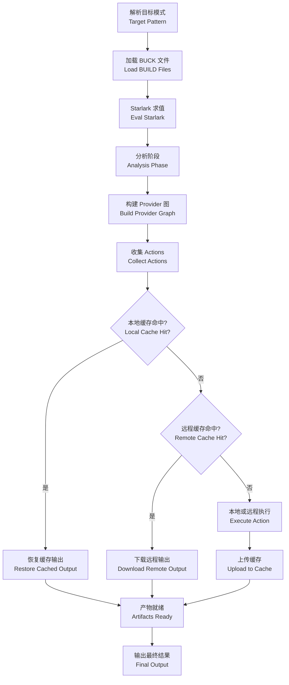

---
tags:
  - build-systems
  - tier3
  - buck2
  - monorepo
---
# Buck2 与元编程构建
> [!abstract] TL;DR
> Buck2 是 Meta 于 2023 年正式开源的第二代分布式构建系统，用 Rust 重写核心，以 Starlark 作为构建描述语言，以 DICE（Deterministic Incremental Computation Engine）实现细粒度增量计算，以 Prelude 提供完全可替换的内置规则库，以 BXL（Buck Extension Language）支持图查询与元编程扩展。Buck2 与 Bazel 同属"大仓构建工具"品类，但在规则开放性、执行引擎设计和语言选型上呈现截然不同的哲学取向，是理解现代构建系统设计权衡不可绕过的案例。

## 概述与定位

Buck2 的诞生有清晰的历史脉络。Meta（彼时仍是 Facebook）最早使用 Buck1——一个 2013 年开源的 Java 构建工具，灵感来自 Google 的 Blaze（即后来的 Bazel 的前身）。Buck1 支撑了 Meta 多年的大规模单仓构建，但随着代码库规模指数级增长（数亿行代码、数百万个目标节点），Buck1 的架构缺陷逐渐暴露：守护进程基于 Java，冷启动开销大；规则实现与工具核心深度耦合，外部贡献者难以独立扩展；增量构建模型基于粗粒度文件哈希，精度不足；Python 版本的规则描述存在语义不一致问题。

2019 年起，Meta 内部启动了 Buck2 项目，目标是从零开始以 Rust 重写核心执行引擎，同时彻底分离规则层（Prelude）与引擎层，并引入更先进的增量计算模型。经过约四年的内部打磨，2023 年 4 月 Buck2 正式对外开源（仓库地址：https://github.com/facebook/buck2）。

**与 Bazel 的定位对比**：Buck2 和 Bazel 面向的场景高度重叠——都是针对大型单仓（Monorepo）设计的多语言构建系统，都使用 Starlark 作为构建描述语言，都支持远程缓存与远程执行（RE）。但两者的差异同样显著：

| 维度 | Buck2 | Bazel |
|---|---|---|
| 核心语言 | Rust | Java |
| 增量引擎 | DICE（细粒度函数图） | Skyframe（粗粒度依赖图） |
| 内置规则 | Prelude（纯 Starlark，完全开放） | 内嵌于 Java 核心，部分封闭 |
| 元编程 / 图查询 | BXL（Starlark 超集） | Starlark + query 命令，能力有限 |
| 开源成熟度 | 2023 年开放，生态仍在成长 | 2015 年开源，生态成熟 |
| 主要使用者 | Meta 内部、早期采用者 | Google、众多企业 |
| RBE 协议 | 兼容 Bazel Remote Execution API v2 | 原生支持 |

从设计哲学来看，Buck2 更彻底地贯彻了"规则即函数"的思路：构建规则被视为纯函数，输入是 attribute 集合，输出是一组 Provider（provider 是向消费者暴露信息的接口），副作用（文件生成）通过 Action 声明，由引擎异步调度。这与 Bazel 的"规则即宏"模型（规则实现混杂了属性解析与 Action 声明，强耦合）形成对比。

## 原理与机制

### DICE：确定性增量计算引擎

DICE（Deterministic Incremental Computation Engine）是 Buck2 的核心创新，也是理解 Buck2 增量构建行为的关键。

传统的增量构建系统（包括 Buck1、Make）通常维护一个"依赖图 + 文件时间戳/哈希"模型：当文件改变时，遍历依赖图找出所有受影响的目标，将其标记为脏（dirty），然后重新构建脏目标。这种方式的粒度是"目标（target）"级别——即使一个 C++ 库只有一个头文件的注释发生变化，整个库的所有消费者都需要重新检查是否需要重建。

DICE 的思路不同：它把整个构建过程建模为一组**相互依赖的计算函数**（称为"dice key" → "dice value"的映射），每个函数是纯函数，其输出完全由输入决定。函数之间的依赖关系在运行时动态追踪（而非静态声明），形成一个计算图（Computation Graph）。当输入改变时，DICE 沿着反向依赖边传播变化：

1. 标记直接依赖改变输入的函数为"可能脏"
2. 对于每个"可能脏"的函数，惰性地重新执行，验证其输出是否真的改变
3. 只有当输出确实改变时，才继续传播"脏"标记给上层消费者

这种"早停"（early termination）策略意味着：如果一个函数的输入变了但输出没变（例如，头文件添加了注释但 ABI 不变），DICE 不会传播脏标记，其消费者不需要重建。这比 Bazel 的 Skyframe 更细粒度，尤其在接口稳定但实现频繁变动的场景下，增量效果显著更好。

**DICE 图的结构**：

```
输入文件 (source files)
    │
    ▼
文件内容哈希计算 (file_node)
    │
    ▼
Starlark 求值 (eval_module, eval_buildfile)
    │
    ▼
规则属性解析 (analysis of rule attributes)
    │
    ▼
Provider 计算 (analysis: rule_impl function)
    │
    ▼
Action 注册 (declare_run, declare_copy, etc.)
    │
    ▼
Action 执行 (build actions)
    │
    ▼
构建输出 (artifacts)
```

每个节点都是一个 DICE key，其计算结果被缓存。当源文件改变时，只有从该节点出发的最小受影响子图才会被重新计算。

### Starlark：类型安全的构建 DSL

Buck2 使用 Starlark 作为构建描述语言（BUILD 文件和规则实现文件）。Starlark 是 Google 为 Bazel 设计的 Python 子集，语法与 Python 3 高度兼容但做了严格限制：

- **无副作用**：不允许在模块级别执行 I/O 或修改全局状态
- **确定性**：相同输入始终产生相同输出（字典遍历顺序确定、无随机性）
- **并发安全**：多个 BUILD 文件可以并行求值，不存在共享可变状态
- **无通用循环的终止性**：Starlark 中的 for 循环不能实现任意递归，求值过程可证明终止

Buck2 对 Starlark 的扩展主要体现在以下几点：
1. 通过 `@providers` 装饰器定义类型安全的 Provider（可以指定字段类型）
2. 通过 `ctx.actions.*` 系列 API 声明构建动作（Action）
3. 通过 `load()` 机制在文件间共享规则和辅助函数

一个典型的 Starlark 规则实现如下：

```python
# rules/cc_library.bzl
CcInfo = provider(fields = {
    "headers": provider_field(typing.Any, default = None),
    "link_flags": provider_field(list[str], default = []),
})

def _cc_library_impl(ctx: AnalysisContext) -> list[Provider]:
    # 收集传递性头文件
    transitive_headers = []
    for dep in ctx.attrs.deps:
        if CcInfo in dep:
            transitive_headers.append(dep[CcInfo].headers)

    # 声明编译动作
    obj_files = []
    for src in ctx.attrs.srcs:
        obj = ctx.actions.declare_output(src.short_path + ".o")
        ctx.actions.run(
            cmd_args(["clang++", "-c", src, "-o", obj] + ctx.attrs.copts),
            category = "cc_compile",
        )
        obj_files.append(obj)

    # 声明归档动作
    lib = ctx.actions.declare_output("lib{}.a".format(ctx.attrs.name))
    ctx.actions.run(
        cmd_args(["ar", "rcs", lib] + obj_files),
        category = "cc_archive",
    )

    return [
        DefaultInfo(default_output = lib),
        CcInfo(headers = ctx.attrs.headers, link_flags = []),
    ]

cc_library = rule(
    impl = _cc_library_impl,
    attrs = {
        "srcs": attrs.list(attrs.source()),
        "headers": attrs.list(attrs.source(), default = []),
        "deps": attrs.list(attrs.dep(providers = [CcInfo]), default = []),
        "copts": attrs.list(attrs.string(), default = []),
    },
)
```

### Prelude：完全开放的规则层

Prelude 是 Buck2 内置规则的实现集合，完全用 Starlark 编写，作为独立仓库（https://github.com/facebook/buck2-prelude）维护。这是 Buck2 与 Bazel 最重要的架构差异之一。

在 Bazel 中，很多内置规则（如 `cc_library`、`java_library`）的关键行为是用 Java 实现的，嵌入在引擎核心中，用户无法查看或修改实现细节。这导致了以下问题：调试构建行为困难；为新语言添加原生规则需要向 Bazel 主仓贡献 Java 代码；行为跨版本可能有微妙差异但无法追溯。

Buck2 的 Prelude 完全透明：用户可以直接阅读 C++、Rust、Python、Swift、Go 等语言规则的 Starlark 实现；可以 fork 并定制 Prelude 以适应公司特有需求；可以用相同的方式添加自己的语言规则，与内置规则享有完全相同的能力。

这一设计的代价是 Prelude 本身的维护复杂度——它需要用 Starlark 实现大量原本可以用 Java/Kotlin 更自然表达的逻辑。但收益是巨大的：规则的行为完全可预期，调试路径清晰，社区贡献门槛低。

### Provider 体系：规则间通信的接口

Provider 是 Buck2 中规则间传递信息的唯一机制。一个规则的 `impl` 函数返回一个 Provider 列表，消费该目标的其他规则通过 `dep[ProviderType]` 访问这些信息。

这种设计有几个重要含义：
- **解耦**：提供者（provider 实现规则）和消费者（依赖该规则的上层规则）通过 Provider 接口解耦，只要 Provider 接口不变，实现可以自由替换
- **类型安全**：`attrs.dep(providers = [CcInfo])` 声明依赖必须提供 `CcInfo`，否则分析阶段报错
- **传递性依赖**：通常通过在 Provider 中携带 `Transitive` 集合来传播跨多层的信息（如所有传递性头文件目录、传递性链接库）

标准 Provider 包括：
- `DefaultInfo`：默认输出（`buck2 build` 时收集的产物）
- `RunInfo`：可运行的二进制
- `ExternalRunnerTestInfo`：测试运行器配置
- `TemplatePlaceholderInfo`：`$(location ...)` 类型的宏展开信息

### 远程执行与缓存

Buck2 实现了与 Bazel 兼容的 Remote Execution API v2（RE API），可以接入 BuildBuddy、Engflow、Buildkite 等远程执行后端。这意味着 Bazel 生态中的远程执行基础设施可以直接被 Buck2 复用，降低了迁移成本。

远程执行的核心流程：
1. 对每个 Action 计算 Merkle tree 哈希（输入文件树 + 命令 + 环境变量）
2. 向 CAS（Content Addressable Storage）上传输入
3. 向 Action Cache 查询：如果命中，直接下载输出，跳过执行
4. 如未命中，向 Execution Service 提交执行请求，等待结果，上传输出到 CAS 和 Action Cache

Buck2 在本地也维护等价的本地 Action Cache（`.buck-out/v2/cache`），本地构建命中率与远程命中率共同决定整体构建速度。

### Hermetic 沙盒

Buck2 默认对 Action 执行施加输入约束（hermetic sandbox）：Action 只能访问其声明的输入文件，不能访问系统路径（`/usr/include`、`/usr/lib`）之外未声明的文件（通过 Linux 的 `landlock` 或 macOS 的 sandbox-exec 实现）。这保证了：

- 构建结果不依赖执行机器的特定状态（不同机器上相同输入产生相同输出）
- Action Cache 的正确性（哈希的输入集合确实覆盖了 Action 的所有依赖）
- 增量构建的可靠性（遗漏的依赖不会导致脏数据缓存命中）

Hermetic 沙盒的实现代价是：在迁移阶段，大量历史规则会因为隐式依赖系统工具链路径而报错，需要逐步迁移到 Buck2 的工具链声明机制。

## 结构/算法/伪代码详解

### 构建流程全链路

Buck2 的 `buck2 build //path:target` 命令执行流程如下：



**阶段一：目标解析（Target Pattern Resolution）**

`//path/to:target` 中的 `//` 表示相对于仓库根的路径，`:target` 是具体目标名称。Buck2 支持通配符：`//path/...` 表示该路径下所有目标，`//path:` 表示该路径下的默认目标。

解析过程产生一组 `(cell, package, name)` 三元组的目标标识符列表。

**阶段二：BUCK 文件加载（Loading Phase）**

Buck2 并行加载所有涉及的 BUCK 文件（使用 `load()` 传递性加载依赖的 `.bzl` 文件）。加载结果被 DICE 缓存——相同文件内容哈希下不会重复求值。

**阶段三：分析阶段（Analysis Phase）**

对每个目标，调用其规则的 `impl` 函数，传入 `AnalysisContext`（包含 `ctx.attrs`、`ctx.actions`、`ctx.label` 等）。此阶段不执行任何实际构建动作，只是声明 Action（声明 ≠ 执行）并收集 Provider。

DICE 在分析阶段追踪函数依赖关系：如果 `_cc_library_impl(ctx)` 访问了 `ctx.attrs.deps[0][CcInfo].headers`，DICE 记录该分析函数依赖于 `dep[0]` 的 `CcInfo` Provider。

**阶段四：Action 执行（Execution Phase）**

将所有收集到的 Action 形成 DAG（有向无环图），按依赖顺序并行执行。每个 Action：
1. 计算输入 Merkle tree 哈希 → 生成 Action 指纹
2. 查询本地/远程 Action Cache
3. 未命中则执行（本地沙盒或远程 RE），上传结果

### DICE 增量算法伪代码

```
function compute(key: DiceKey) -> DiceValue:
    if key in cache and cache[key].is_valid():
        return cache[key].value
    
    # 重新执行计算函数
    deps_tracker = DepsTracker()
    with deps_tracker.as_active():
        value = key.compute_fn()  # 执行实际计算，期间访问其他 key 会被追踪
    
    # 记录本次依赖
    cache[key] = CacheEntry(value, deps = deps_tracker.recorded_deps())
    return value

function invalidate(changed_file: Path):
    # 从文件节点开始，沿反向依赖边标记"脏"
    dirty_keys = {file_node(changed_file)}
    propagate_dirty(dirty_keys)

function propagate_dirty(dirty_keys: Set[DiceKey]):
    work_queue = dirty_keys
    while work_queue:
        key = work_queue.pop()
        for consumer in reverse_deps[key]:
            if consumer not in dirty_set:
                dirty_set.add(consumer)
                work_queue.add(consumer)

function is_still_valid(key: DiceKey) -> bool:
    for dep in cache[key].deps:
        new_val = compute(dep)  # 递归验证依赖
        if new_val != cache[dep].prev_value:
            return False  # 依赖的输出确实改变了
    return True  # 所有依赖输出未变，本节点也不需重算
```

这个算法的关键洞察是"传播脏标记"（`invalidate`）和"验证依赖输出"（`is_still_valid`）是分开的：标记阶段快速且保守（宁可多标），验证阶段惰性且精确（只在实际需要时才验证）。

### BXL：元编程与图查询

BXL（Buck Extension Language）是 Buck2 对 Starlark 的扩展，赋予构建脚本查询和操作构建图的能力，可以理解为 Buck2 版本的"可编程构建图 API"。

BXL 的典型用途：
1. **代码生成辅助**：查询特定规则类型的所有目标，提取属性，生成 IDE 配置文件（如生成 compile_commands.json）
2. **自定义子命令**：实现 `buck2 bxl //tools:my_check.bxl:check_header_deps` 这样的自定义 buck2 子命令
3. **依赖分析**：分析特定目标的传递性依赖，检查是否引入了违禁依赖
4. **批量操作**：跨大量目标批量执行分析，生成报告

一个 BXL 脚本示例（查询所有 C++ 目标并收集其头文件信息）：

```python
# tools/header_map.bxl

def _header_map_impl(ctx):
    # 使用 cquery 查询所有 cc_library 目标
    targets = ctx.cquery().kind("cc_library", "//...")
    
    header_map = {}
    for target in targets:
        # 分析目标，获取 Provider
        analysis = ctx.analysis(target)
        cc_info = analysis.providers().get(CcInfo)
        if cc_info:
            header_map[str(target.label)] = [
                h.short_path for h in cc_info.headers
            ]
    
    # 输出 JSON 格式的头文件映射
    ctx.output.print(json.encode(header_map))

header_map = bxl_main(
    impl = _header_map_impl,
    cli_args = {},
)
```

BXL 与普通 Starlark 规则的区别在于：BXL 脚本在特权上下文中运行，可以主动"拉取"分析结果（`ctx.analysis(target)`），而普通规则只能被动接收通过 `ctx.attrs.deps` 传入的依赖信息。

### Target 与 Cell 系统

Buck2 使用 Cell 作为仓库模块化的顶层单位。一个 Cell 是一个独立的目录树，有自己的 `.buckconfig` 文件和根 BUCK 文件。多个 Cell 可以组成一个虚拟仓库（通过 `.buckconfig` 中的 `[repositories]` 段互相引用）。

```
# .buckconfig (仓库根)
[repositories]
  root = .
  third_party = third-party/

# 引用第三方 Cell 中的目标
load("@third_party//cmake:defs.bzl", "cmake_project")
```

这种设计让大型单仓可以按团队或子系统拆分为多个 Cell，各 Cell 可以独立配置工具链、规则集和允许的依赖方向，而不需要打散整个仓库结构。

## 工具视角与实战

### 安装与初始化

```bash
# macOS (Homebrew)
brew install buck2

# Linux：直接下载预编译二进制
curl -L https://github.com/facebook/buck2/releases/download/latest/buck2-x86_64-unknown-linux-musl.zst \
  | zstd -d > /usr/local/bin/buck2 && chmod +x /usr/local/bin/buck2

# 初始化新项目
buck2 init --git my_project && cd my_project
```

初始化后目录结构：

```
my_project/
├── .buckconfig          # 仓库根配置：cell 定义、工具链路径
├── .buckversion         # 锁定 Buck2 版本（推荐固定版本）
├── prelude/             # 指向 buck2-prelude 的 git submodule
├── toolchains/
│   └── BUCK             # 工具链目标（C++ 编译器、Python 解释器等）
└── BUCK                 # 根目录 BUILD 文件
```

### 常用命令

```bash
# 构建单个目标
buck2 build //src:my_lib

# 构建并运行
buck2 run //src:my_app -- --arg1 value1

# 执行测试
buck2 test //src/...

# 查询依赖关系
buck2 query "deps(//src:my_app)"

# 查询所有依赖某目标的目标（反向依赖）
buck2 query "rdeps(//..., //src:base_lib)"

# 查询特定属性
buck2 query "attr(visibility, PUBLIC, //...)"

# 生成 compile_commands.json（使用 BXL）
buck2 bxl //prelude/ide_integrations:compile_commands.bxl:compile_commands \
  -- --targets //...

# 清理构建缓存
buck2 clean

# 检查 Action 是否使用了远程缓存
buck2 build //src:my_lib --show-output 2>&1 | grep "cache"
```

### 工具链配置

Buck2 的工具链声明是实现 hermetic 构建的关键环节。工具链不是通过 `PATH` 环境变量隐式查找，而是显式声明为构建目标：

```python
# toolchains/BUCK

# 声明系统 C++ 工具链
system_cxx_toolchain(
    name = "cxx",
    visibility = ["PUBLIC"],
)

# 声明 Python 工具链
system_python_toolchain(
    name = "python",
    visibility = ["PUBLIC"],
)

# 如果需要自定义工具链（如使用特定版本的 Clang）
configured_alias(
    name = "clang16",
    actual = "//third_party/llvm:clang16",
    platform = "//platforms:linux_x86_64",
)
```

```ini
# .buckconfig
[build]
  execution_platforms = //platforms:all_platforms

[toolchains]
  # 指定默认工具链目标
```

### 与 Bazel 迁移互操作

对于已有 Bazel 项目迁移到 Buck2 的场景，两者的差异集中在：

1. **BUILD 文件命名**：Bazel 使用 `BUILD` 或 `BUILD.bazel`，Buck2 使用 `BUCK` 或 `BUCK.v2`
2. **规则名称空间**：Bazel 的 `@rules_cc//cc:defs.bzl` 需要映射到 Buck2 的 Prelude 等价规则
3. **`deps` 属性语义**：两者基本兼容，但 Provider 名称不同（Buck2 的 `CcInfo` vs Bazel 的 `CcInfo`，字段可能有差异）
4. **工具链声明**：Bazel 使用 `platform`/`toolchain` 机制，Buck2 有类似但不完全相同的配置系统
5. **远程执行配置**：RE API 兼容，但配置方式（`.buckconfig` vs `.bazelrc`）不同

实际迁移建议：不要尝试全量一次性迁移，而是通过"Buck2 + Bazel 并行运行"方案逐步迁移，在过渡期内两套工具对同一套源码各自生成一份 BUILD/BUCK 文件。

### 性能调优实践

**并发度控制**：
```ini
# .buckconfig
[build]
  threads = 32  # 默认为 CPU 核心数，可调高用于 I/O 密集型 Action
```

**本地 Action Cache 大小**：
```ini
[buck2]
  cache_dir_size_limit = 50GB  # 默认 10GB，对大型项目推荐调大
```

**远程执行集成（BuildBuddy 示例）**：
```ini
# .buckconfig.local (不提交到仓库)
[buck2_re_client]
  engine_address = grpcs://remote.buildbuddy.io
  action_cache_address = grpcs://remote.buildbuddy.io
  cas_address = grpcs://remote.buildbuddy.io

[buck2_re_client.metadata]
  api_key = <your_api_key>
```

## 安全性与正确使用

### 构建 Hermetic 与供应链安全

Hermetic 构建是 Buck2 安全模型的核心。当 Action 被严格约束为只能访问声明的输入时，构建过程本身变成了可审计的——给定相同的源码版本和工具链版本，任何机器上的构建输出的哈希应当完全一致。这直接支撑了 SLSA（Supply Chain Levels for Software Artifacts）框架中 L2/L3 级别的要求：

- **L2**：构建服务是托管的、日志不可篡改
- **L3**：构建是 hermetic 的（不依赖构建环境的外部状态）

对于供应链安全，Buck2 推荐的做法是：
1. **固定工具链版本**：在 `.buckversion` 中锁定 Buck2 版本，在 `BUCK.lock` 或等价文件中固定第三方依赖的内容哈希
2. **Content-Addressed 引用**：Buck2 的 `http_file` 规则支持通过 SHA256 哈希引用远程文件，而不是仅靠 URL（URL 内容可以被替换）
3. **Prelude 版本管理**：将 Prelude 作为固定版本的 git submodule 引入，避免上游 Prelude 变更意外影响内部构建

### 远程执行信任模型

引入远程执行（RE）后，信任边界扩大。需要关注：

**执行端可信性**：远程执行服务器接收 Action 输入并返回输出。如果远程服务器被攻击者控制，理论上可以返回恶意的构建产物。缓解措施：

1. **本地验证采样**：配置 Buck2 对部分 Action 同时进行本地执行和远程执行，比对输出哈希，检测不一致（`--verify-re`）
2. **内容寻址验证**：CAS 中的对象通过哈希寻址，下载后客户端验证哈希，防止传输篡改
3. **网络加密**：RE API 连接使用 mTLS，确保服务器身份验证

**Starlark 沙箱限制**：Starlark 本身是安全的（无 I/O、无网络访问），但 Action 执行的命令是任意的。未经审查的规则文件可以声明执行任意命令。对于有合规要求的场景，需要：

1. 限制 `load()` 只允许从受信任的源加载规则（通过 `.buckconfig` 的 `[buildfile] includes` 策略）
2. 对 Prelude fork 建立内部代码审查流程，防止未经审查的上游变更进入内部版本

### 敏感数据处理

构建过程中可能涉及敏感信息（如 API Key、代码签名证书）。Buck2 的处理原则：

1. **环境变量隔离**：`ctx.actions.run()` 默认不继承父进程的环境变量，需要显式通过 `env` 参数传入所需环境变量，这防止了意外的环境变量泄露到 Action 执行环境
2. **敏感产物隔离**：包含敏感信息的构建产物应通过 `visibility` 机制限制为仅允许特定消费者访问
3. **缓存排除**：可以通过 Action 属性标记某些 Action 不写入 Action Cache（避免将含签名信息的产物缓存到共享的远程 CAS）

## 小结

Buck2 代表了构建系统设计的一条清晰路径：用 Rust 实现高性能核心，用 DICE 实现细粒度增量，用完全开放的 Starlark 规则层消除工具核心的"黑盒"，用 BXL 提供超越 query 命令的元编程能力。

**核心优势**：
- DICE 增量引擎在接口稳定/实现变动场景下比 Bazel 的 Skyframe 减少更多无效重建
- Prelude 的完全开放使规则调试和定制成为普通工程师可完成的任务，而不是工具链团队的专属工作
- Rust 核心带来更低的内存占用和更快的守护进程启动时间（对比 Buck1/Bazel 的 JVM 热身开销）
- BXL 将构建图从黑盒变成可编程 API，让 IDE 集成、依赖分析等工具有了清晰的实现路径
- RE API 与 Bazel 兼容，已有 Bazel 远程执行基础设施可以直接复用

**当前局限**：
- 生态成熟度远不及 Bazel：规则覆盖语言较少、社区问答资源有限、第三方集成（如 IDE 插件）仍不完善
- 文档质量参差不齐，学习曲线陡峭，很多行为需要阅读 Prelude 源码才能理解
- Windows 支持仍在开发中，跨平台场景不如 Bazel 稳定
- Meta 以外的大规模生产验证案例仍然稀少（截至 2025 年），采用风险较 Bazel 高

**适用场景**：
- 大型多语言单仓，特别是 C++/Rust/Python 混合技术栈
- 对构建增量精度有极高要求的场景（C++ 模板密集型代码库）
- 需要深度定制构建规则或对规则行为有完全可见性需求的团队
- 愿意投入工具链团队维护 Buck2 生态并接受较高初始迁移成本的组织

对于大多数企业，Bazel 仍是更稳妥的选择。Buck2 更适合那些将构建系统本身视为核心工程能力、愿意深度参与工具开发的团队。理解 Buck2 的设计，特别是 DICE 和 Prelude 的思路，也对深入理解 Bazel 的架构演进方向有重要参考价值。

## 相关阅读

- [Buck2 官方文档](https://buck2.build/docs/)
- [buck2-prelude 源码仓库](https://github.com/facebook/buck2-prelude)
- [Starlark 语言规范](https://github.com/bazelbuild/starlark/blob/master/spec.md)
- [Remote Execution API 规范（v2）](https://github.com/bazelbuild/remote-apis)
- [Meta Engineering：Introducing Buck2](https://engineering.fb.com/2023/04/06/open-source/buck2-open-source-large-scale-build-system/)
- [DICE 增量计算论文（ICFP 2020）](https://dl.acm.org/doi/10.1145/3408987)
- [BuildBuddy 远程执行文档](https://www.buildbuddy.io/docs/rbe-setup/)
- [SLSA 供应链安全框架](https://slsa.dev/)

[[00.构建系统横向对比总览|⬆ 系列总览]] | [[13.构建系统性能优化与实战选型|← 上一章]] | [[15.Nix与Guix可复现构建|→ 下一章]]
