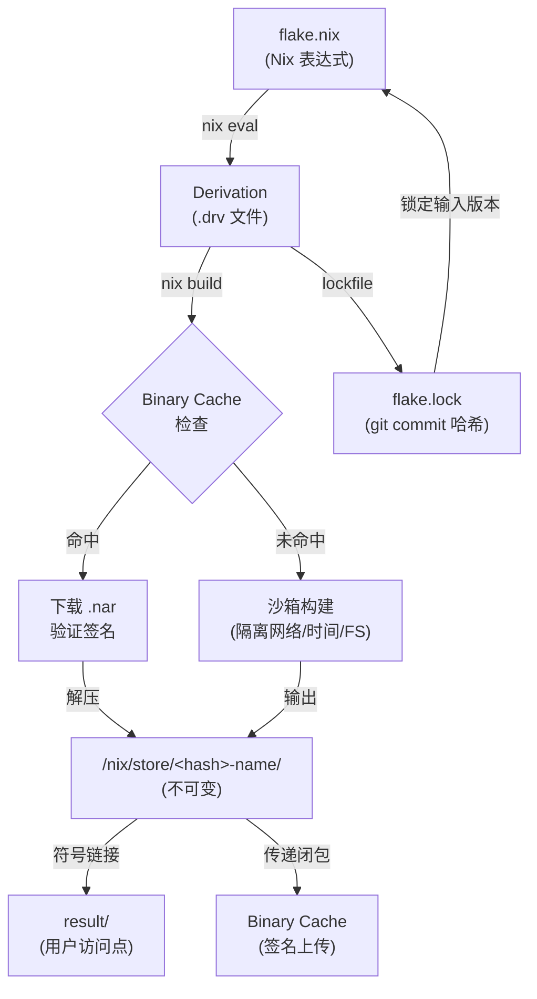

---
tags:
  - build-systems
  - tier3
  - nix
  - 可复现构建
---
# Nix 与 Guix 可复现构建

> [!abstract] TL;DR
> Nix 将构建抽象为纯函数：所有输入（源码哈希、依赖路径、编译器版本、环境变量）经过哈希合并后，唯一决定输出路径 `/nix/store/<hash>-name`。任何一个比特的输入变化，输出路径就变化；相同输入在不同机器、不同时间构建必然产生完全相同的产物——这就是可复现构建（Reproducible Builds）的数学保证。Guix 在相同范式下用 GNU Scheme 重写了全套工具链，并进一步追求从最小可信二进制集出发的"bootstrap 可引导性"。两者共同回答了一个被传统构建系统长期忽视的问题：**如何向用户证明你拿到的二进制确实来自你看到的源码？**

## 概述与定位

### 为何传统构建系统无法回答"来自哪里"

Make、CMake、Gradle、Cargo 等构建系统的设计核心是**描述如何从源码到产物**，但它们几乎从不关心：

- 同一份 `Makefile` 在不同机器上跑出的 `.so` 是否 bit-for-bit 相同？
- 安装在 `/usr/lib` 里的共享库是哪次构建产生的？版本是多少？
- 删掉 `/usr/include/openssl` 再重装，原先依赖它的所有包是否需要重新构建？
- CI 生成的二进制和开发者本地构建的是否等价？

这些问题在传统 FHS（Filesystem Hierarchy Standard）体系下没有答案，因为系统状态是**全局可变的**：同一路径 `/usr/lib/libssl.so.3` 今天指向 3.0.7，明天可能被 `apt upgrade` 替换成 3.0.8，而所有依赖它的程序并不知晓。

Nix（发音 /nɪks/，2003 年由 Eelco Dolstra 在博士论文中提出）的根本出发点：**用不可变内容寻址存储替代可变全局路径**。

### Nix 的生态版图

Nix 已不是单一工具，而是一套完整生态：

| 组件 | 角色 |
|------|------|
| Nix 语言 | 惰性、纯函数式的领域专用语言，用于描述 derivation |
| Nix（CLI 工具） | 求值 Nix 表达式、驱动构建、管理 store |
| nixpkgs | 9 万+ 包的 Nix 表达式仓库，是世界上最大的软件包集合之一 |
| NixOS | 基于 Nix 的操作系统，整个系统配置（内核参数、服务、用户）都是 Nix 表达式 |
| Flakes | 2021 年引入的实验性（现已广泛使用）特性，给 Nix 项目添加锁文件和标准化入口 |
| nix-darwin | 将 NixOS 配置范式移植到 macOS |
| home-manager | 用 Nix 管理用户级配置（dotfiles、用户级包） |

### Guix：GNU 的 Scheme 实现

GNU Guix（发音 /ɡiːks/）是 GNU 项目在 2012 年启动的 Nix 范式重实现，核心区别在于：

1. **实现语言**：Guix 用 GNU Guile（Scheme 方言）写包定义，而非 Nix 专属语言。
2. **哲学激进度**：Guix 坚持 FSF 的"完全自由软件"路线，nixpkgs 中有大量非自由固件，Guix 默认不包含。
3. **Bootstrap 可引导性**：Guix 的 Bootstrappable Builds 项目（与 GNU Mes 合作）追求从极小的可信二进制种子（~357 字节的十六进制汇编器）出发重建整个工具链，彻底消除"信任编译器二进制"的 Ken Thompson 问题。

## 原理与机制

### 纯函数式构建的数学模型

Nix 的核心命题可以用一个函数表达：

```
build : Inputs → Output
```

其中 `Inputs` 包括：
- 所有源文件（以哈希表示）
- 所有依赖的 derivation 输出路径
- 构建器程序（通常是 Bash 或某语言的 setup hook）
- 环境变量集合（严格白名单）
- 系统架构标识（`x86_64-linux`、`aarch64-darwin` 等）

这个函数是**纯的**：相同的 Inputs 必然产生相同的 Output。Nix 用 SHA-256 哈希 Inputs 集合（序列化为 `.drv` 文件的内容），得到输出路径的哈希前缀：

```
/nix/store/ywklvjj3hlfxzs0xfp2jl5q5x6s5vz5n-openssl-3.0.9/
             ^─────────────── 32字符base32哈希 ───────────^
```

这 32 个字符编码了"产生此目录的全部输入"。

### Derivation：构建的原子描述

`.drv` 文件是 Nix 构建系统的中间表示（IR），类似于编译器的 AST 或 Bazel 的 Action Graph 节点。每个 `.drv` 描述：

```
Drv {
  outputs   : Map<OutputName, StorePath>   // 产物路径（构建前已知）
  inputDrvs : Set<(DrvPath, OutputName)>   // 依赖的其他 derivation
  inputSrcs : Set<StorePath>               // 依赖的源文件
  platform  : String                       // "x86_64-linux"
  builder   : StorePath                    // 构建器可执行文件
  args      : List<String>                 // 传给构建器的参数
  env       : Map<String, String>          // 环境变量
}
```

`.drv` 文件本身也存储在 Nix store 中：

```
/nix/store/5lbfaxb722zff9nzlnl1q9yws3s9sp4v-openssl-3.0.9.drv
```

在构建发生之前，Nix 就已经通过递归哈希 derivation 图计算出了所有输出路径——这是 Nix **比 Make 更强的增量保证**的来源：Nix 不需要文件时间戳，路径本身就是版本。

### 两种寻址模式：Input-Addressed 与 Content-Addressed

**Input-Addressed Derivation（默认模式）**

输出路径由**输入的哈希**决定，在构建**之前**就固定下来：

```
hash(drv_content) → /nix/store/<hash>-name/
```

优点：依赖图上的传递路径在构建前全部确定，允许 Nix 在构建开始前并行化整个构建计划，也允许远程 binary cache 在知道哈希后直接提供二进制而无需构建。

缺点：输入相同但因不确定性（时间戳嵌入、随机数种子）导致输出有微小差异时，路径仍相同但内容不同——这样的 derivation **名义上可复现但实际不可复现**。

**Content-Addressed Derivation（实验性，ca-derivations）**

输出路径由**输出内容的哈希**决定，在构建**之后**才能确定：

```
hash(output_content) → /nix/store/<hash>-name/
```

优点：真正的内容寻址——不同的构建输入若产生相同的二进制（例如两个 C 编译器版本都能产生等价 `.o` 文件），可以共用同一路径，避免无谓的重新构建。

缺点：依赖链上的下游 derivation 在上游构建完成之前无法确定路径，并行化计划更复杂。

### 沙箱构建：隔离一切非确定性来源

非确定性的主要来源：
1. 网络访问（构建时拉取 URL）
2. 时间戳（`__DATE__`、`__TIME__`、`SOURCE_DATE_EPOCH` 未设置）
3. 文件系统全局状态（读取 `/etc/hosts`、`/proc/cpuinfo`）
4. 随机数（未 seed 的 PRNG）
5. 并行执行顺序

Nix 的沙箱（Linux 下使用 `unshare` + mount namespace + seccomp）：

```
构建进程能看到的文件系统：
  /nix/store/     ← 只读，只挂载声明的依赖
  /build/         ← 临时构建目录（$TMP、$TMPDIR 指向此处）
  /dev/null /dev/zero /dev/random  ← 受限设备
  
被隔离的：
  网络（默认禁止所有出站连接）
  主机 /etc、/home、/proc
  系统时钟（可通过 SOURCE_DATE_EPOCH 设定固定时间）
```

macOS 上 Nix 使用 `sandbox-exec`（Apple Sandbox）实现类似隔离，但网络限制较弱。

### Binary Cache 与 Substituter 机制

当 Nix 需要构建 derivation 时，它首先检查**substituter**（替代者）——远程 binary cache——是否已有该输出路径的预构建产物：

```
构建决策流程：
  1. 计算 derivation 的输出路径（哈希已知）
  2. 查询 cache.nixos.org（默认 substituter）：
     GET https://cache.nixos.org/<hash>.narinfo
  3. 如果命中：下载 .nar（Nix ARchive）+ 签名验证
  4. 如果未命中：在本地（或远程 builder）执行构建
```

`.nar` 文件是 Nix 定义的归档格式，类似 tar 但确定性更强（固定文件排序、无所有者信息等来源不确定的元数据），确保跨平台归档/解档后路径内容完全相同。

签名机制：cache.nixos.org 用 Ed25519 私钥对每个 `.narinfo` 签名，Nix 客户端验证。企业可自建私有 cache（`nix-serve`、`attic`、`cachix`）并配置可信公钥列表。

## 结构/算法/伪代码详解

### Nix 语言核心语义

Nix 语言是**惰性求值的纯函数式语言**，没有赋值（变量绑定是不可变的），没有副作用（所有构建副作用通过 `derivation` 原语声明，由 Nix daemon 执行）。

```nix
# 基本类型
42            # 整数
3.14          # 浮点
"hello"       # 字符串
''            # 多行字符串（两个单引号）
  hello
  world
''
./path        # 路径（相对于当前文件）
true false    # 布尔
null          # 空

# 属性集（attribute set）——Nix 的核心数据结构
{
  name = "openssl";
  version = "3.0.9";
  meta = {
    license = lib.licenses.openssl;
    homepage = "https://openssl.org";
  };
}

# 函数（λ抽象）
x: x + 1                    # 单参数函数
{ name, version }: name     # 模式匹配属性集
{ name, version ? "1.0" }: name  # 带默认值

# let 绑定（局部不可变绑定）
let
  x = 42;
  y = x * 2;
in y                        # 求值为 84

# 继承（inherit）
let version = "3.0.9"; in
{ inherit version; name = "openssl"; }
# 等价于 { version = "3.0.9"; name = "openssl"; }

# with 表达式（引入属性集的命名空间）
with builtins; [ length toString ]

# 字符串插值
let name = "world"; in "hello ${name}"
```

### derivation 函数的语义

`derivation` 是 Nix 的唯一副作用原语（其他所有都是纯函数）：

```nix
derivation {
  name    = "hello-2.12";           # 产物名称
  system  = "x86_64-linux";        # 目标平台
  builder = /nix/store/...-bash/bin/bash;  # 构建器
  args    = [ ./builder.sh ];       # 传给构建器的参数
  src     = fetchurl {              # 源码（也是一个 derivation）
    url    = "mirror://gnu/hello/hello-2.12.tar.gz";
    sha256 = "1ayhp9v4m4rdhjmnl2bq3cibrbqqkgjbl3s7yk2nhlh8vj3ay16g";
  };
  buildInputs = [ glibc gcc gnumake ];  # 依赖（会出现在 PATH 和 PKG_CONFIG_PATH）
}
```

实际使用中几乎都通过 `stdenv.mkDerivation` 封装：

```nix
{ lib, stdenv, fetchurl }:

stdenv.mkDerivation rec {
  pname   = "hello";
  version = "2.12";

  src = fetchurl {
    url    = "mirror://gnu/hello/hello-${version}.tar.gz";
    sha256 = "1ayhp9v4m4rdhjmnl2bq3cibrbqqkgjbl3s7yk2nhlh8vj3ay16g";
  };

  meta = with lib; {
    description = "A program that produces a familiar, friendly greeting";
    license     = licenses.gpl3Plus;
    maintainers = with maintainers; [ eelco ];
  };
}
```

`stdenv.mkDerivation` 提供了标准构建阶段（`unpackPhase`、`configurePhase`、`buildPhase`、`installPhase`、`fixupPhase`），以及 `patchShebangs`（修复 shebang 行指向 Nix store 路径）、`stripDebugFlags` 等数十个 hook。

### Nix 表达式到 .drv 的求值过程

```
求值流程（伪代码）：

function eval(expr, env):
  match expr:
    | IntLiteral(n)     → NixInt(n)
    | StringLiteral(s)  → NixString(s)
    | Var(name)         → lookup(env, name)  # 惰性：返回 thunk
    | Lambda(pat, body) → Closure(pat, body, env)
    | Apply(fn, arg)    → 
        fn_val = force(eval(fn, env))
        match fn_val:
          | Closure(pat, body, cenv) →
              arg_val = eval(arg, env)   # 惰性：不立即求值
              eval(body, extend(cenv, pat, arg_val))
          | Builtin("derivation") →
              attrs = force(eval(arg, env))
              create_drv(attrs)          # 副作用：写 .drv 文件
    | AttrSet(bindings) → LazyAttrSet(...)   # 惰性属性集

function create_drv(attrs):
  drv = Drv {
    name    = force(attrs["name"]),
    system  = force(attrs["system"]),
    builder = force(attrs["builder"]),
    ...
  }
  # 哈希 drv 内容（序列化为 ATerm 格式）
  hash    = sha256(serialize(drv))
  drv_path = "/nix/store/" + base32(hash) + "-" + drv.name + ".drv"
  # 输出路径（input-addressed）
  out_path = "/nix/store/" + base32(sha256("output:out:sha256:" + hash)) + "-" + drv.name
  
  write_file(drv_path, serialize(drv))
  return NixString(out_path)    # 返回输出路径字符串
```

惰性求值（Lazy Evaluation）在 Nix 中至关重要：nixpkgs 是一个巨大的属性集，直接访问 `pkgs.hello` 时只求值 hello 相关的表达式，不会触发对 9 万个包的全部求值。

### Flakes：锁定输入的现代 Nix 项目

Flake 是 Nix 项目的标准化包装，解决了"nixpkgs 版本不固定"的历史痛点：

```nix
# flake.nix
{
  description = "My project";

  inputs = {
    nixpkgs.url    = "github:NixOS/nixpkgs/nixos-23.11";
    flake-utils.url = "github:numtide/flake-utils";
  };

  outputs = { self, nixpkgs, flake-utils }:
    flake-utils.lib.eachDefaultSystem (system:
      let
        pkgs = nixpkgs.legacyPackages.${system};
      in {
        # nix build .#hello
        packages.hello = pkgs.hello;

        # nix develop（进入开发 shell）
        devShells.default = pkgs.mkShell {
          buildInputs = [ pkgs.rustc pkgs.cargo pkgs.openssl ];
          OPENSSL_DIR = pkgs.openssl.dev;
        };

        # nix run .（直接运行）
        apps.default = {
          type    = "app";
          program = "${self.packages.${system}.hello}/bin/hello";
        };
      }
    );
}
```

`flake.lock` 文件锁定每个 `input` 的 git commit hash：

```json
{
  "nodes": {
    "nixpkgs": {
      "locked": {
        "lastModified": 1699374700,
        "narHash": "sha256-oqoljF2RJst9a3o1mBEIqFnp35q7HKgHtezJP0gHdNI=",
        "owner": "NixOS",
        "repo": "nixpkgs",
        "rev": "fd9e2ab6a83a54f98c7ad17f7a8b19bff7b68c2a",
        "type": "github"
      }
    }
  }
}
```

`flake.lock` 提交到版本控制后，任何人在任何时间 `nix build` 都使用完全相同的 nixpkgs 版本——这是 Nix Flakes 相对于传统 `nix-env -f nixpkgs` 的核心改进。

### 构建图的并行化算法

```
并行构建调度（伪代码）：

function build_closure(target_drv):
  graph = compute_drv_graph(target_drv)   # DAG
  topo  = topological_sort(graph)

  ready_queue = PriorityQueue()           # 就绪节点（无未完成依赖）
  in_flight   = {}
  completed   = {}

  for drv in topo:
    if all(deps in store for deps in drv.inputDrvs):
      ready_queue.push(drv)

  while ready_queue or in_flight:
    # 尝试从 substituter 获取
    for drv in ready_queue:
      if substituter.has(drv.out_path):
        fetch_from_cache(drv)
        completed.add(drv)
        update_ready(drv, graph, ready_queue)
        continue
      
      # 提交本地或远程构建
      if len(in_flight) < max_jobs:
        in_flight[drv] = submit_build(drv)
      
    # 等待任意构建完成
    finished = wait_any(in_flight)
    completed.add(finished)
    in_flight.remove(finished)
    update_ready(finished, graph, ready_queue)
```

Nix 的 `--max-jobs` 参数控制并发构建数，`--cores` 控制每个构建进程可用的 CPU 核心数（通过 `$NIX_BUILD_CORES` 传入 builder）。

### NixOS：系统即 Derivation

NixOS 将整个操作系统配置表示为单个 Nix 表达式，产生一个特殊的 derivation：`/nix/store/<hash>-nixos-system/`。

```nix
# /etc/nixos/configuration.nix
{ config, pkgs, ... }:

{
  # 开机引导
  boot.loader.grub = {
    enable  = true;
    device  = "/dev/sda";
  };

  # 网络
  networking.hostName  = "myserver";
  networking.firewall.allowedTCPPorts = [ 22 80 443 ];

  # 系统服务
  services.nginx.enable = true;
  services.postgresql = {
    enable  = true;
    package = pkgs.postgresql_16;
  };

  # 用户
  users.users.alice = {
    isNormalUser = true;
    extraGroups  = [ "wheel" "docker" ];
    packages     = [ pkgs.git pkgs.tmux ];
  };

  # 系统包
  environment.systemPackages = with pkgs; [
    vim curl wget htop
  ];

  system.stateVersion = "23.11";
}
```

`nixos-rebuild switch` 将此配置求值为系统 derivation，构建所有新引入的包，然后原子地切换系统 profile（通过符号链接切换 `/run/current-system`）。旧系统不会删除——`nixos-rebuild switch` 后仍可在 GRUB 菜单选择上一个 generation 启动，实现**系统级回滚**。

## 工具视角与实战

### Nix 命令速查

```bash
# ── 包管理 ──────────────────────────────────────────────
# 安装包到用户 profile（传统方式，不推荐用于新项目）
nix-env -iA nixpkgs.hello

# Flakes 方式：临时运行
nix run nixpkgs#cowsay -- "Nix rules"

# Flakes 方式：进入带特定包的临时 shell
nix shell nixpkgs#python3 nixpkgs#poetry

# 构建当前 flake 的默认包
nix build

# 构建并查看结果（result 是指向 store 的符号链接）
ls -la result/

# ── 开发环境 ──────────────────────────────────────────
# 进入 devShell（替代 virtualenv、rbenv 等）
nix develop

# 仅运行一次构建命令（不进入 shell）
nix develop --command cargo build

# ── 调试与检查 ────────────────────────────────────────
# 查看 derivation 的详细内容
nix show-derivation nixpkgs#hello

# 查看包的依赖闭包大小
nix path-info --closure-size nixpkgs#firefox

# 查看哪些包依赖了 openssl（反向依赖）
nix why-depends nixpkgs#curl nixpkgs#openssl

# 检查 store 完整性
nix store verify --all

# ── 维护 ──────────────────────────────────────────────
# 删除所有不在任何 profile 引用中的 store 路径
nix store gc

# 查看 store 空间占用
nix store info

# ── NixOS ─────────────────────────────────────────────
# 应用配置变更并切换（带自动回滚保护）
nixos-rebuild switch

# 切换到上一个 generation
nixos-rebuild switch --rollback

# 列出所有 generation
nix-env --list-generations --profile /nix/var/nix/profiles/system
```

### 实际打包示例：Rust 项目

```nix
# flake.nix（用 crane 构建 Rust 项目）
{
  inputs = {
    nixpkgs.url   = "github:NixOS/nixpkgs/nixos-unstable";
    crane.url     = "github:ipetkov/crane";
    rust-overlay  = {
      url    = "github:oxalica/rust-overlay";
      inputs.nixpkgs.follows = "nixpkgs";
    };
  };

  outputs = { self, nixpkgs, crane, rust-overlay, ... }:
    let
      system = "x86_64-linux";
      pkgs   = import nixpkgs {
        inherit system;
        overlays = [ rust-overlay.overlays.default ];
      };
      # 使用 rust-toolchain.toml 锁定 Rust 版本
      toolchain = pkgs.rust-bin.fromRustupToolchainFile ./rust-toolchain.toml;
      craneLib  = (crane.mkLib pkgs).overrideToolchain toolchain;

      # 构建 workspace 内所有包
      commonArgs = {
        src = craneLib.cleanCargoSource (craneLib.path ./.);
        buildInputs = [ pkgs.openssl pkgs.pkg-config ];
        OPENSSL_NO_VENDOR = "1";
      };

      # 先单独构建依赖（利用 Nix 缓存：只要 Cargo.lock 不变就命中缓存）
      cargoArtifacts = craneLib.buildDepsOnly commonArgs;

      # 再构建实际代码
      myapp = craneLib.buildPackage (commonArgs // {
        inherit cargoArtifacts;
        doCheck = true;   # 在沙箱中跑测试
      });
    in {
      packages.x86_64-linux.default = myapp;

      devShells.x86_64-linux.default = craneLib.devShell {
        checks   = self.checks.x86_64-linux;
        packages = [ pkgs.cargo-watch pkgs.rust-analyzer ];
      };
    };
}
```

### 与 Docker 的对比与集成

Nix 与 Docker 不是替代关系而是互补关系：

| 维度 | Docker | Nix |
|------|--------|-----|
| 不可变性 | 层级镜像（层可复用，但层内可变） | store 路径完全不可变 |
| 可复现性 | `FROM ubuntu:22.04` 随时间变化 | 哈希锁定，不随时间变化 |
| 运行时隔离 | 容器（namespace + cgroup） | 无运行时隔离（只有构建时沙箱） |
| 依赖共享 | 镜像间不共享（除 layer cache） | store 路径全局共享 |
| 大小 | 常见镜像数百 MB | 可构建极小镜像（只含实际依赖） |

Nix 可以**生成 Docker 镜像**：

```nix
pkgs.dockerTools.buildLayeredImage {
  name = "myapp";
  tag  = "latest";
  contents = [ myapp pkgs.cacert ];
  config = {
    Cmd = [ "${myapp}/bin/myapp" ];
    User = "65534:65534";  # nobody
  };
}
```

这比 Dockerfile 多阶段构建更精确：最终镜像**只包含运行时依赖的传递闭包**，无需手动清理 apt cache 或删除构建工具。

### Nix 与 CI/CD 集成

```yaml
# .github/workflows/build.yml（使用 DeterminateSystems/nix-installer-action）
name: Build

on: [push, pull_request]

jobs:
  build:
    runs-on: ubuntu-latest
    steps:
      - uses: actions/checkout@v4
      
      - uses: DeterminateSystems/nix-installer-action@v9
        # 安装 Nix（带 flakes 支持）

      - uses: DeterminateSystems/magic-nix-cache-action@v2
        # 自动将 /nix/store 与 GitHub Actions cache 双向同步
        # 第二次运行时，已构建的 derivation 直接从缓存下载

      - name: Build
        run: nix build

      - name: Test
        run: nix flake check
```

`nix flake check` 会运行 flake 中定义的所有检查（单元测试、集成测试、格式检查等），全部在独立的沙箱中执行，与 CI 环境完全隔离。

### Guix 的 Scheme 包定义对比

同一个 GNU Hello 包在 Guix 中：

```scheme
;; gnu/packages/base.scm（Guix 源码）
(define-public hello
  (package
    (name "hello")
    (version "2.12")
    (source (origin
              (method url-fetch)
              (uri (string-append "mirror://gnu/hello/hello-"
                                  version ".tar.gz"))
              (sha256
               (base32
                "1ayhp9v4m4rdhjmnl2bq3cibrbqqkgjbl3s7yk2nhlh8vj3ay16g"))))
    (build-system gnu-build-system)  ; 等价于 Nix 的 stdenv.mkDerivation
    (synopsis "Hello, GNU world: An example GNU package")
    (description "GNU Hello prints the message \"Hello, World!\" and then exits.")
    (home-page "https://www.gnu.org/software/hello/")
    (license gpl3+)))
```

Guix 的优势在于：Guile Scheme 是图灵完备语言，包定义可以使用完整的 Scheme 宏系统、模块系统和 SRFI 库，这比 Nix 语言（无宏、无模块）表达能力更强。



## 安全性与正确使用

### 可复现构建与供应链安全

供应链攻击（SolarWinds、XZ Utils、npm 恶意包）的共同特征是：**构建产物与源码不对应**。攻击者要么污染构建环境（注入恶意 CI 步骤），要么直接修改构建产物（绕过代码审查）。

Nix 的可复现构建对抗这两种攻击的方式：

**攻击向量 1：污染构建环境**
- Nix 沙箱禁止网络访问，构建器只能访问声明的依赖
- 依赖路径由哈希决定，攻击者无法在不改变哈希的情况下替换依赖
- 但注意：沙箱**不防止**已声明依赖本身被污染（即 derivation 输入的内容被篡改）

**攻击向量 2：修改构建产物**
- 可复现构建使独立第三方可以重新构建并比较产物
- `diffoscope` 可以深度对比两个构建产物的差异，定位到具体文件/字节

**SLSA 框架的对应**

| SLSA Level | Nix 的对应能力 |
|------------|---------------|
| Level 1 | Nix Flakes 的 flake.lock 提供构建脚本版本化 |
| Level 2 | binary cache 的签名验证（narinfo + Ed25519） |
| Level 3 | 沙箱构建 + 构建来源（provenance）记录 |
| Level 4 | Guix 的 bootstrap 可引导性 + 独立重建验证 |

### Bootstrap 信任链：消除 Ken Thompson 问题

Ken Thompson 在 1984 年的图灵奖演讲（*Reflections on Trusting Trust*）指出：一个被污染的编译器可以在编译自身时插入后门，使得即便源码完全干净，产生的编译器二进制仍然包含后门。这被称为 **Trusting Trust 攻击**。

Guix 的回应是 **Bootstrappable Builds**：

```
信任根（Trusting Root）缩减过程：

传统方法：
  GCC 源码 →[GCC二进制]→ 编译 → GCC_new
  问题：GCC二进制从哪来？来自 Linux 发行版，你必须信任它。

Guix 方法（GNU Mes + GNU Mescc + Nyacc + Stage0）：
  357字节 HEX0（十六进制汇编器，可手工验证）
  →[Stage0] 原始汇编器
  →[GNU Mes] 迷你 C 运行时 + Scheme 解释器
  →[MesCC] 迷你 C 编译器（用 Scheme 实现）
  →[Tinycc] 完整 C 编译器（性能不高但功能完整）
  →[GCC 4.7] 第一个完整 GCC
  →[GCC 13] 现代 GCC
  →[整个 GNU/Linux 系统]

每一步都可独立验证，且最初的 357 字节人类可读、可手工审计。
```

Nix 尚未达到 Guix 的 bootstrap 级别，但 nixpkgs 的 `pkgsBootstrap` 层将可信二进制根缩减到更小的集合，并有社区维护的 `bootstrap-seed` 项目持续改进。

### 供应链安全实践：narinfo 验证

每次从 binary cache 下载包，Nix 验证 `narinfo` 文件中的签名：

```
# 典型的 .narinfo 文件内容
StorePath: /nix/store/ywklvjj3hlfxzs0xfp2jl5q5x6s5vz5n-openssl-3.0.9
URL: nar/0xgbcavk5vhxflh3ydlfwr3wd0rz5jk11vhqhp1z0dcrgbhwkd1j.nar.xz
Compression: xz
FileHash: sha256:0xgbcavk5vhxflh3ydlfwr3wd0rz5jk11vhqhp1z0dcrgbhwkd1j
FileSize: 1234567
NarHash: sha256:0abc...def
NarSize: 3456789
References: ywklvjj3hlfxzs0xfp2jl5q5x6s5vz5n-openssl-3.0.9 ...
Deriver: 5lbfaxb722zff9nzlnl1q9yws3s9sp4v-openssl-3.0.9.drv
Sig: cache.nixos.org-1:AAAA...ZZZZ=  # Ed25519 签名
```

Nix 客户端持有 `cache.nixos.org-1` 的公钥，验证签名后才接受下载的 NAR。企业环境应：
1. 配置私有 substituter 作为主 cache（内网，可审计）
2. 将 `cache.nixos.org` 作为只读 fallback
3. 定期审计 `trusted-public-keys` 列表，及时吊销过期公钥

### 与传统包管理器的安全对比

| 安全维度 | apt/rpm/brew | pip/npm（无 lock） | pip/npm（with lock） | Nix |
|---------|-------------|-------------------|---------------------|-----|
| 依赖版本锁定 | 弱（范围依赖） | 无 | 精确版本 | 内容哈希（更强） |
| 安装产物验证 | GPG（包级别） | 无 | 无 | NAR哈希 + 签名 |
| 构建环境隔离 | 无 | 无 | 无 | 沙箱（网络/FS隔离） |
| 可复现重建 | 不可 | 不可 | 部分（仅依赖图） | 位级可复现 |
| 全局状态污染 | 严重（`/usr`） | 严重（site-packages） | 中（venv） | 无（/nix/store 不可变） |
| 降级/回滚 | 困难 | 需手动 | 需手动 | 原子回滚（generation） |

### 常见安全误区

**误区 1**："Nix 构建是可复现的"——**并非自动成立**

Nix 提供了可复现构建的**框架**，但具体包是否可复现取决于包的构建脚本：

- 嵌入了 `__DATE__`/`__TIME__` 的 C 代码→不可复现
- 依赖 Python `hashlib.sha1(os.urandom(16))`→不可复现
- 使用了非确定性的并行链接顺序→可能不可复现

nixpkgs 通过 `SOURCE_DATE_EPOCH` 标准化时间戳，通过在 `fixupPhase` 剥离构建路径等手段提高可复现率。reproducible.nixos.org 持续追踪 nixpkgs 中的可复现率（目前约 95%+）。

**误区 2**：Nix 沙箱防止了所有供应链攻击

沙箱仅隔离**构建时**的环境。如果恶意代码已经进入了某个 nixpkgs 包的源码（如 XZ Utils 事件），沙箱无法阻止恶意代码被编译进产物。Nix 的防护在于：任何人都可以**独立重现构建**来验证产物，而不是相信某个权威。

## 小结

Nix 和 Guix 代表了构建系统设计中的一条非主流但影响深远的路径：**将构建的正确性提升为一阶公民**。

其核心贡献在三个层面：

**理论层面**：将构建形式化为纯函数，从范畴论角度证明了"如果构建是纯函数，则相同输入必然产生相同输出"这一看似显然但在工程中长期被忽视的性质。

**工程层面**：内容寻址 store 解决了依赖地狱（diamond dependency）和全局状态污染；沙箱构建提供了可验证的隔离保证；binary cache + 签名验证为大规模部署提供了实用路径；Flakes 的 lockfile 机制将可复现性扩展到整个项目级别。

**安全层面**：可复现构建使供应链安全从"相信构建系统"转变为"独立验证产物"；Guix 的 bootstrap 可引导性将信任根缩减到人类可审计的最小集合。

**对比传统构建系统的权衡**：

| 维度 | Make/CMake/Gradle | Nix/Guix |
|------|-------------------|----------|
| 学习曲线 | 低（CMake中等） | 高（需要理解纯函数式范式） |
| 生态系统规模 | 巨大（现有包直接用） | nixpkgs 庞大但需要 Nix 打包 |
| Windows 支持 | 原生 | WSL2 可用，原生支持有限 |
| 构建速度 | 取决于工具 | 缓存命中快，首次构建慢 |
| 调试体验 | IDE 集成好 | 需要学习 `nix develop`、`nix-shell` |
| 系统管理 | 不涉及 | NixOS 统一管理系统与应用 |
| 可复现性 | 无保证 | 接近完全保证 |

对于需要**高度可复现的研究环境**（科学计算、基因组学）、**嵌入式/固件构建**（工具链精确控制）、**HPC 集群**（跨节点一致环境）或**严格合规场景**（金融、医疗、军工）的团队，Nix 的投入产出比显著为正。对于快速迭代的 Web 初创团队，`npm install` + Docker 的生态成熟度优势仍然明显。

## 相关阅读

- [Nix Pills](https://nixos.org/guides/nix-pills/)：从零开始理解 Nix 的最佳教程，逐步构建对 derivation 的直觉
- [Nix Reference Manual](https://nixos.org/manual/nix/stable/)：官方参考文档，derivation 语义、store 协议、配置选项
- [nixpkgs 贡献手册](https://nixos.org/manual/nixpkgs/stable/)：`stdenv.mkDerivation` 的所有 phase、hook 和帮助函数
- [Nix Flakes：非官方 Wiki](https://nixos.wiki/wiki/Flakes)：Flakes 完整语法和常见模式
- [Reproducible Builds 项目](https://reproducible-builds.org/)：跨构建系统的可复现构建标准、工具和状态追踪
- [Eelco Dolstra 博士论文（2006）](https://edolstra.github.io/pubs/phd-thesis.pdf)：Nix 的原始论文，*The Purely Functional Software Deployment Model*
- [GNU Guix 参考手册](https://guix.gnu.org/manual/en/html_node/)：Guix 的完整文档，含 Scheme API 参考
- [Bootstrappable Builds](https://bootstrappable.org/)：减小信任根的哲学与技术细节
- [diffoscope](https://diffoscope.org/)：深度对比两个构建产物差异的工具，可复现性验证必备
- [crane](https://github.com/ipetkov/crane)：Nix 中构建 Rust 项目的最佳实践库
- [nix-darwin](https://github.com/LnL7/nix-darwin)：macOS 上的声明式系统配置
- [home-manager](https://github.com/nix-community/home-manager)：用 Nix 管理用户级配置和 dotfiles

[[00.构建系统横向对比总览|⬆ 系列总览]] | [[14.Buck2与元编程构建|← 上一章]] | [[16.MSBuild与NET构建|→ 下一章]]
