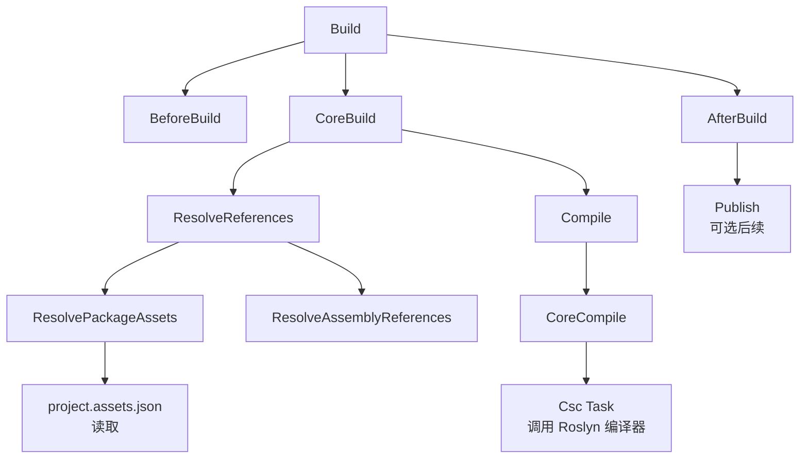

---
tags:
  - build-systems
  - tier3
  - msbuild
  - dotnet
---
# MSBuild 与 .NET 构建体系

> [!abstract] TL;DR
> MSBuild 是微软官方构建引擎，支撑 Visual Studio 全部项目类型与 `dotnet build` CLI，通过 XML DSL（`.csproj`/`.vcxproj`）描述 Property/Item/Target/Task 四大要素，在"评估阶段（静态 XML 展开）→ 执行阶段（Target DAG 调度）"两阶段模型中工作。SDK-style 项目大幅简化配置、隐式导入数百行标准 targets；NuGet `PackageReference` 将依赖图纳入构建评估；增量构建依赖 Inputs/Outputs 时间戳检查。与 Gradle/Bazel 相比，MSBuild 的差异化特质在于：评估阶段全部展开为不可变属性树，执行阶段才驱动 Task（C# 可扩展），两阶段严格分离使复杂 IDE 设计时构建成为可能。

## 概述与定位

MSBuild（Microsoft Build Engine）诞生于 2002 年，随 .NET Framework 1.1 一同发布，最初作为 Visual Studio 构建的幕后引擎而存在。2016 年微软将其迁移至 GitHub 并开源（MIT 协议），随后成为 .NET Core 及 .NET 5+ 跨平台构建的核心基础设施。`dotnet build`、`dotnet publish`、`dotnet pack` 等 SDK CLI 子命令全部委托 MSBuild 完成实际编译与打包动作；Visual Studio 的 F5 构建、Razor 视图编译、MAUI 移动应用打包同样在 MSBuild 之上运行。

MSBuild 的定位与 Make、CMake 存在本质差异：它是一个**面向 .NET 生态的专用构建 DSL + 执行引擎**，而非通用元构建工具。正因如此，MSBuild 的 XML 语法中内置了对 C#/VB/F# 编译、NuGet 包引用、资源嵌入、代码生成、发布配置等的原生理解，无需通过插件组合来支持这些基础能力。

**核心用途领域：**

- C#/F#/VB .NET 类库与可执行文件构建
- ASP.NET Core Web 应用与 Blazor 编译
- MAUI/Xamarin 移动/桌面跨平台打包
- Visual C++ 原生代码编译（`.vcxproj`）
- WPF/WinForms/XAML 应用编译与资源处理
- NuGet 包创建与发布（`dotnet pack`）
- 自定义 SDK（如 Unity、Avalonia、Microsoft.Build.Sdk.Extras）

**版本演进关键节点：**

| 版本 | 时间 | 里程碑 |
|------|------|--------|
| MSBuild 2.0 | 2005 | 随 VS 2005 发布，确立 Target/Task 模型 |
| MSBuild 4.0 | 2010 | 引入 `Condition` 动态函数调用、属性函数 |
| MSBuild 15 | 2017 | 随 VS 2017 / .NET Core 2.0，引入 SDK-style 项目 |
| MSBuild 16 | 2019 | 并行构建改进，`-m` 默认核心数 |
| MSBuild 17 | 2022 | 随 VS 2022，二进制日志（`.binlog`）成主流诊断工具 |
| MSBuild 17.8+ | 2024 | BuildCheck 静态分析框架进入预览 |

## 原理与机制

### 两阶段模型：评估 vs 执行

MSBuild 构建过程最根本的设计原则是**评估阶段（Evaluation Phase）与执行阶段（Execution Phase）的严格分离**，许多初学者踩坑的根源都在于混淆这两个阶段的语义。

**评估阶段**：MSBuild 读取并展开所有项目文件（`.csproj`、导入的 `.props`、`.targets`）。此阶段的工作是纯静态的 XML 处理：

1. 按照文件顺序处理所有 `PropertyGroup`，将属性值计算并存入属性字典（支持条件、属性函数）。
2. 处理所有 `ItemGroup`，将文件通配符（`**/*.cs`）展开为具体 Item 列表，并附加 Item Metadata。
3. 解析所有 `Import`，将外部 `.props`/`.targets` 文件递归展开并合并入当前属性/Item 空间。
4. 收集所有 `Target` 定义（包括 `DependsOnTargets`、`BeforeTargets`、`AfterTargets` 等依赖声明），构建 Target 依赖图。
5. **注意**：评估阶段不执行任何 Task，也不真正编译任何文件。

**执行阶段**：根据请求目标（默认 `Build`），按照依赖图拓扑排序执行每个 Target，在 Target 内部顺序调用 Task。Task 才是真正执行外部工具（编译器 `csc.exe`、资源编译器等）或执行文件操作的单元。

```
项目文件 + imports                评估阶段
──────────────────────────────────────────────────────
PropertyGroup → 属性字典（不可变快照）
ItemGroup     → Item 列表（带 Metadata）
Import        → 递归展开 .props/.targets
Target 定义   → DAG 节点（依赖声明）
──────────────────────────────────────────────────────
                                  执行阶段（按 DAG 顺序）
Target: ResolvePackageAssets
  └─ Task: ResolvePackageDependencies
Target: CoreCompile
  └─ Task: Csc（调用 C# 编译器）
Target: Build
  └─ 聚合依赖 BeforeBuild / CoreBuild / AfterBuild
```

这种设计的优势在于 **IDE 设计时构建（Design-Time Build）**：Visual Studio 需要在用户修改代码时随时获得"项目结构"信息（引用列表、编译器参数、NuGet 包路径），但不需要真正编译。设计时构建只运行评估阶段 + 部分特殊 Target（如 `ResolveAssemblyReferences`），速度极快，不影响编辑体验。

### 属性（Property）机制

属性是 MSBuild 中最基础的数据单元，以键值字符串对的形式存储，通过 `$(PropertyName)` 语法引用。

```xml
<PropertyGroup>
  <!-- 简单赋值 -->
  <AssemblyName>MyLibrary</AssemblyName>

  <!-- 属性函数：调用 .NET 静态方法 -->
  <BuildTimestamp>$([System.DateTime]::Now.ToString("yyyyMMdd-HHmm"))</BuildTimestamp>

  <!-- 条件属性：仅在 Release 配置下生效 -->
  <Optimize Condition="'$(Configuration)' == 'Release'">true</Optimize>

  <!-- 属性拼接（自引用追加） -->
  <DefineConstants>$(DefineConstants);MYFEATURE</DefineConstants>
</PropertyGroup>
```

属性赋值遵循**后定义覆盖前定义**原则，但有一个重要例外：在命令行通过 `-p:PropertyName=Value` 传入的属性具有**全局优先级**，不会被项目文件中的 `PropertyGroup` 覆盖（除非使用 `TreatAsLocalProperty`）。这是 CI/CD 系统注入配置的标准机制。

属性函数使 MSBuild 具备了非平凡的计算能力，内置支持：
- `$([MSBuild]::...)` MSBuild 内置函数（路径计算、版本比较等）
- `$([System.IO.Path]::...)` .NET BCL 静态方法
- `$([System.String]::...)` 字符串操作
- `$([System.Math]::...)` 数学函数

### Item 机制与 Metadata

Item 代表一组具名的结构化列表，通常是文件路径集合，每个 Item 可附加任意个 Metadata（键值对）。

```xml
<ItemGroup>
  <!-- 编译源文件（.NET SDK 隐式包含 **/*.cs） -->
  <Compile Include="src/**/*.cs" Exclude="src/Generated/**" />

  <!-- 带 Metadata 的 Item -->
  <Content Include="wwwroot/**/*">
    <CopyToOutputDirectory>PreserveNewest</CopyToOutputDirectory>
    <Link>%(RecursiveDir)%(Filename)%(Extension)</Link>
  </Content>

  <!-- PackageReference 是特殊 Item 类型，驱动 NuGet 还原 -->
  <PackageReference Include="Newtonsoft.Json" Version="13.0.3" />
</ItemGroup>
```

Item 转换（`Transform`）和批处理（`Batching`）是 MSBuild 的高级特性：

- **Item 转换**：`@(Compile -> '%(Filename).obj')` 将整个 Item 列表映射为新列表（类似 map 操作）。
- **Item 批处理**：在 Task 调用中使用 `%(Metadata)` 语法，MSBuild 会自动为每个不同的 Metadata 值分组并多次调用该 Task（类似 group-by + foreach）。

### Target 与依赖图

Target 是 MSBuild 中的"构建步骤"，类似于 Make 的规则或 Gradle 的 Task。Target 之间通过四种机制声明依赖关系：

```xml
<Target Name="MyTarget"
        DependsOnTargets="ResolveReferences;PrepareResources"
        BeforeTargets="CoreCompile"
        AfterTargets="Build"
        Inputs="@(Compile)"
        Outputs="$(OutputPath)$(AssemblyName).dll">
  <Message Text="Building..." Importance="high" />
  <Csc Sources="@(Compile)" OutputAssembly="$(OutputPath)$(AssemblyName).dll" />
</Target>
```

| 依赖声明 | 语义 |
|----------|------|
| `DependsOnTargets` | 本 Target 执行前必须先执行的 Target 列表（强依赖） |
| `BeforeTargets` | 将本 Target 注入为指定 Target 的**前置**（扩展点，不修改目标 Target） |
| `AfterTargets` | 将本 Target 注入为指定 Target 的**后置**（扩展点） |
| `Inputs`/`Outputs` | 增量构建时间戳检查：若输出均新于输入，则跳过执行 |

`BeforeTargets`/`AfterTargets` 是 MSBuild 扩展性的核心机制：第三方 SDK 和 NuGet 包通过这两个属性将自己的 Target 注入标准构建流程，而无需修改标准 targets 文件。这实现了**开放-封闭原则**：标准构建过程对修改封闭，对扩展开放。

### Task：执行单元

Task 是 Target 的最小执行单元，每个 Task 对应一段 C# 代码（实现 `ITask` 接口），负责完成具体工作：调用编译器、复制文件、生成代码、签名程序集等。

MSBuild 内置数十个标准 Task：

| Task | 功能 |
|------|------|
| `Csc` | 调用 C# 编译器（Roslyn） |
| `Vbc` | 调用 VB 编译器 |
| `Copy` | 复制文件 |
| `Delete` | 删除文件 |
| `Exec` | 执行任意命令行程序 |
| `Message` | 输出日志消息 |
| `WriteLinesToFile` | 写文件内容 |
| `CreateProperty` | 动态创建属性 |
| `MSBuild` | 递归调用 MSBuild 构建另一个项目 |
| `ResolveAssemblyReferences` | 解析程序集引用路径 |
| `GenerateResource` | 编译 `.resx` 资源文件 |

自定义 Task 是 MSBuild 扩展性的核心渠道，下文 "工具视角与实战" 章节详细展开。

## 结构/算法/伪代码详解

### SDK-style 项目与隐式 Import

传统（Legacy）`.csproj` 格式冗长，包含数百行 XML，明确列出每个 `.cs` 文件，手动指定编译器路径，管理包引用格式复杂。.NET Core 2.0（2017 年随 MSBuild 15 引入）的 **SDK-style 项目格式**彻底简化了项目文件：

```xml
<!-- 极简 SDK-style .csproj -->
<Project Sdk="Microsoft.NET.Sdk">
  <PropertyGroup>
    <TargetFramework>net8.0</TargetFramework>
    <Nullable>enable</Nullable>
    <ImplicitUsings>enable</ImplicitUsings>
  </PropertyGroup>

  <ItemGroup>
    <PackageReference Include="Microsoft.Extensions.Logging" Version="8.0.0" />
  </ItemGroup>
</Project>
```

`<Project Sdk="Microsoft.NET.Sdk">` 这一行触发了 MSBuild 的 SDK 解析机制，等效于在项目文件头部和尾部分别插入两个 Import：

```xml
<!-- 展开后等效于 -->
<Import Project="$(MSBuildSDKsPath)\Microsoft.NET.Sdk\Sdk\Sdk.props" />

<!-- 用户自定义内容 -->

<Import Project="$(MSBuildSDKsPath)\Microsoft.NET.Sdk\Sdk\Sdk.targets" />
```

`Sdk.props` 设置大量默认属性（输出路径、中间输出目录、平台目标等），`Sdk.targets` 定义所有构建 Target 以及**隐式 Item 包含规则**：

- `**/*.cs` 自动包含为 `<Compile>` Item
- `**/*.resx` 自动包含为 `<EmbeddedResource>` Item
- `wwwroot/**` 在 Web SDK 中自动包含为 `<Content>` Item

这将一个简单控制台应用的项目文件从 200+ 行压缩到不足 10 行，同时保留完整的可定制性（通过显式声明覆盖默认值）。

### Directory.Build.props 与 Directory.Build.targets

在大型多项目仓库中，跨项目共享构建属性是常见需求。MSBuild 提供了**目录级属性文件**机制：

```
repo/
├── Directory.Build.props      ← 对所有子目录项目生效（早于 SDK 导入）
├── Directory.Build.targets    ← 对所有子目录项目生效（晚于 SDK 导入）
├── src/
│   ├── MyLibrary/
│   │   ├── Directory.Build.props  ← 仅对 MyLibrary/ 子树生效
│   │   └── MyLibrary.csproj
│   └── MyApp/
│       └── MyApp.csproj
└── tests/
    └── MyTests/
        └── MyTests.csproj
```

MSBuild 在评估每个项目时，从项目文件所在目录向上递归查找 `Directory.Build.props`，找到最近的一个（或多个，通过 `$([MSBuild]::GetPathOfFileAbove(...))` 链式导入多级）后将其隐式导入。

**典型用途：**

```xml
<!-- Directory.Build.props：仓库级公共设置 -->
<Project>
  <PropertyGroup>
    <!-- 所有项目统一版本 -->
    <LangVersion>latest</LangVersion>
    <Nullable>enable</Nullable>
    <TreatWarningsAsErrors>true</TreatWarningsAsErrors>

    <!-- 统一输出路径（避免各项目 bin/ 分散） -->
    <BaseOutputPath>$(MSBuildThisFileDirectory)artifacts\bin\</BaseOutputPath>
    <BaseIntermediateOutputPath>$(MSBuildThisFileDirectory)artifacts\obj\</BaseIntermediateOutputPath>

    <!-- 公司信息统一注入 NuGet 包元数据 -->
    <Company>Acme Corp</Company>
    <Authors>Acme Corp</Authors>
    <Copyright>Copyright © $([System.DateTime]::Now.Year) Acme Corp</Copyright>
  </PropertyGroup>
</Project>
```

```xml
<!-- Directory.Build.targets：仓库级统一 Target 注入 -->
<Project>
  <!-- 在所有项目 Build 完成后打印输出路径 -->
  <Target Name="ReportOutputs" AfterTargets="Build">
    <Message Text="Built: $(TargetPath)" Importance="high" />
  </Target>
</Project>
```

### NuGet PackageReference 与依赖图还原

现代 MSBuild 项目通过 `PackageReference` 声明 NuGet 依赖，NuGet 客户端（集成在 SDK 中）在构建前的 `Restore` Target 中完成依赖图解析：

```xml
<ItemGroup>
  <PackageReference Include="Microsoft.EntityFrameworkCore" Version="8.0.0" />
  <PackageReference Include="Serilog" Version="3.1.1" />
  <!-- PrivateAssets 控制传递性：不向上传递 Analyzers 依赖 -->
  <PackageReference Include="StyleCop.Analyzers" Version="1.2.0-beta.507"
                    PrivateAssets="all" />
</ItemGroup>
```

**还原流程：**

1. 读取 `PackageReference` Item 列表，结合 `TargetFramework` 生成依赖解析请求。
2. NuGet 执行**版本选择算法**（最低适用版本原则，Minimum Version Selection）解决传递依赖冲突。
3. 从配置的 feed（`NuGet.Config` 中的 `packageSources`）下载 `.nupkg` 文件，解压至全局包缓存（`~/.nuget/packages/`）。
4. 生成 `project.assets.json`（锁定文件），记录完整依赖图（包含所有传递依赖的精确版本、程序集路径）。
5. 后续构建步骤（`ResolvePackageAssets` Target）读取 `project.assets.json`，将包内 `.dll` 路径注入 `Reference` Item 列表，传递给 `Csc` Task。

`project.assets.json` 是 NuGet 还原的核心产物，路径为 `obj/project.assets.json`，应纳入版本控制（`.gitignore` 中通常排除 `obj/` 整个目录，但 `packages.lock.json` 是另一个可纳入管理的锁定文件）。

使用 `--locked-mode` 或在项目中设置 `<RestoreLockedMode>true</RestoreLockedMode>` 可要求 NuGet 在 `packages.lock.json` 不匹配时报错而非自动更新，这对于 CI/CD 确保依赖一致性非常关键。

### 增量构建：Inputs/Outputs 检查机制

MSBuild 的增量构建基于**文件时间戳比较**，而非内容哈希（这是与 Bazel 的重要差异）：

```xml
<Target Name="GenerateCode"
        Inputs="templates/model.tt;$(MSBuildProjectFile)"
        Outputs="$(IntermediateOutputPath)GeneratedModel.cs">
  <Exec Command="t4 templates/model.tt -o $(IntermediateOutputPath)GeneratedModel.cs" />
</Target>
```

MSBuild 在执行 Target 前检查：若 `Outputs` 中**所有**文件均存在，且其最新修改时间**晚于** `Inputs` 中**所有**文件的最新修改时间，则跳过该 Target（标记为 Up-to-date）。

**增量构建的局限性：**

- 基于时间戳而非内容哈希：若源文件被 `touch`（时间戳更新但内容不变），MSBuild 会触发不必要重建。
- 无沙箱隔离：Task 可以读写 `Inputs`/`Outputs` 声明之外的任何文件，正确性依赖 Target 作者的声明准确性。
- 不跨机器共享：缓存仅在本机有效，CI 每次全量构建（除非配置 `BinLog` 分析后手动恢复 `obj/` 目录）。

对比 Bazel/Buck2 的内容寻址缓存，MSBuild 的增量构建更"脆弱"，但实现简单、无需额外基础设施，对多数日常开发场景足够用。

### Target 执行顺序与 DAG 解析

```
flowchart TD
    A[Build] --> B[BeforeBuild]
    A --> C[CoreBuild]
    A --> D[AfterBuild]
    C --> E[ResolveReferences]
    C --> F[Compile]
    E --> G[ResolvePackageAssets]
    E --> H[ResolveAssemblyReferences]
    F --> I[CoreCompile]
    I --> J["Csc Task（调用 Roslyn）"]
    G --> K["NuGet Lock 读取"]
```



MSBuild 在评估阶段构建完整的 Target DAG 后，执行阶段按拓扑排序顺序串行（或并行，通过 `-m` 参数）执行各 Target。若两个 Target 之间无依赖关系，且启用了 `-m`（多进程并行），它们可以在不同的 MSBuild Worker 进程中并发执行（但 Target 内的 Task 始终串行）。

### 多项目并行构建算法

`-m[:n]` 参数启用多进程构建（`n` 默认为 CPU 核心数）。对于解决方案（`.sln`）级构建，MSBuild 分析项目间依赖关系（通过 `ProjectReference` Item），生成项目依赖图，然后调度无依赖关系的项目并发构建：

```
项目依赖图示例：
MyApp → MyLibA → CommonLib
MyApp → MyLibB → CommonLib

并行调度：
  轮次1: CommonLib（无依赖）
  轮次2: MyLibA, MyLibB（并发，均只依赖已完成的 CommonLib）
  轮次3: MyApp（依赖 MyLibA、MyLibB 均已完成）
```

每个项目在独立的 MSBuild Worker 进程中构建，通过命名管道与协调进程通信。这避免了进程内状态污染，但也意味着进程启动开销（JIT 热身）在大量小项目场景下会成为瓶颈。

## 工具视角与实战

### dotnet build 与 msbuild CLI

两个入口最终都调用 MSBuild 引擎，区别在于 `dotnet build` 隐式限定了 .NET SDK 的上下文：

```bash
# dotnet CLI 方式（推荐，自动选择正确 SDK）
dotnet build MyApp.csproj -c Release -f net8.0

# 直接调用 msbuild（需要 Visual Studio 或 Build Tools 安装）
msbuild MyApp.csproj /p:Configuration=Release /p:TargetFramework=net8.0 /t:Build

# 多核并行构建（-m 参数）
dotnet build -m MyApp.sln

# 详细诊断日志（-v 控制 verbosity）
dotnet build -v detailed 2>&1 | head -200

# 生成二进制日志（.binlog）供 MSBuild Structured Log Viewer 分析
dotnet build -bl:build.binlog
```

**关键 CLI 参数速查：**

| 参数 | 说明 |
|------|------|
| `-c Release` / `/p:Configuration=Release` | 设置构建配置 |
| `-f net8.0` / `/p:TargetFramework=net8.0` | 指定目标框架 |
| `-o ./publish` | 指定输出目录 |
| `-m[:n]` | 启用并行构建 |
| `-p:Foo=Bar` | 传入 MSBuild 属性（全局优先级） |
| `-t:Clean;Build` | 指定要执行的 Target |
| `-v minimal/normal/detailed/diagnostic` | 日志详细程度 |
| `-bl[:path]` | 生成二进制结构化日志 |
| `--no-restore` | 跳过 NuGet 还原（已还原时提速） |
| `--no-incremental` | 禁用增量构建（强制全量） |

### 二进制日志（.binlog）与诊断

MSBuild 17.x 推广的 `.binlog` 格式是构建诊断的革命性工具。与传统文本日志相比，`.binlog` 保存了完整的结构化构建事件，可通过 **MSBuild Structured Log Viewer**（`MSBuildLog.exe`）以图形化方式分析：

- 完整的 Target 执行时间火焰图
- 每个 Task 的输入/输出文件列表
- 属性/Item 的来源追溯（在哪个文件的哪一行被定义/修改）
- 增量构建跳过/执行原因

`binlog` 常见诊断场景：
1. **"为什么这个文件被编译进来了？"** → 追溯 `Compile` Item 的来源
2. **"为什么构建这么慢？"** → 查看 Target 执行时间分布
3. **"这个属性的值是什么？"** → 搜索属性评估历史

### 自定义 Task 开发

实现 `Microsoft.Build.Framework.ITask` 接口（通过继承 `Microsoft.Build.Utilities.Task` 简化）：

```csharp
using Microsoft.Build.Framework;
using Microsoft.Build.Utilities;

public class ValidateApiContract : Task
{
    // [Required] 标记必须由 MSBuild 注入的属性
    [Required]
    public ITaskItem[] ApiFiles { get; set; }

    [Required]
    public string ContractSchemaPath { get; set; }

    // [Output] 标记 Task 的输出（可被后续 Task 读取）
    [Output]
    public string[] ValidationErrors { get; set; }

    public override bool Execute()
    {
        var errors = new List<string>();

        foreach (var apiFile in ApiFiles)
        {
            var filePath = apiFile.GetMetadata("FullPath");
            Log.LogMessage(MessageImportance.Normal, $"Validating {filePath}");

            // 实际验证逻辑...
            if (!ValidateFile(filePath, ContractSchemaPath, out var fileErrors))
            {
                foreach (var err in fileErrors)
                {
                    // Log.LogError 会使构建失败
                    Log.LogError(null, null, null, filePath, 0, 0, 0, 0, err);
                    errors.Add(err);
                }
            }
        }

        ValidationErrors = errors.ToArray();
        // 返回 false 表示 Task 失败，构建终止
        return !Log.HasLoggedErrors;
    }

    private bool ValidateFile(string path, string schema, out string[] errors)
    {
        // ... 验证实现
        errors = Array.Empty<string>();
        return true;
    }
}
```

在 `.targets` 文件中注册并使用自定义 Task：

```xml
<!-- 注册 Task 程序集 -->
<UsingTask TaskName="ValidateApiContract"
           AssemblyFile="$(MSBuildThisFileDirectory)tools\MyBuildTasks.dll" />

<!-- 在构建流程中使用 Task -->
<Target Name="ValidateContracts" BeforeTargets="CoreCompile">
  <ValidateApiContract
      ApiFiles="@(OpenApiSpec)"
      ContractSchemaPath="$(MSBuildThisFileDirectory)schema\api-contract.json">
    <Output TaskParameter="ValidationErrors" ItemName="ContractValidationErrors" />
  </ValidateApiContract>

  <Error Condition="@(ContractValidationErrors->Count()) &gt; 0"
         Text="API contract validation failed: @(ContractValidationErrors, '; ')" />
</Target>
```

**Task 性能注意事项：**

- Task 程序集在 MSBuild Worker 进程中长期驻留（跨 Target 执行），应避免大量静态可变状态。
- 若 Task 程序集有原生依赖或需要不同 .NET 版本，使用 `TaskFactory="TaskHostFactory"` 强制在独立进程中执行（性能代价是跨进程调用开销）。

### Roslyn 增量编译与编译器服务器

`dotnet build` 默认启用 **Roslyn 编译器服务器（VBCSCompiler）**：一个长驻后台进程，在同一机器的多次构建间保持解析缓存。Roslyn 的增量编译能力（Incremental Compilation API）允许在符号未变更时跳过语义分析，显著加速频繁的小改动编译。

这是 MSBuild 生态特有的优化层，Make/CMake 等工具没有原生等效机制（CMake 依赖编译器自身的 PCH/模块缓存）。

### 多目标框架构建（Multi-Targeting）

```xml
<PropertyGroup>
  <!-- 同时构建 .NET Standard 2.1 和 .NET 8 两个目标框架 -->
  <TargetFrameworks>netstandard2.1;net8.0</TargetFrameworks>
</PropertyGroup>

<ItemGroup>
  <!-- 仅在 .NET 8 下引用特定包 -->
  <PackageReference Include="Microsoft.Extensions.Http.Resilience" Version="8.0.0"
                    Condition="'$(TargetFramework)' == 'net8.0'" />
</ItemGroup>
```

多目标构建实质上是 MSBuild 为每个目标框架独立执行一次完整构建流程（内部通过 `MSBuild` Task 递归调用自身，传入不同的 `TargetFramework` 属性），最终将多个输出合并为单一 NuGet 包的 `lib/` 目录结构。

### 与 Visual Studio 的深度集成

MSBuild 与 Visual Studio 通过以下机制紧密集成：

1. **设计时构建（DTB）**：VS 在后台静默触发轻量级 MSBuild 评估，获取编译器参数、引用路径，为 IntelliSense 提供数据，无需完整构建。
2. **热重载（Hot Reload）**：Roslyn 通过 Edit and Continue API 与 MSBuild 协作，在运行时动态替换方法体，无需重启应用。
3. **Analyzer 集成**：Roslyn Analyzer NuGet 包（实现 `DiagnosticAnalyzer`）通过 `PackageReference` 引入，MSBuild 在 `CoreCompile` Target 中传递分析器 DLL 路径给编译器，在编译期执行静态分析。

### MSBuild 与 Visual C++ 项目

`.vcxproj` 是 C++ 项目文件格式，同样基于 MSBuild XML，但语义更复杂：

```xml
<ItemDefinitionGroup Condition="'$(Configuration)|$(Platform)'=='Release|x64'">
  <ClCompile>
    <Optimization>MaxSpeed</Optimization>
    <FunctionLevelLinking>true</FunctionLevelLinking>
    <IntrinsicFunctions>true</IntrinsicFunctions>
    <PreprocessorDefinitions>NDEBUG;%(PreprocessorDefinitions)</PreprocessorDefinitions>
    <RuntimeLibrary>MultiThreadedDLL</RuntimeLibrary>
    <WarningLevel>Level3</WarningLevel>
  </ClCompile>
  <Link>
    <EnableCOMDATFolding>true</EnableCOMDATFolding>
    <OptimizeReferences>true</OptimizeReferences>
  </Link>
</ItemDefinitionGroup>
```

C++ 的 `ItemDefinitionGroup` 机制允许为 Item 类型设置默认 Metadata，类似"模板属性"。这是 MSBuild 处理大量文件（C++ 源文件通常数百个）时避免重复声明的重要机制。

## 安全性与正确使用

### NuGet 供应链安全

NuGet 生态的供应链安全是 .NET 项目不可回避的话题，攻击面主要包括：

**1. 依赖混淆攻击（Dependency Confusion）**

当内部私有包与公共 NuGet.org 存在同名包时，若 NuGet 配置不当会从公共源拉取恶意包。防护措施：

```xml
<!-- NuGet.Config：明确声明私有包前缀，强制从内部源获取 -->
<configuration>
  <packageSources>
    <add key="Internal" value="https://pkgs.dev.azure.com/myorg/feed/v3/index.json" />
    <add key="nuget.org" value="https://api.nuget.org/v3/index.json" />
  </packageSources>
  <!-- 配置包命名空间隔离：指定前缀只从特定源获取 -->
  <packageSourceMapping>
    <packageSource key="Internal">
      <package pattern="MyCompany.*" />
    </packageSource>
    <packageSource key="nuget.org">
      <package pattern="*" />
    </packageSource>
  </packageSourceMapping>
</configuration>
```

**packageSourceMapping**（NuGet 6.0+）是防御依赖混淆的官方机制，将包前缀与源绑定，避免意外从公共源拉取同名包。

**2. 包签名验证**

NuGet 支持包签名（Authenticode + NuGet 作者签名），可在 `NuGet.Config` 中配置 `trustedSigners` 要求所有包必须来自受信任签名者：

```xml
<configuration>
  <trustedSigners>
    <author name="Microsoft">
      <certificate fingerprint="<SHA256指纹>" hashAlgorithm="SHA256" allowUntrustedRoot="false" />
    </author>
  </trustedSigners>
  <config>
    <!-- 仅允许已签名的包 -->
    <add key="signatureValidationMode" value="require" />
  </config>
</configuration>
```

**3. 包版本锁定（Packages Lock File）**

```xml
<!-- 启用确定性还原锁定 -->
<PropertyGroup>
  <RestorePackagesWithLockFile>true</RestorePackagesWithLockFile>
  <RestoreLockedMode Condition="'$(CI)' == 'true'">true</RestoreLockedMode>
</PropertyGroup>
```

在 CI 环境设置 `RestoreLockedMode=true` 确保还原结果与 `packages.lock.json` 中记录的完全一致，防止依赖意外升级。`packages.lock.json` 应纳入版本控制。

**4. 构建脚本注入**

MSBuild 文件（`.csproj`、`.targets`）本质上是可执行的构建脚本，`<Exec Command="..." />` Task 可以执行任意命令。在以下场景存在注入风险：

- 从不受信任的 NuGet 包中导入 `.targets` 文件（`.nupkg` 可包含 `build/*.targets`，在安装时自动被项目导入）
- 用户可控内容流入 `<Exec Command>` 参数（如文件名含分号或特殊字符）
- 多租户构建环境中项目文件来自不受信任来源

防护策略：
- 在 CI/CD 中使用独立的构建代理，每次构建在全新容器中运行（最强隔离）
- 启用 `RestoreLockedMode`，结合 NuGet Package Lock File 和 `packageSourceMapping` 限制可还原的包
- 对引入 `.targets` 文件的第三方包进行代码审查（`NuGet Package Explorer` 可查看包内容）
- 避免在 `<Exec>` 中拼接来自 Item Metadata 的字符串（Item Metadata 值可能来自用户控制的文件名）

**5. SBOM 与 SLSA 合规**

对于需要满足软件供应链合规要求的场景，Microsoft SBOM Tool（开源，`microsoft/sbom-tool`）可在 MSBuild 构建完成后扫描输出目录，生成符合 SPDX 2.2/3.0 标准的 SBOM 文件：

```yaml
# GitHub Actions 示例
- name: 生成 SBOM
  run: |
    dotnet tool install --global Microsoft.Sbom.DotNet
    dotnet-sbom generate \
      --BuildDropPath ./publish \
      --PackageName MyApp \
      --PackageVersion ${{ github.ref_name }} \
      --PackageSupplier AcmeCorp
```

NuGet 包的 `project.assets.json` 提供完整的依赖图，是 SBOM 生成的天然数据源，比 Make/CMake 生态更容易实现完整 SBOM。

### 构建确定性（Deterministic Builds）

```xml
<PropertyGroup>
  <!-- 启用确定性编译：相同源代码输出字节完全相同的二进制 -->
  <Deterministic>true</Deterministic>
  <!-- 移除 PDB 中的本机路径（提高可复现性，避免泄露开发机路径） -->
  <PathMap>$(MSBuildProjectDirectory)=/src/$(MSBuildProjectName)</PathMap>
  <!-- 不嵌入当前时间戳 -->
  <DebugType>portable</DebugType>
</PropertyGroup>
```

`<Deterministic>true</Deterministic>` 让 Roslyn 产生字节级确定性输出，配合 `PathMap` 消除路径差异，使同一源代码在不同机器上产生完全相同的二进制，支持可复现构建审计。

### 凭据与 Feed 认证安全

在 CI 中访问私有 NuGet Feed 时，避免将凭据硬编码在 `NuGet.Config`：

```xml
<!-- 使用环境变量占位符（Azure Pipelines / GitHub Actions 支持） -->
<packageSourceCredentials>
  <Internal>
    <add key="Username" value="unused" />
    <!-- %NUGET_TOKEN% 在 CI 中由 Secret 注入 -->
    <add key="ClearTextPassword" value="%NUGET_TOKEN%" />
  </Internal>
</packageSourceCredentials>
```

Azure DevOps 的 Artifact Feeds 还支持通过 Credential Provider（`Microsoft.VisualStudio.Services.NuGet.CredentialProvider`）自动获取令牌，无需在配置文件中存储凭据。

## 小结

MSBuild 与 .NET 构建体系围绕**两阶段执行模型**（评估 → 执行）和 **Property/Item/Target/Task 四大原语**构建，SDK-style 项目格式以极简 XML 封装了大量约定，同时保留了完整的可扩展性。

**核心优势：**

- **IDE 深度集成**：设计时构建、热重载、Analyzer 管线均建立在 MSBuild 之上，无缝支持 Visual Studio 全功能工作流。
- **SDK 标准化**：`Microsoft.NET.Sdk` 及其变体（Web/Worker/MAUI）将数百行样板配置压缩为个位数行，降低了维护成本。
- **NuGet 生态成熟**：`PackageReference` + 版本选择算法 + 锁定文件提供了生产级依赖管理，与 Maven Central/crates.io 在成熟度上对标。
- **Task C# 扩展**：自定义构建逻辑可以用 C# 编写，充分利用 .NET 生态资源，而非学习专用 DSL 或 Shell 脚本。
- **`.binlog` 诊断**：结构化二进制日志 + 图形化 Viewer 使构建诊断的深度远超传统工具。

**核心局限：**

- **增量构建可靠性较弱**：基于时间戳而非内容哈希，大型团队场景下"假命中"问题更突出，无跨机器缓存。
- **XML 语法冗长**：非 SDK-style 的 Legacy 项目（尤其 `.vcxproj`）可读性差，条件表达式嵌套深时调试困难。
- **非 Windows 生态的二等公民**：尽管 MSBuild 已跨平台，macOS/Linux 上运行 `.vcxproj` 或 WPF 项目仍有诸多限制，非 .NET 项目几乎不考虑 MSBuild。
- **沙箱隔离缺失**：Task 可随意读写文件系统，无 Bazel 式沙箱保证 hermetic 构建。

**与其他工具的横向对比：**

| 维度 | MSBuild | Gradle | Bazel | CMake |
|------|---------|--------|-------|-------|
| 语言/格式 | XML DSL | Groovy/Kotlin DSL | Starlark | CMake DSL |
| 目标生态 | .NET/C++ | JVM/Android | 多语言 | C/C++ 为主 |
| 增量缓存 | 时间戳 | 内容哈希（本地） | 内容哈希（本地+远程） | 时间戳 |
| 沙箱隔离 | 无 | 无 | 有（严格） | 无 |
| 扩展语言 | C# | Java/Kotlin | Go/Python（规则） | CMake 脚本 |
| 并行粒度 | 项目级 | Task 级 | Action 级 | 进程级（Ninja 后端） |
| IDE 集成 | 深度（VS） | 深度（IntelliJ） | 有限 | 良好（CLion/VS） |
| 跨机器缓存 | 无原生支持 | Build Cache API | RBE 协议 | ccache 集成 |

MSBuild 在 .NET 生态中是无可替代的核心基础设施，理解其两阶段模型和扩展机制是 .NET 平台工程师的必备能力。对于跨语言大规模单仓场景，可考虑以 Bazel 替代 MSBuild 用于 C# 项目，但需要付出 SDK 集成和 IDE 支持方面的较大迁移成本。

## 相关阅读

- [MSBuild 官方文档（Microsoft Learn）](https://learn.microsoft.com/zh-cn/visualstudio/msbuild/msbuild)
- [.NET SDK 项目格式参考](https://learn.microsoft.com/zh-cn/dotnet/core/project-sdk/overview)
- [NuGet PackageReference 格式](https://learn.microsoft.com/zh-cn/nuget/consume-packages/package-references-in-project-files)
- [MSBuild Structured Log Viewer](https://msbuildlog.com/)（`.binlog` 可视化工具）
- [NuGet 包源映射](https://learn.microsoft.com/zh-cn/nuget/consume-packages/package-source-mapping)（供应链安全）
- [Reproducible Builds with MSBuild](https://learn.microsoft.com/zh-cn/dotnet/core/deploying/deterministic)
- [Custom MSBuild Tasks](https://learn.microsoft.com/zh-cn/visualstudio/msbuild/task-writing)
- [Directory.Build.props 与 Directory.Build.targets](https://learn.microsoft.com/zh-cn/visualstudio/msbuild/customize-by-directory)
- [NuGet packages.lock.json](https://learn.microsoft.com/zh-cn/nuget/consume-packages/package-references-in-project-files#lock-file)
- [microsoft/sbom-tool](https://github.com/microsoft/sbom-tool)（SBOM 生成工具）

---

[[00.构建系统横向对比总览|⬆ 系列总览]] | [[15.Nix与Guix可复现构建|← 上一章]] | [[17.Monorepo工具Nx与Turborepo与Pants|→ 下一章]]
