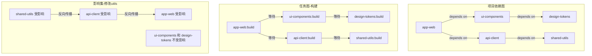
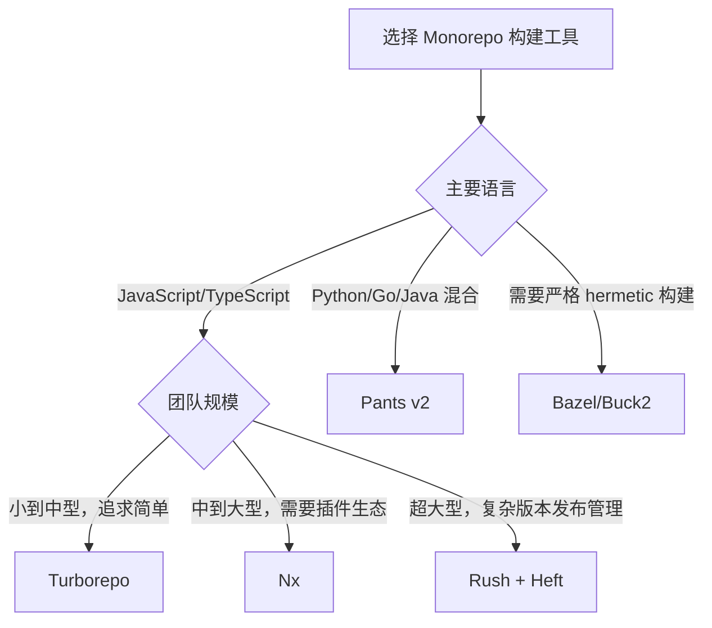

---
tags:
  - build-systems
  - tier3
  - monorepo
  - nx
---
# Monorepo 构建工具：Nx、Turborepo 与 Pants

> [!abstract] TL;DR
> Monorepo 构建工具是介于通用构建系统（Make/Bazel）与包管理器之间的"任务编排层"：它们以项目依赖图为核心，通过影响分析（affected analysis）避免重复构建，通过内容哈希缓存加速重复工作，通过拓扑并行执行压缩 CI 时间。Nx 深耕 JavaScript/TypeScript 全栈生态；Turborepo 以极简配置著称，Vercel 背书；Pants v2 面向多语言（Python/Go/Java），细粒度堪比 Bazel；Rush 聚焦大型 npm 企业仓库的发布边界管理。理解这些工具的核心在于理解三件事：**依赖图如何构建**、**影响集如何计算**、**缓存键如何设计**。

## 概述与定位

### Monorepo 的本质诉求

Monorepo（单一代码仓库存放多个项目/包）在工程层面解决了跨项目协作的版本对齐问题：共享组件修改即时可见，API 合约重构可以原子提交，CI 验证可以覆盖全链路。然而，代价是规模爆炸：一个包含 200 个 npm 包的 monorepo，朴素的"全量构建"会把平均 CI 时间推到数十分钟。

Monorepo 构建工具的核心使命是**精确计算"本次变更需要重新执行哪些任务"**，并让其余任务命中缓存直接跳过。这与 Bazel/Ninja 追求的目标高度相似，但定位截然不同：

| 维度 | Bazel/Buck2 | Nx/Turborepo/Pants |
|---|---|---|
| **主要生态** | 多语言、大厂内部 | 特定语言生态友好 |
| **描述方式** | BUILD 文件手写 | 自动发现/约定优于配置 |
| **沙盒隔离** | 严格 hermetic | 松散（Pants 居中） |
| **学习曲线** | 陡峭 | 平缓到中等 |
| **远程执行** | 原生 RBE 协议 | 远程缓存（非执行） |
| **适用规模** | 数万节点单仓 | 数十到数千包 |

Bazel 的"正确性优先"代价是陡峭的学习曲线和繁重的规则维护。Monorepo 专用工具的哲学是：**80% 场景的正确性，用 20% 的配置代价换取**。对于大多数中型工程团队，这是更务实的选择。

### 工具品类速览

**Nx**（前身 Narwhal/Nrwl）：2016 年起源于 Angular CLI 周边生态，现已支持 React、Next.js、Nest.js、Node.js、Go、Rust 等多语言插件体系。核心特性是 `nx affected`（影响分析）、computation caching（本地缓存）、Nx Cloud（分布式远程缓存与任务分片）。

**Turborepo**：2021 年由 Jared Palmer 创建，2022 年被 Vercel 收购。以 Rust 重写核心（v1.x 起），以极简的 `turbo.json` pipeline 配置著称。与 Next.js/Vercel 生态深度集成，远程缓存与 Vercel 平台打通。

**Pants**（v2，2020 年重写）：Foursquare/Twitter 主导开发的多语言构建系统，支持 Python、Go、Java/Scala、JavaScript、Shell。以 BUILD 文件（Pants 特有语法，非 Bazel）描述目标，细粒度到单个 Python 文件级别，支持远程缓存与远程执行。

**Rush**（微软）：聚焦超大型 npm monorepo 的**发布边界管理**，内置 pnpm 集成、变更日志生成、版本发布策略（rush publish/change/bump）。构建加速通过与 Heft（Rush Stack 构建协调器）配合实现，不直接提供全局缓存。

**Lerna**（历史参考）：早期 monorepo 管理工具，v7 起移交 Nx 团队维护，核心 CI 加速能力已委托给 Nx 执行。

## 原理与机制

### 依赖图构建

所有 Monorepo 工具的第一步是构建**项目依赖图（Project Graph / Dependency Graph）**。这个图的节点是"项目/包"，边是"A 依赖 B"。

**静态解析路径**：读取 `package.json`（npm）、`pyproject.toml`（Python）、`go.mod`（Go）中的显式依赖声明，加上 BUILD 文件中的显式 `deps` 字段。这是最可靠的来源，边的语义明确。

**动态分析路径**（Nx 独有）：Nx 还可以通过解析 TypeScript/JavaScript 的 `import` 语句，推断出**未在 package.json 中声明但代码中实际引用**的依赖。这对于 monorepo 内部库尤为重要：内部库往往直接通过 TypeScript path mapping 引用，不走 npm 版本。

```
// nx.json 中启用 JS 动态分析
{
  "pluginsConfig": {
    "@nx/js": {
      "analyzeSourceFiles": true
    }
  }
}
```

Pants 的依赖推断（`--dependency-inference`）更进一步：它解析 Python 的 `import` 语句，将其映射到具体的 BUILD 目标，完全无需手写 `deps`，在大型 Python 代码库中极大降低维护成本。

### 影响分析算法

影响分析（Affected Analysis）是 Monorepo 工具最核心的价值所在，其算法本质是**反向依赖闭包计算**。

算法步骤如下：

1. **获取变更文件集合**：通过 `git diff --name-only <base-ref>..HEAD` 获得本次改动的文件列表。
2. **文件→项目映射**：将每个变更文件映射到其所属的项目/包（基于目录归属）。
3. **正向传播初始集**：初始受影响集 `A₀ = {改动文件所属项目}`。
4. **反向依赖闭包**：在依赖图中，找出所有"依赖了 A₀ 中某个项目"的项目，加入受影响集，反复迭代直到不动点。

数学上等价于：

```
Affected = A₀ ∪ {p | ∃q ∈ Affected, p depends_on q}
```

即计算 A₀ 在依赖图的**反向可达闭包**（Reverse Transitive Closure）。

**具体示例**：假设依赖图为 `app -> ui-lib -> utils`，修改了 `utils` 中的一个函数。受影响集为 `{utils, ui-lib, app}`——三者都需要重新测试。若只改了 `app` 自身，则受影响集为 `{app}`，`ui-lib` 和 `utils` 无需重跑。

这个看似简单的算法，在实现层面有若干重要细节：

- **base ref 的选取**：CI 中通常以 `main`/`master` 分支的最新提交为 base。本地开发时 Nx 允许 `--base=HEAD~1`。
- **配置文件变更处理**：修改 `nx.json`、`tsconfig.base.json` 等根级配置通常标记所有项目为 affected。
- **隐式依赖声明**：某些项目即使代码无依赖关系，但共享 CI 配置，可在 `nx.json` 中用 `implicitDependencies` 声明。

### 任务图与拓扑排序执行

仅有"哪些项目受影响"还不够，还需要确定**任务执行顺序**。以构建为例，`app` 的 `build` 任务必须在 `ui-lib` 的 `build` 完成后才能启动。

每个工具都会构建**任务图（Task Graph）**，节点为 `(项目, 任务名)` 的二元组，边为"必须先完成"关系。任务图的拓扑排序决定执行次序；在没有依赖关系的节点间，可以并行执行。

**Nx 的任务管道（Task Pipeline）** 在 `nx.json` 中声明：

```json
{
  "targetDefaults": {
    "build": {
      "dependsOn": ["^build"]
    },
    "test": {
      "dependsOn": ["build"]
    },
    "lint": {
      "dependsOn": []
    }
  }
}
```

`^build` 中的 `^` 表示"所有依赖项目的 build 任务"，不带 `^` 则表示"同项目内其他任务"。这个声明式配置驱动了整个任务图的生成。

**Turborepo 的 Pipeline**（`turbo.json`）语义类似：

```json
{
  "pipeline": {
    "build": {
      "dependsOn": ["^build"],
      "outputs": ["dist/**", ".next/**"]
    },
    "test": {
      "dependsOn": ["build"],
      "inputs": ["src/**/*.ts", "test/**/*.ts"]
    }
  }
}
```

`outputs` 字段告知 Turbo 哪些文件是构建产物（用于缓存恢复），`inputs` 字段限定缓存键的文件范围（仅这些文件变化才使缓存失效）。

### 缓存机制：内容哈希键设计

缓存是所有工具加速的另一主轴。缓存命中等价于"完全跳过此任务的执行，从存储中恢复输出"。

**缓存键（Cache Key）** 通常由以下要素组合的哈希值构成：

```
cache_key = hash(
  task_name,
  project_name,
  inputs_file_contents_hash,  # 相关源文件的内容哈希
  env_vars_hash,              # 影响构建的环境变量
  nx_version,                 # 工具自身版本
  dependency_project_hashes   # 依赖项目的输出哈希（传递性）
)
```

**内容哈希 vs 时间戳**：Make 使用文件修改时间戳（mtime），这在网络文件系统、git checkout（重置 mtime）等场景下极不可靠。Nx/Turborepo/Pants 均使用**文件内容哈希（SHA-256）**，从根本上解决了 mtime 的脆弱性——同样内容的文件无论何时生成，哈希不变，缓存永远命中。

**环境变量的处理**：构建结果往往与特定环境变量相关（如 `NODE_ENV`、`API_URL`）。Nx 通过 `nx.json` 的 `namedInputs` 或任务的 `env` 声明，Turborepo 通过 `globalEnv` / 任务级 `env` 字段，将相关环境变量纳入缓存键。未纳入声明的环境变量对缓存键无影响，可能导致"缓存污染"（同名 key 实际对应不同构建环境）。

**本地缓存**：默认存储在 `.nx/cache`（Nx）或 `node_modules/.cache/turbo`（Turborepo）。命中时从本地目录解压 tar，速度极快（通常毫秒级）。

**远程缓存**：将缓存 tar 上传到远程存储（S3、GCS、HTTP 服务），CI 实例和开发者本地共享同一缓存池。核心收益是：一台 CI Runner 构建了某个任务，其他 Runner 和所有开发者直接命中缓存。

## 结构/算法/伪代码详解

### Nx 架构深解

#### 项目图的持久化与增量更新

Nx 将项目图持久化为 `.nx/cache/project-graph.json`（早期版本为 `nx-project-graph.json`）。每次命令执行前，Nx 的守护进程（`nx daemon`）检测文件系统变化，决定是全量重建图还是增量更新。

守护进程通过 `chokidar`（Node.js 文件监听）实时感知 `package.json`、`project.json`、`BUILD` 等描述文件的变化，增量更新受影响的节点，避免每次命令都重新解析整个 monorepo 的文件树。

#### `nx affected` 命令流程

```
nx affected --target=build

1. 启动/连接 nx daemon
2. 读取/更新 project graph
3. git diff --name-only <base>..HEAD → changed_files
4. 将 changed_files 映射到 changed_projects
5. BFS/DFS 反向遍历依赖图 → affected_projects
6. 过滤 affected_projects 中支持 "build" target 的项目
7. 构建 task graph（考虑 dependsOn）
8. 拓扑排序 → 执行计划
9. 逐批执行（batch = 无依赖关系的任务并行）
   对每个任务：
     a. 计算 cache key
     b. 查本地缓存 → 命中则跳过
     c. 查远程缓存（若配置）→ 命中则下载恢复
     d. 未命中 → 执行任务 → 存入本地/远程缓存
```

#### 计算缓存的存储格式

Nx 本地缓存的每个条目是一个目录，名称即缓存键哈希，内部结构：

```
.nx/cache/<cache_key>/
├── outputs/          # 任务的输出文件（tar 包解压）
│   └── dist/
│       └── ...
├── terminalOutput    # 任务的 stdout/stderr 文本
└── source            # 元数据（任务名、时间戳等）
```

缓存命中时，Nx 将 `outputs/` 目录的内容**硬链接**（Linux/macOS）或**复制**（Windows）到项目实际输出目录，终端输出则重放 `terminalOutput` 文件内容，使开发者看到完整的"伪执行"日志。

### Turborepo 内部机制

#### Pipeline 到任务图的转换

Turbo 读取 `turbo.json` 的 pipeline 配置，结合 monorepo 的包结构（从 `package.json` workspaces 或 `pnpm-workspace.yaml` 解析），生成完整的任务图。

关键设计：`dependsOn: ["^build"]` 中 `^` 的语义在 Turbo 中是**跨包传播**——对包 A 执行 `build`，若 A 依赖包 B，则 B 的 `build` 必须先完成。没有 `^` 的 `dependsOn: ["build"]` 则是**包内前置**——先执行同包的 `build`，再执行 `test`。

#### 内容哈希计算

Turborepo 的缓存键哈希计算（Rust 实现，高性能）：

```
// 伪代码
fn compute_cache_key(task: Task) -> Hash {
    let mut hasher = Blake3::new();
    
    // 1. 任务标识
    hasher.update(task.package_name);
    hasher.update(task.task_name);
    
    // 2. inputs 文件内容哈希（glob 模式匹配）
    for file in glob(task.inputs) {
        hasher.update(file.content_hash_sha256());
    }
    
    // 3. 相关环境变量
    for env_var in task.env + global_env {
        hasher.update(env(env_var).unwrap_or(""));
    }
    
    // 4. 依赖包的输出哈希（传递）
    for dep in task.dependencies {
        hasher.update(compute_cache_key(dep));
    }
    
    // 5. turbo 版本
    hasher.update(TURBO_VERSION);
    
    hasher.finalize()
}
```

#### `turbo prune` — 子图裁剪

`turbo prune --scope=app-web --docker` 是 Turborepo 独有的重要命令：它从完整 monorepo 中提取出 `app-web` 及其所有传递依赖，生成一个最小子集的 `package.json` 和源码目录，专为 Docker 构建优化。

这个特性使得在容器化构建中，只需 COPY 相关源码而非整个 monorepo，大幅减少 Docker 上下文体积和构建层缓存失效范围。

### Pants v2 架构深解

#### BUILD 文件语法

Pants 的 BUILD 文件不是 Python 脚本，而是受限的声明式 Python 子集（允许调用预定义的 target 类型，不允许任意 Python 代码）：

```python
# src/py/analytics/BUILD
python_sources(
    name="lib",
    sources=["*.py"],
)

python_tests(
    name="tests",
    sources=["*_test.py"],
)

python_distribution(
    name="dist",
    dependencies=[":lib"],
    provides=setup_py(
        name="analytics",
        version="1.0.0",
    ),
)
```

Pants 的细粒度来自于：即使 `python_sources` 声明了一整个目录，其依赖推断（import 解析）可以将其细化到**单个 `.py` 文件级别**，缓存键精确到文件，避免不必要的缓存失效。

#### 依赖推断引擎

```
# Pants 依赖推断流程（伪代码）

for file in all_python_sources:
    imports = parse_imports(file)  # AST 解析 import 语句
    for imp in imports:
        if imp is third_party:
            map to requirements.txt entry
        elif imp is first_party:
            map to BUILD target owning the module
            add edge: file → target
```

Pants 内置了针对不同语言的依赖推断插件：Python（import 解析）、Go（import path）、Java（package 声明与 import）、Shell（source 语句）。

#### 远程缓存与远程执行

Pants 支持标准的 **Remote Execution API（REAPI，即 Bazel 使用的 gRPC 协议）**，可以直接对接 BuildBuddy、Buildfarm、Remote Build Execution 等服务。这是 Pants 相对于 Nx/Turborepo 的重要差异：Pants 不仅支持远程**缓存**（下载构建结果），还支持远程**执行**（将编译动作发送到远程 worker 并行执行）。

### 影响分析的边界情况

#### 根级配置文件变更

当 `tsconfig.base.json`、`.eslintrc.js`、`nx.json`、`turbo.json` 等根级配置发生变更时，理论上可能影响所有项目。各工具的处理策略：

- **Nx**：在 `namedInputs` 中声明 `sharedGlobals`，所有引用该 input 集合的任务都会在这些文件变更时缓存失效。默认配置通常包含 `{sharedGlobals: ["{workspaceRoot}/package.json", "{workspaceRoot}/nx.json"]}`。
- **Turborepo**：`globalDependencies` 字段声明影响所有包的文件，变更后所有任务缓存失效。
- **Pants**：`pants.toml` 变更通常触发全量重建。

#### 不可追踪的副作用

某些任务存在**不可追踪的外部副作用**：写入数据库、调用外部 API、修改全局状态。对于这类任务，缓存是危险的——同样的输入不代表同样的效果。

Nx 提供 `cache: false` 选项禁用特定任务的缓存；Turborepo 的 `outputs: []`（空输出）配合 `cache: false` 同样可以禁用。

```json
// turbo.json — 禁用 deploy 任务的缓存
{
  "pipeline": {
    "deploy": {
      "dependsOn": ["^build"],
      "cache": false
    }
  }
}
```

### 依赖图与任务图的 Mermaid 可视化



```mermaid
graph LR
    subgraph 缓存键组成
        TN[任务名称<br/>build] --> H[SHA-256<br/>哈希]
        PN[包名称<br/>api-client] --> H
        IF[输入文件内容<br/>src/**/*.ts] --> H
        EV[环境变量<br/>NODE_ENV=prod] --> H
        DH[依赖输出哈希<br/>shared-utils:build] --> H
        TV[工具版本<br/>turbo@2.x] --> H
        H --> CK[缓存键<br/>abc123def...]
    end
```

## 工具视角与实战

### Nx 实战：从零到影响分析

#### 初始化

```bash
# 新建 Nx 工作区
npx create-nx-workspace@latest my-monorepo \
  --preset=ts \
  --packageManager=pnpm

# 在已有 npm workspaces monorepo 中接入 Nx
npx nx@latest init
```

`nx init` 是低风险接入路径：它检测现有 `package.json` 工作区结构，自动生成最小化的 `nx.json`，不改变现有构建脚本。

#### 核心命令

```bash
# 构建所有受影响项目（相对于 main 分支）
npx nx affected --target=build --base=main

# 测试受影响项目，并行度 4
npx nx affected --target=test --base=main --parallel=4

# 可视化项目图（浏览器打开）
npx nx graph

# 查看单个任务的缓存键（调试用）
npx nx show task api-client:build --verbose

# 运行特定项目的任务
npx nx run api-client:build
npx nx run-many --target=build --projects=app-web,api-client
```

#### Nx 插件与 Generator

Nx 的生态核心是**插件系统**：`@nx/react`、`@nx/next`、`@nx/node`、`@nx/go` 等官方插件，以及社区插件（`@nx/rust`、`@nx-tools/container-image` 等）。

插件的两个核心能力：

1. **Executor（执行器）**：封装具体的构建/测试/lint 命令，将工具链（webpack、jest、eslint）与 Nx 任务系统对接。
2. **Generator（代码生成器）**：交互式脚手架，通过 `nx generate @nx/react:application` 生成符合 Nx 约定的项目骨架，自动更新 `project.json`。

#### Nx Cloud 分布式任务执行（DTE）

Nx Cloud 不只是远程缓存，还提供**分布式任务执行（Distributed Task Execution, DTE）**：将任务图分发到多台 CI 代理并行执行，主代理负责协调，各代理汇报结果并共享缓存。

```yaml
# GitHub Actions 使用 Nx Cloud DTE
- name: Start CI Run
  run: npx nx-cloud start-ci-run --distribute-on="3 linux-medium-js"

- name: Run affected
  run: npx nx affected --target=build,test,lint --parallel=5

- name: Stop CI Run
  run: npx nx-cloud stop-all-agents
```

三台代理并行，任务自动分配，CI 时间线性压缩到约 1/3。

### Turborepo 实战

#### 配置文件解析

```json
// turbo.json（v2 语法）
{
  "$schema": "https://turbo.build/schema.json",
  "globalEnv": ["NODE_ENV", "CI"],
  "globalDependencies": ["tsconfig.base.json"],
  "pipeline": {
    "build": {
      "dependsOn": ["^build"],
      "inputs": ["src/**", "package.json", "tsconfig.json"],
      "outputs": ["dist/**", ".next/**", "!dist/node_modules/**"],
      "env": ["API_BASE_URL"]
    },
    "test": {
      "dependsOn": ["^build"],
      "inputs": ["src/**", "test/**", "jest.config.*"],
      "outputs": ["coverage/**"],
      "env": ["TEST_DATABASE_URL"]
    },
    "lint": {
      "inputs": ["src/**", ".eslintrc.*", ".eslintignore"],
      "outputs": []
    },
    "dev": {
      "cache": false,
      "persistent": true
    }
  }
}
```

`persistent: true` 标记长期运行的开发服务器任务（不会因为"完成"而退出）；Turbo v2 对 persistent 任务有特殊调度，避免阻塞其他任务。

#### 远程缓存配置

```bash
# 使用 Vercel 远程缓存（需要 Vercel 账号）
npx turbo login
npx turbo link

# 使用自托管远程缓存（开源实现 ducktape-cache / turborepo-remote-cache）
TURBO_API="https://cache.example.com" \
TURBO_TOKEN="my-secret-token" \
TURBO_TEAM="my-team" \
turbo run build
```

自托管方案中，社区项目 `turborepo-remote-cache`（Ducktape）提供兼容 Turbo API 的缓存服务，可以部署在 AWS S3 后端，完全绕过 Vercel 服务。

#### `turbo prune` 的 Docker 最佳实践

```dockerfile
# 第一阶段：裁剪子图
FROM node:20-alpine AS pruner
WORKDIR /app
COPY . .
RUN npx turbo prune --scope=app-web --docker

# 第二阶段：安装依赖（利用 Docker 层缓存）
FROM node:20-alpine AS installer
WORKDIR /app
COPY --from=pruner /app/out/json/ .
COPY --from=pruner /app/out/pnpm-lock.yaml ./pnpm-lock.yaml
RUN pnpm install --frozen-lockfile

# 第三阶段：构建
FROM node:20-alpine AS builder
WORKDIR /app
COPY --from=installer /app/node_modules ./node_modules
COPY --from=pruner /app/out/full/ .
RUN pnpm turbo run build --filter=app-web

# 第四阶段：运行时
FROM node:20-alpine AS runner
WORKDIR /app
COPY --from=builder /app/apps/app-web/.next ./.next
COPY --from=builder /app/apps/app-web/public ./public
CMD ["node", "server.js"]
```

关键：`prune --docker` 输出两个目录：`out/json/`（只含 package.json，用于安装依赖时缓存层）和 `out/full/`（含源码，用于构建层），最大化 Docker 层缓存命中率。

### Pants v2 实战

#### 配置入口

```toml
# pants.toml
[GLOBAL]
pants_version = "2.19.0"
backend_packages = [
  "pants.backend.python",
  "pants.backend.python.lint.black",
  "pants.backend.python.lint.ruff",
  "pants.backend.python.typecheck.mypy",
]

[python]
interpreter_constraints = ["==3.11.*"]

[source]
root_patterns = ["/src"]
```

#### 关键命令

```bash
# 影响分析：只测试变更影响的 Python 目标
pants --changed-since=main test

# 格式化所有 Python 代码
pants fmt ::

# 类型检查受影响目标
pants --changed-since=origin/main check

# 打包 Python 分发包
pants package src/py/analytics:dist

# 查看目标的依赖图
pants dependencies src/py/analytics/service.py
pants dependents src/py/utils/shared.py  # 反向查询
```

`::` 是 Pants 的"全部目标"通配符；`src/py/analytics::` 表示 `src/py/analytics` 目录下的所有目标。

#### Python 虚拟环境隔离

Pants 为每个 Python 测试目标创建独立的 PEX（Python EXecutable）文件，实现进程级隔离。PEX 是一个自包含的 zip 文件，内含所有依赖和源码，无需激活虚拟环境即可执行：

```bash
# Pants 构建 PEX 可执行文件
pants package src/py/service:pex_binary
./dist/service.pex  # 直接执行，无依赖污染
```

### Rush 实战：大型 npm 企业仓的发布管理

Rush 的核心并非构建加速而是**版本/发布管理**。典型工作流：

```bash
# 开发者修改了 @mycompany/ui-kit
rush change  # 填写变更类型（major/minor/patch）和变更说明

# CI 中发布
rush version --bump  # 根据 rush change 记录自动 bump 版本
rush publish --apply --target-branch main  # 发布到 npm 并 push

# 局部构建（Heft 集成）
rush build --to @mycompany/app-web  # 只构建 app-web 及其依赖链
rush build --from @mycompany/ui-kit  # 只构建 ui-kit 及其下游
```

Rush 的依赖安装通过 `rush install`（底层调用 pnpm）统一管理，防止每个包各自运行 `npm install` 导致的幻影依赖（phantom dependency）问题。

### 工具选型决策矩阵



| 场景 | 推荐工具 | 理由 |
|---|---|---|
| Next.js/Vercel 技术栈 | Turborepo | 深度集成，零配置远程缓存 |
| 大型全栈 TS monorepo | Nx | 插件丰富，DTE 分布式执行 |
| Python 数据科学/后端 | Pants | 依赖推断强，PEX 隔离 |
| 多语言企业级 | Pants 或 Bazel | 取决于工程成熟度 |
| 微软/.NET 生态 | Rush | pnpm workspaces 最优 |
| 数万节点，严格沙盒 | Bazel | 正确性第一 |

## 安全性与正确使用

### 远程缓存投毒（Cache Poisoning）

远程缓存是一个**供应链攻击面**：如果攻击者能够向共享缓存写入恶意构建产物，所有下载该缓存的开发者和 CI 实例都会直接使用被篡改的二进制。

**威胁模型**：

1. 攻击者获取远程缓存的**写入凭证**（API Token），伪造某个包的构建输出（注入后门代码），上传到对应的缓存键。
2. 下游开发者/CI 本地无缓存，直接从远程下载并解压到 `dist/`，后续测试和部署直接使用被污染的产物。
3. 攻击成本低（只需一次写入），传播面广（影响所有使用远程缓存的实例）。

**防御措施**：

**凭证最小权限原则**：

- 开发者本地只需**读取**远程缓存权限，只有 CI 主流水线需要**写入**权限。
- Nx Cloud 通过 `--read-only` token 区分读写权限；Turborepo 自托管服务通过 HTTP API Token 的 ACL 控制。

```bash
# CI 推送缓存（写权限 token）
TURBO_TOKEN=$CI_WRITE_TOKEN turbo run build

# 开发者本地只读缓存
TURBO_TOKEN=$READONLY_TOKEN turbo run build
```

**构建产物完整性验证**：

某些远程缓存实现支持 **HMAC 签名**：缓存写入时附带用私钥签名的摘要，读取时验签。若缓存被第三方篡改（如攻击者替换了对象存储中的 tar 包但不知道签名密钥），验签失败会触发缓存丢弃并重新构建，而非使用被污染的产物。

**构建结果可复现验证（Reproducible Build 交叉验证）**：

对于高安全要求的产物，CI 可以配置**双重构建**：一次从缓存恢复，一次重新构建，比较两次结果的内容哈希。不一致时告警并人工审查。这是 Reproducible Builds 项目的核心思路，适用于发布最终产物时。

### 缓存键正确性

缓存键设计错误会导致两类问题：

**缓存污染（False Positive）**：不同构建环境产生相同的缓存键，但实际输出不同。常见原因：
- 遗漏了影响构建的环境变量（如 `API_URL`、`SENTRY_DSN`）未纳入缓存键。
- 依赖了工具链自身版本但未在缓存键中声明（如 Node.js 版本升级）。
- 使用了 `Date.now()` 或随机数的构建脚本（构建不可复现，这类任务不应开启缓存）。

**缓存未命中（False Negative）**：相同的构建本应命中缓存但每次都重建。常见原因：
- `inputs` 声明过宽（如 `**/*`），任何无关文件变更都使缓存失效。
- 环境变量频繁变动（如每次构建注入构建时间戳）。
- 依赖了本地文件系统的绝对路径（不同机器路径不同，哈希不同）。

**最佳实践**：

```json
// 精确声明 inputs，避免过宽匹配
{
  "pipeline": {
    "build": {
      "inputs": [
        "src/**/*.ts",
        "src/**/*.tsx",
        "!src/**/*.test.ts",   // 排除测试文件
        "package.json",
        "tsconfig.json",
        "!*.log"               // 排除日志
      ]
    }
  }
}
```

### CI 中的安全注意事项

**PR 来自 Fork 时的缓存写权限**：在开源项目中，来自外部贡献者 Fork 的 PR，其 CI 不应拥有远程缓存**写入**权限，否则恶意 PR 可以通过修改构建脚本向共享缓存注入恶意内容。应配置 Fork PR 只使用只读 token 或完全跳过远程缓存写入。

```yaml
# GitHub Actions：Fork PR 只读缓存
- name: Run build
  env:
    TURBO_TOKEN: ${{ github.event.pull_request.head.repo.fork && secrets.TURBO_READONLY_TOKEN || secrets.TURBO_READWRITE_TOKEN }}
  run: turbo run build
```

**Nx Cloud 访问令牌轮换**：定期轮换 Nx Cloud 访问令牌，并监控异常缓存写入（如非 CI 来源的大量缓存推送）。

### Pants 的 Hermetic 构建保障

相比 Nx/Turborepo 的松散沙盒，Pants 的构建执行更接近 Bazel 的 hermetic 原则：

- 每个构建动作（Action）使用独立的临时目录，不共享文件系统状态。
- 依赖必须显式声明（或通过推断得出），隐式依赖（读取了未声明的文件）在远程执行模式下直接报错。
- Python 通过 PEX 隔离，杜绝"在我机器上能运行但 CI 失败"的经典问题。

## 小结

Monorepo 构建工具的核心是三件事的组合：**依赖图精确构建、影响集反向闭包计算、内容哈希缓存**。在此基础上，各工具依据生态和设计哲学形成差异化定位：

- **Nx** 以完整的插件生态和 DTE 分布式执行，适合大型 JS/TS 全栈 monorepo，但学习曲线略陡。
- **Turborepo** 以极简配置和 Rust 性能，适合中小型团队快速落地，Vercel 生态加分项。
- **Pants v2** 以多语言支持和类 Bazel 的细粒度正确性，适合有 Python/Go/Java 混合的工程团队，hermetic 保障比前两者强。
- **Rush** 以发布边界管理见长，不是"缓存加速工具"而是"版本发布编排器"，适合超大型 npm 企业仓。

与 Bazel 的选择边界：当工程团队超过 500 人、构建节点超过万级、对 hermetic 正确性有严格要求（如安全敏感产品）、或需要支持十种以上语言时，Bazel/Buck2 的投入产出比才真正转正。中型团队选这批轻量工具，是理性的工程决策。

影响分析的数学本质（反向传递闭包）是理解所有这类工具的统一视角；缓存键的设计正确性是影响实际收益的核心风险点；远程缓存的写权限控制是不容忽视的安全面。

## 相关阅读

- `[[04.Bazel构建系统|Bazel：严格沙盒与远程执行]]` — 理解 hermetic 构建的黄金标准，与 Monorepo 工具的对比基准
- `[[10.增量构建与缓存|增量构建与缓存]]` — 内容哈希缓存、mtime vs hash 的深层原理
- `[[11.分布式构建与远程执行|分布式构建与远程执行]]` — Remote Execution API（REAPI），Pants 远程执行的底层协议
- `[[12.供应链安全（SLSA与SBOM）|供应链安全]]` — 远程缓存投毒攻击的完整威胁模型与 SLSA 框架
- `[[13.性能优化与选型|性能优化与工具选型]]` — 构建系统选型的完整决策框架
- `[[14.Buck2与元编程构建语言|Buck2]]` — Meta 的 Dice 增量引擎，对比 Pants 的细粒度原理

---

[[00.构建系统横向对比总览|⬆ 系列总览]] | [[16.MSBuild与NET构建|← 上一章]] | [[18.交叉编译与Sysroot|→ 下一章]]
