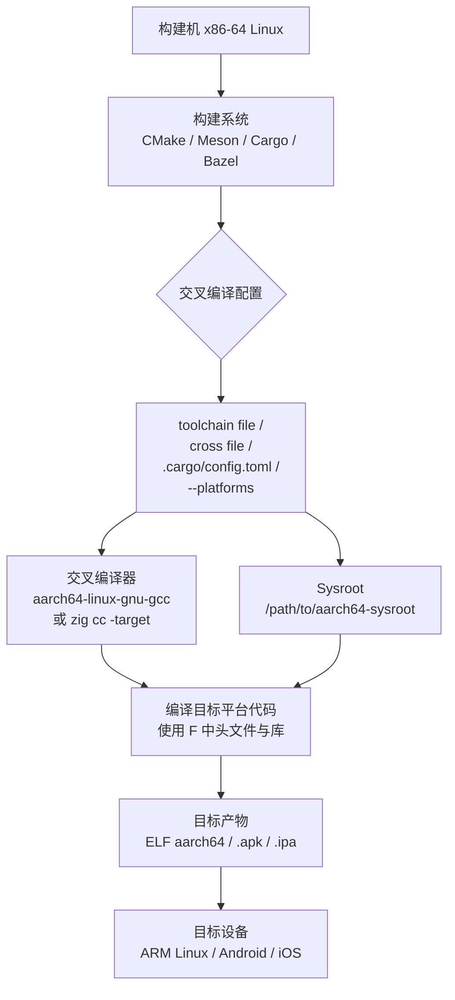

---
tags:
  - build-systems
  - tier3
  - 交叉编译
  - sysroot
---
# 交叉编译与 Sysroot

> [!abstract] TL;DR
> 交叉编译让"构建机器"产出能在"目标机器"上运行的二进制。理解 build/host/target 三元组、sysroot 边界、工具链前缀命名约定，是驾驭 CMake toolchain file、Meson cross file、Cargo `--target`、Bazel platforms 的基础。Zig 作为跨平台 C 编译器前端异军突起，进一步降低了交叉编译门槛。本章系统梳理各构建系统的交叉支持机制，以及 sysroot 构建、libc 选择、pkg-config 桥接等共性工程陷阱。

## 概述与定位

### 为什么需要交叉编译

在原生（native）编译场景下，执行编译动作的机器与运行最终产物的机器是同一台，操作系统、CPU 指令集、C 运行时完全匹配，工具链开箱即用。一旦目标平台与构建平台不同——树莓派上的 ARM Cortex-A72、安卓手机的 AArch64、嵌入式 MCU 的 RISC-V 32 位、MIPS 路由器——就进入了交叉编译领域。

推动交叉编译需求的力量有几条：

**资源不对称**：目标设备算力或内存极为有限，无法在其上运行完整的编译器工具链。编译 Linux 内核或 Qt 应用本身可能消耗数 GB 内存、数分钟时间；在 256 MB RAM 的嵌入式板上本地编译几乎不可行。

**平台异质性规模**：移动平台（Android、iOS）、IoT 终端（FreeRTOS、Zephyr）、云端异构加速器（ARM Neoverse 服务器、RISC-V 服务器）的爆发，让"一个工程师在 x86-64 Linux/macOS 上开发，产物运行在多种架构上"成为行业常态。

**CI/CD 管道统一化**：现代 CI 环境通常是 x86-64 的 Linux 容器，但交付物可能需覆盖 aarch64/armv7/riscv64/mips 等多架构。集中交叉编译比在各目标平台准备 native 构建机便宜得多。

**平台不可达性**：iOS 应用必须在 macOS 上用 Xcode 交叉编译到 arm64 设备；对某些专有嵌入式 SoC，厂商只提供交叉工具链，从不提供原生编译支持。

### build / host / target 三元组模型

这套术语来自 GCC 的构建哲学，是理解一切交叉编译工具链的底层框架。

**build**：执行编译动作的机器。通常就是你的开发机或 CI 服务器，例如 `x86_64-linux-gnu`。

**host**：编译出来的**工具程序本身**将运行在哪台机器上。大多数情况 host == build，即工具链本身运行在构建机上。当 host ≠ build 时，就是"canadian cross"（加拿大交叉编译，见下文）。

**target**：工具链所产生的代码将在哪台机器上运行。这才是最终用户关心的目标平台，例如 `aarch64-linux-gnu`、`arm-none-eabi`（裸机 ARM）、`riscv32-unknown-elf`。

普通交叉编译时，build == host ≠ target。Canadian cross 时，三者各不相同。

三元组（target triple）的格式通常是 `<arch>-<vendor>-<os>` 或 `<arch>-<vendor>-<os>-<abi>`，例如：

| 三元组 | 含义 |
|---|---|
| `x86_64-linux-gnu` | x86-64，Linux，glibc |
| `aarch64-linux-gnu` | 64 位 ARM，Linux，glibc |
| `arm-linux-gnueabihf` | 32 位 ARM，Linux，glibc，硬件浮点 ABI |
| `arm-none-eabi` | 32 位 ARM，无 OS（裸机），嵌入式 ABI |
| `riscv64-linux-gnu` | 64 位 RISC-V，Linux，glibc |
| `x86_64-apple-darwin` | x86-64，macOS |
| `aarch64-apple-ios` | 64 位 ARM，iOS |
| `wasm32-unknown-emscripten` | WebAssembly，Emscripten |
| `thumbv7em-none-eabihf` | ARM Cortex-M4/M7（Thumb-2），裸机，硬件浮点 |

LLVM 的 target triple 有时还在第三位加 environemnt 字段（`-musl`、`-gnu`、`-msvc`），变成四元组，但习惯上仍称 triple。

## 原理与机制

### 工具链前缀（Toolchain Prefix）

交叉编译工具链的所有工具都带有 target triple 前缀，以与系统原生工具区分：

```
arm-linux-gnueabihf-gcc
arm-linux-gnueabihf-g++
arm-linux-gnueabihf-ld
arm-linux-gnueabihf-strip
arm-linux-gnueabihf-objcopy
arm-linux-gnueabihf-ar
arm-linux-gnueabihf-nm
arm-linux-gnueabihf-readelf

aarch64-linux-gnu-gcc
aarch64-linux-gnu-g++
aarch64-linux-gnu-ld
```

构建系统需要知道：编译时应调用哪个前缀的编译器？链接时使用哪个前缀的 `ld`/`lld`？各类工具（`strip`、`ar`、`objcopy`）同理。这个映射关系在不同构建系统中以不同形式表达，但本质都是将"原生工具名"替换为"带前缀的交叉工具名"。

LLVM/Clang 工具链稍有不同：clang 本身是多目标的，通过 `-target <triple>` 指定目标，而不是靠前缀区分。这让 Zig 的跨平台 C 编译方案成为可能（见后文）。

### Sysroot：目标系统的根文件系统快照

**sysroot** 是交叉编译中最核心、也最容易被忽视的概念。它是一个目录，内部布局模拟目标系统的根文件系统，包含：

```
$SYSROOT/
├── usr/
│   ├── include/          # 目标平台的头文件（Linux kernel headers、glibc headers）
│   │   ├── bits/
│   │   ├── sys/
│   │   └── ...
│   └── lib/              # 目标平台的库（.so、.a）
│       ├── libc.so.6
│       ├── libm.so.6
│       ├── libpthread.so.0
│       └── ...
└── lib/
    ├── ld-linux-aarch64.so.1    # 动态链接器
    └── ...
```

编译器在交叉编译时必须知道去哪里找目标平台的头文件（而非构建机自身的 `/usr/include`），链接器必须链接目标平台的库（而非构建机的 `/usr/lib`）。`--sysroot` 标志告诉 GCC/Clang 将哪个目录视为目标系统的 `/`：

```bash
aarch64-linux-gnu-gcc \
  --sysroot=/path/to/aarch64-sysroot \
  -I/path/to/aarch64-sysroot/usr/include \
  foo.c -o foo
```

传递 `--sysroot` 后，编译器会自动从 `$SYSROOT/usr/include` 查找头文件，链接器会从 `$SYSROOT/usr/lib`、`$SYSROOT/lib` 查找库，完全隔绝构建机的原生头文件和库，杜绝"编译出能跑在构建机上但不能跑在目标机上"的问题。

#### Sysroot 的来源

sysroot 可以通过以下途径获得：

1. **从目标设备直接拷贝**：`rsync -av root@device:/ /path/to/sysroot/`，最真实，但需要设备可访问，且内容随设备固件变化。
2. **Buildroot / Yocto 构建输出**：嵌入式 Linux 构建框架会在构建过程中自动生成完整 sysroot，是业界主流方式。
3. **Debian/Ubuntu 多架构包（multiarch）**：`dpkg --add-architecture arm64 && apt-get install gcc-aarch64-linux-gnu`，系统会将 arm64 的头文件和库安装到 `/usr/aarch64-linux-gnu/`，可直接用作 sysroot。
4. **厂商 SDK**：Android NDK、iOS SDK（`Xcode.app/.../SDKs/iPhoneOS.sdk`）本质上就是带有完整头文件和库的 sysroot。
5. **crosstool-NG / Docker 镜像**：预构建好的交叉工具链通常内嵌了 sysroot，开箱即用。

### 标准库选择：glibc / musl / newlib

目标平台的 C 标准库是影响二进制兼容性的最关键因素之一。

**glibc（GNU C Library）**：Linux 桌面和服务器的事实标准，功能最全，与 Linux 内核 ABI 紧密耦合。glibc 有版本化符号（versioned symbols），链接 glibc 2.17 编译的二进制不能在 glibc 2.14 的系统上运行——这是嵌入式 / 老旧服务器场景的常见坑点。解决方式是在足够老的 glibc 版本上编译，或用 `patchelf --set-rpath` 搭配静态链接 glibc 的关键部分。

**musl libc**：轻量、干净、静态链接友好。Alpine Linux 的默认 libc，Zig 内置的 libc。musl 的静态二进制无需运行时依赖，可以真正做到"编译一次，到处运行（在同架构的 Linux 上）"。musl 对 POSIX 兼容性极为严格，某些依赖 glibc 扩展的代码（如 `pthread` 的某些非标准行为、`dlopen` 细节）在 musl 上会出错。

**newlib**：专为裸机嵌入式设计，提供最小化的 C 库实现，无操作系统支持。`arm-none-eabi-gcc` 通常搭配 newlib。需要自行实现 `_write`、`_sbrk` 等系统调用桩（syscall stubs）。

**Android 的 Bionic**：Android NDK 的专属 libc，与 glibc 不完全兼容，使用 NDK 工具链时自动配套。

### Canadian Cross（三平台交叉编译）

当 build ≠ host ≠ target 时称为 Canadian Cross（戏称来自"加拿大有三个官方语言"的玩笑）。典型场景：

- **build**：x86-64 Linux CI 服务器
- **host**：x86-64 Windows（要在 Windows 上运行的交叉编译器）
- **target**：ARM Linux（最终产物跑在 ARM Linux 上）

这需要分两个阶段构建工具链：先在 Linux 上构建一个 cross（build=Linux, host=Linux, target=Windows）的 MinGW 编译器，再用它构建最终的 Canadian Cross 工具链（build=Linux, host=Windows, target=ARM）。实际工程中 Canadian Cross 使用场景有限，主要出现在工具链自举（bootstrapping）场景。

### Multilib

某些工具链支持 multilib（多库），即单套工具链可以生成不同变体的目标代码：x86-64 工具链可以用 `-m32` 生成 i386 代码，ARM 工具链可以在 Thumb 模式和 ARM 模式间切换。multilib 的库文件通常存放在 `lib32/` 或 `lib64/` 子目录中，或在 sysroot 内分层。启用 multilib 需要工具链在构建时就配置好，后期添加较为繁琐。

## 结构/算法/伪代码详解

### CMake Toolchain File

CMake 通过 **toolchain file** 实现交叉编译支持，这是一个普通的 `.cmake` 脚本，在 CMake 初始化阶段（project() 调用之前）由构建系统加载，负责声明目标系统信息和工具链路径。

#### 最小化 toolchain file 结构

```cmake
# toolchain-aarch64-linux-gnu.cmake

# 声明目标系统类型（影响默认库、链接行为）
set(CMAKE_SYSTEM_NAME Linux)
set(CMAKE_SYSTEM_PROCESSOR aarch64)

# 工具链根目录（可选，便于维护）
set(CROSS_PREFIX aarch64-linux-gnu-)
set(TOOLCHAIN_ROOT /usr)

# 编译器路径
set(CMAKE_C_COMPILER   ${TOOLCHAIN_ROOT}/bin/${CROSS_PREFIX}gcc)
set(CMAKE_CXX_COMPILER ${TOOLCHAIN_ROOT}/bin/${CROSS_PREFIX}g++)
set(CMAKE_ASM_COMPILER ${TOOLCHAIN_ROOT}/bin/${CROSS_PREFIX}as)

# 链接器（可选，CMake 默认从编译器推断）
set(CMAKE_LINKER ${TOOLCHAIN_ROOT}/bin/${CROSS_PREFIX}ld)

# 工具
set(CMAKE_AR             ${TOOLCHAIN_ROOT}/bin/${CROSS_PREFIX}ar)
set(CMAKE_RANLIB         ${TOOLCHAIN_ROOT}/bin/${CROSS_PREFIX}ranlib)
set(CMAKE_STRIP          ${TOOLCHAIN_ROOT}/bin/${CROSS_PREFIX}strip)
set(CMAKE_OBJCOPY        ${TOOLCHAIN_ROOT}/bin/${CROSS_PREFIX}objcopy)

# sysroot
set(CMAKE_SYSROOT /path/to/aarch64-sysroot)

# 告诉 CMake 在哪里查找目标平台的库/头文件/程序
set(CMAKE_FIND_ROOT_PATH ${CMAKE_SYSROOT})
# 程序（如生成器工具）从构建机查找
set(CMAKE_FIND_ROOT_PATH_MODE_PROGRAM NEVER)
# 库和头文件只在 sysroot 中查找
set(CMAKE_FIND_ROOT_PATH_MODE_LIBRARY ONLY)
set(CMAKE_FIND_ROOT_PATH_MODE_INCLUDE ONLY)
set(CMAKE_FIND_ROOT_PATH_MODE_PACKAGE ONLY)
```

使用方式：

```bash
cmake -B build \
      -DCMAKE_TOOLCHAIN_FILE=toolchain-aarch64-linux-gnu.cmake \
      -DCMAKE_BUILD_TYPE=Release \
      ..
cmake --build build
```

#### CMAKE_FIND_ROOT_PATH_MODE 详解

这三个变量控制 CMake 的 `find_library()`、`find_path()`、`find_program()` 的搜索行为：

- `NEVER`：完全忽略 sysroot，从构建机原生路径查找（适合构建工具本身，如代码生成器）
- `ONLY`：只在 sysroot 内查找（适合目标平台的库和头文件）
- `BOTH`：先查 sysroot，再查构建机路径（不推荐，容易混入错误平台的内容）

设置不当会导致 CMake 错误地链接构建机的 x86-64 库到 ARM 目标，这种错误可能直到运行时才暴露。

#### Android NDK 的 toolchain file

Android NDK 自带完整的 CMake toolchain file，使用方式：

```bash
cmake -B build \
  -DCMAKE_TOOLCHAIN_FILE=$ANDROID_NDK/build/cmake/android.toolchain.cmake \
  -DANDROID_ABI=arm64-v8a \
  -DANDROID_PLATFORM=android-29 \
  ..
```

NDK 的 toolchain file 内部封装了大量细节：NDK clang 编译器路径、Bionic sysroot、STL 选择（默认 `c++_shared`）、架构 ABI 标志（如 `-march=armv8-a`）等。

### Meson Cross File

Meson 使用 **cross file** 声明交叉编译配置，格式为 INI 风格。

```ini
# cross-aarch64-linux-gnu.ini

[binaries]
c = 'aarch64-linux-gnu-gcc'
cpp = 'aarch64-linux-gnu-g++'
ar = 'aarch64-linux-gnu-ar'
strip = 'aarch64-linux-gnu-strip'
pkgconfig = 'aarch64-linux-gnu-pkg-config'

[built-in options]
c_args = ['-march=armv8-a']
c_link_args = ['--sysroot=/path/to/sysroot']

[properties]
sys_root = '/path/to/aarch64-sysroot'
pkg_config_libdir = '/path/to/aarch64-sysroot/usr/lib/pkgconfig'

[host_machine]
system = 'linux'
cpu_family = 'aarch64'
cpu = 'cortex-a53'
endian = 'little'
```

使用方式：

```bash
meson setup builddir \
  --cross-file cross-aarch64-linux-gnu.ini \
  --buildtype release
ninja -C builddir
```

Meson 的 cross file 与 CMake toolchain file 在语义上等价，但更结构化：`[binaries]` 对应工具路径，`[host_machine]` 对应 `CMAKE_SYSTEM_NAME/PROCESSOR`，`[properties]` 对应额外的平台属性。

Meson 还支持 **native file**，用于在交叉编译时覆盖构建机（native）的工具配置，解决 build-time 工具（代码生成器、protoc 等）需要用构建机工具链构建的场景。

### Cargo / Rust 交叉编译

Rust 工具链原生支持交叉编译，围绕 `--target` 标志和 `.cargo/config.toml` 组织。

#### 基础工作流

```bash
# 安装目标平台的 Rust 标准库
rustup target add aarch64-unknown-linux-gnu

# 编译
cargo build --target aarch64-unknown-linux-gnu
```

仅安装 Rust 标准库不够，Cargo 还需要知道如何调用 C 链接器（Rust 默认用 C 链接器链接最终产物）。通过 `.cargo/config.toml` 配置：

```toml
# .cargo/config.toml
[target.aarch64-unknown-linux-gnu]
linker = "aarch64-linux-gnu-gcc"
# 或者用 lld
# linker = "aarch64-linux-gnu-ld"

# 如果有 C 依赖（通过 cc crate 或 cmake crate 构建），需要设置 CC
[env]
CC_aarch64-unknown-linux-gnu = "aarch64-linux-gnu-gcc"
CXX_aarch64-unknown-linux-gnu = "aarch64-linux-gnu-g++"
AR_aarch64-unknown-linux-gnu = "aarch64-linux-gnu-ar"
```

#### `cross` 工具

`cross` 是社区工具，通过 Docker 容器封装交叉编译环境，极大简化依赖 C 库的 Rust 项目的交叉编译：

```bash
# 安装
cargo install cross

# 使用（语法与 cargo 完全相同）
cross build --target aarch64-unknown-linux-gnu
cross test --target aarch64-unknown-linux-gnu
```

`cross` 内部为每个目标三元组维护一个预配置的 Docker 镜像，包含正确的交叉工具链和 sysroot，用户无需手动配置。但需要注意镜像的 glibc 版本是否与目标系统匹配。

#### Rust 目标三元组层级

Rust 的目标层级（Tier）决定了官方支持程度：
- **Tier 1**（如 `x86_64-unknown-linux-gnu`）：完整支持，CI 保证
- **Tier 2**（如 `aarch64-unknown-linux-gnu`、`thumbv7em-none-eabihf`）：提供预编译 std，但测试覆盖有限
- **Tier 3**：可构建但无预编译二进制，需要本地构建标准库（`-Zbuild-std`）

### Bazel Platforms 与 Toolchains

Bazel 的交叉编译通过 **platforms** 和 **toolchains** 机制实现，这也是 Bazel 最复杂的概念之一。

#### Platform 定义

```python
# BUILD 文件
platform(
    name = "linux_aarch64",
    constraint_values = [
        "@platforms//os:linux",
        "@platforms//cpu:aarch64",
    ],
)
```

#### Toolchain 定义与注册

```python
# BUILD 文件
cc_toolchain(
    name = "aarch64_toolchain",
    toolchain_identifier = "aarch64-linux-gnu",
    toolchain_config = ":aarch64_toolchain_config",
    all_files = ":toolchain_files",
    ...
)

toolchain(
    name = "aarch64_toolchain_def",
    exec_compatible_with = [
        "@platforms//os:linux",
        "@platforms//cpu:x86_64",
    ],
    target_compatible_with = [
        "@platforms//os:linux",
        "@platforms//cpu:aarch64",
    ],
    toolchain = ":aarch64_toolchain",
    toolchain_type = "@bazel_tools//tools/cpp:toolchain_type",
)
```

在 `WORKSPACE` 或 `MODULE.bazel` 中注册工具链：

```python
# WORKSPACE
register_toolchains("//toolchains:aarch64_toolchain_def")
```

使用方式：

```bash
bazel build //my:app --platforms=//platforms:linux_aarch64
```

#### Transitions

Bazel 支持 **configuration transitions**（配置转换），允许在同一构建中混合不同平台的目标。例如，构建一个主机工具（构建时运行）和目标库（部署时运行）：

```python
# 使用 transition 让特定依赖在不同平台构建
cc_binary(
    name = "host_codegen",
    ...
    # 这个工具在 host 平台构建
)

cc_binary(
    name = "target_app",
    deps = [":target_lib"],
    # 这个应用在 target 平台构建
)
```

`cfg = "exec"` 标记表示该依赖应在执行平台（build machine）构建，用于区分构建时工具和目标产物。

### autotools 交叉编译

老牌 autotools 项目使用 `--host` 参数指定目标三元组：

```bash
./configure \
  --host=aarch64-linux-gnu \
  --prefix=/usr \
  CC=aarch64-linux-gnu-gcc \
  CXX=aarch64-linux-gnu-g++ \
  CFLAGS="--sysroot=/path/to/sysroot" \
  LDFLAGS="--sysroot=/path/to/sysroot -L/path/to/sysroot/usr/lib"
```

autotools 的 `--host`、`--build`、`--target` 与 GCC 三元组含义一致。注意 `--prefix` 应设置为目标系统上的安装路径（如 `/usr`），而非构建机路径。

### Zig 作为 C 交叉编译器

Zig 工具链（`zig cc`、`zig c++`）的一个划时代特性是内置了针对所有支持目标的 musl/glibc 头文件，并能直接通过 `-target` 指定三元组，无需预先安装交叉工具链：

```bash
# 完全不需要 aarch64-linux-gnu-gcc
zig cc -target aarch64-linux-musl -O2 hello.c -o hello-aarch64
zig cc -target x86_64-windows-gnu hello.c -o hello.exe
zig cc -target wasm32-wasi hello.c -o hello.wasm
```

这让 Zig 成为当前最方便的"无需配置的 C 交叉编译器"。其背后机理：

1. Zig 使用 LLVM 后端，支持所有 LLVM 目标
2. 内置了各架构的 musl libc 源代码，在需要时自行编译（hash 缓存，不重复编译）
3. 内置了 Windows MinGW 头文件，支持 Windows 目标
4. 对 glibc 的各版本符号表有内建索引，可精确控制符号版本（`-target x86_64-linux-gnu.2.17`）

在 CMake 项目中使用 Zig 作为 C 编译器：

```cmake
# toolchain-zig-aarch64-musl.cmake
set(CMAKE_SYSTEM_NAME Linux)
set(CMAKE_SYSTEM_PROCESSOR aarch64)

set(CMAKE_C_COMPILER   zig)
set(CMAKE_C_COMPILER_ARG1 "cc;-target;aarch64-linux-musl")
set(CMAKE_CXX_COMPILER zig)
set(CMAKE_CXX_COMPILER_ARG1 "c++;-target;aarch64-linux-musl")
```

或更简洁地通过包装脚本：

```bash
#!/bin/bash
# zig-cc-aarch64.sh
exec zig cc -target aarch64-linux-musl "$@"
```

```cmake
set(CMAKE_C_COMPILER /path/to/zig-cc-aarch64.sh)
```

### 数据流示意图



## 工具视角与实战

### pkg-config 的交叉编译陷阱

`pkg-config` 是 Linux 生态中查找库头文件和链接标志的标准工具。交叉编译时，直接调用构建机的 `pkg-config` 会返回**构建机的**库路径，链接到错误架构的库，产生链接时错误或运行时崩溃。

解决方案：

**方案 1：使用交叉 pkg-config**

```bash
# 大多数发行版提供交叉 pkg-config
aarch64-linux-gnu-pkg-config --libs openssl
```

**方案 2：设置环境变量重定向**

```bash
export PKG_CONFIG_SYSROOT_DIR=/path/to/aarch64-sysroot
export PKG_CONFIG_LIBDIR=/path/to/aarch64-sysroot/usr/lib/pkgconfig
export PKG_CONFIG_PATH=          # 清空，避免混入构建机路径
pkg-config --libs openssl        # 现在会在 sysroot 中查找
```

CMake 会自动处理 `CMAKE_SYSROOT` 与 pkg-config 的集成（如果正确设置了 `CMAKE_FIND_ROOT_PATH_MODE_PACKAGE = ONLY`）。Meson cross file 的 `[properties]` 中设置 `pkg_config_libdir` 也能达到相同效果。

### 工具链构建：crosstool-NG 与 Buildroot

#### crosstool-NG

crosstool-NG 是专门用于构建交叉工具链本身的框架，支持精细控制 GCC 版本、binutils 版本、libc（glibc/musl/uClibc-ng/newlib）、内核头文件版本等参数组合。

```bash
# 典型工作流
ct-ng list-samples                    # 查看预配置样本
ct-ng aarch64-unknown-linux-gnu       # 选择样本
ct-ng menuconfig                      # 图形化调整配置
ct-ng build                           # 构建工具链（耗时 30–90 分钟）
```

构建完成后得到一个完整的独立工具链目录，包括编译器、binutils、sysroot，可直接在 CMake/Meson toolchain file 中引用。

#### Buildroot

Buildroot 是嵌入式 Linux 系统构建框架，与 crosstool-NG 的主要区别在于：Buildroot 不仅构建工具链，还构建整个目标根文件系统（rootfs）和内核。Buildroot 在构建过程中自动维护 sysroot，其输出目录 `output/staging/` 即可作为 CMake/Meson 的 sysroot 使用。

```makefile
# Buildroot 配置（.config 片段）
BR2_TOOLCHAIN_BUILDROOT_ARCH="aarch64"
BR2_TOOLCHAIN_BUILDROOT_CXX=y
BR2_PACKAGE_OPENSSL=y
BR2_PACKAGE_ZLIB=y
```

Yocto/OpenEmbedded 提供类似功能，但更侧重生产级嵌入式 Linux 发行版，学习曲线更陡。

### Android NDK 实战细节

Android 的交叉编译围绕 NDK（Native Development Kit）展开。NDK 内置了 clang 工具链、Bionic sysroot（分 API 等级）和完整的 CMake 支持。

**关键 ABI 选择**：

| ABI | CPU | 说明 |
|---|---|---|
| `armeabi-v7a` | ARM 32 位，VFPv3 | 兼容旧设备，逐渐淘汰 |
| `arm64-v8a` | AArch64 | 64 位 ARM，当前主流 |
| `x86` | i686 | 模拟器，很少在真机 |
| `x86_64` | x86-64 | 模拟器和部分 Chromebook |

```bash
# CMake + NDK 构建 arm64-v8a
cmake -B build-arm64 \
  -DCMAKE_TOOLCHAIN_FILE=$NDK/build/cmake/android.toolchain.cmake \
  -DANDROID_ABI=arm64-v8a \
  -DANDROID_PLATFORM=android-29 \
  -DANDROID_STL=c++_shared \
  ..
cmake --build build-arm64

# Cargo + cross 构建 Android
cross build --target aarch64-linux-android
```

### 嵌入式裸机（Bare-Metal）交叉编译

裸机目标（`arm-none-eabi`、`riscv32-unknown-elf`）没有操作系统，没有动态链接器，没有 glibc。工具链搭配 newlib 提供最小化 C 库。

关键差异：
- 链接脚本（linker script）必须手工或由厂商提供，描述 Flash/RAM 布局
- 需要启动文件（startup file，`startup.s` 或 `startup.c`），初始化栈、BSS 段，然后跳转到 `main()`
- 标准 I/O 需要实现 syscall 桩（`_write`、`_read` 等），通常通过 SWO/UART 输出
- 不能使用动态内存分配（`malloc`）的场景下需替换为静态内存池

CMake 裸机 toolchain file 示例：

```cmake
# toolchain-arm-none-eabi.cmake
set(CMAKE_SYSTEM_NAME Generic)
set(CMAKE_SYSTEM_PROCESSOR arm)

set(CMAKE_C_COMPILER arm-none-eabi-gcc)
set(CMAKE_CXX_COMPILER arm-none-eabi-g++)
set(CMAKE_ASM_COMPILER arm-none-eabi-gcc)

set(CMAKE_C_FLAGS_INIT "-mcpu=cortex-m4 -mthumb -mfpu=fpv4-sp-d16 -mfloat-abi=hard")
set(CMAKE_EXE_LINKER_FLAGS_INIT "-specs=nosys.specs -specs=nano.specs")

# 关闭编译器检测时的测试程序尝试运行（裸机无法运行）
set(CMAKE_TRY_COMPILE_TARGET_TYPE STATIC_LIBRARY)
```

`CMAKE_TRY_COMPILE_TARGET_TYPE = STATIC_LIBRARY` 极为重要：CMake 在检测编译器时会尝试编译并运行一个测试程序，裸机目标无法在构建机上运行，必须将这个检测改为只编译静态库（不链接、不运行）。

### QEMU 用户模式仿真：无需真实硬件测试

QEMU 用户模式（`qemu-aarch64`、`qemu-arm`）可以在 x86-64 Linux 上直接运行 AArch64/ARM ELF 二进制，配合 binfmt_misc 内核模块，甚至可以透明地执行：

```bash
# 安装
apt-get install qemu-user-static binfmt-support

# 直接运行交叉编译的二进制
qemu-aarch64-static ./hello-aarch64

# 或通过 binfmt_misc 透明运行
./hello-aarch64    # 内核自动路由到 qemu-aarch64-static
```

结合 chroot 和 sysroot 可以运行依赖共享库的复杂程序：

```bash
# 将 qemu-static 复制到 sysroot
cp /usr/bin/qemu-aarch64-static /path/to/sysroot/usr/bin/

# chroot 进入 sysroot 执行
sudo chroot /path/to/sysroot /usr/bin/qemu-aarch64-static /usr/bin/python3 test.py
```

Docker 的多架构构建（`docker buildx build --platform linux/arm64`）正是基于 QEMU 用户模式仿真实现的。

### 调试信息与符号分离

交叉编译的产物通常需要去掉调试信息再部署到目标设备（体积和加密合规考虑），同时保留用于在开发机上调试的符号文件：

```bash
# 分离调试信息
aarch64-linux-gnu-objcopy --only-keep-debug app app.debug
aarch64-linux-gnu-strip --strip-debug app

# 或合并为一步
aarch64-linux-gnu-objcopy \
  --only-keep-debug app app.debug && \
aarch64-linux-gnu-strip --strip-unneeded app && \
aarch64-linux-gnu-objcopy \
  --add-gnu-debuglink=app.debug app
```

GDB 远程调试时，在开发机上运行 `gdb-multiarch`，通过 `set sysroot /path/to/sysroot` 让 GDB 知道从哪里加载共享库符号：

```bash
gdb-multiarch ./app
(gdb) set sysroot /path/to/aarch64-sysroot
(gdb) target remote 192.168.1.100:2345  # 目标板运行 gdbserver
(gdb) continue
```

## 安全性与正确使用

### Sysroot 来源可信性

sysroot 本质上是目标系统的头文件和库的集合，在编译时被直接引入到构建过程。如果 sysroot 被篡改，恶意头文件可通过预处理器宏、内联函数等手段将后门代码注入每个使用该 sysroot 编译的产物，且难以察觉。

因此，sysroot 应视为**可信基础设施**：

- **来源可验证**：从官方渠道（发行版包管理器、Android NDK 官方下载、厂商官方 SDK）获取，并验证 SHA-256/GPG 签名。
- **版本固定**：在 CI 环境中，sysroot 应像依赖锁文件一样版本化管理，避免自动更新引入未经审查的变更。
- **隔离存储**：sysroot 不应由多个无关项目共享或在非受信环境中修改。
- **来源追踪**：记录 sysroot 的构建日期、基础系统版本、包含的库版本，纳入 SBOM（软件物料清单）。

### 工具链供应链安全

工具链本身（交叉编译器、binutils）是更高优先级的攻击目标。一个被篡改的交叉编译器可以在不修改任何源码的情况下，向所有编译产物注入后门（参考 Ken Thompson 的"Trusting Trust"攻击）。

实践建议：

- **从发行版包管理器或官方已签名渠道安装工具链**，不从未知第三方下载预编译工具链。
- **在容器/VM 中固化工具链版本**：用 Docker 镜像或 Nix 表达式锁定工具链版本，在 CI 中确保每次构建使用相同的工具链二进制（可通过 `sha256sum` 验证）。
- **可重复构建（Reproducible Builds）验证**：在不同机器、不同时间用相同工具链和 sysroot 构建，比较产物哈希，检测工具链是否向产物注入了非确定性内容。
- **审计预构建 Docker 镜像**：`cross` 工具使用 Docker 镜像，这些镜像本身需要信任。优先使用来自可信组织（如 `ghcr.io/cross-rs`）的镜像，并钉死 image digest（`@sha256:...`），不使用 latest 标签。

### 运行时 sysroot 与构建时 sysroot 的对齐

构建时 sysroot 的 glibc 版本必须与运行时目标系统的 glibc 版本对齐：

- **sysroot glibc 版本 > 目标系统 glibc 版本**：产物引用了更新版本的 glibc 符号，运行时找不到符号，报 `undefined symbol` 或 `GLIBC_2.29 not found`。这是最常见的版本不匹配问题。
- **sysroot glibc 版本 < 目标系统 glibc 版本**：通常兼容（glibc 向后兼容），但无法利用新版 glibc 的性能优化。

解决方案：用目标系统实际的 glibc 版本构建 sysroot，或使用 musl 静态链接完全消除 glibc 版本依赖。使用 `objdump -p ./app | grep NEEDED` 和 `objdump -p ./app | grep GLIBC` 可以检查产物的动态链接依赖。

### 交叉编译的调试安全性

交叉调试（开发机运行 GDB，目标板运行 `gdbserver`）通过网络连接，需注意：

- `gdbserver` 默认不做身份验证，应仅在开发/调试网络中使用，绝不在生产环境暴露。
- 调试产物（含完整符号的 `.debug` 文件）包含源码路径信息，不应包含在发布版本中，也不应上传到非安全存储。

## 小结

交叉编译涉及三个层次的抽象：**工具层**（工具链前缀、`--sysroot` 标志、pkg-config 重定向）、**构建系统层**（CMake toolchain file、Meson cross file、Cargo config、Bazel platforms）和**平台生态层**（Android NDK、iOS SDK、Buildroot/Yocto sysroot）。

各构建系统在抽象机制上各有取舍：CMake 的 toolchain file 最灵活但配置量大；Meson 的 cross file 格式更结构化，错误更早暴露；Cargo 的 `--target` 加 `cross` 工具对纯 Rust 项目体验最好；Bazel 的 platforms/toolchains 机制最具工程规模化潜力，但学习曲线陡峭；autotools 最老牌，配合 `--host` 在传统 C 项目中仍是主流。

Zig 作为 C 编译器前端的出现改变了局面：内置多 libc 支持和全架构 LLVM 目标，无需预安装交叉工具链即可交叉编译，是降低交叉编译门槛最有潜力的方向。

Sysroot 管理是贯穿整个交叉编译工作流的核心：获取正确版本、正确传递给工具链、与 pkg-config 协调、在调试时与 GDB 配合，每一步都有独立的配置要点。可信的 sysroot 和工具链来源，是交叉编译安全的基础线。

## 相关阅读

- [[03.CMake|← 第 03 篇：CMake]] — toolchain file 的 CMake 原生上下文
- [[06.Meson|← 第 06 篇：Meson]] — cross file 详细语法与 native file 配合
- [[08.Cargo与Rust|← 第 08 篇：Cargo]] — Rust 目标层级与 build.rs 在交叉编译下的行为
- [[04.Bazel|← 第 04 篇：Bazel]] — platforms/toolchains/transitions 的完整机制
- [[12.供应链安全|← 第 12 篇：供应链安全]] — SLSA、SBOM、工具链完整性验证
- GCC Cross-Compilation Guide: https://gcc.gnu.org/onlinedocs/gccint/Configure-Terms.html
- Android NDK CMake: https://developer.android.com/ndk/guides/cmake
- Rust Platform Support: https://doc.rust-lang.org/rustc/platform-support.html
- Zig Cross-compilation: https://ziglang.org/documentation/master/#Cross-compilation
- crosstool-NG: https://crosstool-ng.github.io/
- Buildroot: https://buildroot.org/
- Reproducible Builds: https://reproducible-builds.org/

---

[[00.构建系统横向对比总览|⬆ 系列总览]] | [[17.Monorepo工具Nx与Turborepo与Pants|← 上一章]] | [[19.容器化构建BuildKit|→ 下一章]]
