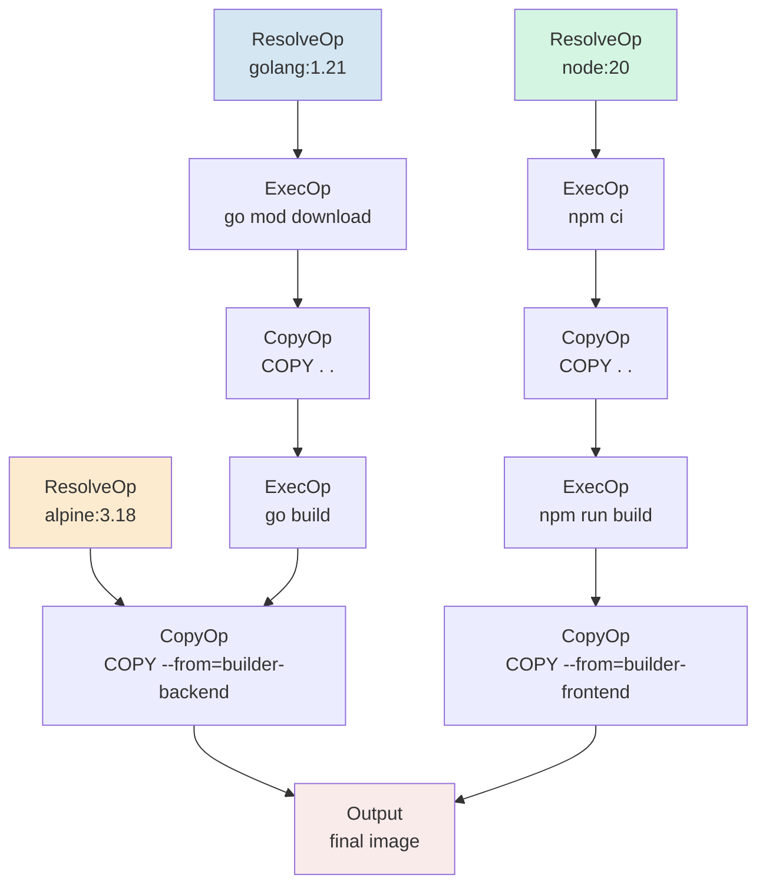

---
tags:
  - build-systems
  - tier3
  - docker
  - buildkit
---
# 容器化构建：BuildKit 与 OCI 构建

> [!abstract] TL;DR
> Docker BuildKit 将容器镜像构建从简单的顺序脚本提升为一套以 **LLB（Low-Level Build）DAG 为核心**的现代构建系统，支持并行 stage、内容寻址缓存、多平台交叉构建与 secret 安全注入。OCI 镜像格式将产物标准化，使构建与运行时解耦。Earthly 和 Dagger 在此基础上提供更高层次的抽象，使容器化构建与通用 CI/CD 无缝融合。理解这套体系的关键在于把 Dockerfile/Earthfile 视为**构建图描述语言**，而非简单的 shell 脚本序列。

## 概述与定位

### 容器化构建的历史演进

2013 年 Docker 诞生时，`docker build` 只是一个朴素的顺序执行引擎：逐行解释 Dockerfile，每行创建一个新的镜像层，层间完全串行。这种设计直观，但与同时代的构建系统（Make、Ninja、Bazel）相比存在本质性缺陷：缺乏 DAG 并行执行、缓存粒度粗糙、无法安全传递 secret、多平台支持缺失。

2017 年，Moby 项目（Docker 的上游）启动了 BuildKit 子项目，目标是从根本上重新设计镜像构建引擎。BuildKit 于 2018 年随 Docker 18.09 正式合并，2022 年随 Docker Desktop 4.x 成为默认引擎（`DOCKER_BUILDKIT=1` 不再需要手动设置）。

BuildKit 的设计哲学与本系列第 05 篇（Ninja）高度同构：Dockerfile（高层描述）→ LLB IR（中间表示 DAG）→ 实际构建执行，三层分离，各司其职。这并非巧合——构建系统领域的最优解在不同技术栈中反复收敛到同一模式：**声明式 DAG + 增量执行 + 内容寻址缓存**。

### 容器化构建在构建系统全景中的位置

与本系列其他工具相比，容器化构建的独特性在于：

| 维度 | Make/CMake/Ninja | Bazel/Buck2 | Docker BuildKit |
|------|-----------------|-------------|-----------------|
| 构建产物 | 二进制/库/对象文件 | 任意产物+可测试目标 | OCI 镜像（分层 tar） |
| 执行环境 | 宿主 OS | 沙盒（可选容器） | 容器（Linux namespace） |
| 缓存单元 | 文件 mtime/哈希 | Action 输出哈希 | 镜像层内容哈希 |
| 跨平台 | 工具链三元组 | platform/transition | buildx + QEMU binfmt |
| 主要用途 | 编译源代码 | 大规模单仓构建 | 打包可运行服务环境 |

容器化构建通常是**编译构建的下游**：先用 Gradle/Cargo/CMake 构建出二进制，再通过 Dockerfile 打包成可部署镜像。但 multi-stage build 模式使得编译步骤也可以内嵌在 Dockerfile 中，形成"一次 `docker build` 完成全部"的工作流。

### BuildKit 的生态地位

BuildKit 不仅是 Docker 的内部实现，它同时以独立的 `buildkitd` 守护进程形式存在，可脱离 Docker 独立运行（常见于 Kubernetes 集群内构建、rootless 构建）。围绕 BuildKit 形成了一个生态：

- **Buildx**：Docker 官方的 BuildKit 前端 CLI 插件，提供 `bake`、多平台、缓存导出等高级功能
- **Earthly**：基于 BuildKit 的声明式 CI 构建语言，Earthfile 语法
- **Dagger**：编程式构建管道，Go/Python/TypeScript SDK，底层同样使用 BuildKit
- **Kaniko / img / nerdctl**：无特权容器内构建的替代方案，部分基于 BuildKit

---

## 原理与机制

### LLB：Low-Level Build IR

LLB（Low-Level Build）是 BuildKit 的核心中间表示，定义在 Protocol Buffer 模式中，本质上是一个**有向无环图（DAG）**，其节点（Op）表示基本操作，边表示数据依赖。

LLB 的节点类型（Op 类型）：

```
ExecOp    — 执行任意命令（对应 RUN 指令）
CopyOp    — 复制文件（对应 COPY/ADD 指令）
ResolveOp — 解析镜像引用（对应 FROM 指令）
BuildOp   — 嵌套构建（用于 frontend 插件）
```

每个 Op 有零或多个输入（来自其他 Op 的输出），以及一个或多个输出（挂载点）。整个 Dockerfile 被翻译为这样一个 LLB DAG，BuildKit 调度器遍历 DAG，对无依赖关系的节点并行执行。

LLB 的关键性质：

1. **内容寻址（Content-Addressed）**：每个 Op 的缓存键由 Op 类型 + 输入内容 + 参数的哈希确定，与文件时间戳无关。这使得跨机器缓存共享成为可能。

2. **惰性求值（Lazy Evaluation）**：BuildKit 只执行最终输出所需的 Op 子集。若 Dockerfile 有多个 `FROM` stage 但只 `--target` 某个 stage，其余 stage 的 Op 不会被执行。

3. **可序列化（Serializable）**：LLB 可序列化为 Protobuf，通过网络发送给远程 Worker 执行（这是远程构建缓存的基础）。

### Frontend 机制与语法声明

BuildKit 的 frontend 系统允许将 Dockerfile 语法与执行引擎解耦。Dockerfile 本身通过一个内置 frontend 解析为 LLB，但用户可以通过文件首行的特殊注释指定自定义 frontend：

```dockerfile
# syntax=docker/dockerfile:1.6
FROM ubuntu:22.04
...
```

这行 `# syntax=` 告知 BuildKit 从 `docker/dockerfile:1.6` 这个 OCI 镜像中加载 Dockerfile parser。这意味着：

- 不同版本的 Dockerfile 语法特性（如 `--mount=type=secret`）由 frontend 镜像版本控制，而非 Docker 引擎版本
- 任何人都可以发布自定义 frontend（Earthly 的 Earthfile 即通过此机制工作）
- 语法向后兼容性由 frontend 镜像版本锁定

从架构上看，frontend 本身也是一个容器，通过 gRPC 与 BuildKit 守护进程通信：frontend 接受 Dockerfile 文本作为输入，输出 LLB Protobuf 序列化后的 DAG，BuildKit 再负责执行。

### 构建缓存的四个层次

BuildKit 的缓存体系分为四个层次，理解层次关系对于优化构建速度至关重要：

**层次 1：Local Cache（本地层缓存）**
最基础的缓存，存储在 BuildKit 守护进程的本地存储中（默认 `/var/lib/buildkit`）。缓存键基于 Op 的输入内容哈希。当执行 `docker build` 时，BuildKit 首先查询本地缓存。

**层次 2：Inline Cache（内联缓存）**
将缓存元数据内嵌到推送到 registry 的镜像 manifest 中。使用方式：

```bash
# 推送时内联缓存
docker buildx build --cache-to type=inline --push -t myrepo/myimage:latest .

# 拉取时使用缓存
docker buildx build --cache-from myrepo/myimage:latest .
```

内联缓存的限制：只能存储缓存引用（指向已推送的层），不能存储中间层（未出现在最终镜像中的层）。

**层次 3：Registry Cache（独立缓存 Export）**
将完整的构建缓存（包括中间层）推送到单独的 registry 引用，不内嵌到最终镜像：

```bash
# 推送完整缓存到独立引用
docker buildx build \
  --cache-to type=registry,ref=myrepo/myimage:cache,mode=max \
  --push -t myrepo/myimage:latest .

# 从独立引用恢复缓存
docker buildx build \
  --cache-from type=registry,ref=myrepo/myimage:cache \
  .
```

`mode=max` 导出所有中间层，`mode=min`（默认）仅导出最终镜像的层。CI 环境中推荐 `mode=max`。

**层次 4：`--mount=type=cache`（构建时持久化缓存挂载）**
这是 BuildKit 最强大的缓存机制，允许在 `RUN` 指令执行期间挂载一个持久化目录，使包管理器缓存在不同构建间复用：

```dockerfile
# syntax=docker/dockerfile:1.6

RUN --mount=type=cache,target=/root/.cargo/registry \
    --mount=type=cache,target=/root/.cargo/git \
    cargo build --release
```

这个缓存目录**不会进入最终镜像层**，它仅在构建期间可见。关键特性：
- 缓存目录在构建间持久保存（不随构建结束而清除）
- 多个并发构建对同一缓存挂载是安全的（有锁机制）
- 可通过 `id` 参数在不同 stage 间共享同一缓存
- 可设置 `sharing=locked`（独占锁）、`sharing=shared`（读写共享）、`sharing=private`（每次构建独立副本）

### 并行构建的实现机制

BuildKit 的并行执行基于 LLB DAG 的拓扑排序。对于 multi-stage Dockerfile：

```dockerfile
FROM golang:1.21 AS builder-backend
COPY go.* .
RUN go mod download
COPY . .
RUN go build -o /app/server ./cmd/server

FROM node:20 AS builder-frontend
COPY package*.json .
RUN npm ci
COPY . .
RUN npm run build

FROM alpine:3.18 AS final
COPY --from=builder-backend /app/server /server
COPY --from=builder-frontend /dist /static
```

`builder-backend` 和 `builder-frontend` 这两个 stage 之间没有数据依赖关系（它们的输入仅来自上下文和各自的基础镜像），因此 BuildKit 会并行执行它们。仅当 `final` stage 需要二者的输出时才等待两者完成。

并行粒度可以比 stage 更细：同一 stage 内，若有多个 `RUN` 指令之间没有通过文件系统产生依赖（这在标准 Dockerfile 语义中不可能，但自定义 frontend 可以利用 LLB 直接表达），也可以并行。

### 构建上下文（Build Context）

BuildKit 支持多种形式的构建上下文：

```bash
# 传统：本地目录
docker buildx build .

# 远程 Git 仓库
docker buildx build https://github.com/user/repo.git#branch

# 命名上下文（BuildKit 特性）：允许在 Dockerfile 中引用多个上下文
docker buildx build \
  --build-context frontend=./frontend \
  --build-context shared-libs=./libs \
  .
```

在 Dockerfile 中使用命名上下文：

```dockerfile
# syntax=docker/dockerfile:1.6
FROM frontend AS build-frontend
# ...

FROM scratch AS assets
COPY --from=build-frontend /dist /

FROM shared-libs AS libs
# 直接引用传入的 shared-libs 上下文
```

---

## 结构/算法/伪代码详解

### BuildKit 调度器的工作流

```
┌─────────────────────────────────────────────────────────┐
│                   docker buildx build                   │
└─────────────────────────┬───────────────────────────────┘
                          │  发送 Dockerfile + Build Context
                          ▼
┌─────────────────────────────────────────────────────────┐
│               Frontend Container                        │
│  (docker/dockerfile:1.6 或自定义 syntax)                │
│                                                         │
│  Dockerfile Parser → AST → LLB DAG (Protobuf)          │
└─────────────────────────┬───────────────────────────────┘
                          │  LLB Protobuf
                          ▼
┌─────────────────────────────────────────────────────────┐
│                   buildkitd                             │
│                                                         │
│  ┌─────────────────────────────────────────────────┐    │
│  │  Solver（求解器）                               │    │
│  │  1. 拓扑排序 LLB DAG                            │    │
│  │  2. 计算每个 Op 的缓存键                        │    │
│  │  3. 查询 Cache Store → Hit/Miss                 │    │
│  │  4. 将 Miss 的 Op 分发给 Worker 执行            │    │
│  └─────────────────────────────────────────────────┘    │
│                          │                              │
│         ┌────────────────┼────────────────┐             │
│         ▼                ▼                ▼             │
│    Worker[0]        Worker[1]        Worker[N]          │
│    (OCI exec)       (OCI exec)       (OCI exec)         │
│                                                         │
│  ┌─────────────────────────────────────────────────┐    │
│  │  Content Store（内容寻址存储）                  │    │
│  │  键：SHA256(layer content)                      │    │
│  │  值：layer tar blob                             │    │
│  └─────────────────────────────────────────────────┘    │
└─────────────────────────────────────────────────────────┘
                          │  OCI Manifest + Layers
                          ▼
                   Registry / Local Daemon
```

### LLB DAG 示例：三 stage 构建的图结构



注意图中 `A→D` 链和 `E→H` 链之间没有边，BuildKit 调度器识别出它们可以并行执行。

### 缓存键计算算法（伪代码）

```python
def compute_cache_key(op: Op) -> str:
    """
    BuildKit 缓存键计算的简化版本。
    真实实现在 solver/llbsolver/ops/ 目录下各 Op 类型中。
    """
    components = []
    
    # 1. Op 类型标识
    components.append(op.type_id())
    
    # 2. 所有输入 Op 的缓存键（递归）
    for input_op in op.inputs:
        input_key = compute_cache_key(input_op)
        components.append(input_key)
    
    # 3. Op 自身参数
    if isinstance(op, ExecOp):
        components.append(hash(op.command))          # 命令字符串
        components.append(hash(op.env_vars))         # 环境变量
        components.append(hash(op.working_dir))      # 工作目录
        # mount 类型和路径影响缓存键，但 type=cache 的内容不影响
        for mount in op.mounts:
            if mount.type != MountType.CACHE:
                components.append(hash(mount))
    
    elif isinstance(op, CopyOp):
        # COPY 指令：源文件内容哈希是缓存键的一部分
        components.append(hash_file_content(op.source_path))
        components.append(hash(op.dest_path))
    
    elif isinstance(op, ResolveOp):
        # FROM 指令：镜像 digest（不是 tag，tag 可能指向不同 digest）
        components.append(resolve_digest(op.image_ref))
    
    return sha256("|".join(components))
```

### OCI 镜像格式详解

OCI（Open Container Initiative）镜像格式是容器化生态的基础标准，定义于 [opencontainers/image-spec](https://github.com/opencontainers/image-spec)：

```
OCI Image Layout
├── oci-layout          # {"imageLayoutVersion":"1.0.0"}
├── index.json          # OCI Image Index（多平台入口）
└── blobs/
    └── sha256/
        ├── <manifest-digest>   # Image Manifest（JSON）
        ├── <config-digest>     # Image Config（JSON）
        └── <layer-digest>      # Layer（tar+gzip 或 zstd）
```

**Image Manifest**（镜像清单）：

```json
{
  "schemaVersion": 2,
  "mediaType": "application/vnd.oci.image.manifest.v1+json",
  "config": {
    "mediaType": "application/vnd.oci.image.config.v1+json",
    "digest": "sha256:abc123...",
    "size": 4096
  },
  "layers": [
    {
      "mediaType": "application/vnd.oci.image.layer.v1.tar+gzip",
      "digest": "sha256:def456...",
      "size": 10485760
    },
    {
      "mediaType": "application/vnd.oci.image.layer.v1.tar+gzip",
      "digest": "sha256:789abc...",
      "size": 2097152
    }
  ]
}
```

**Image Config**（镜像配置）：

```json
{
  "architecture": "amd64",
  "os": "linux",
  "config": {
    "Env": ["PATH=/usr/local/bin:/usr/bin:/bin"],
    "Cmd": ["/app/server"],
    "ExposedPorts": {"8080/tcp": {}}
  },
  "history": [
    {"created_by": "/bin/sh -c #(nop) FROM alpine:3.18"},
    {"created_by": "/bin/sh -c apk add --no-cache ca-certificates"}
  ],
  "rootfs": {
    "type": "layers",
    "diff_ids": ["sha256:uncompressed-layer-hash-1", "sha256:uncompressed-layer-hash-2"]
  }
}
```

层（Layer）本质上是一个 tar 归档，包含对文件系统的**差量变更**（添加、修改、删除）。删除操作通过 `.wh.` 前缀的"whiteout"文件表示（`.wh.filename` 表示删除 `filename`，`.wh..wh..opq` 表示不透明删除整个目录）。

**OCI Image Index**（多平台索引）：

```json
{
  "schemaVersion": 2,
  "mediaType": "application/vnd.oci.image.index.v1+json",
  "manifests": [
    {
      "mediaType": "application/vnd.oci.image.manifest.v1+json",
      "digest": "sha256:amd64-manifest...",
      "size": 1024,
      "platform": {"os": "linux", "architecture": "amd64"}
    },
    {
      "mediaType": "application/vnd.oci.image.manifest.v1+json",
      "digest": "sha256:arm64-manifest...",
      "size": 1024,
      "platform": {"os": "linux", "architecture": "arm64", "variant": "v8"}
    }
  ]
}
```

多平台镜像推送到 registry 后，`docker pull` 会根据本地平台自动选择对应的 manifest。

### 多平台构建的实现机制

`docker buildx build --platform linux/amd64,linux/arm64` 背后的机制：

**方式 1：QEMU 仿真（跨架构执行）**

```bash
# 注册 QEMU binfmt 处理器（使 Linux 内核能透明执行外架构二进制）
docker run --rm --privileged multiarch/qemu-user-static --reset -p yes

# 创建支持多平台的 builder
docker buildx create --name mybuilder --driver docker-container
docker buildx use mybuilder

# 多平台构建并推送
docker buildx build \
  --platform linux/amd64,linux/arm64,linux/arm/v7 \
  --push \
  -t myrepo/myimage:latest \
  .
```

QEMU 仿真的工作原理：通过 `binfmt_misc` 内核特性注册处理器，当内核遇到 ARM64 ELF 二进制时，自动用 QEMU 用户态仿真执行。BuildKit 在 ARM64 stage 中执行命令时，这些命令实际上经过 QEMU 在 x86_64 机器上运行。

QEMU 仿真的限制：速度较慢（10-30x 减速），某些系统调用不支持，可能影响 Go 编译器、JVM 等对系统调用敏感的工具。

**方式 2：原生节点构建（推荐用于生产）**

```bash
# 创建使用多个原生节点的 builder
docker buildx create \
  --name multi-arch-builder \
  --node builder-amd64 \
  --platform linux/amd64 \
  ssh://amd64-host

docker buildx create \
  --name multi-arch-builder \
  --append \
  --node builder-arm64 \
  --platform linux/arm64 \
  ssh://arm64-host

# BuildKit 将 amd64 stage 分发到 amd64 节点，arm64 stage 分发到 arm64 节点
docker buildx build \
  --builder multi-arch-builder \
  --platform linux/amd64,linux/arm64 \
  --push \
  -t myrepo/myimage:latest \
  .
```

---

## 工具视角与实战

### Dockerfile 最佳实践：层结构优化

层结构的设计直接影响构建速度（缓存命中率）和镜像体积：

```dockerfile
# syntax=docker/dockerfile:1.6

# ---- 依赖层（变化频率低，应尽早出现）----
FROM golang:1.21-alpine AS base
WORKDIR /app
# 先只复制 go.mod/go.sum，利用依赖层缓存
COPY go.mod go.sum ./
RUN --mount=type=cache,target=/go/pkg/mod \
    go mod download

# ---- 构建层（变化频率高）----
FROM base AS builder
COPY . .
RUN --mount=type=cache,target=/go/pkg/mod \
    --mount=type=cache,target=/root/.cache/go-build \
    CGO_ENABLED=0 GOOS=linux \
    go build -ldflags="-s -w" -o /app/server ./cmd/server

# ---- 最终层（最小化）----
FROM scratch AS final
# 只复制必要的文件
COPY --from=builder /app/server /server
# 添加证书（若需要 HTTPS）
COPY --from=builder /etc/ssl/certs/ca-certificates.crt /etc/ssl/certs/
EXPOSE 8080
ENTRYPOINT ["/server"]
```

关键原则：
1. **变化频率低的层放前面**：`go.mod` 比源代码变化少，单独复制以最大化缓存命中
2. **`--mount=type=cache` 分离编译缓存与构建产物**：Go 模块缓存和编译缓存不进入镜像层
3. **最终镜像用 `scratch` 或 `distroless`**：消除不必要的 OS 工具，减小攻击面
4. **`-ldflags="-s -w"` 去除调试符号**：减小二进制体积

### Secret 安全注入

BuildKit 的 `--mount=type=secret` 允许在构建时注入敏感信息而不让其进入任何镜像层：

```dockerfile
# syntax=docker/dockerfile:1.6
FROM python:3.11-slim AS builder
WORKDIR /app

# 使用 secret 挂载安装私有包
RUN --mount=type=secret,id=pip_extra_index_url \
    PIP_EXTRA_INDEX_URL=$(cat /run/secrets/pip_extra_index_url) \
    pip install --no-cache-dir -r requirements.txt
```

```bash
# 构建时注入 secret（secret 内容来自文件或环境变量）
docker buildx build \
  --secret id=pip_extra_index_url,src=./.pip-index-url \
  -t myapp:latest \
  .

# 或从环境变量注入
docker buildx build \
  --secret id=pip_extra_index_url,env=PIP_EXTRA_INDEX_URL \
  -t myapp:latest \
  .
```

Secret 挂载的安全性保证：
- `/run/secrets/<id>` 只在该 `RUN` 指令执行期间存在，不写入任何镜像层
- Secret 内容不出现在 `docker history` 输出中
- 即使使用 `--mount=type=bind` 访问的文件，其内容也不进入层

### SSH Agent 挂载

私有 Git 仓库的克隆是 CI 中常见需求，`--mount=type=ssh` 提供安全的 SSH agent 转发：

```dockerfile
# syntax=docker/dockerfile:1.6
FROM golang:1.21 AS builder
WORKDIR /app

# 配置 Go 使用 SSH 而非 HTTPS 访问私有 repo
RUN git config --global url."git@github.com:".insteadOf "https://github.com/"

RUN --mount=type=ssh \
    go mod download
```

```bash
# 将本地 SSH agent 转发到构建环境
docker buildx build \
  --ssh default=$SSH_AUTH_SOCK \
  .
```

与 secret 一样，SSH agent socket 不进入镜像层。

### `docker buildx bake`：声明式多目标构建

`bake`（`buildx bake`）是 BuildKit 的声明式批量构建前端，类似于 Makefile 的多目标构建，支持 HCL、JSON 或 Docker Compose 格式：

```hcl
# docker-bake.hcl

variable "TAG" {
  default = "latest"
}

variable "REGISTRY" {
  default = "myrepo"
}

group "default" {
  targets = ["app", "worker", "scheduler"]
}

target "base" {
  dockerfile = "Dockerfile"
  context    = "."
  platforms  = ["linux/amd64", "linux/arm64"]
}

target "app" {
  inherits = ["base"]
  target   = "app"
  tags     = ["${REGISTRY}/app:${TAG}"]
  cache-from = ["type=registry,ref=${REGISTRY}/app:cache"]
  cache-to   = ["type=registry,ref=${REGISTRY}/app:cache,mode=max"]
}

target "worker" {
  inherits = ["base"]
  target   = "worker"
  tags     = ["${REGISTRY}/worker:${TAG}"]
}
```

```bash
# 并行构建所有目标
docker buildx bake --push

# 只构建指定目标
docker buildx bake app --push

# 覆盖变量
TAG=v1.2.3 docker buildx bake --push
```

`bake` 会分析目标间依赖关系，对无依赖的目标并行构建，与 Ninja 的构建图调度高度相似。

### Earthly：可复现的 CI 构建语言

Earthly 是基于 BuildKit 的更高层次抽象，解决"在本地和 CI 中行为一致"的问题。其 Earthfile 语法融合了 Dockerfile 和 Makefile 的概念：

```earthly
# Earthfile
VERSION 0.8

# 基础镜像
base:
    FROM golang:1.21-alpine
    WORKDIR /app
    COPY go.mod go.sum .
    RUN go mod download
    SAVE IMAGE --cache-hint  # 标记为可缓存的基础层

# 构建目标
build:
    FROM +base
    COPY . .
    RUN go build -o build/server ./cmd/server
    SAVE ARTIFACT build/server /server AS LOCAL build/server  # 保存到本地

# 测试目标
test:
    FROM +base
    COPY . .
    RUN go test ./...

# 镜像打包目标
docker:
    FROM alpine:3.18
    COPY +build/server /server
    EXPOSE 8080
    ENTRYPOINT ["/server"]
    SAVE IMAGE --push myrepo/myimage:latest

# 完整 CI 流程
all:
    BUILD +test
    BUILD +docker
```

```bash
# 本地运行（与 CI 行为一致）
earthly +all

# 使用远程缓存
earthly --remote-cache=myrepo/earthly-cache:main +all
```

Earthly 相对于纯 Dockerfile 的核心优势：
- `SAVE ARTIFACT / SAVE IMAGE` 使目标间产物传递更显式
- 目标（Target）作为构建图节点，Earthly 自动计算并行机会
- 同一 Earthfile 可以混合不同语言的构建逻辑（Go 编译 + npm 构建 + 镜像打包）
- 本地和 CI 使用同一套命令，消除"在我机器上能跑"问题

### Dagger：编程式构建管道

Dagger 将构建管道从 YAML/DSL 提升为真正的程序代码，支持 Go、Python、TypeScript SDK：

```go
// Go SDK 示例：构建 + 测试 + 推送
package main

import (
    "context"
    "dagger.io/dagger"
    "fmt"
)

func main() {
    ctx := context.Background()
    
    client, err := dagger.Connect(ctx, dagger.WithLogOutput(os.Stderr))
    if err != nil {
        panic(err)
    }
    defer client.Close()
    
    // 获取构建上下文
    src := client.Host().Directory(".", dagger.HostDirectoryOpts{
        Exclude: []string{".git", "tmp"},
    })
    
    // Go 构建缓存
    goModCache := client.CacheVolume("go-mod")
    goBuildCache := client.CacheVolume("go-build")
    
    // 构建阶段
    builder := client.Container().
        From("golang:1.21-alpine").
        WithMountedDirectory("/app", src).
        WithWorkdir("/app").
        WithMountedCache("/go/pkg/mod", goModCache).
        WithMountedCache("/root/.cache/go-build", goBuildCache).
        WithExec([]string{"go", "build", "-o", "/app/server", "./cmd/server"})
    
    // 测试阶段（与构建并行）
    testResult := client.Container().
        From("golang:1.21-alpine").
        WithMountedDirectory("/app", src).
        WithWorkdir("/app").
        WithMountedCache("/go/pkg/mod", goModCache).
        WithExec([]string{"go", "test", "./..."}).
        Stdout(ctx)
    
    // 最终镜像
    finalImage := client.Container().
        From("alpine:3.18").
        WithFile("/server", builder.File("/app/server")).
        WithExposedPort(8080).
        WithEntrypoint([]string{"/server"})
    
    // 推送
    ref, err := finalImage.Publish(ctx, "myrepo/myimage:latest")
    fmt.Printf("Published: %s\n", ref)
}
```

```bash
dagger run go run ./ci/main.go
```

Dagger 底层同样使用 BuildKit，但将构建步骤抽象为编程语言中的函数调用，使得：
- 构建逻辑可以像普通代码一样测试、重用、版本控制
- 条件分支、循环、错误处理使用语言原生特性
- 不同工程师可以用自己熟悉的语言写构建逻辑

### Nixpacks 与 Buildpacks：自动化镜像构建

对于不需要精细控制 Dockerfile 的场景，自动检测工具可以从源码直接生成最优 Dockerfile：

**Nixpacks**（Vercel/Railway 使用）：

```bash
# 自动检测语言和依赖，生成最优 Dockerfile
nixpacks build . --name myapp

# 指定启动命令
nixpacks build . --start-cmd "node server.js"

# 查看生成的 Dockerfile
nixpacks plan . | jq .
```

Nixpacks 基于 Nix 生态，检测项目类型（通过 `package.json`、`go.mod`、`requirements.txt` 等），自动选择最优基础镜像和构建步骤。

**Cloud Native Buildpacks（CNB）**：

```bash
# 使用 pack CLI
pack build myapp --builder paketobuildpacks/builder:base

# 查看检测结果
pack build myapp --builder paketobuildpacks/builder:base --verbose
```

CNB 规范（由 Heroku 和 Pivotal 创建，CNCF 项目）定义了 `detect`/`build` 阶段的标准接口，允许多个 buildpack 组合处理同一项目。

### 可复现镜像：时间戳与 SOURCE_DATE_EPOCH

容器镜像的可复现性（Reproducible Builds）面临的主要挑战是时间戳：构建时写入的 `created` 时间戳导致每次构建产生不同的 digest，即使源码没有变化。

解决方案：

```dockerfile
# syntax=docker/dockerfile:1.6
FROM alpine:3.18

# 在构建时设置固定时间戳（通过 SOURCE_DATE_EPOCH）
RUN --mount=type=cache,target=/var/cache/apk \
    apk add --no-cache make
    
# SOURCE_DATE_EPOCH 会被支持该标准的工具（tar、make 等）读取，
# 用于设置文件时间戳
```

```bash
# 设置固定时间戳（Unix epoch）
SOURCE_DATE_EPOCH=1700000000 \
docker buildx build \
  --build-arg SOURCE_DATE_EPOCH=1700000000 \
  --output type=oci,dest=image.tar \
  .
```

BuildKit 1.12+ 原生支持 `--timestamp` 选项：

```bash
docker buildx build \
  --timestamp "2024-01-01T00:00:00Z" \
  --push \
  -t myrepo/myimage:reproducible \
  .
```

为实现完全可复现性，还需要：
- 基础镜像通过 digest（而非 tag）引用：`FROM alpine@sha256:...`
- 包管理器锁定文件（`go.sum`、`package-lock.json`）提交到仓库
- 编译器/工具链版本固定
- 消除构建过程中的任何随机性（如随机地址布局）

---

## 安全性与正确使用

### Secret 不进镜像层

BuildKit 的 `--mount=type=secret` 是安全传递敏感信息的正确方式。历史上曾有的错误做法是通过 `ARG` 或 `ENV` 传递 API key：

```dockerfile
# 错误做法：API key 永久存在于镜像层历史中
ARG NPM_TOKEN
RUN echo "//registry.npmjs.org/:_authToken=${NPM_TOKEN}" > ~/.npmrc && \
    npm install && \
    rm ~/.npmrc
# 即使 rm 了 .npmrc，前一层仍包含该文件，docker history 可以看到 ARG 值
```

```dockerfile
# 正确做法：使用 secret 挂载
# syntax=docker/dockerfile:1.6
RUN --mount=type=secret,id=npm_token \
    echo "//registry.npmjs.org/:_authToken=$(cat /run/secrets/npm_token)" > ~/.npmrc && \
    npm install && \
    rm ~/.npmrc
# ~/.npmrc 会出现在层中，但 token 内容不会，因为 secret 不进层
```

更好的做法是在 `RUN` 完成后 `~/.npmrc` 也不保留：

```dockerfile
RUN --mount=type=secret,id=npm_token \
    --mount=type=cache,target=/root/.npm \
    NPM_TOKEN=$(cat /run/secrets/npm_token) \
    npm install --prefer-offline
# 不写入 .npmrc，直接用环境变量，更干净
```

### 基础镜像可信与最小化

基础镜像的选择是镜像安全的第一道防线：

**优先使用官方镜像或 distroless**：

```dockerfile
# 高风险：不明来源的镜像
FROM some-random-user/node-app:latest

# 低风险：官方镜像 + 固定版本 + digest 锁定
FROM node:20.11.0-alpine3.18@sha256:xxx

# 最小攻击面：Google distroless（只含运行时，无 shell、无包管理器）
FROM gcr.io/distroless/nodejs20-debian12
```

**定期扫描基础镜像漏洞**：

```bash
# 使用 docker scout 扫描
docker scout cves myrepo/myimage:latest

# 使用 trivy 扫描
trivy image myrepo/myimage:latest

# 在 CI 中设置漏洞严重度阈值
trivy image --exit-code 1 --severity CRITICAL myrepo/myimage:latest
```

### 多阶段构建减小攻击面

多阶段构建是容器安全的关键实践——编译工具链不应出现在生产镜像中：

```dockerfile
# syntax=docker/dockerfile:1.6

# 构建阶段：包含完整编译工具链
FROM rust:1.75-slim AS builder
WORKDIR /app
COPY . .
RUN --mount=type=cache,target=/usr/local/cargo/registry \
    --mount=type=cache,target=/app/target \
    cargo build --release && \
    cp target/release/myapp /tmp/myapp

# 生产阶段：仅包含可执行文件和必要的运行时依赖
FROM debian:bookworm-slim AS production
RUN apt-get update && \
    apt-get install -y --no-install-recommends libssl3 ca-certificates && \
    rm -rf /var/lib/apt/lists/*
COPY --from=builder /tmp/myapp /usr/local/bin/myapp
RUN useradd --system --no-create-home appuser
USER appuser
ENTRYPOINT ["myapp"]
```

生产镜像中：
- 无 Rust 编译器、Cargo、构建脚本
- 无 C 编译器、make 等工具
- 以非 root 用户运行（`USER appuser`）
- 最小化运行时依赖

### BuildKit 的安全模式

BuildKit 支持多种安全级别的执行模式：

```bash
# Rootless 模式：BuildKit 以非 root 用户运行（生产推荐）
rootlesskit buildkitd --oci-worker-rootless

# 沙盒执行：使用 seccomp/AppArmor 限制构建时系统调用
buildkitd --oci-worker-seccomp /path/to/seccomp.json

# 网络隔离：某些 stage 在隔离网络中执行
FROM alpine AS build
RUN --network=none apk add --no-cache ...  # 无网络访问
```

### 可重现性与 SLSA 合规

BuildKit 与 SLSA（Supply-chain Levels for Software Artifacts）框架的结合：

```bash
# 使用 --attest 生成构建溯源（SLSA Provenance）
docker buildx build \
  --attest type=provenance,mode=max \
  --attest type=sbom \
  --push \
  -t myrepo/myimage:latest \
  .

# 验证溯源
docker buildx imagetools inspect myrepo/myimage:latest --format json | \
  jq '.Provenance'
```

BuildKit 生成的 SLSA provenance 包含：
- 构建触发者（git commit、分支、CI job ID）
- 构建材料（所有输入镜像的 digest）
- 构建步骤序列
- 构建环境信息

---

## 小结

容器化构建并非简单的"打包 shell 脚本"，BuildKit 通过 LLB DAG 将其提升为与 Ninja/Bazel 同等级别的现代构建系统。其核心价值体现在五个维度：

**1. 并行执行**：LLB DAG 自动识别独立 stage，实现真正的并行构建，消除串行瓶颈。

**2. 精细缓存**：四层缓存体系（本地→内联→Registry→Cache Mount）使构建缓存能在本机、CI、跨团队间复用，大幅减少重复构建时间。

**3. 安全性**：`--mount=type=secret` 和 `--mount=type=ssh` 使敏感信息不进入任何镜像层，彻底解决历史上 `ARG` 泄露 secret 的问题。

**4. 多平台**：`buildx` + QEMU binfmt 或原生多节点，单次构建产出多架构镜像，通过 OCI Image Index 对用户透明。

**5. 可复现性**：内容寻址缓存 + 固定时间戳 + digest 锁定基础镜像，实现跨机器、跨时间的位级可复现构建。

在更高层次，Earthly 将这些能力封装为 CI/CD 友好的声明式语言，Dagger 将其提升为完全的编程式管道——这两者都体现了构建系统设计的终极追求：**声明意图而非描述步骤**，由引擎负责最优执行。

对于现代云原生工程团队，掌握 BuildKit 的底层机制（LLB、缓存键计算、OCI 格式）与上层工具链（buildx bake、Earthly、Dagger）的配合使用，是将容器化构建从"能用"提升到"高效、安全、可复现"的关键路径。

---

## 相关阅读

- [BuildKit 官方文档](https://docs.docker.com/build/buildkit/)（`docs.docker.com`）
- [LLB 源码](https://github.com/moby/buildkit/tree/master/solver/pb)（`github.com/moby/buildkit`）
- [OCI Image Spec](https://github.com/opencontainers/image-spec/blob/main/spec.md)（`opencontainers/image-spec`）
- [Earthly 文档](https://docs.earthly.dev/)（`docs.earthly.dev`）
- [Dagger 文档](https://docs.dagger.io/)（`docs.dagger.io`）
- [Buildpacks 规范](https://buildpacks.io/docs/concepts/)（`buildpacks.io`）
- [Reproducible Builds 项目](https://reproducible-builds.org/)（`reproducible-builds.org`）
- [SLSA 框架](https://slsa.dev/)（`slsa.dev`）
- 本系列第 10 篇：[[10.增量构建与缓存|增量构建与缓存]]
- 本系列第 12 篇：[[12.供应链安全SLSA_SBOM|供应链安全]]
- 本系列第 18 篇：[[18.交叉编译与Sysroot|交叉编译与 Sysroot]]

---

[[00.构建系统横向对比总览|⬆ 系列总览]] | [[18.交叉编译与Sysroot|← 上一章]] | [[20.CI_CD与构建集成|→ 下一章]]
