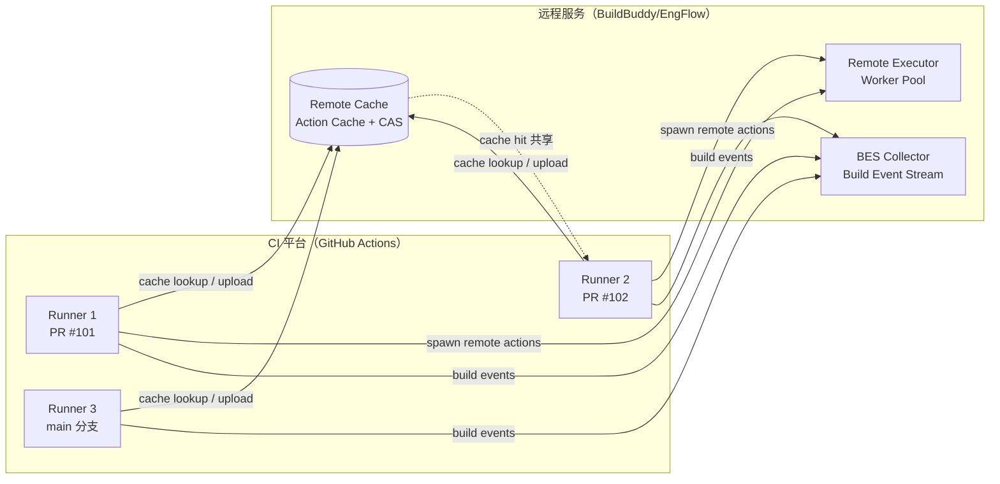
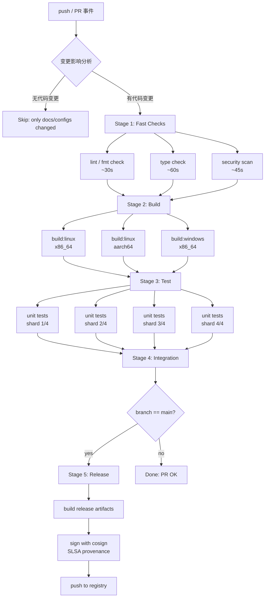

---
tags:
  - build-systems
  - tier3
  - CI-CD
  - 构建集成
---
# CI/CD 与构建系统集成实践

> [!abstract] TL;DR
> CI/CD 流水线是构建系统的"生产环境"。本文系统拆解构建缓存分层策略、矩阵构建、增量 CI/monorepo 影响分析、BEP/Build Scan 联动、远程缓存与 RBE 在 CI 中的落地、主流 CI 平台对比、制品管理、测试分片与 flaky test 治理、构建产物签名（SLSA provenance）以及 pipeline-as-code 设计。掌握这些技术，可将中大型项目的 CI 构建时间压缩 50–90%，同时维持可重复、可追溯的产物质量。

---

## 概述与定位

### CI/CD 的本质：构建系统的调度外壳

持续集成（CI）与持续交付/部署（CD）并不是构建系统，而是构建系统的**调度框架**。GitHub Actions、GitLab CI、Jenkins、Buildkite、CircleCI 等平台本质上做三件事：

1. **触发**：监听代码事件（push、PR、tag、定时）并拉起运行器；
2. **编排**：按依赖关系并行/串行执行 job；
3. **环境管理**：提供干净的虚拟机或容器，附带缓存、制品、密钥注入等辅助能力。

真正的"构建"——依赖解析、编译、链接、测试——仍由 Make、CMake、Bazel、Gradle、Cargo 等构建工具负责。CI 与构建系统之间的接口越清晰，流水线的可维护性、性能和安全性就越高。

### 集成的几个层次

| 层次 | 描述 | 典型工具 |
|------|------|----------|
| L0：脚本粘合 | CI 直接调 shell 脚本，构建工具透明 | Makefile + `.github/workflows/*.yml` |
| L1：缓存感知 | CI 平台缓存构建中间产物目录 | `actions/cache`、GitLab `cache:` |
| L2：事件桥接 | 构建工具向 CI 输出结构化事件流 | Bazel BEP、Gradle Build Scan |
| L3：执行外包 | CI runner 仅做调度，实际构建走远程执行集群 | Bazel RBE + BuildBuddy/EngFlow |
| L4：供应链闭环 | 构建过程内嵌签名，产物携带 provenance | cosign + Sigstore + SLSA Level 2/3 |

现代大型工程通常处于 L2–L4，而多数团队仍在 L0–L1 挣扎。本文的目标是帮助读者系统跃升。

---

## 原理与机制

### 缓存分层：CI 缓存的三大层次

CI 缓存并不是单一概念，而是存在三个物理层次，混淆它们是导致缓存失效率高、命中率低的根本原因。

#### 层次 1：包管理器依赖缓存

这是最粗粒度的缓存，存放 npm `node_modules`、Maven `~/.m2/repository`、pip `~/.cache/pip`、Cargo `~/.cargo/registry` 等**第三方依赖**。

- **缓存键**：锁文件哈希（`package-lock.json`、`Cargo.lock`、`pom.xml` 等）
- **失效条件**：锁文件变更时完全失效并重新下载
- **适用范围**：所有项目，收益最高（节省 1–10 分钟网络 IO）

```yaml
# GitHub Actions 示例：Cargo 依赖缓存
- uses: actions/cache@v4
  with:
    path: |
      ~/.cargo/registry
      ~/.cargo/git
      target/
    key: ${{ runner.os }}-cargo-${{ hashFiles('**/Cargo.lock') }}
    restore-keys: |
      ${{ runner.os }}-cargo-
```

`restore-keys` 的前缀匹配机制允许在精确键缺失时退而使用旧缓存（partial hit），避免完全冷启动。

#### 层次 2：构建系统中间产物缓存

这是**编译产物**层，缓存 `.o` 目标文件、`.class` 字节码、Rust 的 `.rlib`/`.rmeta`、CMake 的 `CMakeCache.txt` + 编译数据库等。

- **缓存键**：源文件指纹 + 编译器版本 + 编译选项（三者任一变化都应使键改变）
- **失效粒度**：理想情况下应为文件级别（只重编变更文件），但 CI 缓存通常以目录为单位存储，做不到文件级 diff

Bazel/Buck2 等工具在本地已有内容寻址缓存（Action Cache），在 CI 中应当连接远程缓存服务而非依赖 CI 平台的目录缓存（见"远程缓存"小节）。

#### 层次 3：Docker 镜像层缓存

当构建产物是容器镜像时，BuildKit 的层缓存（第 19 篇已详述）与 CI 平台的 registry 缓存联动：

```yaml
# GitLab CI 中使用 BuildKit inline 缓存
build:
  script:
    - docker buildx build
        --cache-from type=registry,ref=$CI_REGISTRY_IMAGE:cache
        --cache-to   type=registry,ref=$CI_REGISTRY_IMAGE:cache,mode=max
        --push -t $CI_REGISTRY_IMAGE:$CI_COMMIT_SHA .
```

三层缓存叠加使用，才能将 CI 构建时间压缩到接近开发者本地增量构建的水平。

### 缓存键设计的核心原则

缓存键设计是 CI 性能工程的核心技艺，需要在**命中率**与**正确性**之间取得平衡：

```
cache_key = OS + compiler_version + hashFiles(lock_files) + branch_fallback
```

几条设计铁律：

1. **键过于宽松**（如仅用分支名）→ 缓存被错误复用，产生"幽灵依赖"构建污染；
2. **键过于严格**（如含 commit SHA）→ 永远不命中，形同没有缓存；
3. **restore-keys 前缀梯级**：从精确到模糊，提供优雅降级；
4. **跨分支策略**：`main` 分支写缓存，PR 分支只读（防止 PR 污染共享缓存）；
5. **平台隔离**：`${{ runner.os }}` 前缀必须，Windows/Linux/macOS 的产物互不兼容。

### 矩阵构建：多维度并行测试

矩阵构建（Matrix Strategy）允许用一份 job 定义，笛卡尔积展开为多个并行任务：

```yaml
strategy:
  matrix:
    os: [ubuntu-22.04, macos-14, windows-2022]
    python: ["3.10", "3.11", "3.12"]
    include:
      - os: ubuntu-22.04
        python: "3.13-dev"   # 仅 Linux 跑开发版
  exclude:
      - os: windows-2022
        python: "3.10"       # 跳过已知不兼容组合
```

矩阵展开为 `3×3 - 1 + 1 = 9` 个并行 job。这是构建系统横向扩展的 CI 层面体现——多 OS、多编译器版本、多配置的组合覆盖，代替了手工维护多份 workflow 的繁琐。

矩阵与缓存的交叉点在于缓存键必须包含矩阵维度：

```yaml
key: ${{ runner.os }}-py${{ matrix.python }}-${{ hashFiles('poetry.lock') }}
```

### 增量 CI 与 monorepo 影响分析

对于 monorepo，每次 commit 触发全量构建是灾难性的。增量 CI 的核心思路是：**只构建和测试本次变更真正影响到的目标**。

#### 影响分析算法

```
输入：changed_files = git diff --name-only HEAD~1..HEAD
输出：affected_targets

1. 对每个 file in changed_files：
   - 查询 build graph：哪些 target 直接 include 这个 file？→ direct_deps
2. 对每个 target in direct_deps：
   - 向上遍历 reverse dependency graph（rdeps）
   - 收集所有 transitive reverse dependents
3. affected_targets = union(rdeps(direct_deps))
```

不同工具的实现方式：

**Bazel：**
```bash
# 找出所有依赖变更文件的目标
CHANGED=$(git diff --name-only HEAD~1 | xargs bazel query 'set({})')
AFFECTED=$(bazel query "rdeps(//..., ${CHANGED})")
bazel test $AFFECTED
```

**Nx（JavaScript monorepo）：**
```bash
nx affected:test --base=origin/main --head=HEAD
nx affected:build --base=origin/main --parallel=4
```

**Pants：**
```bash
pants --changed-since=origin/main test ::
```

**Turborepo：**
```bash
turbo run test --filter=[origin/main]
```

影响分析的准确性依赖于构建图的完整性。若依赖声明不完整（如 Make 中的隐式规则），影响集计算会产生漏报，导致 CI 错误地跳过应当构建的目标。这也是精确依赖声明（Bazel 的 `deps` 必须完备）的重要价值所在。

### BEP（Build Event Protocol）与 Build Scan 联动

Bazel 的 Build Event Protocol 是一个结构化事件流规范，构建过程中的每个动作（Target 开始/完成、测试结果、缓存命中）都以 Protobuf 消息形式输出：

```
Build Event Stream
├── BuildStarted
├── TargetConfigured  (×N targets)
├── ActionExecuted    (×M actions)
│   ├── stdout/stderr URL
│   └── cache_hit: true/false
├── TestResult        (×T test cases)
│   ├── PASSED/FAILED/TIMEOUT/FLAKY
│   └── test.xml URL
└── BuildFinished
    └── exit_code
```

在 CI 中桥接 BEP 到分析平台：

```bash
bazel test //... \
  --build_event_binary_file=bep.bin \
  --bes_backend=grpcs://remote.buildbuddy.io \
  --bes_results_url=https://app.buildbuddy.io/invocation/ \
  --remote_header=x-buildbuddy-api-key=${BUILDBUDDY_API_KEY}
```

BuildBuddy / EngFlow / Develocity (Gradle) 等平台接收 BEP 后，渲染出：
- 构建时间火焰图（临界路径 vs 并发度）
- 动作缓存命中率趋势（Remote Hit / Local Hit / Miss）
- 测试结果历史（flaky test 自动标注）
- 构建日志全文检索

这使得 CI 构建的"黑盒"变成可观测的系统，是调试性能回归的核心手段。

### 远程缓存与 RBE 在 CI 中的部署架构

远程缓存（Remote Cache）与远程构建执行（RBE）是 CI 加速的终极手段（第 11 篇已从协议层详述），本节聚焦 CI 集成的具体配置。



多个 CI runner 共享同一个远程缓存，意味着 PR #101 编译过的 action 产物，PR #102 可以直接复用（前提是相同的 action 输入哈希）。这将缓存从"per-runner 本地"提升为"全团队共享"，命中率从 20–40% 提升到 70–90%。

Bazel CI 典型配置（`.bazelrc`）：

```
# CI 专用 .bazelrc 片段
build:ci --remote_cache=grpcs://remote.buildbuddy.io
build:ci --remote_executor=grpcs://remote.buildbuddy.io
build:ci --remote_header=x-buildbuddy-api-key=${BUILDBUDDY_API_KEY}
build:ci --jobs=200          # 远比 runner CPU 核心数高
build:ci --build_event_backend=grpcs://remote.buildbuddy.io
build:ci --noremote_upload_local_results  # PR 构建不污染 main 缓存（可选策略）
```

---

## 结构/算法/伪代码详解

### Pipeline-as-Code 的结构设计

一个生产级 CI pipeline 的典型分层结构：



关键设计决策：
- **快速检查前置**：lint/type check 最廉价，最先运行，最早给开发者反馈；
- **构建与测试解耦**：构建产物上传为 artifact，测试 job 下载后并行分片执行；
- **分支守卫**：签名和发布步骤仅在 `main` 分支触发，PR 只做验证。

### 测试分片（Sharding）算法

大型测试套件（数千个测试用例）无法在单个 runner 上按时完成，需要将测试均匀分配到多个 runner 上并行执行。

**静态分片**（基于 index/total）：

```python
# pytest 分片示例（pytest-shard 插件）
# runner 1: pytest --shard-id=0 --num-shards=4
# runner 2: pytest --shard-id=1 --num-shards=4
# ...

def should_run(test_index: int, shard_id: int, num_shards: int) -> bool:
    return test_index % num_shards == shard_id
```

GitHub Actions 矩阵分片：

```yaml
strategy:
  matrix:
    shard: [0, 1, 2, 3]
steps:
  - run: |
      pytest --shard-id=${{ matrix.shard }} \
             --num-shards=4 \
             --timeout=60
```

**动态分片**（基于历史耗时）：

Bazel 原生支持基于测试用时的智能分片：

```bash
bazel test //... \
  --test_sharding_strategy=explicit \
  --test_env=TEST_TOTAL_SHARDS=4 \
  --test_env=TEST_SHARD_INDEX=0
```

Gradle 企业版（Develocity）的测试分布功能会根据历史耗时将测试用例分配到多个 runner，使各 shard 总耗时趋于一致，避免"长尾 shard"拖慢整体流水线。

### Flaky Test 检测与处理策略

Flaky test（不稳定测试）是 CI 的最大噪声源之一。一个测试如果"有时通过、有时失败"，会导致：
- 开发者反复手动重跑 CI，浪费时间；
- 真实失败被误判为 flaky 而忽视；
- 团队丧失对 CI 红绿信号的信任。

**检测算法**（基于历史记录）：

```
对于每个 test_case：
  runs_last_30_days = 查询 BES/历史数据库
  failure_rate = failures / total_runs
  
  if failure_rate > 0 and failure_rate < 0.3:
    标记为 flaky
  elif failure_rate == 0:
    标记为 stable
  elif failure_rate > 0.3:
    标记为 broken（需修复）
```

**CI 层面的缓解策略**：

```yaml
# GitHub Actions：失败时自动重试
- name: Run tests
  uses: nick-fields/retry@v3
  with:
    timeout_minutes: 10
    max_attempts: 3
    command: pytest tests/
    retry_on: error
```

```bash
# Bazel：内置重试机制
bazel test //... \
  --flaky_test_attempts=3 \
  --test_output=errors
```

更系统的处理：将 flaky test 隔离到专属 suite（`@flaky` 注解），在 main 分支构建中运行多次取均值，在 PR 构建中允许跳过，同时触发自动 issue 创建追踪修复进度。

### 制品管理：上传、版本化与保留策略

CI 产物（artifact）管理是从"构建"到"发布"的桥梁。

**上传阶段**（构建 job）：

```yaml
- name: Upload build artifacts
  uses: actions/upload-artifact@v4
  with:
    name: release-binaries-${{ matrix.os }}-${{ github.sha }}
    path: |
      dist/
      !dist/**/*.pdb    # 排除调试符号（体积大，单独上传）
    retention-days: 7   # PR 产物 7 天过期
    compression-level: 9
```

**下载阶段**（测试/发布 job）：

```yaml
- name: Download artifacts
  uses: actions/download-artifact@v4
  with:
    name: release-binaries-linux-${{ github.sha }}
    path: ./dist
```

**版本化策略**：

| 触发场景 | 版本格式 | 保留期 |
|---------|---------|--------|
| PR 构建 | `pr-{number}-{sha7}` | 3 天 |
| main 分支 | `main-{sha7}-{date}` | 30 天 |
| Tag 发布 | `v{semver}` | 永久 |
| Nightly | `nightly-{date}` | 7 天 |

外部产物仓库（Artifactory、Nexus、GHCR、S3）通常与 CI 制品分开管理：CI artifact 是临时的工作产物，外部仓库存放正式发布版本。

---

## 工具视角与实战

### 主流 CI 平台能力对比

| 特性 | GitHub Actions | GitLab CI | Jenkins | Buildkite | CircleCI |
|------|---------------|-----------|---------|-----------|----------|
| **托管 runner** | ✅ ubuntu/mac/win | ✅ Linux/Windows | ❌ 自建 | ❌ 自建 | ✅ Linux/macOS |
| **矩阵构建** | ✅ strategy.matrix | ✅ parallel + rules | ✅ Matrix Plugin | ✅ 动态步骤 | ✅ parallelism |
| **缓存** | actions/cache | cache: paths | 插件 | S3/GCS 原生 | 内置 |
| **自托管 runner** | ✅ self-hosted | ✅ GitLab Runner | ✅ 全量控制 | ✅ agent | ✅ self-hosted |
| **Pipeline 语法** | YAML | YAML | Groovy/YAML | YAML | YAML/Orbs |
| **BEP 集成** | 外部工具 | 外部工具 | 外部工具 | 外部工具 | 外部工具 |
| **Bazel 支持** | `bazelbuild/setup-bazel` | 手动 | 插件 | 原生友好 | Orb |
| **OIDC token** | ✅ id-token 权限 | ✅ CI_JOB_JWT_V2 | ✅ 插件 | ✅ | ✅ |

#### GitHub Actions 实战要点

GitHub Actions 的核心优势是 Marketplace 生态和 OIDC 身份联合（无需长期密钥即可向云服务商鉴权）：

```yaml
name: Build and Test
on:
  push:
    branches: [main]
  pull_request:

permissions:
  contents: read
  id-token: write   # 启用 OIDC，用于 cosign 签名

jobs:
  build:
    runs-on: ubuntu-22.04
    steps:
      - uses: actions/checkout@v4

      - name: Setup Bazel
        uses: bazelbuild/setup-bazel@0.9.0
        with:
          bazelisk-version: "1.x"

      - name: Configure Remote Cache
        run: |
          echo "build --remote_cache=${{ secrets.BUILDBUDDY_CACHE_URL }}" >> .bazelrc
          echo "build --remote_header=x-buildbuddy-api-key=${{ secrets.BUILDBUDDY_API_KEY }}" >> .bazelrc

      - name: Build
        run: bazel build //...

      - name: Test
        run: bazel test //... --test_output=errors
```

#### GitLab CI 实战：extends 复用与规则控制

```yaml
# .gitlab-ci.yml
variables:
  BAZEL_FLAGS: "--config=ci --jobs=50"

.bazel_template: &bazel_template
  image: gcr.io/bazel-public/bazel:7.0.0
  cache:
    key:
      files:
        - WORKSPACE
        - MODULE.bazel
    paths:
      - .bazel_cache/
  before_script:
    - echo "build --disk_cache=.bazel_cache" >> .bazelrc

build:linux:
  <<: *bazel_template
  stage: build
  script:
    - bazel build $BAZEL_FLAGS //...
  rules:
    - if: $CI_PIPELINE_SOURCE == "merge_request_event"
    - if: $CI_COMMIT_BRANCH == $CI_DEFAULT_BRANCH

test:
  <<: *bazel_template
  stage: test
  parallel: 4    # GitLab 原生测试并行
  script:
    - bazel test $BAZEL_FLAGS //...
      --test_env=TEST_TOTAL_SHARDS=4
      --test_env=TEST_SHARD_INDEX=$((CI_NODE_INDEX - 1))
```

#### Jenkins：Declarative Pipeline 与 Bazel 集成

Jenkins 的优势是灵活性和自托管控制权，Declarative Pipeline 语法较 Scripted Pipeline 更适合 pipeline-as-code：

```groovy
pipeline {
    agent any
    options {
        timeout(time: 30, unit: 'MINUTES')
        buildDiscarder(logRotator(numToKeepStr: '20'))
    }
    stages {
        stage('Build') {
            steps {
                sh 'bazel build --config=ci //...'
            }
        }
        stage('Test') {
            parallel {
                stage('Unit') {
                    steps { sh 'bazel test --config=ci //unit/...' }
                }
                stage('Integration') {
                    steps { sh 'bazel test --config=ci //integration/...' }
                }
            }
        }
    }
    post {
        always {
            junit '**/bazel-testlogs/**/*.xml'
            archiveArtifacts artifacts: 'bazel-bin/**/*.tar.gz'
        }
    }
}
```

#### Buildkite：动态 Pipeline 与 monorepo 影响分析

Buildkite 的杀手特性是"动态 pipeline"——可以在运行时根据变更文件生成下一步要执行的步骤列表：

```bash
#!/bin/bash
# .buildkite/generate_pipeline.sh
CHANGED=$(git diff --name-only HEAD~1)
PIPELINE=""

if echo "$CHANGED" | grep -q "^backend/"; then
  PIPELINE="$PIPELINE$(cat .buildkite/backend_steps.yml)"
fi

if echo "$CHANGED" | grep -q "^frontend/"; then
  PIPELINE="$PIPELINE$(cat .buildkite/frontend_steps.yml)"
fi

echo "$PIPELINE" | buildkite-agent pipeline upload
```

### Gradle Build Scan 与 Develocity 集成

对于 JVM 生态（Gradle/Maven），Develocity（原 Gradle Enterprise）提供类似 BuildBuddy 的可观测性平台：

```kotlin
// settings.gradle.kts
plugins {
    id("com.gradle.develocity") version "3.17"
}

develocity {
    buildScan {
        termsOfUseUrl = "https://gradle.com/terms-of-service"
        termsOfUseAgree = "yes"
        // CI 环境自动发布，本地默认不发布
        publishing.onlyIf { System.getenv("CI") != null }
        server = "https://ge.your-company.com"
    }
}
```

在 CI 中运行 `./gradlew build --scan` 后，控制台会打印一个 Build Scan URL，包含：
- 任务执行时间线（并行度可视化）
- 缓存命中分析（本地/远程/未缓存）
- 测试分布报告
- 构建依赖解析耗时

---

## 安全性与正确使用

### CI Secret 管理与最小权限原则

CI 流水线是**权限最集中的代码执行环境之一**——它能访问代码仓库、部署凭证、签名密钥、云账号。错误的 secret 管理会造成灾难性的供应链安全事故。

**核心原则**：

1. **不把 secret 写进代码**：`.env` 文件、hardcode 的 API key 会随源码泄露；使用 CI 平台的 Secrets/Variables 功能（GitHub Encrypted Secrets、GitLab CI Variables、Buildkite Agent Environment Hooks）；

2. **OIDC 替代长期密钥**：GitHub Actions、GitLab CI 支持 OIDC（OpenID Connect），CI job 运行时获得短期 JWT，直接向 AWS/GCP/Azure 换取临时凭证，无需存储永久 Access Key：

```yaml
# GitHub Actions + AWS OIDC（无 Access Key）
- name: Configure AWS Credentials
  uses: aws-actions/configure-aws-credentials@v4
  with:
    role-to-assume: arn:aws:iam::123456789:role/github-actions-role
    aws-region: us-east-1
    # 不需要 aws-access-key-id / aws-secret-access-key
```

3. **权限最小化**：在 workflow 顶层声明 `permissions: read-all`，仅在需要写权限的 job 中单独放开：

```yaml
permissions:
  contents: read    # 默认只读
  
jobs:
  release:
    permissions:
      contents: write       # 允许创建 release
      packages: write       # 允许推送到 GHCR
      id-token: write       # 允许请求 OIDC token（cosign 签名需要）
```

### Fork PR 的权限边界

PR 构建的最大安全陷阱是 **fork 仓库的 PR 可以访问 secrets**。默认情况下 GitHub Actions 对 fork PR 不暴露 secrets（这是正确的），但以下做法会引入风险：

- 使用 `pull_request_target` 事件（在目标仓库上下文运行，可访问 secrets）并 checkout PR 代码；
- 在 `push` 事件的 workflow 中检出来自外部 fork 的代码；

安全做法：将需要 secrets 的步骤分离到 `push` 事件（仅 maintainer 可触发），PR 构建仅做无 secret 的 lint/test。

### Self-Hosted Runner 隔离

Self-hosted runner 是攻击者的高价值目标：一旦攻击者能在 runner 上执行代码，就能访问 runner 的所有凭证和网络权限。

**隔离策略**：

| 策略 | 实现方式 | 防护效果 |
|------|---------|---------|
| 每 job 一个新容器 | Docker-in-Docker 或 Kubernetes runner | 高：job 间完全隔离 |
| 临时 runner（ephemeral） | `--ephemeral` 标志，完成后自销毁 | 高：无持久状态 |
| 网络隔离 | runner 只能访问特定 endpoints | 中：限制横向移动 |
| 只运行受信代码 | 手动审批 fork PR | 中：依赖人工审核 |

GitHub Actions 推荐的 Kubernetes runner 方案（actions-runner-controller）：每个 job 启动一个新 Pod，完成后销毁，实现 ephemeral + 容器隔离的双重保障。

### 构建产物签名与 SLSA Provenance

SLSA（Supply-chain Levels for Software Artifacts）是 Google 提出的软件供应链安全框架（第 12 篇已详述框架本身），在 CI 中落地 SLSA Level 2 需要构建过程生成可验证的 provenance（来源证明）：

```yaml
# GitHub Actions + cosign + SLSA provenance
jobs:
  build:
    permissions:
      id-token: write
      contents: read
    steps:
      - name: Build binary
        run: go build -o dist/myapp ./...

      - name: Install cosign
        uses: sigstore/cosign-installer@v3

      - name: Sign binary
        env:
          COSIGN_EXPERIMENTAL: "1"   # 使用 keyless 签名（OIDC 驱动）
        run: |
          cosign sign-blob \
            --output-signature dist/myapp.sig \
            --output-certificate dist/myapp.pem \
            dist/myapp

      - name: Generate SLSA provenance
        uses: slsa-framework/slsa-github-generator/.github/workflows/generator_generic_slsa3.yml@v1
        with:
          base64-subjects: ${{ steps.hash.outputs.hash }}
```

使用者验证：

```bash
cosign verify-blob \
  --certificate dist/myapp.pem \
  --signature dist/myapp.sig \
  --certificate-oidc-issuer=https://token.actions.githubusercontent.com \
  --certificate-identity=https://github.com/owner/repo/.github/workflows/release.yml@refs/heads/main \
  dist/myapp
```

Keyless 签名的核心机制：CI job 持有 GitHub OIDC token → 向 Sigstore Fulcio 换取短期 X.509 证书（证明代码来自哪个 repo/workflow/branch）→ 用此证书签名制品 → 签名记录上传到 Sigstore Rekor 透明日志（不可篡改）。验证者只需要信任 Sigstore 根证书，无需管理任何签名密钥。

### 与供应链安全（第 12 篇）的呼应

第 12 篇从攻击面角度讨论了 SolarWinds 式攻击和依赖混淆攻击。在 CI/CD 层面对应的防线：

1. **Dependency Pinning**：所有 `uses:` action 引用固定到 commit SHA（不用 `@v3` 标签，标签可被覆写）：
   ```yaml
   # 不安全（标签可被覆写）
   uses: actions/checkout@v4
   # 安全（SHA 不可变）
   uses: actions/checkout@11bd71901bbe5b1630ceea73d27597364c9af683
   ```

2. **Action 审计**：使用 `step-security/harden-runner` 监控 runner 的网络出站请求，检测恶意 action 的数据外泄；

3. **Secret 扫描**：推送时触发 `git-secrets`/`gitleaks` 检测，防止开发者意外 commit 敏感信息。

---

## 小结

CI/CD 与构建系统的集成是一个多层次的工程问题：

| 层次 | 关键技术 | 主要收益 |
|------|---------|---------|
| 缓存分层 | 依赖缓存 + 产物缓存 + 镜像层缓存 | 减少 50–80% 的重复 IO |
| 矩阵构建 | strategy.matrix + 缓存键隔离 | 多平台覆盖无需手工维护 |
| 增量 CI | 影响分析 + rdeps 图遍历 | Monorepo 中构建/测试量减少 70–95% |
| 远程缓存 | 共享 Action Cache（Bazel/Gradle） | 跨 runner 缓存复用，命中率 70–90% |
| 构建可观测性 | BEP + Build Scan/BuildBuddy | 性能回归可见，flaky test 可追踪 |
| 测试分片 | matrix shard + 历史耗时均衡 | 测试阶段线性加速，N 个 shard 约缩 N 倍 |
| 供应链安全 | OIDC + cosign keyless + SLSA provenance | 制品来源可验证，无长期密钥风险 |
| Runner 安全 | Ephemeral runner + 最小权限 | 防止 job 间状态污染和横向移动 |

**最重要的一条经验**：CI 性能问题几乎总是先从**缓存**入手，其次是**并行度**，最后才是**减少工作量**（增量构建）。很多团队跳过前两步直接搞增量 CI，结果是系统复杂度大增而实际收益不如预期。

从第 11 篇（RBE 分布式执行）延伸到本篇，完整的大规模构建图景是：**本地增量构建 → CI 共享远程缓存 → 超出缓存边界时启动 RBE 分布式执行 → BEP 上报构建事件供可观测平台分析 → 产物签名后推送至制品仓库**。每个环节都有对应的工具链，关键在于它们的集成边界要清晰。

---

## 相关阅读

- [[00.构建系统横向对比总览|系列总览：构建系统横向对比]]
- [[11.分布式构建与远程执行|第 11 篇：分布式构建与远程执行（RBE 协议详解）]]
- [[12.供应链安全SLSA_SBOM|第 12 篇：供应链安全（SLSA/SBOM）]]
- [[19.容器化构建BuildKit|第 19 篇：容器化构建（Docker BuildKit/OCI）]]
- [[21.Bzlmod迁移|第 21 篇：Bzlmod 迁移（WORKSPACE → MODULE.bazel）]]
- [GitHub Actions 缓存文档](https://docs.github.com/en/actions/using-workflows/caching-dependencies-to-speed-up-workflows)
- [Bazel Remote Execution Overview](https://bazel.build/remote/rbe)
- [SLSA GitHub Generator](https://github.com/slsa-framework/slsa-github-generator)
- [Sigstore cosign 文档](https://docs.sigstore.dev/cosign/overview/)
- [BuildBuddy BES 集成](https://www.buildbuddy.io/docs/setup/)

---

[[00.构建系统横向对比总览|⬆ 系列总览]] | [[19.容器化构建BuildKit|← 上一章]] | [[21.Bzlmod迁移|→ 下一章]]
