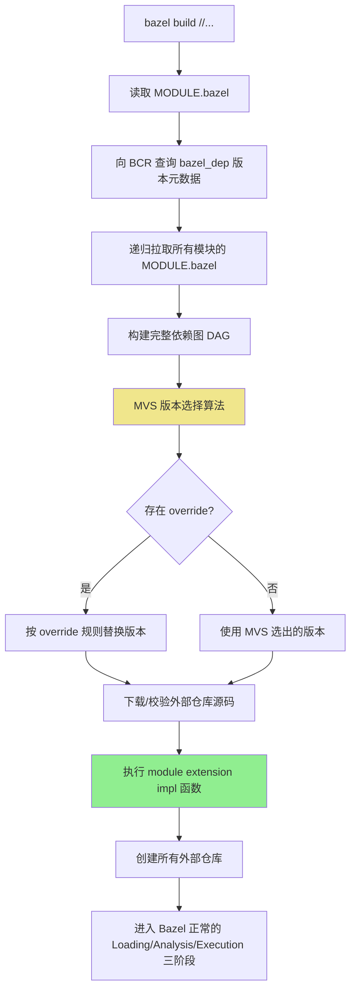
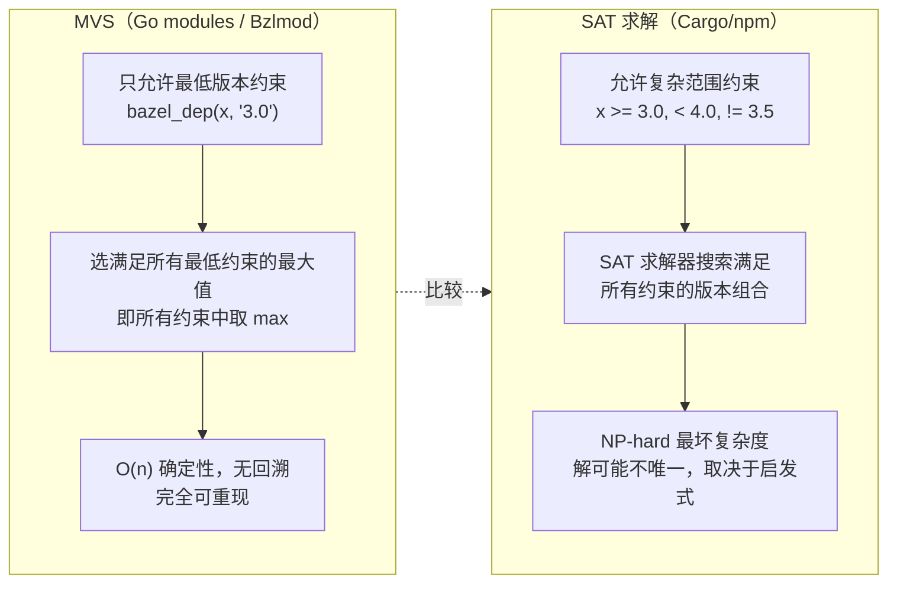

---
tags:
  - build-systems
  - tier3
  - bazel
  - bzlmod
---
# Bazel Bzlmod 迁移：WORKSPACE → MODULE.bazel

> [!abstract] TL;DR
> Bzlmod 是 Bazel 6.0 引入、Bazel 7+ 默认启用的全新依赖管理子系统，用 `MODULE.bazel` + Bazel Central Registry（BCR）彻底取代 `WORKSPACE`。核心变革在于引入语义版本解析：采用与 Go modules 同源的 **Minimal Version Selection（MVS）算法**，在保证可重现性的前提下确定性地解决菱形依赖，消除手动管理传递依赖、顺序敏感、依赖版本冲突等 WORKSPACE 时代的痛点。模块扩展（module extension）机制为非 Bzlmod 生态（pip、npm、自定义 repo rule）提供桥接通道。

## 概述与定位

### WORKSPACE 时代的历史背景

Bazel 在 Bzlmod 之前的外部依赖系统完全依赖 `WORKSPACE` 文件（或 `WORKSPACE.bazel`）。这是一个根目录下的特殊 Starlark 文件，用于声明所有外部仓库（external repository）——包括第三方库、工具链、语言规则集等。

在 WORKSPACE 模型中，每个外部仓库通过 `repository rule`（如 `http_archive`、`git_repository`）手动声明：

```python
# 经典 WORKSPACE 写法（Bzlmod 之前）
load("@bazel_tools//tools/build_defs/repo:http.bzl", "http_archive")

http_archive(
    name = "com_google_protobuf",
    sha256 = "3bd7828aa5af4b13821996be5914d58dd1e74401...",
    strip_prefix = "protobuf-3.21.7",
    urls = ["https://github.com/protocolbuffers/protobuf/archive/v3.21.7.tar.gz"],
)

# 还必须手动加载 protobuf 本身的依赖
load("@com_google_protobuf//:protobuf_deps.bzl", "protobuf_deps")
protobuf_deps()
```

这套机制在项目规模较小时尚可接受，但随着依赖树扩大，暴露出一系列根本性缺陷，促使 Bazel 团队重新设计整套系统。

### WORKSPACE 的根本性问题

**一、无语义版本解析，无 diamond 解决能力**

WORKSPACE 中每个外部仓库是一个独立的 `name → URL + sha256` 映射，Bazel 自身不理解"版本"的概念。当项目 A 依赖 protobuf@3.19，项目 B 依赖 protobuf@3.21 时，WORKSPACE 里只能存在一个 `com_google_protobuf` 仓库名，只有 sha256 指向具体版本。

若两个传递依赖都用同一个 `name` 声明了不同版本，后声明的会被忽略（WORKSPACE 顺序语义：第一个定义的同名仓库生效）。这意味着：

- 传递依赖版本冲突只能靠开发者手动协调，在根 WORKSPACE 中显式覆盖到一个兼容版本
- 没有工具能自动告诉你"你需要升级 X 到版本 Y 才能满足所有依赖方"
- diamond 依赖（A→C@1 和 B→C@2，最终项目同时依赖 A 和 B）是一个纯粹的人工协调问题

**二、手动管理传递依赖**

每个库的依赖不会被 Bazel 自动拉取。上例中 `protobuf_deps()` 是 protobuf 库自己提供的一个宏，调用者必须手动在 WORKSPACE 中调用它。若 protobuf 自身有十几个传递依赖，用户就要调用十几个 `xxx_deps()` 宏，且顺序通常有要求（先声明被依赖的再声明依赖方）。

大型项目的 WORKSPACE 文件往往超过数千行，充满了此类样板代码，且极难维护：某个库升级版本后，其传递依赖 URL 和 sha256 全部需要同步更新，完全是人工劳动。

**三、顺序敏感**

WORKSPACE 文件按顺序执行，同名仓库首次定义生效。这意味着声明顺序影响最终使用的版本，调换两行可能导致构建行为改变。这对于自动化工具和代码生成非常不友好。

**四、无中央注册表，缺乏可发现性**

所有外部依赖的 URL、sha256 都要手动查找和填写，没有类似 crates.io、PyPI、Maven Central 的中央仓库概念。添加一个新依赖需要：找到对应 GitHub release 页、下载 tar.gz、计算 sha256、找到正确的 `strip_prefix`，整个流程全部人工操作。

### Bzlmod 的诞生

Bzlmod（Bazel Module System 的非官方缩写，官方称为 Module System 或 External Dependencies via Modules）在 Bazel 6.0（2022 年末）以实验性功能引入，在 Bazel 7.0（2023 年末）成为默认启用。它带来了三个核心概念的全面重构：

1. **模块声明语言**：`MODULE.bazel` 取代 `WORKSPACE`，提供语义版本感知的依赖声明
2. **中央注册表**：Bazel Central Registry（BCR）提供类似 crates.io 的包仓库
3. **版本解析算法**：MVS（Minimal Version Selection）在版本约束间确定性地选择版本

Bzlmod 与第 04 章所述的 Bazel 核心执行模型（三阶段 Loading/Analysis/Execution、Hermetic 沙盒、Skyframe 框架）正交——它只影响外部依赖的*声明和解析*阶段，不改变构建规则的执行语义。

## 原理与机制

### MODULE.bazel 文件格式

每个 Bazel 模块的根目录（即 Bazel 工作区根）有一个 `MODULE.bazel` 文件（有时也存在于子模块中，但外部依赖声明以根模块为准）。最简示例：

```python
# MODULE.bazel
module(
    name = "my_project",
    version = "1.0.0",
    compatibility_level = 1,
)

bazel_dep(name = "rules_cc", version = "0.0.9")
bazel_dep(name = "rules_proto", version = "5.3.0-21.7")
bazel_dep(name = "com_google_protobuf", version = "3.21.7")
bazel_dep(name = "googletest", version = "1.14.0")
```

关键指令说明：

- `module(name, version, compatibility_level)`：声明本模块的身份。`name` 是在 BCR 中的包名，`version` 遵循语义化版本（SemVer），`compatibility_level` 是破坏性兼容性级别（整数），不同 `compatibility_level` 的同名模块被视为不兼容版本，用于表达大版本破坏性变更。
- `bazel_dep(name, version)`：声明对另一个 Bzlmod 模块的直接依赖。Bazel 会自动拉取该模块的 `MODULE.bazel` 并递归解析其依赖——这是 WORKSPACE 最大区别：传递依赖由系统自动处理，不需要手动调用 `xxx_deps()` 宏。
- `bazel_dep(name, version, repo_name = "...")`：指定该依赖在本模块内使用的别名。例如 `repo_name = "my_proto"` 后，BUILD 文件中用 `@my_proto` 引用，而不是 `@com_google_protobuf`。
- `bazel_dep(name, version, dev_dependency = True)`：声明开发期依赖（测试框架、lint 工具等），在当本模块被作为依赖使用时不会传递给上层。

### Bazel Central Registry（BCR）

BCR（`registry.bazel.build`）是 Bzlmod 的官方中央注册表，托管在 GitHub（`bazelbuild/bazel-central-registry`）。其目录结构：

```
bazel-central-registry/
  modules/
    com_google_protobuf/
      3.21.7/
        MODULE.bazel        # 该版本的模块声明
        source.json         # URL 和 sha256，供 Bazel 下载源码
        patches/            # 可选：应用于源码的补丁
      3.20.3/
        ...
    rules_cc/
      ...
```

`source.json` 格式示例：

```json
{
    "url": "https://github.com/protocolbuffers/protobuf/archive/v3.21.7.tar.gz",
    "sha256": "3bd7828aa5af4b13821996be5914d58dd1e7440...",
    "strip_prefix": "protobuf-3.21.7",
    "overlay": {}
}
```

Bazel 在解析 `bazel_dep` 时，从注册表拉取 `source.json` 并下载、校验源码。开发者可以配置私有注册表（通过 `.bazelrc` 中的 `--registry` 标志），支持内部私有库或镜像。

### MVS 算法——版本解析的数学基础

Bzlmod 采用 **Minimal Version Selection（MVS）** 算法解析版本冲突，这个算法最初由 Russ Cox 为 Go modules 设计（2018 年），后被 Bzlmod 采用。

#### MVS 的核心原则

在 MVS 中，每个模块声明其对依赖的**最低版本要求**（`minimum required version`），而不是精确版本或版本范围。版本解析的目标是：找到满足所有模块声明的最低版本要求的**最小版本集合**。

直觉解释：如果模块 A 说"我需要 protobuf >= 3.19"，模块 B 说"我需要 protobuf >= 3.21"，那么同时满足两者的最小版本是 3.21——不选 3.19（不满足 B 的需求），也不选 3.25（不必要的升级）。

#### MVS 算法伪代码

```
function BuildList(root, read):
    # root: 根模块
    # read: 给定模块 M@v，返回其声明的依赖列表 [(dep_name, min_version)]
    
    visited = {}
    selected = {}  # name -> selected_version
    
    function require(mod_name, min_ver):
        current = selected.get(mod_name, "")
        if current >= min_ver:
            return  # 已满足，无需更新
        selected[mod_name] = min_ver
        # 递归处理该版本的依赖
        for (dep, dep_min) in read(mod_name, min_ver):
            require(dep, dep_min)
    
    for (dep, ver) in read(root, root.version):
        require(dep, ver)
    
    return selected
```

#### diamond 依赖场景演示

考虑经典菱形依赖：

```
my_project
├── lib_A @ 1.0  (依赖 proto >= 3.19)
└── lib_B @ 2.0  (依赖 proto >= 3.21)
```

MVS 执行过程：
1. 读取 `lib_A@1.0` 的 MODULE.bazel：需要 `proto@3.19`，记录 `selected["proto"] = "3.19"`
2. 读取 `lib_B@2.0` 的 MODULE.bazel：需要 `proto@3.21`，`3.21 > 3.19`，更新 `selected["proto"] = "3.21"`
3. 递归读取 `proto@3.21` 的依赖，继续 MVS
4. 最终 proto 选择 `3.21`——满足所有约束中的最大最小值

MVS 的关键性质：
- **确定性**：相同的依赖声明图总产生相同的选择结果，无论解析顺序
- **可重现性**：不存在"今天解析出 3.21，明天因为新版本发布解析出 3.22"的情况（不像 npm 的 `^3.x` 浮动版本）
- **最小化**：选出的是满足约束的最低版本，而非最新版本，降低引入 breaking change 的风险
- **无全局 SAT 求解**：算法是 O(n) 的简单归并，不像 cargo/npm 的版本约束满足需要 NP 困难的 SAT 求解

### module extension——桥接非 Bzlmod 生态

现实世界的构建系统不可能只用 BCR 上已注册的 Bzlmod 模块。Python 依赖在 PyPI，Node.js 依赖在 npm，还有各种自定义的内部 repository rule。**模块扩展（module extension）**是 Bzlmod 为这类场景设计的桥接机制。

module extension 的本质：它是一段 Starlark 代码，能够感知整个依赖图中所有模块对它的声明（通过 `use_extension` + `tag`），然后综合这些声明，调用传统 repository rule 来创建外部仓库。

#### pip 集成示例

```python
# MODULE.bazel（根模块）
bazel_dep(name = "rules_python", version = "0.27.1")

pip = use_extension("@rules_python//python/extensions:pip.bzl", "pip")
pip.parse(
    hub_name = "pip",
    python_version = "3.11",
    requirements_lock = "//:requirements.lock",
)
use_repo(pip, "pip")
```

```python
# BUILD（使用 pip 安装的包）
load("@pip//:requirements.bzl", "requirement")

py_library(
    name = "my_lib",
    srcs = ["my_lib.py"],
    deps = [requirement("requests"), requirement("numpy")],
)
```

`pip.parse` 是 `rules_python` 模块扩展暴露的一个 **tag 类**（tag class）。当 Bazel 收集完整个依赖图后，模块扩展的 `implementation` 函数被调用，它看到所有模块对 `pip.parse` 的 tag 调用，然后综合处理（比如：多个模块都依赖了 requests，扩展确保只下载一次）。

#### module extension 的 implementation 函数

```python
# rules_python 内部的模块扩展实现（简化版）
def _pip_extension_impl(module_ctx):
    # module_ctx.modules: 所有声明了此扩展 tag 的模块
    for mod in module_ctx.modules:
        for tag in mod.tags.parse:
            # tag.hub_name, tag.python_version, tag.requirements_lock 等属性
            _create_pip_repos(
                hub_name = tag.hub_name,
                python_version = tag.python_version,
                requirements = tag.requirements_lock,
            )

pip = module_extension(
    implementation = _pip_extension_impl,
    tag_classes = {
        "parse": tag_class(attrs = {
            "hub_name": attr.string(mandatory = True),
            "python_version": attr.string(default = "3.11"),
            "requirements_lock": attr.label(mandatory = True),
        }),
    },
)
```

#### use_repo 指令

`use_repo` 是将 module extension 创建的外部仓库引入当前模块可见性的必需步骤：

```python
pip = use_extension("@rules_python//python/extensions:pip.bzl", "pip")
pip.parse(hub_name = "pip", ...)
use_repo(pip, "pip")  # 使 @pip 在本模块的 BUILD 文件中可见
```

若不调用 `use_repo`，即使 extension 创建了 `@pip` 仓库，本模块的 BUILD 文件也无法用 `@pip//...` 引用它。这个显式可见性控制是 Bzlmod 的设计原则：依赖关系必须显式声明。

### override 机制

Bzlmod 的版本自动解析在大多数情况下是期望行为，但有些场景需要手动控制：使用 BCR 尚未收录的版本、使用 git HEAD 版本、使用本地开发中的仓库等。override 指令只能在**根模块**中使用（非根模块中的 override 被忽略，这是刻意设计，防止传递依赖篡改版本选择）。

**single_version_override**

强制某个模块使用指定版本，忽略 MVS 计算结果：

```python
single_version_override(
    module_name = "com_google_protobuf",
    version = "3.25.1",        # 强制使用此版本
    registry = "https://my-internal-registry.example.com",  # 可选：从私有注册表拉
    patches = ["//:patches/protobuf_fix.patch"],  # 可选：打补丁
    patch_strip = 1,
)
```

**archive_override**

完全绕过注册表，直接指定 URL 下载：

```python
archive_override(
    module_name = "com_google_protobuf",
    urls = ["https://github.com/protocolbuffers/protobuf/archive/v3.25.1.tar.gz"],
    sha256 = "9bd87b8280ef720d3240514f884e56a712f2218f0d693b48050c836028940a42",
    strip_prefix = "protobuf-3.25.1",
)
```

**git_override**

使用 git 仓库的某个 commit 或分支：

```python
git_override(
    module_name = "my_private_lib",
    remote = "https://github.com/my-org/my-private-lib.git",
    commit = "a1b2c3d4e5f6...",  # 固定 commit，保证可重现
)
```

**local_path_override**

指向本机文件系统上的模块，适合本地开发调试（修改依赖库然后在项目中实时测试）：

```python
local_path_override(
    module_name = "rules_cc",
    path = "../rules_cc",  # 相对于根 MODULE.bazel 的路径
)
```

local_path_override 的典型场景：同时开发 A 项目和它依赖的 B 库，在 B 还未发版时，A 的 MODULE.bazel 用 `local_path_override` 指向本机的 B 仓库目录。发版后，改为 `bazel_dep` 即可。

## 结构/算法/伪代码详解

### Bzlmod 整体解析流程



### MVS 与 SAT 求解器的对比

Bzlmod（MVS）、Cargo（PubGrub/SAT）和 npm（v3+ 扁平化 SAT）代表了版本解析的三种不同哲学：



| 维度 | MVS（Bzlmod） | SAT（Cargo/npm） |
|------|--------------|-----------------|
| 约束表达 | 只支持 `>= x`（最低版本） | 支持范围、排除、精确匹配 |
| 算法复杂度 | O(n)，线性归并 | NP-hard（最坏情况） |
| 可重现性 | 完全确定，lockfile 即完整状态 | 需要 lockfile 才能重现（Cargo.lock） |
| breaking change 风险 | 低（选最小满足版本） | 取决于约束宽松程度 |
| 依赖升级 | 需要根模块显式提升版本要求 | 允许在范围内自动升级 |
| BCR 要求 | 各模块只声明最低需求，简单 | 各包需要精心声明上界避免冲突 |

MVS 有一个重要权衡：它放弃了"自动使用最新版本"的能力。Cargo 用户可以在约束范围内自动获得安全补丁版本（`>= 3.0, < 4.0` 会自动选 3.x 最新），而 MVS 用户必须手动将 `bazel_dep` 中的版本号提升才能升级。这是可重现性与便捷性之间的刻意权衡。

### 依赖图可视化与调试

Bazel 提供内建命令查询 Bzlmod 解析结果：

```bash
# 列出所有被选择的模块及版本
bazel mod graph

# 查看某个模块为何被选择（依赖路径）
bazel mod explain --module com_google_protobuf

# 显示所有直接和传递依赖
bazel mod deps

# 查看某个目标的所有 repo 映射
bazel mod show_repo @com_google_protobuf
```

`bazel mod graph` 输出格式示例：

```
<root> (my_project@1.0.0)
├── com_google_protobuf@3.21.7 (requested: 3.19.4, selected by: lib_B@2.0)
├── rules_cc@0.0.9
│   └── ...
└── googletest@1.14.0
    └── com_google_abseil@20230125.0
```

括号内的 `requested: 3.19.4, selected by: lib_B@2.0` 是 Bazel 7.1+ 的扩展信息，显示 MVS 选择过程中哪个模块的约束"赢"了（即要求最高版本的那个模块）。

### module extension 内部机制

module extension 的执行时机在 Bzlmod 解析完成之后、Bazel 加载 BUILD 文件之前。执行流程：

```
1. Bzlmod 解析完成，确定所有模块版本
2. 对每个 module extension：
   a. 收集所有模块中对该 extension 的 tag 调用
   b. 计算 extension 的输入指纹（所有 tag 参数的哈希）
   c. 若指纹未变（Skyframe 缓存），跳过执行
   d. 否则调用 extension 的 implementation 函数
   e. implementation 调用 repository rule 创建外部仓库
3. 所有仓库创建完毕，进入 Loading 阶段
```

extension 的 `module_ctx` 提供了对依赖图的只读访问，extension 可以感知整个构建系统的依赖声明，做全局协调（如：多个模块都想用 pip，extension 统一处理，合并 requirements 文件，避免重复下载）。

## 工具视角与实战

### 从 WORKSPACE 迁移到 Bzlmod 的分步策略

迁移不必一次完成，Bazel 支持渐进式过渡。

**阶段 0：评估可行性**

```bash
# 查看当前使用的外部仓库，评估哪些已有 BCR 版本
bazel query "//external:*" --output=build 2>/dev/null | grep -E "^http_archive|^git_repository"

# 检查 BCR 是否有对应版本
# 浏览 https://registry.bazel.build 或 GitHub bazelbuild/bazel-central-registry
```

**阶段 1：创建 MODULE.bazel，启用 Bzlmod**

在保留 WORKSPACE 的同时，创建 `MODULE.bazel`（Bazel 6/7 支持两者共存）：

```python
# MODULE.bazel（初始版本）
module(
    name = "my_project",
    version = "0.1.0",
)

# 先迁移有 BCR 支持的依赖
bazel_dep(name = "rules_cc", version = "0.0.9")
bazel_dep(name = "googletest", version = "1.14.0")
```

在 `.bazelrc` 中启用 Bzlmod（Bazel 6 需要，Bazel 7+ 默认启用）：

```
# .bazelrc
common --enable_bzlmod
```

**阶段 2：处理 WORKSPACE.bzlmod**

Bazel 提供了 `WORKSPACE.bzlmod` 文件作为过渡机制：当 Bzlmod 启用时，Bazel 优先读 `MODULE.bazel` 中的依赖，但对于尚未迁移到 Bzlmod 的依赖，可以在 `WORKSPACE.bzlmod` 中保留老的 `http_archive` 声明（同名仓库以 MODULE.bazel 为准）。

```python
# WORKSPACE.bzlmod（过渡期保留的旧式声明）
load("@bazel_tools//tools/build_defs/repo:http.bzl", "http_archive")

# 这个库 BCR 还没有，暂时保留 WORKSPACE 式写法
http_archive(
    name = "my_legacy_lib",
    sha256 = "...",
    urls = ["..."],
)
```

这使得迁移可以逐个库进行，而不是大爆炸式一次重写。

**阶段 3：迁移 module extension 替代复杂的 WORKSPACE 宏**

原来 WORKSPACE 中的各种 `xxx_deps()` 宏调用，在 Bzlmod 中由 module extension 自动处理。例如，`rules_python` 的 Bzlmod 版本通过 module extension 自动安装 Python 工具链，不再需要用户手动调用：

```python
# WORKSPACE 时代（需要手动调用）
load("@rules_python//python:repositories.bzl", "py_repositories", "python_register_toolchains")
py_repositories()
python_register_toolchains(name = "python3_11", python_version = "3.11")

# Bzlmod 时代（module extension 自动处理）
bazel_dep(name = "rules_python", version = "0.27.1")
python = use_extension("@rules_python//python/extensions:python.bzl", "python")
python.toolchain(python_version = "3.11")
use_repo(python, "python_3_11")
```

**阶段 4：锁定依赖（MODULE.bazel.lock）**

Bazel 7.2+ 支持生成 lockfile（`MODULE.bazel.lock`），记录解析结果和所有仓库的内容哈希：

```bash
bazel mod deps --lockfile_mode=update
```

lockfile 应提交到版本控制，它类似 `Cargo.lock` 或 `package-lock.json`，保证团队所有成员和 CI 使用完全相同的依赖版本（即使 BCR 上后续增加了新版本）。

**阶段 5：验证并删除旧 WORKSPACE**

```bash
# 禁用 WORKSPACE 支持（测试纯 Bzlmod 构建）
bazel build //... --noenable_workspace

# 全部通过后，可以安全删除 WORKSPACE 和 WORKSPACE.bzlmod
```

### 发布模块到 BCR

开发可复用 Bazel 规则集的团队，可以将自己的库发布到 BCR：

```bash
# BCR 提交是 GitHub PR 流程
# 1. Fork bazelbuild/bazel-central-registry
# 2. 在 modules/<module_name>/<version>/ 下创建 MODULE.bazel 和 source.json
# 3. 提交 PR，BCR 自动化 CI 验证后合并
```

对于内部私有库，可以搭建**私有注册表**：只需一个静态文件服务器，按 BCR 目录结构托管 `MODULE.bazel` 和 `source.json` 文件即可。在 `.bazelrc` 配置：

```
# 私有注册表优先，BCR 兜底
common --registry=https://my-registry.example.com
common --registry=https://bcr.bazel.build
```

### 常见迁移难点与解决方案

**难点一：库在 BCR 没有对应版本**

方案 A：使用 `archive_override` 直接指定 URL。
方案 B：向 BCR 提交 PR 添加该版本（BCR 对提交欢迎的）。
方案C：`WORKSPACE.bzlmod` 中临时保留 `http_archive`。

**难点二：自定义 repository rule（不能用 BCR）**

封装为 module extension 即可。自定义 `repo_rule` 不需要注册到 BCR，它作为 Starlark 实现放在项目或规则集内，通过 module extension 的 `implementation` 函数调用。

**难点三：需要运行时依赖不同版本（multi-version）**

Bzlmod 默认每个模块只有一个版本（MVS 选择）。若确实需要同一库的多个版本并存（如同时使用 protobuf@3.x 和 protobuf@4.x），可以通过 `module_extension` 的 `multiple_version_override` 实现：

```python
multiple_version_override(
    module_name = "com_google_protobuf",
    versions = ["3.21.7", "4.24.0"],
)
```

但这要求这两个版本的 `compatibility_level` 不同（即模块自身声明了不兼容的大版本边界），且构建规则中要明确区分使用哪个版本。

## 安全性与正确使用

### BCR 的可信度与供应链安全

BCR 是公共可信注册表，每个发布的模块版本都有明确的 sha256 校验和记录在 `source.json` 中。Bazel 下载后自动校验：

```
下载 tar.gz → SHA-256 校验 → 与 source.json 记录比对 → 不匹配则构建失败
```

这意味着即使 CDN 或镜像被篡改，构建也会失败而不是静默使用被篡改的代码，提供了基础的供应链完整性保证（与第 12 章 SLSA 框架对应的 Level 1 来源验证）。

BCR 本身的发布流程要求 PR 通过 CI 验证（`MODULE.bazel` 语法检查、`source.json` URL 可达性校验、模块元数据一致性校验），并经由 BCR 维护者 review 合并。这类似 crates.io 的社区信任模型，但粒度更粗（任何人均可提交）。

对于高安全要求的构建，推荐：
- 使用私有注册表，只收录经过内部审计的版本
- 在 `MODULE.bazel.lock` 中固化所有依赖哈希，纳入版本控制
- 通过 WORKSPACE 或 archive_override 的 sha256 字段对非 BCR 依赖做哈希锁定

### override 的正确使用原则

override 是强力工具，需要谨慎使用：

**git_override 与 commit 固定**

`git_override` 的 `commit` 字段应始终使用**完整 SHA 哈希**，而非分支名或 tag（虽然语法上允许）：

```python
# 正确：固定 commit，可重现
git_override(module_name = "mylib", remote = "...", commit = "abc123...")

# 危险：分支名指向的 commit 可能随时变化，破坏可重现性
# git_override(module_name = "mylib", remote = "...", branch = "main")  # 不推荐
```

**local_path_override 不应进入 CI**

`local_path_override` 指向开发者本机路径，其他机器上不存在该路径，CI 必然失败。应通过以下方式管理：

```bash
# 方案 A：使用环境变量或 .bazelrc.user（不纳入版本控制）
# .bazelrc.user（个人覆盖，gitignore 掉）
# 不存在通用的 local_path_override 等价 .bazelrc 选项，
# 通常通过维护两份 MODULE.bazel（dev/prod）或 Python 脚本生成来管理

# 方案 B：使用 --override_module 命令行标志（不修改 MODULE.bazel）
bazel build //... --override_module=mylib=/path/to/local/mylib
```

**single_version_override 的版本锁定**

使用 `single_version_override` 锁定到某个特定版本时，记录为什么锁定（注释说明）：

```python
# 锁定到 3.21.7，因为 3.25.x 在我们的 toolchain 上有一个已知 bug（issue #1234）
single_version_override(
    module_name = "com_google_protobuf",
    version = "3.21.7",
)
```

否则随着时间推移，团队会忘记锁定原因，难以判断是否可以解除。

### 私有注册表与镜像

在企业环境中，直接访问 BCR 和 GitHub release 可能受网络限制。正确做法：

```
# .bazelrc（公司内网环境）
common --registry=https://internal-mirror.example.com/bazel-registry
common --registry=https://bcr.bazel.build

# archive_override 也支持多 URL（主 + 备）
archive_override(
    module_name = "com_google_abseil",
    urls = [
        "https://internal-mirror.example.com/abseil-20230125.tar.gz",
        "https://github.com/abseil/abseil-cpp/archive/20230125.tar.gz",
    ],
    sha256 = "...",  # sha256 校验保证两个 URL 内容一致
)
```

### Bzlmod 与 WORKSPACE 共存期的风险

在迁移过渡期，两套系统同时存在，可能导致以下问题：

1. **同名仓库歧义**：若 `MODULE.bazel` 中通过 Bzlmod 引入了 `@rules_cc`，而 `WORKSPACE.bzlmod` 中也有 `http_archive(name = "rules_cc", ...)`，MODULE.bazel 中的版本优先，WORKSPACE.bzlmod 中的被忽略。这通常是期望行为，但可能导致混淆。

2. **module extension 与 repository rule 冲突**：module extension 创建的仓库名与 WORKSPACE.bzlmod 中声明的仓库名相同时，行为取决于 Bazel 版本，应避免。

最安全的策略是：尽快从 `WORKSPACE.bzlmod` 迁出每一个依赖，完成后立即删除该文件，保持边界清晰。

## 小结

Bzlmod 是 Bazel 依赖管理的根本性重构，解决了 WORKSPACE 十年来的核心痛点。关键要点总结：

**理念层面**：WORKSPACE 是"每个仓库独立声明，顺序决定版本"的命令式系统；Bzlmod 是"声明最低需求，系统确定性解析"的声明式系统。这种转变与 Go modules（vs. GOPATH）、Cargo 引入 lockfile 等生态演进一脉相承。

**MVS 的核心价值**：不是"找最新版本"而是"找满足约束的最小版本"，结果完全确定，无需 NP-hard SAT 求解。代价是放弃了自动滚动小版本安全补丁的便利，换取完全的可重现性。

**实际迁移**：无需大爆炸重写。`WORKSPACE.bzlmod` 过渡文件 + `--enable_bzlmod` + 逐步迁移各库，是最低风险路径。BCR 对主流 Bazel 规则集的覆盖已经相当完整（rules_cc、rules_go、rules_python、rules_proto、protobuf、googletest 等均已收录）。

**与第 04 章衔接**：Bzlmod 只影响外部依赖的声明和解析，不改变 Bazel 的三阶段执行模型（Loading/Analysis/Execution）、Skyframe 增量框架、Action 缓存键机制或 Hermetic 沙盒。理解第 04 章的 Bazel 核心后，Bzlmod 是其"依赖管理层"的现代化升级，两者共同构成完整的 Bazel 心智模型。

**Bazel 7+ 时代建议**：新项目直接使用 Bzlmod（Bazel 7+ 默认）；存量项目按阶段 0→5 迁移，优先迁移直接依赖，传递依赖由 MVS 自动处理后可显著减少 WORKSPACE 的维护负担。

## 相关阅读

- **[[04.Bazel与大型单仓构建]]**——Bazel 核心原理：三阶段执行、Hermetic 沙盒、Skyframe、Starlark 语言约束，是理解 Bzlmod 的前置知识
- **[[08.Cargo与Rust构建系统]]**——Cargo 的 SAT 版本解析（PubGrub 算法）与 Bzlmod MVS 的对比参照系，两者都解决菱形依赖但采用不同哲学
- **[[09.构建系统的依赖管理]]**——vcpkg、Conan、crates.io、Maven Central 等依赖管理系统横向对比，BCR 在其中的定位
- **[[12.构建系统安全性与供应链]]**——SLSA 框架与构建可信度，BCR 的 sha256 校验对应 SLSA Level 1 来源验证的基础要求
- **[[10.增量构建与缓存机制]]**——Skyframe 框架的缓存细粒度控制，module extension 的指纹缓存机制在此基础上构建
- Bzlmod 官方文档：`https://bazel.build/external/module`
- Bazel Central Registry：`https://registry.bazel.build` / `https://github.com/bazelbuild/bazel-central-registry`
- MVS 算法原论文：Russ Cox，"Minimal Version Selection"，2018，`https://research.swtch.com/vgo-mvs`

---

[[00.构建系统横向对比总览|⬆ 系列总览]] | [[20.CI_CD与构建集成|← 上一章]] | [[22.增量链接器mold与lld|→ 下一章]]
