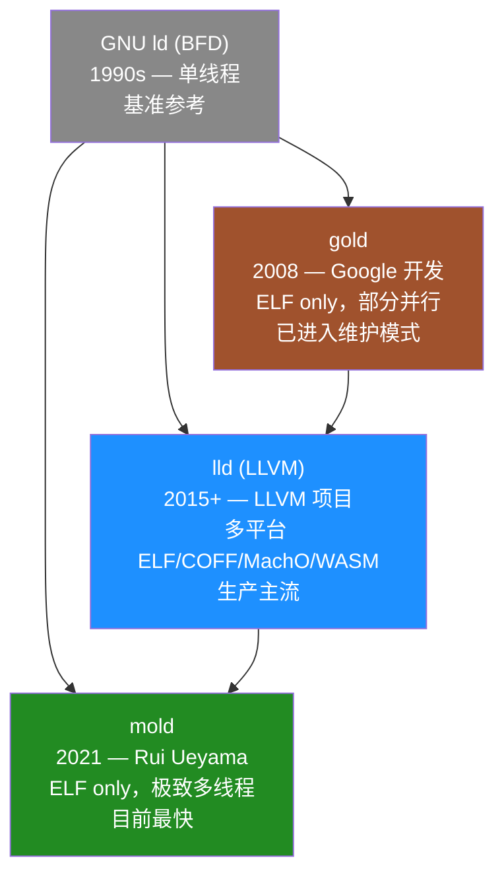

---
tags:
  - build-systems
  - tier3
  - 链接器
  - mold
---
# 增量链接器：mold 与 lld

> [!abstract] TL;DR
> 链接是大型 C/C++ 项目构建流水线的最后一道关卡，也是迭代编辑-构建-调试循环的最大延迟来源。传统 GNU ld（BFD 后端）单线程处理所有符号解析、重定位和 section 合并，在百万行级 C++ 项目中链接一次可耗时 30 秒至数分钟。lld 是 LLVM 项目的生产级并行链接器，速度比 GNU ld 快 3–8×，已成为 Android、Chrome、Firefox 等主流项目的标配。mold（Rui Ueyama，2021 年）更进一步，通过激进的多线程并行化将链接时间再压缩 2–5×，是目前最快的通用 ELF 链接器。本章系统讲解链接器的工作原理、各代链接器的架构演进、mold 的并行策略、ICF 优化、LTO 交互，以及在各构建系统中配置链接器的完整实战方法。

## 概述与定位

### 链接为何成为瓶颈

编译阶段（从 `.cpp` 到 `.o`）具有天然的文件级并行性，一台 32 核机器可以同时编译 32 个翻译单元。但链接阶段本质上是**全局合并**操作——所有目标文件（`.o`）和静态库（`.a`）必须被汇总到单个输出（可执行文件或共享库），这个过程高度串行：

1. **读取所有目标文件的符号表**：一个大型项目可能有数千个 `.o` 文件，合计数百 MB
2. **全局符号解析**：`main()` 引用 `foo()`，`foo()` 定义在另一个 `.o` 里——需要构建全局符号依赖图
3. **重定位（Relocation）处理**：将编译期无法确定的地址占位符替换为最终虚拟地址
4. **Section 合并**：把各 `.o` 的 `.text`、`.data`、`.rodata`、`.bss` 合并成输出文件的对应段
5. **生成输出文件**：写入 ELF/PE/Mach-O 格式头部，输出最终二进制

在调试构建（`-g`，含完整 DWARF 调试信息）场景下，输出文件体积可达数百 MB 甚至数 GB，纯 IO 就是瓶颈。而传统 GNU ld（BFD 后端）几乎全程单线程执行上述步骤，在现代多核 CPU 上严重浪费硬件资源。

### 链接器演化谱系



**GNU ld / BFD（Binary File Descriptor library）**：历史最悠久，支持最广泛的格式（ELF/PE/Mach-O/COFF/a.out 等），是各 Linux 发行版的默认链接器。单线程、内存管理粗放，在大型项目中性能极差，但作为基准和最高兼容性保证仍有地位。

**gold**：2008 年 Google 工程师 Ian Lance Taylor 开发，只支持 ELF，速度约为 GNU ld 的 2–4×。引入了 ICF（Identical Code Folding）和部分并行化，是 lld 出现之前的过渡方案。现已进入维护模式，不建议新项目采用。

**lld**：LLVM 子项目，支持 ELF、COFF（Windows PE）、Mach-O（macOS/iOS）和 WebAssembly 四种格式，是目前**跨平台覆盖面最广**的现代链接器。Android NDK、Chrome、Firefox、LLVM 工具链自身均使用 lld。速度比 GNU ld 快 3–8×，比 gold 快 2–3×。

**mold**：Rui Ueyama（lld 的主要作者之一）2021 年创作的新链接器，目标是"比 lld 再快 2–5×"，并已实现这一目标。仅支持 ELF（Linux/BSD 生态），Windows/macOS 版本以 sold 为分支单独维护。在大型 C++ 项目中，mold 可将链接时间从数十秒压缩到 1–2 秒。

### 链接速度与项目规模的关联

链接器性能对不同规模项目的影响差异悬殊：

| 项目规模 | GNU ld 链接时间 | lld 链接时间 | mold 链接时间 |
|---|---|---|---|
| 小型（10 万行，~500 `.o`） | 2–5 秒 | 0.5–1.5 秒 | 0.3–0.8 秒 |
| 中型（50 万行，~2000 `.o`） | 10–30 秒 | 3–8 秒 | 1–3 秒 |
| 大型（200 万行，~8000 `.o`） | 60–180 秒 | 15–40 秒 | 4–12 秒 |
| 超大型（Chrome/LLVM 量级） | 5–15 分钟 | 60–120 秒 | 15–40 秒 |

数据为 x86-64 Linux、NVMe 存储、32 核 CPU 场景下的典型值，实际因调试信息量、ICF 设置、符号可见性等有较大差异。

在**迭代开发（edit-compile-link-run）循环**中，开发者每次修改一个文件重新构建，编译阶段可能只需 1–5 秒（增量编译），但链接阶段依然是全量的（无论改了什么，链接器都要重新处理所有 `.o`）。因此链接速度对**开发体验**的影响远大于批量构建吞吐量。

## 原理与机制

### 链接器的核心工作流程

理解链接器性能优化的前提是清楚链接器做什么。以 ELF 格式为例，链接过程分为以下阶段：

#### 阶段 1：命令行解析与输入文件收集

链接器接收的输入通常是：
- 目标文件（`.o`）列表：编译阶段的直接输出
- 静态库（`.a`）列表：`ar` 打包的 `.o` 集合，按需提取成员
- 动态库（`.so`）：仅记录依赖，不复制内容到输出
- 链接脚本（`-T` 或默认内置脚本）：指定内存布局、段顺序

静态库成员的提取遵循**按需原则**：只有当某成员定义的符号被已加入图的目标文件引用时，该成员才被提取。这导致库的顺序在命令行上至关重要（循环依赖的库需要重复列出或用 `--start-group/--end-group` 包围）。

#### 阶段 2：符号解析（Symbol Resolution）

每个目标文件都有符号表，包含**定义（defined）**和**未定义（undefined）**符号。链接器构建全局符号表，将每个未定义符号与其他文件的定义匹配。

符号可见性和绑定类型决定解析行为：
- **GLOBAL 定义**：可被其他文件的未定义引用匹配，参与全局符号解析
- **LOCAL 定义**（`static` C 函数/变量）：不参与全局解析，各文件独立拥有
- **WEAK 符号**：可被同名 GLOBAL 符号覆盖，常用于可替换的默认实现
- **COMMON 符号**：未初始化全局变量的特殊形式，多个 `.o` 中的同名 COMMON 会被合并为一个

符号解析还需处理 C++ 特有问题：
- **符号名修饰（Name Mangling）**：C++ 函数签名编码进符号名，如 `_ZN3FooC1Ev` = `Foo::Foo()`
- **ODR（One Definition Rule）违反**：同一符号在多个 `.o` 中有定义，链接器行为因符号类型而异

#### 阶段 3：重定位（Relocation）

编译器在生成目标文件时，不知道其他符号的最终虚拟地址，因此用**占位符+重定位记录**描述地址引用：

```
重定位记录格式（ELF Rel/Rela）：
  offset:  在目标 section 中的偏移（需要修改的位置）
  type:    重定位类型（R_X86_64_PC32, R_X86_64_PLT32, R_AARCH64_CALL26, ...）
  symbol:  引用的符号（符号表索引）
  addend:  附加偏移量（Rela 格式特有）
```

链接器在确定所有符号的最终地址后，遍历所有重定位记录，计算目标地址并写入输出文件的对应位置。不同重定位类型对应不同的计算公式，例如：

```
R_X86_64_PC32:   *(uint32_t*)loc = S + A - P
  S = 符号绝对虚拟地址
  A = addend
  P = 重定位记录所在位置的运行时地址

R_X86_64_PLT32（调用共享库函数）:
  loc 指向 PLT stub 的偏移调用，运行时通过 PLT/GOT 动态解析
```

#### 阶段 4：Section 合并与布局

链接器将各 `.o` 文件的同名 section 合并：所有 `.o` 的 `.text` 合并为输出的 `.text`，所有 `.rodata` 合并为输出的 `.rodata`，以此类推。

合并后需要计算每个 section 在虚拟地址空间中的位置（layout），链接脚本决定布局规则：

```ld
/* 典型 ELF 可执行文件链接脚本片段 */
SECTIONS {
  . = 0x400000;          /* 加载地址起点 */
  .text : {
    *(.text.startup)     /* 启动代码优先 */
    *(.text .text.*)     /* 所有 .o 的 .text section */
  }
  . = ALIGN(4096);       /* 页对齐 */
  .data : {
    *(.data .data.*)
  }
  .bss : {
    *(.bss .bss.*)
    *(COMMON)
  }
}
```

#### 阶段 5：输出文件生成

按照最终布局，将所有内容写入输出文件，生成 ELF header、Program Headers（加载器用）、Section Headers（调试工具用）、DWARF 调试信息等。

调试构建的输出体积因 DWARF 信息而膨胀数倍：一个 Release 构建可能 5 MB，Debug 构建可能 200 MB，这直接影响写 IO 时间。

### 为何 GNU ld 慢：架构层面分析

GNU ld 的 BFD 库设计于 1990 年代，当时的多核 CPU 尚不存在，其架构决策导致现代场景下性能极差：

**单线程处理所有阶段**：每个阶段（符号解析→重定位→布局→IO）完全串行，完全无法利用多核。

**多次遍历输入文件**：为了正确处理符号依赖，BFD 对输入文件列表进行多次遍历，每次遍历都有 IO 开销。

**BFD 的间接层开销**：BFD 为支持数十种格式设计了抽象层，函数指针跳转、数据转换开销在热路径上积累可观。

**内存映射（mmap）使用有限**：大量依赖 `read()` 系统调用而非 mmap，无法利用内核页缓存的零拷贝优势。

**DWARF 处理串行**：调试信息的合并和处理是单线程的，而 DWARF 数据往往占链接输入的 60–70%。

### lld 的架构：可复用的现代基础

lld 由 Rui Ueyama 等人从零重写，吸取了 gold 的经验教训，设计时就以并发为目标：

**每种格式独立实现**：ELF lld、COFF lld、Mach-O lld 各自独立，共享工具类但不共享核心逻辑，避免了 BFD 式的巨大抽象层。

**两阶段设计**：第一阶段并行读取所有输入文件，第二阶段串行完成布局和输出（布局本质上有顺序依赖，无法完全并行）。

**积极使用 mmap**：用内存映射读取所有输入，利用操作系统页缓存减少 IO 系统调用次数。

**并行符号解析**：多线程并行处理各目标文件的符号表，最后合并全局符号表。

**合并版 ICF**：内置 ICF（见后文详解），进一步减少输出体积和重定位数量。

lld 的架构奠定了 mold 进一步优化的基础，Ueyama 在设计 mold 时受益于对 lld 每个性能瓶颈的深入理解。

### mold 的并行策略：极致多线程

mold 的设计理念是"链接速度与核心数线性扩展"，为此在每个可并行的阶段都引入了多线程：

#### 并行读取与解析输入文件

所有目标文件在打开后立即用 mmap 映射到内存，解析各自的 ELF header、symbol table、relocation table 是完全并行的——每个文件独立解析，无需同步：

```
Thread 1: parse foo.o → symbol table, rela sections
Thread 2: parse bar.o → symbol table, rela sections
Thread 3: parse baz.o → symbol table, rela sections
...（N 个线程同时处理 N 个文件）
```

解析完成后，用无锁哈希表（tbb::concurrent_hash_map 或自研无锁结构）合并全局符号表，减少加锁竞争。

#### 并行重定位处理

重定位记录处理是最耗 CPU 的阶段之一。mold 将输出 section 的地址计算完成后，对各目标文件的重定位记录并行处理：

```
已知各 section 的虚拟地址后：
Thread 1: 处理 foo.o 的所有 .rela.text 记录
Thread 2: 处理 bar.o 的所有 .rela.text 记录
...（各文件的重定位记录相互独立，可完全并行）
```

这里的关键洞察是：**重定位计算是纯读取+写入，写入目标各不相干（每个文件只修改自己 section 的内容），因此无需同步**。

#### 并行 DWARF 处理

调试信息（DWARF）的合并历来是链接器性能的硬骨头。mold 将 DWARF 的合并拆分为：
- `.debug_info`、`.debug_abbrev`、`.debug_line` 各自并行处理
- 地址引用（DW_FORM_addr）的修正（relocation）也在并行重定位阶段完成

这让调试构建的链接时间也显著缩短，而非只对 Release 构建有效。

#### 并行输出写入

输出文件通过 `ftruncate` + mmap 预先分配空间，各线程独立向对应的地址范围写入内容，最后 `munmap` 完成写入。这避免了传统 `write()` 调用的串行瓶颈，在 NVMe 存储上尤其有效。

#### 线程数与性能

mold 默认使用所有可用核心（`sysconf(_SC_NPROCESSORS_ONLN)`）。可通过 `--thread-count=N` 限制。实测加速曲线在 8–16 核后趋于平缓（受内存带宽和串行临界路径限制），但在 4–8 核上几乎完全线性扩展。

### 内存映射（mmap）策略

mold 大量使用 `mmap` 而非 `read()`，理由是：

1. **零拷贝**：内核直接将文件页映射到进程地址空间，无需从内核缓冲区拷贝到用户空间
2. **随机访问友好**：ELF 文件中各表之间有跳转引用，mmap 让随机访问无额外系统调用
3. **OS 页缓存复用**：多个文件的 mmap 可以共享内核页缓存，同一 `.o` 被多次构建时命中缓存
4. **输出文件预分配**：先确定输出体积，一次 `ftruncate` + mmap 分配，多线程并发写入不同区域

输出阶段的 mmap 并发写入是 mold 相比 lld 的关键优化：lld 仍然用顺序 `write()` 输出，而 mold 的多线程并发写入在 SSD 上可以充分利用设备的并行 IO 能力。

## 结构/算法/伪代码详解

### 符号解析算法

全局符号解析是链接器的核心算法。以下是简化的伪代码描述（mold/lld 的实际实现更复杂，涉及弱符号、版本化符号、visibility 等细节）：

```python
class Symbol:
    name: str
    defined_in: ObjectFile | None  # None = undefined
    binding: GLOBAL | WEAK | LOCAL
    visibility: DEFAULT | HIDDEN | PROTECTED
    section_idx: int
    value: int  # section 内偏移

# 全局符号表
symbol_table: dict[str, Symbol] = {}

# 第一步：并行解析各目标文件的符号表
def parse_symbols_parallel(object_files):
    # 各文件独立解析，结果存入 file.symbols
    parallel_for(object_files, lambda f: f.parse_elf_symbol_table())

# 第二步：合并到全局表（需要同步，但批量处理减少锁竞争）
def merge_symbols(object_files):
    for obj in object_files:
        for sym in obj.symbols:
            if sym.binding == LOCAL:
                continue  # LOCAL 不参与全局解析
            if sym.name not in symbol_table:
                symbol_table[sym.name] = sym
            else:
                existing = symbol_table[sym.name]
                if existing.defined_in is None and sym.defined_in is not None:
                    # 用定义覆盖未定义引用
                    symbol_table[sym.name] = sym
                elif existing.binding == WEAK and sym.binding == GLOBAL:
                    # GLOBAL 覆盖 WEAK
                    symbol_table[sym.name] = sym
                elif existing.defined_in and sym.defined_in:
                    # 两个定义冲突 → 错误（ODR 违反）
                    if sym.binding != WEAK:
                        error(f"duplicate symbol: {sym.name}")

# 第三步：检查未解析符号
def check_undefined():
    for name, sym in symbol_table.items():
        if sym.defined_in is None:
            # 检查是否在共享库中定义（.so 中的符号视为已定义）
            if not in_shared_lib(name):
                error(f"undefined reference to '{name}'")
```

实际链接器还需处理：弱符号在共享库中的特殊行为、`--allow-multiple-definition`、`--unresolved-symbols=ignore-all`、版本化符号（`@GLIBC_2.5`）等边界情况。

### ICF：相同代码折叠

**ICF（Identical Code Folding）** 是链接器层面的代码体积优化技术：如果两个函数（或只读数据）的**内容完全相同**（字节级一致，且重定位目标也相同），则将它们合并为同一地址，消除重复。

C++ 模板展开是 ICF 的主要应用场景。`std::vector<int>::push_back()` 和 `std::vector<long>::push_back()` 如果编译后的机器码完全相同（在某些平台/优化级别下可能发生），ICF 可将它们合并为一个函数体，多处调用点指向同一地址。

#### ICF 算法（迭代哈希法）

ICF 的朴素实现是比较所有 section 对的字节内容，复杂度 O(N²)，不可接受。现代链接器使用**迭代哈希（iterative hashing）**算法，类似图同构问题的分配着色（partition refinement）：

```python
def icf(sections):
    # 初始分组：按原始字节内容哈希分组
    # 注意：含重定位的位置用占位符替代（地址依赖于 ICF 结果，无法预知）
    def initial_hash(sec):
        content = sec.raw_bytes_with_relocations_zeroed()
        return hash(content) ^ hash(sec.size) ^ hash(sec.flags)

    groups = group_by(sections, initial_hash)

    # 迭代细化：重定位目标所在分组也纳入哈希
    for iteration in range(MAX_ITER):
        changed = False
        def refined_hash(sec):
            rela_hashes = tuple(
                (rel.type, rel.addend, group_id_of(rel.target_section))
                for rel in sec.relocations
            )
            return hash((sec.raw_hash, rela_hashes))

        new_groups = group_by(sections, refined_hash)
        if new_groups == groups:
            break  # 收敛
        groups = new_groups
        changed = True

    # 同组的 section 视为等价，保留一个，其余重定向到保留的那个
    for group in groups.values():
        if len(group) > 1:
            canonical = group[0]
            for sec in group[1:]:
                sec.merged_into = canonical
```

迭代次数通常在 2–5 次内收敛。ICF 对 Release 构建的体积减少效果显著（Chrome 使用 ICF 后减少约 10% 体积），对调试构建则会使符号地址混乱（多个函数名指向同一地址），影响调试体验。

#### ICF 的正确性边界

ICF 引入了一个语义问题：如果程序通过**函数指针比较**判断两个函数是否"相同"（`&foo == &bar`），ICF 合并后比较结果变为 true，可能改变程序行为。C++ 标准没有保证函数指针比较的唯一性（除了实体成员函数），但实际代码可能依赖这种假设。

因此链接器提供了两种 ICF 模式：
- `--icf=safe`：只折叠链接器可以静态证明不存在函数指针比较的代码（保守，效果有限）
- `--icf=all`：折叠所有相同代码（激进，可能影响极少数依赖函数地址唯一性的程序）

mold 和 lld 都支持这两种模式，gold 只实现了 `--icf=safe`。

### LTO 与链接器的交互

**LTO（Link-Time Optimization，链接时优化）**是编译器在链接阶段执行跨文件优化的技术，代表了与普通链接完全不同的工作模式。

#### 普通链接 vs LTO

```
普通构建：
foo.cpp → clang -c → foo.o（机器码）──┐
bar.cpp → clang -c → bar.o（机器码）──┤ → lld/mold → 可执行文件
baz.cpp → clang -c → baz.o（机器码）──┘
（链接器只做符号解析+重定位，不做代码优化）

LTO 构建：
foo.cpp → clang -flto -c → foo.bc（LLVM IR）──┐
bar.cpp → clang -flto -c → bar.bc（LLVM IR）──┤ → lld --lto → 可执行文件
baz.cpp → clang -flto -c → baz.bc（LLVM IR）──┘
（链接器读取 IR，将所有 IR 合并后运行 LLVM 优化 pass，再生成最终机器码）
```

LTO 让编译器看到跨文件的调用关系，可以做内联、常量传播、死代码消除等原本无法做的优化，通常提升 5–15% 的运行时性能，并缩减 5–20% 的二进制体积。

#### Full LTO vs Thin LTO

**Full LTO** 把所有 IR 合并为一个大模块，在单进程中优化，可以做最彻底的全局分析。缺点是内存占用极大（数 GB）、不可并行，构建时间极长（比普通构建慢数倍到数十倍）。

**Thin LTO**（LLVM 发明）是关键改进：

```
Thin LTO 两阶段流程：
阶段 1（并行摘要生成）：
  各 .bc 文件生成 module summary（函数签名、调用图摘要）
  → 汇总为全局摘要索引

阶段 2（并行后端编译）：
  每个模块独立运行后端编译：
  - 读取全局摘要（非常小）
  - 只导入本模块需要内联的其他模块的函数定义
  - 运行优化+代码生成（完全并行）
```

Thin LTO 获得约 80% Full LTO 的优化收益，但构建时间仅比普通 LTO 慢 20–50%（而非数倍）。mold 和 lld 都完整支持 Thin LTO；Full LTO 则不受益于链接器并行化（优化本身是瓶颈）。

#### LTO 阶段与最终链接的职责划分

使用 LTO 时，mold/lld 作为链接驱动（linker driver）：
1. 识别输入中的 `.bc`（LLVM IR）文件
2. 调用 `libLTO` 或 ThinLTO 后端生成本地目标文件（`.o`）
3. 将生成的 `.o` 与其余普通 `.o` 一起进行最终链接

最终链接阶段（步骤 3）仍然受益于 mold 的并行化；而 Thin LTO 的后端编译（步骤 2）也是并行的。因此 mold + Thin LTO 可以在获得 LTO 优化收益的同时，最大化构建并行度。

### DWARF 分离与 .dwp 文件

大型 C++ 项目的调试信息体积远超代码本身。现代工具链提供两种压缩策略：

**`.dwo` + `.dwp`（DWARF Package）**：

编译时加 `-gsplit-dwarf`，编译器将调试信息分离为：
- `.o` 文件保留最小骨架（skeleton CU）
- `.dwo` 文件包含完整 DWARF（与 `.o` 同目录，但不参与链接）

链接器只链接骨架，输出文件极小；调试时 GDB/LLDB 按需加载 `.dwo`。

`llvm-dwp` 将散落的 `.dwo` 打包为 `.dwp`（DWARF Package），便于部署：

```bash
# 编译时分离调试信息
clang++ -c -gsplit-dwarf -g -O0 foo.cpp -o foo.o
# foo.o（骨架）+ foo.dwo（调试信息）

# 链接（只处理骨架，速度快得多）
mold -o app $(ls *.o)

# 打包所有 .dwo
llvm-dwp $(ls *.dwo) -o app.dwp

# GDB 调试（自动查找 .dwp）
gdb ./app
```

分离 DWARF 后，链接阶段的 IO 量大幅减少（链接器不再处理大量 DWARF），mold 的速度优势进一步放大。

## 工具视角与实战

### 指定链接器：-fuse-ld 与 --ld-path

编译器驱动（`clang`/`gcc`）控制最终链接步骤时调用哪个链接器，通过以下标志切换：

```bash
# 使用 lld
clang++ -fuse-ld=lld -o app *.o

# 使用 mold（需要 mold 在 PATH 中）
clang++ -fuse-ld=mold -o app *.o

# 使用 mold（指定绝对路径，不依赖 PATH）
clang++ -fuse-ld=/usr/local/bin/mold -o app *.o

# GCC 替代语法（GCC 12+ 支持 -fuse-ld=mold）
g++ -fuse-ld=mold -o app *.o
```

`-fuse-ld` 的参数有两种解析方式：
- 内置名称（`lld`、`gold`、`bfd`）：编译器在系统 PATH 中按约定名称查找
- 路径（以 `/` 或 `./` 开头）：直接使用指定路径

mold 还提供了 `mold -run` 封装器，无需修改编译标志：

```bash
# 让 mold -run 拦截子命令的链接调用
mold -run cmake --build build
mold -run make -j$(nproc)
mold -run cargo build
```

`mold -run` 通过设置 `LD_PRELOAD` 和环境变量劫持系统链接器调用，对构建系统完全透明，适合快速验证 mold 的加速效果而无需修改构建配置。

### CMake 配置链接器

CMake 通过 `CMAKE_EXE_LINKER_FLAGS`、`CMAKE_SHARED_LINKER_FLAGS` 或 `CMAKE_LINKER` 控制链接器选择：

```cmake
# 方法 1：通过编译器标志传递 -fuse-ld（推荐）
# 在 CMakeLists.txt 中
if (CMAKE_CXX_COMPILER_ID MATCHES "Clang|GNU")
    # 检测 mold 是否可用
    find_program(MOLD_LINKER mold)
    if (MOLD_LINKER)
        add_link_options(-fuse-ld=mold)
        message(STATUS "Using mold linker: ${MOLD_LINKER}")
    else()
        find_program(LLD_LINKER ld.lld lld)
        if (LLD_LINKER)
            add_link_options(-fuse-ld=lld)
            message(STATUS "Using lld linker")
        endif()
    endif()
endif()
```

```cmake
# 方法 2：直接设置 CMAKE_LINKER（CMake 3.29+，更现代）
set(CMAKE_LINKER_TYPE MOLD)  # 或 LLD, GOLD, BFD

# 方法 3：命令行传入
# cmake -B build -DCMAKE_EXE_LINKER_FLAGS="-fuse-ld=mold" ..
```

```cmake
# 方法 4：工具链文件（交叉编译时常用）
# toolchain.cmake
set(CMAKE_EXE_LINKER_FLAGS_INIT "-fuse-ld=lld")
set(CMAKE_SHARED_LINKER_FLAGS_INIT "-fuse-ld=lld")
```

启用 ICF 的 CMake 配置：

```cmake
# Release 构建启用 ICF（lld/mold 均支持）
if (CMAKE_BUILD_TYPE STREQUAL "Release")
    add_link_options(-fuse-ld=mold -Wl,--icf=all)
endif()
```

启用 Thin LTO + mold：

```cmake
include(CheckIPOSupported)
check_ipo_supported(RESULT IPO_SUPPORTED OUTPUT IPO_ERROR)
if (IPO_SUPPORTED)
    set_property(TARGET myapp PROPERTY INTERPROCEDURAL_OPTIMIZATION TRUE)
    # Thin LTO（clang 默认）
    add_compile_options(-flto=thin)
    add_link_options(-flto=thin -fuse-ld=mold)
endif()
```

### Bazel 配置链接器

Bazel 通过 `--linkopt` 或工具链配置传递链接器选项：

```bash
# 命令行方式（临时）
bazel build //myapp \
    --linkopt=-fuse-ld=mold \
    --linkopt=-Wl,--icf=safe

# 或写入 .bazelrc 持久化
build --linkopt=-fuse-ld=lld
build:release --linkopt=-Wl,--icf=all
```

在自定义 C++ 工具链配置中，通过 `feature` 声明链接器选择：

```python
# tools/cpp/BUILD（自定义工具链）
cc_toolchain_config(
    name = "linux_aarch64_config",
    linker_flags = [
        "-fuse-ld=lld",
        "-Wl,--icf=safe",
    ],
    ...
)
```

### Cargo / Rust 配置链接器

Rust 项目通过 `.cargo/config.toml` 配置链接器：

```toml
# .cargo/config.toml

# Linux 使用 mold
[target.x86_64-unknown-linux-gnu]
linker = "clang"
rustflags = ["-C", "link-arg=-fuse-ld=mold"]

# 或者（需要 mold 在 PATH 中）
[target.x86_64-unknown-linux-gnu]
linker = "mold"

# macOS 使用 lld（通过 sold，mold 的 macOS 分支）
[target.x86_64-apple-darwin]
linker = "clang"
rustflags = ["-C", "link-arg=-fuse-ld=lld"]
```

Rust 的 `cc` crate（构建脚本中链接 C 代码）也会使用相同的链接器配置，无需单独设置。

对于 cargo workspace，`.cargo/config.toml` 放在 workspace 根目录生效：

```toml
# workspace/.cargo/config.toml
[build]
# 全局默认目标使用 mold
rustflags = ["-C", "link-arg=-fuse-ld=mold"]
```

### Meson 配置链接器

Meson 通过 `b_lto` 选项和链接参数控制：

```ini
# native file 或 cross file 中指定链接器
[properties]
# 通过 c_link_args 传递 -fuse-ld
c_link_args = ['-fuse-ld=mold']
cpp_link_args = ['-fuse-ld=mold']
```

或在 `meson_options.txt` / 命令行中：

```bash
meson setup builddir \
    -Db_lto=true \
    -Db_lto_mode=thin \
    -Dc_link_args="-fuse-ld=mold" \
    -Dcpp_link_args="-fuse-ld=mold" \
    --buildtype=release
```

### 各平台链接器支持矩阵

| 平台 | GNU ld | gold | lld | mold |
|---|---|---|---|---|
| Linux ELF (x86-64) | 完整 | 完整 | 完整 | 完整 |
| Linux ELF (AArch64) | 完整 | 完整 | 完整 | 完整 |
| Linux ELF (RISC-V) | 完整 | 部分 | 完整 | 完整 |
| macOS Mach-O | 仅 ld64 | 不支持 | 完整（ld64.lld）| sold（分支） |
| Windows PE/COFF | 仅 MinGW | 不支持 | 完整（lld-link）| 不支持 |
| WebAssembly | 不支持 | 不支持 | 完整（wasm-ld）| 不支持 |
| Android (NDK) | 遗留 | 遗留 | **默认** | 可选 |

**结论**：需要 Linux-only 极速的场景选 mold；需要跨平台统一的场景选 lld；macOS 优先用系统 ld64 或 lld 的 Mach-O 后端。

### 实测性能数据

以下为社区公开基准数据（2023–2024，调试构建，32 核 x86-64，NVMe SSD）：

| 项目 | GNU ld | gold | lld | mold |
|---|---|---|---|---|
| LLVM（调试） | 131 秒 | 72 秒 | 28 秒 | **8 秒** |
| Chrome（调试） | - | 110 秒 | 40 秒 | **12 秒** |
| Mozilla Firefox | 96 秒 | 48 秒 | 25 秒 | **7 秒** |
| clang 本身 | 64 秒 | 38 秒 | 14 秒 | **4 秒** |
| 典型 Qt 应用（50万行）| 45 秒 | 25 秒 | 9 秒 | **2.5 秒** |

数据来源：mold 官方 README、lld benchmarks、社区测试博客；具体数值因硬件和项目配置不同而有差异，仅供量级参考。

`mold -run make -C llvm/build` 与 `make -C llvm/build`（使用默认 GNU ld）的对比：在 LLVM 全量调试构建中，仅切换链接器即可将 `ninja all` 的总时间从约 25 分钟降低到约 18 分钟（节省约 28%，因为编译阶段时间不变，仅链接时间缩短）。

## 安全性与正确使用

### 链接器选择对构建确定性与可复现的影响

**可复现构建（Reproducible Builds）**要求相同输入总产生相同输出。链接器的确定性影响体现在：

**输出布局的确定性**：同一链接器在相同输入下应生成字节级相同的输出。lld 和 mold 都承诺单次确定性（相同输入 → 相同输出），但**并发导致的非确定性**是潜在风险：

- lld 和 mold 的并行处理对于 section 合并顺序有严格规定（按命令行输入顺序合并），多线程仅加速处理，不影响最终布局顺序。
- 全局符号表的合并顺序由输入文件顺序决定，而非线程调度顺序，因此输出是确定的。

**ASLR 与 PIE 的兼容性**：mold 完整支持 `-pie`（Position Independent Executable）和 `-shared`，对 ASLR 友好的构建无影响。

**跨链接器可复现性**：GNU ld、lld、mold 生成的输出虽然语义等价，但字节级并不相同（section 对齐、PLT 生成策略等有差异）。若需要跨构建环境的完全一致性，应在所有环境使用相同链接器版本。

可通过 `diffoscope` 工具比较两次构建输出的差异，定位非确定性来源：

```bash
diffoscope build1/app build2/app
# 输出：哪些 section/函数/符号的字节内容不同
```

### ICF 对调试体验的影响

ICF 将多个不同名称的函数合并为同一地址，对调试造成以下影响：

1. **栈回溯（backtrace）地址歧义**：同一 PC 值可能对应多个函数名，GDB/LLDB 只能选择其中一个显示，可能显示"错误"的函数名
2. **断点设置混淆**：在函数名上设置断点时，ICF 合并后的函数被所有原始函数名触发
3. **DWARF 信息部分失效**：ICF 后的 section 可能包含多个函数的 DWARF DIE 指向同一地址范围，调试器行为未定义

**建议**：在 Debug 构建（`CMAKE_BUILD_TYPE=Debug`）中禁用或使用 `--icf=safe` 而非 `--icf=all`；仅在 Release / RelWithDebInfo 构建中启用激进 ICF。

```cmake
# Debug 不启用 ICF，Release 启用
target_link_options(myapp PRIVATE
    $<$<CONFIG:Release>:-Wl,--icf=all>
    $<$<CONFIG:Debug>:>    # Debug 不传 --icf
)
```

### 链接器选择对 DWARF 信息完整性的影响

不同链接器对 DWARF 5 vs DWARF 4 的支持程度不同：

- **GNU ld**：DWARF 4 支持完整，DWARF 5 支持有限（取决于 binutils 版本）
- **lld**：DWARF 4/5 完整支持，`.dwo`/`.dwp` 支持完整
- **mold**：DWARF 4/5 完整支持，`.dwo`/`.dwp` 支持完整（mold 1.4+ 版本）

在使用 Clang 15+ 默认生成 DWARF 5 的场景下，应确保 mold/lld 版本足够新（mold 1.4+，lld 15+）。GCC 12+ 默认 DWARF 5，若搭配老版本 mold，可通过 `-gdwarf-4` 降级。

### 版本兼容性与分发考虑

mold 以 AGPL v3 发布（开源项目免费，闭源项目需商业授权）；lld 以 Apache 2.0 with LLVM exception 发布（商业可用无限制）。在闭源项目的 CI 环境中，需注意 mold 的许可证。mold 提供商业许可版本（mold 2.x+）解决 AGPL 问题。

`sold`（mold 的 macOS/Mach-O 分支）以相同许可证发布。若团队同时开发 Linux 和 macOS 平台，需分别配置 mold（Linux）和 sold/lld（macOS）。

## 小结

链接器是构建工具链中演进最缓慢但影响最大的环节之一。从 GNU ld 的单线程 BFD 架构，到 gold 的初步并行化，到 lld 的现代化多格式实现，再到 mold 的极致并行，这一演化脉络展示了"已知工作流的并行化改造"可以在不改变语义的前提下带来数量级的性能提升。

对大型 C/C++ 项目而言，将链接器从 GNU ld 切换到 mold 是成本最低、收益最大的单点优化之一：通常只需一行构建配置变更（`-fuse-ld=mold`），无需修改代码，即可将链接时间压缩到原来的 1/10 甚至更少，从根本上改善调试循环中开发者的等待体验。

lld 在跨平台（Linux/macOS/Windows/WASM）场景下是唯一覆盖所有主流格式的现代链接器，也是 Android NDK、Chrome、Firefox 等主流开源项目的生产选择。mold 则在 Linux-only 场景下提供最极致的链接速度，适合以 Linux 为主要开发和部署平台的团队。

ICF 是链接器提供的体积优化，在 Release 构建中值得开启；但需注意对调试体验的影响，应在 Debug 构建中禁用。LTO 与 mold 的配合（Thin LTO + mold 最终链接）可以同时获得跨文件优化收益和极速链接，是 Release 构建的最优组合。

## 相关阅读

- [[05.Ninja|← 第 05 篇：Ninja 构建后端]] — 链接动作在构建图中的表达与调度
- [[03.CMake|← 第 03 篇：CMake]] — `CMAKE_EXE_LINKER_FLAGS`、工具链配置
- [[04.Bazel|← 第 04 篇：Bazel]] — `--linkopt` 与自定义 C++ 工具链
- [[08.Cargo与Rust|← 第 08 篇：Cargo]] — `.cargo/config.toml` 链接器配置
- [[10.增量构建与缓存|← 第 10 篇：增量构建]] — 增量构建为何无法消除链接瓶颈
- [[13.构建系统性能优化|← 第 13 篇：性能优化]] — 链接器选择在整体优化策略中的位置
- [[18.交叉编译与Sysroot|← 第 18 篇：交叉编译]] — 交叉链接器（`aarch64-linux-gnu-ld`）与 lld 的交叉支持
- mold 官方仓库：https://github.com/rui314/mold
- lld 文档：https://lld.llvm.org/
- Rui Ueyama《mold：一个现代链接器》：https://www.sigops.org/s/conferences/hotos/2021/papers/hotos21-s01-ueyama.pdf
- ICF 详解（gold 设计文档）：https://sourceware.org/binutils/wiki/ICF
- Thin LTO 设计：https://clang.llvm.org/docs/ThinLTO.html
- Reproducible Builds：https://reproducible-builds.org/docs/linkers/
- DWARF 5 规范：https://dwarfstd.org/dwarf5std.html

---

[[00.构建系统横向对比总览|⬆ 系列总览]] | [[21.Bzlmod迁移|← 上一章]]
