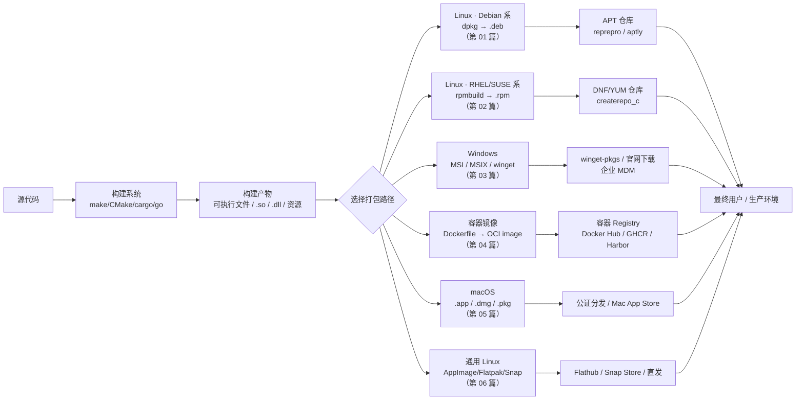
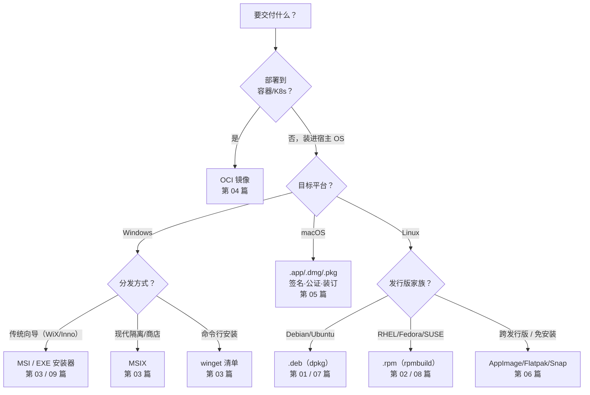

---
tags:
  - packaging
  - distribution
  - tools
  - tier3
created: 2026-07-02
---
# 打包与分发总览

打包与分发是软件交付流水线中「构建之后、部署之前」的最后一公里：把编译产物（可执行文件、共享库、配置、资源、文档）转化为目标平台能**识别、校验、安装、升级、回滚、卸载**的分发单元，并通过某种渠道送达用户。本系列横向讲透主流打包路径的**原生底层机制**——Debian 系 `.deb`（dpkg）、RHEL/SUSE 系 `.rpm`（rpmbuild）、Windows 安装包（MSI/MSIX/WiX/winget/Inno Setup）、容器镜像（Docker/OCI）、macOS（.app/.dmg/.pkg + 公证）、以及跨发行版通用格式（AppImage/Flatpak/Snap）——不停留在「点一下打包按钮」，而是讲清每种格式的字节结构、依赖模型、脚本时机、签名与建仓；并为 deb、RPM spec、Inno Setup 三条路线各配一篇**参数/语法参考册**（07/08/09）。

本系列与既有两个系列互补，边界清晰：

- **对比 `42.Cmake`（CPack 进阶打包）**：CPack 是**打包前端**，它读取 `install()` 规则再路由到 DEB/RPM/NSIS/WIX 生成器；本系列讲这些格式**被 CPack 封装之前的原生工具链**（`dpkg-buildpackage`、`rpmbuild`、`wix build`），理解了原生机制，才能读懂 CPack 生成的包为何长那样、出问题时如何手工修。
- **对比 `46.构建系统横向对比`（尤其 19.容器化构建 BuildKit）**：构建系统负责「源码→二进制」，本系列负责「二进制→可交付物」；46/19 从**构建引擎内部**（LLB DAG、缓存键、buildx）讲 Docker，本系列第 04 篇从**打包与分发**角度讲镜像（作为分发格式的 OCI 结构、registry 分发、tag 策略、镜像签名），两者正交、互引不重复。

---

## 打包与分发全景

打包路径的选择不是「随便挑一个」，而是由**目标运行环境**倒推：装进宿主操作系统（原生包）还是随身携带整个运行环境（镜像）？面向哪个发行版家族？是否要进系统包管理器的依赖图？

---

## 系列章节目录

| 序号 | 章节 | 核心主题 |
|------|------|----------|
| 00 | [[00.打包与分发总览]] | 打包路径全景、格式选型决策、与 42/46 的边界 |
| 01 | [[01.Linux原生打包-dpkg与deb]] | `.deb` 结构、`debian/` 目录、维护者脚本六态、`dpkg-buildpackage`、lintian、APT 建仓、GPG 签名 |
| 02 | [[02.Linux原生打包-rpmbuild与rpm]] | `.rpm` 结构、NEVRA、`.spec` 全解、脚本片段 `$1` 语义、mock、`createrepo_c`、GPG 签名 |
| 03 | [[03.Windows应用打包]] | MSI/MSIX 机制、WiX v4/v5、winget 清单、Authenticode/signtool 签名、选型 |
| 04 | [[04.Docker与OCI镜像打包]] | OCI 镜像结构、registry 分发、面向打包的 Dockerfile、基镜像选型、tag 策略、cosign 签名、SBOM |
| 05 | [[05.macOS应用打包]] | .app/.dmg/.pkg、codesign 硬化运行时、notarytool 公证 + stapler、Gatekeeper |
| 06 | [[06.通用Linux打包]] | AppImage / Flatpak(Flathub) / Snap(Store)：跨发行版格式与三种沙箱模型 |
| 07 | [[07.deb打包参数与语法详解]] | control/rules/debhelper/changelog 字段 + dpkg-buildpackage/dpkg-deb 选项参考册 |
| 08 | [[08.RPM-spec语法完整参考]] | preamble/段/%files 标记/脚本片段/宏/子包/rpmbuild 选项参考册 |
| 09 | [[09.InnoSetup脚本语法参考]] | Inno Setup section/指令/常量/[Code]/ISCC/静默参数参考册 |

---

> [!tip] 学习建议
> **推荐路径**：
> 1. 先扫本篇建立「格式↔平台↔渠道」的三维认知，用决策流图定位你的场景
> 2. Linux 服务端最常用：**01（deb）** 或 **02（rpm）** 按你的目标发行版二选一深读；两篇结构对称，读完一篇再读另一篇会很快
> 3. 桌面/客户端交付 Windows：直接看 **03**，重点在 MSI vs MSIX 选型与代码签名
> 4. 云原生/微服务：**04（OCI 镜像）** 是主线，配合 [[../46.构建系统横向对比/19.容器化构建BuildKit|46 系列第 19 篇]] 理解构建引擎内部
> 5. macOS 桌面应用：**05** 的「签名 → 公证 → 装订」链是 App Store 外分发的硬门槛；想「一份产物跑遍所有 Linux 发行版」看 **06（AppImage/Flatpak/Snap）**
> 6. 要逐字段/逐选项查语法时，用三篇**参考册**：**07（deb）**、**08（RPM spec）**、**09（Inno Setup）**——分别是 01/02/03 的深度延伸
> 7. 若你已在用 CMake，可先读 [[../42.Cmake/24 - CPack 进阶打包|42 系列 CPack 篇]] 了解「封装层」，再回本系列补「原生底层」——两者对照理解最快
>
> **贯穿全系列的四个共性主题**（每篇都会出现，可横向对比）：依赖声明模型、安装/升级/卸载的脚本时机、可再定位/可复现构建、包签名与供应链信任。

---

## 导航

[[../46.构建系统横向对比/00.构建系统横向对比总览|← 46. 构建系统横向对比]] | [[01.Linux原生打包-dpkg与deb|01. Linux 原生打包（dpkg 与 deb）→]]
