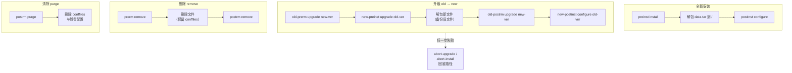

---
tags:
  - packaging
  - tier3
  - linux
  - debian
  - dpkg
  - deb
---
# Linux 原生打包：dpkg 与 .deb

> [!abstract] TL;DR
> `.deb` 是 Debian/Ubuntu 系的二进制包格式，本质是一个 **`ar` 归档**，内含三个成员：`debian-binary`（格式版本）、`control.tar.*`（元数据 + 维护者脚本）、`data.tar.*`（要落地到 `/` 的真实文件）。`dpkg` 是**底层单包管理器**（安装一个 `.deb`，不解析依赖、不下载），`apt` 是**上层**（解析依赖图、从仓库下载、再调用 dpkg）。原生打包的核心是写好 **`debian/` 目录**（`control` 声明依赖、`rules` 用 `dh` 时序驱动构建、`changelog` 是版本唯一真相源），用 `dpkg-buildpackage`/`debuild` 产出包；难点在**维护者脚本的六态调用流**（`preinst`/`postinst`/`prerm`/`postrm` 在装/升/删/清各阶段以不同参数被调用，必须幂等且处理 `abort-*` 回滚），以及 `dh_shlibdeps` 自动生成的 `${shlibs:Depends}` 依赖。分发靠 `reprepro`/`aptly` 建带 GPG 签名的 APT 仓库。

## 概述与定位

要理解 Debian 打包，第一件事是把 **`dpkg` 和 `apt` 分清楚**——它们不是一个东西，而是分层协作的两层。`dpkg` 是「底层包管理器」，它的世界里只有一个个孤立的 `.deb` 文件：给它一个 `.deb`，它就把里面的文件解开、注册到数据库、运行脚本；但它**不会**去解析依赖、不会去网络下载缺失的库，如果依赖没装好，它只会把包置于「已解包但未配置」的半吊子状态然后报错。`apt`（以及 `apt-get`/`aptitude`）是「上层包管理器」，它做的是 dpkg 不做的那部分：从 `sources.list` 配置的仓库拉取包索引、求解满足 `Depends` 关系的完整安装集、按拓扑序下载所有 `.deb`、再逐个交给 `dpkg` 去实际安装。这个分层和 RHEL 世界的 `rpm`（底层）vs `dnf`（上层）完全同构——记住这个类比，第 02 篇会反复用到。

`.deb` 有两种「包」需要区分：**二进制包**（`.deb`，最终分发给用户、直接安装的产物）和**源码包**（`.dsc` 元数据 + `.orig.tar.*` 上游源码 + `.debian.tar.*` 打包修改，三件套，用于在构建服务器上从源码构建出二进制包，也是上传到 Debian/PPA 的形式）。本篇聚焦**如何产出二进制 `.deb`**，但走的是**规范的源码包工作流**（`dpkg-buildpackage`）——因为这条路径产出的包才符合 Debian Policy、才能进 PPA、才能被 `sbuild`/`pbuilder` 在干净环境里重现构建。

**什么时候用原生打包，什么时候用 CPack？** 如果只是给内部工具打个能 `apt install` 的包，[[../42.Cmake/24 - CPack 进阶打包|CPack 的 DEB 生成器]]足够——它读 `install()` 规则直接吐 `.deb`。但一旦你需要：进 Debian/Ubuntu 官方仓库或 PPA、复杂的维护者脚本（建用户、注册 systemd 服务、迁移配置）、精确的符号级依赖、multiarch 共存、通过 `lintian` 的政策检查——就必须用原生 `debian/` + `debhelper` 工作流。CPack 本质是在这套原生机制之上包了一层薄封装，理解了底层，才知道 CPack 生成的包为何长那样、出了问题去哪儿改。

## 原理与机制

### `.deb` 文件的物理结构

一个 `.deb` 文件是标准 Unix `ar` 归档（不是 tar！），可以直接用 `ar` 拆开：

```console
$ ar t hello_1.0-1_amd64.deb
debian-binary
control.tar.zst
data.tar.zst
```

三个成员**顺序固定**（dpkg 依赖此顺序快速读取元数据而不解全包）：

1. **`debian-binary`**：一个只含 `2.0\n` 的文本文件，声明 `.deb` 格式版本。三十年来一直是 `2.0`。
2. **`control.tar.*`**（`.gz`/`.xz`/`.zst`）：**元数据区**。解开后是一组控制文件——`control`（包名、版本、依赖、描述等，一行行 `字段: 值`）、`md5sums`（每个已安装文件的校验和）、`conffiles`（哪些文件是「配置文件」，升级时特殊对待）、以及维护者脚本 `preinst`/`postinst`/`prerm`/`postrm`、`triggers`、`shlibs`/`symbols`。
3. **`data.tar.*`**：**数据区**。就是要落地到目标系统的文件树，路径相对于 `/`——比如 `./usr/bin/hello`、`./usr/share/doc/hello/changelog.Debian.gz`。安装 = 把这棵树解到 `/`。

这个结构的精妙在于「元数据与数据分离」：dpkg 可以只解 `control.tar` 就知道包名、版本、依赖，无需触碰可能几百 MB 的 `data.tar`。压缩算法从早期的 gzip 演进到 xz，Debian 12 / Ubuntu 21.10 起默认 **zstd**（解压快、压缩率好，对大规模镜像分发的解压时间影响显著）。

### dpkg 数据库与包状态机

dpkg 在 `/var/lib/dpkg/` 维护整个系统的包状态：

- **`status`**：核心数据库，记录每个已知包的完整 control 字段 + 当前状态。
- **`info/`**：每个包一组文件——`<pkg>.list`（该包安装了哪些文件，`dpkg -L` 就读它）、`<pkg>.md5sums`、`<pkg>.conffiles`、`<pkg>.postinst` 等（维护者脚本的落地副本）。
- **`available`**：可用包索引（历史遗留，apt 有自己的 `/var/lib/apt/lists/`）。

`dpkg -l` 输出每行开头的两/三个字母是包的**状态编码**，理解它对排障至关重要。它由三段组成：**期望状态**（Desired：`i`=install、`h`=hold、`r`=remove、`p`=purge、`u`=unknown）、**当前状态**（Status：`i`=installed、`c`=config-files 仅剩配置、`u`=unpacked 已解包未配置、`f`=half-configured、`h`=half-installed、`W`/`t`=触发相关）、**错误标志**。所以常见的 `ii` 表示「期望装、已装好」；`rc` 表示「已删但配置文件还在」（purge 才会清掉）；`iU` 表示「期望装、但只解包没配置」——这通常就是依赖没满足、`postinst configure` 没跑成功的现场。

### 依赖关系模型

Debian 的依赖字段远比「A 依赖 B」丰富，每个都有精确语义（写在二进制包的 `control` 里）：

| 字段 | 语义 |
|---|---|
| `Depends` | 硬依赖。被依赖包必须先**配置完成**，本包才能配置。 |
| `Pre-Depends` | 更强：被依赖包必须先**完全安装配置好**，本包才能开始**解包**。用于 `preinst` 就要用到的东西，慎用。 |
| `Recommends` | 强建议。apt 默认安装，但可关闭；不满足不阻止安装。 |
| `Suggests` | 弱建议。默认不装，仅提示。 |
| `Enhances` | 反向 Suggests：声明「本包增强了某包」。 |
| `Breaks` | 本包与某版本的目标包**不能同时处于配置状态**（但可短暂共存于解包阶段）。 |
| `Conflicts` | 更强的互斥：两包不能同时解包，必须先删一个。 |
| `Replaces` | 声明本包接管另一包的某些文件（配合 Breaks/Conflicts 做文件所有权转移或包改名）。 |
| `Provides` | 提供一个**虚拟包**名（如多个 MTA 都 `Provides: mail-transport-agent`）。 |

版本关系用 `(>= 1.2)`、`(<< 2.0)`（严格小于）、`(= 1.2-1)` 等。改包名、拆包、文件从 A 移到 B 时，经典手法是 **Replaces + Breaks（或 Conflicts）+ Provides** 三件套——这是读别人 `control` 时最容易看懵的地方，理解了所有权转移语义就通了。

### 版本号与比较算法

Debian 版本号格式：`[epoch:]upstream_version[-debian_revision]`，例如 `2:1.2.3-4`。

- **epoch**（`2:`）：极少用，只在上游版本编号方案倒退时用来强制「我更新」，`epoch` 永不出现在文件名里但优先级最高。
- **upstream_version**（`1.2.3`）：上游软件版本。
- **debian_revision**（`-4`）：Debian 打包本身的修订号，同一上游版本重打包时递增。

比较由 `dpkg --compare-versions` 实现，算法是「交替比较非数字段和数字段」：把版本串切成 `[非数字][数字][非数字][数字]...` 的交替片段，非数字段按修改过的 ASCII 序（字母 < 非字母，且 **`~`（波浪号）排在一切之前，连空串都不如**），数字段按数值比。`~` 的特殊性专门用于**预发布**：`1.0~rc1` < `1.0`，`1.0~~` < `1.0~`，这让 `1.0~beta` 能正确排在 `1.0` 正式版之前。实战里用它给 backport/nightly 编号：

```console
$ dpkg --compare-versions 1.0~rc1 lt 1.0 && echo "rc1 早于正式版"
rc1 早于正式版
```

### Multiarch

`Architecture` 字段取 `amd64`/`arm64`/`all`（架构无关，如脚本/文档）/`any`（源码包表示可在任意架构构建）。Multiarch 允许 `i386` 和 `amd64` 库共存：库包标 `Multi-Arch: same` 并把文件装到带三元组的路径 `/usr/lib/x86_64-linux-gnu/`，工具包标 `Multi-Arch: foreign`（架构无关的接口，可满足任意架构的依赖）。这是能在 64 位系统上跑 32 位程序、装 `libfoo:i386` 的底层机制。

## 打包流程与维护者脚本详解

### `debian/` 目录：打包的全部真相

原生打包的一切都在源码树根的 `debian/` 目录里。核心文件：

- **`debian/control`**：分「源码段」和「二进制段」（用空行隔开，一个源码可产出多个二进制包）。源码段有 `Source`、`Maintainer`、`Build-Depends`、`Standards-Version`；每个二进制段有 `Package`、`Architecture`、`Depends`、`Description`。注意 `Depends` 里常见 `${shlibs:Depends}, ${misc:Depends}` 这种 **substvar 占位符**，构建时由工具自动填充（见下文 shlibdeps）。
- **`debian/rules`**：一个**可执行的 Makefile**（`#!/usr/bin/make -f`），是构建驱动。现代写法极简：

```makefile
#!/usr/bin/make -f
%:
	dh $@
```

这个 `dh $@` 就是把一切委托给 **debhelper 的 `dh` 序列器**。需要定制某步时用 `override_dh_*`：

```makefile
#!/usr/bin/make -f
%:
	dh $@

override_dh_auto_configure:
	dh_auto_configure -- -DENABLE_FEATURE=ON

override_dh_auto_test:
	# 跳过测试
	:
```

- **`debian/changelog`**：**版本号的唯一真相源**。`dpkg-buildpackage` 从这里第一行读出包名和版本。格式极严格（工具 `dch` 专门用来编辑，别手写错缩进）：

```
hello (1.0-1) unstable; urgency=medium

  * Initial release. (Closes: #123456)

 -- Alice <alice@example.com>  Wed, 02 Jul 2026 10:00:00 +0800
```

尾行的日期还是**可复现构建**的 `SOURCE_DATE_EPOCH` 来源。

- **`debian/copyright`**：机器可读的 DEP-5 格式，逐文件声明版权与许可证。
- **`debian/compat`** 或在 `Build-Depends` 里写 `debhelper-compat (= 13)`：声明 debhelper 兼容级别（现代用后者）。
- **`debian/<pkg>.install`/`dirs`/`links`/`docs`**：声明装哪些文件、建哪些目录、符号链接、文档。
- **`debian/source/format`**：`3.0 (quilt)`（非原生，upstream tar + debian 补丁）或 `3.0 (native)`（Debian 自有软件，无独立上游）。

### dh 序列：一条流水线

`dh $@` 展开成一串 `dh_*` 命令，按固定序执行。`dpkg-buildpackage` 触发的关键序列：

```
dh_auto_configure  → 探测并调用 ./configure 或 cmake
dh_auto_build      → make / ninja
dh_auto_test       → make check
dh_auto_install    → make install DESTDIR=debian/<pkg>   ← 装进「暂存目录」而非真实 /
dh_install         → 按 .install 文件二次分发到各二进制包目录
dh_installdocs / dh_installchangelogs / dh_installman ...
dh_strip           → 剥离调试符号，自动生成 <pkg>-dbgsym 调试包
dh_makeshlibs      → 为本包提供的共享库生成 shlibs/symbols
dh_shlibdeps       → 扫描二进制的 NEEDED，算出 ${shlibs:Depends}
dh_gencontrol      → 填充 substvars，生成最终 DEBIAN/control
dh_md5sums         → 生成 md5sums
dh_builddeb        → 把暂存目录 ar 打包成 .deb
```

理解「**装进 `debian/<pkg>/` 暂存目录，再打包**」这一步很关键：和 CPack 的 `DESTDIR` 暂存机制一模一样——`install` 从不碰真实系统，只往暂存树里放。

### 维护者脚本的六态调用流（核心难点）

`.deb` 可以携带四个脚本：`preinst`、`postinst`、`prerm`、`postrm`。它们由 dpkg 在不同阶段、**以不同的 `$1`/`$2` 参数**调用。这套调用序是 Debian 打包最容易出错、也最值得吃透的地方：



要点：
- **同一个脚本被复用于多个场景**，靠 `$1` 区分。所以标准写法是 `case "$1" in configure) ... ;; upgrade|abort-upgrade) ... ;; esac`。
- **升级时新旧脚本交错运行**：先跑旧包的 `prerm upgrade`，再跑新包的 `preinst upgrade`，解包后跑旧包的 `postrm upgrade`，最后跑新包的 `postinst configure`。这意味着你的脚本既要能处理「我是被升级掉的旧版本」也要能处理「我是覆盖上来的新版本」。
- **失败要能回滚**：任一步失败，dpkg 会调用 `abort-upgrade`/`abort-install`/`abort-remove` 让脚本撤销副作用。健壮的脚本必须实现这些 `abort-*` 分支。
- **`configure` 的第二参数**是「最近配置过的版本」：全新装时为空，升级时是旧版本号——可据此做数据迁移。

一个典型 `postinst`：

```bash
#!/bin/sh
set -e
case "$1" in
    configure)
        # 建系统用户（幂等：先查存在与否）
        if ! getent passwd myapp >/dev/null; then
            adduser --system --group --no-create-home myapp
        fi
        # 从旧版本迁移（$2 是旧版本号）
        if [ -n "$2" ] && dpkg --compare-versions "$2" lt "2.0"; then
            myapp-migrate-config || true
        fi
        ;;
    abort-upgrade|abort-remove|abort-deconfigure)
        ;;
esac
#DEBHELPER#   ← debhelper 在此注入 systemd/ldconfig 等自动片段
exit 0
```

`#DEBHELPER#` 标记会被 `dh_installsystemd`/`dh_installdeb` 等替换成自动生成的片段（启用服务、跑 `ldconfig`、更新 alternatives），这是「手写逻辑」与「debhelper 自动逻辑」的接缝。

### shlibs/symbols 与自动依赖

手写 `Depends: libc6 (>= 2.17)` 既繁琐又容易错。Debian 的做法是**从二进制自动推导**：`dh_shlibdeps` 用 `dpkg-shlibdeps` 扫描你二进制文件的 `NEEDED` 动态库列表，对每个库查已安装 `-dev`/库包提供的 `shlibs` 或 `symbols` 文件，映射出「用到这个库就需要依赖哪个包的哪个最低版本」，把结果写进 `debian/<pkg>.substvars` 的 `shlibs:Depends`，最后 `dh_gencontrol` 把 `control` 里的 `${shlibs:Depends}` 占位符替换掉。

`shlibs` 是**包级**粒度（用了 libfoo 就依赖 `libfoo1 (>= 某版本)`）；`symbols` 是**符号级**粒度——记录每个导出符号是哪个版本引入的，于是能算出「你实际用到的符号最早出现在哪个版本」，生成**最小化**的版本依赖，避免不必要地拉高最低版本要求。库的维护者应提供 `symbols` 文件（`dpkg-gensymbols` 生成、维护）。

### 触发器（triggers）

若干包都装文档到 `/usr/share/doc` 后都要跑 `mandb`、都装 `.desktop` 后都要 `update-desktop-database`——每包各跑一次极浪费。**triggers** 机制让「感兴趣」的包（`activate`/`interest` 声明）把这类耗时动作**延迟合并**：多个包触发同一 trigger，处理程序在批量安装结束时只跑一次。`ldconfig`、`man-db`、`update-desktop-database` 都是 trigger 用户。这也是为什么 `apt install` 结尾会看到 "Processing triggers for ..."。

## 工具视角与实战

### 从零打一个 `.deb`（规范源码包路径）

以一个 C 程序 `hello` 为例。源码树：

```
hello-1.0/
├── src/hello.c
├── Makefile
└── debian/
    ├── changelog
    ├── control
    ├── copyright
    ├── rules
    ├── install
    └── source/format
```

`debian/control`：

```
Source: hello
Section: utils
Priority: optional
Maintainer: Alice <alice@example.com>
Build-Depends: debhelper-compat (= 13)
Standards-Version: 4.6.2
Homepage: https://example.com/hello

Package: hello
Architecture: any
Depends: ${shlibs:Depends}, ${misc:Depends}
Description: 极简问候程序
 一个演示 Debian 原生打包的最小示例。
 换行续写的长描述需以单个空格开头。
```

`debian/rules`：

```makefile
#!/usr/bin/make -f
%:
	dh $@
```

`debian/install`（把构建产物分发到包）：

```
usr/bin/hello
```

`debian/source/format`：`3.0 (native)`（自有软件）。构建：

```console
$ cd hello-1.0
$ dpkg-buildpackage -us -uc -b
# -us -uc: 不签名 .changes/.dsc；-b: 只出二进制包
$ ls ..
hello_1.0_amd64.deb  hello_1.0_amd64.buildinfo  hello_1.0_amd64.changes
```

`debuild` 是 `dpkg-buildpackage` + `lintian` + 签名的封装，日常更常用。想出**源码包**（上传 PPA 用）则 `dpkg-buildpackage -S`。

### 手工 `dpkg-deb` 路径（无 `debian/`，快糙猛）

不需要完整 `debian/` 时，可以手搓目录树再打包——适合内部小工具或脚本化流水线：

```console
$ mkdir -p pkgroot/DEBIAN pkgroot/usr/bin
$ cp hello pkgroot/usr/bin/
$ cat > pkgroot/DEBIAN/control <<'EOF'
Package: hello
Version: 1.0
Architecture: amd64
Maintainer: Alice <alice@example.com>
Depends: libc6 (>= 2.17)
Description: 极简问候程序
EOF
$ dpkg-deb --build --root-owner-group pkgroot hello_1.0_amd64.deb
```

`--root-owner-group` 让包内文件属主为 root:root（否则会带上你当前用户，是常见错误）。这条路径不走 debhelper，所以没有自动 shlibdeps、没有 dbgsym、不过 lintian——够用但不「规范」。

### 安装、自检与内容审查

```console
$ sudo dpkg -i hello_1.0_amd64.deb   # 安装单个包（不解析依赖）
$ sudo apt-get -f install            # 若缺依赖，用 apt 补齐

$ dpkg -c hello_1.0_amd64.deb        # 列出包内文件（不安装）
$ dpkg -I hello_1.0_amd64.deb        # 看控制信息/依赖
$ dpkg -L hello                      # 已装包装了哪些文件
$ dpkg -S /usr/bin/hello             # 某文件属于哪个包
$ dpkg -s hello                      # 已装包的状态与元数据

$ dpkg-deb -e hello_1.0_amd64.deb ctl/   # 抽取 control 区
$ dpkg-deb -x hello_1.0_amd64.deb data/  # 抽取 data 区
```

### lintian：政策门禁

```console
$ lintian -i -I hello_1.0_amd64.deb
```

`lintian` 静态检查上百条 Debian Policy 规则（缺 changelog、权限错误、二进制无 hardening、man page 缺失……），`-i` 给出每条问题的详细解释。**把 lintian 无 error 作为 CI 门禁**是基本要求。`piuparts` 则进一步在干净 chroot 里实测「装→升→删→purge」全周期不留垃圾。

### 建 APT 仓库分发

单个 `.deb` 靠 `dpkg -i` 分发不现实（要手动解依赖）。规范做法是建 APT 仓库。`reprepro` 最简单：

```console
$ mkdir -p myrepo/conf
$ cat > myrepo/conf/distributions <<'EOF'
Codename: stable
Components: main
Architectures: amd64 arm64 source
SignWith: ABCD1234    # GPG key id，自动签 Release
EOF
$ reprepro -b myrepo includedeb stable hello_1.0_amd64.deb
```

生成的仓库结构：`dists/stable/{Release,InRelease,Release.gpg}` + `dists/stable/main/binary-amd64/Packages{,.gz}` + `pool/`（实际 `.deb` 存放处）。用户侧：

```console
$ echo "deb [signed-by=/usr/share/keyrings/myrepo.gpg] https://apt.example.com stable main" \
    | sudo tee /etc/apt/sources.list.d/myrepo.list
$ sudo apt update && sudo apt install hello
```

`aptly` 功能更强（快照、发布回滚），适合有版本冻结需求的团队。

### 交叉编译与干净环境构建

面向 arm64 等异构架构分发时需交叉构建：`dpkg-buildpackage -a arm64`（等价 `--host-arch`）配合交叉工具链与 multiarch 依赖完成，`DEB_BUILD_PROFILES=cross` 与 `DEB_BUILD_OPTIONS=nocheck` 常配合跳过不可交叉运行的测试。但更可靠的是**干净 chroot 构建**——`sbuild`/`pbuilder`（底层 `debootstrap` 造最小 chroot）在只装了声明 `Build-Depends` 的隔离环境里构建，杜绝「本机碰巧能编」的依赖漏报（等价于 RPM 的 `mock`）。这正是 Debian 官方 buildd 与 Launchpad PPA 的构建方式，也是发布前验证 `Build-Depends` 是否完整的标准手段。

## 安全性与正确使用

### 包与仓库签名

Debian 的信任链是**仓库级**的：`dists/<suite>/Release` 文件里记录了所有 `Packages` 索引的哈希，`Release` 再被 GPG 签名成 `InRelease`（内联签名）或 `Release.gpg`（分离签名）。`Packages` 里每个包记录其 SHA256——于是「签名的 Release → 可信的 Packages 索引 → 可信的包哈希 → 可信的 `.deb`」形成完整信任链。用户机器验证签名靠导入你的公钥。

现代做法必须用 **`signed-by`** 在 `sources.list` 里把仓库绑定到指定 keyring（`/usr/share/keyrings/myrepo.gpg`），**不要再用已废弃的 `apt-key`**（它把密钥加进全局信任，任一泄露密钥即可伪造任何仓库）。源码包上传（PPA）则用 `debsign`/`dpkg-buildpackage -k<keyid>` 对 `.changes`/`.dsc` 签名。

### 可复现构建

Debian 是可复现构建（Reproducible Builds）运动的主力。关键机制：`dpkg-buildpackage` 会把 `debian/changelog` 顶部条目的日期导出为 **`SOURCE_DATE_EPOCH`** 环境变量，编译器、`ar`、`gzip` 等据此固定时间戳；`.buildinfo` 文件记录构建环境（依赖精确版本、架构）用于事后重现。要达到位级可复现，还需固定构建路径（`-fdebug-prefix-map`）、避免嵌入随机/主机名。

### 维护者脚本的安全与健壮性

维护者脚本以 **root** 身份在 `apt install`/`upgrade` 时运行——这既是它的能力，也是最大风险面：

- **`set -e` 必写**：任何命令失败即中止，避免脚本半途出错却继续走下去把系统弄成不一致状态。
- **幂等**：`configure` 可能因失败被重跑；建用户、建目录、写配置前都要先判断存在性（`getent`、`[ -d ]`），绝不能「重复执行就出错」。
- **处理所有 `$1`**：漏掉 `abort-upgrade` 会导致回滚时脚本报错、包卡在半配置态。
- **`postrm purge` 里 `rm -rf` 要极其小心**：路径写死、别用可能为空的变量拼路径（`rm -rf $VAR/` 若 `VAR` 为空就是 `rm -rf /`）。
- **conffile 一致性**：装进 `/etc` 且登记为 conffile 的文件由 dpkg 管理升级冲突（提示用户 keep/replace）；不要又在 `postinst` 里覆写它，否则用户改动会丢。

从**供应链**看：安装一个来路不明的 `.deb` 等于把 root 交给打包者的 `postinst`。因此——只从签名可信的仓库安装、CI 中用 `lintian`/`piuparts` 把关、审查第三方包的维护者脚本，是基本纪律。

> **合规边界**：本篇技术用于**打包你自有或获得授权分发的软件**。分发第三方软件须遵守其许可证（在 `debian/copyright` 如实声明版权与 license），重打包他人闭源软件、去除授权校验后分发均越界。

## 小结

- **分层**：`dpkg`（底层单包，不解依赖）↔ `apt`（上层，解依赖+下载+调 dpkg），与 rpm↔dnf 同构。
- **`.deb` 结构**：`ar` 归档三成员 `debian-binary` / `control.tar.*`（元数据+脚本）/ `data.tar.*`（文件树），元数据与数据分离。
- **`debian/` 目录**是打包全部真相：`control`（依赖，含 `${shlibs:Depends}` substvar）、`rules`（`dh $@` 序列器）、`changelog`（版本唯一真相源 + SOURCE_DATE_EPOCH 来源）、`copyright`。
- **维护者脚本六态流**：`preinst`/`postinst`/`prerm`/`postrm` 在装/升/删/清各阶段以不同 `$1` 被调用，升级时新旧脚本交错，必须幂等 + 处理 `abort-*` 回滚 + `set -e`。
- **自动依赖**：`dh_shlibdeps` 扫描二进制 NEEDED → `${shlibs:Depends}`；`symbols` 文件给符号级最小版本依赖。
- **工具链**：`dpkg-buildpackage`/`debuild` 出包；`dpkg-deb --build` 手工路径；`dpkg -c/-I/-L/-S` 自检；`lintian`/`piuparts` 门禁；`reprepro`/`aptly` 建带 GPG 签名的 APT 仓库。
- **安全**：仓库用 `signed-by` 绑 keyring（弃用 apt-key）；可复现靠 SOURCE_DATE_EPOCH；`postrm` 的 `rm -rf` 谨防空变量。

## 相关阅读

- [Debian Policy Manual](https://www.debian.org/doc/debian-policy/)（`debian.org`）—— §6 维护者脚本、§7 依赖关系的权威定义
- [Debian New Maintainers' Guide](https://www.debian.org/doc/manuals/maint-guide/)（`debian.org`）—— `dh_make`/`debmake` 上手教程
- [Debian Developer's Reference](https://www.debian.org/doc/manuals/developers-reference/)（`debian.org`）
- `man` 页：`dpkg(1)`、`dpkg-deb(1)`、`dpkg-buildpackage(1)`、`debhelper(7)`、`dh(1)`、`deb-substvars(5)`
- [Reproducible Builds](https://reproducible-builds.org/)（`reproducible-builds.org`）
- 本系列第 02 篇：[[02.Linux原生打包-rpmbuild与rpm]]——RHEL 侧对称机制，结构可横向对照
- 本系列第 07 篇：[[07.deb打包参数与语法详解]]——control/rules/debhelper/命令选项的逐项语法参考册
- [[../42.Cmake/24 - CPack 进阶打包|42 系列 · CPack 进阶打包]]——CPack DEB 生成器如何封装本篇的原生机制

---

[[00.打包与分发总览|⬆ 系列总览]] | [[00.打包与分发总览|← 总览]] | [[02.Linux原生打包-rpmbuild与rpm|→ 下一章]]
