---
tags:
  - packaging
  - tier3
  - linux
  - rpm
  - rpmbuild
  - fedora
---
# Linux 原生打包：rpmbuild 与 .rpm

> [!abstract] TL;DR
> `.rpm` 是 RHEL/Fedora/SUSE 系的包格式，物理结构为 **lead（遗留标识）+ signature 头 + 主 header（tag 制元数据）+ payload（cpio 归档，zstd/xz 压缩）**。`rpm` 是**底层单包工具**，`dnf`/`yum`/`zypper` 是**上层依赖解析器**（对应 Debian 的 dpkg↔apt）。原生打包的核心是写一份 **`.spec` 文件**——preamble 声明 NEVRA 与依赖，`%prep`/`%build`/`%install`/`%check` 是构建四阶段（`%install` 装进 `%{buildroot}` 暂存目录），`%files` 列出归属文件，脚本片段 `%pre`/`%post`/`%preun`/`%postun` 靠 **`$1` 计数参数**区分装（1）/升（2）/删（0）。**最关键、最易错的点是 `$1` 语义：`%postun` 里的清理必须 `if [ $1 -eq 0 ]` 守卫，否则升级时会误删新版本的东西。** 用 `rpmbuild -ba` 出包、`mock` 在干净 chroot 里构建、`rpmlint` 查规范、`createrepo_c` 建带 GPG 签名的 DNF 仓库。

## 概述与定位

RPM 世界的分层和 [[01.Linux原生打包-dpkg与deb|Debian]] 完全对称：**`rpm`** 是底层单包管理器（安装/查询单个 `.rpm`，不联网、不自动解依赖，缺依赖就报 `Failed dependencies` 并拒绝安装）；**`dnf`**（Fedora/RHEL 8+，前身 `yum`）和 **`zypper`**（openSUSE）是上层，负责从仓库拉元数据、求解依赖闭包、下载、再调 `rpm` 落地。把「`rpm` 之于 `dnf`」类比成「`dpkg` 之于 `apt`」，绝大多数概念能一一对应，差异只在实现细节。

RPM 是 Red Hat 系（RHEL、CentOS Stream、Fedora、Rocky/AlmaLinux）和 SUSE 系的通用包格式，覆盖面极广。和 deb 一样，`.rpm` 也分**二进制包**（最终安装的产物）和**源码包 SRPM**（`.src.rpm`，含 `.spec` + 源码 tar + 补丁，用于在构建服务器上重建二进制包）。

**原生 `rpmbuild` vs [[../42.Cmake/24 - CPack 进阶打包|CPack RPM 生成器]]**：CPack 适合内部快速出包；但要进 Fedora/EPEL 官方仓库、要通过 Fedora Packaging Guidelines、要精细控制脚本片段和子包拆分、要 debuginfo 自动分包——就得手写 `.spec` 走原生 `rpmbuild`。CPack 生成的 RPM 本质是自动拼了一份简化 spec，理解原生机制才能读懂它、定制它。

## 原理与机制

### `.rpm` 文件的物理结构

一个 `.rpm` 从头到尾是四段：

1. **Lead**（96 字节，**已废弃**）：固定魔数 `0xED 0xAB 0xEE 0xDB` + 类型/架构等，历史上用于快速识别，现代 rpm 只用它认魔数，真正信息全在 header。
2. **Signature Header**：对后续 header+payload 的签名与校验和（MD5/SHA256/GPG）。
3. **Main Header**：**tag 制**元数据仓库——所有字段（Name、Version、依赖列表、文件列表、脚本片段、每个文件的权限/属主/校验和……）都以「tag 号 → 值」形式存储。`rpm -qp --qf` 就是查询这些 tag。
4. **Payload**：真正的文件内容，是一个 **cpio 归档**（`newc` 格式），外面套压缩。压缩算法 gzip→xz→**zstd**（RPM 4.14+，Fedora 默认 zstd，解压快）。

对比 deb 的 `ar` 三成员：RPM 把「元数据」放进结构化的 tag header（比 deb 的文本 `control` 更利于程序化查询），把「文件」放进 cpio payload（deb 用 tar）。查看时：

```console
$ rpm -qp --qf '%{NAME}-%{VERSION}-%{RELEASE}.%{ARCH}\n' hello-1.0-1.fc39.x86_64.rpm
hello-1.0-1.fc39.x86_64
$ rpm2cpio hello-1.0-1.fc39.x86_64.rpm | cpio -idmv   # 解出 payload 文件
```

### rpmdb 与 NEVRA

已安装包的数据库在 **`/var/lib/rpm`**。后端历史上是 Berkeley DB，**Fedora 33 / RHEL 9 起默认 sqlite**（另有 ndb 选项）——这解决了 BDB 易损坏、需 `rpm --rebuilddb` 的老问题。

包的完整标识是 **NEVRA**：`Name-Epoch:Version-Release.Arch`，例如 `bash-0:5.2.15-1.fc39.x86_64`。各段：

- **Epoch**：默认 0、通常隐藏；只在上游版本编号倒退时用来强制「更新」（同 deb epoch）。**Epoch 优先级高于 Version**——这是排障时的坑：一个 Version 更低但 Epoch 更高的包会被认为「更新」。
- **Version**：上游版本。
- **Release**：打包修订号，常带 `%{?dist}` 后缀（`1.fc39`、`1.el9`）区分发行版。
- **Arch**：`x86_64`/`aarch64`/`noarch`（架构无关）/`src`（SRPM）。

版本比较由 `rpmvercmp` 实现（`rpm --eval '%{lua: ...}'` 或 `rpmdev-vercmp` 可测），规则类似 deb：分段交替比较，后来也引入 **`~`**（tilde，排在前面，用于预发布 `1.0~rc1`）和 **`^`**（caret，排在后面，用于「某版本之后的快照」`1.0^20260702git`）。

### 依赖模型

RPM 的依赖字段与 deb 对应但命名不同：

| RPM 字段 | 对应 deb / 语义 |
|---|---|
| `Requires` | `Depends`，硬依赖 |
| `Requires(pre)` / `Requires(post)` | 脚本片段执行期的依赖（比普通 Requires 更早满足） |
| `Provides` | 同名，提供能力/虚拟包名（`Provides: webserver`） |
| `Conflicts` | 同名，互斥 |
| `Obsoletes` | 「取代并卸载」旧包（改名/合并时用，近似 deb 的 Replaces+Conflicts） |
| `Recommends` / `Suggests` | 弱依赖（RPM 4.12+，weak deps） |
| `Supplements` / `Enhances` | 反向弱依赖 |
| `BuildRequires` | 构建期依赖（deb 的 `Build-Depends`） |

强大之处在**自动依赖生成**：rpmbuild 打包时跑 `find-requires`/`find-provides`（现代由 `%__elf_provides`/`%__elf_requires` 等文件属性探测器完成），自动扫描 ELF 的 `NEEDED` 与 `SONAME`，生成 `Requires: libc.so.6(GLIBC_2.34)(64bit)` 这类**带符号版本**的精确依赖，以及 `Provides: libfoo.so.1()(64bit)`——完全不用手写库依赖。此外还支持：

- **文件依赖**：`Requires: /usr/bin/python3`（依赖某个文件而非包名）。
- **富依赖 / 布尔依赖**（RPM 4.13+）：`Requires: (pkgA or pkgB)`、`Requires: (foo if bar)`，表达「或」「条件」等复杂关系。

### `%{_topdir}` 构建树

`rpmbuild` 在一个固定的目录树里工作（默认 `~/rpmbuild`，由宏 `%{_topdir}` 控制）：

```
~/rpmbuild/
├── SPECS/      # 放 .spec 文件
├── SOURCES/    # 放上游 tar 包、补丁、辅助文件
├── BUILD/      # %prep/%build 在此展开源码、编译
├── BUILDROOT/  # %install 的暂存目标（DESTDIR），最终打包的文件树
├── RPMS/       # 产出的二进制 .rpm（按 arch 分子目录）
└── SRPMS/      # 产出的源码 .src.rpm
```

理解 `BUILDROOT`（即 `%{buildroot}`）是关键：`%install` 阶段把文件装进 `%{buildroot}` 这个**假根**（如 `~/rpmbuild/BUILDROOT/hello-1.0-1.x86_64/usr/bin/hello`），rpmbuild 再据 `%files` 列表从这个假根里挑文件打进 payload——和 deb 的 `debian/<pkg>/` 暂存目录、CPack 的 DESTDIR 是同一个「装进暂存再打包」思想。

## `.spec` 文件详解

`.spec` 是 RPM 打包的唯一蓝图，一份文件描述从源码到包的全过程。分五大块。

### Preamble（前导元数据）

```spec
Name:           hello
Version:        1.0
Release:        1%{?dist}
Summary:        极简问候程序

License:        MIT
URL:            https://example.com/hello
Source0:        %{url}/releases/%{name}-%{version}.tar.gz
Patch0:         fix-build.patch

BuildRequires:  gcc make
Requires:       glibc

%description
一个演示 RPM 原生打包的最小示例。
长描述可多行，直到下一个 %section。
```

`Release` 里的 `%{?dist}` 展开成 `.fc39`/`.el9`，让同一 spec 在不同发行版产出可区分的包。`Source0`/`Patch0` 指向 `SOURCES/` 里的文件（可有 Source1、Patch1……）。**注意不写 `Requires: glibc` 也行**——ELF 自动依赖会补上；手写往往是为了表达自动探测抓不到的运行时依赖（如脚本调用的命令）。

### 构建四阶段

```spec
%prep
%autosetup            # 解压 Source0 到 BUILD、自动应用所有 Patch、cd 进去

%build
%configure            # 展开成 ./configure --prefix=/usr ... 一大串标准路径宏
%make_build           # make %{?_smp_mflags}，并行编译

%install
%make_install         # make install DESTDIR=%{buildroot}
# 或手工：install -Dm755 hello %{buildroot}%{_bindir}/hello

%check
%make_build test      # 可选：跑测试套件（构建期质量门禁）
```

- `%prep`：准备源码。`%autosetup`（现代）一步完成解压 + 打补丁 + 进目录；老写法 `%setup -q` + `%patch0 -p1` 分开。
- `%build`：编译。`%configure`/`%cmake`/`%make_build` 都是宏，展开成带标准路径（`%{_prefix}`、`%{_libdir}` 等）和优化/hardening flag 的完整命令。
- `%install`：**装进 `%{buildroot}`**。用 `%make_install`（= `make install DESTDIR=%{buildroot}`）或手工 `install -D`。这里绝不碰真实系统。
- `%check`：可选，跑测试。构建即测试，失败即中止打包。

### `%files`：文件归属清单

```spec
%files
%license LICENSE
%doc README.md
%{_bindir}/hello
%{_mandir}/man1/hello.1*
%dir %{_datadir}/hello
%config(noreplace) %{_sysconfdir}/hello.conf
%ghost %{_localstatedir}/log/hello.log
```

`%files` 逐条列出**要打进包**的文件（用 `%{_bindir}` 等路径宏，避免写死 `/usr/bin`）。特殊标记：

- **`%config(noreplace)`**：配置文件；升级时若用户改过，新版本装成 `.rpmnew` 而不覆盖（对应 deb 的 conffile 语义）。不加 `noreplace` 则相反（旧的存成 `.rpmsave`）。
- `%doc` / `%license`：文档/许可证（`%license` 会即使 `--nodocs` 也保留）。
- `%dir`：只声明拥有这个目录本身（不含其内容）。
- `%ghost`：声明包「拥有」但**不实际打包**的文件（如运行时生成的日志），卸载时会被清理、但升级不冲突。
- `%attr(750, root, wheel)`：显式设权限/属主。

`%files` 列表必须与 `%{buildroot}` 里实际存在的文件**完全对应**——多了（buildroot 有但没列）会报 "installed but unpackaged files"，少了（列了但 buildroot 没有）会报 "File not found"。这是新手最常撞的墙。

### 脚本片段与 `$1` 计数语义（核心难点）

脚本片段在安装/卸载时由 rpm 执行。与 deb 用字符串参数（`configure`/`upgrade`）不同，**RPM 用一个整数 `$1` 表达「操作完成后本包在系统里的实例数」**，这是 RPM 打包最反直觉、最易出 bug 的地方：

| 片段 | 全新安装 | 升级 | 卸载 |
|---|---|---|---|
| `%pre` | `$1 = 1` | `$1 = 2` | — |
| `%post` | `$1 = 1` | `$1 = 2` | — |
| `%preun` | — | `$1 = 1` | `$1 = 0` |
| `%postun` | — | `$1 = 1` | `$1 = 0` |

升级时新旧包脚本按固定序交错运行：

```mermaid
flowchart TD
    subgraph INS["全新安装"]
        I1["%pre（$1=1）"] --> I2["安装文件"]
        I2 --> I3["%post（$1=1）"]
    end

    subgraph UPG["升级 old → new"]
        G1["%pretrans（新）"] --> G2["新 %pre（$1=2）"]
        G2 --> G3["安装新文件"]
        G3 --> G4["新 %post（$1=2）"]
        G4 --> G5["旧 %preun（$1=1）"]
        G5 --> G6["删除仅属旧包的文件"]
        G6 --> G7["旧 %postun（$1=1）"]
        G7 --> G8["%posttrans（新）"]
    end

    subgraph ERA["卸载 erase"]
        E1["%preun（$1=0）"] --> E2["删除文件"]
        E2 --> E3["%postun（$1=0）"]
    end
```



**由此引出 RPM 打包第一铁律**：任何「彻底清理」动作（删用户、删服务、删数据）都必须用 `$1` 守卫，只在**最后一次卸载**（`$1 == 0`）时执行——否则升级时（旧包 `%postun` 以 `$1=1` 运行）会把刚装好的新版本需要的东西删掉：

```spec
%post
%systemd_post hello.service    # Fedora 提供的标准宏，内部已正确处理 $1

%preun
%systemd_preun hello.service

%postun
%systemd_postun_with_restart hello.service
# 若手写清理，必须守卫：
# if [ $1 -eq 0 ]; then
#     userdel hello 2>/dev/null || :
# fi
```

`%systemd_post`/`%systemd_preun`/`%systemd_postun_with_restart` 等发行版宏封装了正确的 `$1` 逻辑（安装时 enable、仅最终卸载时 disable、升级时 restart），**强烈优先用宏而非手写**。`%pretrans`/`%posttrans` 是事务级钩子（整个 dnf 事务的最前/最后各跑一次），用于跨包协调。

### 宏、子包与 debuginfo

- **宏**：`%define`（局部）/`%global`（全局）定义；`%{?dist}`、`%{_bindir}` 等内建；`%if 0%{?rhel} >= 9 ... %endif` 做发行版条件编译。`rpm --eval '%{_libdir}'` 可展开查看。
- **子包**：一个 spec 产出多个包。经典是主包 + `-devel`（头文件/静态库）+ `-doc`：

```spec
%package devel
Summary:   %{name} 开发文件
Requires:  %{name}%{?_isa} = %{version}-%{release}

%description devel
头文件与静态库，用于基于 %{name} 开发。

%files devel
%{_includedir}/hello.h
%{_libdir}/libhello.so
```

`%{?_isa}` 确保架构匹配（`-devel` 必须依赖同架构主包）。

- **debuginfo 自动拆分**：只要 spec 里有 `%{?_debug_package}`（现代 `redhat-rpm-config` 默认注入），rpmbuild 会自动把调试符号剥离进 `<name>-debuginfo` 包、源码进 `<name>-debugsource` 包——`gdb` 事后按 build-id 自动拉取。这对应 deb 的 `-dbgsym`。

## 工具视角与实战

### 用 rpmbuild 出包

准备好 `~/rpmbuild/SOURCES/hello-1.0.tar.gz` 和 `~/rpmbuild/SPECS/hello.spec` 后：

```console
$ rpmbuild -ba hello.spec     # -b=build，a=all（同时出二进制 RPM + SRPM）
...
Wrote: ~/rpmbuild/SRPMS/hello-1.0-1.fc39.src.rpm
Wrote: ~/rpmbuild/RPMS/x86_64/hello-1.0-1.fc39.x86_64.rpm
Wrote: ~/rpmbuild/RPMS/x86_64/hello-debuginfo-1.0-1.fc39.x86_64.rpm
```

`-b` 系列的粒度开关便于调试 spec：`-bp`（只 `%prep`）、`-bc`（到 `%build`）、`-bi`（到 `%install`）、`-bb`（只二进制）、`-bs`（只 SRPM）、`-ba`（全部）。从别人的 SRPM 重建二进制：

```console
$ rpmbuild --rebuild hello-1.0-1.fc39.src.rpm
```

自定义 topdir / 传变量：

```console
$ rpmbuild -ba --define '_topdir /tmp/build' --define 'debug_package %{nil}' hello.spec
```

### mock：干净 chroot 构建（生产必备）

在你的开发机上 `rpmbuild` 会受本机已装库污染（BuildRequires 漏写也可能碰巧构建成功）。**`mock`** 在一个干净的、只装了声明的 `BuildRequires` 的 chroot 里从 SRPM 构建，保证可重现、能验证依赖完整：

```console
$ rpmbuild -bs hello.spec                                   # 先出 SRPM
$ mock -r fedora-39-x86_64 ~/rpmbuild/SRPMS/hello-1.0-1.fc39.src.rpm
# 结果在 /var/lib/mock/fedora-39-x86_64/result/
```

CI/官方构建系统（Koji、Copr）底层都用 mock 的隔离思想。

### 查询与审查

```console
$ rpm -qip hello-*.rpm            # 包信息（NEVRA、License、Summary）
$ rpm -qlp hello-*.rpm            # 列出包内文件
$ rpm -qp --requires hello-*.rpm  # 看依赖
$ rpm -qp --provides hello-*.rpm  # 看提供的能力
$ rpm -qp --scripts hello-*.rpm   # 看所有脚本片段（审查安全的关键）
$ rpm2cpio hello-*.rpm | cpio -idmv   # 不安装，解出文件
$ rpm2archive hello-*.rpm             # 转成 .tar.gz（较新工具）

# 已装包侧
$ rpm -qf /usr/bin/hello   # 某文件属于哪个包（deb 的 dpkg -S）
$ rpm -ql hello            # 已装包装了哪些文件（dpkg -L）
$ rpm -V hello             # 校验：对比已装文件与 rpmdb 记录（改动检测）
```

### rpmlint：规范门禁

```console
$ rpmlint hello.spec hello-1.0-1.fc39.x86_64.rpm
```

`rpmlint` 检查数百条 Fedora/openSUSE 打包规范（无 `%license`、错误权限、`Summary` 结尾句号、非法 Release……）。把它作为 CI 门禁，等价于 deb 侧的 `lintian`。

### 建 DNF 仓库分发

```console
$ mkdir -p /srv/repo/fedora/39/x86_64
$ cp *.rpm /srv/repo/fedora/39/x86_64/
$ createrepo_c /srv/repo/fedora/39/x86_64/
# 生成 repodata/repomd.xml + primary/filelists/other 索引
```

用户侧写 `.repo` 文件：

```ini
# /etc/yum.repos.d/myrepo.repo
[myrepo]
name=My Repo
baseurl=https://rpm.example.com/fedora/$releasever/$basearch/
enabled=1
gpgcheck=1
gpgkey=https://rpm.example.com/RPM-GPG-KEY-myrepo
```

`$releasever`/`$basearch` 是 dnf 变量，自动替换成 `39`/`x86_64`。改包后需重跑 `createrepo_c`（或 `--update` 增量）。

### 在线构建服务与 CI：COPR 与 rpmautospec

个人/社区分发 RPM 无需自建构建机：**Fedora COPR** 是在线构建 + 托管服务，上传 SRPM 或指向 git，它在 `mock` 隔离环境里为多个 Fedora/EPEL 目标构建，并自动生成可 `dnf` 的仓库；企业内则常用 **Koji**（Fedora 官方构建系统）。CI 中应把 `mock -r <chroot> --rebuild app.src.rpm` 作为「依赖完整性 + 可重现」门禁，与 `rpmlint` 并列。较新的 **rpmautospec** 让 `Release` 与 `%changelog` 由 git 历史自动生成，省去手工维护 changelog 的负担。

## 安全性与正确使用

### 包与仓库签名

RPM 的签名是**包级**的（与 deb 的仓库级签名不同，这是两者一大差异）：每个 `.rpm` 的 signature header 里直接嵌入对 header+payload 的 GPG 签名。流程：

```console
# ~/.rpmmacros 里指定签名 key
$ echo '%_gpg_name Alice <alice@example.com>' >> ~/.rpmmacros
$ rpmsign --addsign hello-1.0-1.fc39.x86_64.rpm     # 或 rpm --addsign
$ rpm -Kv hello-1.0-1.fc39.x86_64.rpm               # 验证签名
```

用户机器 `rpmkeys --import RPM-GPG-KEY-myrepo` 导入公钥后，`gpgcheck=1` 的仓库会在安装前逐包验签。**由于签名嵌在包里，`.rpm` 文件本身离线可验**，这是相对 deb（信任来自仓库 Release 签名）的结构性区别。仓库元数据本身也可用 `gpg --detach-sign repomd.xml`（`repo_gpgcheck=1`）加签。

### 可复现构建

RPM 支持 `SOURCE_DATE_EPOCH`：现代 `redhat-rpm-config` 通过 `%{source_date_epoch_from_changelog}` 从 `%changelog` 顶部日期取时间戳，配合 `%clamp_mtime_to_source_date_epoch` 把打包文件的 mtime 钳到该时间，消除时间戳导致的不可复现。要位级可复现还需固定构建路径、避免嵌入主机名/随机数。

### 脚本片段的安全与正确性

- **`$1` 铁律**（重申）：`%preun`/`%postun` 里的清理必须 `if [ $1 -eq 0 ]` 守卫，只在最终卸载时执行；服务管理优先用 `%systemd_*` 宏。违反此律会导致「升级即误删」的经典事故。
- **幂等 + `|| :`**：脚本片段失败会中断事务；对「可能已存在/可能不存在」的操作加 `|| :`（`|| true`）兜底，如 `userdel hello || :`。
- **最小化脚本逻辑**：脚本以 root 运行，能少写就少写；复杂逻辑挪到程序首次运行时做。
- **`%{buildroot}` 洁净**：`%install` 开头（老写法）`rm -rf %{buildroot}`；不要往 buildroot 之外写东西。
- **mock 隔离**：正式构建走 mock/Koji 干净 chroot，杜绝「本机碰巧能编」的 BuildRequires 漏报。

从**供应链**看，安装未签名或来源不明的 `.rpm` = 把 root 交给其脚本片段（`rpm -qp --scripts` 应作为审查第一步）。生产环境必须 `gpgcheck=1` + 只信任导入公钥的仓库。

> **合规边界**：本篇用于打包**你自有或获授权分发**的软件，须在 `License` 字段如实声明并遵守上游许可证。重打包他人闭源软件、剥离授权后再分发均越界。

## 小结

- **分层**：`rpm`（底层单包）↔ `dnf`/`zypper`（上层解依赖），与 dpkg↔apt 对称。
- **`.rpm` 结构**：lead（废弃）+ signature 头 + tag 制主 header（元数据）+ cpio payload（zstd/xz 压缩）；元数据结构化、利于 `rpm -q` 程序化查询。
- **NEVRA**：`Name-Epoch:Version-Release.Arch`，Epoch 优先级最高；`~`/`^` 用于预发布/快照排序。
- **`.spec` 五块**：preamble（NEVRA+依赖）、`%prep`/`%build`/`%install`(装进 `%{buildroot}`)/`%check`、`%files`（含 `%config(noreplace)`/`%ghost`/`%dir`）、脚本片段、`%changelog`。
- **`$1` 计数语义（第一铁律）**：`%post` 装=1 升=2，`%postun` 升=1 删=0；清理动作必须 `if [ $1 -eq 0 ]` 守卫，服务用 `%systemd_*` 宏。
- **自动依赖**：ELF 扫描自动生成带符号版本的 `Requires`/`Provides`；支持文件依赖、富依赖 `(a or b)`。
- **工具链**：`rpmbuild -ba` 出包（`-bp/-bc/-bi` 分阶段调试）、`mock` 干净 chroot、`rpm -qp --scripts/-qlp` 审查、`rpmlint` 门禁、`createrepo_c` 建 DNF 仓库。
- **签名**：包级 GPG 签名（`.rpm` 离线可验）+ 仓库 `gpgcheck=1`，与 deb 的仓库级签名形成对比。

## 相关阅读

- [RPM Packaging Guide](https://rpm-packaging-guide.github.io/)（`rpm-packaging-guide.github.io`）—— 最系统的 spec 入门到进阶
- [Fedora Packaging Guidelines](https://docs.fedoraproject.org/en-US/packaging-guidelines/)（`docs.fedoraproject.org`）—— 权威规范与脚本片段最佳实践
- [rpm.org 官方文档](https://rpm.org/documentation.html)（`rpm.org`）—— 宏、依赖生成器、rpmvercmp 细节
- [Mock](https://rpm-software-management.github.io/mock/)（`rpm-software-management.github.io`）、`man rpmbuild(8)`、`man rpm(8)`
- 本系列第 01 篇：[[01.Linux原生打包-dpkg与deb]]——deb 侧对称机制，两篇对照读最快
- 本系列第 08 篇：[[08.RPM-spec语法完整参考]]——preamble/段/宏/脚本片段的逐项语法参考册
- [[../42.Cmake/24 - CPack 进阶打包|42 系列 · CPack 进阶打包]]——CPack RPM 生成器如何封装本篇机制

---

[[00.打包与分发总览|⬆ 系列总览]] | [[01.Linux原生打包-dpkg与deb|← 上一章]] | [[03.Windows应用打包|→ 下一章]]
