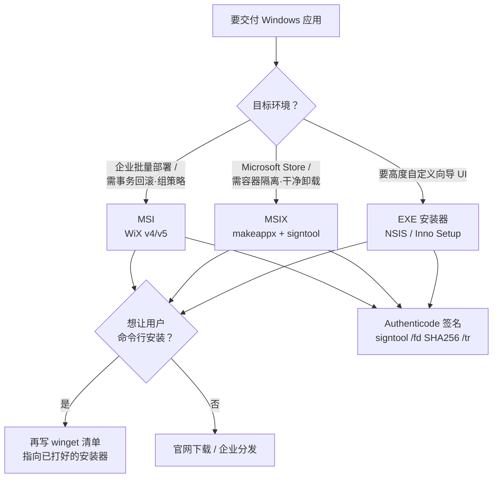
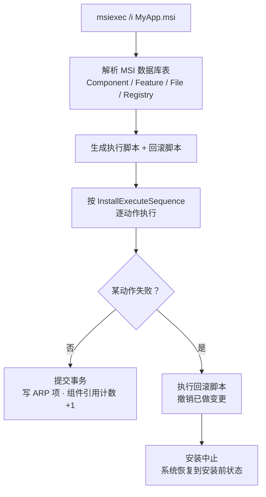

---
tags:
  - packaging
  - tier3
  - windows
  - msi
  - msix
  - wix
  - winget
---
# Windows 应用打包

> [!abstract] TL;DR
> Windows 打包不像 Linux 那样只有「一种原生格式」，而是并存四条路线：**MSI**（Windows Installer 的关系型数据库包，事务化安装/回滚，企业部署主力）、**MSIX**（AppX 后继，声明式清单 + 应用容器隔离 + 干净卸载，现代/商店路线）、**EXE 安装器**（NSIS/Inno Setup 脚本式向导）、**winget 清单**（不打新包，而是写 YAML 描述已有安装器供 `winget install`）。做 MSI 的开源事实标准是 **WiX Toolset v4/v5**——它把 v3 的 `candle`+`light` 合并成一个 .NET 工具 `wix build`，根元素从 `<Product>` 变为 `<Package>`。MSIX 用 `makeappx pack` 打包、`signtool` 签名（**清单里的 Publisher 必须与签名证书主题完全一致**，且 MSIX 不签名就装不上）。所有产物都应做 **Authenticode 代码签名 + RFC3161 时间戳**（时间戳让签名在证书过期后仍有效），EV 证书能立刻获得 SmartScreen 信誉。

## 概述与定位

和 Linux「Debian 系用 deb、RHEL 系用 rpm」的清爽格局不同，Windows 打包是**多格式并存、按场景选型**。四条主流路线：

| 路线 | 本质 | 典型场景 |
|---|---|---|
| **MSI** | Windows Installer 服务读取的关系型数据库包 | 企业软件、需要事务/回滚/组策略部署、传统安装向导 |
| **MSIX** | AppX 后继，声明式清单 + 容器隔离 | 现代应用、Microsoft Store、需要干净卸载与自动更新 |
| **EXE 安装器**（NSIS / Inno Setup） | 脚本驱动的自解压安装向导 | 开源/中小软件，要高度自定义 UI 与逻辑 |
| **winget 清单** | 描述「去哪下、怎么静默装」的 YAML | 让用户能 `winget install你的应用`，复用已有 MSI/EXE |

关键区分维度：

- **per-machine vs per-user**：装到 `Program Files`（全局，需管理员/UAC）还是 `%LOCALAPPDATA%`（当前用户，免提权）。per-user 安装能绕过 UAC 弹窗，对无管理员权限的企业环境友好。
- **是否需要事务与回滚**：MSI 的安装是事务性的——中途失败会自动回滚到安装前状态；EXE 安装器的回滚要自己实现。
- **是否需要隔离**：MSIX 把应用装进轻量容器，文件/注册表写入被虚拟化重定向，卸载时零残留；MSI/EXE 直接写真实系统，卸载干净与否全靠打包者。

winget 是个特例：它**通常不产生新包**，而是让你把已经用 MSI/MSIX/NSIS 打好的安装器「登记」进 Windows 包管理器目录。所以现实工作流常是「先用 WiX 打 MSI + 签名 → 再写 winget 清单指向它」。

与 [[../42.Cmake/24 - CPack 进阶打包|CPack]] 的关系：CPack 的 `NSIS`/`WIX` 生成器封装了本篇的 NSIS 和 WiX——CPack 帮你自动生成 `.wxs`/NSIS 脚本；理解本篇的原生机制，才能在 CPack 生成物不满足需求时手工接管。

选型可用一张决策图收敛：



## 原理与机制

### MSI：一个可事务执行的关系型数据库

MSI 文件不是压缩包，而是一个 **COM 结构化存储（Structured Storage）文件，里面是一组关系型数据库表**。安装逻辑不是「跑一段脚本」，而是「Windows Installer 服务（`msiexec`）解释这些表并生成执行序列」。核心概念：

- **Component（组件）**：安装的**原子单位**，由一个全局唯一的 **ComponentId（GUID）** 标识。一个组件含若干资源（文件、注册表项、快捷方式），有一个 **KeyPath**（代表该组件是否已装的关键资源）。**组件规则**：每个资源只能属于一个组件；同一 GUID 在所有产品间共享，Windows Installer 据此做**引用计数**（多个产品共享的 DLL，最后一个卸载时才真正删除）。
- **Feature（功能）**：用户在安装向导里可勾选的**功能单元**，由一组 Component 构成（如「核心」「插件」「文档」）。Feature ↔ Component 是多对多。
- **三个 GUID**：**ProductCode**（标识「这一个具体版本的产品」，主版本升级时要换）、**UpgradeCode**（跨版本**稳定不变**，Windows 据它识别「这是同一产品的不同版本」从而做升级）、**PackageCode**（标识包文件本身）。
- **升级模型**：**Major Upgrade**（换 ProductCode + 抬版本号，先卸旧再装新，最常用）；**Minor Upgrade / Small Update**（同 ProductCode，用 `.msp` 补丁）。搞错 UpgradeCode 会导致新版本装成「第二个产品」而非升级——这是 MSI 最经典的坑，与 CPack 篇强调的「WIX GUID 不可变」同源。
- **事务与回滚**：`msiexec` 先生成「执行脚本」和对应的「回滚脚本」，任一步失败即执行回滚，恢复到安装前。这是 MSI 相对 EXE 安装器的最大优势。
- **ARP 项**：安装后在「添加/删除程序」（Add/Remove Programs）注册条目，支持修复/卸载。

MSI 的事务化安装可用下图理解——**先生成执行+回滚双脚本，任一动作失败即整体回滚**：



### MSIX：声明式清单 + 容器隔离

MSIX 是 UWP `.appx` 打包模型的后继，把「传统桌面应用」也纳入现代打包体系。它是一个 zip 容器，核心是根目录的 **`AppxManifest.xml`**（声明式清单）：

- **Identity**：`Name`、`Publisher`、`Version`——**`Publisher` 必须与签名证书的主题（Subject）逐字一致**，否则签名时报 `0x8007000B`（这是 MSIX 打包第一大坑）。
- **Capabilities**：声明应用要用的能力（网络、文件系统、摄像头……），运行时受此约束。
- **Applications**：可执行入口、显示名、图标（VisualElements）。

MSIX 的机制价值在**隔离与干净**：应用跑在轻量容器里，对系统目录/注册表的写入被**虚拟化重定向**到私有位置，因此卸载时**零残留**（不像 MSI/EXE 可能留下垃圾）；升级是原子替换；支持通过 `.appinstaller` 文件做侧载自动更新。代价是：**MSIX 必须签名才能安装**（自签名证书还须导入目标机的「受信任的人（Trusted People）」存储，否则报 `CERT_E_UNTRUSTEDROOT`）；且容器化对某些依赖深度系统集成的老程序不兼容。

### Authenticode：Windows 的代码签名信任基础

无论哪种包，分发给用户前都应做 **Authenticode 签名**——把一个 PKCS#7 签名嵌入 PE 文件（`.exe`/`.dll`/`.msi`）或 MSIX 容器；松散文件/驱动则用目录签名 `.cat`。要点：

- **哈希算法**：现代必须 SHA256（`signtool` 默认还是 SHA1，**必须显式 `/fd SHA256`**）。
- **时间戳（关键）**：签名时用 `/tr <RFC3161 时间戳服务器> /td SHA256` 打时间戳。**没有时间戳，证书一过期签名就失效；有时间戳，签名在证书过期后依然有效**（时间戳证明「签名发生在证书有效期内」）。
- **SmartScreen 信誉**：Windows 用 SmartScreen 拦截「低信誉」下载。**EV（Extended Validation）代码签名证书**能让应用**立即获得信誉**（不弹「未知发布者」警告）；普通 OV 证书需靠下载量逐渐积累信誉。

## 打包工具链详解

### WiX Toolset v4/v5：MSI 的开源事实标准

WiX 用 XML（`.wxs`）声明式描述 MSI 内容，再编译成 `.msi`。**v4 起工具链彻底重构**：v3 的 `candle.exe`（编译 `.wxs`→`.wixobj`）+ `light.exe`（链接→`.msi`）被合并进**单个 .NET 工具 `wix`**。安装与使用：

```console
:: 作为 .NET 工具全局安装（需 .NET 6+ SDK）
> dotnet tool install --global wix

:: v3 老工程迁移：先转换语法
> wix convert Product.wxs

:: 编译并链接成 MSI（一条命令搞定，取代 candle+light）
> wix build Product.wxs -o MyApp.msi
```

`.wxs` 的结构（v4 命名空间 `http://wixtoolset.org/schemas/v4/wxs`，**根授权元素从 v3 的 `<Product>` 改为 `<Package>`**）：

```xml
<Wix xmlns="http://wixtoolset.org/schemas/v4/wxs">
  <Package Name="MyApp" Manufacturer="Example Corp"
           Version="1.2.3" UpgradeCode="PUT-A-STABLE-GUID-HERE">

    <MajorUpgrade DowngradeErrorMessage="已安装更新版本。" />

    <!-- 目录结构：ProgramFiles64\MyApp -->
    <StandardDirectory Id="ProgramFiles64Folder">
      <Directory Id="INSTALLFOLDER" Name="MyApp">
        <Component Id="MainExe" Guid="*">
          <File Source="build\myapp.exe" KeyPath="yes" />
        </Component>
        <Component Id="CoreDll" Guid="*">
          <File Source="build\core.dll" KeyPath="yes" />
        </Component>
      </Directory>
    </StandardDirectory>

    <!-- 开始菜单快捷方式 -->
    <StandardDirectory Id="ProgramMenuFolder">
      <Component Id="StartMenuShortcut" Guid="*">
        <Shortcut Id="AppShortcut" Name="MyApp"
                  Target="[INSTALLFOLDER]myapp.exe" />
        <RegistryValue Root="HKCU" Key="Software\Example\MyApp"
                       Name="installed" Type="integer" Value="1" KeyPath="yes" />
      </Component>
    </StandardDirectory>

    <!-- 把组件收进一个 Feature -->
    <Feature Id="Main" Title="MyApp" Level="1">
      <ComponentRef Id="MainExe" />
      <ComponentRef Id="CoreDll" />
      <ComponentRef Id="StartMenuShortcut" />
    </Feature>
  </Package>
</Wix>
```

要点：`Guid="*"` 让 WiX 自动生成稳定组件 GUID；`<MajorUpgrade>` 一行声明升级策略（自动处理换 ProductCode、卸旧装新）；`UpgradeCode` 必须写死且永不变。**扩展**（UI、防火墙、IIS 等）在 v4 里以 NuGet 包引用：`wix extension add -g WixToolset.UI.wixext`，再在 `.wxs` 里引对应命名空间。目录**采集（harvest）**——把整个文件夹自动生成组件——v4 通过 `WixToolset.Heat` 包提供（v3 的 `heat.exe` 功能），大目录不必手写每个 `<File>`。

### MSIX 打包与打包工具

不走 Visual Studio 时，用 Windows SDK 的 `makeappx` + `signtool` 命令行打包：

```console
:: 1. 准备目录：AppxManifest.xml 放在根，所有 payload 文件在其下
:: 2. 打包（目录模式 /d，或映射文件模式 /f）
> makeappx pack /d C:\MyAppLayout /p MyApp.msix

:: 3. 签名（/fd SHA256 必须；publisher 须匹配证书主题）
> signtool sign /fd SHA256 /a /f MyCert.pfx /p <密码> ^
    /tr http://timestamp.digicert.com /td SHA256 MyApp.msix
```

多包合并成 `.msixbundle` 用 `makeappx bundle`。`AppxManifest.xml` 骨架：

```xml
<Package xmlns="http://schemas.microsoft.com/appx/manifest/foundation/windows10">
  <Identity Name="ExampleCorp.MyApp"
            Publisher="CN=Example Corp, O=Example Corp, C=CN"
            Version="1.2.3.0" ProcessorArchitecture="x64" />
  <Properties>
    <DisplayName>MyApp</DisplayName>
    <PublisherDisplayName>Example Corp</PublisherDisplayName>
    <Logo>Assets\StoreLogo.png</Logo>
  </Properties>
  <Applications>
    <Application Id="MyApp" Executable="myapp.exe"
                 uap10:RuntimeBehavior="win32App" uap10:TrustLevel="mediumIL">
      <uap:VisualElements DisplayName="MyApp" Description="演示应用"
                          Square150x150Logo="Assets\Square150.png"
                          Square44x44Logo="Assets\Square44.png"
                          BackgroundColor="transparent" />
    </Application>
  </Applications>
</Package>
```

除命令行外，**MSIX Packaging Tool**（GUI，能把现有 MSI/EXE 安装过程录制转成 MSIX）适合改造遗留应用。

### EXE 安装器：NSIS 与 Inno Setup（简述）

两者都是脚本驱动、产出自解压 `.exe` 向导，胜在**高度自定义**与简单分发（单文件、双击即装）：

- **NSIS**（Nullsoft Scriptable Install System）：`.nsi` 脚本，插件生态丰富，[[../42.Cmake/24 - CPack 进阶打包|CPack 的 NSIS 生成器]]即基于它。
- **Inno Setup**：Pascal 脚本（`[Setup]`/`[Files]`/`[Icons]` 段 + `[Code]` 段写 Pascal 逻辑），文档友好、上手快。

它们不具备 MSI 的事务/组策略/引用计数能力，但对「就要一个漂亮向导、逻辑我自己控」的场景最省心。

### winget 清单：让应用可被 `winget install`

winget 清单是**多文件 YAML**，遵循 Windows Package Manager schema（当前 `ManifestVersion` 约 1.x，以 [winget-pkgs 仓库](https://github.com/microsoft/winget-pkgs) 最新为准）。单安装器 + 单语言可用 singleton 单文件；否则**至少三文件**：`version` + `defaultLocale` + `installer`（外加可选的额外 locale）。字段一律 PascalCase：

```yaml
# ExampleCorp.MyApp.installer.yaml
PackageIdentifier: ExampleCorp.MyApp
PackageVersion: 1.2.3
Installers:
  - Architecture: x64
    InstallerType: wix          # msi / msix / inno / nullsoft / exe / burn / portable
    InstallerUrl: https://example.com/downloads/MyApp-1.2.3-x64.msi
    InstallerSha256: <winget hash 生成的大写十六进制>
    InstallerSwitches:
      Silent: /qn
      SilentWithProgress: /qb
ManifestType: installer
ManifestVersion: 1.6.0
```

`InstallerSha256` 用 `winget hash -f MyApp.msi` 生成（MSIX 加 `-m` 出 SignatureSha256）。

## 工具视角与实战

### 完整 WiX → 签名 → winget 流程

一条现实的桌面应用交付链：

```console
:: ① 用 WiX 构建 MSI
> wix build Product.wxs -ext WixToolset.UI.wixext -o dist\MyApp-1.2.3-x64.msi

:: ② 对 MSI 做 Authenticode 签名 + 时间戳
> signtool sign /fd SHA256 /a /f MyCert.pfx /p <密码> ^
    /tr http://timestamp.digicert.com /td SHA256 ^
    dist\MyApp-1.2.3-x64.msi

:: ③ 验证签名
> signtool verify /pa /v dist\MyApp-1.2.3-x64.msi

:: ④ 生成 winget 清单并校验（wingetcreate 自动填大部分字段）
> winget install wingetcreate
> wingetcreate new https://example.com/downloads/MyApp-1.2.3-x64.msi
> winget validate .\manifests\e\ExampleCorp\MyApp\1.2.3\

:: ⑤ 沙箱实测安装/卸载，再向 microsoft/winget-pkgs 提 PR
> powershell .\Tools\SandboxTest.ps1 .\manifests\e\ExampleCorp\MyApp\1.2.3\
```

`wingetcreate submit` 可直接把清单以 PR 形式推到社区仓库；提交后自动化会校验 schema、URL 安全、病毒扫描、以管理员/非管理员双身份实测装卸、验证静默参数。

### 静默安装参数（自动化/企业部署必备）

无人值守部署要求安装器支持静默模式，这也是 winget/SCCM/Intune 调用的方式：

| 安装器 | 静默安装 | 说明 |
|---|---|---|
| MSI | `msiexec /i MyApp.msi /qn` | `/qn` 全静默、`/qb` 带进度条；`/l*v log.txt` 记详细日志 |
| MSI 卸载 | `msiexec /x {ProductCode} /qn` | 按 ProductCode 卸载 |
| NSIS | `MyApp.exe /S` | `/S` 静默（大写） |
| Inno Setup | `MyApp.exe /VERYSILENT /SUPPRESSMSGBOXES` | |
| MSIX | `Add-AppxPackage MyApp.msix` | PowerShell 部署 |

### 查看与验证

```console
> signtool verify /pa /v MyApp.msi          :: 验证 Authenticode 签名链
> msiexec /a MyApp.msi TARGETDIR=C:\extract  :: 管理安装：解出 MSI 内容不真正安装
> Get-AppxPackage -Name ExampleCorp.MyApp    :: 查已装 MSIX（PowerShell）
```

### MSIX 自动更新（.appinstaller）与企业分发

MSIX 侧载分发可配一份 **`.appinstaller`**（XML）实现自动更新：它声明主包 URI 与更新策略（`OnLaunch` 前台检查、后台检查、`HoursBetweenUpdateChecks`），用户装的是 `.appinstaller`，之后系统按策略自动拉取新版本——无需重造安装器，这是 MSIX 相对传统 EXE/MSI 的一大优势。企业批量分发则走 **MDM（Intune）** 或 Microsoft Store for Business：MSI/MSIX/EXE 都能被 Intune 以 Win32 应用（`.intunewin` 打包）或 MSIX LOB 应用下发，配合前述静默参数无人值守安装。这条路径与 winget（面向个人/开发者的命令行）互补，覆盖受管终端。

## 安全性与正确使用

### signtool 的正确姿势

```console
> signtool sign ^
    /fd SHA256 ^                         :: 文件摘要算法（必须显式，默认 SHA1 不可用）
    /tr http://timestamp.digicert.com ^  :: RFC3161 时间戳服务器
    /td SHA256 ^                         :: 时间戳摘要算法
    /a ^                                 :: 自动选最佳证书（或 /f cert.pfx /p 密码）
    /d "MyApp Installer" ^               :: 签名描述
    MyApp.msi
```

三条纪律：**① 必须 `/fd SHA256`**（SHA1 已被淘汰、且 SignTool 默认值不可用于 MSIX）；**② 必须打时间戳 `/tr`**——否则证书一过期，所有已分发的签名全部失效；**③ 对 EXE 主程序和安装包都要签**（用户可能直接拿到解包后的 exe）。

### EV 证书与 SmartScreen 信誉

对面向公众下载的软件，SmartScreen 的「未知发布者」警告会显著劝退用户。**EV 代码签名证书**（存于硬件令牌，验证更严）能让应用**发布即有信誉**，不触发警告；普通 OV 证书需要靠下载量慢慢积累。企业内网分发则可通过组策略把自签/内部 CA 证书下发到「受信任的发布者」存储。

### 最小权限与隔离

- **优先 per-user 安装**（装到 `%LOCALAPPDATA%`）可免 UAC 提权，降低攻击面与部署摩擦；确需写 `Program Files`/`HKLM` 才用 per-machine。
- **MSIX 的容器隔离**天然限制应用对系统的写入（虚拟化重定向 + 声明式 Capabilities），卸载零残留——对不信任来源的应用是更安全的分发形态。
- **MSI CustomAction 风险**：MSI 的自定义动作可以「延迟执行 + 提升到 SYSTEM 权限」运行任意代码——这既强大也危险。避免在 CustomAction 里放复杂/可注入逻辑；能用内建表（Registry/Shortcut/ServiceInstall）声明式表达的就不要写 CustomAction。

从**供应链**看，用户双击一个安装器 = 授予它安装期权限（MSI 甚至可能 SYSTEM）。因此：给一切产物签名 + 打时间戳、对外用可信 CA（面向公众优先 EV）、企业内用组策略管控信任、CI 里对下载的安装器做哈希校验，是基本纪律。

> **合规边界**：本篇用于打包与签名**你自有或获授权分发**的 Windows 软件。用他人证书签名、伪造发布者身份、重打包他人软件绕过其授权/更新校验均越界；代码签名证书私钥须妥善保管（EV 证书要求硬件令牌正是为此）。

## 小结

- **四条路线按场景选**：MSI（事务/企业/组策略）、MSIX（隔离/干净/商店）、EXE 安装器（NSIS/Inno，自定义 UI）、winget 清单（复用已有安装器供 `winget install`）。
- **MSI 机制**：关系型数据库包，Component（GUID + 引用计数）/Feature/三 GUID（ProductCode 变、**UpgradeCode 永不变**、PackageCode）；事务化安装可回滚；Major Upgrade 是常规升级方式。
- **MSIX 机制**：声明式 `AppxManifest.xml`，容器隔离 + 写入虚拟化 + 卸载零残留；**必须签名**，**Publisher 须与证书主题逐字一致**。
- **工具链**：WiX v4/v5 用统一的 `wix build`（根元素 `<Package>`，扩展走 NuGet，采集用 `WixToolset.Heat`）；MSIX 用 `makeappx pack` + `signtool`；winget 用多文件 YAML + `wingetcreate` + `winget validate` + PR 到 winget-pkgs。
- **签名铁律**：Authenticode `signtool sign /fd SHA256 /tr <ts> /td SHA256`；**必打时间戳**（证书过期后签名仍有效）；EV 证书即时获得 SmartScreen 信誉；主程序与安装包都要签。
- **安全**：优先 per-user 免 UAC；MSIX 容器隔离更安全；慎用会以 SYSTEM 跑任意代码的 MSI CustomAction。

## 相关阅读

- [WiX Toolset v4/v5 文档（FireGiant）](https://docs.firegiant.com/wix/)（`docs.firegiant.com`）—— `wix build`、`.wxs` 架构、扩展与 Heat 采集
- [Create an MSIX package with MakeAppx.exe](https://learn.microsoft.com/windows/msix/package/create-app-package-with-makeappx-tool)（`learn.microsoft.com`）
- [Sign an app package using SignTool](https://learn.microsoft.com/windows/msix/package/sign-app-package-using-signtool)（`learn.microsoft.com`）
- [Windows Package Manager · 创建与提交清单](https://learn.microsoft.com/windows/package-manager/package/)（`learn.microsoft.com`）
- [SignTool 参考](https://learn.microsoft.com/windows/win32/seccrypto/signtool)（`learn.microsoft.com`）—— Authenticode、时间戳、`/fd`/`/tr` 选项
- 本系列第 09 篇：[[09.InnoSetup脚本语法参考]]——EXE 安装器路线（Inno Setup）的 section/指令/静默参数参考册
- 本系列第 01/02 篇：[[01.Linux原生打包-dpkg与deb]] / [[02.Linux原生打包-rpmbuild与rpm]]——Linux 侧对照
- [[../42.Cmake/24 - CPack 进阶打包|42 系列 · CPack 进阶打包]]——CPack 的 NSIS/WIX 生成器如何封装本篇工具

---

[[00.打包与分发总览|⬆ 系列总览]] | [[02.Linux原生打包-rpmbuild与rpm|← 上一章]] | [[04.Docker与OCI镜像打包|→ 下一章]]
