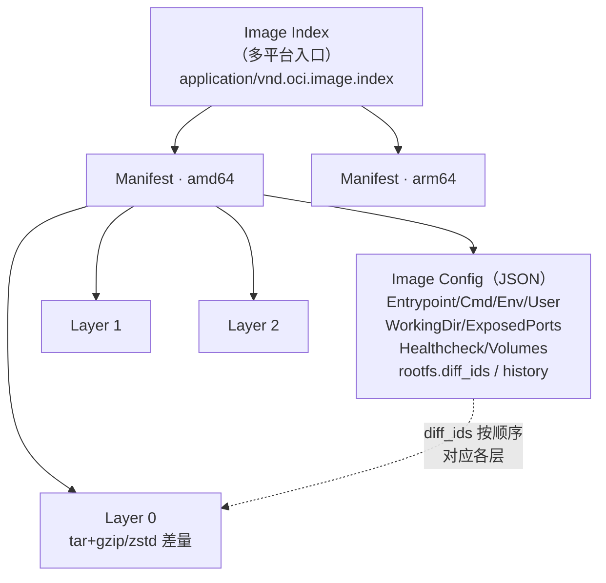

---
tags:
  - packaging
  - tier3
  - docker
  - oci
  - container
---
# Docker 与 OCI 镜像打包

> [!abstract] TL;DR
> 容器镜像是一种**分发格式**：与 deb/rpm/msi「把文件装进宿主 OS」不同，镜像**把整个运行环境（依赖、库、配置、你的程序）打成一个不可变、内容寻址的单元**随程序一起交付。物理上它遵循 **OCI Image Spec**：一个 `index`（多平台入口）指向多个 `manifest`，每个 manifest 指向一份 `config`（JSON，含 Entrypoint/Cmd/Env/User 等运行参数）+ 若干 `layer`（tar+压缩的文件系统差量）。分发走 **OCI Distribution Spec**（registry 的 push/pull，全部按 SHA256 digest 内容寻址）。本篇聚焦**打包与分发**——如何写面向交付的 Dockerfile（基镜像选型、`COPY` 产物、非 root `USER`、`ENTRYPOINT` vs `CMD`、健康检查、OCI 标签）、Tag/digest 版本策略、`skopeo` 跨仓搬运、`cosign` 签名、`syft` 生成 SBOM、`trivy` 扫描作分发门禁。**构建引擎内部（BuildKit LLB、缓存键、buildx）见 [[../46.构建系统横向对比/19.容器化构建BuildKit|46 系列第 19 篇]]，本篇不重复。**

## 概述与定位

前三篇的打包格式（deb/rpm/msi/msix）都在回答同一个问题：「怎么把文件**装进宿主操作系统**」。容器镜像回答的是一个**根本不同**的问题：「怎么把**整个运行环境**连同程序一起打包，让它在任何装了容器运行时的机器上以完全一致的方式跑起来」。

这个差异决定了它的定位：

| 维度 | 原生包（deb/rpm/msi） | 容器镜像（OCI） |
|---|---|---|
| 交付内容 | 你的文件 | 你的文件 **+ 完整运行环境**（基础库、依赖、目录布局） |
| 安装位置 | 宿主 OS 的真实目录 | 独立的分层文件系统，运行时挂载 |
| 依赖解决 | 交给宿主包管理器（apt/dnf）在**安装时**求解 | **打包时**就固定进镜像，运行时零依赖解析 |
| 隔离 | 无（与宿主共享一切） | namespace/cgroup 隔离 |
| 一致性 | 受宿主发行版/库版本影响 | 位级一致（同 digest 到处一样） |
| 分发单元 | 单个包文件 + 仓库 | 不可变镜像 + registry |

一句话：**原生包分发「文件」，镜像分发「文件 + 环境」**。这让镜像成为云原生/K8s 时代的默认交付形态——「在我机器上能跑」的问题被「环境随镜像走」根治。

**与 [[../46.构建系统横向对比/19.容器化构建BuildKit|46 系列第 19 篇]] 的分工**：那一篇讲**构建引擎内部**——BuildKit 如何把 Dockerfile 编译成 LLB DAG、缓存键怎么算、buildx 怎么并行。**本篇讲打包与分发**——镜像作为交付物的结构、如何写面向交付的 Dockerfile、如何 tag/签名/扫描/推送/搬运。两篇正交：读本篇学「打什么、怎么发」，读 46/19 学「构建引擎怎么跑得快」。

**何时用镜像、何时用原生包？** 目标是容器/K8s/Serverless → 镜像；目标是装进传统主机/桌面、要进系统包依赖图、要 systemd 深度集成 → 原生包（第 01/02/03 篇）。二者不互斥：很多项目既发 `.deb`/`.rpm` 也发镜像。

## 原理与机制

### OCI 镜像的对象模型

一个镜像不是「一个文件」，而是 registry 里一组**内容寻址对象**，遵循 [OCI Image Spec](https://github.com/opencontainers/image-spec)：



- **Image Index**：多平台入口，按 `os/architecture` 指向各平台的 manifest。`docker pull` 时按本机平台自动选。
- **Manifest**：单平台清单，指向**一份 config** + **一组 layer**，每个引用都是 `mediaType + digest + size`。
- **Config**：一份 JSON，**这是「打包」与「运行」的接缝**——它记录容器启动时的 `Entrypoint`/`Cmd`/`Env`/`User`/`WorkingDir`/`ExposedPorts`/`Healthcheck`/`Volumes`，以及 `rootfs.diff_ids`（各层解压后的哈希，按序叠加成根文件系统）和 `history`。
- **Layer**：一个 tar 归档（gzip/zstd 压缩），是对文件系统的**差量变更**。删除用 `.wh.<name>`（whiteout）文件表达。层是**共享 + 缓存**的单位：多个镜像共用同一基础层，registry 与本地只存一份。

关键性质是**内容寻址**：每个对象由其内容的 SHA256 digest 标识。`myapp:1.2.3` 这样的 tag 只是一个**可变指针**，指向某个 `sha256:...` digest；digest 才是不可变的真身。这直接决定了后面的版本策略与安全策略。

### Registry 分发协议

镜像通过 registry 分发，遵循 [OCI Distribution Spec](https://github.com/opencontainers/distribution-spec)：`push` 是「先逐个上传 blob（层 + config），再上传引用它们的 manifest」；`pull` 反之。由于内容寻址，**已存在的层不会重复上传/下载**（按 digest 去重）——这是镜像分发高效的根本。registry 生态：Docker Hub、GitHub Container Registry（GHCR）、私有 Harbor、各云厂商 registry；协议统一，`docker`/`podman`/`skopeo` 可互操作。

### 镜像 config：打包决定运行行为

「打包」阶段写进 config 的字段，直接决定容器**运行时**的行为，这是 Dockerfile 各指令的落点：

| Config 字段 | Dockerfile 指令 | 作用 |
|---|---|---|
| `Entrypoint` | `ENTRYPOINT` | 容器的「主程序」，不易被覆盖 |
| `Cmd` | `CMD` | 默认参数/命令，`docker run` 尾部可覆盖 |
| `Env` | `ENV` | 环境变量 |
| `User` | `USER` | 运行身份（应设非 root） |
| `WorkingDir` | `WORKDIR` | 工作目录 |
| `ExposedPorts` | `EXPOSE` | 声明监听端口（仅文档/元数据，不真正发布） |
| `Healthcheck` | `HEALTHCHECK` | 存活探测命令 |
| `Volumes` | `VOLUME` | 声明数据卷挂载点 |
| `Labels` | `LABEL` | 元数据（含 OCI 标准注解） |

## 面向打包的 Dockerfile 详解

同一个 `RUN`/`COPY` 在 46/19 里是「LLB 的一个 Op」，在这里我们只关心它**如何塑造最终交付的镜像**——层数、体积、启动行为、可维护性。

### 基础镜像选型：交付体积与攻击面的第一决定

`FROM` 选什么，几乎决定了镜像体积、攻击面和可调试性：

| 基础镜像 | 体积量级 | 特点与适用 |
|---|---|---|
| `scratch` | 0 | 空镜像；只适合**静态链接**的单二进制（Go/Rust `musl`）。最小攻击面，但无 shell/无 libc、难调试 |
| `gcr.io/distroless/*` | ~2–20 MB | 只含运行时（libc/证书），**无 shell、无包管理器**；攻击面极小，是生产强推 |
| `alpine` | ~5 MB | 有 shell 和 `apk`，但用 **musl libc**（与 glibc 有兼容坑，如 DNS、某些预编译二进制） |
| `debian:*-slim` / `ubuntu` | ~30–80 MB | glibc、工具齐全、兼容性最好；体积较大 |

原则：**能静态就 `scratch`/distroless，需 glibc/调试就 debian-slim，除非明确接受 musl 差异否则慎用 alpine**。

### 一份规范的打包 Dockerfile

以「把一个预编译好的服务二进制打成最小生产镜像」为例（编译细节交给上游构建系统或 multi-stage，见下）：

```dockerfile
# syntax=docker/dockerfile:1
FROM gcr.io/distroless/base-debian12:nonroot

# OCI 标准注解：来源、版本、许可证——供 registry/工具读取
LABEL org.opencontainers.image.source="https://github.com/example/myapp" \
      org.opencontainers.image.version="1.2.3" \
      org.opencontainers.image.licenses="MIT" \
      org.opencontainers.image.description="MyApp 服务"

WORKDIR /app

# 只 COPY 真正要分发的产物（构建产物由上游/前一 stage 提供）
COPY --chown=nonroot:nonroot myapp /app/myapp
COPY --chown=nonroot:nonroot config/ /app/config/

ENV APP_ENV=production \
    APP_PORT=8080

# 非 root 运行（distroless :nonroot 标签已内置 nonroot 用户）
USER nonroot

EXPOSE 8080

# 存活探测（编排系统据此判断容器健康）
HEALTHCHECK --interval=30s --timeout=3s --start-period=5s --retries=3 \
    CMD ["/app/myapp", "healthcheck"]

# exec 形式（JSON 数组）——直接 exec，PID 1 是你的程序，能收到 SIGTERM
ENTRYPOINT ["/app/myapp"]
CMD ["serve", "--config", "/app/config/prod.yaml"]
```

逐点说明打包要义：

- **`COPY` 只放该分发的东西**：源码、构建工具、`.git` 都不该进生产镜像（用 `.dockerignore` 排除，见下）。
- **`ENTRYPOINT` 用 exec 形式（JSON 数组）而非 shell 形式**：shell 形式 `ENTRYPOINT myapp` 会包一层 `/bin/sh -c`，导致你的程序不是 PID 1、**收不到 `SIGTERM`**（优雅停机失效）；exec 形式让程序直接当 PID 1。`ENTRYPOINT` 定「主程序」、`CMD` 给「默认参数」，二者配合可让 `docker run image 其他参数` 覆盖 CMD 而保留 ENTRYPOINT。
- **`USER nonroot`**：容器默认 root 是重大风险（容器逃逸即宿主 root）；生产镜像必须切非 root。
- **`HEALTHCHECK`**：让 Docker/编排系统知道容器是否真正就绪，而非「进程活着但服务挂了」。
- **`LABEL` 用 OCI 标准注解**（`org.opencontainers.image.*`）：source/version/licenses/revision，registry 和供应链工具会读取，利于溯源。
- **`EXPOSE` 只是声明**：不真正发布端口（发布靠 `docker run -p`），是给人和工具看的元数据。

### `.dockerignore`：控制构建上下文与防泄密

```
.git
node_modules
*.md
.env
secrets/
build/
```

它既减小发送给构建引擎的上下文（更快）、也**防止把 `.env`/密钥/`.git` 意外 `COPY` 进镜像层**（层是公开可解的，一旦进层就永久留在历史里）。

### multi-stage 瘦身（打包视角，机制详见 46/19）

多阶段构建的**打包价值**是「编译工具链留在构建阶段，最终镜像只含运行所需」——把几百 MB 的编译环境挡在交付物之外：

```dockerfile
# 构建阶段：含完整工具链（不进最终镜像）
FROM golang:1.22 AS build
WORKDIR /src
COPY . .
RUN CGO_ENABLED=0 go build -ldflags="-s -w" -o /out/myapp ./cmd/myapp

# 交付阶段：只有二进制 + 最小运行时
FROM gcr.io/distroless/static-debian12:nonroot
COPY --from=build /out/myapp /myapp
USER nonroot
ENTRYPOINT ["/myapp"]
```

（缓存挂载、`--mount=type=cache`、并行 stage 调度等**构建效率**话题属构建引擎范畴，见 [[../46.构建系统横向对比/19.容器化构建BuildKit|46/19]]。）

### 层结构与体积分析

层的顺序影响缓存命中（变化少的放前面），层的内容影响体积。分析工具 `dive` 可逐层查看「每层加了什么、有多少浪费」：

```console
$ dive myapp:1.2.3        # 交互式逐层审查，报告 efficiency 分数
$ docker history myapp:1.2.3   # 查看各层来源指令与大小
```

常见体积陷阱：在一个 `RUN` 里 `apt-get install` 后**同层** `rm -rf /var/lib/apt/lists/*`（分成两层删不掉，因为前一层仍含这些文件——whiteout 只是遮盖不减体积）。

### Tag 与 digest：版本策略

- **Tag 是可变指针**：`myapp:1.2.3`、`myapp:latest` 都可被重新推送指向新 digest。**`latest` 是反模式**——它无版本语义、会漂移，生产引用 `latest` 会导致「同一 tag 不同时间拉到不同镜像」。
- **Digest 是不可变真身**：`myapp@sha256:abc...` 永远指向同一份内容。
- **推荐策略**：推送时同时打**语义化版本 tag**（`1.2.3`、`1.2`、`1`）便于人读，但**生产部署引用 digest**（`myapp@sha256:...`）保证不可变、可审计、可复现。K8s 清单里钉 digest 是安全基线。

## 工具视角与实战

### 打包、打标签、推送

```console
# 构建并打多个 tag（构建引擎细节见 46/19）
$ docker build -t myrepo/myapp:1.2.3 -t myrepo/myapp:1.2 .

# 登录 registry 并推送
$ docker login ghcr.io
$ docker push myrepo/myapp:1.2.3
$ docker push myrepo/myapp:1.2

# 取得不可变 digest（生产按它引用）
$ docker inspect --format='{{index .RepoDigests 0}}' myrepo/myapp:1.2.3
myrepo/myapp@sha256:9f2c...
```

### 审查镜像内容

```console
$ docker inspect myrepo/myapp:1.2.3          # 看 config：Entrypoint/Env/User/Labels
$ docker history myrepo/myapp:1.2.3          # 逐层来源与大小
# skopeo：不落地到本地 daemon 就能查远端镜像
$ skopeo inspect docker://ghcr.io/myrepo/myapp:1.2.3
$ skopeo inspect --config docker://ghcr.io/myrepo/myapp:1.2.3   # 直接看 OCI config
```

### skopeo：跨 registry 搬运（不经本地 daemon）

镜像晋级（staging→prod registry）、镜像备份、跨云同步的利器——`skopeo copy` 直接在 registry 间搬 blob，无需 `pull` 到本地再 `push`：

```console
# 从一个 registry 复制到另一个（保留多平台）
$ skopeo copy --all \
    docker://staging.example.com/myapp:1.2.3 \
    docker://prod.example.com/myapp:1.2.3

# 导出为本地 OCI 布局目录（离线分发）
$ skopeo copy docker://myrepo/myapp:1.2.3 oci:./myapp-oci:1.2.3
```

### 免 daemon 构建（简述）

无 Docker 守护进程/在集群内构建的场景：**buildah**（`buildah bud -t myapp .`，无守护进程，rootless 友好）、**kaniko**（在 K8s Pod 内构建、无需特权）。它们产出的同样是 OCI 镜像，分发方式一致。

### 多平台镜像（简述，机制见 46/19）

`docker buildx build --platform linux/amd64,linux/arm64 --push -t myrepo/myapp:1.2.3 .` 一次产出多架构镜像，通过 OCI Image Index 对用户透明（`docker pull` 自动选平台）。QEMU 仿真 vs 原生节点等构建机制见 46/19。

### 镜像之外：OCI Artifacts 与多服务交付

OCI registry 已从「只存镜像」演进为**通用制品仓库**：借助 **OCI Artifacts**（manifest 里用自定义 `artifactType` / `config.mediaType`），可把 Helm chart、WASM 模块、SBOM、签名、乃至任意文件当作「制品」推进同一 registry，用 **`oras`**（OCI Registry As Storage）`push`/`pull`。这让「一个 registry 统一分发镜像 + 配套制品」成为可能——cosign 的签名与 attestation 正是以 OCI Artifact 形式挂到镜像 digest 上的：

```console
$ oras push ghcr.io/myrepo/config:1.2.3 \
    --artifact-type application/vnd.example.config \
    prod.yaml:application/yaml
$ oras pull ghcr.io/myrepo/config:1.2.3
```

多服务应用的**交付单元往往不是单个镜像**，而是一组镜像 + 编排描述：`docker-compose.yml`（或 Helm chart / K8s manifest）声明服务、网络、卷。分发时镜像进 registry、compose/chart 作为「部署清单」随行，用户 `docker compose up` / `helm install` 即拉起整套。清单里应按 digest 或明确 tag 固定镜像版本，避免 `latest` 漂移——这与前述「生产按 digest 引用」一脉相承。

## 安全性与正确使用

### 最小基镜像 + 非 root

前文已述：优先 distroless/scratch 削减攻击面（无 shell 意味着攻击者拿到 RCE 也难 `sh`）；**必须 `USER` 非 root**。这是镜像安全的两条地基。

### 不要把 secret 打进层

镜像层是**公开可解**的——任何人 `docker pull` + 解层就能看到内容。**绝不能 `COPY` 密钥/token 进镜像，也不能用 `ARG`/`ENV` 传密钥**（`docker history` 会暴露 ARG 值，即使后续删除文件，前面的层仍保留）。构建期确需密钥（拉私有依赖）应用 BuildKit 的 `--mount=type=secret`（不进任何层）——**机制与示例见 [[../46.构建系统横向对比/19.容器化构建BuildKit|46/19]]**。

### 镜像签名：cosign 与 Notation

镜像默认无签名，拉到的东西无法证明「确实是你发的、没被篡改」。**Sigstore cosign** 是事实标准：

```console
# 按 digest 签名（务必签 digest 而非可变 tag）
$ cosign sign --key cosign.key myrepo/myapp@sha256:9f2c...
# 无密钥（keyless）：用 OIDC 身份 + Fulcio 短期证书 + Rekor 透明日志
$ cosign sign myrepo/myapp@sha256:9f2c...
# 验证
$ cosign verify --key cosign.pub myrepo/myapp@sha256:9f2c...
```

keyless 模式免管理长期私钥（用 CI 的 OIDC 身份签，签名记录进公开透明日志 Rekor，可审计）。**CNCF Notation** 是另一套（基于 X.509 信任策略），适合企业既有 PKI。K8s 侧可用 admission controller（如 Kyverno/Connaisseur）**只准运行已签名镜像**。

### SBOM 与来源证明（provenance / attestation）

- **SBOM（软件物料清单）**：用 `syft` 生成镜像内所有组件清单，供漏洞追踪与合规：`syft myrepo/myapp:1.2.3 -o spdx-json > sbom.json`。
- **Provenance/Attestation**：把「谁、何时、用什么源码与依赖构建了此镜像」作为签名证明附到镜像（`cosign attest`，或 BuildKit `--attest type=sbom,provenance`），对应 **SLSA** 供应链框架。

### 漏洞扫描作分发门禁

推送前/晋级前扫描，把「有高危 CVE 就拒绝发布」设为 CI 门禁：

```console
$ trivy image myrepo/myapp:1.2.3                       # 全面扫描
$ trivy image --exit-code 1 --severity CRITICAL,HIGH myrepo/myapp:1.2.3   # 有高危即失败
$ grype myrepo/myapp:1.2.3          # 另一款
$ docker scout cves myrepo/myapp:1.2.3   # Docker 官方
```

### digest 固定与不可变

生产环境**按 digest 引用**（`@sha256:...`）而非 tag，杜绝「tag 被重推导致运行了不同镜像」；registry 侧可开启 **tag 不可变（immutable tags）**策略，禁止覆盖已发布 tag。

> **合规边界**：本篇用于打包**你自有或获授权分发**的软件与**合规许可的基础镜像**。基础镜像与镜像内组件各有其许可证（GPL/BSD/商业镜像的再分发条款），须遵守；用 SBOM 如实披露组件、不移除上游版权/许可声明、不在镜像内嵌入未授权的第三方付费软件，是基本合规要求。

## 小结

- **定位**：镜像分发「文件 + 完整运行环境」，与原生包分发「文件」根本不同；依赖在**打包时**固定，运行时零解析，位级一致——云原生默认交付形态。
- **OCI 对象模型**：`index`（多平台）→ `manifest`（单平台）→ `config`（JSON，含 Entrypoint/Cmd/Env/User/Healthcheck 等运行参数）+ `layer`（tar 差量，whiteout 表删除）；全部**内容寻址**，tag 是可变指针、digest 是不可变真身。
- **面向打包的 Dockerfile**：基镜像选型（scratch/distroless/alpine/debian-slim 的体积与攻击面权衡）、`COPY` 只放交付物、`ENTRYPOINT` 用 exec 形式（保 PID 1 收 SIGTERM）、`USER` 非 root、`HEALTHCHECK`、OCI `LABEL` 注解、`.dockerignore` 防泄密；multi-stage 把工具链挡在交付物外。
- **版本策略**：语义化 tag 便于读，**生产按 digest 引用**保不可变；`latest` 是反模式。
- **工具**：`docker build/push` + `docker inspect`/`history`、`skopeo copy` 跨仓搬运、`dive` 查体积、`buildah`/`kaniko` 免 daemon 构建。
- **安全**：最小基镜像 + 非 root、secret 不进层（机制见 46/19）、`cosign` 签名（keyless/Rekor）、`syft` 出 SBOM、`cosign attest`/SLSA provenance、`trivy`/`grype`/`scout` 扫描作门禁、digest 固定 + 不可变 tag。
- **与 46/19 的边界**：本篇=打包与分发；BuildKit LLB/缓存/buildx 等构建引擎内部见 46/19。

## 相关阅读

- [OCI Image Spec](https://github.com/opencontainers/image-spec)（`opencontainers/image-spec`）—— index/manifest/config/layer 结构权威定义
- [OCI Distribution Spec](https://github.com/opencontainers/distribution-spec)（`opencontainers/distribution-spec`）—— registry push/pull 协议
- [Sigstore cosign](https://docs.sigstore.dev/)（`docs.sigstore.dev`）—— 镜像签名（keyless/Rekor）
- [Syft（SBOM）](https://github.com/anchore/syft) / [Trivy（扫描）](https://github.com/aquasecurity/trivy)（`github.com`）
- [distroless 基础镜像](https://github.com/GoogleContainerTools/distroless)（`github.com`）、[skopeo](https://github.com/containers/skopeo)（`github.com`）
- [SLSA 供应链框架](https://slsa.dev/)（`slsa.dev`）
- [ORAS · OCI Registry As Storage](https://oras.land/)（`oras.land`）—— 用 registry 分发非镜像制品
- 本系列第 01/02/03 篇：[[01.Linux原生打包-dpkg与deb]] / [[02.Linux原生打包-rpmbuild与rpm]] / [[03.Windows应用打包]]——原生包对照
- [[../46.构建系统横向对比/19.容器化构建BuildKit|46 系列第 19 篇 · 容器化构建 BuildKit]]——构建引擎内部（LLB/缓存/buildx/secret 机制）

---

[[00.打包与分发总览|⬆ 系列总览]] | [[03.Windows应用打包|← 上一章]] | [[05.macOS应用打包|→ 下一章]]
