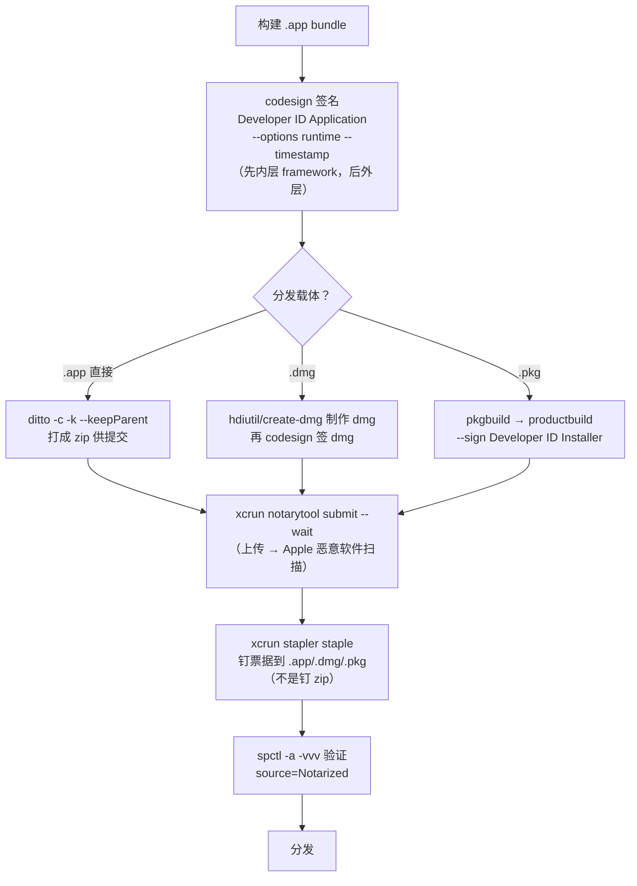

---
tags:
  - packaging
  - tier3
  - macos
  - codesign
  - notarization
  - dmg
---
# macOS 应用打包

> [!abstract] TL;DR
> macOS 分发的三种载体：**`.app` bundle**（应用本体，一个特殊目录）、**`.dmg`**（磁盘映像，拖拽安装的主流形态）、**`.pkg`**（安装器，`pkgbuild`+`productbuild` 生成，适合需装到系统目录/跑脚本的场景）。App Store 外分发的**硬性门槛是 Gatekeeper**：应用必须用 **Developer ID 证书签名 + 启用硬化运行时（`--options runtime`）+ 经 Apple 公证（notarization）+ 装订票据（staple）**，否则用户双击会被拦「无法打开，来自身份不明的开发者」。现代公证工具是 **`xcrun notarytool`**（Xcode 13 起取代已废弃的 `altool`）：先 `store-credentials` 存凭据，再 `submit --wait` 上传等结果，最后 `xcrun stapler staple` 把票据钉进 `.app`/`.dmg`/`.pkg`（钉在产物上、不是提交用的 zip）。全流程：**build → codesign → 打包 → notarytool submit → stapler staple → spctl 验证**。

## 概述与定位

macOS 的打包与前三个平台都不同——它的「应用」本身就是一种打包格式。三种分发载体各有定位：

| 载体 | 本质 | 适用 |
|---|---|---|
| **`.app` bundle** | 一个 `MyApp.app/` 目录，内含可执行文件 + 资源 + 元数据 | 应用本体；可直接拖进 `/Applications` |
| **`.dmg`** | 磁盘映像（disk image），双击挂载后拖拽 `.app` 到 `Applications` | **App Store 外分发最主流**的形态，可定制背景图引导拖拽 |
| **`.pkg`** | Installer 安装器，可装到任意路径、跑安装脚本 | 需装系统级组件、后台服务、或复杂安装逻辑时 |

无论哪种载体，绕不过的是 **Gatekeeper**——macOS 的应用准入机制。自 macOS 10.15（Catalina）起，从网上下载、要在别人机器上双击就能跑的应用，**必须同时满足**：用 Developer ID 证书签名、启用硬化运行时、通过 Apple 公证。否则用户会撞上「无法打开，因为无法验证开发者」的拦截。这条链路（签名 → 公证 → 装订）是本篇的主线，也是 macOS 打包相对 Linux/Windows 最独特、最容易卡住的地方。

与 [[../42.Cmake/24 - CPack 进阶打包|CPack]] 的关系：CPack 的 `DragNDrop` 生成器出 `.dmg`、`productbuild` 生成器出 `.pkg`、`Bundle` 生成器出 `.app`——但签名与公证仍需你在 CPack 之外用 `codesign`/`notarytool` 完成（或在 `CPACK_*_POST_BUILD` 钩子里调）。理解本篇机制，才能把这条链接上。

## 原理与机制

### `.app` bundle 结构

一个 `.app` 是遵循固定布局的目录：

```
MyApp.app/
└── Contents/
    ├── Info.plist          # 元数据：CFBundleIdentifier / Version / 可执行名 / 最低系统
    ├── MacOS/MyApp         # 主可执行文件
    ├── Resources/          # 图标(.icns)、本地化、资源
    ├── Frameworks/         # 内嵌的第三方 .framework / .dylib
    └── _CodeSignature/     # 代码签名（codesign 生成）
```

`Info.plist` 里 `CFBundleIdentifier`（如 `com.example.myapp`）是应用的全局身份，签名、公证、TCC 权限都以它为键。

### 代码签名（codesign）

macOS 代码签名把签名嵌进 Mach-O 与 bundle，并记录一份「封印」（seal）——文件被改动即签名失效。要点：

- **两类 Developer ID 证书**：`Developer ID Application`（签 `.app`/`.dmg`）与 `Developer ID Installer`（签 `.pkg`）。二者不同，别用错。
- **硬化运行时（Hardened Runtime）**：`codesign --options runtime` 启用，是**公证的前提**。它施加一组运行时保护（禁止未签名代码注入、限制 DYLD 环境变量、默认关闭调试挂靠等）。签名后 `codesign -d --verbose` 应看到 `flags=0x10000(runtime)`。
- **entitlements**：一份 plist 声明应用需要的例外能力（如 JIT `com.apple.security.cs.allow-jit`、禁用库校验等）。硬化运行时下，某些能力必须显式 entitlement 才可用。原则是**最小化**——只申请真正需要的。
- **安全时间戳**：`--timestamp` 向 Apple 时间戳服务器打时间戳，让签名在证书过期后仍有效（同 Windows Authenticode 的时间戳意义）。
- **嵌套签名自底向上**：bundle 内的 `.framework`/`.dylib`/helper 必须**先于外层**签名（先内后外），`--deep` 可递归但不总可靠，复杂应用应逐个显式签。

### Gatekeeper、隔离位与公证

- **隔离位（quarantine）**：从浏览器/网络下载的文件会被打上 `com.apple.quarantine` 扩展属性。首次打开时 Gatekeeper 据此触发校验。
- **公证（Notarization）**：把签好的产物上传到 **Apple 公证服务**，它做**自动恶意软件扫描**（**不是** App Review 人工审核，只查恶意代码与签名/硬化运行时合规），通过后签发一张「公证票据（ticket）」。
- **装订（Stapling）**：`stapler staple` 把公证票据**钉进产物**，这样即使用户离线，Gatekeeper 也能就地验证，无需联网查询。不装订则每次首启都要联网确认。

## 打包与公证全流程详解



### codesign 命令

```bash
# 先签内嵌 framework（自底向上），每个都要硬化运行时 + 时间戳
codesign --force --timestamp --options runtime \
    --sign "Developer ID Application: Your Name (TEAMID)" \
    "MyApp.app/Contents/Frameworks/Foo.framework"

# 再签整个 app（--entitlements 按需）
codesign --force --deep --timestamp --options runtime \
    --entitlements entitlements.plist \
    --sign "Developer ID Application: Your Name (TEAMID)" \
    "MyApp.app"

# 验证
codesign --verify --deep --strict --verbose=2 "MyApp.app"
codesign -d --verbose=4 "MyApp.app"   # 看 flags=0x10000(runtime)
```

### 公证：notarytool

**第一步：存凭据**（一次性，之后用 profile 名引用）。密码是 [appleid.apple.com](https://appleid.apple.com) 生成的 **App 专用密码**，不是登录密码（也可用 App Store Connect API Key）：

```bash
xcrun notarytool store-credentials "notary-profile" \
    --apple-id "you@example.com" \
    --team-id "TEAMID" \
    --password "abcd-efgh-ijkl-mnop"
```

**第二步：提交并等待**：

```bash
# .app 需先 zip（用 ditto 保留 bundle 结构，别用普通 zip）
ditto -c -k --keepParent "MyApp.app" "MyApp.zip"

xcrun notarytool submit "MyApp.zip" \
    --keychain-profile "notary-profile" --wait
# 成功以 status: Accepted 结束；失败用 log 查原因
xcrun notarytool log <submission-id> --keychain-profile "notary-profile" log.json
```

`.pkg`/`.dmg` 可直接提交（无需 zip）。`log` 子命令是排障关键——最常见的拒绝原因是**嵌套 framework 漏签或未启用硬化运行时**，log 会逐个列出。

**第三步：装订票据**（钉在**产物本体**上，不是提交用的 zip）：

```bash
xcrun stapler staple "MyApp.app"     # 或 MyApp.dmg / MyApp.pkg
xcrun stapler validate "MyApp.app"
```

## 工具视角与实战

### 完整 .dmg 分发链

```bash
# 1. 签 app（含内嵌）
codesign --force --deep --timestamp --options runtime \
    --sign "Developer ID Application: Your Name (TEAMID)" MyApp.app

# 2. 做 dmg（create-dmg 可加背景图/图标布局；也可 hdiutil create）
create-dmg --volname "MyApp" --app-drop-link 450 200 \
    MyApp-1.2.3.dmg MyApp.app
codesign --force --timestamp \
    --sign "Developer ID Application: Your Name (TEAMID)" MyApp-1.2.3.dmg

# 3. 公证 dmg
xcrun notarytool submit MyApp-1.2.3.dmg --keychain-profile "notary-profile" --wait

# 4. 装订 + 验证
xcrun stapler staple MyApp-1.2.3.dmg
spctl -a -t open --context context:primary-signature -vvv MyApp-1.2.3.dmg
```

### .pkg 安装器链

```bash
# component pkg：把 payload 打成组件包（--install-location 指定安装路径，--scripts 附脚本）
pkgbuild --root ./payload --identifier com.example.myapp \
    --version 1.2.3 --install-location /Applications \
    --scripts ./scripts MyApp-component.pkg

# product archive：包装成可分发 pkg 并签名（Installer 证书）
productbuild --distribution distribution.xml \
    --package-path . \
    --sign "Developer ID Installer: Your Name (TEAMID)" MyApp-1.2.3.pkg

# 公证 + 装订同上（pkg 可直接 submit）
xcrun notarytool submit MyApp-1.2.3.pkg --keychain-profile "notary-profile" --wait
xcrun stapler staple MyApp-1.2.3.pkg
```

### Gatekeeper 评估验证

```bash
spctl -a -vvv MyApp.app                 # 评估可执行；期望 source=Notarized Developer ID
spctl -a -vvv -t install MyApp.pkg      # 评估安装器
xcrun stapler validate MyApp.dmg        # 确认票据已钉牢
```

App Store 分发则是另一条路（Xcode Organizer 或 Transporter 上传，走 App Review），不经 Developer ID 公证链。

### entitlements 与两种沙箱

`--entitlements` 指向的 plist 声明应用的能力例外，但要分清**两套不同机制**：

- **Hardened Runtime**（Developer ID / 公证分发用）：默认施加运行时保护，需要例外才用 `com.apple.security.cs.*`（如 `allow-jit`、`allow-unsigned-executable-memory`、`disable-library-validation`）——每开一项都削弱防护、且可能触发公证告警，务必最小化。
- **App Sandbox**（Mac App Store **强制**）：`com.apple.security.app-sandbox=true`，把应用关进更严格沙箱，文件/网络/硬件访问都要显式 entitlement（`files.user-selected.read-write`、`network.client` 等）。

分发渠道决定选择：App Store → App Sandbox；官网/DMG 直发 → Hardened Runtime + 公证（通常不开 App Sandbox）。Developer ID 分发**不强制** App Sandbox，但**强制**硬化运行时。

### 常见公证失败与排查

公证被拒时，`xcrun notarytool log <id>` 的 JSON 会逐条列出原因，最常见几类：

- **含未签名的嵌套代码**：`.app` 里的 framework/dylib/helper 漏签。自底向上逐个 `codesign`，别只靠 `--deep`（复杂嵌套下不可靠）。
- **未启用硬化运行时**：某可执行缺 `--options runtime`。
- **无安全时间戳**：漏了 `--timestamp`。
- **entitlements 不被接受**，或**误带 `com.apple.security.get-task-allow`**（调试 entitlement，发布构建应去掉）。

排查节奏：本地先 `codesign --verify --deep --strict` 过，再提交；失败查 log → 逐个补签 → 重签外层 → 重新提交、重新装订。

## 安全性与正确使用

- **证书私钥保护**：Developer ID 证书是你的发布身份，泄露即被冒名；存于 Keychain、CI 中用临时 keychain 导入、用后清理。
- **App 专用密码/API Key 非登录密码**：`notarytool` 凭据用 App 专用密码或 App Store Connect API Key，绝不用主 Apple ID 密码。
- **硬化运行时 + 最小 entitlements**：`--options runtime` 是公证前提；entitlements 只申请必需项（滥申 `allow-unsigned-executable-memory`、禁用库校验等会削弱防护、也可能被公证拒）。
- **公证 ≠ 审核**：公证只做恶意软件扫描与合规校验，通过不代表 Apple 为功能背书；但**它是 App Store 外分发的硬门槛**。
- **嵌套签名顺序**：先内后外；漏签任一内嵌 framework/helper 会导致公证失败或运行时崩溃。
- **隔离位**：分发的 dmg/pkg 若已签名公证装订，用户下载后首启即被放行；未装订则依赖联网校验，离线或网络异常会卡。

> **合规边界**：本篇用于分发**你自有或获授权**的软件，需加入 Apple Developer Program（99 美元/年）并用**本人/本组织**的 Developer ID 证书签名。用他人证书签名、伪造 bundle 身份、绕过 Gatekeeper 分发未公证的恶意软件均违规违法。

## 小结

- **三载体**：`.app`（本体）/`.dmg`（拖拽安装，主流）/`.pkg`（安装器，`pkgbuild`+`productbuild`）。
- **Gatekeeper 门槛**：App Store 外分发必须 Developer ID 签名 + 硬化运行时 + 公证 + 装订。
- **签名**：`codesign --options runtime --timestamp`，Application 证书签 app/dmg、Installer 证书签 pkg，嵌套件自底向上先签。
- **公证**：`xcrun notarytool store-credentials` → `submit --wait` → 失败用 `log` 查（常因嵌套漏签）；`altool` 已废弃。
- **装订**：`xcrun stapler staple` 钉产物本体（非 zip），支持离线校验；`spctl -a -vvv` 验证 `source=Notarized`。
- **载体链**：dmg 用 `create-dmg`/`hdiutil` + 签名；pkg 用 `pkgbuild`→`productbuild --sign Installer`。

## 相关阅读

- [Notarizing macOS software before distribution](https://developer.apple.com/documentation/security/notarizing-macos-software-before-distribution)（`developer.apple.com`）
- [Customizing the notarization workflow](https://developer.apple.com/documentation/security/customizing-the-notarization-workflow)（`developer.apple.com`）
- `man` 页：`codesign(1)`、`productbuild(1)`、`pkgbuild(1)`、`spctl(8)`；`xcrun notarytool --help`、`xcrun stapler --help`
- 本系列第 03 篇：[[03.Windows应用打包]]——签名/时间戳思路可与 Authenticode 对照
- [[../42.Cmake/24 - CPack 进阶打包|42 系列 · CPack 进阶打包]]——CPack 的 DragNDrop/productbuild/Bundle 生成器

---

[[00.打包与分发总览|⬆ 系列总览]] | [[04.Docker与OCI镜像打包|← 上一章]] | [[06.通用Linux打包|→ 下一章]]
