---
tags:
  - packaging
  - tier3
  - linux
  - appimage
  - flatpak
  - snap
---
# 通用 Linux 打包：AppImage / Flatpak / Snap

> [!abstract] TL;DR
> 原生 `.deb`/`.rpm` 是**按发行版**打包的——每个发行版、每个版本都要重打一次，还受宿主库版本约束。**通用（distro-agnostic）格式**用「一份产物跑遍所有发行版」解决这个痛点，三条主流路线各有取舍：**AppImage**——单文件、免安装、免 root，把依赖全塞进一个自挂载（FUSE）的可执行文件，最轻量但**默认无沙箱**；**Flatpak**——基于**共享 Runtime + SDK**构建，bubblewrap 沙箱 + `finish-args` 授权 + Portals 访问宿主，走 **Flathub** 分发，桌面应用生态最活跃；**Snap**——`snapcraft.yaml` 定义、`base`（`core22`/`core24`=Ubuntu LTS）打底、**confinement**（`strict`/`classic`/`devmode`）+ 接口（plugs/slots）授权，走 Snap Store，Ubuntu 主推、含服务端场景。选型口诀：**要最简单可移植→AppImage；要沙箱化桌面应用 + Flathub→Flatpak；要 Ubuntu 生态/自动更新/服务端→Snap。**

## 概述与定位

[[01.Linux原生打包-dpkg与deb|deb]] 和 [[02.Linux原生打包-rpmbuild与rpm|rpm]] 有个结构性局限：它们是**发行版专属**的。Ubuntu 20.04 打的 `.deb` 未必能装到 22.04（`libc6` 版本要求可能不匹配），Fedora 的 `.rpm` 更不能装到 Debian。要覆盖 N 个发行版 × M 个版本，就得维护 N×M 份打包与构建环境。**通用 Linux 打包格式**的价值就是打破这个矩阵——**打一份，到处跑**。

三条路线的哲学差异很大：

| 维度 | AppImage | Flatpak | Snap |
|---|---|---|---|
| 形态 | 单个 `.AppImage` 文件 | OSTree 仓库中的应用 + Runtime | squashfs `.snap` |
| 安装 | **免安装**，`chmod +x` 双击即跑 | `flatpak install` | `snap install` |
| 依赖 | **全部打进单文件** | 共享 **Runtime**（去重） | `base` + parts 打包 |
| 沙箱 | **默认无**（可选加固） | bubblewrap，默认强隔离 | AppArmor+seccomp，confinement 分级 |
| 授权模型 | 无 | `finish-args` + Portals | 接口 plugs/slots |
| 分发 | 任意（自托管/GitHub Release） | **Flathub**（git 仓库存 manifest） | **Snap Store** |
| 自动更新 | 可选（zsync/AppImageUpdate） | `flatpak update` | **内建自动更新** |
| 主推方 | 社区 | freedesktop/GNOME/KDE | Canonical/Ubuntu |

它们与原生包不是替代而是**互补**：系统级组件、需进包依赖图/systemd 深度集成的 → 原生 deb/rpm；跨发行版分发的桌面/独立应用 → 通用格式。

## 原理与机制

### AppImage：自挂载的单文件

一个 `.AppImage` 是「一段小的运行时 ELF + 一个 squashfs 文件系统镜像」拼接而成。运行时它用 **FUSE** 把内嵌的 squashfs（即 **AppDir**）挂载到临时挂载点，然后执行里面的 `AppRun`。因此：**无需安装、无需 root、不写系统目录**，删掉文件就等于卸载。代价是**依赖必须全部自带**（不共享、体积较大），且**默认没有沙箱**——它就是一个把依赖打包好的普通程序，权限与直接运行二进制无异。

关键是**可再定位性**：程序内不能有硬编码的 `/usr` 绝对路径（否则从挂载点跑会找不到自带的库），要靠 `AppRun` 里设 `LD_LIBRARY_PATH`、或 `patchelf` 改 rpath、或程序用相对路径。

### Flatpak：共享 Runtime + 沙箱

Flatpak 的核心设计是**应用与 Runtime 分离**：应用不自带整套基础库，而是声明依赖某个 **Runtime**（如 `org.freedesktop.Platform`、`org.gnome.Platform`、`org.kde.Platform` 的某个版本），Runtime 由 Flatpak 统一安装、多应用共享（OSTree 内容寻址存储去重，省空间）。开发时对应的是 **SDK**（`org.freedesktop.Sdk`）。

运行时用 **bubblewrap** 建沙箱，应用默认**几乎无法访问宿主**——文件系统、网络、设备、DBus 都被隔离。要用这些资源，需在 manifest 的 **`finish-args`** 里显式开权限（`--socket=wayland`、`--share=network`、`--filesystem=home` 等）；对敏感资源（文件选择、打印、屏幕共享）走 **Portals**（用户可见的授权对话框），比直接开 `--filesystem=host` 更安全。

### Snap：base + confinement + 接口

Snap 是只读挂载的 squashfs。每个 snap 声明一个 **`base`**（`core22`=Ubuntu 22.04 库集、`core24`=24.04），提供运行环境。隔离由 **confinement** 分级 + 内核 LSM（**AppArmor** + **seccomp**）强制：

- **`strict`**（推荐默认）：强沙箱，能力须经**接口（interface）**显式声明与连接。
- **`classic`**：几乎无沙箱、可读写全盘，用于编译器/IDE/shell 工具这类天生无法沙箱化的程序；**发布前须经 Snap Store 人工审核**，安装要 `--classic`。
- **`devmode`**：开发用，违规只告警不拦截。

能力通过**接口**授予：`plugs`（消费方，应用声明）连到 `slots`（提供方）。安全接口自动连（如 `network`），敏感接口（如 `camera`）需用户手动 `snap connect`。`snapd` 守护进程管理安装、接口、**自动更新**（这是 Snap 相对其他两者的显著特性）。

## 结构/流程详解

```mermaid
flowchart TD
    subgraph AI["AppImage：自包含单文件"]
        A1["AppDir/<br/>AppRun · .desktop · icon · usr/"] --> A2["appimagetool / linuxdeploy"]
        A2 --> A3["MyApp-x86_64.AppImage<br/>（FUSE 自挂载，免安装）"]
    end
    subgraph FP["Flatpak：Runtime + 沙箱"]
        F1["manifest（app-id/runtime<br/>/sdk/finish-args/modules）"] --> F2["flatpak-builder"]
        F2 --> F3["OSTree 仓库 / .flatpak bundle"]
        F3 --> F4["Flathub 分发"]
    end
    subgraph SN["Snap：base + confinement"]
        S1["snapcraft.yaml（base/confinement<br/>/apps/parts/plugs）"] --> S2["snapcraft"]
        S2 --> S3["myapp.snap（squashfs）"]
        S3 --> S4["Snap Store 分发"]
    end
```



### AppImage：AppDir + 打包工具

AppDir 是 AppImage 的输入目录，四要素：`AppRun`（启动脚本/可执行，设环境并拉起主程序）、`.desktop`（**`Categories=` 必需**，appimagetool 强制）、图标（名与 `.desktop` 的 `Icon=` 一致）、`usr/`（程序与库）：

```
MyApp.AppDir/
├── AppRun                 # export LD_LIBRARY_PATH=... ; exec usr/bin/myapp "$@"
├── myapp.desktop          # [Desktop Entry] Type=Application Exec=myapp Icon=myapp Categories=Utility;
├── myapp.png
└── usr/{bin/myapp, lib/*.so}
```

两种打法：

```bash
# 方式一：已备好完整 AppDir，直接打
ARCH=x86_64 ./appimagetool-x86_64.AppImage MyApp.AppDir MyApp-x86_64.AppImage

# 方式二：linuxdeploy 自动分析二进制依赖、拷库、建 AppDir，再出 AppImage（推荐）
./linuxdeploy-x86_64.AppImage --appdir MyApp.AppDir \
    --executable myapp --desktop-file myapp.desktop --icon-file myapp.png \
    --plugin qt \                       # 框架插件：自动带 Qt 插件/库
    --output appimage
chmod +x MyApp-x86_64.AppImage && ./MyApp-x86_64.AppImage
```

`linuxdeploy` 的插件体系（`--plugin qt`/`gtk` 等）能自动处理框架的插件与运行时依赖，比手工 AppDir 省心得多。

### Flatpak：manifest + flatpak-builder

manifest（JSON 或 YAML）声明 app-id、Runtime/SDK、构建模块、沙箱权限：

```yaml
# org.example.MyApp.yaml
app-id: org.example.MyApp
runtime: org.freedesktop.Platform
runtime-version: '23.08'
sdk: org.freedesktop.Sdk
command: myapp
finish-args:
  - --socket=wayland
  - --socket=fallback-x11
  - --share=ipc
  - --device=dri
  - --filesystem=xdg-documents      # 只给文档目录，而非整个 home
modules:
  - name: myapp
    buildsystem: cmake-ninja
    sources:
      - type: archive
        url: https://example.com/myapp-1.2.3.tar.gz
        sha256: <hash>
```

```bash
# 构建并装到本地测试
flatpak-builder --user --install --force-clean build-dir org.example.MyApp.yaml
flatpak run org.example.MyApp
# 导出单文件 bundle（离线分发）
flatpak build-bundle repo MyApp.flatpak org.example.MyApp
```

**Flathub 发布**：向 Flathub 的 GitHub 组织提一个含 manifest 的仓库，Flathub 的 CI 据此构建并托管——用户 `flatpak install flathub org.example.MyApp` 即可，一个分发点覆盖所有发行版。

### Snap：snapcraft.yaml

```yaml
name: myapp
base: core24
version: '1.2.3'
summary: 演示应用
description: |
  一个跨发行版 Snap 示例。
grade: stable            # stable / devel
confinement: strict      # strict / classic / devmode

apps:
  myapp:
    command: bin/myapp
    plugs: [home, network, network-bind, wayland, x11]

parts:
  myapp:
    plugin: cmake
    source: https://github.com/example/myapp.git
    build-packages: [gcc, make]
    stage-packages: [libfoo1]     # 运行时要带的库
```

```bash
snapcraft            # 在项目根构建出 myapp_1.2.3_amd64.snap（现代常用 LXD/multipass 隔离构建）
snap install --dangerous ./myapp_1.2.3_amd64.snap   # 本地装未签名包测试
snapcraft upload --release=stable myapp_1.2.3_amd64.snap   # 传 Snap Store
```

`parts` 描述「怎么构建」（`plugin` 选构建插件、`source` 取源、`stage-packages` 带运行时库），`apps` 描述「暴露哪些命令 + 需要哪些接口」。

## 工具视角与实战

### 安装与运行速查

```bash
# AppImage：免安装
chmod +x MyApp.AppImage && ./MyApp.AppImage
./MyApp.AppImage --appimage-extract      # 解包查看内部 AppDir

# Flatpak
flatpak install flathub org.example.MyApp
flatpak run org.example.MyApp
flatpak info --show-permissions org.example.MyApp   # 查沙箱权限
flatpak override --user --nofilesystem=home org.example.MyApp  # 收紧权限

# Snap
sudo snap install myapp                  # strict/默认
sudo snap install code --classic         # classic 需显式 --classic
snap connections myapp                    # 查接口连接
sudo snap connect myapp:camera            # 手动连敏感接口
```

### 三者与原生包的选型

- **只想让二进制在任意发行版双击就跑、不折腾**：AppImage。
- **桌面 GUI 应用、要沙箱隔离、想上 Flathub 覆盖全发行版**：Flatpak。
- **Ubuntu 生态、要自动更新、含 CLI/服务端、或要 IoT（Ubuntu Core）**：Snap。
- **系统组件、驱动、需进 apt/dnf 依赖图、systemd 服务**：仍用原生 [[01.Linux原生打包-dpkg与deb|deb]]/[[02.Linux原生打包-rpmbuild与rpm|rpm]]。

### Portals：安全地访问宿主

Flatpak/Snap 的沙箱默认挡住宿主访问，但应用常需「打开用户选的文件」「截屏」「发通知」。**XDG Desktop Portals** 是解法：应用经 DBus 调门户，门户弹出**用户可见的系统对话框**（如文件选择器），用户选定后只把**那一个文件**的句柄交给应用——应用始终拿不到「整个 home 的读权限」。这比直接 `--filesystem=host`/`--filesystem=home` 安全得多：后者是「一次性全开」，门户是「按需、按用户意图、按单资源」授权。写 Flatpak manifest 时应优先让应用走门户（GTK/Qt 的文件对话框在 Flatpak 下会自动用门户），而非在 `finish-args` 里开大范围文件系统权限。

### 更新机制与体积权衡

三格式的更新与体积特性差异明显，直接影响运维选型：

- **AppImage**：无内建更新；可选 `zsync` + AppImageUpdate 做**增量更新**（只下差异块）。单文件自带全部依赖 → 体积最大，多个 AppImage 各带一份相同库、不共享。
- **Flatpak**：OSTree 内容寻址 → **跨应用共享 Runtime/库、增量更新（只传变化对象）**，装多个应用时长期占用最省。
- **Snap**：squashfs + delta 更新，`snapd` **默认自动后台更新**（可 `snap refresh --hold` 暂停）；`base` 共享、应用私有部分不共享。

若在意「用户零操作自动更新」→ Snap；在意「省磁盘、共享 Runtime」→ Flatpak；在意「一个文件拷走就能跑」→ AppImage。

## 安全性与正确使用

- **沙箱模型差异是安全关键**：AppImage **默认无沙箱**（与直接跑二进制同权限，别把它当隔离手段）；Flatpak/Snap 默认强隔离，安全性显著更高。
- **权限最小化**：Flatpak 的 `finish-args` 不要图省事写 `--filesystem=host`/`--talk-name=org.freedesktop.*` 全开；优先用 `xdg-*` 细粒度目录 + Portals。Snap 只声明必需 `plugs`，敏感接口交由用户手动连。
- **签名与完整性**：Flatpak 基于 OSTree，仓库用 GPG 签名（`flatpak remote-add --gpg-import`）；Snap 由 Snap Store 统一签名分发（`snap install` 校验）；AppImage 可**内嵌 GPG 签名**（`appimagetool --sign`）并配合 `zsync`/AppImageUpdate 做增量更新与校验——但 AppImage 的签名需用户主动验证，默认不强制。
- **classic confinement 审核**：Snap 的 `classic` 等于放弃沙箱，Store 会人工审核；除非确属编译器/IDE 类无法沙箱化的工具，否则用 `strict`。
- **AppImage 可再定位陷阱**：硬编码 `/usr` 路径会导致「本机能跑、AppImage 里找不到库」，用 `linuxdeploy` 自动处理 rpath/`LD_LIBRARY_PATH` 可规避。

> **合规边界**：本篇用于打包**你自有或获授权**的软件。AppImage/Flatpak/Snap 会把第三方 Runtime/库/base 一并分发，须遵守各自许可证（Flatpak Runtime、Snap base、bundle 的库）；在应用元数据中如实声明许可，勿分发未授权的付费/闭源组件。

## 小结

- **通用格式解决「按发行版重打包」痛点**：一份产物跑遍所有发行版，与原生 deb/rpm 互补。
- **AppImage**：单文件 + FUSE 自挂载 + 免安装免 root + 依赖全自带；**默认无沙箱**；`appimagetool`（备好 AppDir）/`linuxdeploy`（自动拷依赖 + 框架插件）；注意可再定位性。
- **Flatpak**：共享 Runtime/SDK + bubblewrap 沙箱 + `finish-args`/Portals 授权；`flatpak-builder` 构建，Flathub（git 仓库存 manifest）分发。
- **Snap**：`snapcraft.yaml`（`base`/`confinement`/`apps`/`parts`/`plugs`）；AppArmor+seccomp 强制；`strict`/`classic`（需审核+`--classic`）/`devmode`；接口 plugs/slots；内建自动更新，Snap Store 分发。
- **选型**：最简可移植→AppImage；沙箱桌面应用+Flathub→Flatpak；Ubuntu 生态/自动更新/服务端→Snap；系统集成→原生包。
- **安全**：AppImage 无沙箱要当心；Flatpak/Snap 权限最小化；三者签名机制不同（OSTree GPG / Store 签名 / AppImage 内嵌签名）。

## 相关阅读

- [Flatpak 文档 · Manifests](https://docs.flatpak.org/en/latest/manifests.html)（`docs.flatpak.org`）、[Flathub 提交](https://docs.flathub.org/)（`docs.flathub.org`）
- [Snapcraft 文档](https://snapcraft.io/docs)（`snapcraft.io`）—— snapcraft.yaml、confinement、interfaces
- [AppImage 打包指南](https://docs.appimage.org/)（`docs.appimage.org`）、[linuxdeploy](https://github.com/linuxdeploy/linuxdeploy)（`github.com`）
- 本系列第 01/02 篇：[[01.Linux原生打包-dpkg与deb]] / [[02.Linux原生打包-rpmbuild与rpm]]——原生包（互补对照）
- 本系列第 04 篇：[[04.Docker与OCI镜像打包]]——容器镜像是另一种「带环境分发」的思路

---

[[00.打包与分发总览|⬆ 系列总览]] | [[05.macOS应用打包|← 上一章]] | [[07.deb打包参数与语法详解|→ 下一章]]
