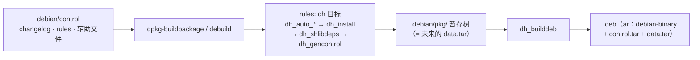

---
tags:
  - packaging
  - tier3
  - linux
  - debian
  - dpkg
  - reference
---
# deb 打包参数与语法详解

> [!abstract] TL;DR
> 本篇是 [[01.Linux原生打包-dpkg与deb|第 01 篇]] 的**参数/语法参考册**：把 `debian/` 里各文件的字段、`debhelper` 的 `dh_*` 命令、`rules` 的 override 机制、以及 `dpkg-buildpackage`/`debuild`/`dpkg-deb` 的命令行选项**逐条列全**。`control` 用 **deb822**（RFC822 风格）语法，分 source 段与 binary 段，依赖字段支持 `(>= 1.2)` 版本关系与 `${shlibs:Depends}` 等 **substvar 占位符**；`rules` 是委托给 `dh $@` 的 Makefile，定制靠 `override_dh_<name>:`；`changelog` 顶行 `包名 (版本) 发行版; urgency=` 决定包名版本与 `SOURCE_DATE_EPOCH`；`copyright` 走 **DEP-5** 机器可读格式。命令层记住 `dpkg-buildpackage -b/-S/-us/-uc`、`debuild`、`dpkg-deb --build/-e/-x/-c/-I`、以及 `DEB_BUILD_OPTIONS`（`nocheck`/`parallel=N`）与 `dpkg-buildflags`（hardening）。

## 概述与定位

第 01 篇讲的是「deb 打包的原理与流程」——够你打出第一个包、理解维护者脚本为何那样跑。但真到写复杂包时，你会不断查：control 到底有哪些字段？`dh` 序列里 `dh_installsystemd` 在第几步？`dpkg-buildpackage` 的 `-b` 和 `-B` 差在哪？`changelog` 的 urgency 有哪些取值？本篇就是这本**查得到、抄得走的参数语法册**——按「文件语法 → debhelper → 命令选项」组织，配速查表。它是 01 的深度延伸，建议先读完 01 的原理，再把本篇当手册用。

deb 打包的「配置」几乎全在文本文件里（control/rules/changelog/copyright/各辅助文件），命令行只是触发构建与打包。所以掌握 deb 打包 = 掌握这些文件的语法 + 少数几条命令的选项。下面逐块拆解。

## 原理与机制

### deb822：control 类文件的通用语法

`debian/control`、`.dsc`、`Packages`、`copyright`（DEP-5）都用同一种语法，叫 **deb822**（源自 RFC822 邮件头风格）：

- **字段**：`字段名: 值`，字段名大小写不敏感但惯例首字母大写（`Build-Depends`）。
- **段（stanza/paragraph）**：多个字段成一段，段与段之间用**一个空行**分隔。`control` 的第一段是 source 段，后续每段是一个 binary 包。
- **续行**：值跨多行时，续行以**至少一个空格**开头。在 `Description` 里，`空格.` 表示空行、`空格 ` 后接文本是普通续行。
- **注释**：`debian/control` 支持以 `#` 开头的整行注释（部分 deb822 文件不支持，`copyright` 支持）。
- **列表字段**：`Depends`、`Build-Depends` 等用逗号分隔项，`|` 表示「或」（`Depends: foo | bar`）。

### substvar：构建期填充的占位符

`control` 里形如 `${name:key}` 的记号是 **substitution variable**，在 `dh_gencontrol` 时从 `debian/substvars` 与内建来源替换。常用：

| substvar | 来源 | 用途 |
|---|---|---|
| `${shlibs:Depends}` | `dh_shlibdeps` 扫描 ELF | 共享库依赖 |
| `${misc:Depends}` | 各 `dh_*` 汇集 | debhelper 认为必需的杂项依赖 |
| `${binary:Version}` | 内建 | 当前二进制包的完整版本（同源多包互相精确依赖用） |
| `${source:Version}` | 内建 | 源码包版本 |
| `${perl:Depends}`/`${python3:Depends}` | 语言 helper | 语言运行时依赖 |

`Depends: ${shlibs:Depends}, ${misc:Depends}` 是几乎每个 binary 段的标配。

### 从 debian/ 到 .deb 的流水线

把本篇各文件在构建中的位置串成一图：`control`/`changelog`/`rules` 与辅助文件是输入，`dpkg-buildpackage` 驱动 `rules` 里的 `dh` 序列，把产物装进暂存树，再打成 `ar` 三成员的 `.deb`：



理解这条链，就知道每个字段最终去了哪：`control` 的元数据经 `dh_gencontrol` 填好 substvar 后进 `control.tar`；辅助文件（`.install`/`.links`…）对应的文件经 `dh_install` 进暂存树、最终进 `data.tar`；`changelog`/`copyright` 被 `dh_installchangelogs`/`dh_installdocs` 装进 `data.tar` 的 `/usr/share/doc/<pkg>/`。查任何字段/命令时，先想清它作用在这条链的哪一环，语义就不易记错。

## 结构/语法逐项详解

### `debian/control` 字段全表

**Source 段字段**：

| 字段 | 必需 | 说明 |
|---|---|---|
| `Source` | ✔ | 源码包名 |
| `Maintainer` | ✔ | `姓名 <邮箱>` |
| `Uploaders` | | 协同维护者列表 |
| `Section` | ✔(建议) | 归类：`utils`/`devel`/`libs`/`net`/`admin`… |
| `Priority` | | `optional`（默认）/`required`/`important`/`standard` |
| `Build-Depends` | | 构建期依赖（任意架构构建都需要） |
| `Build-Depends-Indep` | | 只构建 `Architecture: all` 包时的额外依赖 |
| `Build-Depends-Arch` | | 只构建架构相关包时的额外依赖 |
| `Standards-Version` | ✔ | 遵循的 Debian Policy 版本（如 `4.6.2`） |
| `Homepage` | | 上游主页 |
| `Vcs-Git`/`Vcs-Browser` | | 打包仓库地址 |
| `Rules-Requires-Root` | | `no`（现代推荐，构建不需 fakeroot/root）/`binary-targets` |

**Binary 段字段**：

| 字段 | 说明 |
|---|---|
| `Package` | 二进制包名 |
| `Architecture` | `any`（架构相关）/`all`（架构无关）/`amd64` 等具体架构 |
| `Multi-Arch` | `same`（可多架构共存的库）/`foreign`（架构无关接口）/`allowed` |
| `Depends` | 硬依赖（配置前必须满足） |
| `Pre-Depends` | 解包前必须完全装好（慎用） |
| `Recommends` | 强建议（apt 默认装） |
| `Suggests` | 弱建议 |
| `Enhances` | 声明增强某包 |
| `Breaks` | 与某版本不能同时配置 |
| `Conflicts` | 不能同时解包 |
| `Provides` | 提供虚拟包名 |
| `Replaces` | 接管其他包的文件 |
| `Built-Using` | 静态链入的源码包（许可合规追踪） |
| `Description` | 首行短描述 + 续行长描述 |

**版本关系语法**：`(>= 1.2)`（大于等于）、`(<= 1.2)`、`(= 1.2-1)`、`(<< 2.0)`（严格小于）、`(>> 1.0)`（严格大于）。架构限定：`foo [amd64 arm64]`（仅这些架构需要）、`foo [!i386]`（除外）。Profile 限定：`foo <!nocheck>`。

### `debian/rules` 与 debhelper

`rules` 是可执行 Makefile，现代最小形态 `%: \n\tdh $@`。**`dh` 序列** 按目标（`build`/`binary`/`install`/`clean`）展开成 `dh_*` 命令。二进制构建（`dh binary`）的核心序列与职责：

| dh_* 命令 | 职责 |
|---|---|
| `dh_auto_configure` | 探测并跑 `./configure`/`cmake`/`meson` |
| `dh_auto_build` | `make`/`ninja` |
| `dh_auto_test` | `make check`（`DEB_BUILD_OPTIONS=nocheck` 可跳过） |
| `dh_auto_install` | `make install DESTDIR=debian/<pkg>` |
| `dh_install` | 按 `.install` 文件二次分发到各包目录 |
| `dh_installdocs`/`dh_installchangelogs`/`dh_installman` | 装文档/changelog/man |
| `dh_installsystemd`/`dh_installinit` | 装并启用 systemd 单元/init 脚本 |
| `dh_link` | 按 `.links` 建符号链接 |
| `dh_strip` | 剥离调试符号，生成 `-dbgsym` |
| `dh_makeshlibs` | 为本包共享库生成 `shlibs`/`symbols` |
| `dh_shlibdeps` | 计算 `${shlibs:Depends}` |
| `dh_fixperms` | 规范文件权限 |
| `dh_compress` | 压缩文档（man、changelog） |
| `dh_md5sums` | 生成 `md5sums` |
| `dh_gencontrol` | 填 substvars，生成最终 `control` |
| `dh_builddeb` | 打成 `.deb` |

**定制机制**：

```makefile
#!/usr/bin/make -f
# 启用插件序列（systemd、python3、sphinxdoc 等）
%:
	dh $@ --with systemd,python3

# 覆盖某一步
override_dh_auto_configure:
	dh_auto_configure -- -DENABLE_X=ON

# 在某步前/后插入（debhelper 12+）
execute_after_dh_auto_install:
	rm -f debian/mypkg/usr/lib/*.la

# 完全跳过某步（留空规则）
override_dh_auto_test:
```

`dh` 常用参数：`-p<pkg>`/`-N<pkg>`（只对/排除某包）、`--list`（列出可用序列命令）、`--with`/`--without`（加载/卸载插件序列）。

### 辅助文件（`debian/<pkg>.*`）语法

不写代码、只用声明式辅助文件就能完成大部分安装动作，`dh_*` 会读取它们：

| 文件 | 语法/作用 |
|---|---|
| `<pkg>.install` | 每行 `源路径 [目标目录]`，把 `%{buildroot}` 里文件分发到包；支持通配 |
| `<pkg>.dirs` | 每行一个要创建的目录 |
| `<pkg>.links` | 每行 `源 目标`，建符号链接 |
| `<pkg>.docs`/`.examples`/`.manpages` | 列出文档/示例/man 页 |
| `<pkg>.default` | 装为 `/etc/default/<pkg>` |
| `<pkg>.service`/`.socket`/`.timer` | systemd 单元（`dh_installsystemd` 处理） |
| `<pkg>.postinst`/`.preinst`/`.prerm`/`.postrm` | 维护者脚本（见 01 篇六态流） |
| `<pkg>.triggers` | 触发器 `interest`/`activate` 声明 |
| `<pkg>.lintian-overrides` | 抑制特定 lintian 标签 |

### `debian/changelog` 语法

```
包名 (版本) 发行版[ 发行版2]; urgency=等级

  * 变更条目（缩进两空格 + 星号）
  * 关联 bug：(Closes: #123456)

 -- 维护者姓名 <邮箱>  RFC822 日期
```

- **发行版**：`unstable`/`stable`/`UNRELEASED`（未发布）/PPA 用 `focal`/`jammy` 等。
- **urgency**：`low`/`medium`（默认）/`high`/`critical`——影响迁移到 testing 的等待期。
- **尾行日期**：格式严格（`Wed, 02 Jul 2026 10:00:00 +0800`），也是 `SOURCE_DATE_EPOCH` 来源。
- **工具**：`dch`（新增条目）、`dch -r`（定版发布）、`dpkg-parsechangelog`（解析，构建系统读版本用它）。

### `debian/copyright`（DEP-5 机器可读格式）

```
Format: https://www.debian.org/doc/packaging-manuals/copyright-format/1.0/
Upstream-Name: hello
Source: https://example.com/hello

Files: *
Copyright: 2024-2026 Alice <alice@example.com>
License: MIT

Files: src/third_party/*
Copyright: 2020 Bob
License: BSD-3-Clause

License: MIT
 Permission is hereby granted, free of charge, ...
```

`Files:` 段用通配符匹配文件到版权/许可证；`License:` 独立段给许可证全文（可被多个 Files 段引用）。

### `debian/source/format` 与相关

- `3.0 (quilt)`：非原生包（上游 tar + `debian.tar` 补丁，补丁经 quilt 管理于 `debian/patches/`，`series` 文件列顺序）。
- `3.0 (native)`：原生包（Debian 自有软件，无独立上游 tar）。
- `debian/source/options`：如 `extend-diff-ignore`、压缩选项。

## 工具视角与实战

### `dpkg-buildpackage` 选项

从源码树构建包的主命令：

| 选项 | 作用 |
|---|---|
| `-b` | 只构建二进制包（arch 相关 + all） |
| `-B` | 只构建**架构相关**二进制包（不含 all，buildd 用） |
| `-A` | 只构建 `Architecture: all` 包 |
| `-S` | 只构建源码包（`.dsc`+tar，上传用） |
| `-us` | 不签名源码包（unsign source） |
| `-uc` | 不签名 `.changes`（unsign changes） |
| `-k<keyid>` | 指定签名 GPG 密钥 |
| `-j<N>` / `-jauto` | 并行构建度 |
| `-d` | 不检查 build-deps（不建议） |
| `-rfakeroot` | 用 fakeroot 提权（老默认，现代 `Rules-Requires-Root: no` 可免） |
| `--build=type` | `full`/`source`/`binary`/`any`/`all` 组合 |

常见组合：本地测试 `dpkg-buildpackage -us -uc -b`；上传 PPA `dpkg-buildpackage -S -sa`。

`debuild`（devscripts）= `dpkg-buildpackage` + 构建前 `dpkg-buildflags` 注入 + 构建后 `lintian`，还负责签名，日常更常用：`debuild -us -uc`。

### `dpkg-deb`：直接操作 `.deb`

| 命令 | 作用 |
|---|---|
| `dpkg-deb --build <dir> [out.deb]` | 从目录（含 `DEBIAN/`）打包 |
| `--root-owner-group` | 包内文件属主设为 root:root |
| `-e <deb> <dir>` | 抽取控制信息（control/scripts） |
| `-x <deb> <dir>` | 抽取数据（文件树，不含控制） |
| `-X <deb> <dir>` | 抽取数据并列出文件 |
| `-c <deb>` | 列出内容（= `--contents`） |
| `-I <deb>` | 显示控制信息（= `--info`） |
| `-Z<type>` | 压缩算法 `gzip`/`xz`/`zstd`/`none` |
| `-z<level>` | 压缩级别 |

### 构建控制环境变量与 flag

- **`DEB_BUILD_OPTIONS`**：空格分隔的开关。`nocheck`（跳测试）、`nostrip`（不剥符号）、`noopt`（`-O0` 调试构建）、`parallel=N`（并行）、`terse`（少输出）。
- **`dpkg-buildflags`**：输出编译/链接 flag（含 hardening：`-fstack-protector-strong`、`-D_FORTIFY_SOURCE=2`、`-Wl,-z,relro,-z,now`、PIE）。`dh` 自动注入；手写 Makefile 用 `dpkg-buildflags --get CFLAGS`。
- **`dpkg-architecture`**：查/设 `DEB_HOST_*`/`DEB_BUILD_*` 三元组（交叉编译关键）。

### 调试构建与查看最终元数据

写复杂 control/rules 时常需验证「最终生成的 control 是否如预期、substvar 有没有填对」。实用技巧：

- `debian/<pkg>/DEBIAN/control`：`dh_gencontrol` 之后，暂存树里的这个文件就是**最终 control**，直接看 substvar 是否已被替换成真实依赖。
- `dpkg-deb -I xx.deb` / `-c xx.deb`：看成品包的控制信息/依赖与文件布局。
- `dpkg-parsechangelog -l debian/changelog`：确认版本、发行版被正确解析（构建系统就是靠它取版本）。
- `DH_VERBOSE=1 dpkg-buildpackage …`：打印每个 `dh_*` 实际执行的命令，定位「哪一步没按预期做」。
- `dpkg-buildflags --get CFLAGS`：确认 hardening flag 是否注入。

若 `${shlibs:Depends}` 原样出现在成品包里（未替换），通常是 `dh_shlibdeps`/`dh_gencontrol` 没跑或被某个 `override_dh_*` 打断了序列——回看 `rules` 的 override 逻辑；若依赖版本被抬得过高，多半是宿主库版本偏新，应改用干净 chroot（`sbuild`/`pbuilder`）在最低支持发行版上构建。

## 安全性与正确使用

- **`Rules-Requires-Root: no`**：现代最佳实践，让构建不需要 root/fakeroot，更安全、更快；仅当确需在构建期设特殊属主时才用 `binary-targets`。
- **hardening**：靠 `dpkg-buildflags`（`dh` 默认注入）启用 FORTIFY/stack-protector/RELRO/PIE；`lintian` 会对缺 hardening 的二进制报警——把 lintian 无 error 作门禁能顺带保证加固到位。
- **可复现构建**：`SOURCE_DATE_EPOCH` 取自 `changelog` 顶行日期；避免在包里嵌入构建路径（`-ffile-prefix-map`，`dh` 处理）、主机名、随机值。
- **字段错误常见坑**：`Depends` 漏 `${shlibs:Depends}` → 运行缺库；`Architecture: all` 却装了架构相关二进制 → lintian 报错；`changelog` 尾行日期格式错 → 构建失败；`copyright` 与实际许可不符 → 合规风险。

> **合规边界**：本篇参数用于打包**你自有或获授权分发**的软件；`copyright` 必须如实反映所有文件的版权与许可（尤其静态链入的第三方代码要在 `Built-Using`/`copyright` 声明）。

## 小结

- **deb822 语法**贯穿 control/dsc/copyright：字段 `名: 值`、空行分段、空格续行、`,`/`|` 列表。
- **control 字段**分 source 段与 binary 段；依赖用 `(>= x)` 版本关系 + `${shlibs:Depends}`/`${misc:Depends}` substvar。
- **rules = `dh $@`**：`dh_auto_*`→`dh_install`→`dh_installsystemd`→`dh_strip`→`dh_shlibdeps`→`dh_gencontrol`→`dh_builddeb`；定制用 `override_dh_<name>:` / `execute_after_dh_<name>:` / `--with 插件`。
- **辅助文件**（`.install`/`.links`/`.service`/维护者脚本…）声明式完成大部分安装动作。
- **changelog** 顶行定包名版本、尾行日期定 SOURCE_DATE_EPOCH；**copyright** 用 DEP-5。
- **命令**：`dpkg-buildpackage -b/-S/-us/-uc`、`debuild`、`dpkg-deb --build/-e/-x/-c/-I/-Z`；`DEB_BUILD_OPTIONS`（nocheck/parallel）、`dpkg-buildflags`（hardening）、`dpkg-architecture`（交叉）。

## 相关阅读

- `man` 页：`deb-control(5)`、`deb-src-control(5)`、`deb-substvars(5)`、`debhelper(7)`、`dh(1)`、`dpkg-buildpackage(1)`、`dpkg-deb(1)`、`dpkg-buildflags(1)`
- [Debian Policy §5（control 文件）与 §7（依赖）](https://www.debian.org/doc/debian-policy/)（`debian.org`）
- [DEP-5 机器可读 copyright 格式](https://www.debian.org/doc/packaging-manuals/copyright-format/1.0/)（`debian.org`）
- 本系列第 01 篇：[[01.Linux原生打包-dpkg与deb]]——原理与流程（本篇是其参数语法参考册）
- 本系列第 08 篇：[[08.RPM-spec语法完整参考]]——RHEL 侧对称参考

---

[[00.打包与分发总览|⬆ 系列总览]] | [[06.通用Linux打包|← 上一章]] | [[08.RPM-spec语法完整参考|→ 下一章]]
