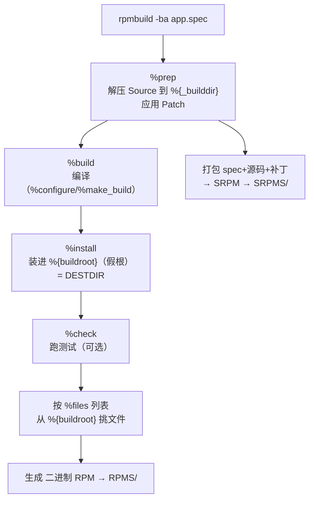

---
tags:
  - packaging
  - tier3
  - linux
  - rpm
  - spec
  - reference
---
# RPM spec 语法完整参考

> [!abstract] TL;DR
> 本篇是 [[02.Linux原生打包-rpmbuild与rpm|第 02 篇]] 的 **`.spec` 语法参考册**：逐项列全 preamble 标签、五大 section（`%prep`/`%build`/`%install`/`%check`/`%files`）的指令与常用宏、`%files` 的文件标记（`%config(noreplace)`/`%doc`/`%dir`/`%ghost`/`%attr`）、脚本片段与触发器（`%pre`/`%post`/`%preun`/`%postun`/`%pretrans`/`%posttrans`/`%trigger*` 及 `$1` 语义）、宏系统（`%define`/`%global`/内建路径宏/`%if` 条件/`%{lua:}`）、子包（`%package`）与自动依赖控制、以及 `rpmbuild`/`rpmspec` 的命令行选项。核心记忆点：**`%install` 装进 `%{buildroot}`、`%files` 列表须与 buildroot 完全对应、脚本片段清理动作用 `[ $1 -eq 0 ]` 守卫、路径一律用 `%{_bindir}` 等宏**。

## 概述与定位

第 02 篇讲清了 RPM 打包的原理、`.spec` 五块的角色、以及最要命的 `$1` 语义。本篇是配套的**语法参考册**——当你要查「preamble 有哪些标签」「`%setup` 的 `-q -n` 什么意思」「`%config` 和 `%config(noreplace)` 区别」「怎么写子包」「`rpmbuild -bp` 只跑到哪一步」时，来这里查表。建议先读 02 建立框架，再把本篇当手册。

`.spec` 是一份「声明 + 脚本混合」的文件：preamble 用标签声明元数据，section 用 shell 脚本描述构建各阶段，`%files` 用标记声明归属，宏系统贯穿全篇做参数化。下面逐块列全。

## 原理与机制

### 宏展开：spec 的底层引擎

`.spec` 在被解析前先经过 rpm 的**宏展开器**处理，理解几种展开形式是读懂复杂 spec 的前提：

| 形式 | 含义 | 例 |
|---|---|---|
| `%{name}` | 展开宏 name | `%{version}` → `1.0` |
| `%name` | 同上（无歧义时可省花括号） | `%version` |
| `%{?name}` | name 有定义才展开，否则空 | `%{?dist}` → `.fc39` 或空 |
| `%{!?name:...}` | name **未**定义时展开 `...` | 设默认值 |
| `%{?name:...}` | name 已定义时才展开 `...` | 条件片段 |
| `%(shell命令)` | 展开为 shell 命令输出 | `%(date +%Y)` |
| `%[表达式]` | 算术/字符串表达式（RPM 4.14+） | `%[1+1]` → `2` |
| `%{lua:...}` | 内嵌 Lua 求值 | 复杂逻辑 |
| `%{expand:...}` | 强制再展开一层 | 宏套宏 |

### 构建阶段与 `%{buildroot}`



关键：`%build` 在 `%{_builddir}`（`~/rpmbuild/BUILD`）里编译；`%install` 把产物装进 `%{buildroot}`（`~/rpmbuild/BUILDROOT/<nvra>`，即 `DESTDIR`）；rpmbuild 再据 `%files` 从 buildroot 挑文件打包。**buildroot 里有、`%files` 没列 → "installed but unpackaged"；`%files` 列了、buildroot 没有 → "File not found"。**

## 结构/语法逐项详解

### Preamble 标签全表

| 标签 | 说明 |
|---|---|
| `Name` | 包名（对应 `%{name}`） |
| `Version` | 上游版本（`%{version}`） |
| `Release` | 打包修订（常 `1%{?dist}`） |
| `Epoch` | 纪元（默认 0，优先级最高，慎用） |
| `Summary` | 一行简介 |
| `License` | SPDX 许可证标识（`MIT`/`GPL-3.0-or-later`） |
| `URL` | 上游主页 |
| `Source0`…`SourceN` | 源码 tar / 辅助文件（放 `SOURCES/`） |
| `Patch0`…`PatchN` | 补丁 |
| `BuildRequires` | 构建期依赖 |
| `Requires` | 运行期依赖 |
| `Requires(pre)`/`Requires(post)` | 脚本片段执行期依赖（更早满足） |
| `Provides` | 提供的能力/虚拟包 |
| `Conflicts` | 互斥 |
| `Obsoletes` | 取代并卸载旧包（改名/合并） |
| `Recommends`/`Suggests` | 弱依赖（RPM 4.12+） |
| `Supplements`/`Enhances` | 反向弱依赖 |
| `BuildArch` | `noarch`（架构无关包） |
| `ExclusiveArch`/`ExcludeArch` | 仅/排除某些架构构建 |
| `Prefix` | 可重定位前缀（`%{_prefix}`） |

（`Group`、`BuildRoot`、`%clean` 等在现代 rpm 已废弃/自动，无需写。）

### `%prep`：准备源码

```spec
%prep
%autosetup -p1          # 解压 Source0 + 按序应用所有 Patch（-p1 = patch -p1）
# 或分步经典写法：
# %setup -q             # -q 静默解压；-n 指定解压后目录名；-c 先建目录；-a/-b N 解第 N 个 Source
# %patch0 -p1           # 应用 Patch0
```

`%autosetup` 现代首选（自动打全部补丁、支持 `-S git` 用 git 管理补丁栈）。`%setup` 选项：`-q`（静默）、`-n name`（源目录名）、`-c`（先创建目录再解压）、`-a N`/`-b N`（在切换目录后/前解 SourceN）、`-D`（不先删目录）、`-T`（不自动解 Source0）。

### `%build`：编译

```spec
%build
%configure              # 展开成 ./configure --prefix=%{_prefix} --libdir=%{_libdir} ...
%make_build             # make %{?_smp_mflags}（并行）
# CMake：%cmake ; %cmake_build
# Meson：%meson ; %meson_build
```

### `%install`：装进 buildroot

```spec
%install
%make_install                              # make install DESTDIR=%{buildroot}
# 或手工：
install -Dm0755 app %{buildroot}%{_bindir}/app
install -Dm0644 app.conf %{buildroot}%{_sysconfdir}/app.conf
```

### `%files`：文件标记全表

```spec
%files
%license LICENSE
%doc README.md
%{_bindir}/app
%dir %{_datadir}/app
%config(noreplace) %{_sysconfdir}/app.conf
%ghost %{_localstatedir}/log/app.log
%attr(0640, root, appgrp) %{_sysconfdir}/app-secret.conf
%exclude %{_libdir}/app/*.la
```

| 标记 | 含义 |
|---|---|
| `%{_bindir}/x` | 路径宏引用文件（见下宏表） |
| `%dir path` | 只拥有目录本身（不含内容） |
| `%doc` / `%license` | 文档 / 许可证（`%license` 不受 `--nodocs` 影响） |
| `%config` | 配置文件（升级时可能覆盖，旧的存 `.rpmsave`） |
| `%config(noreplace)` | 配置文件；用户改过则新的存 `.rpmnew`、不覆盖 |
| `%ghost` | 声明拥有但不打包（运行时生成物，如日志） |
| `%attr(mode,user,group)` | 显式权限/属主（`-` 表示保持默认） |
| `%defattr(fmode,user,group,dmode)` | 段默认权限 |
| `%verify(...)` | 定制 `rpm -V` 校验哪些属性 |
| `%exclude path` | 从打包中排除（buildroot 有但不进此包） |
| `%caps(...)` | 设置文件 capabilities |

### 脚本片段与触发器

```spec
%pre           # 安装前（$1: 装=1 升=2）
%post          # 安装后
%preun         # 卸载前（$1: 升=1 删=0）
%postun        # 卸载后
%pretrans      # 事务最前（整个 dnf 事务开始时）
%posttrans     # 事务最后
%verifyscript  # rpm -V 时

# 指定解释器（默认 /bin/sh）
%post -p /sbin/ldconfig       # 直接把 ldconfig 当脚本，无需写 shell

# 触发器（当"目标包"状态变化时触发本包脚本）
%triggerin -- otherpkg
%triggerun -- otherpkg
%triggerpostun -- otherpkg
```

**`$1` 语义（重申铁律，详见 02 篇）**：清理动作（删用户/服务/数据）必须 `if [ $1 -eq 0 ]` 守卫，只在最终卸载执行；服务管理优先用 `%systemd_post`/`%systemd_preun`/`%systemd_postun_with_restart` 宏。

### 宏系统

**定义**：`%define name value`（局部、惰性展开）、`%global name value`（全局、定义时展开）、`%undefine name`。

**内建路径宏**（务必用宏而非写死路径）：

| 宏 | 典型值 |
|---|---|
| `%{_prefix}` | `/usr` |
| `%{_bindir}` | `/usr/bin` |
| `%{_sbindir}` | `/usr/sbin` |
| `%{_libdir}` | `/usr/lib64`（架构相关） |
| `%{_libexecdir}` | `/usr/libexec` |
| `%{_includedir}` | `/usr/include` |
| `%{_datadir}` | `/usr/share` |
| `%{_sysconfdir}` | `/etc` |
| `%{_localstatedir}` | `/var` |
| `%{_mandir}` | `/usr/share/man` |
| `%{_unitdir}` | `/usr/lib/systemd/system` |
| `%{_topdir}` | `~/rpmbuild` |
| `%{_builddir}` | `~/rpmbuild/BUILD` |
| `%{buildroot}` | 安装暂存假根 |

**条件**：

```spec
%if 0%{?rhel} >= 9
Requires: newlib
%else
Requires: oldlib
%endif

%ifarch x86_64 aarch64
...
%endif

# 可选特性开关（bcond）
%bcond_with tests        # 默认关；--with tests 开启
%if %{with tests}
%check
%make_build test
%endif
```

### 子包

```spec
%package devel
Summary:   %{name} 开发文件
Requires:  %{name}%{?_isa} = %{version}-%{release}

%description devel
头文件与静态库。

%files devel
%{_includedir}/%{name}/
%{_libdir}/lib%{name}.so

# 独立命名子包
%package -n lib%{name}
...
```

`%{?_isa}` 确保子包依赖同架构主包（`(x86-64)` 后缀）。

### 自动依赖控制

RPM 自动扫描 ELF 生成 `Requires`/`Provides`。需要抑制时：

```spec
# 排除自动生成的某些 Provides/Requires
%global __requires_exclude ^libprivate\\.so.*$
%global __provides_exclude ^libprivate\\.so.*$
# 关闭某包的自动依赖
AutoReqProv: no
```

### `%changelog`

spec 末尾的 `%changelog` 记录版本变更历史，格式严格，`rpmlint` 会校验：

```spec
%changelog
* Wed Jul 02 2026 Alice <alice@example.com> - 1.0-1
- 初始打包
- 修复上游 #123
```

- 首行：`* 星期 月 日 年 打包者 <邮箱> - 版本-发行版`（星期/月用英文缩写，顺序与空格固定）。
- 条目以 `-` 开头逐条列变更；**必须倒序**（最新在最上）。
- `rpmdev-bumpspec -c "说明" app.spec` 自动抬 `Release` 并追加条目；`rpmautospec` 让 `Release` 与 `%changelog` 由 git 历史自动生成，免手工维护。
- Fedora 规范要求每次改包都新增 changelog 条目——它既是人读的变更日志，也是 `dnf changelog`/审计的数据源。

## 工具视角与实战

### `rpmbuild` 选项

| 选项 | 作用 |
|---|---|
| `-bp` | 只执行到 `%prep` |
| `-bc` | 到 `%build` |
| `-bi` | 到 `%install` |
| `-bl` | 检查 `%files` 列表 |
| `-bb` | 只构建二进制 RPM |
| `-bs` | 只构建 SRPM |
| `-ba` | 全部（二进制 + SRPM） |
| `--rebuild <srpm>` | 从 SRPM 重建二进制 |
| `--define 'k v'` | 定义宏（如 `--define '_topdir /tmp/b'`） |
| `--with X`/`--without X` | 切换 `%bcond` 开关 |
| `--target arch` | 指定目标架构 |
| `--nocheck` | 跳过 `%check` |
| `--noclean`/`--short-circuit` | 调试：不清理/从某阶段续跑 |

### 辅助工具

- **`rpmspec -P app.spec`**：展开并打印 spec（看宏最终展成什么）；`rpmspec -q --qf`（查询）。
- **`rpmdev-setuptree`**（rpmdevtools）：一键建 `~/rpmbuild` 树。
- **`~/.rpmmacros`**：用户级宏覆盖，常设 `%_topdir`、`%packager`、`%_gpg_name`、`%_smp_mflags`。
- **`mock -r <config> app.src.rpm`**：干净 chroot 构建（生产必备，验证 BuildRequires 完整）。

### 常见 spec 错误与调试

RPM 打包最耗时的往往不是写 spec，而是让 `%files` 与 `%{buildroot}` 严丝合缝。高频错误与对策：

- **`installed but unpackaged files`**：buildroot 里有、`%files` 没列。补进 `%files`、或 `%exclude`、或调试期 `%global _unpackaged_files_terminate_build 0` 临时放行。
- **`File not found (by glob)`**：`%files` 列了、buildroot 没有——多因 `%install` 没装到位，或路径宏用错（`%{_lib}` 与 `%{_libdir}` 混淆、64 位写死 `/usr/lib`）。
- **宏未展开**（`%{foo}` 原样出现）：宏名拼错或未定义；用 `rpmspec -P app.spec` 展开整份 spec 排查最终形态。
- **脚本片段失败**：`%post` 报非零即中断安装；对可能不存在的对象加 `|| :`，检查 `-p` 指定的解释器路径存在。
- **分阶段调试**：`rpmbuild -bi --short-circuit` 只重跑 `%install`（不重编译）、`rpmbuild -bl` 只校验 `%files` 列表，快速迭代不必每次从头构建。

审查成品：`rpm -qp --scripts` 看脚本片段、`rpm -qp --requires/--provides` 看依赖是否如预期、`rpm -qp -l` 看文件清单——把这三条 + `rpmlint` 作为发布前自检清单。

## 安全性与正确使用

- **`$1` 守卫**（第一铁律，重申）：`%preun`/`%postun` 清理用 `[ $1 -eq 0 ]`，避免升级误删；服务用 `%systemd_*` 宏。
- **路径全用宏**：写死 `/usr/lib` 在 64 位（`/usr/lib64`）会错位；用 `%{_libdir}` 等自动适配。
- **`%config(noreplace)`**：用户可能改的配置务必加 `noreplace`，否则升级覆盖用户改动。
- **`-p` 解释器脚本要短**：`%post -p /sbin/ldconfig` 只适合单命令；复杂逻辑写完整 shell 并加 `|| :` 兜底。
- **buildroot 洁净**：只往 `%{buildroot}` 写；`%files` 精确匹配，用 `%exclude` 剔除不打包项。
- **宏注入**：`%(shell)` 与 `%{lua:}` 在 spec 解析期执行——只用可信 spec，警惕从不可信来源 `rpmbuild --rebuild` 的 SRPM（其 spec 脚本以你的身份运行）。

> **合规边界**：`License` 用 SPDX 标识如实声明；打包**自有或授权**软件；从他人 SRPM 重建前应审查其 `.spec`（`%prep`/`%build`/脚本片段可执行任意代码）。

## 小结

- **宏展开**是 spec 引擎：`%{?name}`/`%{!?name:..}`/`%(shell)`/`%[expr]`/`%{lua:}`。
- **preamble** 声明 NEVRA 与依赖；**五段**：`%prep`(`%autosetup`)/`%build`/`%install`(装 `%{buildroot}`)/`%check`/`%files`。
- **`%files` 标记**：`%config(noreplace)`/`%doc`/`%license`/`%dir`/`%ghost`/`%attr`/`%exclude`；路径用 `%{_bindir}` 等宏。
- **脚本片段** `%pre/%post/%preun/%postun/%pretrans/%posttrans/%trigger*`，`-p` 指定解释器，清理用 `[ $1 -eq 0 ]` 守卫。
- **宏系统**：`%define`/`%global`、内建路径宏全表、`%if`/`%ifarch`/`%bcond` 条件。
- **子包** `%package [-n]` + 各自 `%description`/`%files`；`%{?_isa}` 锁同架构。
- **命令**：`rpmbuild -bp/-bc/-bi/-bl/-bb/-bs/-ba/--rebuild/--define/--with`；`rpmspec -P` 展开；`~/.rpmmacros`；`mock` 隔离。

## 相关阅读

- [RPM 官方宏与 spec 文档](https://rpm.org/documentation.html)（`rpm.org`）
- [Fedora Packaging Guidelines · Scriptlets/Macros](https://docs.fedoraproject.org/en-US/packaging-guidelines/)（`docs.fedoraproject.org`）
- [RPM Packaging Guide](https://rpm-packaging-guide.github.io/)（`rpm-packaging-guide.github.io`）
- `man rpmbuild(8)`、`man rpmspec(8)`
- 本系列第 02 篇：[[02.Linux原生打包-rpmbuild与rpm]]——原理与流程（本篇是其语法参考册）
- 本系列第 07 篇：[[07.deb打包参数与语法详解]]——deb 侧对称参考

---

[[00.打包与分发总览|⬆ 系列总览]] | [[07.deb打包参数与语法详解|← 上一章]] | [[09.InnoSetup脚本语法参考|→ 下一章]]
