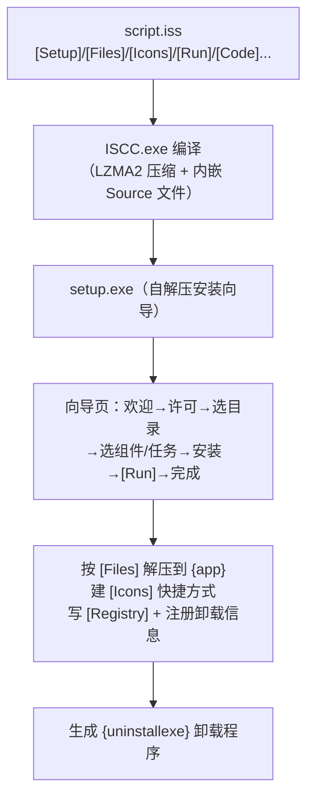

---
tags:
  - packaging
  - tier3
  - windows
  - innosetup
  - installer
  - reference
---
# Inno Setup 脚本语法参考

> [!abstract] TL;DR
> Inno Setup 是免费、脚本驱动的 Windows EXE 安装器生成器：写一份 **`.iss` 脚本** → 用 **`ISCC.exe`** 编译成单个自解压 `setup.exe`。脚本由**方括号 section** 组成，分两类语法——`[Setup]` 等是 `指令=值`，`[Files]`/`[Icons]`/`[Run]` 等是**参数式**（`Source: ...; DestDir: ...; Flags: ...`）。常用 section：`[Setup]`（全局配置）、`[Files]`（装哪些文件）、`[Icons]`（快捷方式）、`[Run]`（安装后运行）、`[Registry]`（注册表）、`[Tasks]`/`[Components]`（可选任务/组件）、`[Code]`（Pascal 脚本做高级逻辑）。路径用**常量** `{app}`/`{autopf}`/`{group}`/`{tmp}`/`{uninstallexe}`。编译 `ISCC /Q script.iss`；生成的安装器支持**静默安装** `/SILENT`、`/VERYSILENT`、`/DIR=`、`/LOG`。它是 [[03.Windows应用打包|第 03 篇]] 里 EXE 安装器路线的参数语法参考册。

## 概述与定位

第 03 篇把 Windows 打包的四条路线（MSI/MSIX/EXE 安装器/winget）讲了个全景，其中 **EXE 安装器**这条只略述了 NSIS 与 Inno Setup。本篇专门把 **Inno Setup 的脚本语法**列全，作为 03 的深度参考册。

Inno Setup（jrsoftware 出品，开源免费）与 MSI/WiX 的根本差异：**MSI 是声明式关系型数据库**（Windows Installer 服务解释执行、事务回滚、组件引用计数），而 **Inno 是脚本式**——你写一份分节脚本描述「装什么、放哪、建什么快捷方式、跑什么」，编译成一个自包含的 `setup.exe`。它没有 MSI 的事务/组策略/引用计数，但胜在**简单、向导 UI 漂亮、`[Code]` 段可用 Pascal 写任意逻辑、单文件分发**。对中小型/开源 Windows 应用，Inno 往往是投入产出比最高的选择。

Inno 的一切在 `.iss` 脚本里，命令行只有一个编译器 `ISCC.exe`。所以掌握 Inno = 掌握 section 语法 + 常量 + `[Code]` + 少数编译/静默参数。

## 原理与机制

### 脚本结构与两类 section

`.iss` 脚本由若干 **section** 构成，每节以方括号名开头（`[Setup]`）。有两种语法风格：

- **指令式**（如 `[Setup]`、`[Languages]`）：每行 `指令名=值`。
- **参数式**（如 `[Files]`、`[Icons]`、`[Run]`、`[Registry]`）：每行由多个 `参数名: 值` 用分号分隔组成一条「条目」。

其它规则：`;` 开头是注释；同名 section 可出现多次（内容合并）；几乎所有参数式 section 都支持 `Flags:` 参数（空格分隔的多个标志）；还支持 `Check:`/`Components:`/`Tasks:` 等条件参数控制某条目是否生效。

### 常量：路径不写死

Inno 用花括号**常量**表示运行期才确定的路径，务必用常量而非硬编码：

| 常量 | 含义 |
|---|---|
| `{app}` | 用户选择的安装目录（`DefaultDirName` 定默认值） |
| `{autopf}` | Program Files（按 32/64 位与权限自动选，现代推荐） |
| `{commonpf}`/`{commonpf64}` | Program Files（全局） |
| `{localappdata}`/`{userappdata}` | 用户 AppData（per-user 安装用） |
| `{group}` | 开始菜单程序组（`DefaultGroupName`） |
| `{commondesktop}`/`{userdesktop}` | 桌面 |
| `{sys}` | System32 |
| `{tmp}` | 安装期临时目录 |
| `{src}` | 安装介质（setup.exe 所在）目录 |
| `{uninstallexe}` | 生成的卸载程序路径 |
| `{#MyDef}` | 预处理器宏展开（见下） |

### 预处理器与 `[Code]`

- **Inno Setup 预处理器（ISPP）**：`#define`、`#include`、`#if`——编译期宏与条件。常见把版本号 `#define MyVersion "1.2.3"` 定义一次，再在 `[Setup]` 里用 `{#MyVersion}` 引用。
- **`[Code]` 段（Pascal Scripting）**：内嵌 Pascal 脚本引擎，能写编译期与**运行期**逻辑——响应向导事件、自定义页面、条件判断。它让 Inno 能做 MSI 里要写 CustomAction 才能做的事。

### 编译模型

`ISCC.exe`（控制台编译器）把 `.iss` + 所有 `Source` 文件压缩（LZMA/LZMA2）打进一个自解压 `setup.exe`，输出到 `[Setup]` 的 `OutputDir`/`OutputBaseFilename`。运行 `setup.exe` 即解压并按脚本执行安装。



## 结构/语法逐项详解

### Section 全表

| Section | 作用 |
|---|---|
| `[Setup]` | 全局配置（指令式） |
| `[Types]` | 安装类型（完整/自定义等，配合 Components） |
| `[Components]` | 可选组件（用户勾选） |
| `[Tasks]` | 可选任务（如"创建桌面图标"复选框） |
| `[Dirs]` | 额外创建的目录 |
| `[Files]` | 要安装的文件 |
| `[Icons]` | 快捷方式 |
| `[INI]` | 写 INI 文件 |
| `[Registry]` | 写注册表 |
| `[Run]` | 安装**后**运行程序 |
| `[UninstallRun]` | 卸载**时**运行 |
| `[InstallDelete]`/`[UninstallDelete]` | 安装/卸载时删除指定文件 |
| `[Languages]` | 多语言 |
| `[Messages]`/`[CustomMessages]` | 覆盖内建消息/自定义消息 |
| `[Code]` | Pascal 脚本 |

### `[Setup]` 常用指令

```ini
[Setup]
AppId={{B8B7A3E2-...GUID...}      ; 唯一标识（升级识别，类比 MSI UpgradeCode）
AppName=MyApp
AppVersion=1.2.3
AppPublisher=Example Corp
DefaultDirName={autopf}\MyApp      ; 默认安装目录
DefaultGroupName=MyApp             ; 开始菜单组名
OutputDir=dist
OutputBaseFilename=MyApp-1.2.3-setup
Compression=lzma2/max
SolidCompression=yes
ArchitecturesAllowed=x64compatible
ArchitecturesInstallIn64BitMode=x64compatible
PrivilegesRequired=lowest          ; lowest=per-user 免UAC / admin=per-machine
WizardStyle=modern
SetupIconFile=app.ico
; 编译期自动签名（调用外部 SignTool，见下）
SignTool=mysigntool
```

`PrivilegesRequired` 决定 per-user 还是 per-machine（`lowest` 装到 `{localappdata}` 免 UAC，`admin` 装到 Program Files）；`PrivilegesRequiredOverridesAllowed=dialog` 可让用户选。

### `[Files]`

```ini
[Files]
Source: "build\myapp.exe"; DestDir: "{app}"; Flags: ignoreversion
Source: "build\*.dll";     DestDir: "{app}"; Flags: ignoreversion
Source: "assets\*";        DestDir: "{app}\assets"; \
    Flags: recursesubdirs createallsubdirs
Source: "vc_redist.x64.exe"; DestDir: "{tmp}"; Flags: deleteafterinstall
```

常用 `Flags`：`ignoreversion`（总是覆盖，别用于共享系统文件）、`recursesubdirs`+`createallsubdirs`（递归目录）、`onlyifdoesntexist`、`deleteafterinstall`、`uninsneveruninstall`（卸载时保留）、`comparetimestamp`。

### `[Icons]`、`[Run]`、`[Registry]`

```ini
[Icons]
Name: "{group}\MyApp"; Filename: "{app}\myapp.exe"
Name: "{group}\卸载 MyApp"; Filename: "{uninstallexe}"
Name: "{commondesktop}\MyApp"; Filename: "{app}\myapp.exe"; Tasks: desktopicon

[Tasks]
Name: "desktopicon"; Description: "创建桌面快捷方式"; GroupDescription: "附加图标:"

[Run]
Filename: "{tmp}\vc_redist.x64.exe"; Parameters: "/quiet /norestart"; \
    StatusMsg: "安装运行库..."; Flags: waituntilterminated
Filename: "{app}\myapp.exe"; Description: "立即运行 MyApp"; \
    Flags: postinstall nowait skipifsilent

[Registry]
Root: HKLM; Subkey: "Software\Example\MyApp"; ValueType: string; \
    ValueName: "InstallDir"; ValueData: "{app}"; Flags: uninsdeletekey
```

`[Run]` 的 `postinstall` 让它成为向导末页复选项、`nowait` 不等待、`waituntilterminated` 等结束（装运行库时用）；`[Registry]` 的 `uninsdeletekey` 让卸载时清理。`[Icons]` 用 `{group}`/`{commondesktop}` + `{uninstallexe}` 常量。

### `[Components]`/`[Tasks]` 与条件

```ini
[Types]
Name: "full"; Description: "完整安装"
Name: "custom"; Description: "自定义"; Flags: iscustom

[Components]
Name: "core"; Description: "核心"; Types: full custom; Flags: fixed
Name: "plugins"; Description: "插件"; Types: full

[Files]
Source: "plugins\*"; DestDir: "{app}\plugins"; Components: plugins
```

`Components:`/`Tasks:` 参数让某条目仅在对应组件/任务被选中时生效——这是 Inno 表达「可选安装」的方式。

### `[Code]`：Pascal 脚本与事件

```pascal
[Code]
function InitializeSetup(): Boolean;
begin
  // 安装开始前：检查前置条件（如 .NET 是否已装）
  Result := True;
end;

procedure CurStepChanged(CurStep: TSetupStep);
begin
  if CurStep = ssPostInstall then
    Log('安装完成后处理');
end;

// 用 {code:FuncName} 在其它 section 里调用返回值
function GetDataDir(Param: String): String;
begin
  Result := ExpandConstant('{localappdata}\MyApp');
end;
```

常用事件函数：`InitializeSetup`（返回 False 中止）、`InitializeWizard`（自定义向导页）、`CurStepChanged`（`ssInstall`/`ssPostInstall`）、`NextButtonClick`、`CurUninstallStepChanged`。任意 section 参数里可用 `{code:FuncName|Param}` 调用 `[Code]` 函数取动态值。

## 工具视角与实战

### ISCC 编译

```console
:: 基本编译
> ISCC script.iss

:: 静默编译（CI 用，/Q 抑制界面）
> ISCC /Q script.iss

:: 覆盖输出目录/文件名、传预处理器定义
> ISCC /Q "/O.\dist" "/FMyApp-1.2.3-setup" "/DMyVersion=1.2.3" script.iss
```

`ISCC` 退出码：`0` 成功、`1` 参数/内部错误、`2` 编译失败——CI 里据此判断。`/D` 定义的宏在脚本里用 `{#MyVersion}` 取。

### 生成的安装器：静默安装参数（企业部署）

编译出的 `setup.exe` 支持一组运行期开关，供无人值守部署：

| 参数 | 作用 |
|---|---|
| `/SILENT` | 静默（仍显示进度条，无向导页） |
| `/VERYSILENT` | 全静默（连进度条也无） |
| `/SUPPRESSMSGBOXES` | 抑制消息框（配合 silent） |
| `/DIR="C:\Path"` | 指定安装目录（覆盖 `{app}`） |
| `/GROUP="名"` | 指定开始菜单组 |
| `/NOICONS` | 不建图标 |
| `/COMPONENTS="core,plugins"` | 选择组件 |
| `/TASKS="desktopicon"` | 选择任务 |
| `/NORESTART` | 不自动重启 |
| `/LOG="setup.log"` | 记录安装日志 |
| `/LOADINF` / `/SAVEINF` | 从/存应答文件 |

```console
> MyApp-1.2.3-setup.exe /VERYSILENT /SUPPRESSMSGBOXES /NORESTART /LOG="C:\log\myapp.log"
```

卸载器（`{uninstallexe}`，即 `unins000.exe`）同样支持 `/SILENT`、`/VERYSILENT`。

### 编译期自动签名

`[Setup]` 的 `SignTool=name` 配合编译器配置里定义的 SignTool 命令，可在编译后**自动对 `setup.exe` 与卸载器签名**（底层调 Windows SDK 的 `signtool`）。签名细节（`/fd SHA256 /tr` 时间戳、EV 证书与 SmartScreen）见 [[03.Windows应用打包|第 03 篇]]。

### [Code] 常用支持函数与前置检查模式

`[Code]` 段能调用大量内建支持函数完成运行期逻辑，常见几类：

- **常量/路径**：`ExpandConstant('{app}')`、`ExpandFileName`、`GetEnv`。
- **注册表**：`RegQueryStringValue(HKLM, Key, Name, Value)`、`RegKeyExists`——检测前置软件是否已装。
- **执行**：`Exec(FileName, Params, Dir, ShowCmd, Wait, ResultCode)`、`ShellExec`——跑外部程序/安装器。
- **文件/判断**：`FileExists`、`DirExists`、`MsgBox`、`IsAdminInstallMode`（判断 per-machine/per-user）。

典型「检查 .NET/VC++ 运行库是否已装，缺则装」模式：在 `InitializeSetup` 或 `PrepareToInstall` 里用 `RegQueryStringValue` 查注册表标记，缺失则把 redist 加进 `[Files]`（装到 `{tmp}`），并在 `[Run]` 里以 `/quiet` 安装——这是 Inno 处理运行库依赖的标准做法（对应 MSI 的 merge module，但更手动灵活）。

### 卸载与共享文件

- **`[UninstallDelete]`**：卸载时删除安装期生成、`[Files]` 未登记的文件（日志、缓存）。
- **`[UninstallRun]`**：卸载时运行程序（注销服务、清理注册表）。
- **`{uninstallexe}`**：Inno 自动生成的卸载器（`unins000.exe`），装的东西被登记以供卸载。
- **共享文件引用计数**：多个安装器可能装同一共享 DLL，`Flags: sharedfile` 让 Inno 维护引用计数，**只有最后一个卸载者才真正删除**——避免「A 卸载把 B 还在用的 DLL 删掉」。
- 注册表用 `Flags: uninsdeletekey`/`uninsdeletevalue` 声明卸载时清理，避免留下垃圾键。

## 安全性与正确使用

- **给 setup.exe 签名**：Inno 生成的安装器是 PE，务必 Authenticode 签名 + 时间戳（否则 SmartScreen 拦、用户不敢装）；用 `SignTool` 指令让编译自动签，或事后 `signtool sign`。**卸载器也要签**（Inno 支持对内嵌卸载器签名）。
- **`PrivilegesRequired` 选最小**：能 per-user（`lowest`）就别要管理员，减少 UAC 摩擦与攻击面；确需写 Program Files/HKLM 才用 `admin`。
- **`ignoreversion` 慎用于共享文件**：对系统级/共享 DLL 强制覆盖可能破坏其它软件；共享文件应比较版本或用引用计数（Inno 有 `sharedfile` 机制）。
- **`[Code]` 以安装器权限运行**：管理员安装时 `[Code]` 也是高权限，避免在其中执行不可信输入或下载执行；逻辑尽量简单可审查。
- **静默参数用于企业**：`/VERYSILENT /SUPPRESSMSGBOXES /NORESTART` 是 SCCM/Intune 无人值守部署的标准调用方式。

> **合规边界**：本篇用于打包**你自有或获授权分发**的 Windows 软件；打包运行库（如 VC++ Redistributable）须遵守其再分发条款；用你本人/组织的证书签名，勿伪造发布者身份。

## 小结

- **Inno = 脚本式 EXE 安装器**：`.iss`（分 section）→ `ISCC.exe` 编译 → 单文件 `setup.exe`；与 MSI（声明式 DB）互为另一条路线。
- **两类 section 语法**：`[Setup]` 指令式 `k=v`；`[Files]`/`[Icons]`/`[Run]`/`[Registry]` 参数式 `参数: 值; Flags: ...`。
- **路径用常量**：`{app}`/`{autopf}`/`{group}`/`{commondesktop}`/`{tmp}`/`{uninstallexe}`。
- **可选安装**：`[Types]`/`[Components]`/`[Tasks]` + 条目的 `Components:`/`Tasks:`/`Check:` 条件参数。
- **高级逻辑**：`[Code]` Pascal（`InitializeSetup`/`CurStepChanged` 等事件 + `{code:Fn}` 动态取值）；ISPP 预处理器 `#define`/`#include`。
- **命令**：`ISCC /Q /O /F /D` 编译（退出码 0/1/2）；安装器静默 `/VERYSILENT /SUPPRESSMSGBOXES /DIR /LOG /NORESTART`。
- **安全**：给 setup.exe + 卸载器签名（见 03 篇）、`PrivilegesRequired=lowest` 优先、`ignoreversion` 慎用于共享文件。

## 相关阅读

- [Inno Setup 官方帮助](https://jrsoftware.org/ishelp/)（`jrsoftware.org`）—— section/指令/常量/`[Code]` 完整参考
- [ISCC 命令行编译](https://jrsoftware.org/ishelp/topic_compilercmdline.htm)（`jrsoftware.org`）、[安装器命令行参数](https://jrsoftware.org/ishelp/topic_setupcmdline.htm)（`jrsoftware.org`）
- 本系列第 03 篇：[[03.Windows应用打包]]——Windows 打包全景与签名（本篇是其 EXE 安装器路线的参数语法册）
- 本系列第 07/08 篇：[[07.deb打包参数与语法详解]] / [[08.RPM-spec语法完整参考]]——Linux 侧对称参考册

---

[[00.打包与分发总览|⬆ 系列总览]] | [[08.RPM-spec语法完整参考|← 上一章]] | [[00.打包与分发总览|→ 返回总览]]
