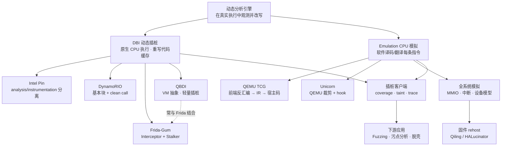
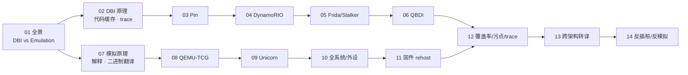

# 动态插桩与模拟执行引擎 · 系列总览

> 静态引擎（系列 45）之外的另一半：当"读代码"不够，就让代码"跑起来"再观测。本系列拆解动态二进制插桩（Pin / DynamoRIO / Frida-Gum）与 CPU 模拟（QEMU TCG / Unicorn）两大类引擎的内部原理与工程实践——代码缓存、TCG 中间表示、hook 与外设建模，为 Fuzzing、污点分析、脱壳与固件 rehost 提供可插桩、可观测、可控制的底层执行引擎。

本系列聚焦"运行时"这一半：不做反汇编的静态近似，而是让目标真正执行——或跑在被重写的原生**代码缓存**里（DBI，开销低、透明度差），或跑在软件模拟的 **CPU** 上（Emulation，可跨架构、全程可控但慢）。两条路线在实现上分道扬镳，却共享同一套下游：覆盖率反馈喂 Fuzzer、污点标签追数据流、trace 还原执行历史。选型的核心权衡就三条——**透明度、开销、可控性**。

## 一图看清：插桩 vs 模拟

## 篇目导航

| # | 章节 | 说明 |
| --- | --- | --- |
| 01 | [[01.动态分析引擎全景：DBI与Emulation]] | 插桩与模拟的取舍、透明度与开销 |
| 02 | [[02.DBI原理：代码缓存与trace]] | 翻译块、代码缓存、链接与回填 |
| 03 | [[03.Intel-Pin架构与Pintool开发]] | 插桩粒度、analysis/instrumentation 分离 |
| 04 | [[04.DynamoRIO架构与客户端]] | 基本块构建、clean call、drcov |
| 05 | [[05.Frida-Gum与Stalker内部机制]] | Interceptor、Stalker trace、代码转译 |
| 06 | [[06.QBDI轻量级插桩框架]] | VM 抽象、回调、与 Frida 结合 |
| 07 | [[07.CPU模拟原理：解释与二进制翻译]] | 解释器、线程码、动态翻译对比 |
| 08 | [[08.QEMU-TCG动态二进制翻译]] | 前端反汇编到 TCG IR 到宿主码 |
| 09 | [[09.Unicorn-Engine与CPU模拟实战]] | 从 QEMU 裁剪、hook、寄存器与内存 |
| 10 | [[10.全系统模拟与外设建模]] | MMIO、中断、设备模型 |
| 11 | [[11.固件rehost：Qiling与HALucinator]] | 外设桩、系统调用模拟，呼应系列 39 |
| 12 | [[12.插桩驱动的分析：覆盖率与污点与trace]] | coverage、taint、trace 三类客户端 |
| 13 | [[13.动态二进制翻译器设计：跨架构转译]] | 寄存器映射、标志位、自修改代码 |
| 14 | [[14.反插桩与反模拟对抗]] | 时序/自省检测、Frida 检测与绕过 |

> [!tip] 阅读顺序建议
> - **先读 01 建立坐标系**：分清「插桩」（原生跑、重写代码缓存）与「模拟」（软件译码执行）两条主线，再决定深入方向；不必一上来就纠结具体工具。
> - **两条主线并行、按需深入**：偏 Hook / 覆盖率反馈 / 生产环境 → 走 DBI 线（02 → 03 → 04 → 05 → 06）；偏跨架构执行、无源码固件、全程可控 → 走 Emulation 线（07 → 08 → 09 → 10）。
> - **02 与 07 是两条线各自的「原理闸门」**：工具章（03-06、08-10）是同一原理在不同实现上的投影，吃透原理后可按手头工具跳读。
> - **11-14 属汇流应用层**：固件 rehost、三类分析客户端、跨架构转译、反对抗——建议掌握任一主线后再读，收益最大。
> - **与静态系列 45 对照**：静态「看代码不运行」、动态「运行中观测」，二者在代码覆盖与反混淆上互补，遇到自修改 / 加壳代码时动态优势明显。

## 建议学习路径

## 与知识库既有体系的衔接

- 静态对偶：[[45.反编译器与反汇编引擎原理/01.反汇编算法：线性扫描与递归遍历]]（静态引擎）
- Hook 承接：[[32.hooks/09-frida]]（用法）到本系列（Gum/Stalker 内部机制）
- 固件呼应：[[39.固件与IoT嵌入式逆向/23.固件仿真进阶Qiling与HALucinator]]（rehost 场景）
- 下游应用：[[49.Fuzzing与漏洞挖掘/00.Fuzzing与漏洞挖掘总览]]、污点分析、脱壳
