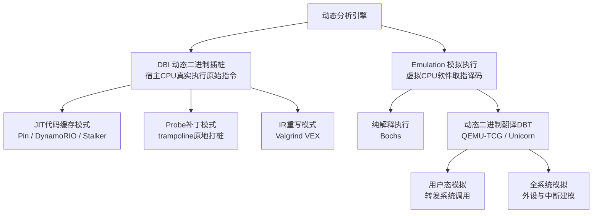
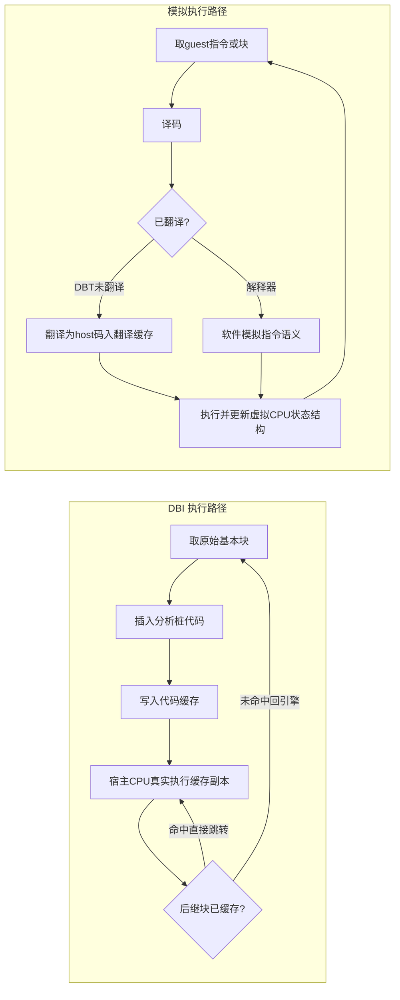
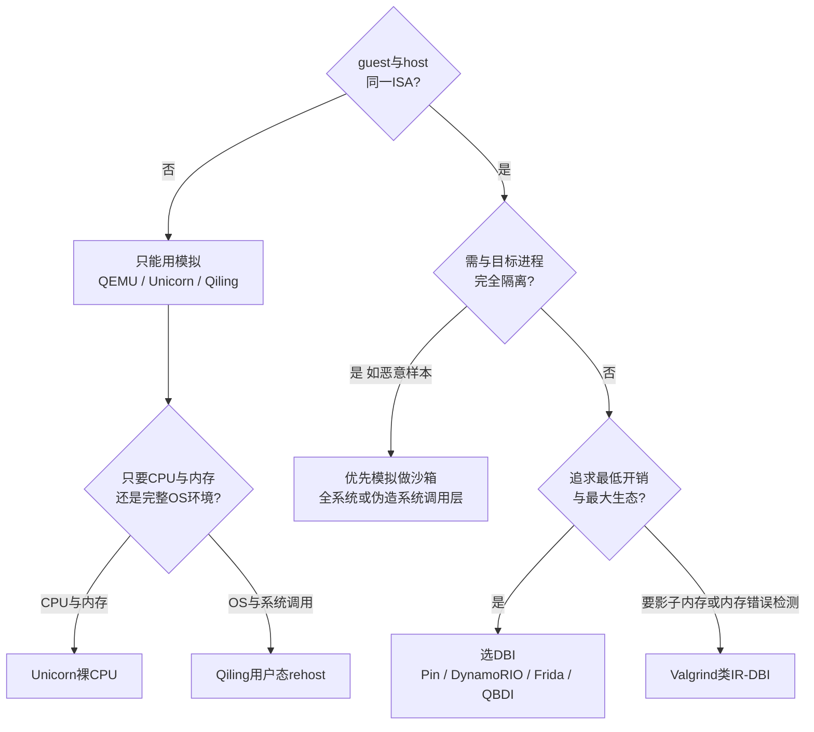

# 动态插桩与模拟执行引擎（1）· 动态分析引擎全景：DBI与Emulation
> [!abstract] TL;DR
> - 动态分析引擎的两大家族——**DBI（动态二进制插桩）**让真实 CPU 执行原始指令、只在指令流里"插桩"；**Emulation（模拟执行）**用软件建模一颗虚拟 CPU、逐条取指译码执行。二者的分界线是"谁持有 CPU 状态的真值"。
> - 选型由三条硬轴决定：**ISA 是否同架构**（跨架构只能模拟）、**开销预算**（DBI 近原生、按需付费；模拟有不可消除的基线开销）、**透明度与隔离需求**（对抗样本必须隔离）。
> - **透明度有两张面孔**：DBI 保真度高（真 CPU 语义）但"藏身"难（与目标共享地址空间、痕迹易被发现）；模拟"藏身"好（完全隔离）但保真度差（指令/勘误/时序建模不全）。这是本篇最核心的取舍。
> - 开销根源不同：DBI 花在**上下文切换、间接跳转重定向、分析回调**；模拟花在**逐指令译码分发、软件 MMU 地址翻译、标志位语义建模**。
> - **用户态模拟不是沙箱**：QEMU 用户态会把 guest 系统调用转发给宿主内核；真正隔离要靠全系统模拟或伪造系统调用层（Qiling 式 rehost）。
> - 从"原地补丁 Hook → JIT-DBI → IR-DBI → DBT 模拟 → 纯解释 → 全系统模拟"是一条"离真实硬件越来越远、控制力与隔离越来越强"的连续谱，后续各篇分别落在谱上不同位置。

## 概述与定位

逆向工程有两条主干路：**静态分析**在不运行程序的前提下推理其结构（反汇编、反编译、控制流恢复，见 [[45.反编译器与反汇编引擎原理/01.反汇编算法：线性扫描与递归遍历]]），**动态分析**则把程序真正跑起来、在执行过程中观测与干预。当目标带壳、被混淆、大量使用间接跳转与数据相关控制流、或者行为取决于运行时环境时，静态推理会失效或代价过高——此时"跑一遍看它到底做了什么"往往是唯一可行的路。

但"裸跑"几乎看不到内部：你只能从进程外围（strace、调试器断点）窥探有限信息，无法逐指令地记录执行轨迹、监视每一次内存读写、统计基本块覆盖、施加污点标签。要获得**细粒度、可编程的可见性与控制力**，就必须在"程序"与"机器"之间插入一层**中介执行引擎**，让每一条指令、每一次访存都有机会经过你的分析代码。构建这层中介，业界收敛出两种根本不同的战略：

- **DBI（Dynamic Binary Instrumentation，动态二进制插桩）**：仍然让**真实 CPU** 执行**真实指令**，但在指令流被送上处理器之前，把你的"分析桩"（probe）织进去，使分析代码与原程序交错运行。程序本体以接近原生的速度执行，你只是往里"打桩"。
- **Emulation（模拟执行）**：干脆**不让真 CPU 跑 guest**，而是用软件建一台 CPU 模型，逐条**取指—译码—执行**每一条 guest 指令。每一步都因构造而必然流经你的代码。

要把四个易混术语钉死：**插桩（instrumentation）**是往真实执行里注入观测点；**模拟/仿真（emulation）**是用软件重现一台机器的行为；**模拟建模（simulation）**语义相近，常指更偏行为建模的重现；**虚拟化（virtualization）**（KVM、Intel VT/AMD-V）则借硬件让 guest 近原生直跑，粒度粗、可见性弱，属于另一条技术线。本系列聚焦的是**能提供指令级细粒度可见性**的两族——DBI 与 Emulation，而非 hypervisor。

本篇是整个系列的"地图"：它不深挖任一引擎的内部实现（那是后续各篇的任务），而是建立分类学、划清 DBI 与 Emulation 的分野、把"插桩 vs 模拟"的取舍讲透。贯穿全篇的核心问题只有一个：**给定一个分析目标，你应该"插桩"还是"模拟"？** 答案由三条轴决定——架构是否匹配、开销是否可承受、需要多高的透明度与隔离。



## 原理与机制

**DBI 的核心循环。** 引擎先通过启动器或注入夺取目标的执行控制权，然后接管其执行流：它不直接跳到原始代码，而是以**基本块**为单位把原码**复制进"代码缓存"（code cache）**，在副本里插入分析桩，再执行这份被插过桩的缓存副本。当一个块结束（尤其遇到间接跳转/返回）时，控制权回到引擎，由它翻译并缓存下一块。JIT 模式下，**原始代码从不被真 CPU 直接执行**——真正跑的永远是缓存里的插桩副本。关键在于：绝大多数指令仍在真实硬件上原速执行，开销只集中在块边界的调度与你注入的分析回调上，因此 DBI 能做到**接近原生**。代码缓存、trace 合并、间接跳转的快速重定向等机制的深入细节，留给 [[02.DBI原理：代码缓存与trace]]。

**Probe 模式（DBI 的另一形态）。** 与 JIT 全量搬迁不同，probe 模式直接在原始代码里**原地打补丁**：把关注点处的几字节改成跳向 trampoline（蹦床）的跳转，执行到那里再绕去你的处理函数、执行被覆盖的原指令、跳回。它开销更低、实现更轻，但覆盖能力有限——需要足够空间打补丁、看不到"每一条"指令、对自修改代码与短函数不友好。这正是经典的 **Hook** 技术（[[32.hooks/09-frida]] 讲的就是这种用法层视角），而本系列要深入的是把 Hook 系统化、可对"任意指令"插桩的引擎级机制。

**Emulation 的核心循环。** 模拟器实现经典的**取指—译码—执行**大循环。**纯解释器**（如 Bochs）每次迭代处理一条 guest 指令：读取该指令字节、软件译码、在一个巨大的分派结构里跳到对应处理逻辑、更新一份建模了寄存器/标志/内存的软件结构。**动态二进制翻译（DBT，如 QEMU 的 TCG）**则不每次都解释，而是把一段 guest 指令**一次性翻译成等价的 host 指令**、缓存这份翻译（QEMU 里叫翻译块 TB），后续命中同一段就直接跑 host 翻译，从而把译码/分派的成本在多次执行间**摊薄**。解释与翻译的原理对比、翻译缓存与链接的细节见 [[07.CPU模拟原理：解释与二进制翻译]] 与 [[08.QEMU-TCG动态二进制翻译]]。

**最根本的分界线：谁持有 CPU 状态的真值？** DBI 里，真值在**真实硬件寄存器**中——你的插桩读到的是货真价实的 rax、rflags；模拟里，真值在一份**软件结构**中——寄存器、标志、乃至整块"物理内存"都只是数组字段，你可以**任意读写、快照、回滚**。这一条差异，几乎推导出了后面所有取舍：为什么模拟能跨架构、能做确定性重放、能当沙箱，而 DBI 快、保真、却难以隐身。

**分析钩子挂在哪。** DBI 在**插桩点**挂钩，粒度是指令/基本块/trace/例程（这也是 Pin 的粒度模型，见 [[03.Intel-Pin架构与Pintool开发]]），并区分"插桩例程"（决定往哪插）与"分析例程"（运行时被调用）。模拟因为**独占了执行循环**，可以在循环任意处挂钩——逐指令、逐访存、逐块、逐中断/系统调用；尤其"监视每一次内存读写"在模拟里几乎免费（本就要过软件 MMU），而在 DBI 里给每条访存指令插桩是**昂贵**的。



## 取舍维度详解：透明度、开销与能力边界

"插桩还是模拟"不是口味问题，而是沿六条维度算清账。下面逐条展开——每条都讲清**为何如此（why）**、**边界与陷阱**、以及**两族的深层差异**。

### 维度一：ISA 约束——常常是硬性的选择而非偏好

DBI 让真 CPU 执行原始指令，所以**宿主 ISA 必须涵盖 guest ISA**（host ⊇ guest）。你无法用 Pin 在 x86 机器上分析一段 ARM 固件——真 CPU 根本不认识那些指令。模拟则把 guest 与 host **解耦**：QEMU/Unicorn 可以在 x86 上跑 ARM、MIPS、RISC-V。因此当目标与你手头的机器**不同架构**时，选择往往被直接锁死为"只能模拟"。固件 rehost（[[39.固件与IoT嵌入式逆向/23.固件仿真进阶Qiling与HALucinator]]、[[11.固件rehost：Qiling与HALucinator]]）与跨架构转译（[[13.动态二进制翻译器设计：跨架构转译]]）天然是模拟的地盘，正因为这条硬约束。

### 维度二：开销从哪来——"按需付费"对"始终在线"

**DBI 的开销来源**有四块：一次性的翻译/JIT 成本（被代码缓存摊薄）；**上下文切换**——在应用上下文与分析上下文之间来回，需要保存/恢复寄存器与标志（register spill），细粒度分析时这项很频繁；**间接跳转重定向**——原程序里的间接目标是"原始地址"，运行时必须映射到"代码缓存地址"（哈希查表），是 DBI 的经典大头，被反复优化（[[02.DBI原理：代码缓存与trace]]）；以及**分析回调本身**——例如每条指令都调一次 C 函数，往往主导总开销。空桩（null tool）下 Pin/DynamoRIO 常在 ~1.1–2x，而基于 IR 重写的 Valgrind（nulgrind）更高（数倍起步，因为它把每条指令拆成 VEX IR 再合成）；重分析可达 10–100x。核心特性是**按需付费（pay-as-you-go）**：不插桩的部分几乎原速，你只为观测到的东西付费。

**模拟的开销来源**不同：解释执行每条指令都要软件译码与分派（分派处的分支预测极差、且每次都重新译码），因此 100x+ 是常态；DBT 把译码/翻译摊薄了，但生成的 host 码仍要**模拟那些不 1:1 映射的语义**——标志位的精确计算、以及每一次 guest 访存都要走**软件 MMU（soft-MMU）**做地址翻译与保护检查——所以用户态 DBT 典型在 ~4–20x，全系统更高。**为什么模拟天生慢于 DBI？** 因为即便最优的 DBT，guest 的每次访存都要过一层软件 TLB/MMU、标志语义要软件建模；而 DBI 的访存就是真实硬件访存、标志就是真 CPU 的标志。一句话：DBI 基线近原生、开销叠加在插桩上；模拟有一层**无法消除的基线开销**——那颗虚拟 CPU 永远在跑。

### 维度三：透明度——最微妙的一维

**透明度**指引擎**不扰动目标可观测状态/行为**的程度——理想情况下程序察觉不到自己正被分析，且行为与原生完全一致。经典分类（源自 DynamoRIO 的设计目标与 Bruening 的工作）包括：**代码透明**（程序读自己的代码时必须看到原始字节，而非缓存里的插桩副本——校验和、自修改代码、内嵌 JIT 都依赖这点）、**地址空间透明**（引擎自身的代码缓存与数据结构不能与应用内存冲突或被其依赖地发现）、**寄存器/标志/栈/堆透明**（引擎必须用自己的栈与堆、不得污染应用状态）、**线程/信号透明**（信号与异常要像原生那样投递）、**错误透明**（崩溃要发生在原生地址、看起来像原生错误）。

**为什么透明难？** 因为 DBI 与目标**共享地址空间与真实 CPU**，泄漏无处不在：`/proc/self/maps` 里能看到引擎的映射；`RDTSC` 读到被拉长的时序；程序读自己的代码会看到缓存副本（除非引擎虚拟化了自读）；引擎的内存区可被扫描发现。**对一个愿意花检测预算的对手，完美透明在理论上不可达**，这是一场军备竞赛（[[14.反插桩与反模拟对抗]]）。

**模拟的透明度性质完全不同。** 目标被**彻底隔离**（它的 CPU 状态只是一个结构体），所以"地址空间泄漏""寄存器被占用"这类问题**根本不存在**——程序看不到引擎内存，因为"内存"就是模型说了算。**但**模拟引入了**保真度缺口**：未实现的指令、CPU 勘误/未文档化行为、标志位边角情形算错、CPUID/MSR 与真机不符、时序对不上真实硅片。于是程序检测到的是"我在一颗假 CPU 上"，而非"我地址空间里有个插桩器"。

由此得到本篇最该讲透的洞见：**透明度有两张面孔**——(a) **藏身**（目标能否发现引擎的痕迹）与 (b) **保真**（引擎是否与真硬件行为一致）。**DBI 保真强**（真 CPU）**但藏身弱**（共享空间）；**模拟藏身强**（完全隔离）**但保真弱**（模型不全）。没有哪一族"透明度全面更好"，只有"在哪一面更强"。这直接回答了种子里的"透明度"取舍。

### 维度四：隔离与安全

DBI 把恶意样本跑在**你自己的进程/操作系统**里：一旦逃逸，真实系统调用会真的执行、造成真实破坏。模拟则**可以**做沙箱——但有一个必须点破的陷阱：**用户态 QEMU 会把 guest 的系统调用翻译后转发给宿主内核**，所以**用户态模拟本身并不是安全沙箱**。真正的隔离需要**全系统模拟**（连内核与系统调用一起模拟），或一层**伪造系统调用**的 OS 建模（Qiling 式 rehost），让样本的 `open/connect/execve` 落到假实现上、不触碰真实内核。把这条讲清楚，能避免"我用 Unicorn/QEMU 跑样本所以很安全"的常见误判。

### 维度五：确定性与可重放

模拟**独占时钟与全部状态**，天然支持**确定性执行、录制/重放、时间旅行调试**——随时快照、回退到任意历史点。DBI 受真实时序与线程调度的**非确定性**支配，重放困难。对需要可复现的分析（模糊测试崩溃归并、[[49.Fuzzing与漏洞挖掘/00.Fuzzing与漏洞挖掘总览]]），这一维往往决定成败。

### 维度六：环境完整性——rehost 的隐藏成本

DBI **免费继承**真实 OS、真实库、真实外设——环境是现成的、真的。模拟必须**自己提供环境**：用户态要做系统调用翻译；全系统要做设备模型、中断控制器、定时器（[[10.全系统模拟与外设建模]]）；固件要么建外设模型、要么在 HAL 层拦截（[[11.固件rehost：Qiling与HALucinator]]）。所以模拟的"成本"不只是 CPU 慢——更是"要建多少环境，目标才肯跑起来"的**工程成本**，这正是 rehosting 问题的本质。

综合成一张对照表：

| 维度 | DBI（插桩） | Emulation（模拟） |
|---|---|---|
| 执行主体 | 宿主真实 CPU 跑原始指令 | 软件虚拟 CPU 逐条模拟 |
| ISA 约束 | 必须同架构（host ⊇ guest） | 可跨架构（任意 guest） |
| 典型开销 | 空桩 ~1.1–2x，重桩 10–100x | DBT ~4–20x，纯解释 100x+ |
| 开销性质 | 按需付费，基线近原生 | 有不可消除的基线 |
| CPU 状态真值 | 在真实寄存器里 | 在软件结构里，可任意读写/快照 |
| 藏身透明度 | 弱（共享地址空间，痕迹多） | 强（完全隔离） |
| 保真透明度 | 强（真 CPU 语义） | 弱（指令/勘误/时序建模不全） |
| 隔离/安全 | 与目标同进程，危险 | 可做沙箱（需伪造 OS 层） |
| 确定性重放 | 难（受真实时序影响） | 易（自持时钟与全状态） |
| 环境成本 | 免费继承真实 OS/库/外设 | 需自建 syscall/外设/HAL |
| 代表工具 | Pin, DynamoRIO, Frida, QBDI, Valgrind | QEMU, Unicorn, Bochs, Qiling |

把这些维度串起来，会看到一条**连续谱**，而非二元对立。从"最贴近真实硬件、隔离最弱"到"离硬件最远、控制力最强"：**原地补丁 Hook → JIT-DBI（Pin/DynamoRIO/Stalker）→ IR-DBI（Valgrind，可挂影子状态）→ DBT 模拟（QEMU/Unicorn，跨架构）→ 纯解释（Bochs，高保真控制）→ 全系统模拟（加外设、可确定性重放）**。越往下，"离真实硬件越远、开销与隔离/控制力越强"。本系列后续各篇，正好分别落在这条谱的不同位置。选型可归纳为一张决策图：



## 工具视角与实战

把生态映射到分类学上，本系列后续逐个深入：

- **DBI 侧**：**Intel Pin**（[[03.Intel-Pin架构与Pintool开发]]，x86 专精、JIT、trace 粒度、生态成熟）；**DynamoRIO**（[[04.DynamoRIO架构与客户端]]，跨平台、以透明为设计目标、性能优秀）；**Frida-Gum/Stalker**（[[05.Frida-Gum与Stalker内部机制]]，脚本驱动、移动端逆向主力，Gum 管 Hook、Stalker 管指令级追踪）；**QBDI**（[[06.QBDI轻量级插桩框架]]，基于 LLVM MC、轻量可嵌入、多架构）；**Valgrind**（IR 重写、影子内存做内存错误检测的代表，开销高但能力独特）。
- **模拟侧**：**QEMU-TCG**（[[08.QEMU-TCG动态二进制翻译]]，DBT 标杆，用户态+全系统）；**Unicorn**（[[09.Unicorn-Engine与CPU模拟实战]]，剥掉 QEMU 的外设/BIOS、只留干净的 CPU+内存 API、多语言绑定）；**Bochs**（纯解释、高保真、常用于 OS 调试）；**Qiling**（建在 Unicorn 之上，补齐加载器与系统调用/OS 建模，做跨平台二进制 rehost）；**HALucinator**（在 HAL 函数层拦截、绕过外设建模做固件 rehost）。

几个把取舍落地的典型场景：

- **给 x86-64 Linux 程序统计基本块覆盖率喂给 fuzzer**：同架构、要快、要按需付费 → **DBI**（DynamoRIO 的 drcov 或 Pin 覆盖工具），见 [[12.插桩驱动的分析：覆盖率与污点与trace]]、[[49.Fuzzing与漏洞挖掘/00.Fuzzing与漏洞挖掘总览]]。
- **分析一段无硬件在手的 ARM Cortex-M 固件**：跨架构 + 无外设 → **模拟 + rehost**（Unicorn/Qiling/HALucinator），见 [[11.固件rehost：Qiling与HALucinator]]、[[39.固件与IoT嵌入式逆向/23.固件仿真进阶Qiling与HALucinator]]。
- **安全地脱壳/去混淆一段自修改的 x86 恶意代码**：要隔离、要对自修改与内存精细掌控 → **模拟（Unicorn）**独占状态、任取寄存器/内存快照最顺手（DBI 也能处理自修改代码，但要额外做缓存失效）。
- **在运行中的 Android App 里 Hook 并追踪某函数**：**Frida**（Gum 打 Hook、Stalker 做追踪），承接 [[32.hooks/09-frida]] 的用法层到 [[05.Frida-Gum与Stalker内部机制]] 的内部机制。

模拟"独占状态"的手感，用 Unicorn 一段最小示例就能体会——造 CPU、给内存、写指令、挂逐指令回调、跑、再直接读虚拟寄存器：

```python
from unicorn import *
from unicorn.x86_const import *
mu = Uc(UC_ARCH_X86, UC_MODE_64)                 # 凭空造一颗虚拟 x86-64
mu.mem_map(0x1000, 0x1000)                        # 给它映射一页内存
mu.mem_write(0x1000, b"\x48\x31\xc0")             # 写入 xor rax, rax
mu.hook_add(UC_HOOK_CODE,
            lambda uc, a, s, d: print("exec", hex(a)))  # 每条指令回调
mu.emu_start(0x1000, 0x1000 + 3)                  # 从 0x1000 执行到结束
print("rax =", mu.reg_read(UC_X86_REG_RAX))       # 直接读虚拟寄存器
```

这段代码本身不重要，重要的是它示范了模拟的本质自由：**内存与寄存器都是可任意 `mem_map/mem_write/reg_read` 的软件对象**——挂"每次访存"回调、跑到一半快照回滚、把某个寄存器强行改值再继续，全都轻而易举。同样一件"监视每次内存写"的事，在 DBI 里要给每条访存指令插分析桩、承受可观开销；孰易孰难，正对应前面开销一维的结论。反过来，若目标是"在真实系统里、以近原生速度跑完整个复杂程序并顺带采集覆盖"，DBI 的按需付费又完胜——**没有银弹，只有把目标、架构、开销预算、隔离需求对到谱上的正确位置**。

## 安全性与正确使用

**安全影响。** DBI 与目标**同进程、同内核**运行，分析对抗性样本时，样本一旦逃逸或其系统调用被真实执行，破坏就是真实的——**用 DBI 直接肉身分析恶意代码是危险的**。正确做法是把不可信样本放进隔离环境（虚拟机 + 全系统模拟，或伪造 OS 的 rehost）。这里再次强调那个高频误区：**用户态模拟不等于沙箱**——用户态 QEMU 会把 guest 系统调用转发给宿主内核；要隔离必须用全系统模拟或伪造系统调用层。

**误用与正确性风险。** 插桩会**扰动行为**（海森堡效应）：拉长的时序可能掩盖或诱发竞态，改变多线程程序的调度路径，让你观测到的不是原生行为。沉重开销可能触发样本的**反分析超时/看门狗**；不完全的透明度可能让样本走上**另一条规避分支**——你辛苦分析的却是"被观测时才有的假行为"。模拟这边，**保真度缺口**会让样本崩溃或行为分叉（碰到未实现指令、算错标志、CPUID 不符），从而得出错误结论。

**正确使用的边界。** 按威胁模型选引擎：跨架构/需隔离/需重放 → 模拟；同架构/要速度/要生态 → DBI；要影子内存做内存错误检测 → Valgrind 类。对结果**做差分校验**（原生 vs 插桩，确认插桩没改变输出）。面对对抗样本，**默认会被检测**，为透明度加固预留预算（[[14.反插桩与反模拟对抗]]）。保持引擎**跟上 ISA 扩展**（AVX-512、新指令等未被模拟会直接崩）。此外，插桩/模拟他人的专有软件可能触碰授权条款，**只分析你被授权分析的目标**——这是伦理与合规的底线。

## 小结

动态分析引擎围绕一条根本分野展开：**DBI 让真 CPU 跑真指令、只打桩**，**模拟用软件 CPU 逐条重现**——真值在真实寄存器还是在软件结构里，几乎推导出全部差异。选型由三条轴锁定：**ISA 同否**（跨架构只能模拟）、**开销预算**（DBI 按需付费、近原生；模拟有不可消除基线）、**透明度与隔离**（对抗样本要隔离）。透明度要拆成**藏身**与**保真**两张面孔看：DBI 保真强而藏身弱，模拟藏身强而保真弱。开销根源也不同：DBI 在上下文切换、间接跳转、分析回调；模拟在译码分发、软件 MMU、标志建模。而"用户态模拟不是沙箱"这一条，能挡掉最常见的安全误判。把"补丁 Hook → JIT-DBI → IR-DBI → DBT → 解释 → 全系统"看成一条连续谱，本系列后续各篇便是这条谱上不同位置的深潜：下一篇进入 DBI 的心脏——[[02.DBI原理：代码缓存与trace]]。

## 相关阅读

- 同系列纵深：[[02.DBI原理：代码缓存与trace]]、[[03.Intel-Pin架构与Pintool开发]]、[[04.DynamoRIO架构与客户端]]、[[05.Frida-Gum与Stalker内部机制]]、[[06.QBDI轻量级插桩框架]]、[[07.CPU模拟原理：解释与二进制翻译]]、[[08.QEMU-TCG动态二进制翻译]]、[[09.Unicorn-Engine与CPU模拟实战]]、[[10.全系统模拟与外设建模]]、[[11.固件rehost：Qiling与HALucinator]]、[[12.插桩驱动的分析：覆盖率与污点与trace]]、[[13.动态二进制翻译器设计：跨架构转译]]、[[14.反插桩与反模拟对抗]]
- 静态对偶：[[45.反编译器与反汇编引擎原理/01.反汇编算法：线性扫描与递归遍历]]
- Hook 用法承接：[[32.hooks/09-frida]]
- 固件 rehost 场景：[[39.固件与IoT嵌入式逆向/23.固件仿真进阶Qiling与HALucinator]]
- 下游应用：[[49.Fuzzing与漏洞挖掘/00.Fuzzing与漏洞挖掘总览]]
- 官方文档与经典文献：Intel Pin User Guide；DynamoRIO 文档与 D. Bruening 博士论文《Efficient, Transparent, and Comprehensive Runtime Code Manipulation》；Bruening 等《Transparent Dynamic Instrumentation》(VEE 2012)；Nethercote 与 Seward《Valgrind: A Framework for Heavyweight Dynamic Binary Instrumentation》(PLDI 2007)；Bellard《QEMU, a Fast and Portable Dynamic Translator》(USENIX ATC 2005)；QEMU / Unicorn / Qiling / Frida 官方文档

[[00.动态插桩与模拟执行引擎总览|⬆ 系列总览]] | [[02.DBI原理：代码缓存与trace|→ 下一章]]
