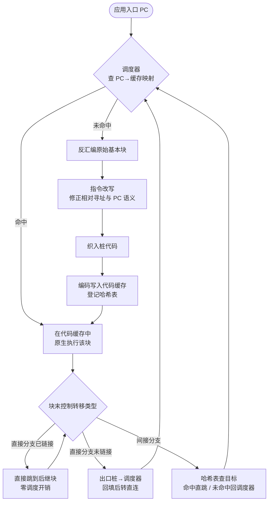
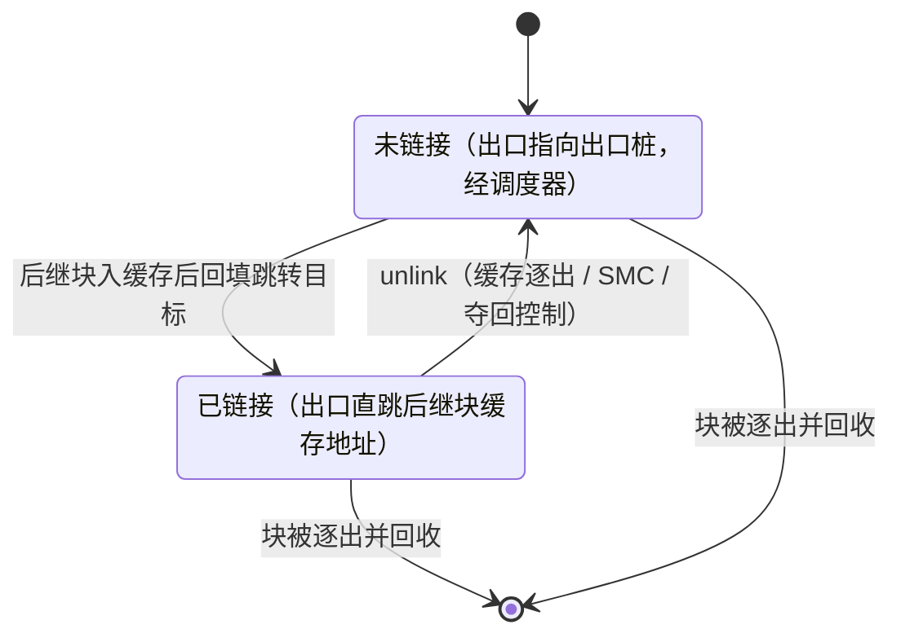
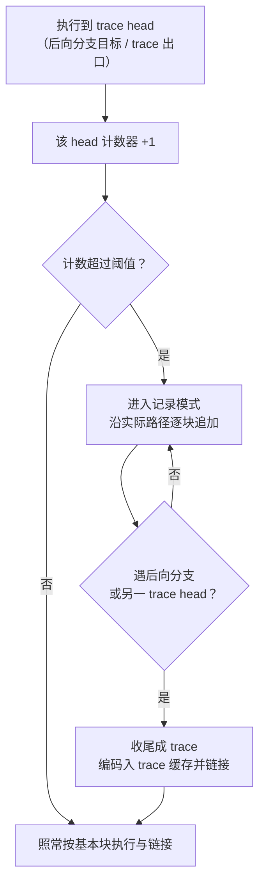

# 动态插桩与模拟执行引擎（2）· DBI原理：代码缓存与trace
> [!abstract] TL;DR
> - DBI 的本质是「复制后执行」而非「陷入后单步」：把原程序按块搬进可写可执行的代码缓存，在搬运的同时插桩，翻译一次、复用千万次——这是它比 ptrace 单步或硬件断点快几个数量级的根因。
> - 翻译单元是「动态基本块」：从分支目标起、到下一次控制转移止，与编译期 CFG 基本块不同、允许互相重叠；热路径再由 NET（Next Executing Tail）算法拼成 trace，把跨块热流拉直成一条缓存内直线。
> - 直接分支靠「链接 + 回填」：出口先指向出口桩回到调度器，后继块入缓存后把那条跳转就地改写成直连，此后原生速度运行；间接分支无法静态直连，只能用哈希表（IBL）在运行时查表跳转，这是 DBI 的头号性能开销。
> - 正确性四大战场：上下文切换与寄存器窃取、eflags 保活、PC/RIP 语义透明化、自修改代码的缓存一致性。任一处理不当，表现为静默的行为偏差而非干脆的崩溃，极难排查。
> - unlink 与缓存刷新是可控性基石：代码被改写、模块被卸载、缓存满需逐出时，必须能把某块的所有入边断链、安全回退，否则缓存会拿着陈旧代码继续跑。

## 概述与定位

本篇是《动态插桩与模拟执行引擎》系列的第二篇，承接[[01.动态分析引擎全景：DBI与Emulation|上一篇]]确立的坐标系——DBI（Dynamic Binary Instrumentation，动态二进制插桩）与 Emulation（模拟执行）是两条并行的技术路线——聚焦讲透 DBI 家族**共通的底层引擎机制**：代码缓存（code cache）、翻译块（translated block / fragment）、链接（linking）与回填（backpatching），以及在此之上的 trace 构建。后续第 03～06 篇分别落到 Intel Pin、DynamoRIO、Frida-Gum/Stalker、QBDI 各自的工程实现，本篇则是它们共享的「第一性原理」层，读懂了这一层，再看任何一个具体引擎都只是换皮。

要理解 DBI 为什么要有代码缓存，先要看清它想解决的矛盾。逆向与分析场景需要在**任意指令粒度**上观察和干预一个二进制程序：每条内存访问、每次分支、每个函数调用。最朴素的做法是用调试器单步——`PTRACE_SINGLESTEP` 或设 trap 标志，每执行一条指令陷入内核一次。这在正确性上无懈可击，但性能是灾难：一次陷入 + 上下文切换 + 内核态往返，动辄上千周期，用来跑完一个稍大的程序等于几天几夜。DBI 的核心洞见是把「观察」的成本从**每条指令一次内核往返**，摊薄成**每个代码块一次用户态翻译、之后零成本复用**。

实现这个摊薄的关键装置就是代码缓存：一块**可写、可执行**的内存区域，引擎把原程序的机器码一段一段复制进去，复制的同时把插桩逻辑（计数、打印、污点传播、覆盖率记录等）织进指令流，然后**让 CPU 直接在缓存里以原生速度执行这份被改写过的副本**。原程序原来的代码页从头到尾一条都没真正执行过——CPU 的指令指针始终落在缓存里。这就是 DBI 与「解释器 / 模拟器」的分水岭：模拟器逐条解码执行、CPU 跑的是解释循环；DBI 的 CPU 跑的是被搬运和插桩后的**真实目标指令**，宿主与被测同架构，因而快得多（同架构无需跨 ISA 翻译；跨架构那是 Emulation 的活，见[[08.QEMU-TCG动态二进制翻译|第 8 篇]]）。

一句话定位：**代码缓存是 DBI 引擎的心脏，翻译块是它的细胞，链接与回填是让血液在细胞间以原生速度流动的血管**。本篇要把这颗心脏解剖到肌纤维级别。

## 原理与机制

### 执行模型：调度器主循环

DBI 引擎运行时在逻辑上分成两个「世界」：**应用世界**（application context，被测程序的寄存器、栈、内存状态）和**引擎世界**（DBI 自己的调度器、缓存、哈希表、TLS 槽）。CPU 大部分时间待在应用世界里，在代码缓存中飞速执行翻译块；只有当它撞到一个「引擎还没处理过的目标地址」时，才**上下文切换**回引擎世界，由调度器（dispatcher，DynamoRIO 里叫 `dispatch`，是引擎的中枢）决定下一步。

调度器的职责用伪代码写出来极其简洁，但每一行背后都是一个大工程：

```text
dispatch(app_pc target):            # target 是"下一条要执行的原始应用地址"
    cache_pc = lookup(target)       # 在 PC→缓存 哈希表里找译码副本
    if cache_pc == MISS:
        block   = decode(target)    # 反汇编出一个动态基本块
        block   = mangle(block)     # 指令改写：修相对寻址/PC 语义/特权指令
        block   = instrument(block) # 客户端插桩：插 analysis routine
        cache_pc = emit(block)      # 编码写进代码缓存，登记进哈希表
    context_switch_to_app()         # 恢复应用寄存器/eflags
    jump cache_pc                   # 跳进缓存执行——从此不再回来，直到下次 miss
```

理解这个循环有三个要点。其一，**miss 是一次性成本**：同一个 `target` 只会 decode/mangle/instrument/emit 一次，第二次起 `lookup` 命中直接跑，这正是「翻译一次、复用千万次」。其二，`context_switch` 不是内核态切换，而是纯用户态的寄存器保存/恢复——引擎要腾出寄存器给自己用，进应用世界前把应用寄存器从 TLS 槽装回去，出来时再存回。其三，理想情况下 CPU 应该**尽量不回到调度器**：每回一次都要付上下文切换和哈希查表的钱。后文的「链接」正是为了让缓存内的块能彼此直连、绕开调度器而生。



### 翻译块：动态基本块的定义与陷阱

DBI 的翻译单元通常从「基本块」起步，但要特别澄清：**DBI 的动态基本块不等于编译原理里的静态 CFG 基本块**。DBI 的动态基本块是「从某个分支目标地址开始、顺序取指、直到遇到第一条控制转移指令（jmp/call/ret/jcc/中断/系统调用）为止」的一段指令。它有两个不同于教科书 BB 的关键性质：

- **单入单出、以分支收尾**：入口一定是某次分支的落点，出口一定是一条转移指令。落到块中间的 `jcc` 目标会开启一个**新的、与前一块重叠**的动态块——同一批静态字节可能属于多个动态块。这与静态分析里「基本块互不重叠」的假设正好相反，是初学者读 DBI 缓存 dump 时最困惑的点。
- **边界由运行时实际取指决定，而非静态扫描**。这带来一个巨大优势：DBI 天然免疫[[45.反编译器与反汇编引擎原理/01.反汇编算法：线性扫描与递归遍历|静态反汇编]]的两大顽疾——它不需要区分代码与数据（只翻译真正被执行到的字节），也不惧怕间接跳转、加壳、运行时解密、JIT 生成的代码（谁被执行就翻译谁）。这是 DBI 相对静态改写的根本护城河，也是它能用来脱壳、分析混淆代码的原因。

翻译块被搬进缓存前要经过 **mangle（改写）→ instrument（插桩）→ emit（编码）** 三道工序。mangle 是纯粹为「换了地址还要行为不变」服务的机械改写（详见第三节）；instrument 是留给分析工具（客户端 / Pintool / DR client）注入观测逻辑的口子；emit 把改写后的指令重新编码成机器码写进缓存并登记到 PC→缓存 哈希表。

### PC→缓存 映射：一切复用的索引

缓存里躺着一堆翻译块，怎么知道「应用地址 0x401000 对应的副本在缓存里的哪儿」？靠一张哈希表（DynamoRIO 的 fragment table、Pin 的类似结构），键是原始应用 PC，值是缓存内地址。调度器的 `lookup` 查它，间接分支的运行时解析（IBL）也查它。这张表的查询效率直接决定 DBI 的间接分支开销，因此实现上极度优化——通常是开放寻址、掩码取模、内联到缓存代码里以避免函数调用，后文详述。

## 结构与算法详解：代码缓存、链接回填与 trace 构建

这一节是本篇的核心，把上面的「机制」拆到算法与数据结构级别。

### 代码缓存的结构与管理

代码缓存本质是一个（或几个）大的可执行内存 arena。DynamoRIO 采用**两级缓存**：一个 **basic block cache** 存放初次翻译的基本块，一个 **trace cache** 存放后续构建的热路径 trace。为什么分两级？因为两者的生命周期与替换策略不同——基本块量大、周转快，trace 是精挑细选的热点、值得长留；分开管理便于对 trace 用更激进的优化和更保守的逐出。

缓存不是无限的，于是有三个绕不开的管理问题：

- **容量与逐出**：缓存写满后要么整体清空（flush-all，简单但抖动大），要么按 FIFO / 分代（generational）逐出旧块。逐出一个块并不能一删了之——必须先把**所有指向它的链接**（入边）断掉，否则别的块会跳进一块已被回收、可能被新块覆盖的内存，直接崩溃。因此引擎要为每个块维护一张**入边链表**（incoming links list），逐出即遍历入边逐一 unlink。这是「链接」这套机制在容量管理上的对偶代价。
- **一致性（cache coherence）**：缓存里是原始代码的副本。一旦原程序**自修改代码（SMC）**、被调试器改写、模块被 `dlclose`/`munmap` 卸载、或代码页被重新映射，缓存里的副本就**陈旧**了，继续跑就是执行了「本不该再存在的旧指令」。这在语义上是严重错误，也是安全边界（见第五节）。
- **刷新（flush）的安全性**：要作废某段代码对应的所有缓存块，得有一张「应用内存区域 → 缓存块集合」的反向映射。更棘手的是**不能删掉某个线程此刻正踩在上面执行的块**——多线程下必须做同步刷新（延迟到所有线程离开该块，或抢占并迁移它们的执行点），这是 DBI 引擎里最烧脑的并发问题之一。

### 链接与回填：让缓存内相邻块原生直连

回到「尽量别回调度器」这个目标。假设块 A 以一条**直接分支**（目标地址在指令里写死，如 `jmp 0x401050` 或 `jcc`）结尾，后继块 B 的应用地址是已知常量。理想是 A 执行完直接跳进 B 在缓存里的副本，零调度开销。但翻译 A 的那一刻，B 可能**还没被翻译**、缓存里还没有 B。怎么办？

**出口桩（exit stub / linkstub）+ 回填（backpatch）** 是标准解法，分两态：

```text
# --- 未链接态：翻译 A 时 B 尚不在缓存 ---
A_body:
    ... A 的指令 ...
    jmp  A_exit_stub          # 出口先跳到本块的出口桩
A_exit_stub:
    save_context              # 存应用寄存器
    mov  edi, &linkstub_AB    # 标记"从哪条出口出去、目标应用PC是B"
    jmp  dispatch             # 回调度器：请翻译并链接 B

# --- 已链接态：调度器翻译完 B、回填 A 的出口后 ---
A_body:
    ... A 的指令 ...
    jmp  B_body               # 就地改写成直连 B 的缓存地址！从此不再经调度器
```

这段「就地把 `jmp A_exit_stub` 改写成 `jmp B_body`」的动作就是**回填（backpatching）**——引擎在运行时修改已经在缓存里的机器码，把一条跳转的目标从出口桩改成后继块的真实缓存地址。回填之后，A→B 这条边就以**一条原生 jmp** 的成本运行，彻底摆脱调度器。这是 DBI 能把「每块一次调度」降到「近乎零调度」的核心魔法。条件分支（`jcc`）有两个出口（taken / fall-through），各配一个出口桩，各自独立回填，谁先热谁先直连。

与回填相反的操作是 **unlink**：把 `jmp B_body` 改回 `jmp A_exit_stub`。它在三种场合必不可少——缓存逐出 B（断开所有入边）、B 所在区域发生 SMC 需作废、或引擎要临时夺回控制（如附加调试、动态改插桩）。链接/解链本质是一对「运行时代码补丁」原语，可控性全靠它。



### 间接分支：无法静态直连的头号开销

直接分支能回填直连，是因为目标是常量。但 `ret`、`call reg`、`jmp [mem]`、虚函数调用、switch 跳转表这些**间接分支**，目标是运行时才算出的值，且**同一条指令每次目标可能不同**（一个 `ret` 会返回到 N 个不同调用点）。没法用一条写死的 `jmp` 直连——每次都得拿运行时算出的**应用目标地址**去查 PC→缓存 哈希表，找到对应缓存块再跳。这就是 **IBL（Indirect Branch Lookup，间接分支查找）**：

```text
# 间接分支被改写成的内联查表序列（示意）
    ; 此刻寄存器里是运行时算出的"应用目标地址" app_tgt
    mov   scratch, app_tgt
    and   scratch, HASH_MASK          ; 哈希：掩码取模定位桶
    cmp   [ibt_table + scratch*8], app_tgt   ; 桶里的键 == 目标？
    jne   ibl_miss                    ; 未命中→回调度器慢路径
    jmp   [ibt_table + scratch*8 + 8] ; 命中→跳到桶里存的缓存地址
ibl_miss:
    jmp   dispatch                    ; 让调度器翻译并填表
```

间接分支是 DBI 性能的**头号敌人**，原因有二：一是每次都要几条额外指令 + 一次**依赖内存的分支**，无法像直接分支那样一劳永逸；二是它**打乱了 CPU 的返回地址预测**——真实 `ret` 会被 CPU 的返回栈缓冲（RSB）准确预测，但 DBI 把 `ret` 变成了 `jmp [table]`，RSB 失效、分支预测频繁 miss，流水线反复清空。工程上有一堆缓解手段：为 `ret` 单独建表、把最近命中的目标**内联缓存**（inline cache，先 `cmp` 上次的目标，等则直落、不等才查表）、共享 vs 私有 IBT 的权衡等。**能否把间接分支的开销压下去，几乎决定了一个 DBI 引擎的整体性能水平**，这也是 trace 存在的重要理由之一。

### trace 构建：把热路径拉直

只用基本块 + 链接已经能跑得不错，但还有优化空间：块与块之间即便直连，控制流仍是碎的，I-cache 局部性差、间接分支仍要查表、插桩优化的窗口局限在单块内。**trace（也叫 superblock）** 把频繁连续执行的一串基本块**拼成一个单入多出的大块**，收编进 trace 缓存。

主流构建算法是源自 HP Dynamo 的 **NET（Next Executing Tail）**，DynamoRIO 沿用并优化：

1. 给「trace head」（后向分支的目标——通常是循环头，以及现有 trace 的出口）挂一个执行计数器。
2. 每次执行到某 head，计数 +1；一旦超过阈值（Dynamo 里约 50，可调），判定该 head 为热点，**进入记录模式**。
3. 记录模式下，引擎**顺着当前这一次的实际执行路径**逐块追加指令，直到遇到一条后向分支（回到某 trace head，形成循环）或撞上另一个已存在的 trace head 为止。
4. 把这条记录下来的路径收尾、编码成一条 trace，写入 trace 缓存并链接。

NET 的精妙在于「Next Executing Tail」这个启发式：它不去做复杂的路径剖析，而是朴素地相信「热点头之后**紧接着执行的那条路径**大概率就是热路径」，直接把这条尾巴录下来。实践中这个赌注命中率相当高。trace 带来四重收益：

- **摊薄调度/链接成本**：一条 trace 覆盖多块，进出缓存的边界事件更少。
- **拉直控制流**：热路径变成缓存里一条物理连续的直线，I-cache 命中率和分支预测（多为 fall-through）双双改善。
- **把间接分支变便宜**：trace 记录时目标是确定的，可在 trace 里放一个**内联检查**（`cmp` 预测目标，等则直落进 trace 下一块，不等才走出口查表），把昂贵的 IBL 在热路径上降级成一次廉价比较——这是 trace 对付间接分支的杀手锏。
- **扩大优化窗口**：eflags 活跃性分析、寄存器分配、冗余插桩消除都能跨块进行，插桩代码可被显著精简。



### 指令改写（mangling）：换了地址还要行为不变

块被搬到缓存里，物理地址变了，有几类指令的语义会因此走样，必须在 mangle 阶段改写：

- **相对直接分支**：`jmp rel32`、`call rel32`、`jcc rel32` 的位移是相对当前 PC 的，块搬家后位移必须重算（或干脆改写成先前所述的出口桩机制）。
- **x86-64 的 RIP 相对寻址**：`mov rax, [rip+disp]` 这类指令的有效地址依赖指令自身位置，搬到缓存后 rip 变了、算出的地址就错了。必须改写——要么重算 disp（若原目标仍在 ±2GB 可达），要么借一个 scratch 寄存器把**原始绝对地址**物化出来再访存。这是 x64 下 DBI 最繁琐的改写之一。
- **读取 PC 的指令与透明性**：`call` 会把返回地址压栈——若压的是缓存地址，一旦应用程序读取自己的返回地址（异常处理、栈回溯、`__builtin_return_address`、GetPC thunk、反调试自检）就会看到「不该看到的缓存地址」，透明性破功。因此引擎必须让 `call` 压入**原始应用返回地址**，并在真正 `ret` 时把它翻译回缓存地址执行。PC 语义的透明化是 DBI 正确性与隐蔽性的分水岭。
- **特权/敏感指令**：`syscall`/`sysenter`/`int 0x80`（系统调用要引擎介入才能拦截参数、处理返回）、`cpuid`、`rdtsc`（时间可能泄露插桩开销）、`int3` 等，按引擎策略特殊处理或重定向。

### 上下文、寄存器窃取与 eflags

引擎在缓存代码里插桩、查表、跳转，都需要自己的**暂存寄存器**和存放引擎状态（TLS 槽、调度器入口）的地方，但这些寄存器本属于应用程序、正装着它的活数据。x86-32 只有 8 个通用寄存器，腾挪空间极其局促，是 DBI 实现的老大难。常见手法：

- **寄存器窃取 / 溢出**：在插桩片段前把要用的应用寄存器 spill 到 **TLS 槽**，用完 restore；DynamoRIO 还会借用段寄存器（fs/gs）来定位每线程的 TLS，把引擎状态藏进段基址偏移里。Pin 则提供**虚拟寄存器**抽象，由引擎做寄存器分配，对客户端隐藏物理寄存器的争抢。
- **eflags 保活**：几乎任何算术/比较插桩指令都会改写标志位，若不保存就会破坏应用后续依赖的条件码，导致分支走错——而且是**静默走错**，不崩溃、极难查。所以插桩前后要 `pushf/popf` 或 `lahf/sahf/seto` 保存恢复标志。但无脑保存很贵，引擎会做**标志活跃性分析**：若某处的 eflags 后续不再被读就跳过保存，trace 把这个分析扩展到跨块，能省下大量冗余的存取。

### 一致性：自修改代码与缓存失效

前面反复提到 SMC。展开讲：应用改写了自己某段代码后，缓存里的旧副本必须作废重译。检测有两条路——**页保护法**：把已翻译的代码页设为只读，应用一写就触发缺页/写保护异常，引擎在异常处理里定位受影响的缓存块并刷新；**沙箱化（sandboxing）**：对已知会自修改的区域，在其写指令旁插桩，运行时检查「是否写到了已缓存代码」，命中即刷新。前者对偶发 SMC 高效、对高频自改抖动大；后者反之。Frida Stalker 用「信任阈值（trust threshold）」权衡：一个块被原样见到多少次后才信任并长期缓存，见到变化就重编，专门对付自修改与运行时补丁。缓存一致性做不对，就是「跑着跑着执行了旧逻辑」，既是正确性 bug 也是安全漏洞。

## 工具视角与实战

上面的机制在各家引擎里的具体呈现，可作为读源码/调参的路标：

- **DynamoRIO**：代码缓存 + trace 的教科书实现，`dispatch`、fragment、linkstub、IBL、bb/trace 双缓存这些术语直接对应本篇概念。调试可用 `drrun -disasm_att` 观察缓存内代码；`-no_link`（禁链接，全走调度器，慢但便于观察每块边界）、`-no_traces`（只用基本块不建 trace）、`-code_api` 等选项能把上述机制逐个关掉对照，是理解链接/trace 贡献了多少性能的最佳实验开关。详见[[04.DynamoRIO架构与客户端|第 4 篇]]。
- **Intel Pin**：对客户端暴露 **Trace 粒度**的插桩回调（`TRACE_AddInstrumentFunction`），一个 Pin trace 是单入多出、遇无条件分支即断的序列——正是本篇 trace 的工程化封装。Pin 的 JIT 编译器 + code cache + register reallocation 是闭源但同构的实现，`-log_jit` 之类能窥见缓存活动。见[[03.Intel-Pin架构与Pintool开发|第 3 篇]]。
- **Frida-Gum / Stalker**：Stalker 是 Frida 的 DBI 引擎，按 block 编译进缓存、做 block 级链接、用 trust threshold 处理 SMC，`GumStalker` 的 transform 回调让你改写每个块。日常从[[32.hooks/09-frida|Frida 用法]]入门后，深入内部机制见[[05.Frida-Gum与Stalker内部机制|第 5 篇]]。
- **QBDI**：Quarkslab 的轻量框架，基于 LLVM MC 做反汇编/编码，以 ExecBlock 作缓存单元，主打「嵌进你自己的进程、API 简单」的场景，见[[06.QBDI轻量级插桩框架|第 6 篇]]。
- **Valgrind（对比坐标）**：走的是 **D&R（Disassemble-and-Resynthesize）** 路线——把机器码先反汇编成 VEX IR，插桩后再重新编译回机器码，同样有代码缓存与链接，但因为经过 IR，比 Pin/DR 的 **copy-and-annotate（保留原指令、旁插调用）** 重得多，换来的是更强的可分析性与跨架构一致性。这一「重 IR vs 轻旁插」的取舍，是选型时的关键横向对比。

逆向实战视角，理解代码缓存能解释很多「诡异现象」并转化为能力：其一，**脱壳与反混淆**——DBI 只翻译真正执行到的字节，加壳程序运行时自解密的代码一旦被执行就进了缓存，dump 缓存或在缓存翻译点下钩即可拿到解密后的真实指令，这是静态工具做不到的；其二，**排查地址错乱**——若你在插桩里打印返回地址却看到怪异的值，多半是撞上了 PC 透明化边界，要区分「应用视角地址」与「缓存视角地址」；其三，**覆盖率与 trace 采集**——块的翻译点天然是覆盖率打点位，一个块被翻译即代表其入口被命中，这正是[[49.Fuzzing与漏洞挖掘/00.Fuzzing与漏洞挖掘总览|Fuzzing]]里覆盖率反馈的底层来源之一（详见本系列[[12.插桩驱动的分析：覆盖率与污点与trace|第 12 篇]]）。

## 安全性与正确使用

代码缓存与链接机制的安全影响，核心是**「引擎在被测进程内运行、且要对被测透明」这一处境本身带来的双向风险**。

**正确性即安全性。** 缓存一致性若出错，引擎会拿着陈旧副本继续执行——在分析恶意样本时，这意味着样本用一次 SMC 或运行时补丁就能让引擎看到 A、CPU 实际跑 B，分析结论与真实行为脱节。这不是性能问题而是**可信度问题**：一个不能正确处理自修改代码与代码卸载的 DBI，其产出的 trace / 覆盖率 / 污点结论都不可信。因此 SMC 检测、模块卸载时的缓存刷新、多线程下的安全刷新，是「正确使用」的硬性底线而非优化项。

**透明性泄露即被反制。** 因为引擎把代码搬进了缓存、多映射了内存、改变了时序，程序（尤其是恶意样本）可以据此**探测到自己正被插桩**并改变行为、拒绝解密或直接退出。探测手段包括：读取返回地址/PC 看是否落在意外区域（考验 PC 透明化是否到位）、`rdtsc` 计时发现执行被拖慢、扫描地址空间找出引擎自身的缓存与数据结构、检查父进程/环境痕迹等。**透明性做得越彻底，反制越难**——这也说明为何 PC 语义透明化、时间伪装、内存布局隐藏是严肃 DBI 引擎的必修课。这类攻防是[[14.反插桩与反模拟对抗|第 14 篇]]的主题，本篇只从「机制为何会泄露」的角度点到：泄露的根源正是代码缓存与 mangle 留下的可观测差异。

**加固边界（面向用 DBI 造沙箱/隔离者）。** 若把 DBI 当作安全隔离层（如用它做控制流完整性、系统调用过滤的沙箱），必须守住几条：代码缓存应尽量遵循 **W^X**——写入/回填阶段可写、执行阶段不可写，避免被测代码把缓存当成可写可执行的跳板搞注入；出口桩、IBT、调度器入口这些**引擎控制结构不能暴露给被测代码随意读写**，否则回填地址被篡改就等于把控制流拱手让人；间接分支的目标必须经哈希表校验后才跳，绝不能信任被测算出的原始指针直接跳进缓存（否则等于给了任意地址跳转）。换言之，**链接与回填是运行时改代码的强力原语，用它加固时，它自身也必须先被保护**。

**误用风险（面向插桩工具开发者）。** 最隐蔽的坑是插桩代码**破坏了 eflags 或窃取的寄存器却没恢复**——不会崩溃，只会让被测程序在某个条件分支上悄悄走错，产出错误结果还查不出原因。因此写插桩务必依赖引擎提供的寄存器/标志保存抽象（DR 的 drreg、Pin 的虚拟寄存器），别手抠物理寄存器；同时警惕插桩里调用的库函数**重入**引擎（分析例程里再触发被插桩的代码路径会导致递归/死锁）。

## 小结

本篇把 DBI 引擎的心脏解剖到了肌纤维级：

- **范式**：DBI 是「复制后执行」——把代码按动态基本块搬进可写可执行的代码缓存、搬运时插桩、让 CPU 在缓存里原生跑副本，用「翻译一次复用千万次」摊薄观测成本，这是它碾压单步调试的根因。
- **翻译块**：动态基本块从分支目标起、到下一控制转移止，允许重叠、由运行时取指决定边界，天然免疫静态反汇编的代码/数据之分与间接跳转难题。
- **链接与回填**：直接分支用出口桩 + 回填就地改写成缓存内直连、绕开调度器；unlink 是它的逆操作，支撑逐出、刷新与夺回控制。间接分支无法静态直连，只能靠 IBL 哈希查表，是头号开销。
- **trace**：NET 算法把热路径拉直成单入多出的大块，摊薄边界成本、改善局部性与分支预测、把间接分支降级成内联检查、扩大优化窗口。
- **正确性四战场**：上下文/寄存器窃取、eflags 保活、PC/RIP 透明化、SMC 一致性——处理不当是静默偏差，既毁正确性也开安全缺口。

掌握了这一层，再读 Pin、DynamoRIO、Stalker、QBDI 的具体架构，看到的将不再是陌生 API，而是同一套心脏机制的不同封装。下一篇进入 Intel Pin 的具体架构与 Pintool 开发。

## 相关阅读

- Derek Bruening, *Efficient, Transparent, and Comprehensive Runtime Code Manipulation*, MIT PhD 论文, 2004 —— 代码缓存、出口桩链接、IBL、trace 的**权威一手系统性论述**，DynamoRIO 的理论基石。
- V. Bala, E. Duesterwald, S. Banerjia, *Dynamo: A Transparent Dynamic Optimization System*, PLDI 2000 —— NET trace 构建与 fragment cache 的开山之作。
- C.-K. Luk 等, *Pin: Building Customized Program Analysis Tools with Dynamic Instrumentation*, PLDI 2005 —— Pin 的 JIT + code cache + trace 插桩模型。
- N. Nethercote, J. Seward, *Valgrind: A Framework for Heavyweight Dynamic Binary Instrumentation*, PLDI 2007 —— D&R 路线与 copy-and-annotate 的对比参照。
- 官方文档：DynamoRIO（dynamorio.org 的 API/设计文档）、Intel Pin User Guide、Frida Stalker 文档、QBDI 文档。
- 本系列：[[01.动态分析引擎全景：DBI与Emulation|① DBI与Emulation全景]]、[[03.Intel-Pin架构与Pintool开发|③ Intel Pin架构]]、[[04.DynamoRIO架构与客户端|④ DynamoRIO架构]]、[[05.Frida-Gum与Stalker内部机制|⑤ Stalker内部机制]]、[[06.QBDI轻量级插桩框架|⑥ QBDI]]、[[08.QEMU-TCG动态二进制翻译|⑧ QEMU-TCG（TB缓存的模拟对偶）]]、[[12.插桩驱动的分析：覆盖率与污点与trace|⑫ 插桩驱动分析]]、[[14.反插桩与反模拟对抗|⑭ 反插桩对抗]]。
- 同库延伸：[[45.反编译器与反汇编引擎原理/01.反汇编算法：线性扫描与递归遍历|静态反汇编算法（DBI 的静态对偶）]]、[[32.hooks/09-frida|Frida 用法入门]]、[[39.固件与IoT嵌入式逆向/23.固件仿真进阶Qiling与HALucinator|固件 rehost 场景]]、[[49.Fuzzing与漏洞挖掘/00.Fuzzing与漏洞挖掘总览|Fuzzing 与漏洞挖掘总览]]。

[[00.动态插桩与模拟执行引擎总览|⬆ 系列总览]] | [[01.动态分析引擎全景：DBI与Emulation|← 上一章]] | [[03.Intel-Pin架构与Pintool开发|→ 下一章]]
