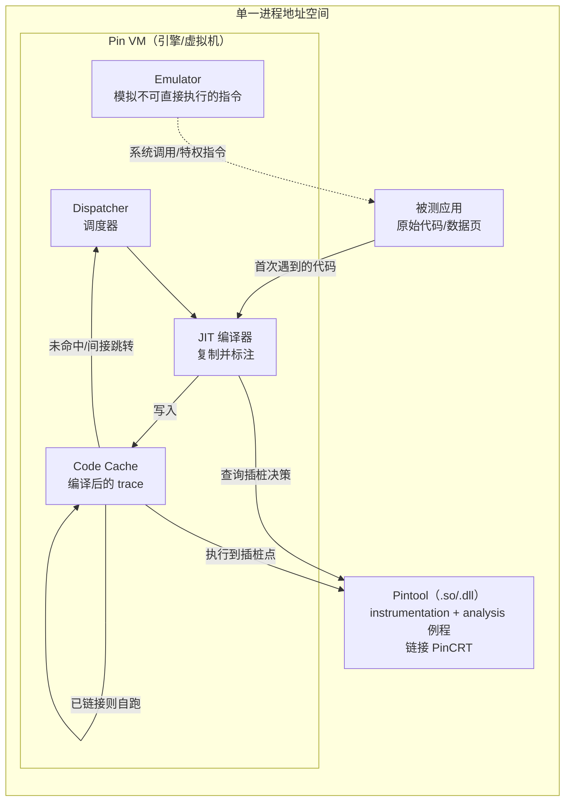
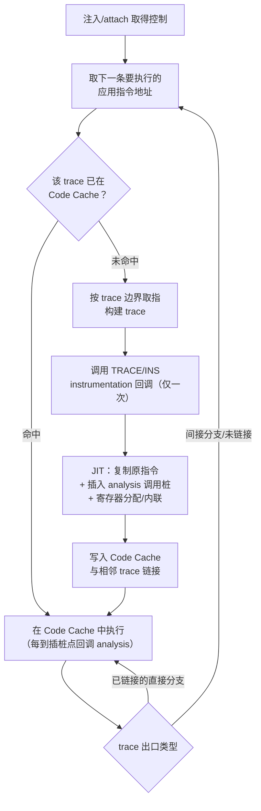
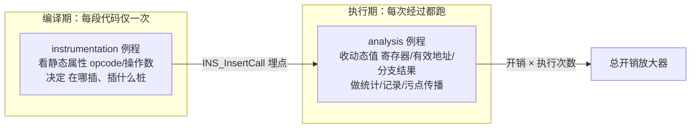
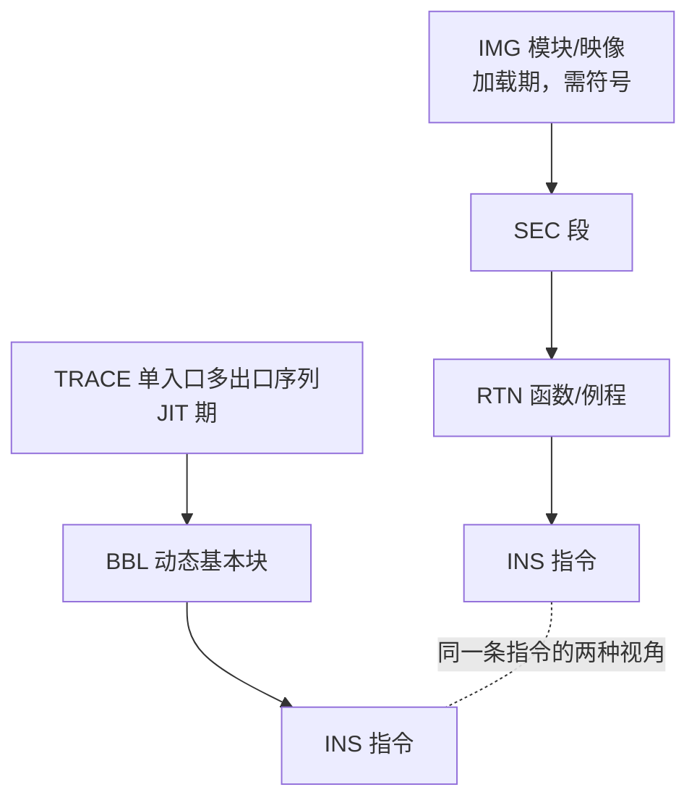

# 动态插桩与模拟执行引擎（3）· Intel-Pin架构与Pintool开发
> [!abstract] TL;DR
> - Pin 是 Intel 的 JIT 型 DBI 框架，Pin VM、Pintool、被测程序**共享同一进程地址空间**；VM 以 trace 为单位即时编译原始指令进代码缓存，走的是"复制并标注"(copy-and-annotate)路线，而非 Valgrind 那种"反汇编再合成"(disassemble-and-resynthesize)。
> - 全部性能空间来自一个心智模型：**instrumentation/analysis 两相分离**。instrumentation 例程在一段代码首次被编译时**只跑一次**、决定"在哪插桩、插什么桩"；analysis 例程在插桩点**每次执行都跑**、拿到寄存器/有效地址/分支结果等动态值——把工作从后者搬到前者，就是优化。
> - 五种插桩粒度 INS / BBL / TRACE / RTN / IMG 构成两条包含链（TRACE⊃BBL⊃INS 与 IMG⊃SEC⊃RTN⊃INS）；粒度越粗，每次执行触发的回调越少。BBL 计数把"每指令一次调用"降为"每基本块一次调用 × 块内指令数"，是范式级的开销优化。
> - `INS_InsertIfCall`/`INS_InsertThenCall` 条件插桩 + 简单 analysis 的**内联**(inlining) + 寄存器活跃性分析共同把回调开销压到接近零；而 `INS_InsertPredicatedCall` 才能对 `cmov`/`rep` 等谓词化指令给出**正确**的内存访问计数。
> - Pin 与应用同址、**非沙箱**：它改变时序、改变内存布局、可被反插桩探测，对自修改代码需显式开启 SMC 支持——这些既是正确性陷阱也是安全边界。

## 概述与定位

Intel Pin 是把上一章讲的 DBI 通用原理（代码缓存、trace、JIT 转译）落地为一个成熟工程产品的典型代表。它诞生于计算机体系结构研究——最初 Intel 与高校用它做缓存/分支预测器仿真，2005 年 PLDI 论文《Pin: Building Customized Program Analysis Tools with Dynamic Instrumentation》（Luk 等）把它公开，此后成为学术界与工业界事实上的 x86 插桩基础设施之一。它的定位一句话概括：**无需源码、无需重编译，就能为一个已有的二进制程序编写自定义的运行时分析工具**。用户写的分析工具叫 **Pintool**——一个链接了 Pin API 的共享库（Linux 上 `.so`，Windows 上 `.dll`）。

在本系列的坐标里，Pin 是"JIT 型 DBI"这条线的第一个具体样本：第 02 篇讲清了代码缓存与 trace 的抽象机制，本篇把这些机制映射到 Pin 的真实架构与 API；第 04 篇的 DynamoRIO、第 05 篇的 Frida-Gum/Stalker、第 06 篇的 QBDI 都是同一家族的不同取舍，本篇会在"工具视角"里横向对照它们，也对照采用不同技术路线的 Valgrind。相对于第 45 库的静态反汇编引擎，Pin 是它的动态对偶——它只看真正执行到的路径，天然规避了静态反汇编在间接跳转、混淆、加壳面前的失效。

平台与边界要先说清楚，因为这决定了你能不能用它：现代 Pin（3.x 系列）**只支持 x86（IA-32）与 x86-64（Intel 64）**，覆盖 Linux、Windows，macOS 支持在近年逐步收缩。历史上 Pin 曾支持 Itanium(IA-64) 与 ARM，但都已弃用——**Pin 没有 ARM/AArch64 支持**，这是它与 DynamoRIO、Frida、QBDI 最重要的分野之一：移动端/嵌入式逆向基本不用 Pin。此外 Pin 本体是**闭源的免费二进制**（不是开源），你拿到的是引擎，扩展只能通过 Pintool，这与开源的 DynamoRIO 又是一层区别。

## 原理与机制

### 三方共处一室：单地址空间模型

Pin 运行时，一个进程里同时住着三个"租客"，共享同一份地址空间：**Pin VM（引擎本身）**、**Pintool（你的分析工具）**、**被测应用**。Pin VM 内部由几部分组成：一个 **JIT 编译器**（负责把应用原始指令复制、标注、编译进代码缓存）、一个 **dispatcher（调度器）**（决定下一步执行哪个 trace）、一个 **emulator（模拟器）**（处理那些不能让应用直接执行、必须由 Pin 接管语义的指令，例如系统调用、某些特权/异常相关指令），以及 **code cache（代码缓存）**。Pin 通过注入取得控制权：Linux 上用 `ptrace` 由注入器接管子进程、Windows 上以挂起方式创建进程再注入，随后 Pin 就"绑架"了应用的执行——**在 JIT 模式下，应用的原始代码页永远不会被直接执行**，一切都从代码缓存里跑。



"共处一室"是理解 Pin 一切利弊的钥匙。好处是**零 IPC 开销**：Pintool 直接读应用内存、直接被调用，比跨进程调试器快得多。代价是**没有隔离**：Pintool 的 bug 会污染应用，恶意应用理论上能攻击 Pin/Pintool，任何全地址空间的行为（内存布局、时序）都因 Pin 的存在而改变。为缓解 Pintool 与应用运行时库互相打架，Pin 3.x 引入了 **PinCRT**——一套 Pin 自带的 C/C++ 运行时，Pintool 不再直接链接系统 libc，从而不与应用的 libc 抢全局状态（如 `errno`、`malloc` 锁）。这解决的是**稳定性**而非安全性。

### JIT 的执行循环：取指、编译一次、缓存复用

Pin 的核心循环与第 02 篇讲的通用 DBI 一致，但有 Pin 自己的边界定义。dispatcher 拿到一个"要执行的应用地址"后，先查代码缓存：命中就直接跳过去执行；未命中就以 **trace** 为单位取指、编译。Pin 的 trace 是**单入口、多出口**的指令序列：它从一个分支目标处开始，遇到无条件控制转移（或达到长度上限、达到一定数量的条件分支）就结束。一个 trace 内部再切成若干 **BBL（Pin 语义的动态基本块）**——注意 Pin 的 BBL 是"动态"的：若 trace 从某静态基本块中间进入，Pin 的 BBL 可能只是该静态块的一段，这与编译器教科书里的静态基本块不完全等同。

编译一个 trace 时，Pin 做三件事：**复制**原始指令（copy-and-annotate 的"copy"），根据 Pintool 的插桩决策**插入 analysis 调用桩**（"annotate"），然后做 **JIT 优化**（寄存器重分配、活跃性分析、简单 analysis 内联）。编译好的 trace 之间会做 **链接（linking）**：直接分支直接把一个 trace 的出口接到下一个 trace 的入口，从此热路径在缓存内自跑、不再回 dispatcher；间接分支（`ret`、`jmp reg`、`call reg`）无法静态确定目标，Pin 用一个快速的间接分支查找（哈希表把"原始目标地址"映射到"缓存内地址"）来解决，尽量避免昂贵的往返。



一个关键的透明性设计：**Pin 向 Pintool 呈现的是应用的"原始地址"，而非缓存内地址**。执行明明发生在代码缓存里，但当你在 analysis 里取 `IARG_INST_PTR` 时，拿到的是该指令在原始映像里的地址——Pin 维护着"原始↔缓存"的双向映射。这让分析视角保持"仿佛在原地执行"的直觉，但也正是反插桩对抗（第 14 篇）的主战场：应用若自己读 PC（`call`/`pop`、`lea rip`）、做代码校验和、或触发异常看返回地址，都可能撞见 Pin 的痕迹。

### JIT 模式 vs Probe 模式

Pin 有两种工作模式。默认的 **JIT 模式**如上，全程 JIT，能在任意指令粒度插桩，功能最全但有 JIT 开销。另一种 **Probe 模式**不 JIT 整个应用，而是在**函数入口打一条跳转（probe）**，把控制导向你的替换函数——它只能做 RTN 粒度的函数替换/包装，不能逐指令插桩，但开销极低（接近原生），适合"只想 hook 几个 API"的场景。选择哪种，本质是"全程接管换取任意粒度"与"点状 hook 换取低开销"的取舍。

### 与应用运行时的交互点

Pin 还必须接管一批"会改变世界"的事件，并把它们作为回调开放给 Pintool：**系统调用**（`PIN_AddSyscallEntry/ExitFunction`，可读改 syscall 号与参数、读返回值——因为 syscall 会改内存、起线程、映射文件，Pin 必须知情）、**线程创建/销毁**（`PIN_AddThreadStart/FiniFunction`）、**信号/上下文变更**（`PIN_AddContextChangeFunction`）、**映像加载/卸载**（`IMG_AddInstrumentFunction`/`IMG_AddUnloadFunction`）、**子进程 exec/fork**（`PIN_AddFollowChildProcessFunction`，配合 `-follow_execv`）、以及**程序退出**（`PIN_AddFiniFunction`，落盘统计结果的地方）。多线程下 Pin 不串行化应用，**analysis 例程必须自己保证线程安全**——这是后面"安全性"要重点谈的坑。

## 插桩粒度与 instrumentation/analysis 分离详解

这一段是 Pin 的灵魂，也是写出"能跑"与"跑得动"的 Pintool 的分水岭。两个概念——**插桩粒度**与 **instrumentation/analysis 分离**——是正交又协同的：分离决定"某个动作在编译期做还是执行期做"，粒度决定"编译期以多大的单位遍历代码、执行期以多稀疏的密度触发回调"。

### 两相分离：一次 vs 每次

Pin 把工具代码切成两类，语义与执行时机截然不同：

- **instrumentation（插桩）例程**：在一段代码**首次被 JIT 编译时调用一次**。它面对的是**静态信息**——这条指令的 opcode 是什么、有几个操作数、是不是内存读、是不是分支、目标寄存器是谁。它的职责是**决策**："要不要在这里埋点？埋在指令之前还是之后？给 analysis 传哪些参数？"典型 API 是 `INS_AddInstrumentFunction`/`TRACE_AddInstrumentFunction`（JIT 期触发）与 `IMG_AddInstrumentFunction`/`RTN_AddInstrumentFunction`（映像加载期触发，需符号信息）。
- **analysis（分析）例程**：在插桩点**每一次执行时都被调用**。它面对的是**动态值**——寄存器此刻的内容、这次访存的有效地址、这次分支实际走没走、当前线程 ID。它做真正的工作：计数、记 trace、传播污点、判定覆盖。



**为什么这样设计（why）？** 因为一段热代码可能被编译 1 次却执行十亿次。把"判断这条指令是不是访存"这种昂贵却结果恒定的工作放进 instrumentation，只付一次；把"记录这次访存地址"这种必须每次做的工作放进 analysis，付十亿次。分离让编译期与执行期的成本泾渭分明，也让下面这条开销模型成立：

```
总开销 ≈  一次性编译开销   Σ_traces  C_jit(trace)
        + 运行期分析开销   Σ_sites ( C_analysis(site) × N_exec(site) )
```

热代码的 `N_exec` 动辄上亿，第二项完全主导。所以优化 Pintool 的三板斧是：**减少插桩点数量、缩小每个 analysis 例程的体量、把能在编译期算的东西全搬到编译期**。理解了这条式子，你才知道"为什么同样功能的两个 Pintool，一个慢十倍"。

### 五种粒度与两条包含链

Pin 提供五级粒度，构成两条并行的包含关系。JIT 期这条：**TRACE ⊃ BBL ⊃ INS**；加载期这条：**IMG ⊃ SEC ⊃ RTN ⊃ INS**。同一条指令，既是某 trace 里某 BBL 的一员，也是某映像里某函数的一员。



- **INS（指令）**：最细。`INS_AddInstrumentFunction` 让你对每条指令决策。开销与写法最直观，但若逐指令埋 analysis 调用，执行期回调最密、最慢。适合指令计数、opcode 混合统计、逐指令 trace。
- **BBL（基本块）**：`INS` 与 `BBL` 都在 trace 编译回调里可见（`INS_AddInstrumentFunction` 其实是构建在 trace 插桩之上的便利封装）。BBL 的价值在于**摊薄**：一个 BBL 内部是直线代码，一旦进入必然全部执行，因此"块内有几条指令"在编译期就知道。
- **TRACE（踪迹）**：最粗的 JIT 粒度。`TRACE_AddInstrumentFunction` 一次把整个 trace 的结构交给你（`BBL_First`/`BBL_Next` 遍历块，`BBL_InsHead`/`INS_Next` 遍历指令），适合需要整段结构信息的分析。
- **RTN（函数）**：函数级，需要符号（`PIN_InitSymbols`）。用于调用计数、参数/返回值记录、函数替换。常见做法是在 `IMG` 回调里按名字找到 `RTN`，`RTN_Open` 后遍历其指令，或直接 `RTN_InsertCall` 在函数进入/返回处埋点。
- **IMG（映像）**：模块级，映像加载时触发。用于按名字定位库函数、给整个模块做初始化、决定"只插桩主程序不插桩 libc"这类范围控制。

粒度选择的本质是**摊薄回调密度**。看 Pin 手册里的经典对照——统计执行了多少条指令：

```cpp
/* inscount0：INS 粒度，每条指令都埋一次 docount()
 * 执行期回调次数 = 动态指令总数（最慢） */
VOID docount() { icount++; }
VOID Instruction(INS ins, VOID *v) {
    INS_InsertCall(ins, IPOINT_BEFORE, (AFUNPTR)docount, IARG_END);
}

/* inscount1：BBL 粒度，每个基本块埋一次 docount(N)
 * 编译期就用 BBL_NumIns 数好块内指令数 N，执行期一次调用顶 N 次
 * 执行期回调次数 = 动态基本块数（通常快数倍） */
VOID docount(UINT32 n) { icount += n; }
VOID Trace(TRACE trace, VOID *v) {
    for (BBL bbl = TRACE_BblHead(trace); BBL_Valid(bbl); bbl = BBL_Next(bbl))
        BBL_InsertCall(bbl, IPOINT_BEFORE, (AFUNPTR)docount,
                       IARG_UINT32, BBL_NumIns(bbl), IARG_END);
}
```

两者结果**完全相同**，但 inscount1 把"每指令一次调用"变成"每基本块一次调用、参数携带块内指令数"。这正是粒度 × 分离协同的范式：**用编译期已知的静态量（`BBL_NumIns`）压缩执行期的回调密度**。这个例子值得刻进肌肉记忆——几乎所有 Pintool 优化都是它的变体。

### 插桩点、参数与调用约定

在哪一"点"插桩由 **IPOINT** 决定：`IPOINT_BEFORE`（指令执行前）、`IPOINT_AFTER`（之后——但对不落地的指令有坑，见下）、`IPOINT_TAKEN_BRANCH`（分支被采纳、跳走那一侧）、`IPOINT_ANYWHERE`（把点交给 Pin 选最优位置，常用于 BBL 计数以便内联）。

传给 analysis 的参数用 **IARG_\*** 描述，列表以 **`IARG_END` 结尾**（忘了它会破坏栈——头号 footgun）。常用的有：`IARG_INST_PTR`（原始指令地址）、`IARG_REG_VALUE`（某寄存器当前值）、`IARG_MEMORYREAD_EA`/`IARG_MEMORYWRITE_EA`（本次访存有效地址）、`IARG_MEMORYREAD_SIZE`、`IARG_BRANCH_TAKEN`/`IARG_BRANCH_TARGET_ADDR`、`IARG_CONTEXT`/`IARG_CONST_CONTEXT`（整份寄存器上下文，后者只读更快）、`IARG_THREAD_ID`、`IARG_FUNCARG_ENTRYPOINT_VALUE`（按 ABI 取函数第 N 个实参）。Pin 会在编译期**生成把这些值搬进正确参数寄存器/栈位的代码**，替你处理 System V / Win64 调用约定与寄存器溢出恢复——这也是它必须在编译期就固定参数列表的原因。**analysis 函数签名必须与 IARG 类型、顺序严格对应**，不匹配是静默的内存踩踏，极难查。想要更快的调用可加 `IARG_FAST_ANALYSIS_CALL`。

### 让 analysis 近乎免费：内联与条件插桩

Pin 的 JIT 有几项优化把回调开销压到接近零，理解它们才能主动配合：

- **内联（inlining）**：若一个 analysis 例程足够简单（单基本块、无控制流、无外部调用），Pin 会把它的机器码**直接嵌进代码缓存**，省掉函数调用、参数打包、栈切换。`icount += n` 这种就是理想的可内联体。把 analysis 写"胖"（带循环、带 `if`、带库调用）就会失去内联，慢一个数量级。
- **寄存器活跃性分析**：Pin 只在调用点前后保存**真正活跃**的寄存器，而非无脑全保存全恢复。
- **条件插桩（`INS_InsertIfCall` + `INS_InsertThenCall`）**：把"要不要干活"的判断和"干活"拆成两个例程。"If"例程返回一个布尔，Pin 会**内联这个廉价的判断**；只有它返回真，"Then"例程才被调用。经典用法是缓存模拟里"仅当地址跨 cache line 才走昂贵逻辑"，绝大多数命中直接被内联的 If 挡掉。

```cpp
// 仅当谓词/判定为真才调用昂贵的 Then；If 通常被内联，热路径几乎零成本
INS_InsertIfCall  (ins, IPOINT_BEFORE, (AFUNPTR)needSlowPath, IARG_MEMORYREAD_EA, IARG_END);
INS_InsertThenCall(ins, IPOINT_BEFORE, (AFUNPTR)slowPath,     IARG_MEMORYREAD_EA, IARG_END);
```

### 谓词、rep 与"看似访存却没访"的坑

最容易写错的一类：谓词化指令（`cmovcc`、`setcc`）和带 `rep` 前缀的串操作，**可能这次并不真正执行/访存**（`cmov` 条件不成立、`rep` 计数为 0）。若你用 `INS_InsertCall` + `IARG_MEMORYREAD_EA` 去数内存读，Pin 照样在每次到达时调用你的 analysis，于是**把没发生的访存也数进去**——污点分析、覆盖率、访存 profile 全部偏高。正确做法是 **`INS_InsertPredicatedCall`**：它让 Pin 仅在**指令谓词为真、访存真的发生时**才触发 analysis。`rep` 前缀指令每次迭代算一次访存，Pin 也在谓词化调用下给出正确的逐次语义。相关查询 API：`INS_IsMemoryRead`/`INS_HasMemoryRead2`（第二个读操作数，如串比较）、`INS_IsPredicated`、以及 `IARG_EXECUTING`（本次谓词是否为真）。

同理 `IPOINT_AFTER` 也有边界：对**不落地的指令**（无条件跳转、不返回的 `call`）没有自然的"之后"，Pin 会把"after"放到所有可能的落点（分支的各目标、函数的各 `ret`）。对 RTN 用 `IPOINT_AFTER` 意味着在**每个返回指令**处插桩——若函数用 `longjmp`/异常绕过 `ret`，"after"可能不触发，返回值统计会漏。这些都是"删掉代码也要讲清"的机制细节。

## 工具视角与实战

### 一个 Pintool 长什么样

Pintool 的骨架高度模式化：`main` 里初始化、注册各级 instrumentation 回调与结束回调，然后 `PIN_StartProgram()` 启动应用且**永不返回**。

```cpp
#include "pin.H"
#include <fstream>
static UINT64 icount = 0;
// KNOB：解析命令行，给工具自己的参数
KNOB<std::string> KnobOut(KNOB_MODE_WRITEONCE, "pintool", "o", "count.out", "输出文件");

VOID docount(UINT32 n) { icount += n; }                 // analysis：每次执行都跑

VOID Trace(TRACE trace, VOID *v) {                      // instrumentation：每段代码只跑一次
    for (BBL b = TRACE_BblHead(trace); BBL_Valid(b); b = BBL_Next(b))
        BBL_InsertCall(b, IPOINT_ANYWHERE, (AFUNPTR)docount,
                       IARG_UINT32, BBL_NumIns(b), IARG_END);
}
VOID Fini(INT32 code, VOID *v) {                        // 程序退出：落盘
    std::ofstream(KnobOut.Value().c_str()) << "icount " << icount << "\n";
}
int main(int argc, char *argv[]) {
    if (PIN_Init(argc, argv)) return 1;                 // 解析 -t 与工具参数
    TRACE_AddInstrumentFunction(Trace, 0);
    PIN_AddFiniFunction(Fini, 0);
    PIN_StartProgram();                                 // 启动被测程序，不返回
    return 0;
}
```

运行：`pin -t obj-intel64/inscount.so -o r.out -- /bin/ls -l`。`--` 之前是给 Pin 与 Pintool 的开关，之后是被测命令行。也可 `pin -pid <PID>` **attach** 到已运行进程，或用 `PIN_Detach()` 让应用**恢复原生执行**、Pin 退场。构建走 Pin kit 自带的 Makefile 体系（Windows 用 MSVC），**32 位工具配 32 位应用、64 位配 64 位，不能混用**——因为工具与应用同址、共用 ABI。

### 几类典型 Pintool 与下游生态

- **访存追踪 / 缓存模拟**（Pin 的老本行）：INS 粒度 + `IARG_MEMORYREAD_EA/WRITE_EA` + `INS_InsertPredicatedCall`，喂给一个缓存/分支预测器模型。Intel 的 CMPSim、大量体系结构论文都基于此。
- **函数级 hook / API 追踪**：IMG 粒度按名字找 `malloc`/`free`/`recv`，`RTN_InsertCall` 在入口取 `IARG_FUNCARG_ENTRYPOINT_VALUE`、在出口取返回值；或用 `RTN_ReplaceSignature` + `PIN_CallApplicationFunction` **替换**函数、内部可选择调原实现。
- **污点分析**：**libdft** 是 Pin 上经典的字节级动态数据流追踪库；**Triton** 的动态符号执行早期以 Pin 作为 trace 后端。二者都是本系列第 12 篇"插桩驱动的分析"的具体承载。
- **记录/回放**：**PinPlay** 在 Pin 上做确定性 record-and-replay（Pin 本身不保证可重现，多线程尤甚）。
- **ISA 前瞻仿真**：**Intel SDE（Software Development Emulator）**构建在 Pin 之上，在老硬件上模拟 AVX-512 等新指令集。
- **覆盖率 / 脱壳 / 恶意样本分析**：可做 fuzzing 的边覆盖率采集（但 Pin 偏慢，实战多让位给编译期插桩或更轻的 DBI），以及基于 trace 的脱壳——因为 Pin 只跟真正执行的路径，加壳程序解密后跳到 OEP 的过程会被如实记录。

调试 Pintool 有专门支持：`-pause_tool N` 在启动时暂停 N 秒好让你 attach gdb；`-appdebug` 让 Pin 兼任应用调试器。读**可能触发缺页**的应用内存务必用 `PIN_SafeCopy`（失败返回实际拷贝字节数而非崩溃），别直接解引用。

### 横向对比：为什么是这些取舍

```
框架         技术路线                    粒度/形态         平台            典型定位
Pin          copy-and-annotate, JIT      INS~IMG 五级      x86/x64          学术分析/体系结构仿真，功能全、闭源免费
DynamoRIO    copy-and-annotate, JIT      暴露指令 IR 可改  x86/x64/ARM/A64  开源、可重写指令、控制更底层
Valgrind     disassemble-resynthesize    经 VEX IR 重合成  x86/ARM/…        影子值分析(memcheck)最强，开销最大
Frida-Gum    JIT(Stalker)+脚本           inline hook/追踪  多架构含 ARM     可脚本化(JS)、移动端 hook 首选
QBDI         库式可嵌入 DBI              回调式            x86/x64/ARM      作为库嵌进你的程序，轻量
```

核心分野有二。其一是 **copy-and-annotate（Pin/DynamoRIO）vs disassemble-and-resynthesize（Valgrind）**：Pin **复制原始指令原样执行**、只在旁边插调用，保真度高、开销较低，但"原指令原样跑"意味着它不改变指令本身的语义，做影子内存这类需要在每条指令内部插桩的分析不如 Valgrind 顺手；Valgrind 把一切**反汇编成 VEX IR 再重新合成**执行，可在 IR 层做细粒度插桩（memcheck 的逐位有效性追踪），代价是开销常达 10~50 倍。其二是 **Pin 的"插调用"抽象 vs DynamoRIO 的"改指令 IR"抽象**：Pin 让你在指令旁边挂 analysis，DynamoRIO 直接把 trace 的指令链表交给你增删改——更底层、更灵活，但也更容易把自己写崩。选型时，x86 上要"功能全、上手快、闭源可接受"选 Pin；要 ARM 或要改指令选 DynamoRIO；要影子值精确分析选 Valgrind；要移动端脚本化 hook 选 Frida。

## 安全性与正确使用

Pin 是**分析工具，不是安全边界**——这句话必须先立住。它与被测程序**同处一个地址空间、无隔离**，因此：

- **不能把 Pin 当沙箱跑恶意样本**。样本运行在真实进程里、能发起真实系统调用、能读写整个地址空间（包括 Pin 与 Pintool 的内存），并可能**主动攻击或探测** Pin。分析恶意软件应把 Pin 置于虚拟机/隔离环境之内，Pin 负责观测、VM 负责隔离，二者不可混同。
- **反插桩可被探测**（详见第 14 篇）。Pin 改变了内存布局、时序、异常/信号路径，样本可用时序探针（同一段代码在 Pin 下慢数倍）、自读 PC、代码校验和、检测 Pin 特有内存区/环境变量等手段发现自己"被插桩"并改变行为。别把 Pin 用于需要对抗性透明的场景而误以为隐蔽。

即便只做良性分析，一批**正确性陷阱**会让结论悄悄错掉，等价于"分析的安全性"失守：

- **`INS_InsertCall` 误用于谓词化/`rep` 指令**：把没发生的访存计入，导致污点漏/多传播、覆盖率虚高——务必用 `INS_InsertPredicatedCall`。
- **analysis 例程非线程安全**：多线程应用下，多个线程并发跑同一个 analysis，`icount++` 这类无锁自增会丢更新。要么用 `PIN_GetLock`/原子操作，要么用**线程本地存储**（`PIN_CreateThreadDataKey` 或 `IARG_THREAD_ID` 索引的每线程计数器，退出时汇总）——后者更快且天然免锁。
- **自修改代码 / JIT 应用**：Pin 缓存的是编译那一刻的代码，若应用改写了自身代码页（加壳解密、JIT 引擎、热补丁），**默认可能继续执行缓存里的旧代码**。必须显式开启 SMC 检测（`-smc_strict` 等）或用 `CODECACHE` API 让 Pin 失效并重编译对应 trace，否则脱壳/分析动态生成代码时会分析到"过时的自己"。
- **`IPOINT_AFTER` 与不返回路径**：`longjmp`、C++ 异常、`setjmp` 恢复会绕过 `ret`，令"函数返回后"的插桩不触发，返回值/配对统计会漏配。
- **时序被改变（Heisenberg 效应）**：Pin 的开销会拉长执行时间，可能触发网络/看门狗超时、改变竞态窗口、让基于时间的行为分叉。测量"绝对时间"的分析在 Pin 下不可信；要测时间语义须用 PinPlay 之类做确定性回放，或改测指令数等与墙钟无关的量。

正确使用的边界因此清晰：**用对粒度、把 analysis 写小写纯以保内联、谓词化指令用谓词化调用、跨线程数据用 TLS 或加锁、读不可信内存用 `PIN_SafeCopy`、涉及动态代码开 SMC、先在已知输入上验证工具本身再上真样本、恶意样本套在隔离环境里**。`PinCRT` 带来的运行时隔离是**稳定性**保障（不与应用 libc 抢状态），别把它误读成安全隔离。守住"观测而不隔离、复制而不改写、每次都跑故必须廉价"这三条，Pin 的结论才既快又对。

## 小结

Pin 把 DBI 的通用机制凝练成一套可编程接口，其全部工程智慧收束于一个模型与一组粒度。模型是 **instrumentation/analysis 两相分离**：编译期只跑一次的决策 vs 执行期每次都跑的动作，后者被执行次数放大，于是"把工作前移、把 analysis 压小到可内联"就是优化的元规则。粒度是 **INS/BBL/TRACE/RTN/IMG 五级**：沿两条包含链选择合适的遍历单位与回调密度，BBL 计数把"每指令一调"降为"每块一调 × 块内指令数"是其范式样例。再叠加条件插桩、内联、活跃性分析、谓词化调用，Pin 能在保真复制原指令的前提下把观测成本压到很低。它的边界同样明确：只支持 x86/x64、闭源、与应用同址非沙箱、可被反插桩探测、对自修改代码需显式支持、会扰动时序。把这些机制与陷阱吃透，你写出的 Pintool 才既跑得动又数得准——这也为后续 DynamoRIO 的"改指令 IR"路线、Frida 的脚本化 Stalker、以及模拟执行侧的 QEMU/Unicorn 提供了清晰的对照基线。

## 相关阅读

- 本系列上下文：[[00.动态插桩与模拟执行引擎总览|系列总览]]、[[02.DBI原理：代码缓存与trace]]（本篇所依赖的代码缓存/trace 通用原理）、[[04.DynamoRIO架构与客户端]]（copy-and-annotate 的开源对照与"改指令 IR"路线）、[[05.Frida-Gum与Stalker内部机制]]、[[06.QBDI轻量级插桩框架]]、[[14.反插桩与反模拟对抗]]（Pin 可被探测的深层原因）。
- 下游应用：[[12.插桩驱动的分析：覆盖率与污点与trace]]（libdft/Triton/覆盖率如何建在 Pin 之上）、[[49.Fuzzing与漏洞挖掘/00.Fuzzing与漏洞挖掘总览]]（覆盖率反馈与插桩选型）。
- 静态对偶与承接：[[45.反编译器与反汇编引擎原理/01.反汇编算法：线性扫描与递归遍历]]（Pin 只跟执行路径，天然规避静态反汇编的失效场景）、[[32.hooks/09-frida]]（从 Frida 的用法过渡到本系列对 Gum/Stalker 内部机制的剖析）。
- 固件呼应：[[39.固件与IoT嵌入式逆向/23.固件仿真进阶Qiling与HALucinator]]（Pin 不覆盖的 rehost/非 x86 场景由模拟执行侧承接）。
- 官方与经典文献：Intel Pin User Guide / Pin API Reference（官方手册与 API 文档）；C.-K. Luk 等《Pin: Building Customized Program Analysis Tools with Dynamic Instrumentation》(PLDI 2005)；Intel SDE 官方文档；对照阅读 Nethercote & Seward《Valgrind: A Framework for Heavyweight Dynamic Binary Instrumentation》(PLDI 2007) 以理解 copy-and-annotate 与 disassemble-and-resynthesize 的分野。

[[00.动态插桩与模拟执行引擎总览|⬆ 系列总览]] | [[02.DBI原理：代码缓存与trace|← 上一章]] | [[04.DynamoRIO架构与客户端|→ 下一章]]
