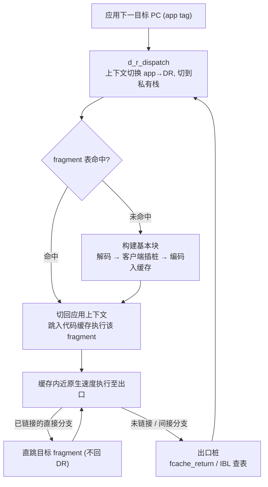
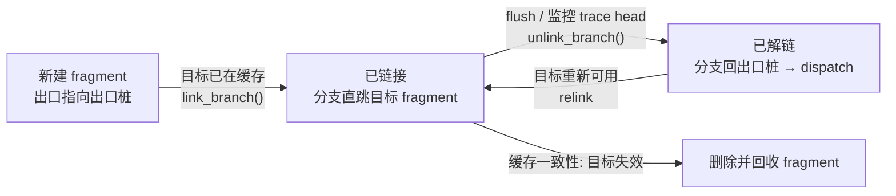
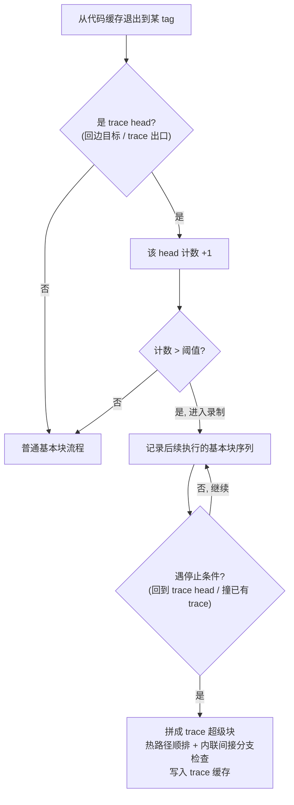
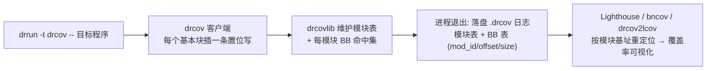

# 动态插桩与模拟执行引擎（4）· DynamoRIO架构与客户端
> [!abstract] TL;DR
> - DynamoRIO 脱胎于 HP 的 Dynamo 动态优化器与 MIT 的 RIO（Bruening 2004 博士论文），是一套 **BSD 开源、跨架构（x86-32/64、ARM、AArch64）** 的进程级 DBI：应用代码从不直接执行，而是被逐个「基本块」拷进软件代码缓存里运行，DR 与应用共享地址空间并竭力保持**透明**。
> - 基本块是「从入口解码到第一条控制转移指令为止」的动态单入口序列——不需要预先的 CFG，边执行边发现代码；块末的分支先跳到**出口桩**回到 dispatch，一旦目标块已在缓存就把分支就地**链接**成直跳目标，消除来回上下文切换，这正是 DBI 能接近原生速度的根因。
> - 间接分支（ret / 间接 call/jmp）无法静态链接，走 **IBL 哈希表查找**（DR 大量内联并缓存「上次目标」来压成本）；热回边处按 **NET 方案**累计计数，超阈值后录制后续块拼成 **trace 超级块**，把热路径顺排、内联间接分支检查，改善 I-cache 与跨块优化。
> - 客户端是被 DR 核心加载的共享库，在 `dr_client_main` 注册基本块/线程/模块/信号等事件，直接操纵机器级 IR（`instr_t`/`instrlist_t`/`opnd_t`）；`dr_insert_clean_call` 用完整上下文切换换「能写任意 C」的便利但昂贵，高频点应改用 **drreg 管理的内联插桩**只溢出真正用到的寄存器与标志。
> - **drcov** 是随发行的覆盖率客户端：每个基本块插一条置位写，退出时落盘「模块表 + BB 表（mod_id/offset/size）」，因偏移相对模块基址而对 ASLR 免疫；这套格式已成事实交换标准，被 Lighthouse/bncov/drcov2lcov 消费，并驱动 WinAFL 的覆盖引导 Fuzzing。
> - 生态旗舰是 **Dr. Memory**（跨平台内存检错，含 Windows）与 **drcachesim/drmemtrace**（缓存模拟与离线内存 trace）；相较闭源仅限 Intel x86 的 Pin，DR 开源、多架构、IR 更底层、可控性与内联开销更优，代价是要自己直面机器细节。

## 概述与定位

本篇是《动态插桩与模拟执行引擎》系列的第 4 篇，紧接第 3 篇的 Intel Pin。第 2 篇已把 DBI 的共性骨架讲清——翻译块、代码缓存、链接与回填；第 3 篇用 Pin 演示了「analysis 与 instrumentation 分离」的高层 API 心智。本篇要做的是把同一类系统的**另一条技术路线**摊开：DynamoRIO（下称 DR）与 Pin 同属「拷贝-注解式」进程级 DBI，但它开源、跨架构、把机器级中间表示（IR）直接交到你手里。理解 DR，等于把 DBI 引擎的内部机制从「黑盒 API」拉到「可读源码」的层面看一遍，也为后面 Frida-Gum/Stalker（第 5 篇）、QBDI（第 6 篇）的对比打好底。

先厘清 DR 的身世与定位，因为它解释了这套系统「为什么长这样」。DR 的两个源头是：HP 实验室的 **Dynamo**（Bala 等，PLDI 2000，最初在 PA-RISC 上做「同架构动态优化」——把解释执行的热路径编译进缓存以求超越静态编译）与 MIT 的 **RIO**（Runtime Introspection and Optimization）。Derek Bruening 2004 年的 MIT 博士论文《Efficient, Transparent, and Comprehensive Runtime Code Manipulation》是其理论基石，标题里的三个词——**高效、透明、全面**——恰好是 DR 全部设计取舍的总纲。后来它以 BSD 许可开源，迁到 GitHub（DynamoRIO/DynamoRIO），并衍生出 Dr. Memory、drcachesim、WinAFL 后端等一票重量级工具。

DR 解决的核心问题只有一句话：**在不改动、不重编译目标二进制的前提下，取得对其每一条被执行指令的观察与改写权**，且尽量让目标「感觉不到」自己被插桩。它与静态分析（系列 45 的反汇编/反编译）互为对偶——静态引擎靠算法在不运行的情况下猜代码，DR 则用「实际执行到哪就处理到哪」换取对间接跳转、自修改代码、加壳解密后真实指令的确定性覆盖。边界上，本篇聚焦 DR 的**引擎内部（基本块构建、链接、trace、缓存一致性）与客户端编程模型（clean call、扩展库、drcov）**；CPU 模拟那条路线（QEMU/Unicorn）在第 7–9 篇；覆盖率/污点/trace 三类分析应用的横向铺开在第 12 篇；跨架构转译的通用设计在第 13 篇；被目标反检测的攻防在第 14 篇。

## 原理与机制

DR 的运行模型可以概括为「**接管—缓存—派发—链接**」。进程一启动（或被 late attach），DR 核心（`libdynamorio.so` / `dynamorio.dll`）就把自己映射进应用地址空间并夺取控制权：此后应用的原始代码页**一条都不会被 CPU 直接执行**，DR 把它们按需拷进一块可执行的软件区域——**代码缓存（code cache）**——运行拷贝。为什么要这么大费周章而不用单步断点（如 ptrace 逐指令）？因为单步每条指令都要陷入内核再返回，慢上千倍；而「拷一次、跑很多次」把翻译成本一次性摊掉，缓存里的代码近乎原生速度运行。这是所有高性能 DBI 的公理，DR 是把它做到极致的代表之一。

DR 与应用**共享同一地址空间、同一套线程**，这是它与「另起一个模拟 CPU」的 QEMU 的根本分野，也带来一条贯穿全篇的红线——**透明性（transparency）**。应用的寄存器、栈、堆、错误码、TLS、信号语义都必须看起来「和没被插桩时一模一样」。为此 DR 做了大量隐身工作：它给每个线程另备一条 **DR 私有栈（dstack）**，进出缓存时保存/恢复应用机器状态；它用**私有加载器**加载自己那份 libc/ntdll，避免和应用的库互相污染；它在 x86 上偷用段寄存器指向的一个 TLS 槽、在 AArch64 上**偷一个寄存器（默认 x28）**、ARM32 上偷 r10 来存放快速溢出所需的线程本地基址；应用一旦读写这个「被偷寄存器」，DR 要专门拦截并给出应用本应看到的值。透明不是洁癖，而是**正确性**：只要应用在 DR 下的行为发生偏移，分析结论就不可信，恶意样本也能借此识别插桩环境（详见第 14 篇）。

核心的执行循环叫 **dispatch**。每当控制流要去往一个新的应用地址（app tag），DR 就在这里做一次「应用→DR」的上下文切换、切到私有栈，在 **fragment 哈希表**里查这个 tag 对应的缓存块是否已存在：命中就切回应用上下文、跳进缓存执行；未命中就现场构建基本块（解码→交客户端插桩→编码写入缓存），再跳入。块在缓存里执行到末尾的出口，若已链接便直跳下一块、根本不回 DR，否则经出口桩回到 dispatch 再来一轮。整个引擎的性能，就取决于「有多少执行能留在缓存里的块间直跳、有多少要退回 dispatch」。



## 基本块构建与代码缓存详解

这一节是 DR 的心脏，也是本篇三个种子（基本块构建、clean call、drcov）里最硬的一个。把「块怎么建、怎么链、怎么攒成 trace、怎么保持一致」讲透，后面的客户端与 drcov 才有落脚点。

### 基本块的构建：从解码到编码入缓存

DR 语境下的「基本块」与编译原理课本里的不是一回事。编译器的基本块是「有已知前驱、最大化的直线区域」，需要先有整张控制流图；DR 的基本块是**动态**的——从某个入口 PC 开始逐条解码，一直到**遇见第一条控制转移指令（CTI：跳转/调用/返回）为止**，这条 CTI 连同前面的直线指令构成一个块。为什么以「第一条 CTI」为界？因为 DR 不预知代码布局，它只能安全地拷贝「从这个入口往下、控制流保证会顺序走到」的那一段；一旦到了分支，之后去哪由运行时决定，必须交还给 dispatch。这带来一个反直觉但关键的性质：**DR 的基本块可以互相重叠**——同一段字节从不同入口进入会被解码成不同的块，DR 允许这种冗余，因为它换来了「无需全局 CFG、边跑边发现」的简单与健壮，对间接跳转密布、甚至运行时才解密出真身的代码尤其重要（这正是 DBI 相对静态反汇编的看家优势，可对照 [[45.反编译器与反汇编引擎原理/01.反汇编算法：线性扫描与递归遍历]]）。

构建一个块的流水线是：DR 从目标 PC 起**解码**出一串 `instr_t`，挂进 `instrlist_t`（DR 的机器级 IR，操作数为 `opnd_t`）；随即触发**客户端的基本块事件**，让工具检查甚至任意增删改这张指令表；最后 DR 把（可能已被改写的）指令表**编码**回缓存，并为每个出口追加一段**出口桩**。这里有个精妙的性能优化——**指令级别（level）**：DR 不会盲目把每条指令都完全解码，未被客户端触碰的指令可以停留在「原始字节」层级直接搬运，只有工具真正要读/改的指令才升级到完全解码。这样「什么都不做的空客户端」几乎只是在做内存拷贝，把 DR 的基线开销压到很低（许多负载仅 5%–20%），也是 DR 常被拿来做「近零开销代码缓存」研究平台的原因。

### 出口桩与链接：DBI 为何能接近原生速度

块末的 CTI 被 DR 改写成「跳到出口桩」。出口桩是一小段回到 DR 的胶水：腾出一个寄存器（存到 TLS 溢出槽）、把「我是从哪条出口来的」（linkstub 指针/目标 tag）装进寄存器，然后跳到 `fcache_return`——完成「应用→DR」上下文切换，回到 dispatch 去查或建目标块。

```
; 一个以条件分支结尾的基本块（x86-64 伪码）
    <app 指令...>
    jz   taken_exit          ; 条件成立走 taken 出口
fall_exit:
    jmp  stub_A              ; 落空出口, 初始指向出口桩 A
taken_exit:
    jmp  stub_B              ; taken 出口, 初始指向出口桩 B

stub_A:                      ; 出口桩：回到 DR
    mov  %reg, TLS_slot      ; 腾出一个寄存器
    mov  %reg, $linkstub_A   ; 记录“从哪条出口来”
    jmp  fcache_return       ; → 切回 DR, dispatch 查/建目标块

; 链接后：上面的 `jmp stub_A` 被原地改写为 `jmp 目标fragment入口`，跳过桩
```

真正的魔法叫 **链接（linking）**：当出口的目标块也已进入缓存，DR 就**原地改写块末那条分支**，让它直接跳到目标块入口，彻底绕过出口桩与 dispatch。于是热代码在缓存里形成一张「块→块」的直跳网，CPU 一路飞奔、几乎不再退回 DR。这就是 DBI「翻译一次、之后接近原生」承诺的兑现点。链接是可逆的：**解链（unlink）** 把分支还原成走出口桩，用于两个场景——缓存刷新（fragment 失效时先解链再删）与 trace 头监控（要在回边处截住控制流去累计热度，见下）。理解「链接/解链」这对操作，就理解了 DR 一切运行时改代码行为的开关。



### 间接分支查找（IBL）：无法静态链接的部分

直接分支的目标写死在指令里，能一次性链接；但**间接分支**——`ret`、间接 `call`/`jmp`、虚表调用、跳转表——目标随运行时数据变化，无法静态改成直跳。它们是 DBI 开销的头号来源，DR 为此设计了 **IBL（Indirect Branch Lookup）**：出口处不回 dispatch，而是内联一段「哈希应用目标 PC → 查 fragment 表 → 命中就跳缓存 PC、未命中才回 dispatch」的快路径。DR 在这上面堆了极多优化：把 IBL 例程**内联**进出口、给不同分支类型分开建表、缓存**上次目标**做一次「比一下相等就直跳」的捷径、维护 IBT（间接分支目标）表等。为什么值得这么拼？因为 C++ 虚调用、解释器分发循环、`ret` 密集的调用返回都走这条路，IBL 每压掉几个周期，全局吞吐就明显受益——这也是评价一个 DBI 引擎成熟度的硬指标。

### 追踪（trace）：NET 方案与热路径拼接

基本块粒度已经能跑，但跨块的间接分支与 dispatch 往返仍是瓶颈。DR 沿用 Dynamo 的 **NET（Next Executing Tail）** 方案把热路径攒成 **trace（超级块）**：把「回边（向后分支）的目标」和「已有 trace 的出口」标记为 **trace head**，每次控制流经过就给它的计数 +1；一旦超过阈值（默认数十次）就进入**录制模式**，顺着实际执行把随后的基本块一个个记下来，直到撞上停止条件（回到某个 trace head、或碰到已有 trace）。录下的序列被拼成一个**单入口、多出口**的 trace：热路径被**顺序排布**、条件分支被改写成「热的那侧落空直行、冷的那侧才跳出去」，间接分支的「预测目标」检查也被内联进来。这样做的收益有三：I-cache 局部性变好、间接分支多数命中内联检查而少走 IBL、以及为跨块优化（常量传播、冗余消除）提供了更大的窗口。NET 相比路径剖析（path profiling）胜在**简单且贪心有效**——它赌「刚变热的那条尾巴大概率还会重复」，实测命中率很高。DR 因此有**两块缓存**：基本块缓存与 trace 缓存，默认线程私有，也可配 `-shared_bbs` 走进程共享以省内存。



### 缓存一致性与状态翻译：正确性的两道暗礁

缓存里跑的是应用代码的**拷贝**，于是冒出两个静态分析永远遇不到的难题。其一是**缓存一致性**：若应用**自修改代码**（SMC）、或 JIT 生成新码、或把某页 unmap 再 map 别的内容，缓存里的旧块就与真实内存不符。DR 的对策是给已被翻译过的应用代码页**加写保护**，一旦被写就触发缺页、DR 据此**刷新（flush）** 受影响的 fragment（先解链再回收）；对频繁自改的区域则退化为**沙箱化（sandboxing）**——在块内插入运行时校验，发现改动就重译。这是 DR 处理加壳/自解密样本能力的底层保证，也是脱壳、JIT 逆向愿意选 DBI 的原因。

其二是**状态翻译（state translation / fault translation）**，也叫故障翻译。应用真正执行的是缓存 PC，可当缓存里某条指令触发异常（段错误、除零）、或应用信号处理器要读机器上下文时，它期望看到的是**原始应用 PC 与应用寄存器状态**，而不是缓存里的现场。DR 必须能把「缓存 PC + 当前寄存器」**反向重构**成「若没被插桩、此刻应用应处的 PC 与状态」，才能把正确的 context 交给应用的信号处理器。为此每个 fragment 都记录了足够的元信息以支持这种回溯。客户端插入的额外状态（比如临时占用的 scratch 寄存器）也可能落在故障点上，DR 因此提供 `restore_state` 事件让工具登记「如何把我加的东西还原回去」。状态翻译是 DBI 里最烧脑、最容易出隐蔽 bug 的地方，也是衡量一个引擎「透明与全面」成色的试金石；它与跨架构转译时的标志位/寄存器映射同源，会在第 13 篇再展开。

顺带说清 **clean call 的机制内核**，因为它本质也是一次「精心编排的上下文切换」。`dr_insert_clean_call` 在插桩点插入一段代码：把全部通用寄存器与算术标志压到 DR 的溢出空间、按调用规约对齐栈并摆好参数，然后 `call` 你的 C 函数，返回后再逐一恢复。这样被调函数看到的是一台「干净」的机器，可以放心写任意 C（读应用上下文、调 DR API、访存打印）。代价是这套完整存取每次要几十到上百个周期——这正是下一节「clean call 与内联的取舍」要算的账。

## 工具视角与实战

### 客户端编程模型与扩展库

DR 的**客户端（client）** 就是一个被 DR 核心加载的共享库，入口是 `dr_client_main`，在其中注册各类**事件回调**：基本块事件、trace 事件、线程 init/exit、模块 load/unload、信号/异常、进程退出等。与 Pin 把细节包成 `INS_InsertCall`/虚拟寄存器的高层风格不同，**DR 直接把机器级 IR 交给你**——你拿到的是真实指令表，可解码、遍历、插入、删除、重编码。这更底层、更强大，也更要求你懂机器细节；换来的是可控性与（写好内联插桩时）更低的开销。工具插入的指令被标记为 **meta 指令**（非 app 指令），DR 据此区分「哪些是应用真身、要参与状态翻译」与「哪些是工具的脚手架」。

早期 DR 只有一个「既分析又插入」的单一 bb 事件，多个组件同时插桩会互相踩脚。现代实践一律走 **drmgr** 扩展提供的**多阶段流水线**：`app2app`（改写应用指令，如展开 rep 串操作）→ `analysis`（只读分析，产出每块的元数据）→ `insertion`（逐条应用指令插桩）→ `instru2instru`（对已插入代码再优化）。drmgr 还负责事件排序与每线程 TLS 槽分配，让覆盖率、污点、trace 等多个逻辑组件在同一次运行里协作。配套的关键扩展有：**drreg**（scratch 寄存器/标志的溢出与**活跃性分析**，是写高效插桩的命根子）、**drwrap**（函数前后包裹 hook，概念上近似 Frida Interceptor，见 [[32.hooks/09-frida]]）、**drx**（杂项工具与 `drx_buf` 快速每线程缓冲 trace）、**drsyms**（符号解析，接 dbghelp/DWARF）、**droption**（客户端命令行选项）、**drcovlib**（覆盖率库，drcov 的引擎）。

```c
/* 极简客户端骨架（示意, 省略错误处理与 drreg 借还细节）*/
#include "dr_api.h"
#include "drmgr.h"
#include "drreg.h"

static dr_emit_flags_t
event_bb_insert(void *drcontext, void *tag, instrlist_t *bb, instr_t *inst,
                bool for_trace, bool translating, void *user_data) {
    if (!instr_is_app(inst))         /* 跳过其它工具插入的 meta 指令 */
        return DR_EMIT_DEFAULT;
    /* 热点做法：借 scratch 寄存器, 内联 2~3 条指令完成统计;
       只有需要任意 C 逻辑时才退而求其次用 clean call */
    return DR_EMIT_DEFAULT;
}
static void event_exit(void) { drreg_exit(); drmgr_exit(); }

DR_EXPORT void dr_client_main(client_id_t id, int argc, const char *argv[]) {
    drmgr_init();
    drreg_options_t ops = { sizeof(ops), 2 /*需要的 scratch 数*/, false };
    drreg_init(&ops);
    drmgr_register_bb_instrumentation_event(NULL, event_bb_insert, NULL);
    dr_register_exit_event(event_exit);
}
```

启动方式：`drrun -c client.so -- 目标程序 参数`。`drrun` 借 `drinject`/`drconfig` 创建目标进程（或 late attach 到已运行进程），把 DR 核心映射进去并让它在应用入口接管；Windows 上走早期注入，Linux 上用 DR 自己的注入机制。DR 还提供 `dr_app_setup/start/stop` 一组 API，让程序**静态链接 DR、自我插桩**——只对某段感兴趣区间开插桩、跑完就停，避免全程开销。

### clean call 与内联插桩的取舍

这是写 DR 客户端最重要的工程判断。`dr_insert_clean_call` 便利但昂贵：每次触发都是一整套「保存全部寄存器+标志→对齐栈→传参→call→恢复」。对**低频**点（模块加载时、某个稀有函数入口）它完全够用；但对**高频**点（每条指令、每次访存、每个基本块），一次 clean call 的上下文切换会把开销放大几十倍，让工具慢到不可用。

正确姿势是**内联插桩**：直接往指令表里插几条完成任务的机器指令，用 **drreg** 借一两个 scratch 寄存器、按活跃性只在必要时溢出/恢复，并且**仅当应用后续真的要用到标志位时才保存 eflags**（x86 上保存标志要 `lahf`/`seto` 或更慢的 `pushf`，drreg 会算清楚何时可省）。举例：给每个基本块计数，内联做法就是「借一个寄存器、`inc` 内存计数器、还寄存器」两三条指令，比 clean call 快一个数量级。DR 还会**内联简单的叶子 clean call**——若被调函数是无副作用的小叶子，DR 直接把它的函数体内联进来并只溢出用到的寄存器（部分上下文切换），`dr_insert_clean_call_ex` 的诸多标志（如声明不改标志、不读应用上下文）就是喂给这套优化的提示。一句话总结经验法则：**能内联就别 clean call，能少存就靠 drreg 算活跃性**——这正是 DR「把机器交到你手上」哲学的性价比来源，也是它相较 Pin「自动但难以逼近手写下限」的差异点。

### drcov：覆盖率客户端与其格式

**drcov** 是随 DR 发行的代码覆盖率工具（引擎为 drcovlib 扩展），也是本篇第三个种子。它回答一个朴素问题：这次运行**执行了哪些基本块**。机制极简也极快——在每个基本块只插**一条把「1」写进每块命中标志（位图/表项）的存储指令**，不需要 clean call；而且块一旦进了代码缓存，后续重复执行也只是重跑这条写，成本可忽略（本质上「记一次就够」）。drcovlib 同时维护一张**模块表**：进程里每个已加载模块的 id、基址、上界、路径。进程退出时落盘一份 `.drcov` 日志：

```
DRCOV VERSION: 2
DRCOV FLAVOR: drcov
Module Table: version 2, count N
Columns: id, base, end, entry, checksum, timestamp, path
0, 0x00400000, 0x00452000, 0x00401000, ..., ..., /path/to/target
1, 0x7f...000, 0x7f...000, ..., ..., ..., /lib/x86_64-linux-gnu/libc.so.6
...
BB Table: M bbs                 ; 随后是 M 个紧凑二进制 bb_entry_t

bb_entry_t (8 字节)
偏移  大小  字段     含义
0x00   4   start   uint32  基本块起始, 相对所属模块基址的偏移
0x04   2   size    uint16  基本块字节大小
0x06   2   mod_id  uint16  指向模块表的模块 ID
```

这套格式的设计智慧在于 **BB 记的是「模块 ID + 模块内偏移」而非绝对地址**——于是它对 ASLR 天然免疫：换台机器、换次运行，只要按目标模块的新基址重定位偏移即可还原到反汇编视图。正因如此，drcov 格式**逐渐成了覆盖率的事实交换标准**：`drcov2lcov` 能把它配合符号转成 lcov 做源码行覆盖；逆向界的 **Lighthouse**（IDA/Binary Ninja 插件）、**bncov**、Ghidra 的 Cartographer 都直接吃 drcov 文件，把「哪些函数/块跑到了」高亮回反汇编上——这是「跑一遍看哪走到了」最顺手的工作流。它也是覆盖引导 Fuzzing 的底座：**WinAFL** 的 DynamoRIO 模式（`-D`）用一个 DR 客户端把边覆盖写进 AFL 共享位图，从而在**无源码的 Windows 二进制**上做覆盖引导变异——这直接通向 [[49.Fuzzing与漏洞挖掘/00.Fuzzing与漏洞挖掘总览]]，覆盖/污点/trace 三类客户端的统一视角则在 [[12.插桩驱动的分析：覆盖率与污点与trace]]。



### 生态：Dr. Memory / drcachesim / 与 Pin 的对照

DR 的分量很大程度由建在它之上的工具背书。**Dr. Memory** 是旗舰——跨平台（含 Windows）的内存检错器，检测未初始化读、越界、释放后使用、泄漏，定位类似 Valgrind Memcheck 却快得多且能上 Windows，靠的正是 DR 的低基线开销与 shadow 内存插桩。**drcachesim/drmemtrace** 是一套缓存模拟器与离线内存 trace 框架：先用 DR 高效抓取访存/取指 trace，再离线喂给可配置的多级 cache/TLB 模型，是计算机体系结构研究的常用平台（与第 25 篇 CPU 微架构互有呼应）。还有 `drltrace`（库调用追踪）、`drcachesim` 的取指流分析等一票工具。

与第 3 篇的 **Pin** 做横向对比，能看清 DR 的取舍：Pin 闭源、Intel 出品、基本仅限 Intel x86；DR **开源（BSD）、多架构（x86-32/64、ARM、AArch64，RISC-V 演进中）**——这是选型时最现实的分水岭，要插桩 ARM 设备或要改引擎源码，DR 几乎是唯一成熟选择。API 层面，Pin 抽象更高（`IPOINT_BEFORE/AFTER`、虚拟寄存器由 Pin 自动重分配），上手快但难以逼近手写下限；DR 给你机器级 IR 与 drreg，逼你直面细节却能把内联插桩压得很紧。默认插桩单元也不同：Pin 默认以 trace 为单位，DR 以基本块为单位、trace 是可选的二次成型。透明性上两者都下了功夫，但 DR 从 Bruening 论文起就把透明当一等公民、文档化得更系统。相较更重的 Valgrind（用 VEX IR「反汇编再重合成」、串行化线程、常见 10–50 倍开销），DR 在机器级做拷贝-注解、保留真并行、基线开销低一个量级；相较 Frida-Gum/Stalker（第 5 篇，更偏 hook + 脚本、轻量嵌入），DR 是「重装全进程引擎」，覆盖更全但集成更重。没有银弹，选型看的是架构支持、开销预算、要不要改引擎、以及你愿意写多底层的代码。

## 安全性与正确使用

DR 这类 DBI 的安全影响是**双向**的，用对了是分析利器，用错了会得出错误结论甚至被目标反制。

**对分析/防御方**，DR 的价值在于「确定性覆盖真实执行的指令」：加壳、自解密、混淆控制流的样本，静态反汇编常常束手，而 DR 靠缓存一致性机制在**解密后的真身**上插桩，天然适合脱壳、动态 trace、覆盖率与污点分析（污点/trace 的系统方法在第 12 篇）。但要**正确使用**，必须清醒于几条边界：其一，**透明不是绝对的**——DR 与应用共享地址空间，必然留下内存足迹、改变时序、偷用寄存器/TLS，具备自省能力的恶意代码可以据此检测「我在 DBI 里」并改变行为（时序探测、扫描 DR 私有映射、检查被偷寄存器等，攻防细节见 [[14.反插桩与反模拟对抗]]）。因此**用 DR 分析对抗性样本时，结论要按「目标可能已察觉」来打折**，必要时叠加反检测加固或换更隐蔽的手段。其二，**运行不可信样本本身是有风险的行为**——DR 不是沙箱，被插桩进程仍拥有当前用户的全部权限，会真实地读写文件、发网络、调系统调用；分析恶意代码必须在**隔离环境（专用虚拟机/容器、断网或受控网络、快照回滚）** 中进行，别把 DR 当隔离层。

**对工具开发方**，正确性即安全性。首先，**插桩不能破坏透明**：clean call 的上下文必须存全、状态翻译（`restore_state`）必须把你加的 scratch 状态如实还原，否则应用的信号处理器会拿到错乱的上下文而崩溃或走错分支——这类 bug 隐蔽且危险。其次，**自修改与 JIT 场景要顺着 DR 的一致性机制走**，别缓存你自己算出的地址而不监听刷新，否则会读到过期的块信息。再次，**多组件协作务必走 drmgr 的阶段与排序、scratch 寄存器一律经 drreg 借还**，手工抢寄存器是踩脚与偶发错误的温床。最后，**面向不可信输入的健壮性**：解析目标下发的数据（尤其做污点/覆盖时）要做边界检查，别让畸形输入把你的客户端喂崩，反而干扰分析。总之，DR 的「高效、透明、全面」是一组需要主动维护的性质：**分析侧按"目标可能已察觉且样本有害"设防，开发侧靠透明与一致性纪律守正确**，才是这套机制的正确用法。

## 小结

DynamoRIO 把「不改二进制却拿到每条被执行指令的观察与改写权」这件事，做成了一套开源、跨架构、机器级 IR 直出的进程级 DBI。它的引擎是「接管—缓存—派发—链接」：基本块从入口解码到第一条 CTI 为止、边跑边发现代码；块末分支先走出口桩回 dispatch，目标一进缓存就就地**链接**成直跳，把执行牢牢留在缓存里换来接近原生的速度；间接分支交给 IBL 哈希查找，热回边按 NET 攒成 trace 超级块以改善局部性与内联间接分支检查；而缓存一致性（写保护+刷新+沙箱）与状态翻译（把缓存现场反推回应用现场）则是它敢碰自修改代码、又能保持透明的两块基石。客户端侧，DR 把 IR 交到你手上，配 drmgr 的多阶段流水线与 drreg 的寄存器/标志活跃性管理，让你在 **clean call 的便利** 与 **内联插桩的高效** 之间精打细算；drcov 用「每块一条置位写 + 模块相对偏移」的极简设计，产出对 ASLR 免疫、被 Lighthouse/WinAFL 等广泛消费的事实标准覆盖率格式。相较闭源仅限 Intel x86 的 Pin，DR 胜在开源、多架构、可控性与内联下限，代价是要直面机器细节。掌握本篇，你就把 DBI 引擎从「会用 API」推进到了「懂它为什么快、为什么正确、在哪会出错」；下一篇转向更轻量、更偏 hook 与脚本化的 Frida-Gum 与 Stalker，看同一命题的另一种工程答案。

## 相关阅读

- 系列上游：[[02.DBI原理：代码缓存与trace]] —— 翻译块、代码缓存、链接与回填的共性骨架，是理解本篇 DR 具体实现的前置。
- 系列同侪：[[03.Intel-Pin架构与Pintool开发]] —— 与 DR 并列的另一条 DBI 路线，API 抽象层次与开源/架构取舍的直接对照。
- 系列下游：[[05.Frida-Gum与Stalker内部机制]] —— 更轻量、脚本化、偏 hook 的 DBI 工程答案；[[06.QBDI轻量级插桩框架]] —— 可嵌入的 VM 抽象与回调模型。
- 应用视角：[[12.插桩驱动的分析：覆盖率与污点与trace]] —— drcov 所属的覆盖/污点/trace 三类客户端统一视角；[[13.动态二进制翻译器设计：跨架构转译]] —— 状态翻译与寄存器/标志映射的通用化。
- 对抗视角：[[14.反插桩与反模拟对抗]] —— 透明性的极限、DBI 自省检测与绕过。
- 静态对偶：[[45.反编译器与反汇编引擎原理/01.反汇编算法：线性扫描与递归遍历]] —— DR「边跑边发现代码」相对静态反汇编的互补关系。
- Hook 承接：[[32.hooks/09-frida]] —— drwrap 的函数包裹与 Frida Interceptor 的用法对照。
- 下游应用：[[49.Fuzzing与漏洞挖掘/00.Fuzzing与漏洞挖掘总览]] —— WinAFL 借 DR 客户端做无源码覆盖引导 Fuzzing。
- 一手资料：Derek Bruening 博士论文《Efficient, Transparent, and Comprehensive Runtime Code Manipulation》(MIT, 2004)、Bala 等《Dynamo: A Transparent Dynamic Optimization System》(PLDI 2000)，以及 DynamoRIO 官方 API 文档与扩展库手册（drmgr/drreg/drwrap/drcovlib）。

[[00.动态插桩与模拟执行引擎总览|⬆ 系列总览]] | [[03.Intel-Pin架构与Pintool开发|← 上一章]] | [[05.Frida-Gum与Stalker内部机制|→ 下一章]]