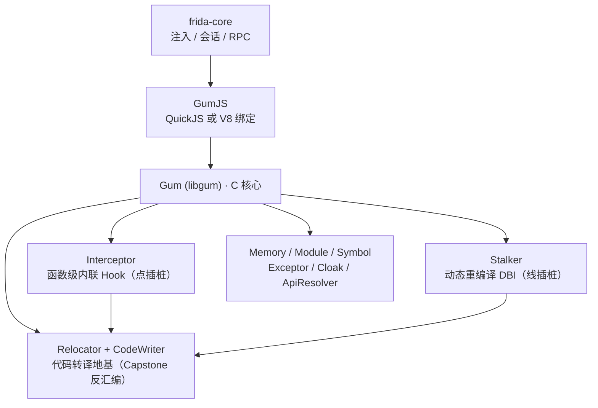
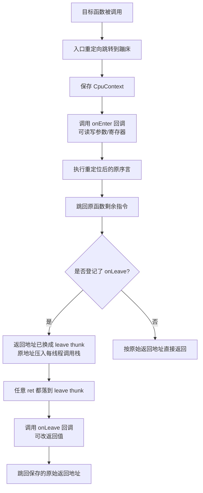
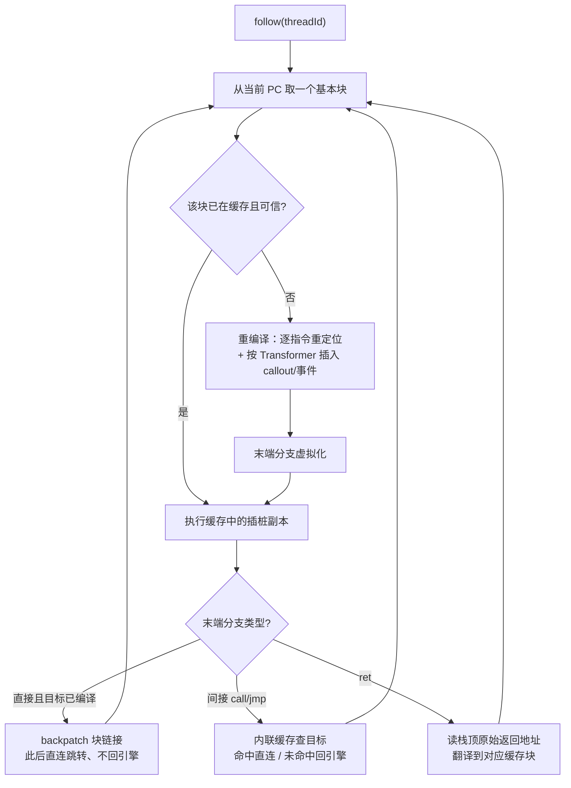

# 动态插桩与模拟执行引擎（5）· Frida-Gum与Stalker内部机制
> [!abstract] TL;DR
> - Gum（libgum）是 Frida 的 C 核心：Interceptor 负责函数级内联 Hook，Stalker 负责基于动态重编译的线程级 DBI，二者都坐落在 Relocator + CodeWriter 这套「代码转译」地基之上，GumJS 只是薄薄的脚本外壳。
> - Interceptor 不是改 GOT/PLT，而是重定位函数序言、写入蹦床跳转，并用「每线程调用栈」保存被替换的返回地址，从而同时支持 on_enter / on_leave 与递归重入。
> - Stalker 逐基本块重编译并缓存，靠「块链接（backpatch）」和「间接分支内联缓存」把热路径拉到接近原生速度；`trustThreshold` 决定何时相信一段代码不会自修改。
> - 转译最难的两点是「分支虚拟化」与「返回地址透明性」：call/ret 被改写，使程序仍看得见原始返回地址，控制流却被悄悄引回代码缓存。
> - 平台陷阱直接决定正确性：ARM 独占访问 LDXR/STXR 对不能被插桩打断、Thumb 的 IT 块、arm64e 指针认证（PAC）、iOS 的 W^X 都是必须专门处理的坑。

## 概述与定位

Frida 在使用者眼里是一段 JavaScript：`Interceptor.attach(...)`、`Stalker.follow(...)`。但真正干活的既不是 JS，也不是那颗 QuickJS/V8 引擎，而是一个纯 C 写成的底层库——**Gum（libgum，源码仓库 frida-gum）**。理解 Frida 的内部机制，本质上就是理解 Gum，尤其是它的两大插桩子系统 Interceptor 与 Stalker，以及支撑它们的代码生成设施 Relocator 与 CodeWriter。

把整个技术栈自顶向下拆开，层次非常清晰：最上层是 **frida-core**，负责进程注入（Linux 用 ptrace、macOS/iOS 用 mach task、Windows 用 CreateRemoteThread、Android 走 zygote/ptrace）、会话管理与 RPC；中间是 **GumJS**，把 Gum 的 C 能力绑定到脚本运行时（Frida 14 起默认 QuickJS，可选 V8）；最底层就是 **Gum**。Gum 提供的能力远不止 Hook：进程/模块/符号枚举、内存读写与扫描、`ApiResolver`、异常捕获 `Exceptor`、内存访问监视 `MemoryAccessMonitor`、自我隐藏 `Cloak`，以及本篇主角 Interceptor 与 Stalker。把 Gum 单独抽成 C 库是一个刻意的架构决策：它可以脱离脚本层被直接静态嵌入到任意 C/C++ 程序（`gum_init_embedded()`），性能不受 JS 拖累，也更容易移植到新架构和新操作系统。

从「插桩粒度」看，Gum 的两大子系统正好占据两个极点，理解这个分野是全篇的纲：

- **Interceptor —— 点插桩**。它只在你指定的函数入口/出口这些「点」上动手，其余代码原生全速运行。开销近乎为零，适合「我知道要看哪个函数」的场景（Hook API、改参数、改返回值）。
- **Stalker —— 线插桩**。它跟踪一个线程的**整条指令流**，把执行到的每一个基本块动态重编译进代码缓存，可在任意指令边界插入回调或产出事件。适合「我不知道会走到哪，但要看全程」的场景（覆盖率、调用轨迹、污点、脱壳时的 OEP 定位）。

放到 DBI 的谱系里横向对比，Frida 的定位很独特。**Intel Pin** 是闭源、仅限 x86/Intel 的进程级 JIT-DBI，工程成熟但不能上移动端；**DynamoRIO** 会接管整个进程的全部执行，功能完整但重；**QBDI** 是可嵌入的 VM 库，偏向被链接进你自己的工具。而 Stalker 的杀手锏是**运行时可附加**且**可选择性只跟单个线程**——其它线程仍原生跑。这种「按需、按线程」的哲学，加上跨平台（尤其 Android/iOS）和 JS 脚本化，构成了 Frida 与传统 DBI 最根本的差异：它不是要做一个全覆盖的模拟层，而是要做一把能随时插进活体进程、想插哪根线程就插哪根的手术刀。代价是它在「完整性/透明性」上不如 DynamoRIO 那样面面俱到（后文会看到返回地址、独占访问等透明性难题）。



## 原理与机制

### Interceptor：内联 Hook 是怎样炼成的

很多人以为 Frida 的 Hook 是改导入表（GOT/PLT）或改虚表，其实 `Interceptor.attach` 用的是**内联 Hook（inline hook）**：直接改写目标函数入口处的头几条指令。这条路更通用——它能 Hook 任何有地址的代码，而不只是通过符号表间接调用的函数——但也更难，因为你动的是活的机器码。

一次 attach 的完整动作可以拆成这几步，每一步背后都有「为什么必须这样」：

1. **分配函数上下文与可达蹦床。** Gum 为目标建立一个 `GumFunctionContext`，并在**目标地址附近**（x86 需在 ±2GB 内，ARM64 需在 B 指令的 ±128MB 内）用 `GumCodeAllocator` 分配一块可执行 slab 作为蹦床。为什么要「附近」？因为入口处只能塞下一条短跳转指令，短跳转的位移是有限的，落点必须够得着。
2. **重定位被覆盖的序言。** 入口要被跳转指令占用（x86-64 是 5 字节 `E9` 相对跳转，ARM64 是一条 4 字节 `B`）。被覆盖掉的那几条原始指令不能丢，要搬到蹦床里继续执行。但「搬家」不是逐字节复制——若其中含 PC 相对指令（x86 的 RIP 相对寻址、ARM64 的 `ADR`/`ADRP`/`LDR literal`），换了地址后语义就变了。这正是 **Relocator** 的职责：它把这些指令按新位置重新修正后再发射。
3. **写入重定向、刷新缓存、处理权限。** 把入口改成跳转，需要临时把代码页改成可写（`mprotect`/`VirtualProtect`/`mach_vm_protect`），写完还要**刷新指令缓存（icache）**——在 ARM 上尤其关键，取指和数据 cache 不一致会执行到旧指令。同时要保证改写对其它正在执行的线程是安全的（Frida 用事务化的批量补丁，必要时挂起线程，尽量让补丁原子生效）。

于是一次被 Hook 的调用，控制流是这样的：目标函数被调用 → 入口跳转把控制交给蹦床 → 蹦床先**保存 CPU 上下文（CpuContext）** → 调用你的 `onEnter`（此时你能读写参数、读寄存器）→ 执行**重定位后的原序言** → 跳回原函数主体继续跑。这解释了 Interceptor 的一个重要性质：它是**旁路监听**，不改变原函数语义（除非你主动改参数），原函数照样完整执行。

`onLeave` 更精巧。函数返回时机在编译期是不确定的（可能有多个 ret、可能尾调用），不可能预先在每个 ret 处打补丁。Frida 的做法是**篡改返回地址**：进入函数时，把调用者压在栈上的返回地址替换成一个指向 Frida「leave thunk」的地址，并把**真正的原始返回地址压入一个每线程的调用栈 `GumInvocationStack`**。函数无论从哪条 ret 返回，都会落到 leave thunk，thunk 调用你的 `onLeave`（可改返回值），再跳回那个被保存的原始返回地址。用「每线程一个栈」而不是「一个变量」保存原始返回地址，是为了正确处理**递归和重入**——同一个被 Hook 的函数在栈上可能同时有多层。

`Interceptor.attach` 之外还有 `Interceptor.replace`：它把整个函数替换成你的实现（你可在实现里通过保存的指针回调原函数），语义上是「接管」而非「旁听」，适合改行为、打桩、mock。二者都可 `revert` 还原。

Interceptor 的边界与陷阱值得逆向者记牢：**序言过短**（函数太小，头 5 字节里就有跳转/条件跳转，无法整体重定位）会导致 attach 失败或需要更复杂的重定向；**多重 Hook 叠加**（别的框架也 inline hook 了同一入口）会互相踩踏；**信号/异常在 onEnter 中重入**要小心；被 Hook 函数若被别处以「读取自身机器码做校验」的方式做完整性检查，会发现入口被改（这是反调试的常见抓手，见安全一节）。



### Stalker：把一条线程的执行流「接管」下来

Stalker 是 Frida 最具技术含量的部件，是一台真正的动态二进制插桩引擎，思想和 Pin/DynamoRIO 同源：**不修改原始代码，而是把即将执行的代码动态重编译进一块代码缓存（code cache），让线程实际执行的是缓存里那份被插了桩的副本。** 它的对外接口是 `Stalker.follow(threadId)` 与 `Stalker.unfollow(threadId)`：对当前线程调用会即时切入（从当前 PC 开始把后续执行接管进缓存），对其它线程则通过信号/挂起把它「拽进」被跟踪状态。

机制层面，Stalker 的核心要素有四个，细节留到下一段深挖，这里先建立骨架：

- **代码缓存（以基本块为单位）。** Stalker 一次编译一个基本块（block）——从当前 PC 一直翻译到遇到分支（call/jmp/ret/条件跳转）或块过大为止，重定位进 slab 缓存。
- **事件与 sink。** 每编译/执行一个块、每次 call/ret、甚至每条指令，都可产出事件写入一个环形缓冲（`GumEventSink`）。事件类型有 compile、exec（逐指令，最贵）、block、call、ret。JS 侧通过 `onReceive` 拿原始事件，或 `onCallSummary` 拿聚合后的调用计数。
- **Transformer（自定义转译）。** `follow` 时传入 `transform(iterator)`，你会拿到一个 `GumStalkerIterator` 逐条遍历当前块的指令，`iterator.keep()` 原样发射该指令，`iterator.putCallout(cb)` 在此处插入一个回调。这是做**选择性插桩**的正道。
- **exclude（排除区间）。** `Stalker.exclude(range)` 让落入该区间的代码**原生执行**、不进缓存。这既是性能手段（别插桩 libc）也是正确性手段（有些代码不喜欢被插桩）。

Stalker 和 Interceptor 的关系是互补的：Interceptor 解决「在某个点做点什么」，Stalker 解决「看清一段执行流的全貌」。二者常联手——在某函数入口用 Interceptor 起 `follow`、在出口 `unfollow`，就实现了「只跟踪这个函数内部执行」的栈内 stalk。

## 代码转译与块重编译详解

这一段是全篇的技术核心。无论 Interceptor 搬序言，还是 Stalker 重编译整条流，底下都是同一件事——**把一段机器码从地址 A 正确地搬到地址 B 执行**。听上去像 memcpy，实则是 DBI 里最硬的骨头，因为机器码里藏着大量「和自己所在地址绑定」的东西。

### Relocator 与 CodeWriter：转译地基

Gum 为每种架构提供一对设施：**Relocator**（`GumX86Relocator`、`GumArmRelocator`、`GumThumbRelocator`、`GumArm64Relocator`）负责「读入并修正」，**CodeWriter**（`GumX86Writer`、`GumArm64Writer` 等）负责「发射机器码」，反汇编统一由 **Capstone** 承担。转译的全部难点，是那些**位置相关（position-dependent）指令**：

- **x86/x64。** 相对跳转/调用 `rel8`/`rel32` 的位移是相对于「下一条指令地址」算的，搬家后位移必须重算；短位移 `rel8`（±127 字节）搬远了装不下，要**扩展成 `rel32` 甚至更长的绝对跳转序列**。x64 的 **RIP 相对寻址**（`mov rax,[rip+disp]`）同理，`disp` 必须按新 RIP 修正。
- **ARM64。** `ADR`（±1MB）、`ADRP`（±4GB 页）、`B`/`BL`（±128MB）、`LDR literal`（±1MB）、`CBZ`/`TBZ`（范围更小，几十 KB）都编码了相对偏移。一旦搬出原范围，单条指令的立即数字段根本装不下新偏移，Relocator 必须**把一条指令展开成多条**（例如用 `LDR x16,#imm; BR x16` 这种「取绝对地址再跳」的桥）。这是 ARM64 转译比 x86 更啰嗦的根因：定长指令 + 有限立即数位宽。
- **ARM/Thumb。** Thumb 有 **IT（if-then）块**，让其后最多 4 条指令带条件执行；在 IT 块内部搬指令、插桩会破坏条件语义，必须整体处理。ARM/Thumb 混合、PC 相对的字面量池加载也都是坑。

自检一下这段的「无代码可懂」：即便不看任何汇编，你也应能复述——「机器码里有些字段记的是相对距离，一旦挪窝，这个距离就错了；转译器要么改这个距离，要么把它换成一段能算出绝对地址再跳过去的更长代码」。这就是代码转译的一句话本质。

下面用「代码块 + 文字」直观呈现 x86-64 上 Interceptor 的入口改写与蹦床布局（示意，非逐字节实现）：

```
原始函数入口（x86-64）:
  0x401000:  55              push rbp
  0x401001:  48 89 e5        mov  rbp, rsp
  0x401004:  ...             （函数主体）

被 Interceptor 改写后:
  0x401000:  e9 xx xx xx xx  jmp  <蹦床>        ; 5 字节相对跳转，覆盖了 push/mov
  0x401005:  ...             （原字节残留，永不再执行）

蹦床（分配在目标 ±2GB 内的可执行 slab）:
  [保存 CpuContext]
  call  onEnter
  [恢复]
  55              push rbp          ; ← 被覆盖序言，经 Relocator 重定位后原样发射
  48 89 e5        mov  rbp, rsp
  e9 yy yy yy yy  jmp  0x401004     ; 跳回原函数主体（位移已按新位置重算）
```

### 块编译循环与「分支虚拟化」

Stalker 的重编译以基本块为单位，循环大致是：从入口 PC 起，用 Relocator 逐条读指令、经 Transformer 决定 `keep`（原样发射）还是插桩，直到撞上一条**分支指令**——块就到此为止。关键在于**块末端那条分支必须被「虚拟化」**：绝不能让它按原样跳到**原始代码**里去，否则线程就「逃离」了代码缓存、脱离了 Stalker 的掌控。虚拟化就是把它改写成「先回到 Stalker，由引擎决定下一个缓存块在哪」的逻辑。

但如果每次分支都老老实实回引擎问一次「下一块在哪」，开销会大到不可接受。Stalker 用两招把热路径的开销压到接近原生：

- **块链接 / 回补（backpatching / block chaining）。** 对**直接分支**（目标地址在编译期已知，如 `jmp 0x401080`），一旦目标块也被编译进缓存，Stalker 就**把源块末端的分支直接改写成「跳到目标块的缓存副本」**，从此这条边再也不回引擎。热循环因此能在缓存内部原地打转、全速运行。这就是 DBI 引擎「越跑越快」的根本原因，也是 Stalker 和「每条指令都解释一遍」的模拟器的本质区别。
- **间接分支内联缓存（inline cache）。** 对**间接分支**（`call rax`、`jmp [mem]`、`ret`——目标运行时才知道），没法预先回补。Stalker 在该处发射一段内联比较：把运行时算出的目标和「最近见过的目标」比一比，命中就直接跳到对应缓存块，未命中才回引擎解析（编译目标块 + 更新缓存）。绝大多数间接跳转的目标高度集中（虚函数、跳转表就那么几个值），内联缓存命中率很高，于是也接近原生。



### call/ret 与「返回地址透明性」——转译最深的坑

Stalker 有一条不可动摇的红线：**程序自己看到的返回地址必须是原始地址，而不是缓存里的地址。** 为什么？因为无数东西依赖它——异常展开（unwind）要沿栈找返回地址、C++ 析构、GC、以及**大量反调试逻辑会检查「我的返回地址是不是落在预期模块里」**。如果 Stalker 让栈上出现代码缓存里的地址，这些全会崩或识破。

可这就和「实际执行发生在缓存里」直接矛盾了。Stalker 的解法是把 call 和 ret 都**虚拟化**：

- **改写 call**：在缓存里执行到 call 时，压入栈的是**原始的返回地址**（原代码中 call 之后那条指令的地址），这样被调函数无论怎么检查返回地址都看到「正版」；但控制权并不真跳到原始被调函数，而是转到被调函数的**缓存块**。
- **改写 ret**：真到 ret 时，栈顶那个原始返回地址并不指向缓存。Stalker 把 ret 也虚拟化成一次「间接跳转」——读出栈顶的原始地址，通过一张「原始地址 → 缓存块地址」的翻译，跳到对应缓存块继续跑。因为 ret 极其高频，Stalker 对它做了专门的快路径（类似返回地址的内联缓存）。

一句话概括这套障眼法：**栈上摆的是原始地址给程序看，真正的控制流被一张翻译表悄悄引回缓存。** 这正是 Stalker「透明性」的精华，也是它最容易出微妙 bug 的地方。

概念上的翻译关系可以这样理解（示意）：

```
程序视角（栈上、寄存器里都是“正版”地址）:
    返回地址 = 0x401005     ← 原始代码地址，反调试检查通过

Stalker 内部翻译表:
    0x401005  ->  0x7f...c120   （该原始地址对应的缓存块副本）
    0x401080  ->  0x7f...c1a0
    ...

ret 执行时：pop 出 0x401005 → 查表 → 实际跳到 0x7f...c120
```

### prolog/epilog：进出引擎的上下文代价

每次从「插桩副本」切回「Stalker 引擎」或调用一个 callout，都要保存/恢复 CPU 上下文——这段代码就是 **prolog/epilog**。全量保存所有寄存器最安全但最慢，所以 Stalker 做了 **full vs minimal** 的优化：能证明某些寄存器不被破坏时，就只存一部分。DBI 的绝大部分开销就压在这些上下文切换和内联检查上，理解它才能理解为什么「插桩越细（比如开 exec 逐指令事件），越慢」。

### trustThreshold 与自修改代码（SMC）

代码缓存有个隐患：**如果原始代码在运行中被改了（JIT、加壳自解密、热补丁），缓存里那份就过时了。** Stalker 用 `trustThreshold` 来平衡「性能」与「对自修改代码的正确性」：

- **-1**：完全不信任，每次执行都从**原始字节**重新编译——最慢，但能捕捉每一次变异，适合疯狂自修改的壳。
- **0**：立即信任，一次编译永久复用——最快，但假设代码永不变。
- **N（默认 1）**：一段代码被执行 N 次且原始字节未变，才「信任」它、开始块链接与复用；在此之前会校验原始字节有没有被改。

逆向加壳样本时这个参数是生死攸关的：壳在内存里自解密出下一层代码，若 Stalker 用了旧缓存，你 trace 到的就是解密前的垃圾。把 `trustThreshold` 调低（甚至 -1）能保证看到真正执行的指令，代价是慢。

### 架构差异与致命陷阱

代码转译是极度架构相关的，几处坑必须专门点名：

- **ARM/ARM64 独占访问对（LDXR/STXR）不可被打断。** 这类指令用于实现原子操作：`LDXR` 建立独占监视，`STXR` 若监视仍成立才写成功。**任何**打断——包括 Stalker 在这对指令之间插桩、插入上下文切换、甚至只是拉长了它们的间距——都可能清掉独占监视，导致 `STXR` 永远失败、程序死循环。Stalker 必须识别并**把 LDXR/STXR 对当作整体、绝不在中间插东西**。这是 ARM 上 DBI 最经典的正确性雷区。
- **arm64e 指针认证（PAC）。** Apple Silicon 及新 ARMv8.3+ 会对返回地址等指针签名（`PACIASP`/`AUTIASP`）。Stalker/Interceptor 在读写返回地址、做翻译时必须正确处理签名指针，否则一 `AUTIASP` 校验失败就直接崩。
- **iOS / Apple Silicon 的 W^X。** 这些平台禁止同一页既可写又可执行，而 Interceptor 和 Stalker 都要**写机器码**。Frida 只能靠 JIT 权限 + `MAP_JIT` + 逐线程切换写保护（`pthread_jit_write_protect_np`）或双重映射来绕过。没有 JIT 权限（如未越狱 iOS 上普通签名的 App）就用不了 Stalker，这是移动端插桩的硬约束。

## 工具视角与实战

落到实处，Gum 的两大子系统在 JS 层的用法与配套工具如下。

**Interceptor 的典型用法**是 attach 参数/返回值观测与 replace 打桩：

```js
Interceptor.attach(Module.getExportByName('libc.so', 'open'), {
  onEnter(args) { this.path = args[0].readUtf8String(); },
  onLeave(retval) { console.log('open', this.path, '=>', retval.toInt32()); }
});
```

`frida-trace` 就是建立在 Interceptor 之上的自动化工具：它按模块/函数通配符批量生成 handler 骨架、自动 attach，是快速摸清一个二进制调用了哪些 API 的首选。

**Stalker 的三种数据获取方式**要按开销分级选用，这直接决定 trace 会不会把目标拖垮：

- `onCallSummary`（最省）：native 侧把「目标地址 → 调用次数」聚合进哈希表，只把汇总丢给 JS。适合「哪些函数被调了、各多少次」的宏观画像。
- `events`（block/call/ret，中等）：产出块/调用级事件流。
- `events: { exec: true }`（最贵）：逐指令事件，能还原完整执行轨迹，但数据量与开销巨大，务必配 `exclude` 收窄范围。

```js
Stalker.follow(threadId, {
  events: { call: true, ret: false, exec: false },
  onReceive(events) { /* 解析 GumEvent 二进制块 */ },
  transform(iterator) {
    let insn;
    while ((insn = iterator.next()) !== null) {
      // 只在目标模块内、且是块首时插回调，做选择性插桩
      iterator.keep();
    }
  }
});
```

**覆盖率收集**是 Stalker 最主流的工业用途。开启 block/compile 事件，把命中的基本块地址导出为 DynamoRIO 的 drcov 格式（社区脚本 `frida-drcov`），再喂给 **Lighthouse**（IDA/Ghidra 插件）或 **DragonFly** 可视化——这条链路是 fuzzing 反馈、闭源二进制理解、diff 分析的标配。**调用轨迹**用 `onCallSummary` 做函数级画像；**脱壳**时用低 `trustThreshold` + exec/block 事件盯自解密后的真实执行，配合内存转储定位 OEP。

**性能调优的抓手**集中在几处：用 `Stalker.exclude` 把系统库、CRT、明显无关的大模块排除在插桩之外（收益最大）；能用 `onCallSummary` 就别开 `onReceive`；能开 block 就别开 exec；`Stalker.queueCapacity`/`queueDrainInterval` 控制事件缓冲，避免频繁回 JS；SMC 不涉及时把 `trustThreshold` 设 0 让块链接尽早生效。**Interceptor + Stalker 组合**是高级玩法：在关键函数入口 `Stalker.follow`、出口 `unfollow`，实现「只 trace 这一段」的精确窗口，把开销和数据量都压到最小。

## 安全性与正确使用

Frida-Gum 是一件威力极大的工具，它的能力边界同时也是它的风险边界，必须讲清楚。

**从「被插桩方」看——检测面。** Gum 有 `Cloak` 子系统专门隐藏 Frida 自身的内存分配与线程，让目标枚举 `/proc/self/maps`、遍历线程时不那么容易发现 Frida。但**隐藏不是隐身**：Interceptor 改写过的函数入口字节与原始磁盘镜像不符，程序对自身代码做**完整性校验（CRC/哈希）**就能发现被 Hook；Stalker 需要 **RWX 或 JIT 权限的内存页**、会引入**额外线程**、会让被跟踪线程出现**明显的时序异常（执行慢几倍）**；再加上 Frida 默认监听端口、内存中的字符串特征等，构成了成熟的「反 Frida」检测手段。这也是本系列第 14 篇《反插桩与反模拟对抗》要专门展开的题目——本篇只需明确：Gum 的透明性是「够用」而非「绝对」，任何依赖「目标察觉不到我」的用法都要评估这层检测面。

**从「正确性」看——误用会直接产出错误结论或让目标崩溃**，这些比「被发现」更隐蔽危险：

- **独占访问被打断**：在 ARM 上若命中 LDXR/STXR 相关的边界 bug，会让目标死锁——这不是目标的 bug，是插桩引入的。
- **SMC 下 `trustThreshold` 配错**：trace 到的是自修改前的陈旧代码，得出完全错误的执行流结论（脱壳、混淆分析里极常见的翻车点）。
- **不平衡的 follow/unfollow、在 onEnter 里做重活或抛异常、多框架 Hook 叠加**：都可能破坏目标状态或造成难以复现的崩溃。
- **改写代码与权限**：Interceptor/Stalker 要临时把代码页改可写、要刷 icache，在多线程高并发下的补丁竞态是真实存在的风险面。

**正确使用与加固边界。** 使用侧的纪律是：只在**授权范围内**（自有设备、获授权的测试目标、研究样本）使用；跑高开销 trace 前先用 `exclude` 和分级事件把范围收窄，既保性能也降低干扰目标行为的概率；分析加壳/自修改代码务必显式设置合适的 `trustThreshold` 并交叉验证；移动端要清楚 W^X/JIT 权限的硬约束，别在不具备条件的环境里指望 Stalker 能跑。防守侧（加固方）则应理解：inline hook 的入口篡改、Stalker 的 RWX 页与时序放大都是可检测信号，但检测同样有代价和绕过空间，完整性校验、反调试、混淆需要组合使用而非指望单点。总之，Gum 的强大来自它「直接改写活体进程机器码」，用得对是显微镜，用得错就是让目标崩溃或让你得出假结论的放大镜。

## 小结

本篇把 Frida 从「一段 JS」还原成它真正的引擎 Gum，并沿着一条主线贯穿：**一切插桩都建立在「把机器码正确搬到别处执行」的代码转译地基（Relocator + CodeWriter + Capstone）之上。** 向上，Interceptor 用重定位序言 + 蹦床 + 每线程调用栈实现了透明的函数级内联 Hook（点插桩）；Stalker 用逐块重编译 + 代码缓存 + 块链接 + 间接分支内联缓存实现了接近原生速度的线程级 DBI（线插桩），并靠 call/ret 虚拟化守住「返回地址透明性」这条红线，靠 `trustThreshold` 应对自修改代码。真正的魔鬼藏在架构细节里——ARM 独占访问对、Thumb 的 IT 块、arm64e 的 PAC、iOS 的 W^X——它们决定了转译的正确性成败。理解了这些，你再看 `Interceptor.attach` 与 `Stalker.follow` 时，看到的就不再是 API，而是它们底下那台精密的代码搬运与重写机器。与第 3、4 篇的 Pin/DynamoRIO 相比，Frida 选择了「运行时可附加、按线程、跨移动端、可脚本化」的路线，用一定的透明性完整度换取了无与伦比的现场手术能力。

## 相关阅读

- 官方文档：Frida 官网文档（frida.re/docs），JS API 中的 `Stalker` 与 `Interceptor` 章节，以及 Stalker 概念说明。
- 源码：GitHub `frida/frida-gum` —— 重点看 `gum/gumstalker-*.c`（各架构 Stalker 实现）、`gum/guminterceptor.c`、`gum/arch-*/gum*relocator.c` 与 `gum*writer.c`。
- 反汇编引擎：Capstone（`capstone-engine`）—— Gum 的反汇编底座，参见静态对偶篇 [[45.反编译器与反汇编引擎原理/01.反汇编算法：线性扫描与递归遍历]]。
- 作者讲座：Ole André Vadla Ravnås 关于 Stalker 的 "Anatomy of a code tracer" 系列演讲，是理解块重编译与回补的第一手材料。
- 同库承接：[[32.hooks/09-frida]]（Frida 的实战用法，本篇是其底层机制）；固件 rehost 场景 [[39.固件与IoT嵌入式逆向/23.固件仿真进阶Qiling与HALucinator]]；下游应用 [[49.Fuzzing与漏洞挖掘/00.Fuzzing与漏洞挖掘总览]]（覆盖率反馈与污点）。
- 同系列：[[00.动态插桩与模拟执行引擎总览|系列总览]]、[[02.DBI原理：代码缓存与trace]]（代码缓存与 trace 的通用原理）、[[04.DynamoRIO架构与客户端|上一章 DynamoRIO]]、[[06.QBDI轻量级插桩框架|下一章 QBDI]]。

[[00.动态插桩与模拟执行引擎总览|⬆ 系列总览]] | [[04.DynamoRIO架构与客户端|← 上一章]] | [[06.QBDI轻量级插桩框架|→ 下一章]]