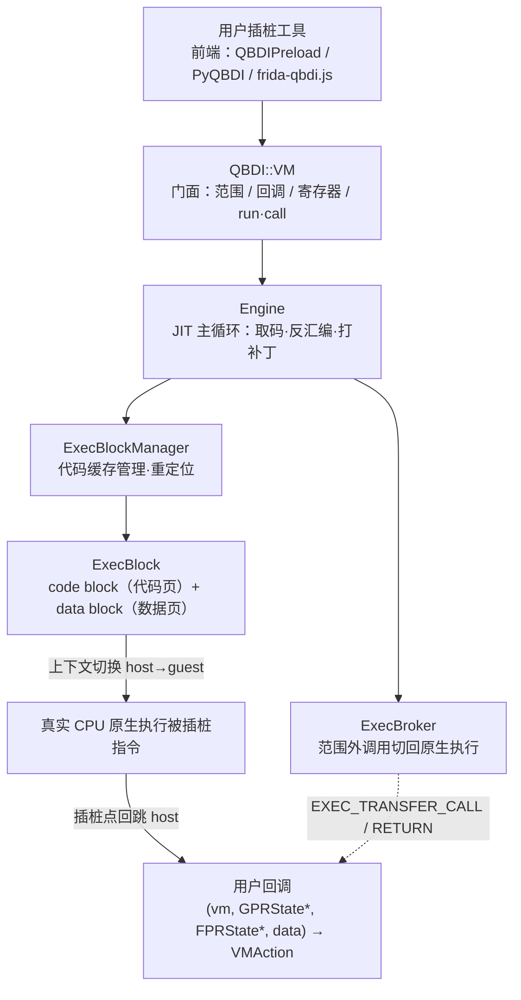
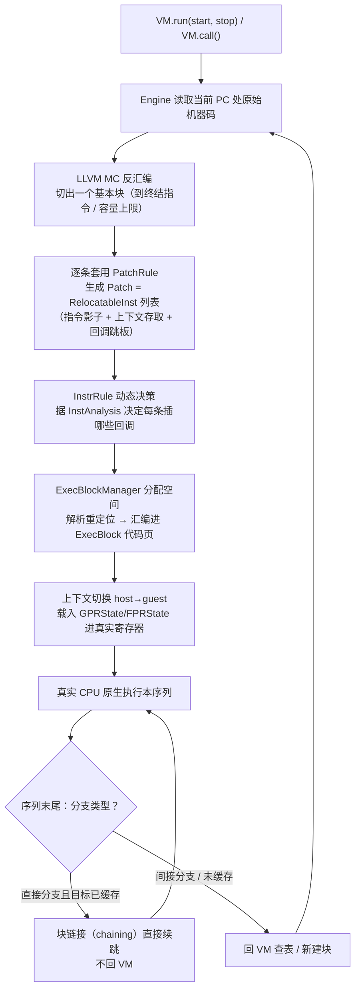
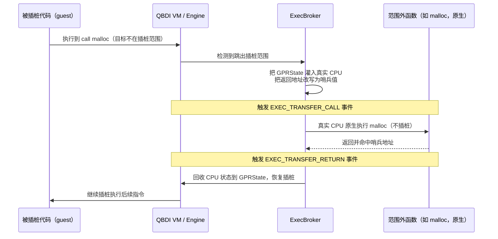

# 动态插桩与模拟执行引擎（6）· QBDI轻量级插桩框架
> [!abstract] TL;DR
> - QBDI（QuarkslaB Dynamic binary Instrumentation）是 Quarkslab 出品、基于 **LLVM** 的模块化 DBI 框架，最鲜明的取舍是**「只做插桩虚拟机、不做进程注入」**：它是一个链接/加载进目标进程的库，怎么进去交给前端（QBDIPreload / PyQBDI / frida-qbdi.js）。这与 Pin/DynamoRIO「自带注入器的整体框架」是根本分工差异，也是它被称作「轻量级」的第一层含义。
> - 执行模型是 **JIT 重编译而非模拟**：被插桩指令仍在真实 CPU 上**原生执行**（与本系列 ch07 起的 Emulation 分道扬镳），QBDI 只在基本块边界与插桩点接管上下文；靠 `addInstrumentedRange` 圈定范围、靠 **ExecBroker** 把范围外调用（`malloc`/`printf`）切回原生执行，做到「只为关心的代码付插桩开销」。
> - 核心对象是 **VM**；回调分四类——指令回调（`addCodeCB`/`addCodeAddrCB`/`addCodeRangeCB`，位置 `PREINST`/`POSTINST`）、助记符回调（`addMnemonicCB`）、内存访问回调（`addMemAccessCB`，需 `recordMemoryAccess`）、VM 事件回调（`addVMEventCB`：`SEQUENCE`/`BASIC_BLOCK`/`EXEC_TRANSFER`/`SYSCALL`），外加最灵活的 **InstrRule** 动态插桩规则；回调经 `GPRState`/`FPRState` 读写寄存器，返回 `VMAction` 决定续跑/回 VM/停。
> - **「指令的一生」**：Engine 用 LLVM MC 反汇编出基本块 → `PatchRule` 把每条指令降解成 `RelocatableInst` 补丁并织入回调跳板 → `InstrRule` 动态决定插桩 → `ExecBlockManager` 重定位后填进 **ExecBlock**（一页 code block + 一页 data block）→ 上下文切换进 guest 原生执行 → 序列末尾回 VM 查表或块链接续跑。
> - **与 Frida 结合**是 QBDI 的招牌用法：Frida 负责注入、`Interceptor.attach` 命中目标函数、脚本化与跨平台触达，QBDI 负责在该函数内做指令级插桩与寄存器/内存内省，`frida-qbdi.js` 用 `FRIDA_TO_QBDI` 同步上下文把两者缝合——各取所长，这正是本篇要讲透的组合范式。

## 概述与定位

QBDI 由法国安全公司 Quarkslab 开源（Apache-2.0），目标是「模块化、跨平台、跨架构」的动态二进制插桩：覆盖 Linux / macOS / Windows / Android / iOS 五大系统，x86 / x86-64 / ARM / AArch64（含 Thumb）四类架构。截至 0.12 版本，它已是 DBI 阵营里工程完成度较高的一员。放在本系列坐标里看，前面 ch03（Intel Pin）、ch04（DynamoRIO）讲的是「自带注入器、开箱即用的整体框架」，ch05（Frida-Gum 与 Stalker）讲的是「深度耦合 Frida 的 trace 引擎」；QBDI 是 DBI 半场登场的第五个引擎，但它的设计哲学最「轻」，理解它的关键就是先抓住这份「轻」到底轻在哪。

**「轻量级」有三重具体含义，缺一不可**。其一，**它是库而不是框架**——QBDI 本身不提供 `attach`/`spawn`/进程注入这类能力，你必须先用别的手段把 `libQBDI` 加载进目标进程（本地进程可直接链接、外部进程靠 LD_PRELOAD 或 Frida 注入），QBDI 只在进程内部提供「把一段代码放进插桩虚拟机里跑」的能力。这是它与 Pin/DynamoRIO 最本质的分工差异：后两者是「你启动 pin/drrun，它负责把自己塞进目标并接管」，QBDI 是「你负责塞进去，我负责插桩」。其二，**选择性插桩**——你用 `addInstrumentedRange` / `addInstrumentedModule` 只圈定关心的地址范围（往往就是一个函数或一个模块），范围之外的代码通过 ExecBroker 原封不动地原生执行，开销随插桩面积线性收缩，而不是像全系统模拟那样为每条指令买单。其三，**复用 LLVM**——QBDI 不手写各架构的反汇编器和汇编器，而是直接站在 LLVM 的 MC（Machine Code）层之上，反汇编、指令分析、重新汇编都借 LLVM 之力，因此新增一个架构的边际成本远低于手写 relocator 的方案，也天然获得了 LLVM 成熟的指令语义信息。

**与 ch05 的边界要划清**。Frida 的 Stalker 是 Frida 内建的、为每个架构手写 relocator/transformer 的 trace 引擎，和 Frida 的注入与脚本层紧耦合，强项是「跟着线程走、按事件转写代码流」；QBDI 是独立的插桩库，强项是「结构化内省」——它从 LLVM MC 拿到的 `InstAnalysis`（助记符、操作数、读写标志、寄存器角色）比 Stalker 手写的信息更规整，内存访问记录也更系统。两者不是替代关系而是互补关系：Stalker/Frida 擅长进得去、hook 得准、跨平台脚本化，QBDI 擅长在某个点上做细粒度插桩与寄存器/内存分析——所以本篇会用相当篇幅讲「Frida 注入 + QBDI 插桩」这个黄金组合。

**与 ch07 及之后的边界同样要划清**。QBDI 是 DBI，被插桩指令在**真实 CPU 上原生执行**，它不解释、不翻译指令语义，只在你指定的点上「插入回调」并管理控制流；而 ch07 起讲的 Unicorn/QEMU 是 CPU **模拟**，逐条解释或二进制翻译指令、维护一套虚拟 CPU 状态。一句话记：QBDI「借真 CPU 跑、只在边界接管」，模拟器「自己算每条指令」。这条分界线决定了两者在透明度、可移植性、速度上的全部差异，本系列 ch01 已从全景角度对比过，此处不重复推导，只强调 QBDI 稳稳站在 DBI 这一侧。

在系列衔接上，本篇上承 ch02（代码缓存与 trace 的通用原理，ExecBlock 就是那套原理的一个具体实现）与 ch05（Frida）；下启 ch12（覆盖率/污点/trace 三类客户端，QBDI 常作它们的执行后端）与知识库系列 49（Fuzzing）。QBDI 的价值不在于「又一个 DBI」，而在于它把「插桩」这件事拆成了最小内核，让你能像搭积木一样把它嵌进 Frida、嵌进 Python、嵌进你自己的 fuzzer。

## 原理与机制

QBDI 的心智模型可以浓缩成一句话：**它是一个能把「一段被插桩的原生代码」放进受控循环里执行的 JIT 引擎**。用户面对的是 `VM` 这个门面对象，背后是 `Engine`（JIT 主循环）、`ExecBlockManager`（代码缓存）、`ExecBroker`（范围外调用中转）三大部件协同。

**VM：一切的入口**。`VM` 对象暴露四组能力：配置插桩范围（`addInstrumentedRange` / `addInstrumentedModule` / `addInstrumentedModuleFromAddr`）、注册回调（`add*CB` / `addInstrRule`）、读写寄存器状态（`getGPRState` / `setGPRState` / `getFPRState` / `setFPRState`）、以及启动执行（`run(start, stop)` 从某地址跑到某地址、或 `call(func, args)` 按调用约定调一个函数并取返回值）。这套 API 的克制程度本身就是设计声明：它不管你怎么进程序、不管你要分析什么，只管「给我一段范围、一组回调、一个起点，我把它跑给你看，并在你要的每个点回调你」。

**GPRState 与 FPRState：guest 的寄存器镜像**。QBDI 用两个结构体表示被插桩程序（guest）的寄存器：`GPRState` 存通用寄存器与 `rip`/`eflags`，`FPRState` 存浮点/向量寄存器。回调收到的是这两个结构的**可变**引用——你在回调里改 `rax`、改内存、改标志位，都会真实影响后续执行，这是 QBDI 能做「插桩式修改」而不只是「观察」的基础。有一个必须记牢的陷阱：**在回调里修改指令指针（`rip`/`pc`）不会立即生效，除非回调返回 `BREAK_TO_VM`**——因为此时控制流已经被 JIT 进了 ExecBlock，只有回到 VM 主循环重新求值，改过的 PC 才会被当作新的跳转目标；其他寄存器则可以随意改、无需 `BREAK_TO_VM`。

```text
// x86-64 上的 GPRState（节选，概念示意，非精确字段顺序）
struct GPRState {
    rword rax, rbx, rcx, rdx, rsi, rdi;
    rword r8, r9, r10, r11, r12, r13, r14, r15;
    rword rbp, rsp;   // 关键：run/call 期间 rsp 指向 QBDI 分配的“虚拟栈”，非原始栈
    rword rip;        // 改它必须让回调返回 BREAK_TO_VM 才生效
    rword eflags;
};
// FPRState 另存 XMM/YMM（x86）或 Q/V 寄存器（AArch64）等；
// 用 Options::OPT_DISABLE_FPR / OPT_DISABLE_OPTIONAL_FPR 可在上下文切换时
// 跳过 FPR 的备份/恢复以提速——多数纯整数逻辑的插桩根本用不到浮点态。
```

**虚拟栈：共享地址空间下的隔离手段**。QBDI 与被插桩程序**共享同一个进程地址空间**（这点和模拟器截然不同——模拟器有自己独立的虚拟内存），这带来一个隐患：guest 代码和 QBDI 自身的插桩逻辑会争用同一片栈。QBDI 的解法是 `allocateVirtualStack`：为 guest 分配一段独立的栈内存并把 `GPRState.rsp` 指过去，让被插桩代码在这段「虚拟栈」上运行，既避免踩到 host（插桩器）的栈，也让 `call()` 能构造一个干净的调用帧。用完要 `alignedFree` 释放。理解「共享地址空间 + 独立虚拟栈」这对设计，是后面理解 ExecBroker 为何必要、以及安全章节为何反复强调「别插桩共享锁的函数」的前提。

**回调体系概览**（细节留给下一节展开）。QBDI 的回调按「触发时机」分四大类：指令回调（在某条/某范围/所有指令的前或后触发）、助记符回调（按指令助记符匹配，如 `CMP*` 带通配）、内存访问回调（读/写内存时触发，需先 `recordMemoryAccess`）、VM 事件回调（在序列/基本块进出、执行转移、系统调用进出等 VM 层事件触发）。所有回调最终都归结为同一个签名家族：`(VMInstanceRef vm, GPRState*, FPRState*, void* data) → VMAction`（VM 事件回调多带一个 `VMState`）。这种「统一签名 + 事件分类」的设计让工具代码高度一致，也让 C/Python/JS 三套前端能共享同一套心智模型。

**ExecBroker：选择性插桩的执行中转站**。这是 QBDI「轻」的机制核心。当被插桩代码调用一个**落在插桩范围之外**的函数（典型如 `malloc`、`printf`、libc 内部例程）时，ExecBroker 会检测到这次「跳出范围」，把当前 QBDI 维护的 CPU 状态灌回真实寄存器、把返回地址改写成一个哨兵值，然后让这个外部函数在**真实 CPU 上原生、无插桩地执行**；当它返回并命中哨兵地址时，ExecBroker 再把 CPU 状态收回 `GPRState`、恢复插桩执行。这一进一出会触发 `EXEC_TRANSFER_CALL` 与 `EXEC_TRANSFER_RETURN` 两个 VM 事件。为什么要这么设计？因为 QBDI 自身也用到了堆、锁、全局状态——如果连 `malloc` 都插桩，回调里再间接调用 `malloc`，就可能与 QBDI 内部争抢同一把互斥锁而**死锁或重入崩溃**；把这类函数排除在插桩之外，既避免了自指涉的重入灾难，又顺带省下了海量无意义的插桩开销。这正是「只为关心的代码付费」在机制层面的落地。



## 指令的一生：反汇编·打补丁·JIT·ExecBlock 执行详解

要真正理解 QBDI，最好的路径是跟着一条指令走完从「原始机器码」到「在 ExecBlock 里被插桩执行」的全流程。官方文档把这称作「the life of an instruction」，下面逐环节拆解，并说清每一步「为什么这么设计」。

**第一步：取码与反汇编**。你调用 `VM.run(start, stop)`，Engine 从当前 PC 读取原始机器码，交给 LLVM 的 MC 层反汇编，切出一个**基本块**——一直读到遇见一条终结指令（分支、调用、返回）或达到长度上限为止。选择 LLVM MC 而非自研反汇编器，换来的是「指令语义信息免费到手」：每条指令的助记符、操作数个数与类型、读写了哪些寄存器、是否访存，LLVM 都已经解析好，QBDI 只需按需取用，这直接支撑了后面 `InstAnalysis` 的丰富度。

**第二步：打补丁（PatchRule → Patch → RelocatableInst）**。这是 QBDI 最有技术含量的一层。反汇编出的每条指令，都会去匹配一组 `PatchRule`（补丁规则），生成一个 `Patch`——本质是一串 `RelocatableInst`（可重定位指令）。这串指令通常包含三部分：**指令本体的可重定位影子**（原指令搬进 ExecBlock 后地址变了，涉及 PC 相对寻址、跳转目标的都要重定位）、**上下文存取片段**（在插桩点把 guest 寄存器保存进 data block、之后再恢复）、**回调跳板**（在恰当位置跳去调用用户回调）。为什么要用「可重定位指令」而不是直接生成最终机器码？因为此刻这段补丁将被放进哪个 ExecBlock、落在哪个地址还未确定，必须把「与地址相关的部分」延迟到装载时再解析——这与链接器的重定位思想同源（可对照知识库系列 43 链接器详解）。

**第三步：InstrRule 动态插桩决策**。如果注册了 `addInstrRule`，在插桩过程中每条指令都会调用你的规则回调，传入该指令的 `InstAnalysis`，由你返回「这条指令要插哪些回调、插在指令前还是后、优先级多高」。这等价于 Intel Pin 里「instrumentation routine 与 analysis routine 分离」的思想：InstrRule 是「决定要不要插、插什么」的一次性决策（每条指令在首次翻译时问一次），真正的 analysis 逻辑则在每次执行时才跑。把「决策」与「执行」分开，是所有高性能 DBI 的共同套路——决策只在翻译期发生一次并被缓存，执行期直接跑缓存好的插桩代码，避免每次都重新判断。

**第四步：装进 ExecBlock**。`ExecBlockManager` 负责在代码缓存里为这段补丁找地方。它管理一批 `ExecBlock`，每个 ExecBlock 在 guest 侧占**两页内存**：一页 **code block**（放 JIT 出来的插桩机器码）、一页 **data block**（放 `GPRState`/`FPRState` 上下文、内存访问记录等运行期数据）。Manager 找到空间后，解析补丁里所有 `RelocatableInst` 的重定位（此刻地址终于确定了），把它们汇编进 code block。代码块与数据块分页而治，既便于设置不同的内存权限，也让上下文数据与可执行代码物理隔离，降低相互踩踏的风险。

**第五步：上下文切换与原生执行**。要执行了，QBDI 做一次 host→guest 的上下文切换：保存插桩器（host）自己的寄存器，把 `GPRState`/`FPRState` 里的 guest 寄存器值载入真实 CPU，然后跳进 code block。**此后被插桩的指令就在真实 CPU 上原生执行**——这再次印证 QBDI 是 DBI 不是模拟器：计算本身由硬件完成，QBDI 只在预先织入的插桩点接管。序列跑完再做反向切换，回到 host。

**第六步：序列末尾的控制流处理（sequence、块链接、间接分支）**。一个反汇编出的基本块，可能因为容量装不下而被切成多个 **sequence**（序列）。序列末尾的处理分两种：若结尾是**直接分支且目标块已在缓存**，QBDI 会做**块链接（chaining）**——直接把当前块的结尾跳到目标块，不必回 VM 主循环，这是把「解释器式的每块回主循环」优化成「翻译块之间直接跳」的关键提速手段（原理见 ch02 的 trace linking）；若结尾是**间接分支**（`call rax`、`ret`、跳转表）或目标尚未翻译，就必须回 VM 查表解析目标、必要时新建块。间接分支之所以逃不掉回 VM，是因为目标地址运行期才知道，无法在翻译期静态链接——这是所有 DBI 都要面对的硬约束。



**回调跳板的内部机制**。当执行流跑到一个插桩点，code block 里预先织入的跳板代码会：把 guest 当前寄存器状态存进 data block 的 `GPRState`/`FPRState`、做 guest→host 上下文切换、以标准签名 `(vm, gprState*, fprState*, data)` 调用你的 C 回调；回调返回后依 `VMAction` 决定下一步，再切回 guest 续跑。正因为每个插桩点都要「存上下文—切换—调用—切回」，插桩点数量直接决定开销，这也是为什么 QBDI 反复鼓励你用范围限定和 InstrRule 把插桩面积压到最小。

**内存访问记录：为何要显式开启**。QBDI 能捕获每条访存指令读/写的**有效地址、值、大小**，但这不是默认行为——你要先调 `recordMemoryAccess(MEMORY_READ / WRITE / READ_WRITE)`，QBDI 才会在访存指令周围额外织入「把有效地址与数据抄进 data block」的补丁，之后回调里用 `getInstMemoryAccess` / `getBBMemoryAccess` 取出。为什么不默认全开？因为每条访存都记录会显著增加插桩代码量与上下文数据量，开销可观；把它做成按需开关，是「轻量」哲学在细节上的又一次体现。内存访问回调 `addMemAccessCB`（任意访存）、`addMemAddrCB`（特定地址）、`addMemRangeCB`（地址范围）就建立在这套记录机制之上。

**InstAnalysis：懒解析的结构化指令信息**。`getInstAnalysis(flags)` 按 `AnalysisType` 位标志返回指令的静态分析：`ANALYSIS_INSTRUCTION`（地址、大小、助记符、条件、读写标志）、`ANALYSIS_DISASSEMBLY`（反汇编文本）、`ANALYSIS_OPERANDS`（每个操作数的类型/寄存器/立即数/读写角色）、`ANALYSIS_SYMBOL`（符号信息）。按位标志分级、用到才解析，是为了省去不必要的字符串化与操作数展开开销——你只查地址时，QBDI 不会浪费时间去生成反汇编文本。这份信息大多直接来自 LLVM MC，规整度远高于手写反汇编器拼出来的结果，是 QBDI 内省能力的底座。

**VMAction：回调的控制阀**。回调返回值决定 VM 后续动作，语义要分清：`CONTINUE`（正常续跑）；`BREAK_TO_VM`（回 VM 主循环重新求值，**改 PC 后必须用它**才生效）；`STOP`（终止本次 run）；`SKIP_INST`（在 PREINST 回调里返回，直接跳到 POSTINST，等于「跳过/自行模拟这条指令」）；`SKIP_PATCH`（跳过该指令剩余的所有回调补丁）。这几个动作让插桩工具能做的事从「观察」扩展到「改流、跳指令、提前终止」，是实现污点传播、选择性执行、指令级 patch 的原语。



**VM 事件全谱**。`addVMEventCB` 可监听的事件覆盖了 VM 运行的关键节点：`SEQUENCE_ENTRY`/`SEQUENCE_EXIT`（序列进出）、`BASIC_BLOCK_ENTRY`/`BASIC_BLOCK_EXIT`/`BASIC_BLOCK_NEW`（基本块进出与首次翻译）、`EXEC_TRANSFER_CALL`/`EXEC_TRANSFER_RETURN`（ExecBroker 的范围外转移）、`SYSCALL_ENTRY`/`SYSCALL_EXIT`（系统调用前后）。事件回调多收到一个 `VMState`，内含触发的事件集合以及当前基本块/序列的起止地址。一个典型用法是**用 `BASIC_BLOCK_NEW` 采集覆盖率**：每当一个新基本块首次被翻译就记一笔，正好对应「代码覆盖」的语义（这类客户端的完整方法论属于 ch12，本篇只点出机制入口）。

**上下文切换成本与 FPR 优化**。每次 host↔guest 切换都要保存/恢复整套寄存器，浮点/向量态尤其笨重。QBDI 提供 `OPT_DISABLE_FPR`（完全不备份恢复 FPR，只管 GPR）和 `OPT_DISABLE_OPTIONAL_FPR`（默认策略下 QBDI 会探测某基本块是否真的用到 FPR，不用就跳过恢复；此选项反过来强制每块都恢复）。对大量纯整数逻辑的分析场景，关掉 FPR 备份能实打实地降低每次切换的成本——这类「按需省略上下文」的开关，是 DBI 工程里压榨性能的常规手段。

## 工具视角与实战

QBDI 自己不进程序，所以「怎么用」本质是「选哪个前端把它带进目标进程」。官方提供三条路：**QBDIPreload（C）**、**PyQBDI（Python）**、**frida-qbdi.js（与 Frida 结合）**，分别对应「原生、快速脚本化、生态缝合」三种诉求。

**QBDIPreload：C 语言的注入骨架**。它用动态库注入让你在进程入口接管：Linux 走 `LD_PRELOAD`、macOS 走 `DYLD_INSERT_LIBRARIES`、Windows 用 `QBDIWinPreloader.exe` 或自备的 DLL 注入。它暴露一组生命周期 hook——`qbdipreload_on_start`（拿到入口/main 地址）、`qbdipreload_on_premain`（拿到原始平台相关的 GPR/FPR 上下文，可用 `qbdipreload_threadCtxToGPRState`/`floatCtxToFPRState` 转成 QBDI 状态）、`qbdipreload_on_main`（已劫持主线程、身处 main 位置）、`qbdipreload_on_run`（拿到一个就绪的 VM，注册回调后 `run`）、`qbdipreload_on_exit`（进程退出）。最小骨架如下：

```c
#include "QBDIPreload.h"
QBDIPRELOAD_INIT;                        /* 声明构造器，全代码只能出现一次 */

static VMAction onInst(VMInstanceRef vm, GPRState *gpr, FPRState *fpr, void *data) {
    const InstAnalysis *a =
        qbdi_getInstAnalysis(vm, QBDI_ANALYSIS_INSTRUCTION | QBDI_ANALYSIS_DISASSEMBLY);
    printf("0x%" PRIRWORD "  %s\n", a->address, a->disassembly);
    return QBDI_CONTINUE;                /* 续跑；改 PC 则需返回 QBDI_BREAK_TO_VM */
}
int qbdipreload_on_main(int argc, char **argv) { return QBDIPRELOAD_NOT_HANDLED; }
int qbdipreload_on_run(VMInstanceRef vm, rword start, rword stop) {
    qbdi_addCodeCB(vm, QBDI_PREINST, onInst, NULL);  /* 每条指令前回调 */
    qbdi_run(vm, start, stop);                        /* 在虚拟栈上跑起来 */
    return QBDIPRELOAD_NO_ERROR;
}
```

运行：`LD_PRELOAD=./libmytool.so ./target`。这套骨架的价值在于把「平台相关的入口劫持与上下文捕获」这块脏活全封装了，你只需填回调——这也是 PyQBDI 底层复用的机制。

**PyQBDI：Python 里写 DBI 工具**。它把 QBDIPreload 与 Python 绑定打通（PyQBDIPreload），让你用 Python 快速写插桩脚本，适合原型验证与一次性分析：

```python
import pyqbdi

def onInst(vm, gpr, fpr, data):
    a = vm.getInstAnalysis()
    data["count"] += 1
    print(hex(a.address), a.disassembly)
    return pyqbdi.CONTINUE

def pyqbdipreload_on_run(vm, start, stop):        # PyQBDIPreload 约定入口
    data = {"count": 0}
    vm.addCodeCB(pyqbdi.PREINST, onInst, data)
    vm.run(start, stop)
```

运行：`LD_PRELOAD=<libpyqbdi.so> PYQBDI_TOOL=mytool.py ./target`。但要牢记它的硬限制：**一次只能有一个 VM**；**不能在 `atexit` 里用 VM**；**插桩 32 位目标必须用 32 位的 Python 与 PyQBDI**；**不能用它插桩一个 Python 进程**——因为 host（你的脚本）和 target 会共用同一个 Python 运行时，自指涉必然出问题。这些限制不是 bug，而是「共享地址空间 + 共享运行时」这一架构必然的边界，理解了原理就不会踩。

**frida-qbdi.js：与 Frida 结合的招牌用法**。这是种子要点「与 Frida 结合」的落点，也是 QBDI 在逆向实战中最出彩的场景。思路是**分工缝合**：Frida 负责把自己注入进任意进程、用 `Interceptor.attach` 精准命中目标函数、提供 JS 脚本化与跨平台触达；QBDI 负责在命中之后，对该函数做**指令级插桩与寄存器/内存内省**。在 `frida-qbdi.js` 里，`QBDI` 对象就等价于原生的 `VM`（需 Frida ≥ 14 以支持 ES2019）。关键的一环是**上下文同步**：Frida hook 现场的 CPU 上下文要通过 `FRIDA_TO_QBDI` 方向灌进 QBDI 的 `GPRState`，QBDI 才能在正确的寄存器/参数状态下重放这个函数（反方向 `QBDI_TO_FRIDA` 因 Frida 侧缺乏上下文回写能力，目前是实验性、且 `rip` 无法同步）。

```javascript
// 示意：Frida 注入并 hook 目标函数，再在 hook 内用 QBDI 做指令级插桩
const funcPtr = Module.findExportByName(null, "check_license");
Interceptor.attach(funcPtr, {
    onEnter: function (args) {
        const vm = new QBDI();
        const state = vm.getGPRState();
        const stack = vm.allocateVirtualStack(state, 0x100000);   // 独立虚拟栈
        vm.addInstrumentedModuleFromAddr(funcPtr);                // 只插桩目标所在模块
        vm.synchronizeContext(this.context, SyncDirection.FRIDA_TO_QBDI); // 灌上下文
        const icb = vm.newInstCallback(function (vm, gpr, fpr, data) {
            const a = vm.getInstAnalysis();
            console.log(a.address, a.disassembly);
            return VMAction.CONTINUE;
        });
        vm.addCodeCB(InstPosition.PREINST, icb, null);
        vm.call(funcPtr, [args[0], args[1]]);   // 在插桩下重放该函数并取返回值
        vm.alignedFree(stack);
    }
});
```

**为什么这个组合强**？单用 Frida，你能 hook 函数边界、读参数与返回值，但看不清函数内部逐条指令的执行与寄存器演化——Stalker 虽能 trace，但内省的结构化程度不如 QBDI；单用 QBDI，你又得自己解决「怎么进程序、怎么定位并命中那个函数」。两者一缝：Frida 出「进得去、hook 得准、脚本化」，QBDI 出「指令级插桩、寄存器/内存精细内省」，正好补齐彼此的短板。这就是为什么脱壳、反混淆、算法还原这类需要「盯着某个关键函数逐条看」的任务，社区偏爱 Frida+QBDI 而不是纯 Stalker。


**下游用例**。QBDI 常作为更上层分析的执行后端：**覆盖率采集**（用 `BASIC_BLOCK_NEW` 记新块，喂给 fuzzer 做反馈式变异，衔接 ch12 与系列 49）；**污点分析与符号执行**（Quarkslab 自家的 Triton 可用 QBDI 或 Pin 做具体执行后端，一边真跑一边驱动符号/污点引擎）；**指令级 trace 与去混淆**（Romain Thomas 在 BH Asia 2020 系统讲过用 DBI 对抗原生代码混淆的手法）；**脱壳**（在壳解密并跳向 OEP 的过程中逐指令观察内存写入，定位脱壳点）。QBDI 之所以适合当后端，正因为它「轻、可嵌、内省强」——你能把它塞进任何宿主，只暴露你要的那一小片执行细节。

**横向对比**（帮助定位而非贬褒，各引擎的内部细节见各自专篇）：

| 维度 | QBDI | Intel Pin | DynamoRIO | Frida Stalker |
|---|---|---|---|---|
| 定位 | 插桩库（自带 VM，不含注入） | 完整框架（自带注入器） | 完整框架（自带注入器） | Frida 内建 trace 引擎 |
| 反汇编/汇编 | 复用 **LLVM MC** | 私有引擎（XED 解码） | 私有引擎 | 各架构手写 relocator |
| 进入进程 | 靠前端（Preload/Py/Frida） | `pin` 启动器 attach/spawn | `drrun` attach/spawn | Frida 注入 |
| 内省粒度 | 指令级 + 结构化 InstAnalysis + 内存记录 | 指令级（`IARG_*`） | 指令/BB 级 | 指令/BB 级 + 事件流 |
| 脚本化 | C/C++/Python/JS(Frida) | C/C++ Pintool | C DR client | JS(Frida) |
| 许可 | Apache-2.0 开源 | 闭源（免费） | BSD 开源 | 开源（wxWindows/LGPL 系） |
| 强项 | 轻、可嵌、LLVM 内省、与 Frida 缝合 | 成熟、生态大、文档全 | 高性能、优化可定制 | 与 Frida 生态无缝 |

## 安全性与正确使用

QBDI 是分析工具，本身不含攻击性载荷，但「把插桩器和被分析代码塞进同一个地址空间」这一架构决定了它有一批必须守住的正确性与安全边界，用错了轻则结果失真、重则进程崩溃。

**共享地址空间的重入与死锁风险**。QBDI 与 guest 共享堆、锁、全局状态。如果你把插桩范围开得过大，覆盖到了 `malloc`/`free`/`printf` 这类 QBDI 自身也会用到的函数，而回调里又（哪怕间接地）调用了它们，就可能与 QBDI 内部争抢同一把互斥锁，触发死锁或重入崩溃。**ExecBroker 的存在正是为化解此患**——默认把范围外调用切回原生执行。所以「正确使用」的第一条铁律是：**只插桩你真正关心的范围**，别贪大；回调实现里也要避免调用可能被插桩且与 QBDI 共享锁的函数。

**自指涉的禁区**。PyQBDI 明确不能插桩 Python 进程，根因就是 host 脚本与 target 共用 Python 运行时，插桩器会把自己也插了，形成无穷递归或状态污染。推而广之，任何「用某运行时写的插桩器去插桩同一运行时的进程」都要警惕。多线程同理：QBDI 的一个 VM 对应一份执行上下文，**每个被插桩线程需要各自的 VM/上下文**，跨线程共用一个 VM 会导致状态错乱（PyQBDI 甚至直接限定「一次只能一个 VM」）。

**透明度不是无限的（反 DBI 面）**。QBDI 尽力让 guest 看到「正确的」PC 与寄存器，但它**不保证对抗级透明**：被插桩代码实际跑在 QBDI 分配的虚拟栈上（检测异常栈地址可暴露）、真正执行的机器码在 JIT 代码缓存里而非原始地址（自读代码、代码段校验和会对不上）、插桩带来的额外指令会显著改变时序（`RDTSC`/计时旁路能测出来）、异常与信号的处理路径也和原生有差异。这些都是「反 DBI」检测的着力点。本篇立足防御与分析视角，只点明这层边界的存在——**成熟的壳与保护会主动探测 DBI**，具体的检测手法与绕过对抗是本系列 ch14（反插桩与反模拟对抗）的主题，此处不展开武器化细节。

**修改状态的正确姿势**。回调里改寄存器很强大也很容易翻车：改 `rip`/`pc` 必须返回 `BREAK_TO_VM` 才生效，否则悄无声息地被忽略；用 `SKIP_INST` 跳过指令时要自己保证语义自洽（跳过一条有副作用的指令可能让后续逻辑错乱）；改内存要清楚你改的是真实进程内存（共享地址空间，立即可见）。内存访问记录要 `recordMemoryAccess` 显式开启，忘了开就取不到访存数据——这是新手常见的「回调收到空内存记录」的原因。

**架构与位宽匹配**。插桩 32 位目标要用 32 位的 QBDI/Python，64 位对 64 位，混用会直接失败；ARM/Thumb 的状态切换、AArch64 的向量寄存器等平台差异也要按目标架构对待。这些不是「安全漏洞」，而是「用错了根本跑不起来」的正确性前提。

**合规边界**。QBDI 的能力（读改任意进程的执行细节）决定了它只应用于**自有软件、CTF 靶场、以及获得明确授权的安全研究与漏洞分析**。理解一个函数「内部怎么算的」、把某段被混淆的逻辑还原清楚，其正当用途是防御加固、兼容性分析、漏洞挖掘与教学；把同样的能力用于绕过他人软件授权、窃取受保护数据或攻击未授权目标，则可能触犯《中华人民共和国网络安全法》等法律法规。工具中立，责任在人——本篇所有原理与示例均以防御和研究为立场。

## 小结

- QBDI 是基于 LLVM 的模块化 DBI 框架，「轻量级」的三重内核是：**库而非框架（不含进程注入）、选择性插桩（范围外靠 ExecBroker 原生执行）、复用 LLVM MC（不手写反汇编/汇编器）**。抓住这三点，就抓住了它与 Pin/DynamoRIO 的全部分工差异。
- 它是 DBI 不是模拟：被插桩指令在真实 CPU 上原生执行，QBDI 只在基本块边界与插桩点接管上下文；这条分界线把它与本系列后半的 Unicorn/QEMU 模拟器彻底区分开。
- 心智模型是 `VM`（门面）+ `Engine`（JIT 主循环）+ `ExecBlockManager`（两页制的 ExecBlock 代码缓存）+ `ExecBroker`（范围外调用中转）；回调统一为 `(vm, GPRState*, FPRState*, data) → VMAction`，改 PC 必须返回 `BREAK_TO_VM`。
- 「指令的一生」是理解 QBDI 的主线：LLVM MC 反汇编 → PatchRule 降解为可重定位补丁并织入回调跳板 → InstrRule 动态决策 → ExecBlockManager 重定位装入 ExecBlock → 上下文切换原生执行 → 序列末尾块链接或回 VM。内存访问记录、InstAnalysis 懒解析、FPR 上下文省略都是围绕「按需付费」的性能设计。
- 三前端各司其职：QBDIPreload（C，LD_PRELOAD/DYLD/WinPreloader）、PyQBDI（Python 快速原型，注意一次一个 VM、不能插桩 Python 进程）、frida-qbdi.js（与 Frida 缝合的招牌用法，靠 `FRIDA_TO_QBDI` 同步上下文）。
- 与 Frida 结合是实战重心：Frida 出注入/hook/脚本化/跨平台，QBDI 出指令级插桩与寄存器/内存内省，二者互补，特别适合脱壳、反混淆、算法还原这类「盯着关键函数逐条看」的任务。
- 安全与正确性的根子都在「共享地址空间」：别插桩共享锁的函数（否则死锁/重入）、别自指涉、每线程独立 VM、修改状态守规矩；透明度有限，具体的反 DBI 对抗留给 ch14。

## 相关阅读

- [[05.Frida-Gum与Stalker内部机制]] · 上一章，Stalker 的 trace 内部机制；理解 QBDI 与 Stalker 的互补与「Frida 注入 + QBDI 插桩」的另一半
- [[07.CPU模拟原理：解释与二进制翻译]] · 下一章，从 DBI（原生执行）切换到 Emulation（解释/翻译）的分界
- [[02.DBI原理：代码缓存与trace]] · ExecBlock、块链接、间接分支回主循环等通用原理的出处
- [[12.插桩驱动的分析：覆盖率与污点与trace]] · QBDI 作为覆盖率/污点/trace 客户端后端的完整方法论
- [[14.反插桩与反模拟对抗]] · 本篇「透明度限制」的深挖：DBI 检测与绕过
- [[00.动态插桩与模拟执行引擎总览]] · 系列总览与篇目导航
- [[32.hooks/09-frida]] · Frida 用法基础，frida-qbdi.js 组合范式的前置知识
- [[45.反编译器与反汇编引擎原理/01.反汇编算法：线性扫描与递归遍历]] · 静态对偶：QBDI 靠 LLVM MC 动态反汇编，与静态反汇编算法互为镜像
- [[39.固件与IoT嵌入式逆向/23.固件仿真进阶Qiling与HALucinator]] · rehost 场景中 DBI 与全系统模拟的分工呼应
- [[49.Fuzzing与漏洞挖掘/00.Fuzzing与漏洞挖掘总览]] · 下游应用：以 QBDI 覆盖率反馈驱动的模糊测试
- 官方与权威一手资料（按名称提及，不作外链）：QBDI 官方文档（qbdi.quarkslab.com 与 ReadTheDocs 的 architecture / instrumentation_process / api_c / api_pyqbdi / api_js / QBDIPreload 各章）· QBDI 源码仓库（github.com/QBDI/QBDI）· Quarkslab 博客 QBDI 0.7/0.8 版本说明 · Triton 动态二进制分析框架文档（以 QBDI/Pin 为具体执行后端）· Romain Thomas《Dynamic Binary Instrumentation Techniques to Address Native Code Obfuscation》（Black Hat Asia 2020）· LLVM MC 层文档

[[00.动态插桩与模拟执行引擎总览|⬆ 系列总览]] | [[05.Frida-Gum与Stalker内部机制|← 上一章]] | [[07.CPU模拟原理：解释与二进制翻译|→ 下一章]]
