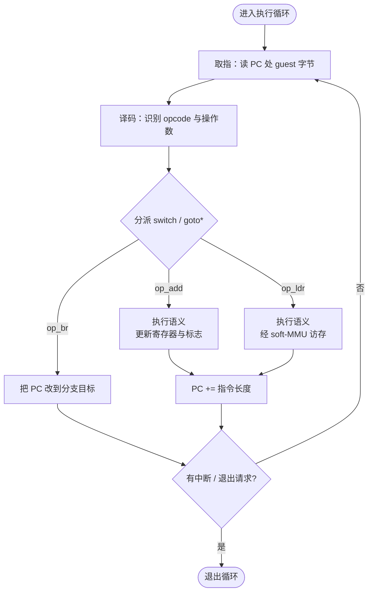
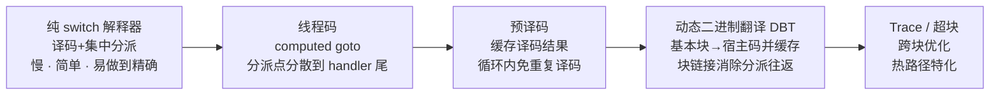
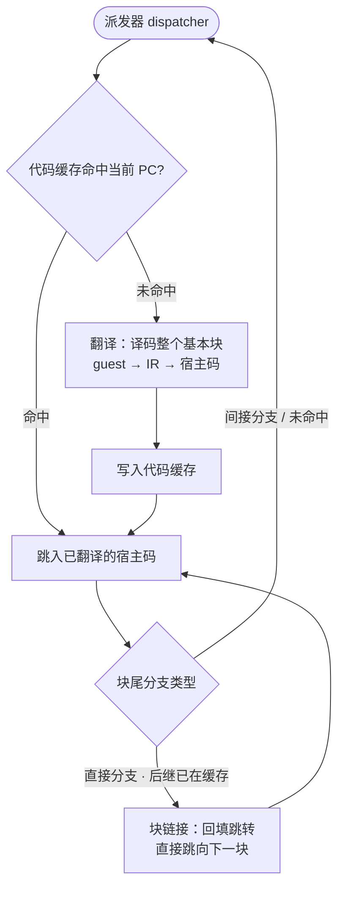
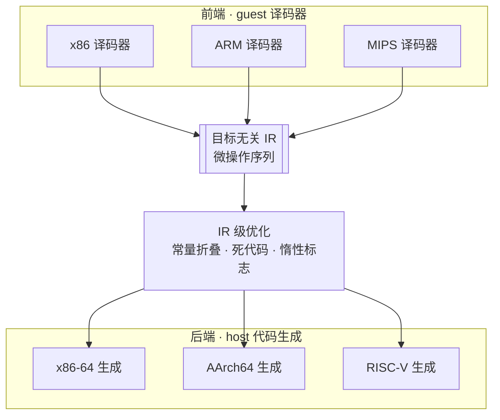
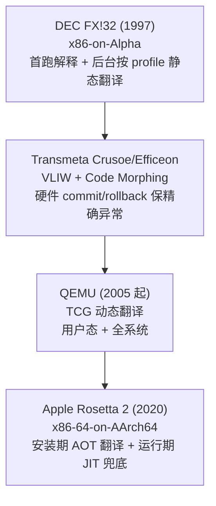

# 动态插桩与模拟执行引擎（7）· CPU模拟原理：解释与二进制翻译

> [!abstract] TL;DR
> - CPU 模拟的本质是在宿主机上重建一台"虚拟 CPU"：持有 guest 的寄存器/标志/内存/PC，用取指-译码-执行循环推进架构状态。与 DBI 的根本分野是它**不要求宿主与 guest 同架构**。
> - 纯解释器的开销大头不是指令语义，而是**分派（dispatch）**——集中式 `switch` 的边界检查加单点间接跳转会持续打崩硬件分支预测器，简单指令上分派可占七八成时间。
> - 线程码家族（直接/间接/子程序/上下文线程码、computed goto、预译码）的共同思路是把分派"分散到每个 handler 尾部"或"翻译成 call/ret 暴露给硬件预测器"，从而削减分派开销。
> - 动态二进制翻译（DBT / dynarec）把基本块一次性翻译成宿主码并缓存，用块链接（chaining）消除分派往返，把稳态开销从解释的数十倍压到个位数倍，代价是冷代码翻译成本、自修改码失效与精确异常等正确性负担。
> - 目标无关 IR 解耦 N 前端 × M 后端，并承载惰性标志、精确异常恢复、SMC 失效等机制，是 QEMU-TCG、Valgrind-VEX、Unicorn、Ghidra P-Code 等现代引擎的共同骨架。

## 概述与定位

CPU 模拟（emulation）要回答一个具体问题：**在一台宿主机（host）上，忠实运行为另一套指令集（guest ISA）编译的机器码**。手段是构造一个软件对象——虚拟 CPU，它持有 guest 全部架构可见状态：通用寄存器、程序计数器 PC、标志/状态寄存器，以及经软件 MMU 访问的 guest 内存；再按 guest ISA 的语义一步步推进这份状态。读者写下 `a+b` 后，编译器把它变成 guest 的一条 `add` 机器码；模拟器要做的，是在 host 上"假装自己是那颗 guest CPU"，把这条 `add` 的效果算出来并落到虚拟寄存器里。

在本系列里，01 划分了 DBI 与 Emulation 两大阵营，02–06 全程在讲 DBI（Pin、DynamoRIO、Frida-Gum/Stalker、QBDI）。DBI 有个隐含前提：host 与被插桩程序**同架构**，插桩只是"在原生执行流里掺代码"。从本篇起转入 Emulation：不再假设同架构，改用软件解释或翻译 guest 指令。主线是 07（本篇·原理与方法学）→ 08（QEMU-TCG 的具体翻译实现）→ 09（Unicorn 的 CPU-only 实战）→ 10（全系统与外设）→ 11（rehost）。因此本篇是"地基"：把解释器、线程码、动态二进制翻译三条路线的原理与取舍讲透，铺好术语与心智模型，后续篇章直接复用而不再重述。

三组最容易混淆的区分先摆清：

- **模拟 vs 虚拟化**：虚拟化（KVM、Intel VT-x、AMD-V）让 guest 在**同 ISA** 的 host 上近乎原生地跑，由硬件负责隔离与特权降级，它**不翻译指令**；模拟是**跨 ISA** 的软件重建。QEMU 两者皆可——`accel=tcg` 是模拟，`accel=kvm` 是虚拟化加速，同一份设备模型上层切换执行后端。把"QEMU 很慢/很快"一概而论，往往是没分清这两条路径。
- **模拟 vs DBI**：两者都可能有 code cache，但装的东西不同。DBI 的缓存里是"原生指令 + 插桩桩代码"，不跨架构；模拟的缓存里是"由 guest 指令翻译出来的宿主指令"，跨架构。这也是为什么 DBI 天然快（原生跑）、纯模拟天然慢（要重演每条指令的语义）。
- **功能级 vs 周期级**：功能级（ISA-level / instruction-accurate）只保证**架构状态**正确——寄存器与内存的最终值对，QEMU、Unicorn 属此类，够快也够逆向用；周期级（cycle-accurate，如 gem5 的 O3 模型、部分 Simics 时序模式）还建模流水线、cache、乱序，慢上百到上千倍，是微架构研究工具。本系列聚焦功能级模拟。

## 原理与机制

一切从"虚拟 CPU 的状态"开始。任何模拟器的核心都是一个描述 guest 架构状态的结构体（QEMU 里叫 `CPUState`/`CPUArchState`，俗称 `env`），加上一段驱动它前进的执行循环：

```c
typedef struct CPUState {
    uint64_t regs[32];      // guest 通用寄存器
    uint64_t pc;            // 程序计数器
    uint32_t flags;         // 标志/状态位（x86 EFLAGS、ARM CPSR…）
    /* 惰性标志：不立刻算标志，只记住"算标志所需的原料" */
    uint64_t cc_src, cc_dst; int cc_op;
    SoftTLB  tlb[TLB_SIZE]; // 软件 TLB，加速 guest 虚拟地址翻译
    uint8_t *ram;           // guest 物理内存（host 上一块大 buffer）
} CPUState;
```

**取指-译码-执行循环**是模拟的心跳。取指（fetch）：按 `pc` 从 guest 内存读出指令字节；译码（decode）：解析出操作码 opcode 与操作数（寄存器号、立即数、寻址方式）；执行（execute）：按语义更新寄存器/标志/内存，并把 `pc` 推进到下一条或分支目标。这套循环对定长 ISA（AArch64、RISC-V 每条 4 字节）很规整；对变长 ISA（x86 一条 1–15 字节）译码本身就是一门学问——前缀、ModRM、SIB、位移、立即数逐段解析，错一字节后面全乱。



**访存要过一层软件 MMU（soft-MMU）**。guest 里的每次 load/store 用的都是 guest 虚拟地址，模拟器必须把它翻成 guest 物理地址、再映射到 host buffer 的偏移，并沿途做权限检查（可读？可写？可执行？越界？）。若每次访存都完整走一遍页表遍历，开销爆炸。工程上用一张**软件 TLB**缓存最近的"guest 虚址页 → host 指针 + 权限"，快路径命中时几条指令搞定，未命中才回退慢路径重填。全系统模式下这层最重，本篇点到为止，细节留给第 10 篇。

到这里可以给出模拟慢的**代价公式**：单条指令时间 ≈ 取指 + 译码 + 分派 + 语义 + （若访存）软件 MMU。对 `add`、`mov` 这类语义只有一两个宿主指令的"简单指令"，前四项——尤其是**分派**——才是主导。优化模拟性能，本质就是想方设法摊薄或消灭"取指/译码/分派"这三项固定税，让宿主 CPU 尽量只干"语义"本身。这正是解释器、线程码、动态翻译三条路线分野的起点。

## 三种执行方式详解：解释器 · 线程码 · 动态二进制翻译

这是本篇的主干。三条路线并非互斥，而是一条"用启动成本换稳态速度"的连续谱：越往右，翻译/预处理越重、冷代码越吃亏，但热代码越快、越接近原生。



### 纯解释器与"分派"这只拦路虎

最朴素的解释器就是一个大 `while` 套一个大 `switch(opcode)`，每个 `case` 手写一条指令的语义。它的优点无可替代：**简单、可移植、天然精确**——因为每条指令严格顺序执行、状态在每条边界都完整可见，做单步、做断点、做异常投递都毫无歧义，Bochs 之所以能被信赖用来调试 BIOS 与内核启动，正因它是纯解释器。

它的软肋是分派。`switch(op)` 编译出来是"数组边界检查 + 通过跳转表的间接跳转 `jmp [table + op*8]`"。问题不在跳转本身，而在**它是单一的间接分支点**：guest 的 opcode 序列是数据、几乎随机，宿主 CPU 的分支目标缓冲（BTB）永远猜不准下一跳去哪个 handler，于是持续误预测、持续冲刷流水线。Ertl 与 Gregg 的经典测量表明，在这种结构下间接分支误预测率极高，简单指令的运行时间里分派能占到一多半——**你花大力气写的指令语义并不慢，慢的是"决定去执行哪段语义"这个动作**。理解这一点，后面所有优化就都顺理成章：它们都在攻击"分派"。

### 线程码家族：把一个分派点拆成很多个

"线程码（threaded code）"是一族古老而有效的技术（源自 Forth 解释器与 Bell 实验室的传统），核心洞见是：**与其让所有 handler 都跳回同一个中央分派点，不如让每个 handler 自己在尾部直接跳向下一个 handler**。分派点从"1 个"变成"N 个"，每个点只服务少数几种后继模式（比如"比较"后面大概率跟"条件分支"），BTB 就能针对每个点学到稳定规律，误预测骤降。

- **直接线程码（direct threaded code, DTC）**：把待执行程序表示成一串"handler 地址"，每个 handler 末尾直接 `goto *下一个地址`。它依赖 GCC/Clang 的扩展"取标签地址"（labels-as-values，`&&label` 与 `goto *ptr`）。这是实践中最常用的形态：
  ```c
  static void *tbl[] = { &&op_add, &&op_ldr, &&op_br /* ... */ };
  #define NEXT() goto *tbl[code[pc++].op]   // 每个 handler 尾部各有一个分派点
      NEXT();
  op_add: R[i.rd] = R[i.rs] + R[i.rt]; NEXT();
  op_ldr: R[i.rd] = load(R[i.rs] + i.imm); NEXT();
  op_br:  pc = i.imm;                  NEXT();
  ```
  相比 `switch`，它省掉了边界检查，更关键是**分散了分派点**。在缺乏强间接预测器的老 CPU（Pentium 4、早期 PowerPC）上，这一改可带来接近 2× 的加速；而在 Haswell 之后引入 ITTAGE 类间接分支预测器的现代 CPU 上，硬件已能较好地关联"上一跳/历史"，`switch` 与线程码的差距明显收窄——这是重要的**平台/年代差异**，别把十年前的结论直接套到今天的机器上。
- **间接线程码（ITC）**：再多一层间接——程序里存的是"指向 handler 地址的指针"，好处是字节码更紧凑、可在不重写程序的前提下替换整张 handler 表（便于加插桩/统计），代价是多一次内存解引用。Forth 历史上大量使用。
- **子程序线程码（STC）**：把程序编译成一串 `call handler` 指令，用硬件的 call/ret 和**返回地址栈预测器**（RAS）来跑分派——RAS 对 ret 的预测几乎百发百中。它已经在向"编译"滑动了。
- **令牌线程码（token threaded）**：程序存的是小整数令牌，经一张表间接分派——本质就是上面的 `switch` 解释器，最紧凑但分派最慢，常用于内存极度受限或字节码需要跨平台稳定的场景。
- **上下文线程码（context threading，Berndl 等，CGO 2005）**：更进一步，把 VM 虚拟 PC 上的控制流**改写成宿主的原生 call/ret 与原生条件分支**，让 guest 的控制流结构直接暴露给宿主分支预测器，而不是藏在数据里。它是"解释器"与"翻译器"之间的过渡形态，思想上已接近 DBT。

还有一项与线程码正交、但威力巨大的优化——**预译码（predecoding）**。把每条指令**译码一次**，结果存进一个内部结构（handler 指针 + 预抽取好的寄存器号/立即数/指令长度），循环再次经过时直接取用，跳过重复译码：
```c
typedef struct DecodedInsn {
    void   *handler;    // 直接线程码：语义 handler 的地址
    uint8_t rd, rs, rt; // 预抽取的寄存器号
    int32_t imm;        // 预抽取的立即数
    uint8_t len;        // 指令长度，供 PC 步进
} DecodedInsn;
```
预译码对循环收益极大（循环体译码一次跑千万次），它把"每次都译码"的解释器，悄悄变成了"译码一次、复用多次"的形态——**这正是通往动态二进制翻译的最后一步**：既然都把整块指令译码并缓存了，为什么不干脆把它们编译成宿主机器码？

### 动态二进制翻译（DBT / dynarec）：一次翻译，多次直跑

DBT 的思路是：不再逐条解释，而是把一**段** guest 指令**一次性翻译**成等价的宿主机器码，写入一块可执行内存（code cache / 翻译缓存），以后再走到这个 guest PC 就**直接跳进翻译好的宿主码执行**，把译码/分派的固定成本一次性摊到成千上万次执行上。游戏模拟器社区把它叫"动态重编译（dynarec）"，QEMU 叫它 TCG，概念一致。

翻译单位通常是**基本块**（single-entry，遇到第一个分支就结束；QEMU 称 translation block, TB）。整体流程由一个派发器（dispatcher）驱动：



围绕这条主流程，有几组决定成败的机制：

- **guest 状态放哪：寄存器映射**。翻译出的宿主码必须能读写 guest 寄存器。最简单的做法是让 guest 状态常驻内存（那个 `env` 结构体），每条 guest op 前后从内存 load/store——正确但访存频繁。进阶做法是在块内做真正的**寄存器分配**，把热的 guest 寄存器映射到 host 寄存器，块边界再写回内存。宿主寄存器不够 guest 用时（模拟 x86-64 的 16 个 GPR 到某些精简架构）就得溢出，这是跨架构翻译的经典压力点，第 13 篇细谈。
- **块链接 / 链化（chaining / linking）**。每块跑完都回派发器查下一块，这一"往返"在热循环里是纯浪费。链接就是当后继块已在缓存、且分支目标在翻译时已知（直接分支）时，**把前一块尾部的"回派发器"补丁成"直接跳到后继块"**。热循环一旦链成闭环，就几乎不再碰派发器，这是 DBT 快起来的头号功臣。
- **间接分支才是硬骨头**。`ret`、`call reg`、`jmp reg`、switch 跳转表——目标在翻译时未知，没法静态链接。工程上要么回派发器 + 一张**快速哈希表**（guest PC → host 块地址）查找，要么用**内联缓存**猜上一次的目标、猜错再回退。间接分支的处理质量，很大程度上决定了 DBT 在真实程序（充满虚函数、函数指针、返回）上的实际速度。
- **Trace / 超块（superblock）**。把多个常一起执行的基本块，沿热路径拼成"单入口、多出口"的超块，就能做跨块优化、减少链接跳转。同架构的 Dynamo/DynamoRIO 用 trace 起家（见第 4 篇）；跨架构模拟器（如 QEMU）多以基本块 + 链接为主，辅以有限的块合并。
- **中间表示（IR）解耦前后端**。若为每个 (guest, host) 组合手写翻译器，就是 N×M 的工程灾难。引入一层目标无关 IR，让"guest 译码器（前端）产 IR"与"host 代码生成（后端）吃 IR"解耦，就变成 N+M；IR 上还能做架构无关的优化（常量折叠、死代码消除、公共子表达式），并挂载插桩点。QEMU 的 TCG micro-ops、Valgrind 的 VEX、Ghidra 的 P-Code、angr 依赖的 pyvex，都是这层。



DBT 还得偿还三笔"正确性债务"，它们把 DBT 与"高级语言 JIT"区分开来：

- **惰性标志（lazy flags）**。x86 每条算术指令都要更新 EFLAGS，但绝大多数标志算出来根本没人读。若每条都老实算齐 6 个标志，浪费惊人。解法是**懒**：只记住"运算类型 + 操作数/结果"（前述 `cc_op/cc_src/cc_dst`），真正有人读某个标志时才现算。这是巨大的性能优化，也是正确性雷区——`cc_op` 的状态机一旦漏了某条影响标志的指令，bug 极难复现。
- **精确异常（precise exceptions）**。当某条 guest 指令触发页错误、除零、非法指令时，模拟器必须向 guest 呈现**精确**的现场：出错时那一刻的 PC 与全部寄存器都得是对的，好让 guest 的异常处理程序正常工作。但 DBT 为优化会重排/合并操作，宿主发生的 fault 未必能一一对上某条 guest 指令。工程上要么保留"host 位置 → guest PC/状态"的映射，要么发生异常时把该块**以单步不优化的方式重翻一遍**来重建精确状态。Transmeta Crusoe 干脆用硬件影子寄存器 + commit/rollback 来兜底。这是模拟器最烧脑的一块正确性工程。
- **自修改码（SMC）与缓存失效**。翻译结果被缓存了，可如果 guest 往"已经翻译过的代码页"里写字节（自修改、JIT、加壳解密、trampoline 改写），缓存就**过期**了，继续跑旧翻译就是错的。标准解法：给含有翻译块的 guest 页打**写保护 / 脏标记**，一旦命中写操作就**失效**相关块、下次重翻。SMC 既是正确性问题也是性能问题——SMC 密集的代码会不断抖动缓存，把 DBT 的优势吃光；这也正是很多壳/混淆用来拖慢、迷惑模拟器的手法（第 14 篇专题）。

### 静态二进制翻译：为什么它总要留一条动态后路

与"边跑边翻"的 DBT 对立的是**静态二进制翻译（static BT）**：离线把整个二进制一次性翻成宿主原生程序，运行时零翻译开销、还能做整程序优化，理论上最快。但它撞上一堵墙——**代码发现问题（code discovery）**：静态无法可靠区分代码与数据，更无法穷举所有**间接跳转/调用的目标**（目标由运行时数据算出）。这与静态反汇编"线性扫描 vs 递归遍历"面对的是同一个不可判定的老对手（见 [[45.反编译器与反汇编引擎原理/01.反汇编算法：线性扫描与递归遍历]]）。因此纯静态 BT 对真实程序几乎不可能"完全正确"，实践中一律**混合**：静态翻译已知代码，运行时对翻译不到的目标回退解释器或即时翻译。

几个标杆案例把这条谱系钉在时间线上：



FX!32 首次运行用解释器、后台按运行剖面做**profile 制导**的静态翻译并跨运行缓存，是"解释 + 静态 + 动态"三合一的鼻祖；Transmeta 用 VLIW 硬件跑 x86 的 CMS，靠硬件回滚解决精确异常；Rosetta 2 以**安装期 AOT 静态翻译**为主、对浏览器等运行时生成的代码用 JIT 兜底，还借硬件 TSO 模式廉价匹配 x86 的强内存序——这最后一点提醒我们：跨架构模拟不仅要翻译指令，还要模拟**内存一致性模型**，弱序 host 上重演强序 guest（或反之）需要插内存屏障，否则多线程 guest 会出灵异 bug。

### 三条路线横向对比（何时用哪个）

| 维度 | 纯解释器 | 线程码 / 预译码 | 动态二进制翻译 DBT |
| --- | --- | --- | --- |
| 启动/冷代码成本 | 最低 | 低 | 高（要翻译） |
| 稳态热代码速度 | 最慢（数十×慢） | 中（快 1.5–3×） | 最快（个位数×慢，计算密集近原生） |
| 实现复杂度 | 最低 | 低-中 | 高（缓存/链接/SMC/精确异常） |
| 精确性/可调试性 | 最好（逐指令边界清晰） | 好 | 需额外机制保精确异常 |
| 只跑一次的代码 | 划算 | 划算 | 亏（翻译白费） |
| 典型代表 | Bochs、gem5 功能模式 | 众多字节码 VM、轻量模拟器 | QEMU-TCG、Unicorn、各游戏 dynarec |

结论性判断：**冷、少、要精确 → 解释；热、多、要快 → 翻译**。所以现实里最优往往是**分层混合**——先解释并做剖面，只对"热"到值得的代码才翻译（HotSpot 式分层思想）。游戏模拟器（Dolphin、PCSX2、RPCS3）几乎都走"解释器兜底 + dynarec 提速"的双引擎；系统级 QEMU 则以 TCG 直接翻译为主、KVM 可用时干脆让硬件接管。

## 工具视角与实战

把上面的原理映射到你会真正打交道的工具：

- **Bochs**——纯解释型 x86 模拟器，慢但极准，内建译码 cache 但无 DBT。它的价值在"忠实到可信赖"：调 BIOS、bootloader、内核早期启动、复现依赖精确异常/精确标志的隐晦 bug，Bochs 常是最后的裁判。
- **QEMU（TCG）**——最主流的跨架构 DBT，既有用户态（跑单个 foreign-arch 可执行文件）也有全系统模式。基本块翻译、块链接、惰性标志、软件 TLB 这些机制都在它身上有教科书级实现，第 8 篇专门拆 TCG。
- **Unicorn**——从 QEMU 剥出的**纯 CPU 模拟**库（去掉设备/BIOS），提供干净的脚本化 API：映射内存、写寄存器、`emu_start(begin, end)`、按地址/指令挂 hook。它是逆向/漏挖里"只想跑一段 foreign-arch 指令、观察寄存器与内存"的首选，第 9 篇实战。
- **Valgrind（VEX）**——同架构 DBT，但目的不是跨架构而是**重度插桩**：把 guest 翻成 VEX IR、插入 Memcheck 等分析、再翻回 host。它证明了"IR + DBT"是做影子内存/污点这类分析的理想底座，代价是 5–100× 的慢。
- **gem5 / Simics**——面向体系结构研究，功能级 + 可选时序模型，慢但能回答"这段代码在某流水线上花多少周期"。逆向一般用不到，但它界定了"精确"的上限。
- **angr / Triton / Ghidra emulator**——下游应用把模拟当"符号/具体执行引擎"：angr 用 VEX（pyvex）+ 可选 Unicorn 具体执行，Triton 自带 IR 与符号引擎，Ghidra 用 P-Code 模拟。它们都是本篇 IR + 解释/翻译原理的直接受益者。

**逆向实战场景**极典型：手头一段 MIPS/ARM 的 shellcode 或路由器固件片段，本机是 x86-64，没有目标硬件——用 Unicorn/QEMU-user 把它跑起来，观察它解密出什么、跳去哪、写了哪些内存；给壳做**模拟脱壳**，让解密循环在模拟器里自己跑完再 dump OEP；给混淆代码做**模拟去混淆**，用模拟执行抹平不透明谓词。再往上，模拟天然是**覆盖率、污点、trace**的采集点（第 12 篇），也是 fuzzing 对"无源码/异架构目标"的执行后端（见 [[49.Fuzzing与漏洞挖掘/00.Fuzzing与漏洞挖掘总览]]）——AFL++ 的 QEMU 模式正是拿 DBT 在翻译时插桩来采覆盖率。

## 安全性与正确使用

模拟器最常见的"安全"用途是**沙箱**：让不可信的 foreign-arch 样本在虚拟 CPU 里跑，它摸到的寄存器与内存都是你构造的，够不着宿主真实资源。但要清醒认识它的边界与风险：

- **隔离不是无缝的，模拟器本身是攻击面**。翻译器/译码器有 bug，恶意 guest 就可能触发越界写、把宿主 code cache 或 `env` 结构写坏，进而**逃逸**。历史上 QEMU 设备与翻译路径出过多枚 CVE。正确做法：把模拟器**再套一层 OS 级沙箱**（seccomp、容器、低权限账户、单独虚机）跑，别把"我在模拟里"当唯一防线；及时更新引擎版本。
- **保真度缺口会被反模拟利用**。模拟器与真机总有差异：未实现的冷门指令、`cpuid`/型号寄存器返回值、时序与 rdtsc、精确异常/标志的边角语义、TLB/cache 行为、外设存在性。恶意样本用这些差异做**反模拟探测**——发现"我在 QEMU 里"就蛰伏或改道（第 14 篇专题）。用于恶意分析时要预期到这点，主动补齐/伪装这些指纹，并交叉验证。
- **SMC 与惰性标志是正确性高发区**。前面讲过：SMC 失效漏了、`cc_op` 惰性标志状态机错了，都会让"跑出来的结果"与真机悄悄不同——分析恶意样本时，一个被静默算错的标志或一次没失效的自修改，足以让你对样本行为下**错误结论**。凡结论关键处，用另一条路线（纯解释器 / 真机 / 另一款引擎）交叉复核。
- **时序与侧信道不可信**。功能级模拟不建模真实时序，指令计数≠真实周期；任何依赖模拟"时间"的判断（性能结论、时序侧信道）都不可靠。要时序请上周期级模拟或真机。
- **可执行 code cache 的自我防护**。DBT 会持有一大块可写又可执行的翻译缓存，这本身违反 W^X。成熟引擎用双映射（一份可写、一份可执行，物理同页）或翻译时临时开写、回填后收权来降低风险；自己写模拟器时别图省事让缓存长期 RWX。

一句话的正确使用边界：**模拟器是"可观测、可控制、跨架构"的执行环境，不是"绝对安全的牢笼"，更不是"与真机逐比特一致的真理机"**。把它当强力的观测工具，配合外层隔离与交叉验证，才是稳妥姿势。

## 小结

- CPU 模拟 = 虚拟 CPU 状态 + 取指-译码-执行循环；它跨 ISA，与"同架构原生跑"的 DBI、"硬件同架构加速"的虚拟化本质不同。
- 慢的根源是分派而非语义；线程码家族（直接/间接/子程序/上下文线程码 + computed goto + 预译码）通过分散或暴露分派点来削减这项固定税，现代强间接预测器 CPU 上其相对收益已收窄。
- 动态二进制翻译把基本块一次翻译、缓存、链接，用启动成本换稳态速度；它要偿还惰性标志、精确异常、自修改码失效三笔正确性债务，并靠 IR 解耦 N+M 前后端。
- 纯静态翻译受"代码发现"不可判定性所限，必然混合一条动态后路（FX!32、Rosetta 2 皆然）；现实最优是"解释兜底 + 热点翻译"的分层混合。
- 这套原理是后续 QEMU-TCG、Unicorn、rehost、跨架构转译各篇的公共地基，也是覆盖率/污点/脱壳/fuzzing 的执行底座。

## 相关阅读

- 同系列上下游：[[01.动态分析引擎全景：DBI与Emulation]]（DBI 与模拟的总分野）、[[08.QEMU-TCG动态二进制翻译]]（本篇原理的工业级落地）、[[09.Unicorn-Engine与CPU模拟实战]]（CPU-only 模拟实战）、[[13.动态二进制翻译器设计：跨架构转译]]（前后端/寄存器分配深挖）
- 静态对偶：[[45.反编译器与反汇编引擎原理/01.反汇编算法：线性扫描与递归遍历]]（静态 BT 绕不开的"代码发现"问题）、[[45.反编译器与反汇编引擎原理/05.中间表示IR设计：LLVM-IR与VEX与P-Code]]（IR 这层的深入）
- Hook 与固件呼应：[[32.hooks/09-frida]]（Frida 用法）→ [[05.Frida-Gum与Stalker内部机制]]（内部机制）；[[39.固件与IoT嵌入式逆向/23.固件仿真进阶Qiling与HALucinator]]（rehost 场景）、[[11.固件rehost：Qiling与HALucinator]]
- 下游应用：[[49.Fuzzing与漏洞挖掘/00.Fuzzing与漏洞挖掘总览]]（模拟作为 fuzz 执行后端）、[[12.插桩驱动的分析：覆盖率与污点与trace]]
- 书目/论文（按题检索）：Smith & Nair,《Virtual Machines: Versatile Platforms for Systems and Processes》；Fabrice Bellard,《QEMU, a Fast and Portable Dynamic Translator》(USENIX ATC 2005)；Ertl & Gregg,《The Structure and Performance of Efficient Interpreters》(2003) 与《Optimizing Indirect Branch Prediction Accuracy in Virtual Machine Interpreters》(PLDI 2003)；Berndl, Vitale, Zaleski, Demke Brown,《Context Threading》(CGO 2005)；Nethercote & Seward,《Valgrind: A Framework for Heavyweight Dynamic Binary Instrumentation》(PLDI 2007)；Hookway & Herdeg,《DIGITAL FX!32》；官方文档：QEMU Wiki（Documentation/TCG）、Unicorn Engine 官网文档、Anton Ertl 的 threaded code 资料页。

[[00.动态插桩与模拟执行引擎总览|⬆ 系列总览]] | [[06.QBDI轻量级插桩框架|← 上一章]] | [[08.QEMU-TCG动态二进制翻译|→ 下一章]]
