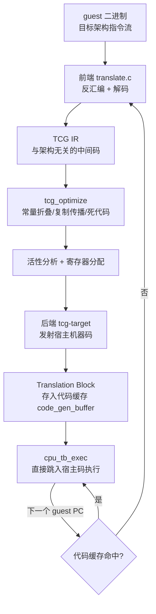
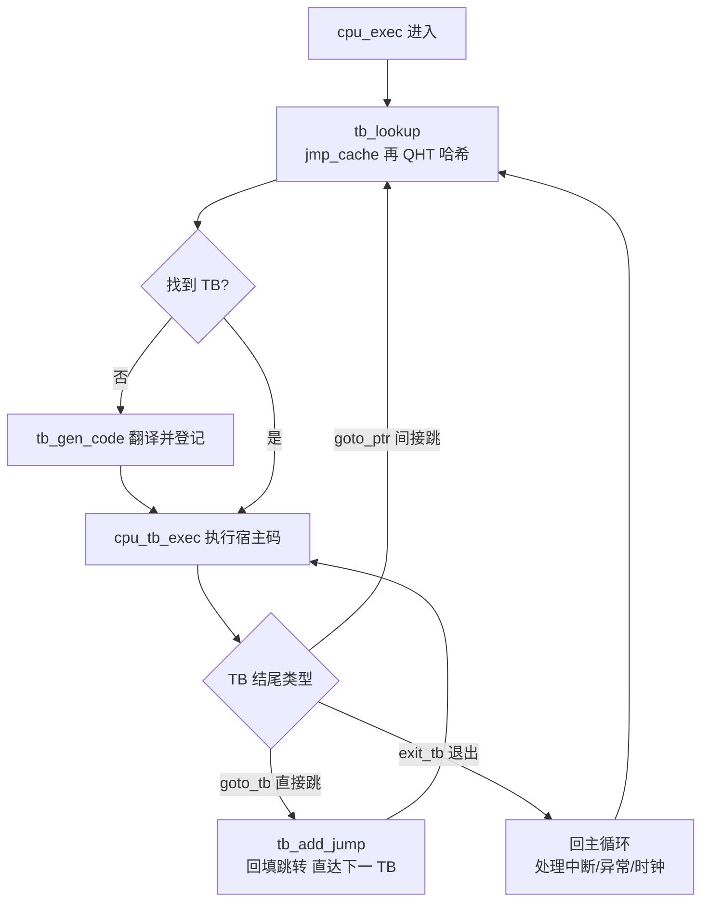
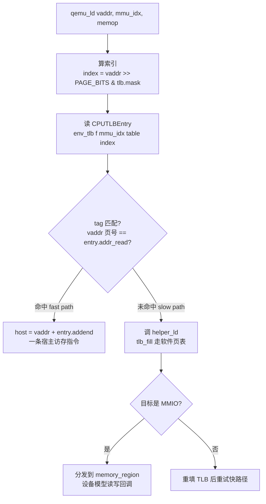

# 动态插桩与模拟执行引擎（8）· QEMU-TCG动态二进制翻译
> [!abstract] TL;DR
> - QEMU 用 **TCG（Tiny Code Generator）** 把 guest 指令翻译成宿主机器码，核心是一条**前端反汇编 → 架构无关的 TCG IR → 后端宿主码**的三段式流水线，用一层 IR 解开「N 种 guest × M 种 host」的组合爆炸。
> - 翻译单元是 **Translation Block（TB）**，遇分支/跨页/超长即结束；翻译一次、缓存复用，再用 **直接块链接（goto_tb 回填）** 把相邻 TB 缝合成链，绕开调度循环，这才是 TCG 快过纯解释器的根因。
> - TCG IR 由 **temp（global/local/EBB/const）** 与一组 RISC 化 op 构成；中端做常量折叠/复制传播/死代码，后端做**在线活性分析 + 贪心本地寄存器分配**，牺牲代码质量换编译速度——它是 JIT，翻译时间本身计入开销。
> - 系统态访存走 **softmmu 软件 TLB**：内联快路径（算索引、比 tag、`host = vaddr + addend`），未命中落 helper 慢路径重填/分发 MMIO；复杂指令、浮点（softfloat）、系统语义交给 **helper 辅助函数**，x86 标志位用 **CC_OP/CC_SRC/CC_DST 惰性求值**。
> - 逆向视角：`-d in_asm,op,op_opt,out_asm,exec` 能逐层 dump 翻译中间态，**TCG plugins** 可在翻译期插桩做覆盖率/trace/访存监控；**Unicorn 正是剥掉设备、只保留 TCG CPU 内核**的库化产物（下一章）。

## 概述与定位

在本系列里，第 7 篇讲清了「解释执行 vs 二进制翻译」的原理分野：解释器每条指令都重新取指-译码-派发，开销固定且高；动态二进制翻译（DBT）则把 guest 指令**一次性翻译成可直接运行的宿主码并缓存**，把译码成本摊薄到多次执行上。QEMU 的 TCG 就是这套思想在工业级、可跨架构场景下最有影响力的落地实现——本篇把镜头怼到 TCG 内部，沿着「前端反汇编 → TCG IR → 宿主码」这条主轴，把每一段拆开讲透。

要先摆正 TCG 在整张地图里的位置。前面几篇（Pin、DynamoRIO、Frida-Gum/Stalker、QBDI）都是**同 ISA 的 DBI**：guest 与 host 是同一套指令集，插桩框架把原生指令搬进代码缓存、在缝隙里插探针，本质是「原地改写并重放」。TCG 不一样，它是**异构 ISA 的全模拟翻译器**：可以在 x86-64 宿主上跑 ARM、MIPS、RISC-V、PowerPC、s390x 等几十种 guest。这个「跨架构」的诉求，决定了它的架构必须与同 ISA 的 DBI 根本不同——不能原样搬指令，必须真正「读懂再重写」。

跨架构翻译最先撞上的是**组合爆炸**：若为「每种 guest 直接生成每种 host 的代码」写一个翻译器，需要 N×M 个翻译后端。TCG 的解法是经典的编译器思路——**插一层与架构无关的中间表示（IR）**：前端只管把某种 guest 指令翻译成 TCG IR（N 个前端），后端只管把 TCG IR 翻译成某种 host 码（M 个后端），中间的优化、寄存器分配全部共享。于是复杂度从 N×M 塌缩为 N+M。这也是「Tiny Code Generator」名字的由来：它就是一个**微型的、可重定向（retargetable）的即时编译器**，只不过输入不是高级语言而是 guest 机器码。

历史上 QEMU 由 Fabrice Bellard 于 2003 年发布，最初的翻译引擎叫 **dyngen**：把每个操作写成一小段 C 函数，用 GCC 编译好，运行时把这些编译产物的机器码片段「剪切-拼接」起来。这套办法极其脆弱——它寄生于特定 GCC 版本的代码布局，编译器一升级就崩，且几乎无法做跨片段优化。2008 年前后（QEMU 0.10）TCG 取代了 dyngen，改用规整的 IR 驱动翻译，才有了今天可维护、可优化、可重定向的结构。理解这段演进很重要：TCG 的许多设计（op 的粒度、helper 的存在、惰性标志）都是对 dyngen 教训的直接回应。

定位一句话收束：**第 7 篇给你原理坐标系，本篇给你工业级样板 TCG，第 9 篇的 Unicorn 就是把 TCG 的 CPU 内核抠出来库化、供逆向与 Fuzzing 直接调用**。读懂 TCG，等于读懂了 Unicorn、qiling（rehost）乃至大量 emulation 系分析工具的地基。

## 原理与机制

先建立全局的执行模型，再逐段下钻。QEMU 运行 guest 的主干是 `cpu_exec()` 这个调度循环，它反复做四件事：**查 TB → 没有就翻译 → 执行宿主码 → 处理退出原因**。



**翻译单元：Translation Block（TB）。** TCG 不逐条翻译，而是以 TB 为单位。一个 TB 是从某个 guest PC 开始、一直翻到「控制流可能改变」为止的一段直线指令序列：遇到跳转/调用/返回/中断类指令就结束；此外还有两个强制边界——**跨页即断**（TB 不能横跨两个 guest 物理页，否则取指权限与自改代码追踪会失效）和**超长即断**（每 TB 最多 `TCG_MAX_INSNS`，即 512 条 guest 指令）。TB 近似「基本块」，但要点是：**TB 只能从它的第一条指令进入**，中途不可跳入；同一段 guest 代码若从不同入口进入，会生成不同的 TB。

**查表：两级缓存。** 拿到当前 (PC, cs_base, flags, cflags) 后，先查每 CPU 的**直接映射小缓存 `tb_jmp_cache`**（按 PC 哈希，命中即走，极快）；未命中再查**全局哈希表 QHT（QEMU Hash Table）**——QHT 是为 MTTCG 设计的近乎无锁并发哈希表，读侧不加锁。查找键为什么要带 flags/cflags？因为同一 PC 在不同 CPU 模式下（实模式/保护模式/长模式、不同特权级、是否 single-step）语义不同，必须区分缓存，否则会取错译码结果。

**翻译：tb_gen_code。** 查不到就现译。`tb_gen_code` 调 `gen_intermediate_code`，后者进入**目标架构前端**发射 TCG IR，随后中端优化、后端生成宿主码，产物写入 `code_gen_buffer`（代码缓存），并登记进两级缓存。

**执行与块链接。** `cpu_tb_exec` 把 TB 的宿主码当函数调用进去执行。关键性能机制是**直接块链接（direct block chaining）**：当一个 TB 以「到固定目标的直接跳转」结尾（TCG 的 `goto_tb` op），第一次执行时会回主循环查到目标 TB，然后 **`tb_add_jump` 把源 TB 结尾的跳转指令就地回填（patch）成直接跳向目标 TB 的宿主码地址**，之后再执行就一跳到底、完全不回调度循环。若目标不固定（如返回地址、间接跳转），用 `goto_ptr` + `tb_jmp_cache` 做快速间接派发。只有真正需要时（中断、异常、cflags 变化）才用 `exit_tb` 退回主循环。



块链接是 TCG「快」的第二根支柱（第一根是翻译缓存）：把一串基本块缝成直连的宿主码链后，一段热循环几乎就在代码缓存里原地空转，调度循环开销趋近于零。这与第 2 篇讲 DBI 的 trace/code-cache 思想同源——都是「消除派发开销」，只是 TCG 做在跨架构翻译之上。

## 翻译流水线详解：前端反汇编、TCG IR 与宿主码

这一段是全篇核心，把流水线三段各自的机制、数据结构与陷阱逐一展开。种子要点「前端反汇编 → TCG IR → 宿主码」在此穷尽。

### 前端：反汇编与 TCG 操作发射

前端在 `target/<arch>/translate.c`（如 x86 在 `target/i386/tcg/translate.c`）。它的职责是**读一条 guest 指令、解出语义、调用 `tcg_gen_*` 系列函数发射对应的 TCG op**。整个前端被一个通用驱动 `translator_loop()`（`accel/tcg/translator.c`）拉动，各架构只需实现一组回调 `TranslatorOps`：

- `init_disas_context`：初始化译码上下文（当前 PC、CPU 模式位等）。
- `tb_start`：TB 开始时的准备。
- `insn_start`：**每条指令前插一个 `insn_start` 标记**，记录此刻的 guest PC 等状态——这是后面「精确异常回填」的关键锚点。
- `translate_insn`：解码一条 guest 指令并发射 TCG op，返回下一条指令的 PC，同时判断是否该结束 TB。
- `tb_stop`：TB 收尾，发射 `exit_tb`/`goto_tb`。

「反汇编」在这里不是给人看的文本，而是**结构化译码**：拆前缀、读 ModRM/SIB（x86）或按位域拆字段（RISC 类），确定操作数、寻址方式、操作语义。现代 QEMU 大量使用 **decodetree**（`scripts/decodetree.py`）：用声明式 `.decode` 文件描述指令编码位域，工具自动生成高效译码器；ARM、RISC-V 全面采用，x86 也在逐步迁移。为什么要 decodetree？手写译码器对定长 ISA 又臭又长且易错，声明式描述让编码表成为「单一事实源」，译码器由工具保证正确与高效。

发射阶段的直觉：前端把一条 guest 指令**降解（lower）成若干条 TCG op**。以 x86-64 的 `add %rbx, %rax` 为例，前端大致发射（示意，非逐字 dump）：

```
add_i64  rax, rax, rbx          ; 主运算：guest rax = rax + rbx（rax/rbx 是映射到 env 的 global temp）
mov_i64  cc_dst, rax            ; 惰性标志：记录结果
mov_i64  cc_src, rbx            ; 记录操作数
movi_i32 cc_op, CC_OP_ADDQ      ; 记录"这是一次 64 位加法"，标志位延后按需再算
```

注意前端**没有**去实打实计算 6 个 EFLAGS 位——这是下文要讲的惰性标志设计。删掉上面代码块，用中文也能说清：一条 guest 加法被翻成「一次 IR 加法 + 三条记录标志上下文的赋值」，标志的真正计算被推迟到「真有指令读标志」时才做。

### 中端：TCG IR 的结构与优化

TCG IR 是一套 **RISC 化、SSA 味道不强但规整的三地址码**，操作对象是 **temp（临时值/虚拟寄存器）**。temp 按生命周期分四类，这是理解寄存器分配与正确性的关键：

- **Global（全局 temp）**：映射到 CPU 状态的部件，如各 guest 寄存器、`cc_op`、PC，物理上背靠 `CPUArchState`（即 `env`）里的内存槽。跨 TB 语义持久。
- **Local / TEMP_TB**：在**整个 TB 内**存活，可跨基本块边界（即跨 `brcond` 条件分支仍有效）。当一个值需要在分支之后还用到时必须用它。
- **EBB temp（TEMP_EBB，普通 temp）**：只在**当前扩展基本块**内有效，遇到分支即失效。绝大多数中间值是这类，最省。
- **Const（TEMP_CONST）**：常量，参与常量折叠。此外还有 **Fixed** 类，如恒定持有 `env` 指针的 `TCG_AREG0`。

为什么要分生命周期？因为寄存器分配器据此决定「一个值要不要在分支处写回内存」：EBB temp 分支后就死，不必回写；global/local 跨分支存活，分支边界必须同步到内存槽。分错级别会导致**跨分支取到过期值**——这是写前端时最经典的坑（该用 local 却用了普通 temp）。

op 集合覆盖：算术（add/sub/mul/div/neg）、逻辑（and/or/xor/not）、移位旋转（shl/shr/sar/rotl/rotr）、比较与选择（`brcond` 条件跳、`setcond` 置位、`movcond` 条件传送）、位域（deposit/extract/sextract）、字节序（bswap）、符号/零扩展（ext8s/ext16u…）、访存（`ld/st` 读写 env，`qemu_ld/qemu_st` 读写 guest 内存）、控制（`goto_tb`/`exit_tb`/`goto_ptr`/`call`）、屏障与原子（`mb`/`atomic_cmpxchg` 等），以及向量 `*_vec`。每个标量 op 有 32 位与 64 位两版（`_i32`/`_i64`）。

中端优化在 `tcg/optimize.c` 的 `tcg_optimize()`：**常量传播与折叠**（编译期能算出的就算出）、**复制传播**（`mov` 链缩短）、**代数化简**（`x+0`、`x*1`、`x&0` 等）、以及基于 **z_mask（已知零位掩码）** 的推理来消除冗余的扩展/掩码操作。随后 `tcg.c` 里做**活性分析（liveness）**：反向扫描 op 列表，标记每个 temp 的「最后一次使用」，把只写不读的 op 判为死代码删除，并为寄存器分配算出每个操作数的 sync（是否需回写）/death（用完即死）标志，还包含对 global 的「间接活性」分析（跨调用点哪些 global 必须落内存）。

这里有个贯穿性的设计哲学：**TCG 是 JIT，翻译时间本身是运行时开销**。所以它的优化是「便宜且高收益」的那几样，绝不做图着色、循环变换这类重量级 pass。它宁可生成质量一般（较原生慢约 2–10 倍，视负载）的码，也要保证翻译飞快——因为很多 TB 只执行几次，编译成本必须极低才划算。这也是它和「LLVM 当后端」路线（如 HQEMU）的根本分野：后者代码更优但编译慢得多，只在超热代码上才回本。

### 后端：活性分析、寄存器分配与宿主码发射

后端在 `tcg/<host>/tcg-target.c.inc`（如 `tcg/i386/`）。`tcg_gen_code()` 逐条遍历（已优化的）op 列表，对每条 op：先按活性信息做**在线的贪心本地寄存器分配**——需要的操作数不在寄存器就 `temp_load` 载入，寄存器不够就按「最久未用/已同步优先」挑一个牺牲者 `temp_sync` 写回内存再复用；然后调用后端的 `tcg_out_op` 把该 TCG op **发射成一条或多条宿主指令**写进代码缓存。

寄存器分配为何是「本地贪心」而非全局最优？还是那句：编译速度优先。本地分配单遍扫描即可完成，代价是跨基本块边界处 global 必须同步回 `env` 内存（分支边界丢寄存器上下文），生成的码有较多 load/store。这是 TCG 有意接受的质量-速度折中。

宿主码不是裸函数，外面裹着一次性生成的 **prologue/epilogue**（`tcg_prologue_init` / `tcg_target_qemu_prologue`）：进入 TB 前保存宿主 callee-saved 寄存器、把 `env` 指针载入固定寄存器 `TCG_AREG0`（x86-64 上常是 `%rbp`/`%r14`），退出时恢复。`cpu_tb_exec` 通过 `tcg_qemu_tb_exec` 跳进 prologue、再进 TB 宿主码；TB 以 `exit_tb` 返回一个编码值（可携带 `tb | 退出槽位` 信息，供块链接判断从哪个出口离开）。

承接前端的 `add %rbx,%rax`：`add_i64 rax,rax,rbx` 若两个 guest 寄存器都被分配到了宿主寄存器，后端就发射一条宿主 `add`；若还在 `env` 内存槽里，则发射「load rax、load rbx、add、store rax」。**同一条 IR，宿主码形态取决于此刻的寄存器分配状态**——这就是删掉代码也讲得清的机制本质。

### softmmu：guest 访存的快路径与慢路径

`qemu_ld/qemu_st` 是 guest 访存 op，它的实现分**用户态**与**系统态**两条截然不同的路：

- **用户态（linux-user，如 `qemu-x86_64 ./a.out`）**：QEMU 把 guest 内存以 `guest_base` 偏移直接映射进宿主地址空间，访存基本是「宿主访存 + 偏移」（`g2h`），配合 `page_check_range` 校验权限。它只翻译单个 guest 进程，把 guest 系统调用**翻译转发**给宿主内核，没有完整 MMU。
- **系统态（qemu-system-*，整机）**：必须模拟 MMU、分页与 MMIO，于是走 **softmmu 软件 TLB**。

softmmu 是系统模拟性能的命门。TCG 为每次 `qemu_ld/st` 发射**内联快路径 + 外联慢路径**：



快路径的机制（不看代码也能懂）：guest 虚拟地址按页号取低位当**索引**，去软件 TLB 表里取一项；把该项里预存的**标签**与当前地址页号比对——一致就是命中，此时 `host = vaddr + addend`（`addend` 是「guest 虚址加它就等于宿主实址」的预算好偏移），一条宿主指令就完成访存。未命中落慢路径 `helper_ld`：走软件页表 `tlb_fill` 填 TLB；若地址落在设备寄存器区间（MMIO），则分发到对应 `memory_region` 的读写回调，由设备模型模拟外设行为（这部分是第 10 篇「全系统模拟与外设建模」的主题）。慢路径 helper 需要拿到「出错时的宿主返回地址」用于精确异常回填——这就接到下一小节。

现代 QEMU（5.x 起）把 TLB 重构为 `CPUTLBDescFast`，带 `mask` 与 `table` 指针支持**动态 TLB 尺寸**：命中率低的负载自动扩容 TLB，减少慢路径次数。访存的字节序、宽度、对齐等由 `MemOp` 标志（`MO_LE/MO_BE/MO_UB/MO_UW/…`）编码进 op。

### 辅助函数与惰性标志位

不是所有语义都适合摊成一堆 TCG op。**helper 辅助函数**是从生成码里 `call` 出去的普通 C 函数，用 `DEF_HELPER_*` 宏声明、`tcg_gen_helper*` 调用。三类东西必用 helper：其一，**过于复杂**、展成 op 会爆炸的指令（浮点、特殊系统指令、部分 SIMD）；其二，**需要触碰 QEMU 内部**的操作（中断、TLB 刷新、MMIO、I/O）；其三，**软件仿真的子系统**，最典型是**浮点走 softfloat 库**——为了跨宿主的**位级可复现**，QEMU 不直接用宿主 FPU，而用软件实现的 IEEE-754，代价是慢，收益是确定性。helper 有函数调用开销，所以是「正确性/复杂度」与「速度」的折中：热路径尽量用原生 op，边角语义甩给 helper。

**惰性标志位（lazy condition codes）** 是前端一个精彩的优化，以 x86 EFLAGS 为例。x86 几乎每条算术指令都影响 6 个标志位，若每条都实打实算全部标志，开销巨大且大多数结果根本没人读。QEMU 的做法：只存**三元组** `cc_op`（刚做了什么操作，如 `CC_OP_ADDQ`）、`cc_src`、`cc_dst`（操作数/结果），**把标志的真正计算推迟**到真有指令去读标志（如 `jz`、`setcc`、`pushf`）时，才由 helper 依据 `cc_op` 从 `cc_src/cc_dst` 反算出需要的那几位。绝大多数情形下，紧随其后的分支只需要个别标志，甚至编译器能证明该次标志无人使用而整组省掉。ARM 的 NZCV、其他架构的条件码也有类似惰性策略。这类设计是「只为被观测的状态付费」的典范。

### 精确异常与状态回填

翻译+优化会打乱、合并 guest 指令的边界，可一旦 guest 指令触发**故障**（缺页、非法指令、除零），QEMU 必须能还原出**精确的 guest 架构状态**（正确的 PC 和寄存器），否则 guest OS 的异常处理会错乱。机制是：每个 TB 生成时，把**宿主码偏移 → guest PC 及关键 CPU 状态**的映射作为「搜索数据」压缩追加在 TB 尾部（正是前端 `insn_start` 标记喂的料）。出错时 `cpu_restore_state` 拿宿主故障返回地址去这张表里二分查找，反解出「当时正在执行哪条 guest 指令」，据此重建精确状态。这解释了为什么慢路径 helper 都要层层传 `retaddr`：它是回填的锚。**自改代码（SMC）** 也靠类似的页追踪：系统态把含已翻译代码的 guest 页在 TLB 里标记只读，写入触发保护故障，`tb_invalidate_phys_page` 作废受影响 TB；连「TB 写到自己所在页」这种自我作废也要特判。代码缓存满了则 `tb_flush` **整体清空**（而非精细淘汰）——因为 TB 之间被块链接交叉引用，追踪单个依赖去做部分驱逐太贵，全清反而简单可靠。

## 工具视角与实战

理论落到手上，最有价值的是 QEMU 自带的**分层可观测性**——可以把上面每一段流水线的中间态直接 dump 出来。核心是 `-d` 调试标志（配合 `-D file.log` 落盘、`-accel tcg` 强制走 TCG）：

- `-d in_asm`：dump 每个 TB 的 **guest 反汇编**（翻译的输入）。
- `-d op`：dump **优化前的 TCG IR**（前端刚发射的 op 列表）。
- `-d op_opt`：dump **优化后的 TCG IR**（看常量折叠/死代码干掉了什么）。
- `-d out_asm`：dump **生成的宿主机器码**（翻译的输出）。
- `-d exec`：dump **TB 的执行流**（进入了哪些 TB，观察块链接效果）。
- `-d cpu`：每个 TB 后 dump CPU 寄存器；`-d int` dump 中断/异常。

一条把「in_asm → op → op_opt → out_asm」四层对齐看的命令，等于把本篇流水线现场演一遍：

```bash
# 用户态：翻译一个 ARM 程序，逐层 dump 翻译中间态到日志
qemu-arm -d in_asm,op,op_opt,out_asm -D trans.log ./target-arm-binary
# 系统态：整机，观察 TB 执行与中断，单步便于对齐
qemu-system-aarch64 -accel tcg -d exec,int,cpu -D sys.log -singlestep ...
```

`-singlestep`（新版 `-one-insn-per-tb`）强制**每 TB 只放一条 guest 指令**，虽然慢，但让 dump 与单条指令一一对应，调试翻译问题时几乎必开。

**TCG plugins** 是把 TCG 变成插桩平台的官方机制（`include/qemu/qemu-plugin.h`，示例在 `contrib/plugins/` 与 `tests/plugin/`），也是本篇与整个系列「DBI/插桩」主题的正面交汇点。插件是动态库，`-plugin ./libxxx.so` 加载，在**翻译期**注册回调，QEMU 会在生成 TB 时把调用你回调的 TCG op（或内联的自增 op）织进宿主码：

- `qemu_plugin_register_vcpu_tb_trans_cb`：每翻译一个 TB 触发，可遍历其中指令、逐条注册执行回调。
- `qemu_plugin_register_vcpu_insn_exec_cb`：某条 guest 指令执行时回调——**覆盖率、指令 trace** 的基石。
- `qemu_plugin_register_vcpu_mem_cb`：访存时回调，拿到地址/大小/读写——**污点分析、内存 trace** 的入口。

这正是第 12 篇「插桩驱动的分析：覆盖率/污点/trace」和第 49 库「Fuzzing」的底层来源：`libafl_qemu`、AFL++ 的 qemu-mode 就是在 TCG 翻译期插入覆盖率反馈（对每个 TB/边缘打点写共享内存 bitmap），让模糊测试对「无源码的异构 binary」也能做覆盖引导。相比同 ISA 的 Pin/DynamoRIO 插桩，TCG plugin 的独特价值是**天然跨架构**——你在 x86 机器上就能给 ARM/MIPS 固件做覆盖率与 trace。

对逆向工程师，TCG 的直接用途：**在本机跑异构架构的可执行文件与固件**（`qemu-mips ./router_bin`、`qemu-system-arm` 起整机跑 IoT 固件，呼应第 39 库与本系列第 11 篇 Qiling/HALucinator 的 rehost）；**全指令级 trace** 做算法还原、脱壳（`-d in_asm,exec` 观察解密后跳转到的 OEP）；**与污点/符号执行结合**定位漏洞。而下一章的主角 **Unicorn Engine 就是把 QEMU 的 TCG CPU 内核抠出来、剥掉设备与 BIOS、包成 `uc_emu_start()` 这样的库 API**——你在 Unicorn 里设置 hook、读写寄存器内存，底层跑的正是本篇的 TB 翻译与代码缓存。本篇的每一个概念（TB、block chaining、softmmu、helper）都会在第 9 篇以「库调用」的形态复现。

## 安全性与正确使用

**TCG 本身不是安全边界，别把它当沙箱。** 尤其**用户态 QEMU 与宿主共享文件系统与系统调用**：`qemu-user` 把 guest 的 `open/execve/socket` 直接转发给宿主内核，恶意 guest 程序完全可能借此读写宿主文件、发起网络、乃至利用 QEMU 自身的转换漏洞逃逸。历史上 QEMU 的 CVE 大量集中在**设备模型**（网卡、显卡、块设备的 DMA/越界），但 TCG 翻译层与 softmmu 也出过内存破坏类问题。要真正隔离，必须外加机制：系统态整机模拟（有独立 guest 内核与地址空间）、seccomp 过滤、容器/命名空间、`chroot`，绝不能只靠「反正跑在模拟器里」这种错觉。分析**不可信样本**时，务必在隔离环境（断网、只读挂载、快照可回滚的虚机）里跑 QEMU，而不是在工作机上直接 `qemu-user` 一个来路不明的 binary。

**正确性即安全的另一面——保真度有其边界，用错会得出错误结论。** 几处必须心里有数：其一，**惰性标志与优化**在极端边角可能与真实硬件有出入，做依赖精确标志/异常时序的分析要用 `-singlestep` 交叉验证。其二，**浮点走 softfloat**，虽力求位级一致，但与特定硬件 FPU 的非规格化数、异常标志细节仍可能有差，数值敏感场景需留意。其三，**内存序与原子性**：单线程 TCG 顺序执行几乎不暴露并发 bug，但 **MTTCG（多线程 TCG）** 下各 guest CPU 跑在独立宿主线程，需要 `mb` 屏障 op 与 `atomic_cmpxchg`/独占区（LDREX/STREX 的 `start_exclusive`）正确建模——分析并发相关缺陷时，单线程模拟可能「掩盖」真实竞态。其四，**SMC/自改代码**若追踪失效会执行到过期翻译，脱壳/加壳样本分析要确认 SMC 失效逻辑生效。其五，TCG **不是时钟/缓存精确**的：不建模流水线、cache、TLB 时延，任何基于**指令计数以外**的时间侧信道分析都不可信（需要确定性可用 `icount` 指令计数模式，配合 record/replay）。

**反模拟对抗要有预期（详见第 14 篇）。** 恶意样本可用多种手段探测「我在 QEMU 里」：不常见/新指令的未实现或行为差异、RDTSC 等时间源的非真实步进、`CPUID`/型号寄存器、页表与设备指纹、乃至故意制造 softfloat 边角差异。正确姿势是把 QEMU 当**可观测但可被识破**的环境：需要对抗时叠加补丁（伪造 CPUID/时间）、结合硬件辅助虚拟化或裸机执行做交叉印证，而非假设模拟结果就是真机结果。

**插桩要节制与可信。** TCG plugin/qemu-mode 在翻译期改写生成码，写得不对会污染代码缓存、产生难查的偶发错误；覆盖率打点等要保证不改变 guest 可见语义。加载第三方 plugin 等同在你的 QEMU 进程里跑任意本地代码，来源要可信。总之：**把 TCG 当强大的分析/仿真工具，而非隔离保证；用它得出的结论要清楚其保真度边界，涉及不可信代码时另加真正的隔离层。**

## 小结

本篇沿「前端反汇编 → TCG IR → 宿主码」把 QEMU-TCG 拆到了底。核心心智模型是**三段式可重定向 JIT + 翻译缓存 + 块链接**：前端（`translate.c` + decodetree）把某种 guest 指令降解为架构无关的 TCG IR，中端（`tcg_optimize` + 活性分析）做便宜高收益的优化，后端（`tcg-target`）在线分配寄存器并发射宿主码；产物以 **TB** 为单位缓存，用 **goto_tb 回填** 缝成直连链，把派发开销压到近零。围绕主轴的四个关键子系统——**softmmu 软件 TLB（快/慢路径）**、**helper 辅助函数（含 softfloat）**、**惰性标志位**、**精确异常状态回填**——共同支撑了「又快又对又跨架构」。设计哲学一以贯之：**它是 JIT，编译时间即开销，故处处以速度换代码质量**，这也是它区别于 LLVM 后端路线、区别于同 ISA DBI（Pin/DynamoRIO/Frida）的根因。工具面，`-d in_asm,op,op_opt,out_asm,exec` 让流水线每层可见，**TCG plugins** 把它变成跨架构插桩平台，直接喂给覆盖率、trace、污点与 Fuzzing。下一章的 Unicorn，就是这台引擎的库化身。

## 相关阅读

- 系列上一篇（原理对照）：[[07.CPU模拟原理：解释与二进制翻译|CPU模拟原理：解释与二进制翻译]]
- 系列下一篇（TCG 的库化）：[[09.Unicorn-Engine与CPU模拟实战|Unicorn-Engine与CPU模拟实战]]
- 全系统与外设：[[10.全系统模拟与外设建模|全系统模拟与外设建模]]（softmmu 慢路径分发的 MMIO/设备模型）
- 固件 rehost 呼应：[[39.固件与IoT嵌入式逆向/23.固件仿真进阶Qiling与HALucinator|固件仿真进阶：Qiling 与 HALucinator]]
- 下游应用（插桩驱动）：[[12.插桩驱动的分析：覆盖率与污点与trace|插桩驱动的分析：覆盖率与污点与trace]]、[[49.Fuzzing与漏洞挖掘/00.Fuzzing与漏洞挖掘总览|Fuzzing 与漏洞挖掘总览]]
- 静态对偶（反汇编算法）：[[45.反编译器与反汇编引擎原理/01.反汇编算法：线性扫描与递归遍历|反汇编算法：线性扫描与递归遍历]]
- Hook 用法承接：[[32.hooks/09-frida|Frida 用法]] 到本系列 [[05.Frida-Gum与Stalker内部机制|Frida-Gum 与 Stalker 内部机制]]
- 官方资料：QEMU 文档 `docs/devel/tcg.rst`、`docs/devel/decodetree.rst`、`docs/devel/multi-thread-tcg.rst`、`docs/devel/tcg-plugins.rst`；源码 `tcg/README`、`accel/tcg/`、`target/<arch>/`

[[00.动态插桩与模拟执行引擎总览|⬆ 系列总览]] | [[07.CPU模拟原理：解释与二进制翻译|← 上一章]] | [[09.Unicorn-Engine与CPU模拟实战|→ 下一章]]
