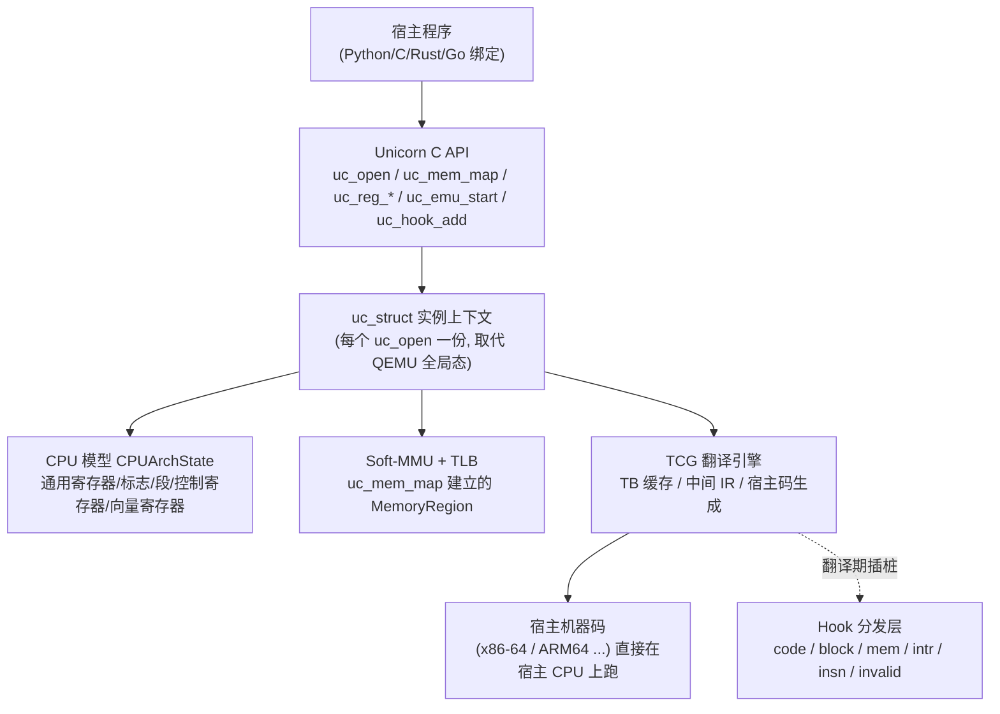
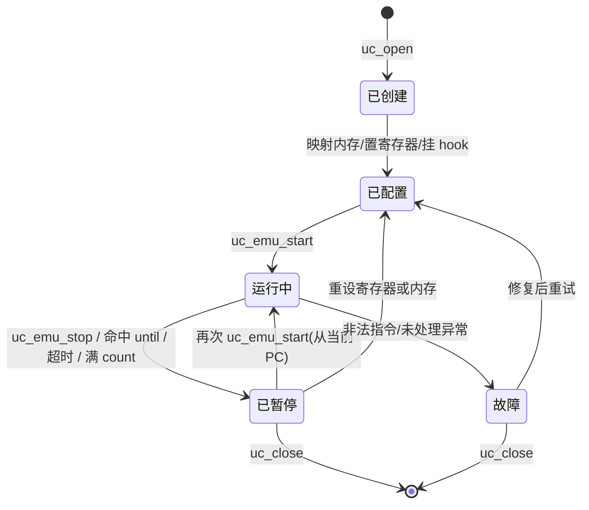
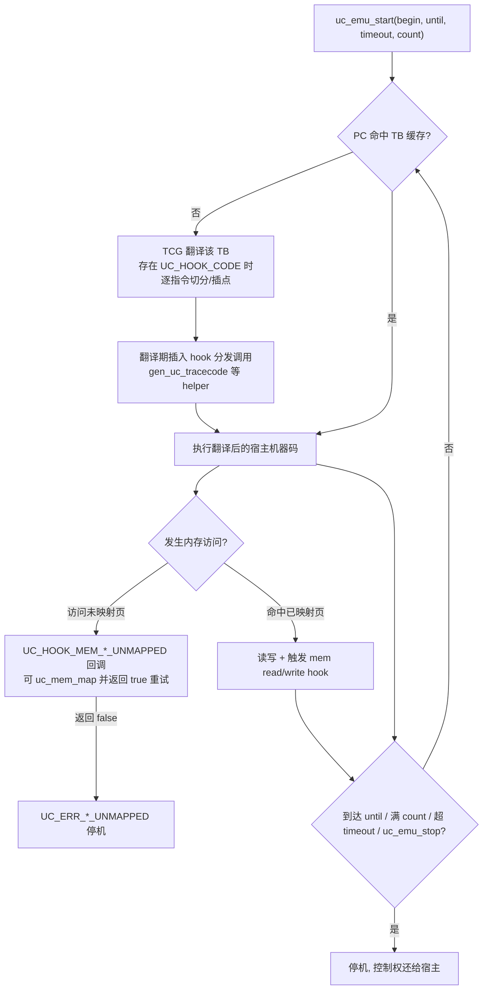

# 动态插桩与模拟执行引擎（9）· Unicorn-Engine与CPU模拟实战
> [!abstract] TL;DR
> - Unicorn 是从 QEMU 的 **softmmu（全系统）分支**裁剪而来的**纯 CPU 模拟框架**：砍掉设备、BIOS、监视器与主板逻辑，只保留 TCG 翻译器 + CPU 模型 + 软 MMU，并封装为带干净 C API 的库。
> - 它最硬核的工程改造不是"删代码"，而是**把 QEMU 遍布全局变量的状态下沉进 `uc_struct` 实例上下文**，从而在一个进程里同时跑多个互不干扰的模拟实例——这是 QEMU 本身做不到的。
> - Hook 在**翻译期注入**：block/code hook 靠在 TCG 代码生成阶段插入分发调用，mem hook 挂在软 MMU 访问路径上；`UC_HOOK_CODE` 因逐指令插桩摊薄了 JIT 批量优势而显著慢于 `UC_HOOK_BLOCK`。
> - 寄存器读写映射到 `CPUArchState` 字段，内存靠 `uc_mem_map` 在软 MMU 里建区、访问未映射页会回调 hook（可惰性补页并返回 true 重试），`uc_context_save/restore` 提供快照以支撑 fuzz 快速复位。
> - Unicorn 不带任何操作系统语义：syscall/中断要靠 `UC_HOOK_INTR` 自己接管；这既是它"轻"的根源，也是 Qiling 这类上层框架存在的理由。
> - 模拟天然比原生执行安全（无真实系统调用/外设），但**不等于绝对沙箱**：反模拟可探测未实现指令、时序与缺失的 OS 结构，宿主侧 hook 桥接与 JIT 缺陷仍是攻击面。

## 概述与定位

Unicorn-Engine 是 Nguyen Anh Quynh 与 Dang Hoang Vu 在 2015 年 Black Hat USA 上发布的**轻量级、跨平台、跨架构 CPU 模拟框架**。它与同一作者的反汇编器 Capstone、汇编器 Keystone 组成逆向工程"三件套"——一个把字节变指令、一个把指令变字节、一个把指令真正跑起来。理解 Unicorn 的定位，关键在一句话：**它是 QEMU 的 CPU 核心被剥出来、去掉全系统包袱、再包装成库的产物**。

要说清它填补了什么空白，需要把它放到本系列的坐标系里。第 07 篇讲了 CPU 模拟的两条路线（解释执行 vs 二进制翻译），第 08 篇深入了 QEMU 的 TCG（Tiny Code Generator）动态二进制翻译。QEMU 本身是一个**面向"跑虚拟机"**的全系统模拟器：它要模拟主板芯片组、中断控制器、磁盘网卡、BIOS/UEFI 固件，最终目标是把一整个操作系统引导起来。这对分析场景往往是负担——逆向工程师通常只想把**一段 shellcode、一个被混淆的解密函数、一段固件里的私有算法**精确地跑起来，并在每条指令、每次内存访问上装探针，而不想先花几百毫秒引导一个内核。更致命的是，QEMU 是一个**单实例、以全局变量为中心**的庞然大物，根本无法当作库嵌进你的分析程序、更无法在一个进程里开多份并行跑。

Unicorn 的洞见正是：QEMU 里真正有复用价值的，是 **TCG 翻译引擎 + 各架构 CPU 模型 + 软 MMU 内存子系统**这三块；把它们抽出来、去全局化、配上一套简洁 API（`uc_open` / `uc_mem_map` / `uc_reg_write` / `uc_emu_start` / `uc_hook_add`），就得到一个"给我一段字节和一个入口地址，我从任意 CPU 状态开始精确执行任意条数指令并让你随时介入"的引擎。它支持 x86/x86-64、ARM/ARM64（AArch64）、MIPS、SPARC、M68K，2.x 起又加入 RISC-V、PowerPC、S390X、TriCore 等。

它的典型用武之地：**恶意代码与 shellcode 分析**（安全地跑起来看行为而不感染宿主）、**去混淆/反混淆**（跑虚拟机保护的字节码解释器、跑 OLLVM 的不透明谓词、脱壳时执行解密 stub）、**Fuzzing**（unicornafl 把 AFL++ 接到 Unicorn 上做覆盖引导模糊测试，专打无法整程序运行的固件片段）、**符号执行加速**（angr 用 Unicorn 做"具体执行引擎"，在无需符号推理的区段直接原生翻译跑，绕开慢速的 SimProcedure）、以及 **CTF 逆向**（一键跑通题目里那段自定义 VM）。一句话概括边界：**QEMU 关心"把系统跑起来"，Unicorn 只关心"把 CPU 跑起来"，剩下的世界（OS、外设、固件）交给你用 hook 去补。**

## 原理与机制

先建立整体心智模型：一次 Unicorn 模拟的生命周期，是"建实例 → 铺内存 → 置寄存器 → 挂 hook → 启动执行 → 在 hook 里介入 → 停机取结果"。



从状态机视角看，一个实例在其生命周期里的迁移如下——注意"已暂停"可以再次 `uc_emu_start` 从当前 PC 续跑，这正是分段模拟与断点式介入的基础：



**从 QEMU 到 Unicorn 的裁剪逻辑。** Unicorn 基于 QEMU 的 **softmmu（system）构建**而非 linux-user 构建，这个选择很关键：softmmu 自带完整的软件 MMU 与页级 TLB，因此 Unicorn 天然支持任意虚拟地址布局、页级权限、以及缺页回调；而 linux-user 用的是"guest_base 固定偏移"映射，虽快却没法让你把内存映射到任意猜测的地址、也没有独立的页权限模型。代价是软 MMU 每次访存都要过一层 TLB 查找，比裸偏移略慢，但换来了分析所需的灵活性。裁掉的部分则一目了然：所有 `hw/` 下的设备模型、机器类型（machine）、固件加载、QEMU 监视器、字符/块/网络后端、迁移与快照子系统统统不要。留下的骨架是"取指 → 翻译 → 执行 → 访存"这条主循环。

**API 模型：一切围绕实例句柄。** `uc_open(UC_ARCH_X86, UC_MODE_64, &uc)` 返回一个 `uc_engine*` 句柄，之后所有操作都以它为第一参数。内存靠 `uc_mem_map(uc, addr, size, perms)` 按页建区（地址与大小需 4KB 对齐），`uc_mem_write/read` 灌入或读回字节。寄存器靠 `uc_reg_write/read`（还有批量版 `uc_reg_write_batch`）。执行靠 `uc_emu_start(uc, begin, until, timeout, count)`：从 `begin` 开始翻译执行，当 PC 到达 `until` 或跑满 `count` 条指令或超过 `timeout` 微秒时停机——**这四个终止条件的组合是初学者最容易踩坑的地方**（后文详述）。

**内存模型：软 MMU 上的按需世界。** Unicorn 的内存不是一块连续 buffer，而是软 MMU 里一组 `MemoryRegion`。访问已映射区正常读写（并触发 mem hook）；访问**未映射地址**会抛出缺页，暴露为 `UC_HOOK_MEM_*_UNMAPPED` 回调——回调里你可以现场 `uc_mem_map` 补上这一页并**返回 true 让引擎重试该次访问**，从而实现"惰性建内存"；若返回 false，则模拟以 `UC_ERR_READ_UNMAPPED` 之类的错误停机。此外 `uc_mem_protect` 可改页权限，`uc_mem_map_ptr` 能把**宿主进程的一块内存直接映射进 guest**（零拷贝共享，常用于把大文件或与宿主通信的缓冲区喂进去），2.x 的 `uc_mmio_map` 则把一段地址变成"读写即回调"的 MMIO 区，用来模拟寄存器映射外设。

**寄存器模型：CPUArchState 的字段视图。** 每个架构的寄存器堆是一个 `CPUArchState` 结构体（x86 是 `CPUX86State`，里面有 `regs[16]`、`eip`、`eflags`、段寄存器、`cr[]`、`xmm_regs[]` 等）。`uc_reg_write(uc, UC_X86_REG_RAX, &v)` 本质是把值写进该结构体对应字段，读同理。别名寄存器（AL/AX/EAX/RAX 指向同一存储的不同宽度）由绑定层做位宽裁剪。

**Hook 模型：翻译期注入的探针。** 这是 Unicorn 作为"插桩引擎"而不只是"模拟器"的核心。它提供多档粒度：`UC_HOOK_BLOCK`（每个基本块/TB 入口）、`UC_HOOK_CODE`（每条指令）、`UC_HOOK_MEM_READ/WRITE/FETCH`（访存）、`UC_HOOK_MEM_*_UNMAPPED/PROT`（非法访存）、`UC_HOOK_INTR`（中断/syscall）、`UC_HOOK_INSN`（特定指令如 x86 的 `SYSCALL`/`CPUID`/`IN`/`OUT`）、`UC_HOOK_INSN_INVALID`（非法指令）。这些回调如何被"织"进翻译后的宿主码里，正是下一段深挖的对象。

## QEMU 裁剪、去全局化与 TCG 集成详解

这一节把 Unicorn 之所以能存在的三件核心工程——**去全局化、TCG 复用与 Hook 织入、软 MMU 与寄存器桥接**——拆开讲透。删掉本节所有代码块，中文仍应能独立讲清每个机制。

### 去全局化：从"一个进程一个 VM"到"一个进程 N 个实例"

QEMU 诞生时的假设是"这个进程就是这台虚拟机"，因此它把海量状态放进**全局变量**：TCG 上下文、TB 缓存、CPU 列表、内存区表、翻译缓冲区……全是文件级 `static` 或全局符号。这在跑一台 VM 时毫无问题，但对分析工具是灾难：你没法在一个进程里开两份互不干扰的模拟（并行 fuzz 上千个实例）、没法把它当纯函数库反复调用、甚至没法在同一进程里同时模拟 x86 和 ARM。

Unicorn 最大的改造，是把这些全局状态**下沉进一个 `uc_struct`（即 `uc_engine`）实例上下文**。概念上，原来散落各处的全局符号，现在都成了 `uc_struct` 的字段，代码里通过宏或指针间接引用"当前实例的那一份"。这样每次 `uc_open` 就得到一份独立世界，`uc_close` 干净回收。

```
uc_struct (每个 uc_open 实例一份, 概念示意)
├── arch / mode                 // UC_ARCH_X86, UC_MODE_64 / UC_MODE_THUMB ...
├── CPUState *cpu               // QEMU 的 CPU 对象
│   └── CPUArchState env        // 寄存器堆: rax..r15, rip, eflags, seg, cr, xmm ...
├── TCGContext *tcg_ctx         // 翻译上下文 (原为 QEMU 全局, 现下沉到实例)
├── tb_ctx                      // TB(翻译块) 缓存哈希表
├── hook[UC_HOOK_MAX]           // 各类 hook 链表 (按 begin/end 区间过滤)
├── mapped_blocks[]             // uc_mem_map 建立的 MemoryRegion 列表
├── 中断号 / 退出标志 / stop_request
└── timeout / 已执行指令计数 / errno
```

**为什么这件事又难又值。** 难在 QEMU 的全局引用无处不在，纯手工改会漏且难跟上游；Unicorn 的做法是用**脚本对 QEMU 源码做半自动变换**，把全局访问统一改写成经由实例上下文的间接访问，从而既能落地又能在 2.0 时相对可控地 rebase 到新版 QEMU（1.x 基于 QEMU 2.2.1，2.0 rebase 到 QEMU 5.0.1）。值它，是因为**并行、可嵌入、多架构共存**这三项能力，正是 fuzzing 与大规模自动化分析的地基——没有去全局化，就没有 unicornafl 的 fork server、没有一进程内跑满 CPU 核的批量模拟。

### TCG 复用与 Hook 织入：探针是"翻译"出来的

Unicorn 直接复用 QEMU 的 TCG：取指后先查 TB 缓存，命中则直接跳到已生成的宿主码；未命中则把这一段 guest 指令翻译成 TCG 中间 IR、再降到宿主机器码、缓存起来。第 08 篇已详述这条链路，这里只讲 **Unicorn 独有的一层：如何把 hook 织进翻译产物**。



关键在于：**hook 不是靠"单步陷入"实现的，而是在翻译阶段就把回调调用编译进宿主码里**。对 `UC_HOOK_BLOCK`，Unicorn 在每个 TB 入口生成一次对 hook 分发 helper 的调用；对 `UC_HOOK_CODE`，它需要在**每一条 guest 指令前**都生成分发调用——为此翻译器会把 TB 切得更细（逼近一条指令一块）并逐指令插点。这就解释了一个反复被踩的性能现象：**`UC_HOOK_CODE` 远慢于 `UC_HOOK_BLOCK`**。因为逐指令插桩把 TCG 赖以提速的"批量翻译一整块、块内零开销直跑"这一优势彻底摊薄了——每条指令都要跨一次 helper 调用、保存/恢复上下文、走一遍区间过滤。这与本系列第 02 篇讲 DBI 代码缓存时的结论同源：**插桩粒度越细，越贴近单步，代码缓存的批量红利越少**。

内存 hook 走的是另一条路：它挂在**软 MMU 的访存慢路径**上。TCG 生成的访存代码先查 TLB，未命中或需要回调时落入 helper，Unicorn 在这里分发 read/write/fetch hook，以及未映射/越权时的 `UNMAPPED`/`PROT` 回调。`UC_HOOK_INTR` 则在翻译到会引发异常/中断的指令（如 `int 0x80`、`syscall`）时接管——因为 Unicorn **没有中断向量表、没有内核**，它把中断"上抛"给你的回调，由你决定这条 syscall 该怎么表现。这正是"纯 CPU 模拟"的本质体现：CPU 会执行 `syscall` 指令并进入内核态入口，但入口后面空无一物，Unicorn 只能把控制权交还宿主。

### 软 MMU、寄存器桥接与快照

**软 MMU 的取舍。** 前面说过 Unicorn 选 softmmu 分支，因此拥有页级 TLB。默认情况下，你 `uc_mem_map` 建立的区就是 guest 能直接寻址的空间（相当于"物理即虚拟"的平坦映射）；若你在 guest 里真正配置了分页（比如 x86 置 `CR0.PG`、填好页表），软 MMU 会去走页表翻译。Unicorn 2.x 还引入 `uc_ctl` 的 **TLB 模式**开关：`UC_TLB_CPU` 用被模拟 CPU 的真实 MMU 语义做地址翻译，`UC_TLB_VIRTUAL` 让 Unicorn 维护一层可被 hook 的虚拟 TLB（你能拦截 TLB 填充、自定义 VA→PA），这对模拟带 MMU 的固件、或想接管地址翻译的场景很有用。`uc_ctl` 本身是个类似 ioctl 的控制面，还能调 CPU 型号、清 TB 缓存、设多重退出点、改页大小等，是 2.x 相对 1.x 在"可控性"上的主要增量。

**寄存器桥接。** `uc_reg_read/write` 之所以能即时生效，是因为它直接读写实例内 `CPUArchState` 的字段——不需要停机同步。唯一要注意的是**在 hook 回调里改 PC 类寄存器的语义**：多数架构下于 code hook 内改写 PC 未必如你所愿地立即改变控制流（当前指令已在翻译块中），正确做法通常是配合 `uc_emu_stop` 再从新 PC `uc_emu_start`，或用引擎提供的 skip/跳过机制。

**快照与 fuzz 复位。** `uc_context_alloc/save/restore` 提供**寄存器状态快照**：保存一份 `CPUArchState`，之后可秒级恢复。这对模糊测试至关重要——每个测试用例都要从同一初始 CPU 状态重跑，寄存器用 context 复位，内存则要么每轮重写受影响页、要么借 fork（写时复制）复位。unicornafl 正是把这套与 AFL++ 的 fork server + 覆盖位图（借 block hook 记录边）拼起来，实现对**无法整程序运行的裸函数/固件片段**的覆盖引导 fuzzing。

## 工具视角与实战

Unicorn 核心是 C 库，但绑定极广（Python、Rust、Go、Java、.NET、JS 等），实战中 **Python 绑定**最常用。下面用几个最小可用片段串起典型工作流。

**其一：把一段机器码跑起来。** 这是"hello world"级用法——建实例、映射内存、写码、置寄存器、执行、读回结果。

```python
from unicorn import *
from unicorn.x86_const import *

CODE = b"\x41\x4a"          # x86: inc ecx ; dec edx
BASE = 0x1000000

uc = Uc(UC_ARCH_X86, UC_MODE_32)     # 相当于 uc_open, 一个独立实例
uc.mem_map(BASE, 2 * 1024 * 1024)    # 映射 2MB 可读写执行内存 (默认全权限)
uc.mem_write(BASE, CODE)             # 灌入代码
uc.reg_write(UC_X86_REG_ECX, 0x1234) # 预置初始寄存器状态
uc.reg_write(UC_X86_REG_EDX, 0x7890)

uc.emu_start(BASE, BASE + len(CODE)) # 从 BASE 执行到码尾地址
print(hex(uc.reg_read(UC_X86_REG_ECX)))  # 0x1235
```

这里已经藏着两个常见陷阱。**一是忘了映射栈**：只要被跑的代码里有 `push`/`call`/`ret`，就必须另建一段栈内存并把 `ESP/RSP` 指过去，否则第一次压栈就缺页停机。**二是 `until` 的语义**：`emu_start` 在 PC **精确等于**结束地址时才正常停机；若代码里有跳转恰好越过了这个地址、或根本不会走到它，引擎就会一直跑到 `count`/`timeout`。实务里常把结束地址设为一处不会被自然执行到的哨兵地址，或干脆用 `count` 限指令数、用 code hook 里的 `uc.emu_stop()` 主动停。

**其二：挂 hook 观察与介入。** 逆向的价值几乎全在 hook 里——逐指令 trace（配合 Capstone 反汇编）、惰性补页、接管 syscall。

```python
def hook_code(uc, address, size, user_data):
    # 每条指令执行前触发; 可在此配合 Capstone 反汇编做逐指令 trace
    code = uc.mem_read(address, size)
    print(f"exec @ {address:#x} size={size} bytes={code.hex()}")

def hook_mem_unmapped(uc, access, address, size, value, user_data):
    # 惰性补页: 缺页时按需映射该页, 返回 True 让引擎重试该次访问
    page = address & ~0xFFF
    uc.mem_map(page, 0x1000)
    return True

def hook_intr(uc, intno, user_data):
    # Unicorn 不带 OS, syscall/中断必须自己接管
    if intno == 0x80:                       # Linux i386 int 0x80
        nr = uc.reg_read(UC_X86_REG_EAX)
        handle_linux_syscall(uc, nr)

uc.hook_add(UC_HOOK_CODE, hook_code)
uc.hook_add(UC_HOOK_MEM_UNMAPPED, hook_mem_unmapped)
uc.hook_add(UC_HOOK_INTR, hook_intr)
```

`hook_mem_unmapped` 返回 True 后引擎会**重试刚才失败的那次访存**，这就是"惰性建内存"的地基：你不必预先猜准 guest 会碰哪些地址，让它跑、缺哪补哪。但要警惕：对不可信样本无脑补页，等于让它随意撑爆内存，生产里应设上限。

**其三：fuzz 循环的状态复位。** 借 context 快照实现"同一初态反复重跑"。

```python
ctx = uc.context_save()                 # 快照寄存器初态
for case in corpus:
    uc.context_restore(ctx)             # 复位寄存器 (内存需另行复位)
    uc.mem_write(INPUT_ADDR, case)      # 灌入本轮输入
    try:
        uc.emu_start(START, END, timeout=1_000_000, count=100_000)
    except UcError as e:                # 捕获 UC_ERR_* 视作崩溃信号
        record_crash(case, e)
```

**生态位与上层框架。** Unicorn 只给你裸 CPU，于是催生了一批上层项目：**Qiling** 在 Unicorn 之上补齐了 OS 语义——加载 PE/ELF/Mach-O、模拟 Windows/Linux/macOS 的 syscall 与关键库、铺好 TEB/PEB/GDT，让你能"跑一个真实程序"而非一段字节；**angr** 用 Unicorn 作具体执行引擎，在无需符号推理的区段直接翻译原生跑，显著加速符号执行；**unicornafl** 接 AFL++ 做覆盖引导 fuzz。选型上的判断很清晰：只想跑一段算法/shellcode、要极致控制→直接用 Unicorn；想跑完整用户态程序、不想手写 syscall→上 Qiling；要符号分析→angr；要模糊测试固件片段→unicornafl。与"直接用 QEMU-user"相比，Unicorn 的优势是**库化、可嵌入、多实例、任意 VA 布局、逐指令可控**；劣势是**没有免费的 OS/syscall**，得自己补世界。

## 安全性与正确使用

**模拟为何比原生"安全"，以及边界在哪。** 把不可信代码丢进 Unicorn 跑，天然比在真机上执行安全得多：`syscall` 指令会执行、但落进空的内核入口被上抛给你的 hook，样本**碰不到真实文件、网络、注册表、设备**，除非你亲手在 `UC_HOOK_INTR` 里把它桥接到宿主 OS。这正是恶意代码分析、脱壳、shellcode 观测偏爱它的原因——你能"看它想干什么"而不"让它真干成"。但**"更安全"不等于"绝对沙箱"**，必须认清三条边界：

- **宿主侧攻击面依然存在。** Unicorn 是运行在你进程内的 JIT，历史上 TCG/内存管理出现过可致宿主内存破坏的缺陷；更现实的风险是**你自己的 hook 代码**：一旦用 `uc_mem_map_ptr` 把宿主内存共享给 guest、或在 syscall 桥接里把参数直接转发给真实系统调用（Qiling 的部分能力即如此），就等于重新打开了通往宿主的门。原则：**加载不可信字节的分析器，本身应跑在容器/一次性虚拟机里**。
- **资源耗尽是最易被忽视的 DoS。** 不设 `count`/`timeout` 就 `emu_start`，遇到死循环样本会永久占核；无脑响应 `UNMAPPED` 补页会被样本诱导撑爆内存。正确姿势是**永远给执行上界、给补页设配额**。
- **正确性缺陷即安全隐患。** Unicorn 继承 QEMU 的指令语义，部分冷门指令、浮点/SIMD 边角、标志位计算与真实硅片存在差异；某些指令干脆 `UC_ERR_INSN_INVALID`。这既可能让分析结论出错，也会被样本当作探测点。保持版本更新（尤其从 1.x 迁到 2.x rebase 后的 QEMU 5.0.1 基线）能吃到大量语义修复。

**反模拟对抗与加固。** 攻击者会主动探测"我是不是在 Unicorn 里"，常见手法与对策：

- **未实现/罕见指令**：执行一条真实 CPU 支持、但模拟器未覆盖的指令，若引擎报非法指令即暴露。对策是补齐或用 `UC_HOOK_INSN_INVALID` 拦截并给出合理语义。
- **CPUID / 特性位不符**：默认 CPUID 返回可能与目标环境不一致。对策是用 `UC_HOOK_INSN`（`UC_X86_INS_CPUID`）接管，返回伪装得当的特性位。
- **时序异常**：`RDTSC` 在模拟里时间推进不真实，样本可据此判定。对策是接管并返回自洽递增的时间戳。
- **缺失 OS 结构**：Windows shellcode 常走 PEB/TEB 定位模块，纯 Unicorn 里 `FS/GS base`、PEB/TEB、GDT 皆空则失败。对策是预先铺好这些结构（或直接上 Qiling）。
- **越界/canonical 探测**：读一处未映射的高地址看引擎如何反应，也是常见指纹。对策是让 `UNMAPPED` 回调按目标平台的真实内存布局给出一致行为。

一句话收束正确使用：**给执行设上界、给内存设配额、把分析器关进外层沙箱、按目标平台把 CPUID/时序/OS 结构补到"像真的"、并保持引擎更新**——Unicorn 是一把精准的手术刀，安全来自你如何持刀，而非刀自带护盾。

## 小结

Unicorn 的全部设计都可以由一句话推导：**把 QEMU 里真正有复用价值的"TCG + CPU 模型 + 软 MMU"抽出来，去全局化后包成库**。去全局化换来多实例与可嵌入，是 fuzzing 与自动化分析的地基；沿用 softmmu 换来任意 VA 布局与缺页回调；hook 在翻译期织入使插桩几乎零陷入开销，但逐指令的 `UC_HOOK_CODE` 会摊薄 TCG 的批量红利而变慢；不带任何 OS 语义使它轻巧，也把"补世界"的活留给了 `UC_HOOK_INTR` 与 Qiling 这类上层。掌握 Unicorn，本质是掌握"铺内存—置寄存器—挂 hook—控执行—取快照"这套精确控制 CPU 状态的手艺，并清醒地认识到：它给你的是一个可观测、可介入、相对安全但并非无懈可击的执行环境。下一篇转向全系统模拟与外设建模，把这里刻意砍掉的"世界"重新装回去。

## 相关阅读

- 上游翻译引擎：[[08.QEMU-TCG动态二进制翻译]]（Unicorn 复用的 TCG 与 TB 缓存内幕）
- 模拟原理奠基：[[07.CPU模拟原理：解释与二进制翻译]]（解释执行 vs 二进制翻译的取舍）
- 插桩粒度同源结论：[[02.DBI原理：代码缓存与trace]]（为何 code hook 慢于 block hook）
- Hook 用法承接：[[32.hooks/09-frida]]（Frida 的 hook 用法）与本系列 [[05.Frida-Gum与Stalker内部机制]]（Gum/Stalker 内部机制）
- 静态对偶：[[45.反编译器与反汇编引擎原理/01.反汇编算法：线性扫描与递归遍历]]（把字节变指令的静态引擎，与本篇"把指令跑起来"互补）
- 固件 rehost 场景：[[39.固件与IoT嵌入式逆向/23.固件仿真进阶Qiling与HALucinator]]、本系列 [[11.固件rehost：Qiling与HALucinator]]（在 Unicorn 之上补 OS/外设）
- 下游应用：[[49.Fuzzing与漏洞挖掘/00.Fuzzing与漏洞挖掘总览]]（unicornafl 覆盖引导 fuzz）、[[12.插桩驱动的分析：覆盖率与污点与trace]]
- 官方资源：Unicorn 官网 unicorn-engine.org 与 GitHub `unicorn-engine/unicorn`（API 文档、`uc_ctl` 说明、绑定示例）；姊妹项目 Capstone、Keystone；Black Hat USA 2015 演讲 "Unicorn: Next Generation CPU Emulator Framework"

[[00.动态插桩与模拟执行引擎总览|⬆ 系列总览]] | [[08.QEMU-TCG动态二进制翻译|← 上一章]] | [[10.全系统模拟与外设建模|→ 下一章]]
