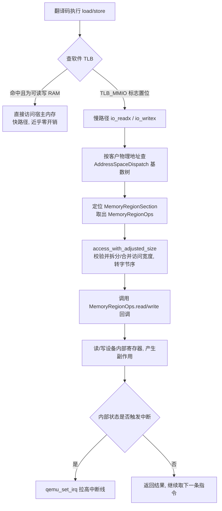

# 动态插桩与模拟执行引擎（10）· 全系统模拟与外设建模

> [!abstract] TL;DR
> - 用户态模拟（第 9 篇的 Unicorn）只需模 CPU 与内存、把系统调用转发给宿主；**全系统模拟**没有宿主内核可转发，必须自己搭出一台完整的虚拟主板：CPU 核心 + 物理地址空间 + 一堆设备模型 + 中断控制器 + 时钟。
> - **内存映射 I/O（MMIO）是全系统模拟的中枢抽象**：设备把寄存器"贴"在物理地址空间的一段区间上，客户机的普通 load/store 落到这段区间时，被分发层路由到设备的 `read/write` 回调，而不是读写真实内存。
> - QEMU 用 **MemoryRegion 树 → FlatView → 基数树分发** 表示物理地址空间；softmmu 的软件 TLB 用 `TLB_MMIO` 标志把设备访问踢到 `io_readx/io_writex` 慢路径，再按访问宽度/字节序适配后调设备回调。
> - **中断是设备反向驱动 CPU 的唯一通道**：设备用 `qemu_set_irq` 拉高一条 `qemu_irq` 线 → 中断控制器（PIC/APIC/GIC/PLIC）仲裁 → `cpu_interrupt` 置位并把 vCPU 踢出翻译块循环 → 两个 TB 之间取中断、查向量表、跳 ISR。
> - **设备模型是漏洞与保真度的双重焦点**：它跑在模拟器进程内、以模拟器权限解析客户机可控输入，是经典的虚拟机逃逸面（VENOM 等）；对逆向而言，外设寄存器语义猜不准，固件就卡在初始化过不去——这正是第 11 篇 rehost 要解决的"外设建模难题"。

## 概述与定位

在本系列里，第 7~9 篇把"如何执行一条客户机指令"讲透了：解释器、线程码、二进制翻译（TCG），以及从 QEMU 裁剪出来、只保留 CPU 与内存、靠回调 hook 驱动的 Unicorn。那套东西解决的是**用户态模拟（user-mode emulation）**：跑的是一个进程的用户态代码，一旦遇到 `syscall`/`svc`，就把它翻译成宿主操作系统的系统调用转发出去。CPU 之外的世界——文件、网络、时钟——全由宿主内核代劳，模拟器根本不用关心。

本篇跨过的这道坎，是从"模一个进程"到"模一整台机器"。**全系统模拟（full-system / system-mode emulation）**里没有"宿主内核帮你兜底"这回事：被模拟的是从上电复位向量开始、要自己带内核（或固件）的裸机。客户机执行 `in/out`、访问某个物理地址上的控制寄存器、等一个定时器中断、发起一次 DMA——这些动作背后没有真实硬件，全部得由模拟器**用软件把硬件的行为演出来**。于是问题的重心从"翻译指令"转移到了"**建模指令之外的整台机器**"：物理地址空间长什么样、哪段是 RAM 哪段是设备、设备寄存器读写有什么副作用、中断怎么送到 CPU、时间怎么流逝。

一句话给本篇定位：**第 7~9 篇造 CPU，本篇造 CPU 以外的一切，把它们拼成一块能启动的虚拟主板。** 三个种子关键词正是这块主板的三根支柱——MMIO 是 CPU 与设备对话的**地址平面**，中断是设备回敲 CPU 的**信号平面**，设备模型是把二者黏起来、承载状态与副作用的**行为平面**。

与相邻篇的边界要划清楚：

- 与第 9 篇（Unicorn）：Unicorn 给你一颗 CPU 和一块可 hook 的内存，**没有任何内建设备**；Unicorn 2 加了 `uc_mmio_map` 让你为某段地址注册读写回调，但中断控制器、定时器、总线仲裁全要你自己写。本篇讲的正是"这些你要自己搭的东西"到底是什么、成熟框架（QEMU 系统模式）又是怎么把它们做成一套可复用的对象体系。
- 与第 11 篇（Qiling/HALucinator rehost）：本篇讲**通用的全系统模拟骨架与设备建模机制**（QEMU 的 memory API、qdev、中断线）；第 11 篇讲**固件重宿主（rehosting）**这个具体场景下"外设太多、文档没有、又不想逐个精确建模"时的高层替身策略（HAL 函数替换、外设自动建模）。本篇给出"精确建模"的底盘，第 11 篇给出"糊弄过去"的捷径，二者互补。

```mermaid
flowchart TD
  subgraph GUEST[被模拟的机器 / 虚拟主板]
    CPU[CPU 核心<br/>TCG 翻译执行]
    subgraph BUS[系统总线 / 物理地址空间]
      RAM[RAM 区域<br/>直接读写宿主内存]
      ROM[ROM/Flash<br/>只读]
      UART[UART 设备<br/>MMIO 寄存器]
      TIMER[定时器<br/>MMIO + 中断输出]
      INTC[中断控制器<br/>PIC/APIC/GIC/PLIC]
    end
  end
  CPU -->|取指 / load / store| BUS
  RAM -.快路径直读.-> CPU
  UART -->|read/write 回调| DISP[内存分发层<br/>MemoryRegion 树]
  TIMER --> DISP
  DISP --> CPU
  TIMER -->|拉高 IRQ 线| INTC
  UART -->|拉高 IRQ 线| INTC
  INTC -->|注入中断| CPU
```



## 原理与机制

### 机器 = CPU + 地址空间 + 设备 + 互连

全系统模拟器的顶层对象是一台"机器（machine / board）"。在 QEMU 里，`-machine virt`、`-machine q35`、`-machine raspi3b` 各自对应一个 `MachineClass`，它的 `init` 函数负责**把这块板子搭出来**：实例化 CPU、创建 RAM、把一个个设备贴到物理地址空间的固定偏移、连好中断线、装上固件。所以运行一个全系统模拟，本质是"按某块真实（或虚构）开发板的电路图，用软件对象把它复现一遍"。这也解释了为什么全系统模拟**天然是板级绑定**的：同样一颗 ARM 核，跑在树莓派板和 `virt` 通用板上，外设地址、中断号完全不同，固件不可互换。

### MMIO：设备把寄存器贴在地址空间上

CPU 与设备沟通有两种经典方式。其一是 **端口 I/O（PIO / port-mapped I/O）**，x86 独有的一个 64K 大小、与内存平行的地址空间，用专门的 `in/out` 指令访问——历史包袱，现代设备很少再用。其二是 **内存映射 I/O（MMIO / memory-mapped I/O）**，也是现代体系结构（ARM/RISC-V 根本没有独立端口空间）的绝对主流：设备的控制/状态/数据寄存器被映射到**物理地址空间的一段区间**，CPU 用普通的 `load/store` 去读写它们，地址落在哪个区间，硬件（真实机器上是总线译码器）就把这次访问路由给对应设备。

模拟器要复刻的正是这套"地址译码 + 路由"。核心机制一句话：**为设备占用的那段物理地址区间登记一对 `read/write` 回调；当客户机访问落入该区间时，不去碰真实内存，而是调回调，让设备决定返回什么、产生什么副作用。** MMIO 与普通 RAM 的根本差别就在"副作用"：读一个状态寄存器可能会清中断标志，写一个数据寄存器可能会启动一次传输——同一个地址读两次值都可能不同。因此 MMIO 区间**必须走"慢路径"回调**，绝不能像 RAM 那样让翻译码直接访问宿主内存、更不能被缓存或乱序合并。

### 设备模型：状态 + 读写副作用 + 中断输出

"设备模型（device model）"就是把一件外设的行为封装成的软件对象，通常含三部分：**一份内部状态**（寄存器的当前值、FIFO、内部标志）、**一组 MMIO 读写处理函数**（把客户机的读写翻译成对内部状态的操作与副作用）、以及**若干中断输出线**（当内部状态满足条件——如 FIFO 非空、传输完成——就拉高，通知 CPU）。一个 UART 模型就是最小可用范例：写 `THR` 数据寄存器把字符送宿主终端；读 `RBR` 取回收到的字符并清"数据就绪"位；`LSR` 状态寄存器报告发送空/接收满；一旦接收 FIFO 有数据且中断使能，就拉高 IRQ 线。

### 中断：设备反向驱动 CPU 的唯一合法通道

MMIO 是 CPU 主动"问"设备，中断则是设备主动"敲" CPU。没有中断，模拟器里的设备就只能被动应答，无法在"客户机没主动来读"时把"数据到了""定时到了"这类异步事件送进去。中断的传递是一条链：**设备拉高一条中断线 → 中断控制器（interrupt controller）做屏蔽与优先级仲裁、把众多设备中断汇聚成 CPU 的一两根中断引脚 → CPU 在合适时机（通常是两条指令/两个翻译块之间）响应，保存现场、查中断向量表、跳到中断服务程序**。中断控制器本身也是一个设备模型（它有自己的 MMIO 寄存器供软件配置屏蔽位、读挂起状态、写 EOI），只不过它的"输出"直接连到 CPU 的中断逻辑。x86 上是 8259 PIC 与 APIC（本地 APIC + IO-APIC），ARM 上是 GIC，RISC-V 上是 PLIC/CLINT。

### DMA：设备也能读写内存

设备并不总是等 CPU 来搬数据。**DMA（直接内存访问）**让设备作为"总线主控"，绕过 CPU 自己去读写客户机 RAM——网卡收包直接写进内存、磁盘控制器直接读走扇区。模拟器里，这体现为**设备模型反过来调用"以设备视角访问地址空间"的 API** 去读写客户机内存。要注意设备看到的地址空间**未必等于 CPU 看到的**：中间可能横着一个 IOMMU 做地址翻译与隔离，所以 DMA 走的是设备自己的地址空间，而非 CPU 的系统地址空间。

### 虚拟时间与事件循环

真实硬件里定时器按晶振滴答，模拟器里没有晶振，**时间必须自己造**。模拟器维护若干"虚拟时钟"，定时器设备在虚拟时钟上挂回调，到点触发中断。虚拟时间的关键设计在于它**与客户机执行进度挂钩而非墙钟**：当模拟暂停（比如你在 gdb 里断住），虚拟时间也应停住，否则客户机一恢复就会看到一大堆"迟到"的定时器一起爆发。整台机器由一个**事件循环（event loop）**驱动：处理定时器到期、后端 I/O（网络/磁盘的就绪）、以及把这些事件安全地投递给设备模型。CPU 线程与设备之间的状态一致性，则靠一把大锁（QEMU 的 BQL / iothread mutex）保证。

## 地址空间、MMIO 分发与设备模型详解

这一段把上面的机制落到 QEMU 的具体实现——它是全系统模拟事实上的参考实现，理解它，其他框架（Unicorn 的 mmio、Renode、rust-vmm 生态）的做法都能对上号。

### 物理地址空间的表示：MemoryRegion 树 → FlatView → 基数树

QEMU 用 `MemoryRegion` 这一个对象统一描述地址空间里的每一块。它有几种"形态"：`RAM`（背后是一块真实分配的宿主内存，走快路径直读直写）、`ROM`（可读、写触发回调或被丢弃）、`MMIO / IO`（带一组 `MemoryRegionOps` 读写回调，就是设备寄存器）、`container`（本身不占实体，只作容器，用来挂子区域）、`alias`（另一块区域的别名/窗口，用来做地址重映射，如把低端 RAM 镜像到多处）。这些 MemoryRegion 组成一棵**带偏移和优先级的树**：容器里可以放多个子区域，允许重叠，`priority` 高的盖住低的——这正好建模了真实机器上"某段地址既可能是 RAM 又可能被设备窗口覆盖"的可切换译码。

树是给人看的、方便组织的，但每次访问都遍历树太慢。于是每当拓扑变化（加/删设备、改映射），QEMU 会把这棵树**拍平（flatten）成一个 `FlatView`**：一组互不重叠、按地址排序的 `FlatRange`，overlap 与 priority 在拍平时就地解决掉。再进一步，为每个 `AddressSpace`（系统内存 `address_space_memory`、x86 端口空间 `address_space_io`、以及每个会 DMA 的设备各自的地址空间）构建一个 `AddressSpaceDispatch`——用**基数树（radix tree / PhysPageMap）**把"客户物理页 → `MemoryRegionSection`"的映射做成 O(层数) 查表。运行时的每一次内存分发，查的就是这张表。

```text
MemoryRegion 树（拓扑）           FlatView（拍平、排序、去重叠）
 system[container]                0x0000_0000  RAM      512M
 ├─ ram      @0x00000000  512M    0x0800_0000  UART     0x1000
 ├─ uart     @0x08000000  4K      0x0800_1000  RTC      0x1000
 ├─ rtc      @0x08001000  4K      0x0801_0000  GIC-dist 0x10000
 └─ gic      @0x08010000  64K     ...
        │  拓扑提交时 flatten
        ▼
 AddressSpaceDispatch: 基数树  phys_page >> N ──► MemoryRegionSection
```

### 一次 MMIO 访问的慢路径：softmmu 的 TLB 与 io_writex

第 8 篇讲过 TCG 把客户机指令翻译成宿主码。全系统模式下，客户机地址是**虚拟地址**，每次 load/store 都要过 MMU 翻译，代价很高，于是 QEMU 在软件里做了一张 **软件 TLB（CPUTLBEntry）**：翻译码生成的访存先查 TLB，命中且目标是可读/可写 RAM，就直接算出宿主地址、走"快路径"内联访问，几乎零开销。

关键在于**设备访问怎么被识别出来并踢到慢路径**。填 TLB 表项时，如果目标区域不是纯 RAM（是 MMIO，或是需要脏页跟踪、watchpoint 的特殊 RAM），表项地址会被打上 `TLB_MMIO` 之类的标志位。快路径比对时发现这个标志，就知道"不能直接读内存"，转入慢路径 `io_readx / io_writex`（`accel/tcg/cputlb.c`）。慢路径顺着前面的 `AddressSpaceDispatch` 基数树，按客户物理地址找到 `MemoryRegionSection`，进而拿到那块 `MemoryRegion` 和它的 `MemoryRegionOps`，最终**调到设备的读写回调**。这条"TLB 标志 → 慢路径 → 分发 → 设备回调"的链路，就是"普通 load/store 变成设备寄存器访问"的全部魔法所在。



### 访问宽度、对齐与字节序：设备回调的隐形契约

真实设备寄存器对访问宽度是挑剔的：有的只能按 32 位整字访问，按字节访问要么无效要么行为诡异。QEMU 的 `MemoryRegionOps` 因此带了 `valid`（客户机被允许的访问宽度/对齐范围）和 `impl`（回调实际实现的访问粒度）两组约束，外加 `endianness`（`DEVICE_NATIVE_ENDIAN` / `LITTLE` / `BIG`）。分发时 `access_with_adjusted_size` 会**做宽度适配**：客户机发起一个 `valid` 允许、但比 `impl` 粒度小或大的访问，框架自动帮你拆成多次或合并，并按声明的字节序摆正字节。设备作者只要按自己"实现粒度"写回调，不用手忙脚乱处理"客户机偏要按字节读我的 32 位寄存器"这种情况。这层适配是隐形契约：写模型时若 `valid.min_access_size` 设错，就会出现"Linux 驱动明明按字节写却没反应"这类只在特定驱动下暴露的怪 bug。

此外还有两个性能相关的旁路要知道：**coalesced MMIO** 允许把一串对同一区间的写攒起来批量交付（如帧缓冲连续写），降低慢路径次数；**ioeventfd** 则是 KVM 加速下的优化——某个 MMIO 写不必陷出到用户态设备模型，而是直接触发一个 eventfd 通知，专治 virtio 的"敲门铃（doorbell）"寄存器这种高频写。纯 TCG 模拟用不到 ioeventfd，但理解它有助于看懂 QEMU 设备代码里那些 `memory_region_add_eventfd` 调用。

### 设备模型的对象化：QOM 与 qdev

QEMU 把"设备"做成了一套完整的对象系统 **QOM（QEMU Object Model）**：用 `TypeInfo` 注册类型、`type_init` 静态登记，形成"类（`ObjectClass`）—实例（`Object`）"的继承体系。设备这一层是 **qdev**：`DeviceState`（实例）/ `DeviceClass`（类），设备挂在 `BusState` 总线上，暴露可配置的**属性（property）**（对应命令行 `-device foo,bar=3`），并有一个 `realize` 方法——**"实例化"与"接线上电"分两步**：先构造对象、设属性，`realize` 时才真正建 MMIO 区域、分配中断线、连后端。这个两阶段设计是为了让属性可在 realize 前被外部（命令行、机器 init）改写。

最常见的基类是 **`SysBusDevice`**（系统总线设备），它提供 `sysbus_init_mmio`（声明本设备的 MMIO 区域）、`sysbus_init_irq`（声明输出中断线）；机器 init 里再用 `sysbus_mmio_map(dev, 0, 0x08000000)` 把这块区域**贴到物理地址空间的具体偏移**、用 `sysbus_connect_irq(dev, 0, gic_irq)` 把设备的输出线**接到中断控制器的某个输入**。设备还要实现 `reset`（QEMU 现在是三段式 Resettable 接口：enter/hold/exit，解决复位时设备间依赖顺序）与 `vmstate`（把内部状态序列化，用于快照/迁移；顺带也让"存档—回放"这类分析成为可能）。

```c
/* MMIO 读写回调 + 最小设备骨架（示意，非逐字 QEMU 源码） */
static uint64_t mydev_read(void *opaque, hwaddr off, unsigned size) {
    MyDevState *s = opaque;
    switch (off) {
    case REG_DATA:  return fifo_pop(&s->rx);      /* 读数据寄存器有副作用：弹 FIFO */
    case REG_STATUS:return s->status;             /* 读状态：报告 FIFO 空满等 */
    }
    return 0;
}
static void mydev_write(void *opaque, hwaddr off, uint64_t val, unsigned size) {
    MyDevState *s = opaque;
    if (off == REG_DATA) {
        backend_putchar(val & 0xff);              /* 写数据：真的把字节送出去 */
        if (s->int_enable)
            qemu_set_irq(s->irq, 1);              /* 满足条件则拉高中断线 */
    }
}
static const MemoryRegionOps mydev_ops = {
    .read = mydev_read, .write = mydev_write,
    .endianness = DEVICE_LITTLE_ENDIAN,
    .valid.min_access_size = 4, .valid.max_access_size = 4,   /* 只允许 32 位访问 */
};
static void mydev_realize(DeviceState *dev, Error **errp) {
    MyDevState *s = MYDEV(dev);
    memory_region_init_io(&s->mmio, OBJECT(dev), &mydev_ops, s, "mydev", 0x1000);
    sysbus_init_mmio(SYS_BUS_DEVICE(dev), &s->mmio);          /* 声明 4K MMIO 窗口 */
    sysbus_init_irq(SYS_BUS_DEVICE(dev), &s->irq);            /* 声明一条输出中断线 */
}
```

删掉这段代码，用中文也能说清：一个设备就是"一段被登记为 MMIO 的地址窗口 + 决定读写语义的两个函数 + 一根能拉高的中断线"，`realize` 负责把这三样在上电时组装出来，机器 init 负责把窗口贴到正确偏移、把中断线接到正确的控制器输入。

### 中断线的建模：qemu_irq 与中断控制器

QEMU 把一根中断线抽象成 **`qemu_irq`**（本质是个不透明句柄，内含处理函数与电平）。设备调用 `qemu_set_irq(irq, level)` 就等于"改变这条线的电平"，会触发线另一端注册的处理函数。设备用 `qdev_init_gpio_out` / `sysbus_init_irq` 声明输出 GPIO，用 `qdev_init_gpio_in` 声明输入 GPIO——中断控制器正是"输入 GPIO 一大把、输出接到 CPU"的设备。这里有个常被忽视的语义细节：**电平触发 vs 边沿触发**。电平触发要求设备在中断被处理、原因消除后**主动把线拉回低**（`qemu_set_irq(irq, 0)`），否则中断控制器会认为它一直在请求、ISR 返回后立刻再次进入，表现为"中断风暴/卡死"。这是自己手写设备模型时最容易踩的坑之一。

中断控制器把 N 路输入按屏蔽位与优先级仲裁，选出该送给 CPU 的那个，然后调用 **`cpu_interrupt(cs, CPU_INTERRUPT_HARD)`** 敲 CPU。不同架构控制器差异很大：x86 老的 8259 PIC 两片级联出 15 路，APIC（LAPIC 每核 + IO-APIC 路由）支持更多向量与多核投递；ARM 的 GIC（v2/v3/v4）区分 SGI/PPI/SPI，v3 起用系统寄存器接口并支持大规模核数与 LPI；RISC-V 用 PLIC（外部中断路由）+ CLINT（软件中断与定时器）。在 KVM 加速下还有个重要变体：**in-kernel irqchip**——为省下每次中断都陷出到用户态的开销，KVM 可以在内核里模拟 LAPIC/IOAPIC/PIT；"split irqchip"则折中，一部分在内核、一部分留用户态。纯 TCG 模拟里中断控制器全在用户态，不存在这层分裂。

### 从拉线到取中断：CPU 侧怎么响应

`cpu_interrupt` 并不会当场跳中断——那样会打断正在执行的翻译块，破坏原子性。它做两件事：置位 `cpu->interrupt_request`，并**把 vCPU 踢出 TCG 执行循环**（`cpu_exit` / 设置退出标志，让当前翻译块在链接跳转处提前返回）。真正取中断发生在**两个翻译块之间**的检查点 `cpu_handle_interrupt`：此处若发现有挂起中断且当前允许（未被 `PSTATE.I`/`EFLAGS.IF` 屏蔽），才调架构相关的 `cpu_exec_interrupt` / `do_interrupt`，完成"确定向量号 → 压栈保存现场 → 跳到中断向量表对应入口"。这个"标志位 + 边界检查"的设计，是模拟器在"不破坏指令原子性"与"中断要足够及时"之间的标准折中，和真实 CPU"在指令边界采样中断引脚"如出一辙。

```mermaid
sequenceDiagram
  participant DEV as 设备模型
  participant INTC as 中断控制器
  participant LOOP as vCPU 执行循环
  participant CORE as CPU 取中断逻辑
  DEV->>INTC: qemu_set_irq(irq, 1) 拉高中断线
  INTC->>INTC: 屏蔽位判断 + 优先级仲裁
  INTC->>LOOP: cpu_interrupt(cs, CPU_INTERRUPT_HARD)
  Note over LOOP: 置 interrupt_request<br/>并 cpu_exit 踢出 TB 链接
  LOOP->>CORE: 两个翻译块之间 cpu_handle_interrupt
  CORE->>CORE: 检查未屏蔽 → cpu_exec_interrupt 查向量表
  CORE->>DEV: 跳 ISR, 读状态寄存器取原因
  DEV->>INTC: 写 EOI 并 qemu_set_irq(irq, 0) 撤线
  Note over DEV,INTC: 电平触发必须撤线, 否则中断风暴
```

### DMA 与虚拟时间：把机器补完整

**DMA** 在 QEMU 里通过 `dma_memory_read/write`、`address_space_read/write` 完成——设备拿"自己的地址空间"（`pci_get_address_space` 得到的、可能经 IOMMU 翻译过的空间）去读写客户机内存。这与 CPU 的 `cpu_physical_memory_rw` 形成对照：**同一段客户物理地址，CPU 视角与设备视角可能因 IOMMU 而不同**。若目标恰好又是另一段 MMIO（MMIO 到 MMIO 的搬运），框架用 bounce buffer 兜住。DMA 建模的常见陷阱是"字节序"和"一致性"：设备按小端摆放的结构体，模型若用宿主结构体直接映射就会在大端宿主上翻车，必须显式做端序转换。

**虚拟时间**由 `QEMUTimer` 挂在 `QEMUClock` 上驱动。QEMU 有几种时钟：`QEMU_CLOCK_VIRTUAL`（客户机时间，客户机停则停，定时器设备几乎都挂它）、`QEMU_CLOCK_REALTIME`/`HOST`（墙钟，用于与真实世界对齐的场景）、`QEMU_CLOCK_VIRTUAL_RT`。定时器回调从主循环/iothread 触发，触发时通常就是去 `qemu_set_irq` 拉中断。要**可复现/确定性执行**（对调试、record-replay、模糊测试至关重要），可开 `icount`：让虚拟时间与"已执行指令数"挂钩而非墙钟，于是同一输入每次跑出完全相同的时序——这是全系统模拟相对真机的一大分析优势。较新的 QEMU 还引入 `Clock` 对象建模**时钟树**（频率在设备间传播），让依赖具体时钟频率的定时器/波特率计算能准确工作。

## 工具视角与实战

**QEMU 系统模式**是参考实现，也是绝大多数逆向/安全工作流的底座。上手全系统外设建模，通常从"给一块已有板子加一个设备"或"给一块新板子拼设备"开始：写一个 `SysBusDevice` 子类，实现 `read/write/realize/reset/vmstate`，在机器 `init` 里 `sysbus_mmio_map` + `sysbus_connect_irq`。调试三板斧：`-d mmu,int,unimp,guest_errors` 打开日志看未实现访问与非法访问，`-d trace:memory_region_ops_*`（或 `-trace` 子系统）盯 MMIO 读写序列，`-s -S` 挂 gdbstub 单步。一个高频实战技巧是**先把未知设备区间登记成"打印并返回 0/全 1"的桩**，跑起来看固件都读写了哪些偏移、期望什么值，再据此反推寄存器语义——这就是外设逆向的"陷入-观察"循环。

**Unicorn 2** 代表另一极：它不给你任何设备，`uc_mmio_map(uc, addr, size, read_cb, write_cb, user)` 让你**为一段地址自己写读写回调**，把外设行为完全用宿主语言（C/Python/Rust 绑定）实现；中断则靠 `uc_reg_write` 改 PC/寄存器手动"注入"，或在 hook 里模拟。它适合"我只想让这段固件片段跑过去、外设怎么答我说了算"的精细控制场景，代价是整台机器的骨架都得自己搭。理解了本篇 QEMU 的那套抽象，就明白 Unicorn 的 mmio 回调其实等价于 `MemoryRegionOps`，只是把 qdev/中断控制器/时钟这些上层结构全省了、丢给你。

```python
# Unicorn 2：把一段外设区间建模成回调（示意）
def uart_write(uc, offset, size, value, user):
    if offset == 0x00:            # 数据寄存器：把字节打出去
        sys.stdout.write(chr(value & 0xff))
def uart_read(uc, offset, size, user):
    if offset == 0x14:            # 状态寄存器：永远报“可发送、有数据”
        return 0x60 | 0x01
    return 0
uc.mmio_map(0x0900_0000, 0x1000, uart_read, None, uart_write, None)
```

同类工具横向对比与深层原因：**Renode**（Antmicro）面向 IoT/嵌入式多节点，用 C# 写设备模型，强在"多机联网仿真 + 现成外设库 + 确定性"，逆向 IoT 固件时省去大量建模；**gem5** 面向体系结构研究，做到周期级精度，慢但准，适合微架构而非纯软件逆向；**Simics**（Wind River，商业）做全平台、快照、逆向执行，常用于芯片投产前固件开发；**PANDA**（基于 QEMU）主打**全系统 record-replay** 与插件分析，把一次执行录下来反复离线重放做污点/取证；**avatar2** 走"硬件在环（hardware-in-the-loop）"路线，把模拟器搞不定的外设访问**转发到真实设备**，用真硬件当外设模型，专治"外设建模难题"。这些工具的分野本质上就是在**保真度、速度、建模成本、可分析性**四维上的不同取舍。

保真度谱系值得单独点明，它也划出了与第 11 篇的接力线：最左端是**寄存器精确建模**（照 datasheet 逐位实现，最准最贵）；中间是**高层模拟 HLE**（不建硬件、直接替换固件里的 HAL 函数/驱动入口，让它返回"合理值"）；最右端是**外设自动建模**（P2IM、Fuzzware、DICE、HALucinator 一类：用模式识别或模糊测试自动猜寄存器该返回什么，让固件别卡死）。本篇讲最左端的精确底盘；当外设多到无法逐个精确建模、只想让固件跑起来做分析时，就滑向右端——那是第 11 篇 rehost 的主战场（并呼应系列 39 的固件仿真进阶）。

## 安全性与正确使用

**设备模型是虚拟化栈里最危险的一块攻击面**，理解这一点对"正确使用"至关重要。原因是结构性的：设备模型代码**运行在模拟器/hypervisor 进程内、以该进程的权限**，却**直接解析来自客户机的、完全不可信的输入**（客户机想往寄存器写什么就写什么、想让 DMA 描述符指向哪就指向哪）。一旦某个读写回调里存在缓冲区越界、整数溢出、状态机混乱，客户机内的攻击者就能把它变成**虚拟机逃逸**，从 guest 打穿到 host。历史上血淋淋的例子：VENOM（CVE-2015-3456，QEMU 软盘控制器 FDC 的缓冲区越界，可逃逸）、RTL8139 网卡模型的信息泄露（CVE-2015-5165）等，几乎每一类被模拟的设备都出过高危洞。规律是：**越是解析复杂结构（DMA 描述符链、包头、命令队列）的设备，越危险。**

因此"正确使用/加固边界"有几条硬要求。**写设备模型时**：所有来自客户机的偏移、长度、DMA 地址都要做边界与对齐校验，绝不信任 FIFO 索引与包长；`valid/impl` 访问宽度要如实声明，避免拆分逻辑被越权访问绕过；DMA 一律走 `address_space_*` 受控 API，别自己拿裸指针算宿主地址。**部署运行时**：给模拟器进程套 seccomp 沙箱（QEMU `--sandbox on`）收窄可用系统调用；把设备后端**移出主进程**（vhost-user、QEMU 多进程/`vfio-user`、分离式设备模拟），让单个设备模型崩了也炸不到核心；优先选内存安全实现（rust-vmm、Cloud Hypervisor、crosvm 用 Rust 重写设备模型，从根上消掉一大类越界洞）。这些不是"锦上添花"，而是"因为设备模型必然处理恶意输入，所以必须默认它会被攻击"的底线。

对**逆向/分析用途**，安全语义要反过来看两头。其一，被你塞进模拟器跑的**固件/样本本身是恶意的**：全系统模拟相比真机的最大好处，正是"恶意代码即使在里面完全掌权，也只是在一个软件沙箱里作威作福，够不到你的真机"——前提是模拟器进程本身被沙箱好，否则一个专门打 QEMU 设备洞的样本能反过来逃逸到你的分析机。其二，**保真度不足会误导结论**：外设模型若返回了真机不会返回的值，可能让样本走进真机上永不触发的分支，得出错误的行为画像；反过来，有些恶意软件正是**靠探测"这台机器像不像被模拟的"来反分析**（读一个真机会有噪声、模拟器却返回定值的寄存器）——这属于第 14 篇反模拟对抗的范畴，但它提醒我们：**建模的"太干净"本身就是一种可被指纹识别的破绽**。最后，确定性（icount/record-replay）既是分析利器也是正确性要求：不可复现的时序会让"这个崩溃能不能稳定重现"这类关键判断失效。

## 小结

全系统模拟是把第 7~9 篇的"CPU 模拟"补成"整机模拟"的那一步：没有宿主内核兜底，就得自己造出物理地址空间、设备模型、中断控制器与虚拟时钟。**MMIO** 用"给设备地址区间登记读写回调、访问落入即调回调"复刻硬件总线译码，其副作用语义决定了它必须走慢路径——在 QEMU 里就是 MemoryRegion 树 → FlatView → 基数树分发、softmmu TLB 的 `TLB_MMIO` 标志把它踢进 `io_readx/io_writex`。**中断**是设备回敲 CPU 的唯一通道：`qemu_irq` 拉线 → 控制器仲裁 → `cpu_interrupt` 置位并踢出 TB 循环 → 块间取中断查向量表；电平触发必须撤线，否则中断风暴。**设备模型**被 QOM/qdev 对象化为"状态 + 读写回调 + 中断输出 + reset/vmstate"，`realize` 上电、机器 init 接线。再补上 DMA（设备视角的地址空间、可能过 IOMMU）与虚拟时间（QEMUTimer/icount 确定性），一台可启动、可分析的虚拟主板才算完整。工具上，QEMU 是精确建模的底盘，Unicorn 让你手搓外设回调，Renode/gem5/Simics/PANDA/avatar2 各据保真度—速度—成本—可分析性的不同取舍。安全上要记牢：**设备模型以模拟器权限解析恶意输入，是头号逃逸面**——写要校验、跑要沙箱、析要防样本反噬。外设多到建不动、只求固件跑起来时，就交棒给第 11 篇的 rehost。

## 相关阅读

- QEMU 官方文档：`docs/devel/memory.rst`（Memory API：MemoryRegion/AddressSpace/FlatView）、`docs/devel/qom.rst`（QEMU Object Model）、`docs/devel/reset.rst`（三段式 Resettable）、`docs/devel/migration.rst`（vmstate 序列化）
- QEMU 源码导览：`system/memory.c`、`accel/tcg/cputlb.c`（softmmu 慢路径 io_readx/io_writex）、`hw/core/irq.c`（qemu_irq）、`hw/intc/`（PIC/APIC/GIC/PLIC 中断控制器）
- 体系结构手册中的中断/MMIO 章节：Intel SDM Vol.3（APIC）、Arm GICv3/v4 Architecture Specification、RISC-V PLIC Specification
- 安全参考：CVE-2015-3456（VENOM，QEMU FDC）、CVE-2015-5165（RTL8139）等设备模型逃逸案例；rust-vmm / Cloud Hypervisor 内存安全设备模型实践
- 本系列：[[07.CPU模拟原理：解释与二进制翻译]]、[[08.QEMU-TCG动态二进制翻译]]（本篇 MMIO 慢路径的上游）、[[09.Unicorn-Engine与CPU模拟实战]]（用户态对照，uc_mmio_map）、[[11.固件rehost：Qiling与HALucinator]]（外设建模难题的高层解法）、[[14.反插桩与反模拟对抗]]（模拟器指纹与反自省）
- 跨系列：[[39.固件与IoT嵌入式逆向/23.固件仿真进阶Qiling与HALucinator]]（rehost 场景呼应）、[[49.Fuzzing与漏洞挖掘/00.Fuzzing与漏洞挖掘总览]]（全系统模拟作为 fuzz 底座）、[[45.反编译器与反汇编引擎原理/01.反汇编算法：线性扫描与递归遍历]]（静态引擎对偶）

[[00.动态插桩与模拟执行引擎总览|⬆ 系列总览]] | [[09.Unicorn-Engine与CPU模拟实战|← 上一章]] | [[11.固件rehost：Qiling与HALucinator|→ 下一章]]
