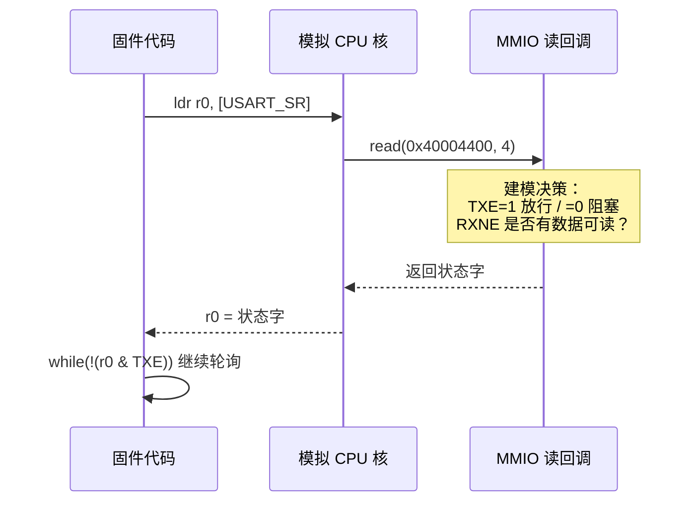
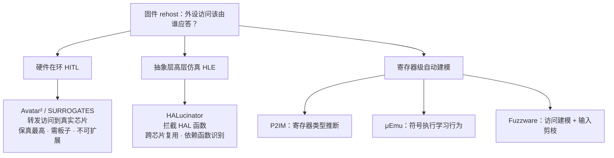
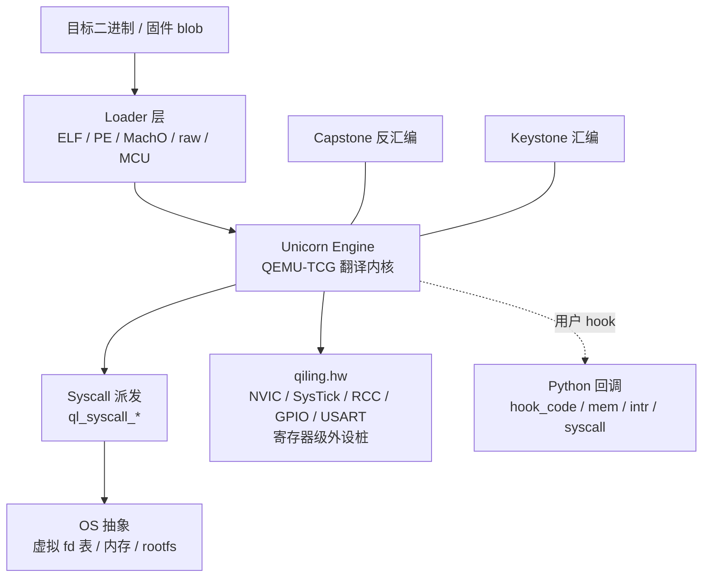
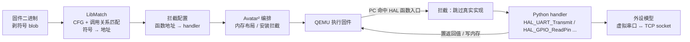
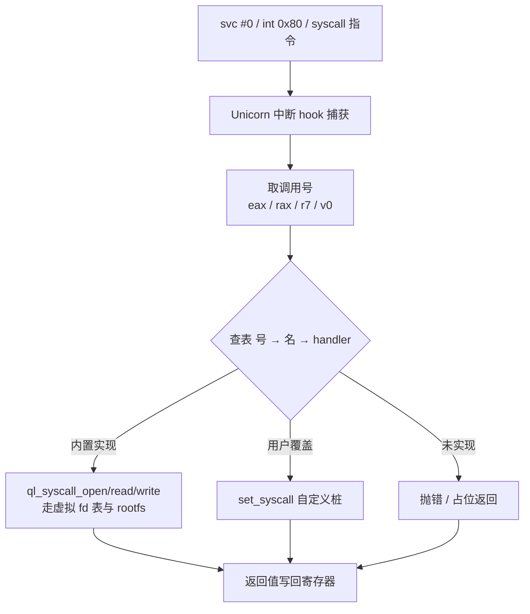

# 动态插桩与模拟执行引擎（11）· 固件rehost：Qiling与HALucinator
> [!abstract] TL;DR
> - rehost 的真正拦路虎不是 CPU，而是**外设**：裸机固件靠 MMIO/中断/DMA 与硬件对话，脱离硬件后这些访问无人应答——状态寄存器一读到 0，轮询循环立刻变死循环。
> - 外设应对有一整条谱系：硬件在环（保真但要板子、不可扩展）、寄存器级自动建模（P2IM/μEmu/Fuzzware）、抽象层高层仿真（HALucinator 直接拦 HAL 函数）——本质是**保真度、人工量、可扩展性**的三角权衡。
> - Qiling = Unicorn（CPU 核）之上叠 **OS 层**（loader/syscall/rootfs）与 **hw 层**（`qiling.hw` 寄存器级外设桩 + NVIC/SysTick），Python 原生、hook 细粒度，既跑 Linux/Windows 用户态也跑 Cortex-M 裸机。
> - HALucinator = 高层仿真（HLE）思想的代表：用 **LibMatch** 在剥符号固件里定位 HAL 函数，用 Python **handler** 顶替其实现，跨"用同一套 HAL 的芯片"复用；代价是识别依赖与"测不到 HAL 以下的 bug"。
> - **系统调用模拟**是 rehost 的另一半：Linux 固件靠 Unicorn 中断 hook 捕获 `svc`/`int 0x80`/`syscall` 后派发到 `ql_syscall_*`；裸机则靠 semihosting/newlib 桩。沙箱化的虚拟 fd 表让副作用不落真实主机。
> - rehost 是 fuzzing 与漏洞挖掘的地基，但**保真度缺口会直接变成误报/漏报**——任何结论都必须对照真实硬件校准，并明确标注建模覆盖的边界。

## 概述与定位

固件 rehost（re-hosting，重宿主 / 重托管）要解决的问题一句话即可说清：把本该跑在某块特定开发板或 SoC 上的固件，搬到一台通用 x86/ARM 主机上"凭空"跑起来，以便做单步调试、指令 trace、覆盖率采集与 fuzzing，而不必守着一堆实体开发板、JTAG 与逻辑分析仪。它与本系列前两篇是层层递进的关系：第 09 篇《Unicorn-Engine 与 CPU 模拟实战》解决"指令怎样被翻译并执行"，第 10 篇《全系统模拟与外设建模》解决"一台完整虚拟机的总线、外设、中断控制器如何搭起来"。本篇则聚焦一个更具体也更棘手的问题域——面对一坨没有文档、没有配套虚拟机、甚至剥掉了符号表的真实固件二进制，怎样让它**误以为自己仍运行在原硬件上**。这正是"rehost"一词的重量所在：不是再造一台标准 PC，而是复现某颗你可能一无所知的 MCU 的运行环境。

为什么说 CPU 反而是简单的一半？因为 ARM Cortex-M、MIPS、RISC-V 这些指令集是公开、稳定、可被 Unicorn/QEMU 精确翻译的；难的是固件与"外设"之间那些私有、碎片化、往往连数据手册都语焉不详的交互。固件读一个状态寄存器等它"就绪"、写一个数据寄存器把字节吐给串口、配一个定时器等它周期性触发中断——这些访问在真实芯片里由硅片电路应答，在纯 CPU 模拟里却落进一片"没有设备的内存"，读永远返回 0（或未初始化值），于是 `while (!(UART->SR & TXE));` 这类轮询循环原地转圈，固件卡死在启动早期。**外设建模，才是 rehost 的核心命题**。

本篇选两套代表性框架作为切入点。**Qiling** 是一个 Python 原生的二进制仿真框架，构建在 Unicorn（CPU）、Capstone（反汇编）、Keystone（汇编）之上，但它比 Unicorn 高一个层次——额外提供了操作系统层（加载器、系统调用、rootfs 文件系统抽象）与硬件层（`qiling.hw`，针对 Cortex-M 的寄存器级外设模型 + NVIC 中断控制器）。**HALucinator** 则是学术界"高层仿真（High-Level Emulation, HLE）"路线的旗帜性工作（USENIX Security 2020），它的洞见是：与其在寄存器一级苦苦建模每颗芯片，不如在**硬件抽象层（HAL）函数**这一级拦截——大量固件都基于厂商 HAL（如 STM32 HAL、Nordic SDK）编译，只要认出并顶替这些 HAL 函数，就能一举跨越所有底层寄存器细节。两者恰好站在外设建模谱系的两端：Qiling 手写寄存器级外设桩，HALucinator 拦截函数级抽象。理解它们，就理解了整条谱系的取舍。

需要划清与同库《39.固件与 IoT 嵌入式逆向 / 23.固件仿真进阶 Qiling 与 HALucinator》的边界：那篇站在**固件逆向的场景与用法**视角（拿到固件后该怎么上手仿真、跑通哪些分析）；本篇站在**仿真引擎内部机制**视角（外设桩与 syscall 模拟究竟怎样实现、谱系里各方案的深层原理与权衡）。两篇互为表里，可对照阅读。

## 原理与机制

### rehost 的真正拦路虎：外设，而非 CPU

要把外设问题讲透，先看 Cortex-M 这类微控制器的物理地址空间。它是一整块 4GB 的平坦地址，不同区段承载不同语义，rehost 必须逐段"填坑"：

```text
Cortex-M 物理地址空间（rehost 必须覆盖的区域）
0x0000_0000  Code/Flash   固件 .text/.rodata —— 只读回填即可（把 blob 映射进去）
0x2000_0000  SRAM         .data/.bss/栈/堆 —— 直接 map 成可读写内存
0x4000_0000  Peripheral   MMIO 外设 —— 外设建模主战场，读写必须走回调
0xE000_0000  PPB          NVIC/SysTick/SCB —— 中断与系统控制，由 emulator 核心或 hw 建模
```

Flash 与 SRAM 好办：前者把固件字节映射成只读内存，后者分配一块可读写内存即可，CPU 取指令、读常量、压栈都能正常工作。真正需要"智能"的是 `0x4000_0000` 起的外设区（MMIO）与 `0xE000_0000` 的私有外设总线（PPB）。MMIO（Memory-Mapped I/O）意味着外设寄存器被映射成内存地址，固件用普通的 `ldr`/`str` 读写它们；模拟器无法用一块静态内存搪塞过去，因为这些"内存单元"的读值是**有语义的、随时间变化的**。

MMIO 建模的三大子难题：其一是**状态寄存器的读值**。固件反复轮询"发送缓冲空 TXE""接收非空 RXNE"这类标志位，模型必须在恰当时机把它们置对，否则轮询死循环。其二是**中断注入**。定时器溢出、串口收到字节、DMA 传输完成，都以中断形式打断固件；模拟器必须主动在合适的时刻向 CPU 核注入中断（置 NVIC pending 位并让核心走异常入口），而"合适的时刻"极难判断。其三是 **DMA**：外设直接搬运内存，绕过 CPU，模型要在正确时机把数据写进 SRAM 并触发完成中断。下面这张时序图刻画了最常见的轮询困局——一次 MMIO 读回调背后隐藏的建模决策：



### 外设应对的三条路线

学界与工业界给出的应对方案，可归纳为三条主线，构成一条从"高保真、不可扩展"到"可扩展、有偏差"的谱系。**硬件在环（Hardware-in-the-loop, HITL）**：模拟器只跑 CPU 与内存，一旦碰到外设访问就通过调试口转发到真实芯片，让硅片来应答（代表：Avatar、Avatar²、SURROGATES）。保真度最高，因为答案来自真硬件；但必须持有对应板子、速度受调试链路制约、无法批量并行 fuzz。**抽象层高层仿真（HLE）**：不在寄存器级建模，而在更高的软件抽象层（HAL 函数、库函数）拦截并顶替（代表：HALucinator）。**寄存器级自动建模**：用程序分析自动推断每个 MMIO 寄存器该返回什么（代表：P2IM 的寄存器类型推断、Laelaps/μEmu 的符号执行、Fuzzware 的访问建模）。下图给出这条谱系的骨架：



### Qiling 的分层机制

Qiling 的定位是"比 Unicorn 高、比全系统 QEMU 轻"的中间层。Unicorn 只给你一颗裸 CPU：能执行指令、读写寄存器与内存，但对"这是个 ELF""这是一次 open 系统调用"一无所知。Qiling 在其上补齐了操作系统语义：**加载器**认识 ELF/PE/MachO/COM/raw-blob/MCU 多种格式，能正确布局段、设置栈、（对 Linux）加载动态链接器 `ld.so`；**系统调用层**拦截 syscall 指令并派发到 Python 实现的 `ql_syscall_*`；**OS 抽象**维护一张虚拟 fd 表、内存映射与线程状态；对裸机 MCU，则由 `qiling.hw` 提供寄存器级外设桩和 NVIC。所有这些之上，Qiling 暴露出极其细粒度的 hook 接口：`hook_address`/`hook_code`/`hook_block`（按地址/指令/基本块）、`hook_mem_read`/`hook_mem_write`/`hook_mem_unmapped`（内存事件）、`hook_intr`（中断）、以及 `set_syscall`（系统调用劫持）。



这里有两个设计要点值得体会。其一是 **rootfs**：Qiling 用一个宿主目录当作被仿真程序的文件系统根，`open("/etc/passwd")` 会被重定向到 `rootfs/etc/passwd`，从而把文件访问关进沙箱、也让分析者可以投喂构造好的输入文件。其二是 **Python 原生**：外设桩、syscall 桩、hook 全是 Python 对象与回调，改一个外设行为就是改一段 Python，无需重编 C、无需重启进程，这让交互式逆向与快速试错的成本极低——这也是 Qiling 相对 QEMU 手写设备模型（C + 重编译）在"研究/逆向"场景的关键优势。此外，Qiling 提供 `save`/`restore` 快照（把整机状态序列化，便于 fuzz 时从某点反复重放）和内建 GDB stub（`ql.debugger`），可以用 IDA/Ghidra/gdb 远程连上单步。

### HALucinator 的高层仿真机制

HALucinator 走的是完全不同的抽象层。它注意到一个工程现实：绝大多数商用固件并非直接怼寄存器，而是调用厂商提供的 HAL——例如 ST 的 `HAL_UART_Transmit()`、`HAL_GPIO_ReadPin()`。这些函数把"往串口发一串字节"这类**高层意图**封装起来，内部才去碰寄存器。既然如此，若能在固件里认出这些 HAL 函数的入口地址，就可以在执行到它们时**整体跳过真实实现，改由一段 Python handler 顶上**——handler 直接实现"发字节"的语义（比如把数据丢进一个连着 TCP socket 的虚拟串口），完全不必理会底下的 SR/DR/BRR 寄存器。这一步跨越，等于把"给每颗芯片的每个外设建寄存器模型"的苦差，替换成"给一套 HAL 写一批函数级 handler"，而同一套 HAL 被成百上千种设备复用，handler 因此高度可迁移。

难点在于：真实固件通常剥了符号，`HAL_UART_Transmit` 在二进制里只是某个地址上的一坨指令，没有名字。HALucinator 为此配套了 **LibMatch**——一个库函数识别工具，用预编译的 HAL 库（带符号）建库，再在目标固件里匹配出"哪个地址是哪个 HAL 函数"，产出符号→地址映射，喂给拦截配置。整个流水线由 **Avatar²** 编排、**QEMU** 执行：



### 系统调用与语义边界的模拟

"外设桩"解决裸机固件，"系统调用模拟"则解决那些跑在操作系统之上的固件（大量 IoT 设备是 Linux-based）。对一个 Linux ELF，Qiling 布好栈与加载器后开始执行，当遇到 `svc #0`（ARM）/`int 0x80`（x86）/`syscall`（x86-64）/`syscall`（MIPS 用 `v0`）这类陷入指令时，Unicorn 触发中断 hook，Qiling 接手：按体系结构约定取出调用号（`eax`/`rax`/`r7`/`v0`），查表映射到名字与 handler，执行对应的 `ql_syscall_open/read/write/...`。这些 handler 要么基于 rootfs 与虚拟 fd 表**在 Python 里合成行为**（默认，沙箱安全），要么在受控条件下透传到宿主。`set_syscall` 允许把任意一个系统调用替换成自定义桩——这是做污点注入、行为伪造、绕过环境检测的利器。



裸机固件没有 OS，但也有等价的"系统调用"边界：一是 **ARM 半主机（semihosting）**——固件用 `BKPT #0xAB`（Thumb）触发，`r0` 放请求号（`SYS_WRITE`/`SYS_OPEN`…），`r1` 指向参数块，调试器或模拟器负责代做 I/O，本质就是把主机的文件/控制台服务借给裸机程序；二是 **newlib 桩**（`_write`/`_sbrk`/`_read`），标准库把 I/O 收敛到这几个弱符号函数，rehost 时只要顶替它们即可让 `printf` 有输出、`malloc` 有堆。理解"syscall / semihosting / newlib 桩"三者是同一种模式——**在语义边界处拦截并代做**——就抓住了系统调用模拟的本质，它与外设桩、HALucinator 的 handler 其实是同一思想在不同抽象层的三次投影。

## rehost技术谱系与外设建模详解

### MMIO 建模：读回调到底该返回什么

把外设区安上读/写回调只是搭好舞台，真正的戏是"读回调返回什么值"。经验上，MMIO 寄存器可粗分三类，建模策略各异。**数据寄存器（Data）**：读它等于从外设取一字节（如 UART 的 DR），写它等于向外设推一字节；模型需连着一个数据源/汇（虚拟串口、fuzz 输入队列）。**状态寄存器（Status）**：只读的标志位集合（TXE/RXNE/BUSY…），是轮询循环的命脉，模型必须让"就绪"位在恰当时刻为真——最简单粗暴的策略是"读状态寄存器一律返回全 1（一切就绪）"，能冲过大多数轮询，但对依赖 BUSY→IDLE 跳变时序的逻辑会失真。**控制/配置寄存器（Control）**：可读写，固件写配置、有时回读校验；模型通常"写什么读回什么"（回声语义）即可。下面这张 STM32 USART 寄存器表把三类混在一个外设里，一眼看清建模关注点：

```text
STM32 USART（基址 0x4000_4400）—— rehost 关注的建模点
偏移  寄存器  关键位                        建模决策
0x00  SR     TXE(7) TC(6) RXNE(5) ...       状态类：读时须适时置 TXE，否则发送死循环
0x04  DR     数据寄存器                      数据类：写=吐 TX 字节到虚拟串口；读=喂 RX 字节并清 RXNE
0x08  BRR    波特率分频                      控制类：回读原值即可，不影响语义
0x0C  CR1    UE/TE/RE/RXNEIE/TXEIE          控制类：若使能 RXNEIE，模型需在有数据时置 pending 并注入中断
```

### 寄存器级自动建模谱系

手写这些寄存器行为既费力又易错，学界因此投入大量精力做**自动建模**。**P2IM**（USENIX Security 2020）不追求精确语义，而是用"访问模式"把寄存器**类型推断**出来：一个只被读、其值参与分支的多半是状态寄存器，一个先写后读回同值的多半是控制寄存器，据此给出"近似"应答（对状态寄存器探索性地返回能让固件继续前进的值），把"精确复现"降格为"够跑通即可"。**Laelaps**（ACSAC 2020）与 **μEmu**（USENIX Security 2021）引入**符号执行**：把未知外设读值当成符号变量，用约束求解/路径探索去推断"该返回什么才能让固件走得更深"，μEmu 还把学到的结论沉淀成一份可复用的知识库，避免每次重跑昂贵的符号执行。**Fuzzware**（USENIX Security 2022）则把视角对准 fuzzing：它对每次 MMIO 访问做**局部符号执行**，判定这次读进来的值里到底哪几个 bit 真正影响了后续控制流，从而把"外设读值"这个庞大输入空间**剪枝**到只剩有效位——这一步极大提升了模糊测试的效率，是近年 rehost-fuzz 结合的代表作。这条线的共同哲学是：**放弃对硬件的精确复刻，转而追求"足以让固件继续执行、且能被高效 fuzz"的近似模型**。

### 函数级建模：HALucinator 与 LibMatch 深剖

函数级建模把抽象层再抬高一截，好处是彻底摆脱寄存器时序，坏处是把成败押在"能否认出 HAL 函数"上。**LibMatch 的算法核心**是二进制函数匹配：先用带符号的 HAL 库编出一批参考目标文件，为每个库函数提取与地址无关的特征（控制流图结构、指令统计等），在目标固件里逐函数比对。难点在于**歧义**——很多 HAL 函数体量小、结构雷同，孤立看几乎无法区分。LibMatch 的杀手锏是引入**上下文/调用关系约束**：库函数之间的调用图是稳定的，`A` 调用 `B`、`B` 调用 `C` 的三元关系比单个函数指纹更独特，据此在候选集里做联合消歧。最终产出一份"符号→地址"映射，交给拦截层。它的**软肋**也很明确：对编译器版本、优化级别、内联极其敏感（函数被内联进调用者就无从匹配），且天然只能识别"编译进固件、能对上参考库"的那部分函数。

一旦地址落定，**handler** 就在该地址安断点/拦截，命中时读出参数（按调用约定从寄存器/栈取）、执行 Python 语义、写回返回值、直接返回调用者（跳过真身）。**外设模型**则把 handler 与外部世界连起来：一个虚拟串口模型可以背靠 TCP socket，让分析者用 `nc` 与固件"对话"，甚至把 fuzz 输入从这里灌进去。相比寄存器级方案，函数级的保真度锚在"HAL 之上"——只要 handler 语义对，固件在 HAL 之上的逻辑就能高保真运行；但**HAL 内部及以下（寄存器时序、外设状态机）的 bug 被整体旁路，测不到**，这是抽象层越高越省事、也越"看不见底层"的必然代价。

### 中断注入的时序难题

无论哪条路线，**中断**都是最难啃的骨头。外设中断（定时器 tick、UART RX 就绪、DMA 完成）在真硬件里由事件驱动，rehost 里却要模拟器"替硬件决定何时触发"。机制上（以 Cortex-M 为例）是：模型置对应中断的 NVIC **pending** 位，模拟器核心在指令边界检查 pending 与优先级/使能，满足则走异常序列——自动压栈、读向量表、跳到 ISR 入口。真正的难题是**时机**：太早触发，固件还没初始化好外设，ISR 里访问未就绪寄存器；太晚或不触发，固件在 `while(!flag)` 里等一个永不到来的中断而僵死。P2IM 用"轮转（round-robin）依次触发已使能中断"这类启发式；Qiling 的 `qiling.hw` 则实现了 NVIC 与 SysTick，SysTick 按执行的指令数近似"时间"周期性触发系统节拍，外设模型在数据就绪时主动置 pending。**没有一种时机策略对所有固件都对**——这正是 rehost 保真度缺口最常见的来源之一。

### Qiling.hw 内部：外设桩如何挂到 Unicorn

具体到 Qiling 的实现，`qiling.hw` 把每个外设建成一个持有寄存器文件（一小段字典/字节数组）的 Python 对象，注册到对应 MMIO 基址；框架在该地址区间安装 Unicorn 的 MMIO 读写回调，把 CPU 的 `ldr`/`str` 路由到外设对象的 `read(offset)`/`write(offset, value)` 方法，方法里实现前述三类寄存器语义。时间/事件推进则借 `hook_code`（每条指令后）或 SysTick 节拍，让需要"随时间变化"的外设（定时器计数、串口就绪）有机会更新状态并在需要时经 NVIC 注入中断。这套设计的优雅在于：**外设行为完全在 Python 里、与 CPU 核解耦**，逆向者要仿一颗新芯片，照葫芦画瓢写几个外设类即可；代价是**每颗芯片、每个外设都得人肉写模型**，覆盖面靠社区一点点铺（`stm32f4` 系列相对完备，冷门芯片往往缺模型）。

### 保真度—工作量—可扩展性三角

把上面各方案放到同一张表里横向对比，谱系的取舍一目了然：

| 路线 | 代表 | 建模层次 | 保真度 | 人工量 | 可扩展性 | 命门 |
|---|---|---|---|---|---|---|
| 硬件在环 HITL | Avatar² / SURROGATES | 真实外设 | 最高 | 低（但需板子） | 差 | 依赖实体硬件、慢、难并行 |
| 寄存器级自动 | P2IM / μEmu / Fuzzware | MMIO 寄存器 | 中 | 低（自动） | 好 | 复杂外设/DMA/时序易失真 |
| 函数级 HLE | HALucinator | HAL 函数 | 中高（HAL 之上） | 中（写 handler） | 好（同 HAL 复用） | 依赖函数识别、测不到 HAL 以下 |
| 手写寄存器模型 | Qiling.hw | MMIO 寄存器 | 高（所建部分） | 高 | 一般 | 每颗芯片手写、冷门芯片缺模型 |

一句话总结：**没有免费午餐**。想要高保真就得付出硬件依赖或人工量，想要可扩展与自动化就得接受近似与盲区。选型的关键是问清目标——是"跑通启动做行为观察"（近似即可，Fuzzware/P2IM 路线），还是"精确复现某个协议交互做调试"（手写模型或 HITL），抑或"跨大量同 HAL 设备批量 fuzz"（HALucinator）。

## 工具视角与实战

### Qiling：Linux 用户态与 syscall 劫持

最直观的入门是仿一个 Linux ELF 并劫持其系统调用。下面的骨架把 `write` 换成自定义桩，观察/篡改被写出的数据——这套手法同样用于伪造环境、绕过反调试、注入污点源：

```python
from qiling import Qiling
from qiling.const import QL_INTERCEPT

def hook_write(ql, fd, buf, count, *a):
    data = ql.mem.read(buf, count)          # 从被仿真进程内存取出待写数据
    print("[write] fd=%d %r" % (fd, bytes(data)))
    return count                            # 伪造"全部写成功"，副作用不落宿主

ql = Qiling(["rootfs/x8664_linux/bin/hello"], "rootfs/x8664_linux")
ql.os.set_syscall("write", hook_write, QL_INTERCEPT.CALL)  # 名字/号均可，API 随版本演进
ql.run()
```

要读懂它，关键不在这几行 API，而在背后的模型：`Qiling(...)` 的第二个参数是 **rootfs**，进程眼中的文件系统根就锚在这里，一切文件访问被关进沙箱；`set_syscall` 把系统调用派发表里 `write` 的槽位换成你的 Python 函数，于是每次 `write(2)` 陷入都先过你这一手。理解了"派发表 + rootfs 沙箱"，就能举一反三劫持任意 syscall。

### Qiling：Cortex-M 裸机固件

裸机固件没有 OS，要靠 `qiling.hw` 提供外设桩。典型流程是选定芯片 profile、实例化用到的外设、再运行：

```python
from qiling import Qiling
from qiling.extensions.mcu.stm32f4 import stm32f411

ql = Qiling(["firmware.hex"], archtype="cortex_m", ostype="mcu", env=stm32f411)
ql.hw.create('rcc')          # 时钟树，很多外设初始化前会等 RCC 就绪
ql.hw.create('gpioa')        # GPIO
ql.hw.create('usart2')       # 串口，print 的字节从这里出
ql.hw.watch()                # 打印外设访问，便于发现"缺了哪个外设导致卡住"
ql.run(count=100000)         # 限制指令数，防止死循环跑飞
```

这里的心法是**增量补外设**：先只 map Flash/SRAM 裸跑，看它卡在哪个 MMIO 地址（`hook_mem_unmapped` 或 `hw.watch()` 会告诉你），再对着地址查数据手册确认是哪个外设，`hw.create` 补上，如此往复直到启动跑通。`env=stm32f411` 这个 profile 描述了该芯片的内存布局与外设基址，是"认出地址属于谁"的地图。

### HALucinator：配置与 handler

HALucinator 以 YAML 配置驱动，核心是内存布局与拦截列表。下面是**简化**示意（真实字段更多）：

```yaml
memories:
  flash: { base_addr: 0x08000000, size: 0x100000, file: firmware.bin, permissions: r-x }
  ram:   { base_addr: 0x20000000, size: 0x00020000, permissions: rw- }
intercepts:
  - class:    halucinator.bp_handlers.stm32.uart.STM32UART   # 顶替实现的 handler
    function: HAL_UART_Transmit
    symbol:   HAL_UART_Transmit                              # 由 LibMatch 解析成地址
peripheral_models:
  serial: { model: halucinator.peripheral_models.serial, tcp_port: 5656 }  # 虚拟串口挂 TCP
```

跑之前先用 LibMatch 生成"符号→地址"表（`symbol` 才有落点），再启动 HALucinator：执行到 `HAL_UART_Transmit` 地址时被拦，`STM32UART` handler 从参数取出待发缓冲，经 `serial` 外设模型丢到 `5656` 端口，你用 `nc localhost 5656` 就能看到固件的串口输出、也能反向喂数据。**关注点**在于 handler 与 peripheral_model 的分工：前者翻译"这次 HAL 调用要干什么"，后者管"数据与外部世界怎么连"，两层解耦让同一个 handler 能接不同的 I/O 后端（socket、文件、fuzz 队列）。

### 与 fuzzing 集成

rehost 的终极用途多半是 fuzzing。Qiling 侧可借 `unicornafl`（AFL++ 的 Unicorn 模式）把仿真置于 AFL++ fork-server 之下，用快照在输入注入点反复重放；HALucinator 把 fuzz 输入从外设模型（如虚拟串口/传感器）灌入；而 **Fuzzware** 干脆把"MMIO 输入建模 + 剪枝"与 fuzzer 深度绑定，自动决定外设读值里哪些位该 fuzz。三者共同点是把"外设/输入边界"变成 fuzzer 的注入口——这也顺承到本系列第 12 篇（覆盖率/污点/trace）与同库《49.Fuzzing 与漏洞挖掘》。

### 调试、快照与常见踩坑

实战里最耗时的往往是"为什么卡住"。常见失败模式：**基址/向量表配错**——Flash 没映射到芯片实际的向量表基址（如 STM32 是 `0x08000000`），复位后取初始 SP/PC 就错，第一条指令即跑飞；**缺外设**——固件在某个未建模 MMIO 上轮询，表现为静默死循环，用 `hw.watch()`/`hook_mem_unmapped` 定位缺口；**中断时机不对**——ISR 依赖的标志没到位，或该来的中断没注入；**LibMatch 失配**——编译器/优化级别与参考库不符，HAL 函数认不出，handler 落不了地。应对之道是善用 GDB stub 单步（`ql.debugger = True` 后用 gdb 远程连）、`save/restore` 快照缩短复现回合、以及 `hook_code` 打印指令流做"最后 N 条指令"尸检。

## 安全性与正确使用

固件 rehost 本质是**防御性的分析基础设施**：让安全研究者、厂商 PSIRT、审计方能在没有一屋子硬件的前提下，对固件做调试、覆盖率引导 fuzzing 与漏洞复现。它的正面价值是把"只有拿到板子才能测"的高门槛拉平，显著扩大可被审计的固件面。但正因为它是"用软件冒充硬件"，误用与陷阱都集中在**保真度**上，必须讲清边界。

**第一重风险是仿真偏差直接污染安全结论**。外设桩返回的是近似值、中断时机是启发式猜测、HAL handler 是人写的语义——任何一处与真硅片不一致，都可能制造**假的崩溃**（模型让某寄存器返回了真硬件永不会出现的值，触发一条现实中走不到的路径 → 误报）或**掩盖真实缺陷**（模型太"顺"，把本会触发状态机异常的时序抹平了 → 漏报）。因此 rehost 出的每一个漏洞、每一条"已覆盖"，都应被视为**待验证的线索**，最终以真实硬件或高保真 HITL 复核为准，切忌把仿真覆盖率直接当成真机覆盖率对外承诺。

**第二重风险是抽象层选择带来的系统性盲区**。HALucinator 这类函数级 HLE 把 HAL 及其下整体旁路，意味着**HAL 内部、寄存器时序、外设状态机里的 bug 天然测不到**——若你的审计目标恰恰是驱动/HAL 层漏洞，选错抽象层会得到一份"看似跑通、实则没测到要害"的虚假安心。选型时必须让"建模抽象层"高于或等于"待查漏洞所在层"，并在报告里显式标注建模覆盖到哪一层。

**第三重风险来自运行不可信固件本身**。虽然目标代码被关在 Unicorn/QEMU 的模拟 CPU 里、且 Qiling 的 syscall/文件访问默认走虚拟 fd 与 rootfs 沙箱，副作用不落宿主，但**顶替逻辑（handler、syscall 桩、外设模型）是运行在宿主上的普通 Python/C 代码**，享有宿主权限。恶意固件可能针对性地喂畸形参数去撞 handler 里的解析漏洞，或在允许透传的配置下借宿主 syscall 逃逸。正确姿势是：分析不可信样本时把整个 rehost 环境再套一层容器/虚拟机隔离，关闭一切宿主透传（保持纯沙箱 syscall），并对 handler 的输入做防御性校验。此外要意识到**反模拟对抗**（本系列第 14 篇专论）：恶意固件可探测 rehost 特征（缺失的外设、异常的时序、模拟器指纹）而改变行为，分析者需知道自己看到的可能是"被表演过"的执行。

**加固与正确使用的边界**可归纳为：一，rehost 结论对内是高效线索、对外需真机背书；二，建模抽象层要匹配审计目标层，盲区写进报告；三，跑不可信固件必须容器隔离 + 纯沙箱 + handler 输入校验；四，把仿真环境本身也纳入版本与配置管理（哪套外设模型、哪份 LibMatch 结果、哪个 profile），否则结论不可复现。守住这四条，rehost 才是可靠的分析地基而非误导之源。

## 小结

固件 rehost 的全部张力都围绕一个词——**外设**。CPU 有 Unicorn/QEMU 可精确翻译，是简单的一半；难的是让脱离硬件的固件相信外设仍在应答，于是有了从硬件在环、寄存器级自动建模（P2IM/μEmu/Fuzzware）到函数级高层仿真（HALucinator）的整条谱系，其内核是**保真度、人工量、可扩展性**的三角权衡。Qiling 以 Python 原生的分层架构（Unicorn 核 + OS 层 + `qiling.hw` 外设桩）把这套能力做成了顺手的框架，既覆盖 Linux/Windows 用户态的系统调用模拟，也覆盖 Cortex-M 裸机的寄存器级外设与中断注入；HALucinator 则把抽象层抬到 HAL 函数，用 LibMatch 定位、用 handler 顶替，换来跨芯片复用的可扩展性，代价是识别依赖与"测不到 HAL 以下"的盲区。而贯穿始终的"系统调用 / semihosting / newlib 桩 / HAL handler / 外设桩"，其实是同一种"在语义边界拦截并代做"的思想在不同抽象层的投影。掌握了这条主线与谱系取舍，再面对任何一坨陌生固件，你都能判断该在哪一层下桩、该接受多少偏差、该如何对结论祛魅。下一篇将转向"仿真之上能做什么"——用插桩驱动覆盖率、污点与 trace 分析。

## 相关阅读

- 同系列上游：[[09.Unicorn-Engine与CPU模拟实战]]（Qiling/HALucinator 的 CPU 核）、[[10.全系统模拟与外设建模]]（外设建模的通用基础设施，本篇的"通用版"）
- 同系列下游：[[12.插桩驱动的分析：覆盖率与污点与trace|→ 下一章]]、[[49.Fuzzing与漏洞挖掘/00.Fuzzing与漏洞挖掘总览]]（rehost 的最大下游用途）
- 固件场景对偶：[[39.固件与IoT嵌入式逆向/23.固件仿真进阶Qiling与HALucinator]]（同一主题的"用法/场景"视角，与本篇"引擎内部"互补）
- 静态对偶：[[45.反编译器与反汇编引擎原理/01.反汇编算法：线性扫描与递归遍历]]（LibMatch 依赖的函数/CFG 恢复来自静态引擎）
- Hook 承接：[[32.hooks/09-frida]]（用户态 Hook 用法）与本系列 [[05.Frida-Gum与Stalker内部机制]]（Hook/插桩内部机制），对照 rehost 中的"函数级拦截"
- 官方文档与论文：Qiling 官方文档与仓库（qiling.io / github.com/qilingframework/qiling）；HALucinator 论文《HALucinator: Firmware Re-hosting Through Abstraction Layer Emulation》(USENIX Security 2020) 与其开源实现；Avatar² 编排框架；外设建模谱系代表作 P2IM (USENIX Security 2020)、Laelaps (ACSAC 2020)、μEmu (USENIX Security 2021)、Fuzzware (USENIX Security 2022)；综述《SoK: Enabling Security Analyses of Embedded Systems via Rehosting》(ASIA CCS 2021)；Linux-based 固件仿真 Firmadyne (NDSS 2016)、FirmAE (ACSAC 2020)；ARM Semihosting 规范与 Unicorn Engine (Black Hat USA 2015)

[[00.动态插桩与模拟执行引擎总览|⬆ 系列总览]] | [[10.全系统模拟与外设建模|← 上一章]] | [[12.插桩驱动的分析：覆盖率与污点与trace|→ 下一章]]
