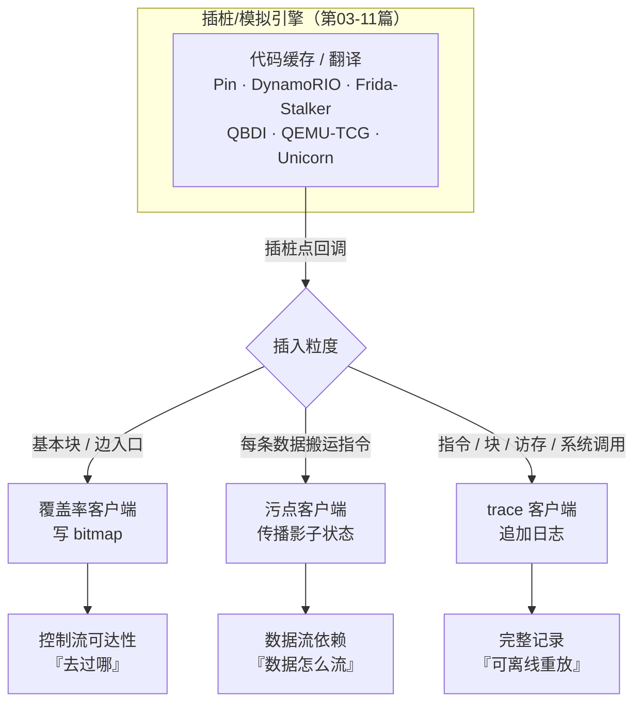
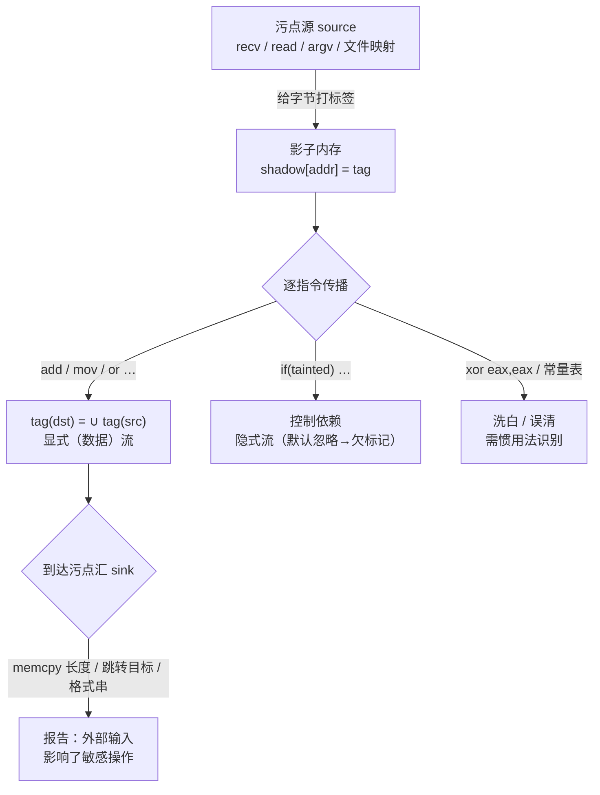
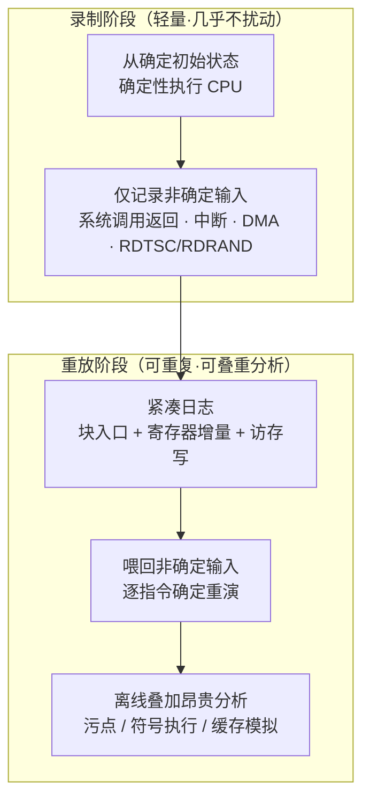

# 动态插桩与模拟执行引擎（12）· 插桩驱动的分析：覆盖率与污点与trace
> [!abstract] TL;DR
> - 覆盖率、污点、trace 是构建在第 03–11 篇各引擎之上的三类"分析客户端"：引擎只在指令/基本块/边/访存/系统调用等**插桩点**给出回调，客户端负责把观测量**聚合进一个数据结构**——bitmap、影子内存、日志缓冲；理解本篇就是理解"同一插桩点如何被三种语义复用"。
> - 覆盖率的本质是"控制流去过哪"。AFL 用 64KB bitmap 加边哈希 `(prev>>1)^cur` 近似边覆盖：右移 1 位保留边方向、命中数分桶抑制循环爆炸、NeverZero 防止计数回绕清零；代价是**哈希碰撞**（生日界），LTO 无碰撞插桩与 Intel PT 硬件追踪是两条消解路线。
> - 污点分析的本质是"数据怎么流"。核心是**影子内存**加逐指令**传播规则** `tag(dst)=∪tag(src)`；真正的难点不在实现而在语义：显式流之外的隐式（控制）流会**欠标记**，指针污点与循环索引会**过标记**，sbox 查表和 `xor eax,eax` 之类惯用法会"洗白"或误清污点。
> - trace 的本质是"完整记录以便离线重放"。PANDA / rr / WinDbg-TTD 的共同设计是**只录非确定输入**（系统调用返回、中断、RDTSC、DMA、RDRAND），重放时逐指令确定重演，从而把"轻量录制"与"昂贵分析"彻底解耦。
> - 三类客户端与引擎正交：同一语义可跑在编译期插桩、QEMU-TCG、Frida-Stalker、Unicorn、Pin/DynamoRIO 或 Intel PT 上，差别只在**精度 / 开销 / 可见性**三维——选型本质上就是在这三维上做权衡。

## 概述与定位

前面第 03 到第 11 篇把"引擎"讲透了：Pin、DynamoRIO、Frida-Stalker、QBDI 是进程级 DBI，QEMU-TCG、Unicorn 是 CPU 模拟，Qiling / HALucinator 把 rehost 抬到全系统与固件层。这些引擎有一个共同的、被反复强调的能力——**在被观测程序执行到某个点时，把控制权交给你的回调代码**。但引擎本身不产出"分析结果"，它只提供插桩点（instruction / basic-block / trace / memory-access / call-ret / syscall）。真正回答"这次执行意味着什么"的，是挂在这些插桩点上的**分析客户端**。本篇要讲的，正是逆向与漏洞挖掘里最经典、复用度最高的三类客户端：覆盖率（coverage）、污点（taint）、trace（执行追踪）。

把它们放在同一篇讲，是因为三者共享同一套"心智模型"：**在插桩点插入观测，把观测聚合进一个全局数据结构，再对该结构做判定或离线分析**。区别只在两点——插在什么粒度的点上，以及聚合进什么结构。覆盖率插在"基本块/边"入口，聚合进一张 bitmap，回答"控制流去过哪"；污点插在"每一条搬运数据的指令"上，聚合进影子内存，回答"外部数据流到了哪"；trace 插在"指令/块/访存/系统调用"上，聚合进一条日志，回答"到底发生了什么，能不能原样重演"。用一句话概括三者的关系：**trace 是最全的原始记录，覆盖率是 trace 的一种极度压缩的摘要（只保留边的可达性），污点是叠加在数据流上的一层标签**。

需要先划清边界，避免与相邻篇重复。第 49 系列《Fuzzing 与漏洞挖掘》里，`02.覆盖率引导原理` 讲 AFL 反馈驱动的**算法思想**，`04.编译期插桩：SanitizerCoverage` 讲编译器怎么埋点，`12.覆盖率之外：污点与concolic` 讲把污点/concolic 用进 fuzzing 循环。本篇的视角**不是 fuzzing 循环**，而是**插桩引擎实现视角**：同一份覆盖率/污点/trace 语义，落到不同引擎上（编译期 vs QEMU-TCG vs Stalker vs Unicorn vs Pin vs Intel PT）时，数据结构怎么填、回调怎么挂、精度和开销怎么变。换言之，49 系列关心"拿这些信号做什么"，本篇关心"这些信号怎么被引擎生产出来、有哪些实现陷阱"。反插桩对抗、被测样本探测 agent 等话题留给第 14 篇。



## 原理与机制

三类客户端能被统一理解，关键在于**插桩点的分类学**。任何一个 DBI/模拟引擎，对外暴露的插桩点无外乎这几类粒度：指令级（每条指令前/后）、基本块级（块入口/出口）、边级（从块 A 跳到块 B 的那条控制流边）、访存级（每次 load/store，含地址与宽度）、控制转移级（call / ret / 间接跳转）、系统调用级（进内核前后）。粒度越细，能看到的信息越多，插桩点触发越频繁，开销也越大。三类客户端本质上是在这条"粒度-开销"谱系上选了不同的点。

**覆盖率**只需要知道"边有没有被走过"，所以它插在最粗的基本块/边入口，且每次触发只做一次极廉价的写（自增一个字节）。这决定了覆盖率是三者里开销最低的——低到可以塞进 fuzzing 的每秒上万次执行循环里。**污点**要跟踪数据依赖，必须在**每一条会移动或运算数据的指令**上执行传播逻辑，插桩点密度接近"每指令"，且每次触发要读写影子状态、做集合并运算，于是开销天然是覆盖率的一到两个数量级。**trace** 介于两者之间到更重：如果只记块入口，接近覆盖率的密度但要落盘/落缓冲；如果记到指令级带寄存器和访存，就逼近污点的密度且日志体量巨大。

第二个统一视角是"**内联插桩 vs 回调插桩**"。引擎实现插桩点有两条路：把分析代码**内联**编译进代码缓存（inline），或在插桩点**调用**一个外部回调函数（call-out）。内联省去了保存/恢复上下文和函数调用的开销，但只能做很简单的操作；回调灵活但每次都要 spill 寄存器、切栈。覆盖率的"bitmap 自增"简单到可以完全内联——这正是它快的根本原因（AFL 的插桩就是几条内联汇编）；污点的传播规则太复杂，早期实现多走回调（libdft 已尽力把常见 case 内联并做了大量优化），这是它慢的根本原因。理解了"内联能不能塞得下"，就理解了三类客户端开销差异的第一性来源。

第三，三类客户端共享一块**跨执行持久的状态**：覆盖率的 bitmap 通常放在 fuzzer 与目标之间的**共享内存**（`shm`）里，目标进程内联写、fuzzer 进程读；污点的影子内存与被测地址空间**平行**存在（每个真实字节对应一份标签）；trace 的缓冲区要么在线消费要么落盘。这块状态的布局（大小、映射方式、如何清零/复位）直接决定了客户端的精度上限和每次执行的复位成本，下一段逐一拆开。

## 结构与算法详解

### 覆盖率：从基本块到边哈希 bitmap

先厘清"块覆盖"与"边覆盖"的差别，这是覆盖率精度的第一分水岭。**块覆盖**只记录"基本块 X 被执行过"，是一个关于节点的集合；**边覆盖**记录"从块 A 直接跳到了块 B"，是关于 CFG 有向边的集合。为什么 fuzzing 一定要边而非块？因为很多 bug 藏在"特定的路径组合"里：块集合 `{A,B,C}` 无法区分 `A→B→C` 与 `A→C→B`，而这两条路径可能一条安全一条崩溃。边覆盖能把它们区分开，用极小的存储代价获得了对"执行顺序"的敏感性——这是 AFL 相对早期块覆盖 fuzzer 的关键跃升。

AFL 的边覆盖实现是整个领域被抄写最多的一段代码，值得逐行理解其"为什么"：

```c
// 每个基本块在插桩时被分配一个编译期随机常量 cur_location（掩码到 MAP_SIZE-1）
// 全局：u8 shared_mem[MAP_SIZE]; static u32 prev_location;   // MAP_SIZE = 1<<16 = 64KB
cur_location = <COMPILE_TIME_RANDOM>;
shared_mem[cur_location ^ prev_location]++;   // 用『边』作为下标自增
prev_location = cur_location >> 1;            // 关键：右移 1 位再存
```

三个设计点，每一个都不是随意的。**其一，为什么用 `prev ^ cur` 当边的下标**：一条边由"来处块"和"去处块"两个 ID 唯一确定，把两个随机 ID 异或成一个下标，是一种零成本的哈希——不需要维护 `(A,B)→id` 的映射表，纯算术即可在内联里算出。**其二，为什么 `prev` 要右移 1 位**：异或满足交换律，`A^B == B^A`，若不移位，边 `A→B` 与反向边 `B→A` 会落到同一格，丢失方向性；把 `prev` 右移 1 位打破对称，使 `(A>>1)^B` 与 `(B>>1)^A` 一般不再相等，方向就被保住了（对 `A→A` 的自环也仍能留一格）。**其三，为什么下标空间只有 64KB**：因为这张图要放进共享内存、每次执行后要清零、还要被 fuzzer 逐字节比对，64KB 是"能覆盖多数程序的边数"与"复位/比对成本可接受"之间的经验折中。

命中之后不是简单地"标记为 1"，而是**自增计数**，再在比对时做**分桶（bucketing / count classes）**。AFL 把命中次数归入 8 个桶：`1, 2, 3, 4–7, 8–15, 16–31, 32–127, 128+`。这么做的动机是循环：一条边被走 1 次和 2 次是"质"的不同（可能触发了新逻辑），但走 47 次和 48 次几乎没有区别。分桶让"循环次数的微小抖动"不再被误判为新覆盖，从而抑制**路径爆炸**——否则一个 `for` 循环就能造出无穷多"新"覆盖，把语料库撑爆。与之配套的是 **NeverZero**：8 位计数器自增到 255 再加 1 会回绕成 0，看起来像"从没走过"，AFL++ 用带进位的加法让它回绕到 1 而非 0，堵住这个假阴性。

这套哈希方案最大的软肋是**碰撞**。64K 个格子、边哈希，按生日悖论，边数到 √65536 ≈ 256 就开始出现碰撞，真实程序动辄几万条边，碰撞率相当可观——两条不同的边映射到同一格，一条的新覆盖会被另一条"吃掉"，导致**漏掉真实的新路径**（假的"没有新覆盖"，进而漏 bug）。CollAFL 论文量化了这个问题。消解有两条主流路线：**其一，无碰撞插桩**——AFL++ 的 LTO 模式在链接期给每条边分配全局唯一、连续的 ID（不再靠随机异或），碰撞归零，代价是需要能重编译目标、需要 LTO 工具链；**其二，换更精确的信号源**——用 Intel PT 硬件分支追踪重建真实边序列，或干脆放大 bitmap。此外还有**上下文敏感**覆盖（把调用栈或最近 N 条边的 n-gram 混进哈希），能区分"同一函数被不同调用点触达"，精度更高但碰撞压力更大，是精度与容量的又一次拉扯。

以上都假设"能在编译期插桩"。逆向场景里目标常常**只有二进制**，这时覆盖率必须由本系列的引擎在运行时生产，落点各异：

- **QEMU 模式（afl-qemu / TCG）**：在 TCG 翻译一个新翻译块时，注入一小段更新 bitmap 的 helper（`afl_maybe_log`），块 ID 由块的客户机 PC 哈希而来。开销中等，无需源码，是二进制 fuzzing 的默认档。见 [[08.QEMU-TCG动态二进制翻译]]。
- **Frida 模式（Stalker）**：用 Frida-Stalker 在动态重编译时于块入口写 bitmap，`frida-drcov` 是常见产物。适合有反调试但能被 Frida 注入的目标、以及移动端。Stalker 内部机制见 [[05.Frida-Gum与Stalker内部机制]]。
- **Unicorn 模式**：把目标片段抠出来在 Unicorn 里跑，用 `UC_HOOK_BLOCK` 在块回调里写 bitmap，专治"无完整运行环境"的固件片段。见 [[09.Unicorn-Engine与CPU模拟实战]]。
- **Pin / DynamoRIO 的 drcov**：DynamoRIO 自带的 `drcov` 客户端记录被执行的基本块，产出模块表+块表，供 Lighthouse / Cartographer / bncov 等做可视化。DynamoRIO 客户端模型见 [[04.DynamoRIO架构与客户端]]。
- **SanitizerCoverage（编译期）**：LLVM 的 `-fsanitize-coverage`，`trace-pc-guard` 给每条边一个 guard 变量并回调 `__sanitizer_cov_trace_pc_guard`，`inline-8bit-counters` 直接内联自增字节计数，`pc-table` 导出 PC 表，`trace-cmp` 额外插桩比较指令（喂给 CmpLog/RedQueen/LAF-Intel 破"魔数"分支）。细节见 [[49.Fuzzing与漏洞挖掘/00.Fuzzing与漏洞挖掘总览]] 系列的编译期插桩篇。
- **Intel PT（硬件）**：CPU 把分支走向压成 TNT（taken/not-taken）与 TIP（间接分支目标）包，**几乎零插桩开销**，但要用原二进制离线解码重建边。kAFL、WinAFL-IPT、honggfuzz 用它换取近原生速度，代价是解码开销与高速率下的丢包。

一句横向对比：编译期插桩最快最准但要源码；QEMU/Frida/Unicorn 无需源码但有翻译开销且受哈希碰撞影响；Intel PT 速度最优、无碰撞，但只有分支流、缺访存等富信息，且强依赖硬件与解码器。逆向时的选型就是在"要不要源码 / 能否注入 / 要多快 / 要多准"之间取一点。

### 污点分析：影子内存与传播规则

污点分析（Dynamic Taint Analysis, DTA）要回答"外部输入的某个字节，最终影响了哪些内存、寄存器和分支"。它的三件套是**污点源（source）、传播（propagation）、污点汇（sink）**：source 是外部数据进入的地方（`read`/`recv`/`mmap` 文件、`argv`、网络包），在这里给相关字节打上标签；propagation 在每条指令处按规则把标签从源操作数传到目的操作数；sink 是敏感操作（`memcpy` 的长度、`malloc` 的尺寸、间接跳转的目标、格式串、SQL 拼接点），一旦发现被污点数据触达就报告。

实现的物理基础是**影子内存（shadow memory）**：为被测地址空间里的每一个真实字节，维护一份平行的"标签"。标签的粒度是第一权衡——**逐字节**（每字节一个 tag）是最常见的折中，**逐比特**更精确（能表达"这个字节的第 3 位来自输入"）但存储与传播代价翻倍。标签的内容也分档：最简是**布尔**（脏/不脏），进阶是**位图/颜色**（第 k 位表示"来自第 k 个输入字节或第 k 个源"，从而能回答"输出的这一字节由输入的哪几字节合成"，即 taint 的"来源集")。

影子内存的**布局**决定了访问速度：**其一，直接缩放映射**——像 ASan 那样 `shadow = (addr >> k) + offset`，一次移位加法即可定位标签，最快但要为整个地址空间预留影子区；**其二，多级页表式**——libdft 用类似两级表（STAB）的结构按需分配影子页，省内存但多一次间接；**其三，区间树**——记录"某段区间被同一标签覆盖"，对大块同源数据省空间但查询是对数级。选型逻辑和 MMU 页表如出一辙：稠密访问用直接映射换速度，稀疏访问用多级表换内存。

传播规则是污点的灵魂，也是它区别于覆盖率的根本复杂度所在。基本形态很简单：对每条指令，`tag(dst) = ∪ tag(src_i)`——目的的污点是所有源操作数污点的并集。`add eax, ebx` 使 `tag(eax) |= tag(ebx)`，`mov` 直接搬运标签。但魔鬼在细节：

- **显式流 vs 隐式流**。上面的规则处理的是**显式（数据）流**。而 `if (tainted) x = 1; else x = 2;` 里 `x` 的值明明依赖污点，却没有任何数据赋值把污点搬给它——这是**隐式（控制）流**。纯 DTA 默认**不追隐式流**，于是**欠标记（under-taint）**：污点被"洗白"。若强行追所有控制依赖，又会**过标记（over-taint）**：几乎每个变量都能通过某个分支挂上污点，标签像野火蔓延，结果毫无意义。这对矛盾没有银弹，工程上只能按场景折中（比如只追有限深度的控制依赖）。
- **污点爆炸**。把一个污点的循环索引拿去索引大表，或让污点值参与地址计算，都可能让污点像瘟疫一样扩散。
- **指针/地址污点策略**。从一个"被污点的指针"处 load，读回来的值算不算污点？这是一个**策略开关**：算，则更保守（更多假阳性）；不算，则可能漏掉"用污点数据做下标的查表"。
- **洗白与误清**。`xor eax, eax`、`sub eax, eax` 的结果恒为 0，与操作数无关，正确实现必须识别这类惯用法并**清污点**，否则假阳性；反过来，sbox 查表（`out = table[tainted_in]`）在"地址污点不传播"策略下会**漏污点**，这是很多混淆/密码实现能规避 DTA 的原因。

第二个大分岔是**在哪一层做传播**：**在原生 ISA 上**（libdft 基于 Pin，为 x86 每一类 opcode 手写传播规则，逐指令拦截）——贴近真实语义但要为每条指令、每种寻址方式写规则，工程量巨大且难移植；**在 IR 上**（PANDA 把 QEMU 的 TCG 进一步 lift 到 LLVM IR，在 IR 层插污点传播；Triton 在自己的 AST 上同时做符号执行与污点）——IR 的指令种类少、语义规整，写一套规则能覆盖多架构，代价是多一层翻译且 IR 语义要对得上硬件。这条分岔和第 13 篇 DBT 的"要不要过 IR"是同一个哲学问题的两次出现。

主流工具谱系：**libdft / libdft64**（Pin 上的字节级 DTA 经典实现，学术界引用基座）、**Triton**（DBA 框架，污点+符号执行混合，常配合 Pin 或离线 trace）、**PANDA 的 taint2**（全系统、位置标签、跑在 LLVM 化的 TCG 上）、**DECAF / TEMU**（BitBlaze 系全系统污点）、**dytan**（通用污点框架）。性能上 DTA 普遍 10–100 倍甚至更高，根因就前面说过——传播逻辑太复杂、塞不进纯内联，几乎每条指令都要付出读写影子状态的代价。逆向落地场景：定位"哪几个输入字节控制了这个崩溃"、协议逆向里追字段流向、脱壳时找"解密后被跳转执行"的数据、以及给 concolic 执行**种子化**（只对污点字节做符号化，压缩符号约束规模）。污点与 concolic 在 fuzzing 里的联用见 [[49.Fuzzing与漏洞挖掘/00.Fuzzing与漏洞挖掘总览]]。



### trace：记录、压缩与确定性重放

trace 客户端最朴素的形态就是"在插桩点把发生的事追加到一条日志"：执行了哪条指令、进了哪个块、读写了哪个地址、寄存器变成了什么、调了哪个系统调用。但天真地记录一条完整指令级 trace，会瞬间产出几十上百 GB——一个跑几秒的程序就是几十亿条指令。于是 trace 的两个核心工程问题是：**如何压缩**，以及**如何保证能原样重放**。

**确定性重放**是 trace 领域最深刻的设计，代表作是 **PANDA 的 record-replay**。它的洞见是：一次执行之所以不可重复，只是因为存在**非确定输入**——系统调用的返回值、外部中断的时机、DMA 写进内存的数据、`RDTSC`/`RDRAND` 这类读硬件的指令。CPU 指令本身是确定的。所以录制阶段**只记录这些非确定输入**（体量极小、开销极低、几乎不扰动时序），重放阶段让 CPU 从同一初始状态出发**逐指令确定重演**，在需要读非确定值时把录好的值喂回去。这样就把"必须轻量、必须在线"的**录制**，与"可以任意慢、可以反复做"的**分析**彻底解耦——你可以在重放上叠加污点、符号执行、缓存模拟等昂贵分析，而它们**完全不影响**被观测程序的行为（因为程序早已录完）。这是 trace 相对"在线插桩"的独特价值。

**rr（Mozilla）** 是进程级的同类实现：它录制一个 Linux 进程与内核的全部交互（系统调用、信号、共享内存读、被陷入的非确定指令），并把多线程**串行化到单核**执行，避免数据竞争带来的不可重现；重放时在 gdb 下确定回放，还能**反向执行**（用退休条件分支的硬件性能计数器来度量"执行了多远"以支持回退）。**WinDbg 的 TTD（Time Travel Debugging）** 走的是 DBI 路线：用一个仿真/插桩层把进程执行录成 trace，再支持前后自由穿梭。三者机制不同，但"录下来、可重放、可回退"的用户价值一致，也都印证了"录制非确定性、重放确定性"这条主线。

**压缩**上，通用手段是：只记**块入口**而非每条指令（重放时用二进制反汇编重建块内指令）、只记**寄存器增量**（delta）而非全量快照、把**访存写**单独成流、最后叠一层 zstd/bzip2。DynamoRIO 的 **drcachesim / memtrace** 就是这个思路的产物——它产出紧凑的访存 trace 供离线 cache 模拟，格式经过精心压缩。QEMU 侧的 `-d exec,in_asm,cpu` 能直接打印翻译块/反汇编/CPU 状态，是最轻量的"穷人 trace"。

trace 与前两类客户端的关系值得再强调：**覆盖率是 trace 的有损摘要**——你可以从一条完整块 trace 事后算出边覆盖，反之不行；**污点可以在 trace 重放上离线做**——这正是 concolic 执行常见的形态：先录一条具体执行 trace，再把它喂进符号引擎（Triton / SymCC 类），在污点字节上建符号约束、翻转分支求解新输入，QSYM/SymQEMU 是这条线的代表。所以"先 trace、再在重放上叠覆盖率与污点分析"是一种非常强的组合拳，也是把三类客户端串起来的自然方式。



## 工具视角与实战

**覆盖率采集的三条常用路径**。若能重编译，首选 AFL++ 的编译期插桩（`afl-clang-lto` 无碰撞，`afl-clang-fast` 用 PCGUARD/inline-counters）；只有二进制且能正常起进程，用 AFL++ 的 `qemu_mode`（`AFL_USE_QEMU`）或 `frida_mode`；只有固件片段、起不了完整进程，用 `unicorn_mode` 把目标函数抠出来，在 Unicorn 里手动布好内存与寄存器、`UC_HOOK_BLOCK` 里写 bitmap（固件 rehost 场景衔接 [[39.固件与IoT嵌入式逆向/23.固件仿真进阶Qiling与HALucinator]] 与 [[11.固件rehost：Qiling与HALucinator]]）。要**可视化**覆盖，用 DynamoRIO 的 `drcov` 或 `frida-drcov` 产出块表，导入 Lighthouse / Cartographer（IDA / Binary Ninja）、bncov、dragondance，就能在反汇编视图里高亮"这次输入走过的块"，是审计与差分分析的利器。

**污点/concolic 的落地**。轻量原型用 **Triton**：给定一段可控执行（Pin pintool 驱动或喂一条离线 trace），把输入字节 `setConcreteMemoryValue` 并标记为符号，跑完拿到路径约束，对目标分支取反 `getModel` 求解新输入——这就是最小可用的 concolic 引擎。全系统、跨进程的污点用 **PANDA**：先 `record` 一段行为，再在 `replay` 上加载 `taint2` 等插件离线分析，配合 `asidstory`、`coverage`、`tainted_branch` 等插件定位"输入影响的分支"。工程提醒：DTA 的假阳/假阴很依赖策略，务必先在**已知答案的小样本**上标定 source/sink/指针污点开关，再上真实目标。

**trace 的实战**。调 QEMU 用 `-d in_asm,exec -D trace.log` 拿最省事的执行流；要反向调试与"时间旅行"，Linux 上 `rr record ./prog && rr replay`，Windows 上 WinDbg TTD 录 `.run` 再前后穿梭；要做缓存/流水线级性能分析，DynamoRIO `drcachesim` 采访存 trace 离线模拟。把 trace 或覆盖率**导回静态工具**（IDA/Ghidra/Binary Ninja）与第 45 系列的静态 CFG 对照，动静结合能快速看出"静态可达但动态从没走到"的死代码或反分析分支——静态对偶见 [[45.反编译器与反汇编引擎原理/01.反汇编算法：线性扫描与递归遍历]]。

**引擎选型速记**（同一客户端在不同引擎上的取舍）：追求吞吐、可重编译 → 编译期插桩；无源码、要通用 → QEMU-TCG；移动端 / 有注入通道 / 需与已有 Frida 脚本协同 → Frida-Stalker（用法承接 [[32.hooks/09-frida]]）；只有孤立片段 / 固件 → Unicorn；要指令级富信息且能写复杂客户端 → Pin/DynamoRIO；要近原生速度只取分支流 → Intel PT。

## 安全性与正确使用

这三类客户端是**中性分析能力**，攻防双方都用：防御方拿它做覆盖引导 fuzzing、找 bug、做补丁验证；攻击方同样能拿它逆向闭源协议、定位可利用输入、脱壳、绕过 License 校验。因此讨论"安全性"，重点不在工具本身善恶，而在**使用者必须清楚它的能力边界与副作用**，否则会得出错误结论或引入风险。

**第一条铁律：插桩不是隔离。** 覆盖率与污点都要求**真实执行被测代码**（trace 的录制阶段亦然）——你是在自己的机器上跑目标。分析恶意样本或不可信二进制时，Pin/Frida 这类**进程内**agent 与样本共享地址空间，样本可以探测、篡改甚至反制 agent（反插桩细节见 [[14.反插桩与反模拟对抗]]），QEMU 全系统模拟虽有边界但也非铁壁。正确做法是把执行放进**受控沙箱/隔离虚机**，网络与文件系统按需断隔。而 PANDA 的 record-replay 提供了一个**更安全的分析范式**：录制只在隔离环境里跑一次极短的真实执行，之后所有昂贵分析都在**重放**上做——重放不产生真实系统调用副作用、不联网、可反复，天然把"危险的执行"与"安全的分析"隔开，是处理恶意样本时值得优先采用的加固模式。

**第二条：不要把污点/覆盖率的结论当作安全保证。** DTA 会**欠标记**——隐式流、sbox 查表、地址污点不传播都会让污点"消失"，因此"污点分析说这条输入到不了 sink"**不能**当成"此路径安全"的证明；反过来过标记又会淹没真信号。把 DTA 当**启发式线索**用（缩小人工审计范围、给 concolic 种子），而非判定依据。覆盖率同理：bitmap **哈希碰撞**会让"没有新覆盖"变成假象，从而**漏掉真实路径与 bug**，给出虚假的"覆盖已饱和"信心；对可靠性要求高的场景应改用无碰撞 LTO 插桩或放大 bitmap，并意识到"覆盖率高"不等于"测得充分"。

**第三条：正确使用的工程边界。** 影子内存/大 bitmap 会显著抬高内存占用，全系统 trace 会写满磁盘，务必预估容量与复位成本；DTA 的策略开关（指针污点、隐式流深度、source/sink 集合）必须在已知样本上标定并写清，否则复现性与可比性无从谈起；跨版本/跨平台时，AFL 的 `MAP_SIZE`、SanitizerCoverage 的模式、QEMU 的翻译粒度都会影响结果，横向对比前要对齐口径。最后是**合规**：对第三方闭源软件做插桩逆向可能触及许可协议与当地法律，仅在授权范围、研究/防御目的内使用。把上述边界写进分析报告，比给出一个漂亮但不可复现的结论重要得多。

## 小结

覆盖率、污点、trace 之所以能放进一篇讲，是因为它们是同一抽象的三个投影：**在引擎给出的插桩点上插入观测，聚合进一个数据结构，再判定或离线分析**。覆盖率选最粗的边入口、聚合进 bitmap、可完全内联，于是最快，回答"控制流去过哪"，核心机制是边哈希 `(prev>>1)^cur` 加分桶加 NeverZero，核心痛点是碰撞，解法是 LTO 无碰撞或 Intel PT。污点插到每条数据指令、聚合进影子内存、塞不进纯内联，于是最慢，回答"数据怎么流"，核心机制是 `tag(dst)=∪tag(src)` 加影子内存布局，核心痛点是隐式流欠标记与污点爆炸过标记。trace 记录一切、追求可重放，核心洞见是"只录非确定输入、重放确定重演"，从而把轻量录制与昂贵分析解耦，还能在重放上反过来叠出覆盖率与污点。三者与具体引擎正交——同一语义在编译期、QEMU-TCG、Frida-Stalker、Unicorn、Pin、Intel PT 上各有精度/开销/可见性的取舍，选型就是在这三维上落子。理解了这层"客户端-引擎"解耦，再看第 13 篇的跨架构 DBT 与第 14 篇的反插桩对抗，就都是同一套插桩心智模型的延伸。

## 相关阅读

- 同系列上游引擎：[[03.Intel-Pin架构与Pintool开发]]、[[04.DynamoRIO架构与客户端]]（drcov / drcachesim 的宿主）、[[05.Frida-Gum与Stalker内部机制]]（frida-drcov）、[[08.QEMU-TCG动态二进制翻译]]、[[09.Unicorn-Engine与CPU模拟实战]]
- 同系列前后篇：[[02.DBI原理：代码缓存与trace]]（trace 的引擎侧基础）、[[11.固件rehost：Qiling与HALucinator]]、[[13.动态二进制翻译器设计：跨架构转译]]、[[14.反插桩与反模拟对抗]]
- 下游 Fuzzing 应用：[[49.Fuzzing与漏洞挖掘/00.Fuzzing与漏洞挖掘总览]]（覆盖率引导、SanitizerCoverage、污点与 concolic 的 fuzzing 落地）
- 静态对偶：[[45.反编译器与反汇编引擎原理/01.反汇编算法：线性扫描与递归遍历]]（动静结合的静态 CFG 侧）
- Hook 用法承接：[[32.hooks/09-frida]]（Frida 用法）；固件 rehost 呼应：[[39.固件与IoT嵌入式逆向/23.固件仿真进阶Qiling与HALucinator]]
- 外部权威资料：AFL / AFL++ 官方文档（`technical_details.txt`、edge coverage 与 CmpLog 章节）、LLVM SanitizerCoverage 文档、libdft 与 Triton 论文与文档、PANDA record-replay 论文与 wiki、Mozilla rr 项目文档、Intel SDM 中 Processor Trace 章节

[[00.动态插桩与模拟执行引擎总览|⬆ 系列总览]] | [[11.固件rehost：Qiling与HALucinator|← 上一章]] | [[13.动态二进制翻译器设计：跨架构转译|→ 下一章]]