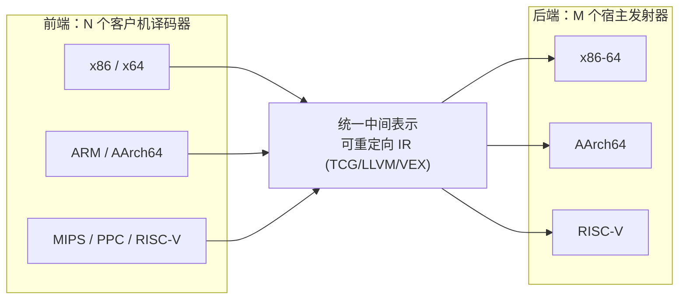
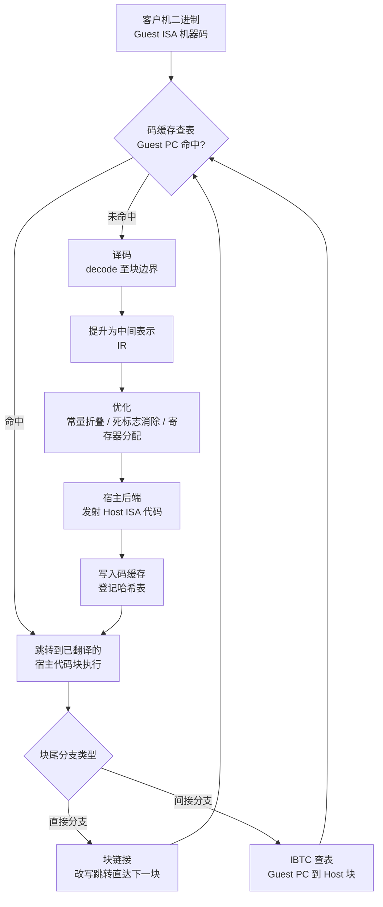
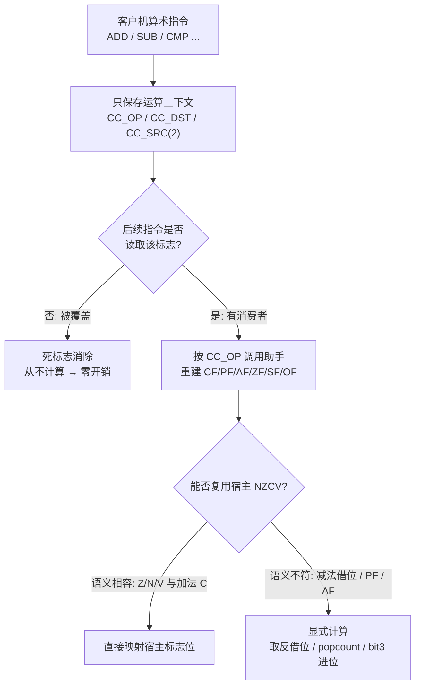
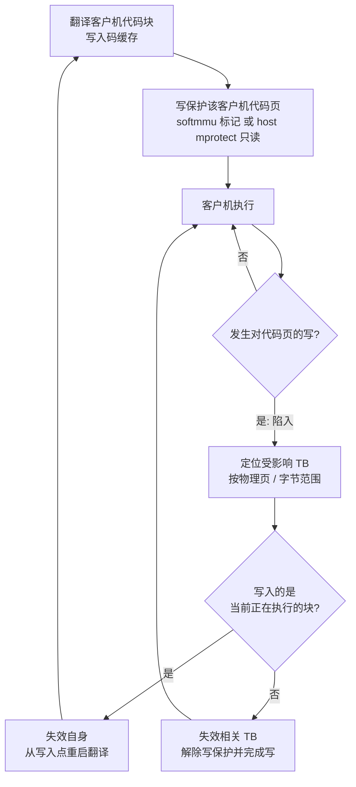

# 动态插桩与模拟执行引擎（13）· 动态二进制翻译器设计：跨架构转译
> [!abstract] TL;DR
> - 跨架构 DBT 的难点不在“翻译一条指令”，而在弥合客户机与宿主机之间的**阻抗失配**：寄存器数量方向不对称、标志位语义不同、内存序强弱不同、字节序与位宽不同——同架构 DBI（Pin/DynamoRIO/Frida）几乎不必面对这些。
> - **寄存器映射**有两极：寄存器堆常驻内存（简单、正确、慢）与硬映射到宿主寄存器（快，需宿主寄存器数 ≥ 客户机）；x86-64(16)→AArch64(31) 可全量硬映射，AArch64(31)→x86-64(16) 则寄存器紧张只能块内择热。
> - **标志位**用惰性求值（QEMU 的 `CC_OP` 只存运算上下文、用时重建）避免为每条算术指令白算六个标志；复用宿主 NZCV 时要当心**减法借位反转**（x86 CF=借位，ARM C=无借位，取反才等价），PF/AF 无宿主对应必须显式算。
> - **自修改代码（SMC）**是正确性红线：写保护已翻译页、写入即陷入并失效相关翻译块；x86-on-ARM 因 x86 指令缓存天然一致、客户机不发 icache 维护，DBT 必须自己捕获每次代码写，比 ARM-on-x86 更保守。
> - 中间表示（IR）把 N×M 个翻译器降为 N 前端＋M 后端；块链接消除分发器往返、间接分支靠 IBTC 查表；精确异常约束了优化的激进程度。
> - 真实系统：QEMU-TCG（通用）、Rosetta 2（硬件 TSO＋AOT/JIT）、FEX-Emu/box64（游戏＋库桩接）、Windows xtajit/ARM64EC、历史上的 FX!32 与 Transmeta CMS。

## 概述与定位

动态二进制翻译（Dynamic Binary Translation, DBT）指在运行时把**客户机指令集（guest ISA）**的机器码翻译成**宿主机指令集（host ISA）**的机器码，缓存翻译结果并在宿主 CPU 上原生执行。当 guest ISA ≠ host ISA 时，就是本篇的主题——**跨架构转译**；当 guest = host 时（Pin、DynamoRIO、Frida-Stalker 所做的），翻译并不改变指令语义，只是插入探针，本系列前面第 3～5 篇已详述。二者的工程难度不在一个量级：同架构 DBI 里“客户机寄存器就是宿主寄存器、标志位天然一致”，唯一要操心的是代码缓存的自修改与控制流；而跨架构 DBT 必须逐项弥合两套硬件抽象之间的**阻抗失配**。

本篇在系列中的定位需要与相邻篇明确切开：第 7 篇讲“解释 vs 二进制翻译”的**概念**，第 8 篇深挖 **QEMU-TCG 的具体实现**（IR、翻译块、码缓存），第 9 篇讲 **Unicorn 的实战用法**。本篇不重复这些，而是聚焦跨架构转译的**设计难题本身**：为什么寄存器映射有方向性、标志位为什么要惰性、自修改代码为什么在 x86-on-ARM 上更棘手、内存序/字节序/精确异常如何桥接。换句话说，前几篇教你“翻译器长什么样、怎么用”，本篇回答“要正确且快地跨架构，工程上必须解决哪些硬骨头，以及为什么”。

跨架构之所以难，本质是两套 ISA 对同一份“计算”的建模不同：寄存器数量与别名规则不同、算术标志的产生与语义不同、内存一致性模型强弱不同、字节序不同、指针宽度不同、浮点/SIMD 语义与宽度不同、CISC 与 RISC 的指令粒度不同。任何一处处理错误都不会报错，只会让被翻译的程序**悄悄地算错**——对逆向分析而言，这等于分析结论失真。

一个绕不开的架构决策是 **N×M 问题**：若要支持 N 种客户机、M 种宿主，直接写 N×M 个专用翻译器不可维护。主流做法是引入**统一中间表示（IR）**，把系统拆成 N 个前端（客户机译码→IR）与 M 个后端（IR→宿主发射），复杂度降为 N＋M。QEMU 用 TCG IR，HQEMU/部分商用方案用 LLVM IR，Valgrind 用 VEX（主要同架构）。代价是多一层抽象、可能损失 ISA 特有优化，换来的是可重定向性。



DBT 还分两种部署形态：**用户态模拟**只翻译一个进程、把客户机系统调用转译并转发给宿主内核（需 ABI/syscall 翻译）；**全系统模拟**连 CPU、MMU、外设一起模拟、跑整个操作系统（需软件 MMU/softmmu）。跨架构在这两种形态下侧重点不同，本篇原理以用户态为主线，涉及全系统处按需点出。

## 原理与机制

一个跨架构 DBT 的执行主循环可以拆成清晰的流水线。理解它，后面三大难题才有落点。

**执行引擎与分发器**：核心是一个循环，拿着当前**客户机 PC**去码缓存哈希表查找。命中就直接跳到对应的宿主代码块执行；未命中则触发翻译。

**译码与提升**：从当前 PC 开始译码客户机指令，直到遇到块边界（分支、调用、返回，或页尾）。这一段构成一个**翻译块（Translation Block, TB）**，通常对应一个客户机基本块。逐条把客户机指令语义提升为 IR。

**优化**：在 IR 上做常量折叠、死代码/**死标志消除**、活跃性分析、块内寄存器分配。这是把“逐指令朴素展开”变“接近编译器输出”的关键。

**宿主发射与登记**：后端把优化后的 IR 发射成宿主机器码，写入码缓存，并在哈希表登记 `guest PC → host code`。

**执行与块链接（block chaining）**：执行到块尾，本可以返回分发器再查表，但那样每块都要往返一次分发器，开销巨大。**块链接**把块尾的分支直接改写（patch）成跳到后继块的宿主地址，绕过分发器。直接分支好办；间接分支（`ret`、`jmp reg`、`call reg`）目标运行时才知道，需要**间接分支目标缓存（IBTC）**做 `guest PC → host code` 的快速查表，`ret` 还可用返回地址栈（影子栈）预测。块链接是跨架构 DBT 最重要的性能优化，间接分支查表则常是链接之后剩下的头号开销。



**客户机状态（CPUState）**是贯穿全篇的核心数据结构：它是内存里一个结构体，容纳客户机的寄存器堆、PC、标志位上下文、浮点/SIMD 状态、段基址等——是客户机 CPU 的“规范快照”。翻译出的宿主代码，本质就是在读写这个结构体（或它被映射到的宿主寄存器）。**状态同步点**很重要：在块边界、可能触发异常的指令处、系统调用处，被映射进宿主寄存器的客户机寄存器必须**写回** CPUState，否则异常/信号看到的状态就不一致——这直接牵出后面的“精确异常”。

许多设计还保留**解释器回退**：冷代码（可能只跑一次）直接解释，热代码才翻译，避免为一次性代码付翻译成本。更进一步是**分层翻译（tiered）**：第一层用模板式快速 JIT，逐指令展开、几乎不优化，追求极低启动延迟；探测到热块后再用优化编译器重译（寄存器分配、标志消除、trace 形成）。FX!32 先解释＋后台 AOT、HQEMU 用 LLVM 做热层、Rosetta 2 做整程序 AOT＋运行时 JIT，都是这一思想的变体。

## 核心难题详解：寄存器映射、标志位与自修改代码

这一节是本篇的重心。前两个难题（寄存器、标志位）决定**性能**，第三个（SMC）决定**正确性**，另外三个跨架构专属问题（内存序、字节序/位宽、精确异常/间接分支）决定**能否算对且不崩**。

### 寄存器映射

客户机寄存器该放在哪里？两个极端：

**其一，寄存器堆常驻内存**。把整个客户机寄存器堆放进 CPUState 结构体，每次访问客户机寄存器都是一条 load/store。简单、正确、可移植，但慢——因为绝大多数指令都要碰寄存器。QEMU 的基线就是如此：TCG 把这些内存中的“全局量”按块加载进宿主临时寄存器、在块内做寄存器分配，块尾写回。

**其二，硬映射（register pinning）**。把特定客户机寄存器固定绑定到特定宿主寄存器，贯穿整个程序运行。快，但前提是**宿主通用寄存器数量 ≥ 客户机寄存器数 ＋ 若干临时**。

于是**方向性**成了寄存器映射最重要的性质：

```
方向 A：x86-64 (16 GPR) 客户机  →  AArch64 (31 GPR) 宿主   —— 宿主寄存器充裕，可全量硬映射
  Guest RAX/RBX/.../R15 (16个)  ->  固定绑定到一组 Host X 寄存器
  Guest RSP  ->  通常不映射到 Host SP（AArch64 的 SP 有 16 字节对齐约束，且不能当普通操作数），
                 而是放进一个普通 Host GPR
  Guest RIP  ->  不占寄存器，由块链接 / 分发器隐式维护
  Guest RFLAGS ->  惰性上下文寄存器(CC_*) ＋ 复用 Host NZCV
  余下 Host 寄存器 ->  临时 / 溢出 / CPUState 基址指针

方向 B：AArch64 (31 GPR) 客户机  →  x86-64 (16 GPR) 宿主   —— 宿主寄存器紧张
  无法全量固定；寄存器堆常驻 CPUState，块内只把“最热”的几个分配到 Host GPR，块尾写回。
```

这解释了一个反直觉的事实：**x86-on-ARM 的寄存器映射比 ARM-on-x86 更省心**，因为 16 个客户机 GPR 装进 31 个宿主 GPR 绰绰有余，Rosetta 2、FEX-Emu 都对 x86 寄存器做固定映射；反过来 31 装进 16 就得取舍。

跨架构映射还有几个隐蔽陷阱：

- **部分寄存器/别名**。x86 的 `AL/AH/AX/EAX/RAX` 相互重叠，写 `AL` 要保留 `RAX` 高位；`AH` 更是取 bit 15:8。ARM 的 GPR 没有这种“写子寄存器保留上位”的语义，模拟 x86 部分寄存器写就得用掩码＋插入（`BFI` 之类）序列——这是 x86-on-RISC 的一项固定税负。
- **栈指针与特殊寄存器**。如上，客户机 RSP 常不敢直接放宿主 SP。段基址（x86 的 FS/GS 常用于 TLS）没有 ARM 对应物，要单独模拟。
- **临时寄存器占用**。翻译器自己也需要客户机不可见的宿主临时寄存器，进一步吃掉可用于硬映射的名额。
- **溢出（spilling）**。块内 IR 需要的临时超过宿主寄存器数时，得溢出到 CPUState 或宿主栈。
- **调用约定**。翻译代码调用运行时助手（helper，用于复杂操作）时，必须遵守宿主 ABI，保存/恢复那些落在宿主调用者保存寄存器里的客户机寄存器。
- **向量寄存器**。XMM/YMM ↔ NEON/SVE 也要映射，且**宽度失配**（AVX-512 的 512 位 vs NEON 128 位）要拆成多条或借助 SVE。

### 标志位（惰性求值与借位反转陷阱）

标志位是跨架构最容易“又慢又错”的地方。根子在于两种 ISA 的标志哲学相反：**x86 几乎每条算术/逻辑指令都更新 EFLAGS**（`ADD/SUB/CMP/AND/INC/DEC/SHL`…，六个算术标志 CF、PF、AF、ZF、SF、OF）；而 **ARM 只有带 `S` 后缀的指令才更新 NZCV**，且**根本没有 PF、AF**。若朴素翻译，就得在每条 x86 算术指令后把六个标志全算一遍——可这些标志绝大多数根本没人读。

```
x86 EFLAGS 关键算术标志：
  CF(bit0) 进位/借位     PF(bit2) 结果低 8 位的偶校验     AF(bit4) bit3 向 bit4 的进位(BCD 用)
  ZF(bit6) 结果为零      SF(bit7) 符号位(结果 MSB)         OF(bit11) 有符号溢出
ARM NZCV：
  N(负)=SF     Z(零)=ZF     C(进位)     V(有符号溢出)=OF
```

**解法一：惰性求值（lazy flags）**。这是业界标准。以 QEMU 为例：算术指令执行时**不算标志**，只保存“运算上下文”——`CC_OP`（是哪种运算）、`CC_DST`（结果）、`CC_SRC`/`CC_SRC2`（操作数）。真正有指令要**读**标志时，才按 `CC_OP` 调用助手函数把标志重建出来。妙处在于：如果后续指令在任何标志被读之前又覆盖了 `CC_OP`/`CC_DST`…，那次重建**从不发生**——这等于**免费的死标志消除**。惰性求值把“为每条指令付六标志”的开销，降为“只为真正被消费的标志付费”，而 PF、AF 恰恰几乎无人读，收益巨大。配合块内**标志活跃性分析（dead flag elimination）**，能进一步在编译期就删掉产死标志的计算；跨块则保守假设活跃。



**解法二（快路径）：复用宿主标志**。若客户机运算能映射到语义相容的宿主运算，就直接借宿主 NZCV，省去重建。哪些相容、哪些不相容，是必须逐位核对的硬知识：

```
减法借位陷阱（跨架构标志头号坑）：
  x86:  SUB / CMP 后  CF = 1  表示“有借位”（无符号 a < b）
  ARM:  SUBS       后  C  = 1  表示“无借位”（a >= b）        —— 两者相反！
  ==> 想用宿主 C 当 x86 CF，减法路径必须取反(NOT)
  多精度：x86 SBB 用 CF 作“借位入”；ARM SBC 用 C 作“(反相的)借位入”
          进位链要逐位对齐语义，否则大数减法悄悄错一位
其余对应：
  ZF <-> Z（相容）   SF <-> N（同为结果 MSB，相容）   OF <-> V（加减有符号溢出，相容）
  加法 CF <-> C（进位出，相容）   ← 只有减法才反
  PF、AF：ARM 无对应，必须显式算（PF = 低8位 popcount 的最低位取反；AF = (a^b^result)>>4 & 1）
```

“减法借位反转”是经典事故点：x86 的 CF 是“借位”，ARM 的 C 是“无借位”，二者相反，直接复用会让所有涉及 CF 的无符号比较、带借位减法（`SBB`/`SBC`）、多精度算术全部错掉，而且不报错。反方向（ARM 客户机在 x86 宿主上）同理，只是取反的位置对调，且因 ARM 只在 `S` 指令置标志，标志计算次数天然更少。Apple Silicon 为 Rosetta 2 提供了硬件层面的 x86 标志加速与 TSO 内存模式，让这类高频操作接近零成本；FEX/box64 则靠“惰性＋合法处复用宿主标志”逼近。

### 自修改代码（SMC）：检测与失效

前两个难题错了是“慢”，SMC 错了是“算错且可被规避”——它是正确性红线。**问题**：客户机若写入了已被翻译并缓存的代码，缓存里的宿主代码就**过时**，必须失效并重译，否则会执行旧代码。加壳程序、JIT（JS/JVM/.NET）、自解密恶意代码、内联 trampoline 全都会这么干。

**检测机制**：

- **全系统（softmmu）**：QEMU 用每页位图记录“该客户机物理页含已翻译 TB”。软件 TLB 对这种页的表项打上“含代码”标记，使写操作陷入慢路径（`notdirty` 写），先失效该页上重叠的 TB，再执行写。
- **用户态**：借宿主 MMU——把“含已翻译代码”的宿主页 `mprotect` 成只读；客户机写触发 `SIGSEGV`，处理器定位该页、失效相关 TB、解除保护，再重启。



**粒度**：页级（粗——一页上任何写都失效整页所有 TB，即便没碰到代码）vs 子页/字节级（细——只失效被真正改动字节所覆盖的 TB）。粗粒度实现简单，但当**代码与数据同页**（JIT 常见）时会疯狂抖动；QEMU 用逐 TB 的物理范围跟踪来收窄失效面。

**最棘手的自身修改**：客户机写入的正是**当前执行的 TB**（在 PC 前方写代码，或覆盖即将执行的指令）。必须检测到、失效自身、并从写入点用新字节**重启翻译**。QEMU 对此做专门处理（标记 TB 失效并重启）。

**跨修改代码（cross-modifying code, SMP）**：CPU A 写 CPU B 正在执行的代码。这里藏着跨架构最深的一处不对称——**指令缓存一致性模型不同**：真实 x86 的 icache 是一致的（写代码后经一次序列化即可被取指看到，软件无需显式维护）；ARM 的 icache **不一致**，需显式 `IC IVAU`＋`DSB`＋`ISB`。于是：**模拟 x86-on-ARM 时，客户机根本不会发 icache 维护指令**（因为 x86 不需要），DBT 就**必须自己捕获每一次代码写**，绝不能指望客户机给提示——这使 x86-on-ARM 的 SMC 处理必须**严格更保守**。反过来模拟 ARM-on-x86，客户机会显式发屏障/IC 操作，给了 DBT 现成的失效点（但完全正确的实现仍要兜住“依赖一致性”的客户机）。

**性能与缓解**：SMC 检测有真实成本，JIT 密集负载（浏览器）最惨。缓解手段包括：把代码/数据分到不同页、细粒度跟踪、惰性重加保护、抖动滞回（一页在代码/数据间反复横跳时，退化为解释其写入或逐指令校验）。

### 三个跨架构专属配套问题

**内存序与原子性**。x86 是强序（TSO），ARM 是弱序。把 x86 客户机翻到 ARM 宿主，朴素翻译会**丢掉排序保证**，出现真机上不会有的数据竞争。正确做法是围绕客户机访存插入屏障（`DMB`）、把客户机原子指令映射到宿主 LL/SC（`LDXR`/`STXR`）或 LSE 原子——“到处插屏障”正确但慢。Rosetta 2 借 Apple 硬件 TSO 模式（线程级开关）近乎免费地拿到 x86 序；其他方案只能选择性插栅栏，很难做对。反方向 ARM-on-x86 因宿主更强，多数免费，但客户机显式屏障变空操作，`LDXR/STXR` 仍需映射到 `LOCK/CMPXCHG`。

**字节序与位宽**。大端客户机（MIPS/PPC/SPARC/s390x）在小端宿主上，每次访存都要字节交换（`REV`）；QEMU 把端序编码进内存操作。32 位客户机跑 64 位宿主要做地址掩码/softmmu；64-on-32 很难、如今罕见。浮点上，x87 的 80 位扩展精度没有 ARM 对应物，只能软浮点或近似，还要处理 NaN 传播、舍入模式、非规格化数（FTZ）差异。

**精确异常与间接分支**。客户机指令出错时，DBT 必须能重建**出错那一刻**的精确客户机状态（所有寄存器、PC）。而重排、标志消除、寄存器映射等优化都会破坏这种可重建性。QEMU 的办法是重启 TB、借助保存的检索数据重新推导到出错点；被映射的寄存器在异常处必须先写回 CPUState。**这就从根本上约束了优化能有多激进**——正确性优先于速度。间接分支前已述，靠 IBTC 与影子栈，是链接之后的主要残余开销。

## 工具视角与实战

把上述原理落到真实系统，能看清各家如何取舍。

- **QEMU 用户态**（`qemu-x86_64`、`qemu-aarch64`）是学习跨架构翻译的最佳观察窗。跑异架构 Linux 二进制，并用 `-d in_asm,op,out_asm` 一次性打印**客户机汇编、TCG IR 操作、宿主汇编**三段对照，`-d op_opt` 看优化后 IR。你能亲眼看到一条 x86 `ADD` 如何变成宿主若干条指令、标志如何（不）被计算、块如何链接。配合 binfmt_misc 可让内核透明地用 QEMU 运行异架构 ELF。
- **Rosetta 2**（macOS on Apple Silicon）把 x86-64 翻到 AArch64：安装/首启时做**整程序 AOT**（缓存在 `/var/db/oah`），对运行时生成的代码用 **JIT**（页需 `MAP_JIT`）；靠硬件 TSO 与标志加速，典型负载能到原生的七八成。`arch -x86_64` 可强制以 x86 运行。
- **FEX-Emu**：x86/x64 → AArch64（Linux），自研 IR＋JIT，可选把系统库**桩接（thunk）**成原生库，常与 Wine/Proton 组合打游戏。
- **box86/box64**：x86(_64) → ARM，招牌优化正是**不模拟系统库、而包裹原生 ARM `.so`**（库桩接）以提速，dynarec 实现，在树莓派/掌机/复古游戏圈流行。
- **Windows on ARM**：x86/x64 模拟由 `xtajit(64).dll`（JIT）＋ **XTA 缓存**（把热代码编译结果缓存，FX!32 式 AOT）承担；**ARM64EC** 这套 ABI 允许在同一进程里混合原生 ARM64 与被模拟的 x64（配合 CHPE），是很聪明的兼容折衷。
- **历史坐标**：**FX!32**（x86-on-Alpha，profile-guided AOT，跨架构 DBT 的鼻祖）、**Transmeta CMS**（x86-on-VLIW，翻译藏在固件里、对外只“是一颗 x86”）、**Apple Rosetta 1**（PPC-on-x86，源自 Transitive QuickTransit）、**IA-32 EL**（x86-on-Itanium）。它们奠定了“解释→profile→后台重编译→缓存”的分层范式。

**逆向实战视角**：用户态 QEMU＋插桩可在本机跑异架构恶意样本/固件并做 trace（与第 11 篇 Qiling 的 rehost 呼应）；观察 SMC 失效事件能辅助脱壳（写→失效→重译，正是壳自解密的信号）；需要外科手术式仿真单函数时用 Unicorn（见第 9 篇）。想弄懂某条指令的寄存器映射与标志处理，读 QEMU 的 `out_asm` 最直接。

## 安全性与正确使用

**正确性即安全性**。跨架构 DBT 的错误几乎都是**静默**的：一次借位没取反、一道内存屏障漏插，被翻译程序就换了行为——用于分析时导致结论失真，用于兼容运行时可能被攻击者利用来制造“真机一套、翻译一套”的行为分叉。因此标志语义、内存序、精确异常这些细节不是“锦上添花”，而是安全属性。

**SMC 是安全关键的正确性特性**。若 DBT 对自修改/自解密处理不当，恶意代码就能“分析器看到的是 A、实际执行的是 B”，从而规避分析；加壳器正是专门冲着 SMC 路径去压测。做全每一次代码写的捕获（尤其 x86-on-ARM 那种客户机不发 icache 维护的情形），既是性能问题也是防规避问题。

**模拟可被探测**（本篇点到为止，对抗细节见第 14 篇）。跨架构 DBT 存在可观测痕迹：翻译开销与首跑 JIT 尖峰造成的时序异常、边角语义不完美（x87 80 位、某些指令后 AF/PF 的未定义行为、罕见标志组合）、SMC 引发的减速、TLB/段的细节。恶意代码可探测这些痕迹判断“我在被模拟”，进而改变行为。依赖 DBT 做分析时要意识到**翻译后的时序不代表真机**。

**W^X 与 JIT 卫生**。DBT 自身在运行时生成代码（码缓存），必须对 W^X 友好：先写后翻转为可执行、macOS 用 `MAP_JIT`、或双重映射。在加固宿主（PXN、hardened runtime、SELinux）上，码缓存管理稍有不慎就要么留下“可写又可执行”的页（安全漏洞），要么直接崩。原则是**码缓存页绝不可同时可写又可执行**。

**沙箱边界**。用户态模拟会把客户机 syscall 转发给宿主内核——若不加 seccomp/系统调用过滤，被模拟的恶意样本能触达真实宿主资源。用裸的用户态 QEMU 跑未知恶意样本而不加沙箱，等于放它上真机。**DBT 本身不是安全边界**：“它是被模拟的”不等于“它被隔离了”。分析不可信样本时，优先用全系统模拟或 Qiling 式受控 rehost（见第 11 篇），并对你依赖的边角语义用真机交叉验证。

## 小结

跨架构动态二进制翻译的难点，不在“翻一条指令”，而在弥合两套硬件抽象之间的阻抗失配。**寄存器映射**要在“常驻内存的简单正确”与“硬映射的高速”间按方向取舍——x86-on-ARM 因宿主寄存器充裕可全量固定，反向则要块内择热；还要处理部分寄存器别名、栈指针约束、向量宽度失配。**标志位**用惰性求值（存上下文、用时重建、免费死标志消除）避免为每条算术指令白算六个标志，复用宿主 NZCV 时死守“减法借位反转”与“PF/AF 无对应须显式算”两条铁律。**自修改代码**是正确性红线，靠写保护＋失效重译，且因指令缓存一致性模型不同，x86-on-ARM 必须比 ARM-on-x86 更保守。配套还要桥接内存序（强序客户机在弱序宿主上要插屏障/映射原子）、字节序与位宽、以及约束优化激进度的精确异常。IR 把 N×M 降为 N＋M，块链接消分发器往返、IBTC 解间接分支。相较同架构 DBI，跨架构在每一维都更难，而且**错误静默**——所以工程上正确性始终压倒速度。

## 相关阅读

- 本系列上游：[[07.CPU模拟原理：解释与二进制翻译]]（概念基座：解释 vs 翻译）、[[08.QEMU-TCG动态二进制翻译]]（TCG IR 与翻译块的具体实现）、[[09.Unicorn-Engine与CPU模拟实战]]（外科手术式仿真的实战用法）。
- 本系列相邻：[[10.全系统模拟与外设建模]]（softmmu 与设备）、[[11.固件rehost：Qiling与HALucinator]]（rehost 场景）、[[12.插桩驱动的分析：覆盖率与污点与trace]]（trace/覆盖率）、[[14.反插桩与反模拟对抗]]（模拟探测与对抗）。
- 静态对偶：[[45.反编译器与反汇编引擎原理/01.反汇编算法：线性扫描与递归遍历]]（静态译码/反汇编引擎，与本篇动态译码前端互为镜像）。
- Hook 承接：[[32.hooks/09-frida]]（Frida 用法）延伸到本系列的 Gum/Stalker 内部机制。
- 固件呼应：[[39.固件与IoT嵌入式逆向/23.固件仿真进阶Qiling与HALucinator]]（用跨架构模拟跑异构固件）。
- 下游应用：[[49.Fuzzing与漏洞挖掘/00.Fuzzing与漏洞挖掘总览]]（模拟＋插桩驱动的模糊测试、污点分析与脱壳）。
- 官方文档与经典文献（按名索引，非搬运外链）：QEMU 官方文档 TCG/Translator 章节；Fabrice Bellard, “QEMU, a Fast and Portable Dynamic Translator”（USENIX ATC 2005）；R. Hookway & M. Herdeg, “DIGITAL FX!32: Combining Emulation and Binary Translation”；Transmeta “Code Morphing Software” 技术白皮书；Apple 开发者文档《About the Rosetta Translation Environment》。

[[00.动态插桩与模拟执行引擎总览|⬆ 系列总览]] | [[12.插桩驱动的分析：覆盖率与污点与trace|← 上一章]] | [[14.反插桩与反模拟对抗|→ 下一章]]