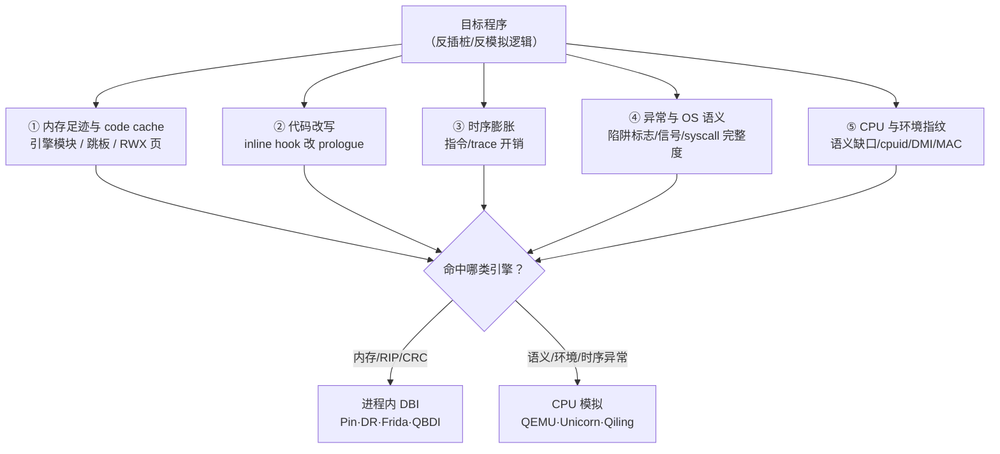
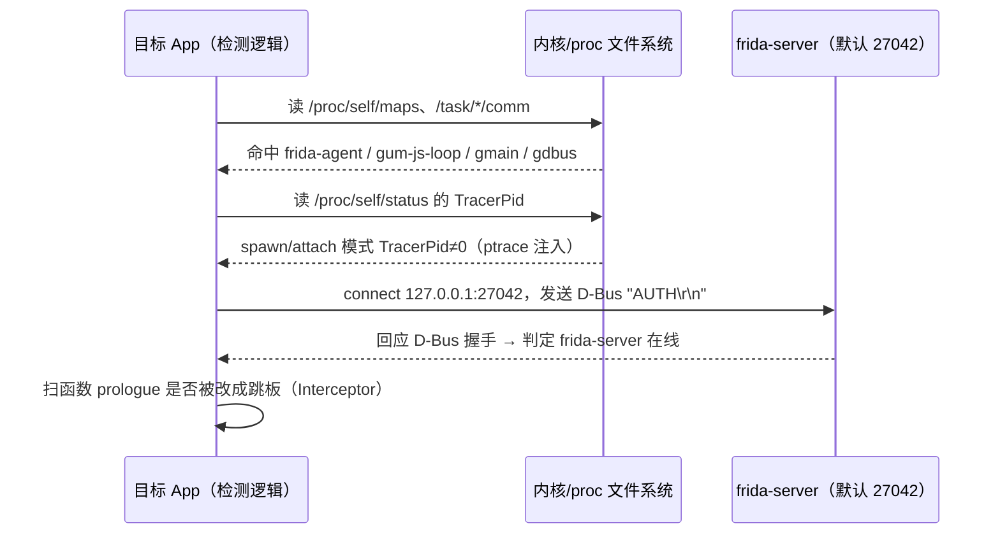
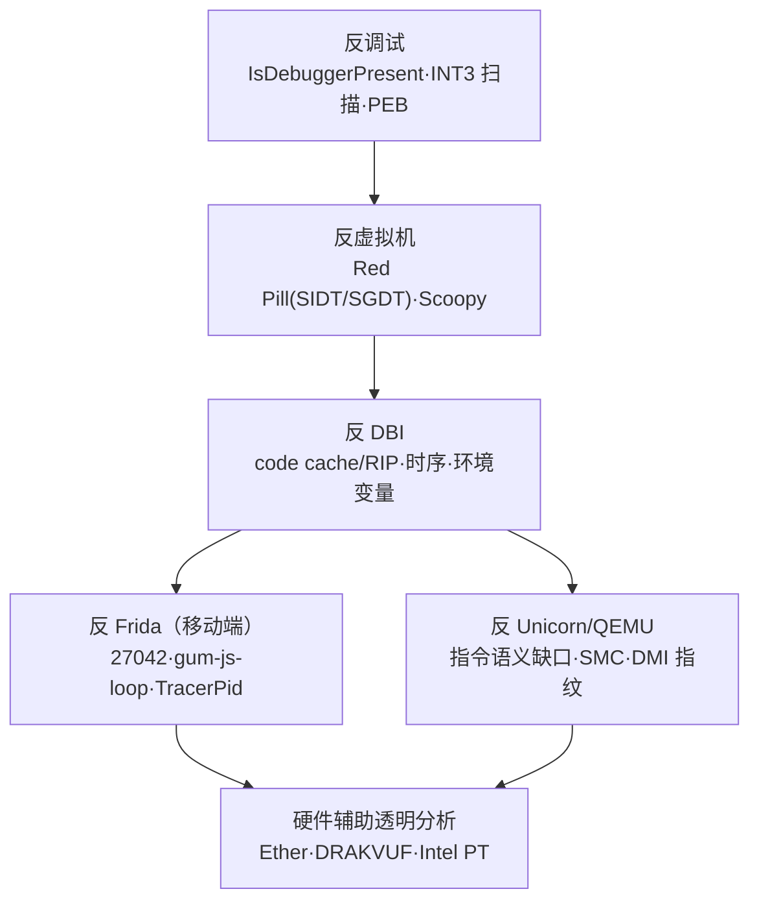

# 动态插桩与模拟执行引擎（14）· 反插桩与反模拟对抗
> [!abstract] TL;DR
> - 任何插桩/模拟都会扰动被观测系统，反插桩的本质是寻找"观测者副作用"：内存足迹、代码改写、时序膨胀、异常语义、CPU/环境指纹五大轴，五轴分别命中不同引擎。
> - 时序检测（RDTSC 与多时钟源交叉）打的是 DBI/Emu 的执行开销；自省检测（`/proc/self/maps`、`.text` 校验和、RIP 泄露）打的是内存与 code cache 痕迹——两类正交、互补。
> - 关键分野：inline-hook（Frida Interceptor / Substrate）改写原始 prologue，被 `.text` 校验和秒杀；copy-and-instrument（Pin / DynamoRIO / Stalker）不改原码但泄露 code-cache 地址（RIP disclosure）。二者需不同检测器，也需不同规避。
> - Frida 检测走签名（27042 端口、`gum-js-loop` 线程、`frida` 字符串、`TracerPid`），绕过靠改签名（Gadget 模式、魔改版改名）——但签名对抗只是打地鼠；稳健检测用不变量、稳健规避必然收敛到"透明化引擎工程"。
> - 反模拟命中 Unicorn/QEMU 的语义缺口：未实现指令、EFLAGS 未定义位、syscall 缺桩、SMC 失效窗口、`cpuid` hypervisor 位与 DMI/MAC 环境指纹。
> - 透明性在一般意义上不可完全实现（可枚举无穷多痕迹），因此这是工程化军备竞赛；防御与研究者需系统掌握检测面，才能评估并加固自有分析环境的隐蔽性。

## 概述与定位

本系列前十三篇一路把"观测者"造了出来：Pin（03）、DynamoRIO（04）、Frida-Gum 与 Stalker（05）、QBDI（06）是**同架构、进程内插桩**（DBI）；QEMU-TCG（08）、Unicorn（09）、全系统模拟（10）、Qiling/HALucinator（11）是**跨/同架构 CPU 模拟**（Emulation）。本篇把镜头掉转 180 度：站在**被观测者**一侧，看目标程序如何察觉自己正被插桩或被模拟，并据此改变行为——这就是反插桩（anti-instrumentation / anti-DBI）与反模拟（anti-emulation）。

谁会写这类代码？现实里有三类玩家。其一是**恶意软件**，它要躲开自动化沙箱与分析师的动态环境，一旦发现被观测就潜伏、退出或走无害分支（sandbox evasion）。其二是**保护壳与加固**，从 PC 端的 Themida/VMProtect 到移动端的各类商业加固方案，用反调试、反 Hook、反模拟给自身代码筑墙。其三是**反作弊与 DRM**，游戏反作弊内核、内容保护要防止运行期被 Hook 篡改。反过来，**防御方**同样需要吃透这些向量：只有知道分析环境会在哪里露馅，才能评估自建沙箱的透明度、加固自研 App、并在恶意样本对抗时识破其"装死"。

从工程上，被观测引擎天然分成两大家族，对抗手法也随之分家：

- **反插桩**针对进程内、同 ISA 的重写式观测（Pin/DR/Frida/QBDI）。此时引擎的 code cache、跳板、自身模块**就住在目标的地址空间里**，痕迹近在咫尺。
- **反模拟**针对 CPU 语义的软件重放（QEMU/Unicorn/Qiling）。此时目标"整个世界"都是假的，破绽藏在**指令语义的完整度**与**外设/环境指纹**里。

贯穿两家族的统一理论是**透明性（transparency）**：一个理想引擎应当与裸机不可区分。但正如量子测量的观测者效应，任何观测都要消耗资源、留下副作用，**完美透明在一般意义上不可实现**（后文给出为何）。因此本篇不是"如何隐身"的秘籍，而是一份**透明性违规的系统目录**，外加这场军备竞赛的结构性规律。它与静态一侧的对偶恰好互补：静态分析被混淆/加壳击败（见 [[45.反编译器与反汇编引擎原理/01.反汇编算法：线性扫描与递归遍历]]），动态分析被本篇这些反插桩把戏击败——攻防双方都必须同时经营两条战线。

## 原理与机制

一切反插桩/反模拟的元原理只有一句：**观测者副作用不可完全隐藏**。观测要占内存、要改代码、要花时间、要接管异常、要重放 CPU 语义，每一项都可能被目标反过来"测量"。把这些副作用归纳，得到五条正交的检测轴：



- **① 内存足迹与 code cache**：进程内 DBI 把自身运行时（`pinbin`、`libdynamorio.so`、`frida-agent`）、翻译后的 code cache、inline 跳板都放进目标地址空间；用户态模拟里，`/proc/self/maps` 暴露的是宿主进程视图。任何"读自己内存/枚举模块"的能力都能撞见它们。
- **② 代码改写**：只有 inline-hook 式引擎（Frida `Interceptor`、Substrate）会**改写原始函数首字节**为跳转；copy-and-instrument 式引擎（Pin/DR/Stalker）**不动原码**，改的是拷贝。这条轴把两种引擎劈成两半，后文详解为何一个检测器抓不全。
- **③ 时序膨胀**：翻译、分发、插桩回调都要 CPU 周期。裸机跑 N 条指令约 N 个周期量级，DBI 下可放大 10–100×，模拟下更甚。用 RDTSC/性能计数器测"该快的地方为何这么慢"。
- **④ 异常与 OS 语义**：单步陷阱标志（TF）、断点（INT3/ICEBP）、信号/SEH 的投递时序与错误码，以及模拟器的 syscall 完整度，都会与真机产生可测差异。
- **⑤ CPU 与环境指纹**：模拟器实现不了全部指令语义（未定义 EFLAGS 位、罕见/新扩展指令），全系统模拟还带着 `52:54:00` 的 MAC、SeaBIOS/i440FX 的 DMI 串等"出厂标签"。

这里要区分两种目标策略，其危害度对分析师截然不同：**检测（detection）**是"先指纹、后决策"，测出被观测就跳到无害分支或退出——分析师至少能看到一次异常跳转；**抵抗（resistance）**则更阴险，它不声张，而是**让引擎在缺陷处静默算错**（例如故意用一条 Unicorn 会算错 EFLAGS 的指令决定后续解密密钥），于是分析得到的是**看似正常却全错**的结果。后者往往才是高级壳的杀手锏。

同样重要的是理解 DBI 与 Emu 的**痕迹画像不同**：DBI 与目标同处一个真实 CPU，语义天然正确（轴⑤基本免疫），软肋在轴①②③；模拟器语义是软件重放（轴⑤重灾区），但内存/CRC 未必露馅（它可以伪造 `/proc`）。选型时，"哪条轴对你的任务无所谓"决定了该用哪个引擎——这也是本篇最终的实战结论。

## 检测向量与对抗算法详解

本节把五轴逐一拆到可实现、可复现的粒度，并对每个向量给出"为何这样设计、命中哪类引擎、防御方如何中和、边界在哪"。

### 时序检测：RDTSC 与多时钟源交叉

RDTSC 读取处理器的时间戳计数器（TSC），把 64 位结果拆进 EDX:EAX：

```text
rdtsc：读 64 位 TSC，高 32 位→EDX，低 32 位→EAX
   63                     32 31                      0
  +------------------------+------------------------+
  |          EDX           |          EAX           |
  +------------------------+------------------------+
  |<------- TSC[63:32] --->|<------- TSC[31:0] ---->|
```

用法是**夹逼**：`rdtsc` 取 t0，执行一小段基准代码，再 `rdtsc` 取 t1，看 `t1-t0`。裸机上一段几十条整数指令是几十到几百周期；一旦落进 DBI，**每条指令/每个 trace 都要过分发器与插桩回调**，delta 会突增一两个数量级。这条向量的威力在于它**不依赖任何签名**——它直接测量"观测这件事本身要花多少时间"，因此对 Pin/DR/Frida/QEMU 一视同仁。

难点在**基准**。绝对时间需要一个不受污染的参照（网络时间、第二时钟源）；更常见的是**相对时序**：测"已知极廉价操作"与"已知较贵操作"的比值，比值畸变即暴露。而真正让防御方头疼的是**多时钟源交叉验证**：攻击者不只用 `rdtsc`，还会叠加 `rdtscp`（额外返回 `IA32_TSC_AUX` 即 CPU/NUMA 号）、`cpuid;rdtsc`（用 `cpuid` 序列化，防乱序把测量窗口漏出去）、VDSO 里的 `clock_gettime`、Windows 的 `QueryPerformanceCounter`/`GetTickCount`/`timeGetTime`/`GetThreadTimes`（线程周期）。防御方若只 Hook 了 `rdtsc` 并缩放返回值，攻击者拿另一个时钟一对，两条时间线**互相矛盾**立刻穿帮。于是"透明时钟"要求**所有时间源被一致地虚拟化到同一条缩放时间轴上**——这是个牵一发动全身的工程，也是时序对抗最深的坑。

DynamoRIO、Pin 都能拦 `rdtsc`（Pin 里 `INS_IsRdtsc` 可识别并插桩），QEMU 可虚拟化 TSC；但注意一个模拟专属的破绽：**用户态 QEMU 常把 `rdtsc` 直接透传给宿主 CPU**，而每条 guest 指令要耗宿主许多周期，于是相邻两次读数间会出现与"实际执行指令数"严重不成比例的巨大跳变——这本身就是一枚模拟指纹。

### 自省检测：内存映射、代码校验和与 RIP 泄露

自省是"程序读自己"。第一招是**扫映射表**。Linux/Android 读 `/proc/self/maps`，Windows 用 `VirtualQuery`/`EnumProcessModules`，在里面找引擎的名字：

```text
$ cat /proc/self/maps    # 命中痕迹（示意）
7f..-7f..  r-xp  ..  /usr/lib/frida/frida-agent-64.so   ← Frida 注入体
7f..-7f..  rwxp  ..  [anon]     ← Interceptor 跳板 / Stalker code cache（RWX 罕见！）
7f..-7f..  r-xp  ..  /path/pinbin                       ← Intel Pin
7f..-7f..  r-xp  ..  libdynamorio.so                    ← DynamoRIO
```

这里 `rwxp`（可读可写可执行）匿名页是**强信号**：正常程序极少需要 RWX，而 DBI 的 code cache、inline 跳板往往就是 RWX。硬化系统上"存在 RWX 页"几乎等价于"有人在动态改我"。

第二招是**代码校验和（self-CRC）**：运行期对自己的 `.text`（或磁盘映像）算 CRC32/哈希，与"出厂已知值"比对。这一招的精妙之处在于它**只命中 inline-hook**：Frida `Interceptor`/Substrate 会把目标函数首几字节改成跳到跳板的分支，`.text` 字节变了，CRC 立刻不符。而 Pin/DR/Stalker 是 copy-and-instrument——**原始 `.text` 一个字节都没动**，它执行的是拷贝，所以 CRC 检测**对它完全失明**。这就是为什么"只用 CRC 检测"会漏掉半壁江山。

补上另一半的是**RIP/EIP 泄露**，它专抓 copy-and-instrument：

```asm
    call  next            ; 把返回地址（=next 的地址）压栈
next:
    pop   rax             ; rax = 当前真实执行地址
    ; 裸机：      rax ∈ 原始 .text 区间
    ; Pin/DR/Stalker：rax ∈ code cache 区间 → 与预期 .text 不符即暴露 DBI
```

原理是：copy-and-instrument 实际从 code cache 执行，程序计数器指向的是**缓存副本**而非原始地址。`call/pop` 把当前 RIP"具现"出来一读，就发现自己不在该在的 `.text` 里。类似地还能扫**栈上残留的返回地址**（凡 `call` 都在栈里留下一个指向 cache 的地址）、异常上下文里的 EIP、以及 FS/GS 相关状态。至此形成漂亮的**互补覆盖**：`.text` CRC 抓 inline-hook，RIP-disclosure 抓 copy-instrument，两者合璧才能覆盖两种重写风格。

Pin 与 DynamoRIO 的透明性工程会尝试**修补**这些泄露（拦截 RIP 相对寻址、控制流指令，把架构可见的 PC 值伪装回原始地址），但历史上从 `call` 压栈值、栈扫描、乃至某些角落里总有漏网——这正是 DynamoRIO 博士论文标题里"透明"二字的分量，也是它无法一劳永逸的根由。此外还有一批**环境自省**：Windows PEB 的 `BeingDebugged`/`NtGlobalFlag`、父进程名、以及 `LD_PRELOAD`、`DYNAMORIO_OPTIONS`、`PIN_*` 等启动引擎会留下的环境变量。

### Frida 检测：签名面板点与协议探测

Frida（移动端尤盛）之所以最常被专门针对，是因为它默认部署方式留下了**一整排签名**。把它们摊开：



- **端口/协议**：`frida-server` 默认监听 27042（副端口 27043），读 `/proc/net/tcp` 找该端口，或直接 `connect` 后按 D-Bus 握手（发 `AUTH\r\n` 看回应）判定其在线。
- **线程名**：`/proc/self/task/<tid>/comm`（或 `status`）里出现 `gum-js-loop`、`gmain`、`gdbus`、`pool-frida`——这些是 Gum 的 JS 事件循环与 GLib 线程。
- **映射与字符串**：`maps` 里的 `frida-agent`、`frida-gadget`、`linjector`，或在匿名可执行页里搜到 `"frida"`/`"gum"` 字符串常量。
- **TracerPid**：spawn/attach 模式经 `ptrace` 注入，`/proc/self/status` 的 `TracerPid` 非 0（一个进程只能被一个 tracer ptrace，这也顺带成了反调试点）。注意 **Gadget 模式**是把库直接编进/预加载进 App，不走 ptrace，此点即失效——这决定了后面的绕过思路。
- **inline 跳板**：扫 libc/关键函数的首字节，若 prologue 被改成跳向非 `.text` 区，就是 `Interceptor` 的痕迹（本质是上一节 CRC 思路的定点版）。
- **Android/ART 层**：Java 侧还能检查加载的 native 库、可疑导出符号、以及从 Java 读 `maps`。

这些统统属于**签名检测**——它们认的是"Frida 长这样的特征字符串/端口/名字"，而不是某种不变量。

### Frida 绕过与军备竞赛的收敛（研究/CTF 视角）

理解绕过，关键不是记住某个开关，而是看清它的**结构**。签名既然是"特征"，绕过就是"改特征"：用 **Gadget 模式**（无 27042、无 ptrace，配置文件可自定义命名）替代 frida-server；用**魔改版**（社区有若干把线程名、字符串、导出符号统统改名、端口随机化的分支）擦掉 `gum-js-loop`/`frida` 这些字面量；在 Android 上配合 Zygisk/Magisk 隐藏。这些都能让**基于字符串/端口的检测**扑空。

但这里有个**深层规律**必须点破：签名对抗是**打地鼠**——你改一个名，检测方加一个新特征，无穷无尽。真正稳健的检测**不靠签名，靠不变量**：`.text` CRC、RIP 泄露、时序膨胀，这些无论你怎么改名都在。而要规避一个不变量，你就得**把对应的不变量也虚拟化掉**：要骗过 CRC，就得在目标读自己代码时把读操作重定向回"干净副本"（影子读）；要骗过 RIP 泄露，就得把架构可见的 PC 值改回原址。**而这恰恰就是一个"透明 DBI"该做的全部工作**。于是攻防在此收敛：稳健的规避=把引擎做得更透明=DBI 引擎工程本身。军备竞赛不是无限发散的，它有一个吸引子叫透明性。

一个具体权衡值得记住：Frida 的 `Stalker`（其 DBI，见 [[05.Frida-Gum与Stalker内部机制]]）是 copy-and-instrument，**不改 prologue**，天然免疫 CRC，但会带来 code-cache 地址痕迹（RIP disclosure）；而 `Interceptor` 是 inline-hook，改 prologue，反被 CRC 抓。选哪个，取决于目标检测的是哪条轴——没有免费的隐身。

> 本小节仅在原理层讲清"为何签名可绕、绕到哪里失效"，用于授权环境与 CTF 的对抗理解，不构成针对任何真实 App 的成品配方。

### 异常与单步语义：陷阱标志、断点与信号

第四轴利用"异常处理很难被完美虚拟化"。经典是**陷阱标志 TF**：置 EFLAGS.TF 后每执行一条指令触发一次 `#DB`（Linux 下 `SIGTRAP`）。程序自设 SIGTRAP 处理器、`popf` 打开 TF、看单步是否**按真机语义精确投递一次**；DBI 若把 TF 吞掉或投递时机偏差即露馅。与之配套的还有 `INT3`（0xCC）、`INT 2D`、`ICEBP`（0xF1，未公开单字节陷阱）、`pushf/popf` 检验 TF 是否被清、以及 Windows 的 SEH/VEH：故意抛异常，用处理器里拿到的 EIP、异常码、以及"处理器被调用的次数/顺序"作为指纹。模拟器一侧，信号投递语义、缺失的 SEH 链、错误的异常码（例如访问越界该给 `SIGSEGV` 却给了别的）都是可测差异。

### 反模拟：CPU 语义缺口与环境指纹

反模拟的主战场是**指令语义完整度**。Unicorn 只模拟 CPU，**没有 OS、没有 syscall、没有 loader**：任何 `syscall`/`int 0x80`/`svc` 都陷出到 hook，若分析框架的桩不完整（返回值不对、`ENOSYS`），目标一测便知自己身处半个世界；FS/GS 基址若未布置，读 TEB/TLS 直接崩。更隐蔽的是**标志位与罕见语义**：Intel 手册规定某些指令后若干 EFLAGS 位"未定义"（如 `mul` 后的 SF/ZF/AF/PF、移位计数为 0 时的标志、`bt`/`rcl` 系），真机对这些"未定义"有**自洽且稳定**的取值，模拟器却可能给出不同结果；反模拟代码会**故意用这些分歧点决定控制流或解密密钥**，让 Unicorn 静默算错（这正是前述"抵抗"策略）。此外，新扩展（AVX-512/SHA/某些 AES 模式）模拟器未实现会 `#UD`，而 `cpuid` 又谎称支持——"声称支持却执行失败"本身就是矛盾指纹。

QEMU-TCG 多一层**自修改代码（SMC）**破绽：它把基本块译成 TB 缓存，靠页写保护+脏页追踪来失效重译；在"写入正被执行的 TB 所在页"这种角落存在行为/时序窗口，反模拟用滚动改写下一条指令去撬。环境指纹方面：

```text
cpuid.EAX=1        → ECX bit31 = Hypervisor Present（裸机 0，虚拟/模拟常 1）
cpuid.EAX=40000000 → EBX:ECX:EDX = 12 字节厂商串
     "TCGTCGTCGTCG"  QEMU/TCG（纯软件模拟，直接自报家门）
     "KVMKVMKVM\0\0\0" KVM   "VMwareVMware" VMware   "Microsoft Hv" Hyper-V

全系统 QEMU 常见"出厂标签"：
  MAC OUI 52:54:00                          QEMU/KVM 虚拟网卡
  /sys/class/dmi/id/sys_vendor   = "QEMU"
  /sys/class/dmi/id/product_name = "Standard PC (i440FX + PIIX, 1996)"
  /sys/class/dmi/id/bios_vendor  = "SeaBIOS"
  磁盘/显卡 = virtio / Bochs / QXL
```

Qiling（见 [[11.固件rehost：Qiling与HALucinator]]）补上了 OS 层与 syscall，但战线随之前移到**桩的完整度与 rootfs 真实度**：未实现 syscall 返回 `ENOSYS`、`uname`/`/proc/cpuinfo` 内容、`getrandom`/时间的**确定性**（真机有抖动、模拟常可复现）、以及假 `/etc`、`/proc` 的破绽，都是可测点。

这些手法并非凭空冒出，它有清晰的历史脉络：



Red Pill（Rutkowska, 2004）用 `SIDT` 读 IDTR——在早期 VMware/VPC 上被重定位的 IDT 基址偏高，据此识别 VM；VT-x 普及后此招失效，但它示范了"读一个本不该暴露的系统寄存器"的思路，一路演化到今天的 code-cache 与 DMI 指纹。

## 工具视角与实战

站在**分析师/防御方**，实战核心是"识破并中和"这些把戏，方法论比单点技巧更重要。

**最有力的通用方法是差分执行（differential trace）**：把样本分别在"尽量真实"的环境与"待评估引擎"下各跑一遍，对齐两条 trace，**第一处分叉点几乎就是那次检测检查**。因为检测代码的模式恒定——先测量（读 maps/算 CRC/夹逼 RDTSC/探 cpuid），再据结果跳转，分叉点上游那几条指令就是指纹逻辑。配合 `strace`/`ltrace` 观察 `open("/proc/self/maps")`、`connect(...:27042)` 一类系统调用，能快速定位自省与 Frida 探测；而 `rdtsc`、`cpuid` 这类**用户态指令**追不到 syscall 层，需要指令级 trace（覆盖率/trace 工具见 [[12.插桩驱动的分析：覆盖率与污点与trace]]）。

**中和手段按轴对症**：时序——Hook 并**一致地**缩放全部时间源（单缩放一个必被交叉验证识破）；自省——用引擎的透明性开关（Pin 的相关 knob、DynamoRIO 的模块隐藏），或对目标读 `.text`/`maps` 的访问做影子重定向；Frida——研究场景下用 Gadget 与魔改版规避签名，但要清楚它挡不住不变量类检测；反模拟——给 Unicorn 补 `UC_HOOK_INSN` 实现 `cpuid`/`rdtsc`、补齐 syscall 桩（或直接上 Qiling），全系统 QEMU 则改 SMBIOS/DMI 字符串、改 MAC OUI、抹掉 `cpuid` hypervisor 位。

**更高层的破局是换更透明的观测手段**：进程内 DBI 的软肋（RIP/CRC/maps）源于它"住在目标里"；**Intel PT**（硬件分支追踪）几乎不进目标地址空间、开销极低，能绕开绝大多数进程内自省，是近乎透明的控制流预言机（但仍改变不了时序对抗的物理事实）。再进一步，**基于硬件虚拟化的 VMI**（Ether、DRAKVUF）从 hypervisor 层外部观测，把观测者移出 guest 视野，是对抗高强度反 DBI 样本的重武器——代价是失去了 DBI 那种细粒度、可编程的插桩灵活性。选型的实战判据于是清晰了：**先问"我的目标会测哪条轴"，再选一个"那条轴对它免疫"的引擎**——反作弊样本重内存自省就上 PT/VMI，加壳解密重指令语义就别用 Unicorn 裸跑而用真机 DBI。

## 安全性与正确使用

> [!caution] 合规边界（务必先读）
> 本文对检测与对抗原理的讲解，**仅限用于你自有或已获书面授权的环境、CTF 靶场与合法安全研究**，全篇立足**防御与教育视角**。严禁将其用于：绕过他人生产系统/线上服务的反作弊、破坏商业软件的授权与 DRM、或为攻击真实目标制作成品化武器。反向工程他人软件、绕过技术保护措施可能违反服务条款、著作权法（如 DMCA 及各地对应法规）与计算机犯罪相关法律。本文因此**只讲原理、不给"打某真实目标"的配方**（涉及绕过之处已刻意停在机制层）。

需要正面说清这类知识的**正当用途**：其一，**评估自建分析环境的透明度**——只有知道恶意样本会在哪测你，才能加固沙箱、减少假阴性。其二，**加固自研 App**——把检测向量当"自测清单"，验证自家反篡改是否可被轻易绕过。其三，**恶意软件分析与响应**——识破样本的"装死"逻辑、还原其真实行为，是防御的前提。其四，**授权红队与 CTF**——在明确授权与靶场边界内练习对抗。

同时要有**双刃意识**：同一份检测/规避知识，防御者用来加固，攻击者用来逃逸；因此发布与实践都应克制在授权范围内。若你在研究中发现了引擎缺陷（如 Unicorn 的某指令 EFLAGS 错误、QEMU 的 SMC 窗口、Frida 的新泄露面），**负责任披露**给对应上游（Unicorn/QEMU/Frida）比公开武器化 PoC 更有价值——修复一个语义缺口，等于同时堵上无数样本的"抵抗"通道。最后一条原则：**检测能力本身是中性的防御能力**，但不得被用来为真实恶意载荷做逃逸评估或为侵入他人系统铺路。

## 小结

反插桩与反模拟，本质是把前十三篇苦心构建的"观测者"放到显微镜下，逐一测量它的副作用。全篇可压缩成几条硬结论：

- **五轴框架**：内存足迹、代码改写、时序膨胀、异常语义、CPU/环境指纹——任何检测都落在这五轴之一，且 DBI 与 Emu 的痕迹画像互补（DBI 弱在①②③、Emu 弱在⑤）。
- **CRC 与 RIP 互补**：`.text` 校验和抓 inline-hook（Frida Interceptor/Substrate），RIP 泄露抓 copy-and-instrument（Pin/DR/Stalker），单一检测器必留缺口，单一规避亦然。
- **签名 vs 不变量**：Frida 检测多为签名（端口/线程名/字符串），可用改名/Gadget 绕过，但那是打地鼠；稳健检测用不变量，稳健规避必须把不变量也虚拟化——于是军备竞赛**收敛到透明化引擎工程**，透明性在一般意义不可完全实现，只能逼近。
- **反模拟命中语义缺口**：未实现指令、未定义 EFLAGS 位、缺 syscall 桩、SMC 失效窗口、`cpuid`/DMI/MAC 指纹，且高级壳偏爱"静默算错"式抵抗而非声张式检测。
- **实战方法论**：差分 trace 定位检测点、按轴对症中和、必要时换 Intel PT / VMI 等更透明的观测手段——先判目标测哪条轴，再选那条轴对它免疫的引擎。

透明性没有终点，只有权衡。理解了这五轴与这条收敛规律，你既能读懂样本为何"装死"，也能为自己的分析环境选对武器。

## 相关阅读

- 静态对偶：[[45.反编译器与反汇编引擎原理/01.反汇编算法：线性扫描与递归遍历]]（静态引擎如何被混淆/加壳击败，与动态对抗互补）
- 本系列：[[05.Frida-Gum与Stalker内部机制]]（Interceptor/Stalker 内部，理解 CRC-vs-RIP 分野）、[[08.QEMU-TCG动态二进制翻译]]、[[09.Unicorn-Engine与CPU模拟实战]]、[[11.固件rehost：Qiling与HALucinator]]、[[12.插桩驱动的分析：覆盖率与污点与trace]]
- Hook 用法承接：[[32.hooks/09-frida]]（Frida 用法）
- 固件呼应：[[39.固件与IoT嵌入式逆向/23.固件仿真进阶Qiling与HALucinator]]（rehost 场景下的环境指纹）
- 下游应用：[[49.Fuzzing与漏洞挖掘/00.Fuzzing与漏洞挖掘总览]]（反模拟对模糊测试吞吐的影响）
- 论文与文档：C.-K. Luk 等，"Pin: Building Customized Program Analysis Tools with Dynamic Instrumentation"，PLDI 2005；D. Bruening，"Efficient, Transparent, and Comprehensive Runtime Code Manipulation"（DynamoRIO 博士论文，MIT 2004，"透明性"要求的原始出处）；F. Falcón & N. Riva，"Dynamic Binary Instrumentation Frameworks: I know you're there spying on me"，REcon 2012（反 DBI 检测经典）；A. Dinaburg 等，"Ether: Malware Analysis via Hardware Virtualization Extensions"，CCS 2008；M. G. Kang 等，"Emulating Emulation-Resistant Malware"，VMSec 2009；J. Rutkowska，"Red Pill"，2004；OWASP MASTG（移动安全测试指南，Frida 检测/反篡改章节）；Frida 官方文档 frida.re、Unicorn Engine 与 QEMU 官方文档。

[[00.动态插桩与模拟执行引擎总览|⬆ 系列总览]] | [[13.动态二进制翻译器设计：跨架构转译|← 上一章]]
