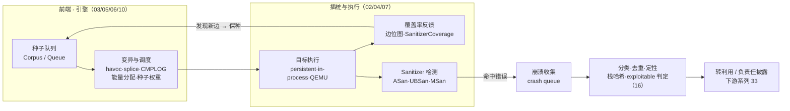
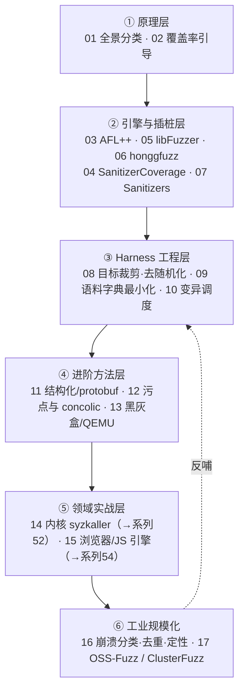

# Fuzzing与漏洞挖掘 · 系列总览
> 覆盖率引导模糊测试（coverage-guided fuzzing）的原理、引擎、Harness 工程与规模化——本系列系统梳理从"随机砸输入"到"覆盖率反馈驱动的定向搜索"这一范式跃迁。从 AFL++/libFuzzer 的单机实践，到内核 syzkaller 与浏览器/JS 引擎 fuzzing 的领域深水区，再到 OSS-Fuzz 的工业化持续测试，它把 [[33.二进制漏洞与利用基础/00.二进制漏洞与利用基础总览|系列 33]] 之「利用」前推到「发现」：先低成本、自动化地把 bug 从数百万行代码里挖出来，"利用"只是其下游的一环。

覆盖率引导 fuzzing 的本质是一个**自增强的反馈闭环**：插桩把"这次执行踩到了哪些新代码"变成信号，引擎据此保留有价值的种子、把算力放大到未探索路径上。下图是贯穿全系列的架构主线——横向即数据流，纵向即各章节的落点。

## 篇目导航

| # | 章节 | 说明 |
| --- | --- | --- |
| 01 | [[01.模糊测试全景与分类]] | 黑/灰/白盒、生成/变异、覆盖率引导 |
| 02 | [[02.覆盖率引导原理：AFL的核心思想]] | 边覆盖、位图、能量调度、种子队列 |
| 03 | [[03.AFL++架构与使用]] | 插桩模式、CMPLOG、persistent、字典 |
| 04 | [[04.编译期插桩：SanitizerCoverage与PCGUARD]] | trace-pc-guard、inline-8bit、比较插桩 |
| 05 | [[05.libFuzzer与持久模式]] | in-process fuzzing、LLVMFuzzerTestOneInput |
| 06 | [[06.honggfuzz与其他引擎]] | 硬件反馈、软件反馈、引擎横向对比 |
| 07 | [[07.Sanitizers：ASan与UBSan与MSan]] | 插桩检测越界/未定义/未初始化 |
| 08 | [[08.Harness编写与目标裁剪]] | 入口选择、状态清理、去随机化 |
| 09 | [[09.语料库与字典与最小化]] | 种子收集、覆盖率最小化、结构字典 |
| 10 | [[10.变异策略与调度算法]] | havoc、splice、种子权重与调度 |
| 11 | [[11.结构化Fuzzing：语法与protobuf]] | libprotobuf-mutator、语法感知变异 |
| 12 | [[12.覆盖率之外：污点与concolic]] | 混合执行、driller、约束求解引导 |
| 13 | [[13.黑盒与灰盒Fuzzing]] | 无源二进制插桩 fuzzing、QEMU 模式 |
| 14 | [[14.内核与驱动Fuzzing：syzkaller]] | 系统调用描述、覆盖率、复现，呼应系列 52 |
| 15 | [[15.浏览器与JS引擎Fuzzing]] | 语法生成、差分、呼应系列 54 |
| 16 | [[16.崩溃分类与去重与可利用性]] | 栈哈希、去重、exploitable 判定 |
| 17 | [[17.规模化：OSS-Fuzz与ClusterFuzz]] | 持续 fuzzing、语料共享、回归 |

> [!warning] 合规边界与学习建议
> **合规边界**：Fuzzing 会主动触发目标崩溃，可能造成数据损坏、服务中断或状态污染。本系列所有技术**仅限用于自有资产、持明确书面授权的测试目标、CTF/靶场与开源软件安全研究**；对第三方生产系统或未授权目标发起 fuzzing，可能触犯《网络安全法》《数据安全法》及各地计算机犯罪相关法律。挖到漏洞应走**负责任披露（responsible disclosure）**——面向厂商/上游或 OSS-Fuzz 通道上报，设置合理的披露窗口，而非公开武器化 PoC。本系列自始至终立足**防御与加固视角**：理解"发现链"是为了让缺陷在进入 [[33.二进制漏洞与利用基础/00.二进制漏洞与利用基础总览|利用阶段]] 之前就被更早、更廉价地修复。
> **学习建议**：① 先吃透 02 的覆盖率引导原理——AFL 位图与边覆盖是理解一切现代 fuzzer 的地基，不懂它后面全是玄学；② 再动手把 03/05 的最小 Harness 跑通（libpng/libxml2 等历史 CVE 是极好的可复现练手目标）；③ **不要跳过 07 Sanitizers**——没有 Sanitizer 的 fuzzing 会静默漏掉绝大多数内存错误，覆盖率再高也白搭；④ 按下方学习路径图自底向上推进，每章配一个能复现崩溃的实验目标，把"看懂"变成"跑出过 crash"。

## 建议学习路径

## 与知识库既有体系的衔接

- 漏洞下游：崩溃经 [[33.二进制漏洞与利用基础/01.内存破坏漏洞全景与利用链模型]] 转为利用
- 引擎依赖：[[48.动态插桩与模拟执行引擎/12.插桩驱动的分析：覆盖率与污点与trace]]（覆盖率反馈）
- 内核/浏览器：[[52.Linux内核机制与内核利用/18.内核Fuzzing与syzkaller]]、[[54.浏览器与JS引擎漏洞/00.浏览器与JS引擎漏洞总览]]
- 既有孤点收编：[[38.Windows内核与驱动逆向/30.内核Fuzzing]]
