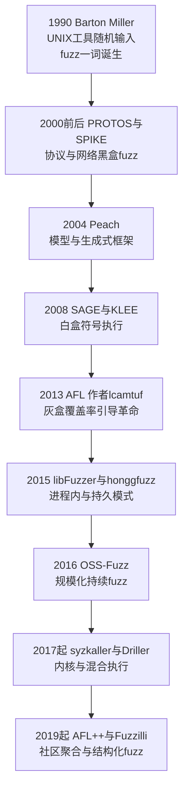
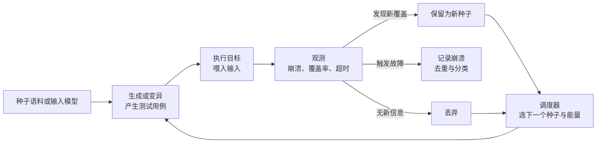
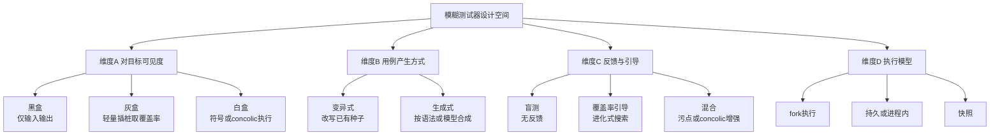
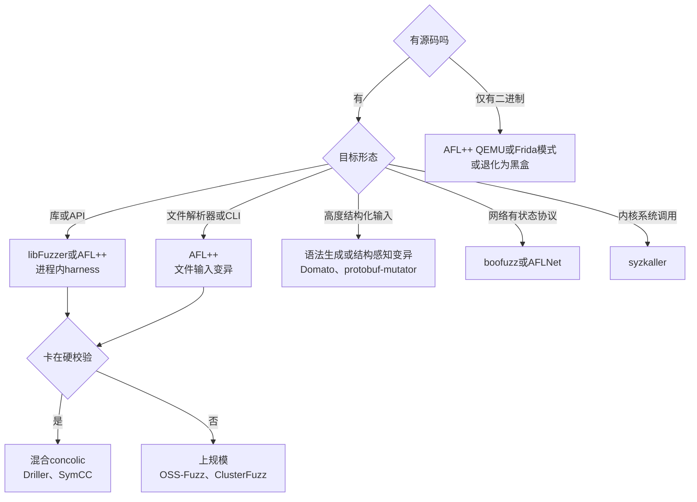

# Fuzzing与漏洞挖掘（1）· 模糊测试全景与分类
> [!abstract] TL;DR
> - Fuzzing 的本质是用机器的吞吐替代人的注意力：低成本批量生成畸形输入 + 高速执行目标 + 可靠的故障判定（oracle），把"能不能触发崩溃"变成可昼夜自动搜索的问题。
> - 别用单一标签给 fuzzer 归类。它是**三条正交轴**上的一个组合点：可见度（黑/灰/白盒）、用例产生（生成式/变异式）、反馈（盲测/覆盖率引导/混合）——外加执行模型、是否定向、是否结构感知等次级轴。
> - "灰盒 + 变异 + 覆盖率引导"成为现代主流（AFL 系），因为它用"吞吐 × 轻量反馈"的进化式搜索，同时压过了又贵又慢的白盒符号执行和又快又瞎的黑盒随机。
> - 生成式擅长高结构输入（语言/协议）但要先写模型；变异式即插即用却难过语法与校验关；工业实践大多是二者杂交的**结构感知变异**。
> - Oracle 决定上限：没有 ASan 等 sanitizer 把静默内存破坏放大成"当场崩"，再高的 exec/s 也只能捞到少数会立刻崩溃的 bug——找不到 ≠ 没有。
> - 本篇是整个系列的"地图"：只铺分类坐标系与判定直觉，覆盖率位图、AFL 内部、concolic、内核/浏览器等细节留给后续各篇深挖。

## 概述与定位

模糊测试（fuzzing）是一种自动化的软件缺陷发现技术：向目标程序持续喂入大量"畸形的、非预期的、半随机的"输入，观察它是否进入崩溃、断言失败、内存破坏或挂起等异常状态，从而定位安全漏洞与健壮性缺陷。它的哲学可以一句话概括——**用机器的蛮力和吞吐，替代人类审计里最稀缺的注意力**。人写不出也读不完百万级的边界输入，但一台机器每秒能执行成千上万次目标程序，把"某个输入会不会让它崩"这件事变成一个可以不眠不休自动搜索的问题。正因为便宜、可扩展、且直接产出可复现的崩溃样本，fuzzing 在过去十年从学术玩具变成了工业界发现内存安全漏洞的第一生产力工具。

要理解它的定位，最好把它放到软件质量保障的谱系里横向对比。**单元测试**是正向测试：开发者用已知输入断言已知的期望输出，它验证"该做的做对了"，但天然只覆盖开发者想到的用例，漏掉的正是攻击者要找的角落。**静态分析**在不运行程序的前提下对代码做过近似推导，能覆盖所有路径但代价是大量误报，而且报出的问题往往没有一个能触发它的具体输入。**人工审计**语义理解最深，却根本无法规模化。Fuzzing 恰好补上了这块空白：它是**反向测试**——不知道也不需要知道"正确输出"，只需要一个廉价的判据"崩了就是坏了"；它产出**具体的复现输入**（PoC），因此对崩溃这一类问题几乎零误报（崩溃就是崩溃）；它靠算力**规模化**，用统计意义上的海量试探去逼近人想不到的输入组合。

Fuzzing 为什么如此有效，背后有一个朴素但深刻的观察：**缺陷聚集在"可达代码"与"异常状态"的交界处**。真实世界的解析器、解码器、协议栈拥有巨大的输入空间，而开发者与常规测试几乎只走了其中的"happy path"（合法、良构的输入）。绝大多数内存破坏都潜伏在错误处理分支、长度字段被信任、嵌套深度失控、整数溢出后再做分配这类"没人会手动去测"的角落。Fuzzing 的价值就在于它以极低的边际成本，系统性地、不带偏见地反复敲打这些没人光顾的路径。

从历史看，这门技术有清晰的演进脉络，理解它有助于建立分类直觉。



1990 年 Barton Miller 在威斯康星大学那份《UNIX 工具可靠性实证研究》里，用一个往程序里灌随机字节的小工具（据其自述灵感来自暴风雨夜里线路噪声干扰终端导致程序崩溃）批量搞崩了一堆 UNIX 命令行工具，"fuzz"这个名字与这门方法就此诞生——这是纯粹的**黑盒随机**时代。世纪之交，PROTOS、SPIKE 等把它引向网络协议，仍是黑盒；2004 年 Peach 带来**生成式/模型驱动**的范式；2008 年前后微软的 SAGE 与学界的 KLEE 把**白盒符号执行**推上舞台，试图用约束求解精确地走到深层路径。真正的分水岭是 2013 年 Michał Zalewski（lcamtuf）发布的 AFL：它用极轻量的编译期插桩采集边覆盖，把"这个输入有没有走到新代码"当作进化压力，以此驱动一个遗传算法式的语料进化——**灰盒 + 覆盖率引导**从此成为主流。随后 libFuzzer/honggfuzz 把它做进进程内、OSS-Fuzz 把它推向规模化持续运行、syzkaller 把它带进内核、AFL++/Fuzzilli 把社区改进聚合并走向结构化。**本篇正是这张地图本身**：只负责把坐标系铺清楚，具体每一格的深挖交给后续各篇。

## 原理与机制

无论一个 fuzzer 长得多复杂，剥到最里层都是同一个循环。理解这个循环，就抓住了所有 fuzzer 的骨架。



这个循环由**三根支柱**撑起来，任何 fuzzer 的设计取舍都落在这三根柱子上。

**第一根：输入产生。** 也就是"畸形输入从哪来"。两条根本路线——从已有样本出发做字节级/结构级改写（变异式），或者从一个输入模型（语法、模板、协议规范）里合成全新样本（生成式）。这是后文分类轴 B。产生策略直接决定了 fuzzer 能不能越过输入格式的"门槛"：随手翻转字节很容易被解析器在第一道校验就拒之门外，而带模型的生成能保证语法合法、深入到真正有意思的语义处理逻辑。

**第二根：执行。** 把输入喂给目标并跑起来。这里最反直觉、也最被低估的真理是——**吞吐量（exec/sec）几乎是决定成败的头号因素**。Fuzzing 本质是一场数字游戏，能否在给定算力和时间里撞见 bug，取决于单位时间试探的次数。把每次执行从"重新 fork+exec+加载"优化成"进程内一次初始化、反复调用被测函数"（持久模式），或用快照瞬间回滚状态，动辄带来 10 倍以上的吞吐提升，等价于把整台机群变大 10 倍。这就是为什么 fork-server、persistent mode、snapshot 这些看似工程细节的东西，实则是 fuzzing 的核心竞争力（各自的实现细节见后续篇目）。

**第三根：观测与判定（Oracle）。** 循环里最容易被忽视却决定天花板的一环：**你凭什么认定"出 bug 了"？** 这就是著名的 oracle 问题。可用的判据分几档：最朴素的是**进程崩溃**（SIGSEGV/SIGABRT），但很多内存破坏并不当场崩——一次堆溢出可能只是悄悄写坏了相邻对象，程序继续跑，bug 被"吞掉"。于是有了**sanitizer**（ASan/UBSan/MSan/TSan）：它们在编译期插入红区、影子内存、未定义行为检查，把原本静默的越界、use-after-free、未初始化读取放大成"立刻、响亮"的中止——现代 fuzzing 能捞到海量内存 bug，一大半功劳其实归于 ASan（sanitizer 原理见系列第 07 篇）。再往上有**断言/不变量检查**、**超时/挂起**（潜在 DoS 或死循环）、**资源耗尽**（OOM），以及**差分测试**（两个本应等价的实现给出不同结果，用来抓逻辑 bug 而非崩溃）。一句话：**fuzzer 的上限由它的 oracle 决定**，吞吐再高，若没有合适的判据把"坏"变得可观测，海量执行也只是空转。

三根支柱之外，还有一根贯穿全局的"神经"——**反馈**。盲测的 fuzzer 每次执行只知道一个比特："崩了 / 没崩"，它对自己是否在接近某个 bug 一无所知，只能纯随机撒网。覆盖率引导的 fuzzer 则给目标插了桩，每次执行都能回收"这次走过了哪些代码边"，于是可以问一个关键问题："这个输入有没有解锁以前没走到的代码？"若有，就把它留作新种子、继续在它基础上变异。这一改动把纯随机搜索升级为**有方向的进化搜索**，是黑盒到灰盒的本质跃迁，也是整个现代 fuzzing 的引擎（其位图与边哈希的具体实现是系列第 02 篇的主题，此处只需把握"留新覆盖者、弃无新意者"的进化直觉）。

## 分类坐标系与判定算法详解

"给 fuzzer 分类"最常见的错误，是把它当成单选题：非黑即白盒、非生成即变异。真相是——**任何一个真实工具都是多条正交轴上的一个坐标点**。把这些轴拆开、再理解它们如何组合，才是"全景"二字的意义。



### 维度 A：对目标的可见度——黑盒 / 灰盒 / 白盒

这是最经典也最重要的一轴，衡量 fuzzer 对被测程序**内部信息的掌握程度**。

**黑盒**只看输入与输出，对内部一无所知：不插桩、不分析、不看源码。它的优势是**部署成本近乎为零、适用面最广**——闭源商用软件、网络服务、硬件设备、无法插桩的目标，都能上。代价是它"瞎"：没有任何信号告诉它是否在接近 bug，只能靠输入分布本身的巧劲（比如喂结构良好但字段越界的样本）。它对浅层健壮性问题很有效，对深藏在层层校验之后的深层 bug 则效率极低。老派协议 fuzzer、硬件 fuzzing 多属此类。

**白盒**站在另一极端，对程序做**重量级的语义分析**：符号执行把输入变量当作符号，沿路径收集分支条件形成约束，再用 SMT 求解器反解出"能走到某条特定路径"的具体输入；concolic（concrete + symbolic，混合执行）则用一次具体执行做骨架、在分支处求解翻转条件。它的杀手锏是能**精确攻破硬校验**：一个 `if (magic == 0xCAFEBABE)` 或某个校验和相等的分支，随机变异可能永远撞不对，而约束求解可以一步解出来。但代价同样极端——建模开销大、**路径爆炸**（分支数指数增长）、SMT 求解常成瓶颈、对系统调用与外部环境难以建模，导致**吞吐低、扩展性差**。SAGE、KLEE、Driller 是代表。

**灰盒**是务实的中间道路，也是当代主流：只做**轻量插桩**采集覆盖率反馈，但**不做完整程序分析**。它不去精确求解任何约束，只是把"是否走到新代码"当作粗粒度的进化信号。插桩既可以在有源码时于编译期植入（快、准），也可以对闭源二进制用 QEMU 动态翻译、Frida 动态插桩、或 Intel PT 硬件 trace 来近似（慢一些、但能上闭源目标）。AFL/AFL++、libFuzzer、honggfuzz 都是灰盒。理解三者的取舍，可以用一个**代价三角**来把握：

```
             语义理解力 高
                  白盒
                 /    \
   吞吐/规模化 低        建模/部署成本 高
              /            \
           灰盒 ———————————— 黑盒
       (务实中点)          (瞎但便宜)
```

- 黑盒 = 便宜 + 快 + 瞎
- 白盒 = 昂贵 + 慢 + 聪明
- 灰盒 = 便宜的插桩 + 高吞吐 + 一点点方向感

灰盒之所以在实践中通吃，是因为**"高吞吐 × 轻量反馈"的乘积，长期跑赢了"深刻但慢"的白盒**：与其花一秒精确求解一个分支，不如这一秒里粗放地试上万次、让进化压力自己把有用的输入攒出来。这一"用统计规模压过精确分析"的直觉，是 AFL 革命的哲学内核。（黑盒与灰盒的更细致对比、以及对闭源目标的具体插桩手法，是系列第 13 篇的专题。）

### 维度 B：用例产生方式——生成式 vs 变异式

**变异式**从一份种子语料出发，对已有样本做改写：位翻转、算术加减、替换"兴趣值"、插入字典项、拼接两个种子、以及把上述随机叠加的"havoc"。它的魅力是**几乎不需要理解输入格式即可开跑**，配上一个像样的种子集就能立刻工作。典型的变异算子谱系：

```
位翻转   bitflip      10000000 -> 00000000
算术     arithmetic   len += 1、len -= 16、off += 4
兴趣值   interesting  0、-1、INT_MAX、0x7fffffff、0x80000000
字典     dict insert  插入magic："\x89PNG"、"<?xml"、"MZ"
拼接     splice       种子A前半 + 种子B后半
混沌     havoc        随机叠加以上多种操作
```

**生成式**则手握一个**输入模型**——上下文无关语法、字段模板、协议状态机——据此从零合成良构样本。它的优势是**合法率高**，能稳定越过语法/结构门槛，深入到解析之后的真正逻辑，尤其适合语言（JS、SQL）、复杂文件格式（PDF）、有状态协议。代价是**得先把模型写出来**，既费人力又可能因为模型只产良构样本而错过"畸形边界"里的 bug。

二者的深层差异，看一个典型的结构化输入布局就懂了：

```
[ magic : 4 ][ len : 4 ][ crc32 : 4 ][ payload : len 字节 ]
   固定魔数     长度自洽    覆盖payload    真正想fuzz的部分
```

纯变异随手改 `payload`，几乎必然破坏 `crc32` 的自洽，解析器在校验和这一关就早退（early reject），后面真正有意思的代码根本走不到——表现为**覆盖率长时间卡在平台期**。这正是变异式的软肋，也解释了为什么工业界普遍走**杂交**路线：结构感知变异（如 libprotobuf-mutator 在 protobuf 层面做保结构变异、语法感知变异器）、给 fuzzer 喂字典让它至少能命中魔数、或干脆在 harness 里把校验和这类"防呆逻辑"临时改成恒真好让 fuzzer 专注下游。（变异算子与能量调度的算法细节见第 10 篇，结构化 fuzzing 见第 11 篇。）

### 维度 C：反馈与引导——盲测 / 覆盖率引导 / 混合

**盲测**（无反馈）就是纯随机撒网，只有崩/不崩一个比特。**覆盖率引导**是当代基石，其核心循环用伪代码最能说清：

```
corpus       = load_seeds()          # 初始种子集
coverage_map = {}                    # 全局已见覆盖(边集合)
while time_left:
    seed     = scheduler.pick(corpus)          # 选种子并分配"能量"
    testcase = mutate(seed)                     # 变异产生新用例
    new_cov  = run_and_trace(target, testcase)  # 执行并采集边覆盖
    if new_cov  not_subset_of  coverage_map:    # 命中了新的边?
        corpus.add(testcase)                    # 进化: 留作新种子
        coverage_map |= new_cov
    if crashed(target):
        save_crash(testcase)                    # 记录崩溃样本待分类
```

删掉代码只用中文也能讲清它的精髓：fuzzer 维护一个**不断成长的种子集**，每个种子都是"曾解锁过新代码"的功臣；它不停地挑一个种子、变异、执行、看有没有踩到从未走过的代码边，**若有则把这个新样本收编进种子集**。这一步是灵魂——它让"局部进展"被积累和复用，于是 fuzzer 能像爬楼梯一样，一层解锁下一层：先偶然凑对魔数、把这个样本留下；再在它基础上变异凑对某个长度关系、又留下……逐步、增量地学会通过一道道校验，走到普通随机永远到不了的深处。这就是把随机搜索变成**遗传算法式的引导搜索**。

**混合（hybrid）**是在覆盖率引导之上再叠加更强的信号：当灰盒卡在某个硬分支上（覆盖率平台期），临时唤起 concolic 引擎精确求解那一个分支、生成能翻过去的输入，再把控制权还给高吞吐的灰盒——用白盒之矛破灰盒之盾，兼顾"多数时候快、少数关口准"。Driller 是经典代表。此外还有**污点引导**（追踪输入字节如何流向分支条件，从而知道该改哪几个字节），进一步提升变异的针对性。（污点与 concolic 的机理是第 12 篇专题。）

### 次级维度：执行模型、定向性、状态与领域

除了上面三根主轴，还有几条影响工程形态的次级轴，值得在全景里点到：

- **执行模型**：fork 执行（每个用例一个干净子进程，隔离好但慢）、持久/进程内（一次初始化反复调用，快但要防状态污染）、快照（把进程/虚拟机状态瞬间回滚，兼顾隔离与速度）。
- **定向性**：覆盖率**最大化**（undirected，尽量多铺代码）vs **定向** fuzzing（AFLGo 之类，把"距离某个目标位置有多近"当作额外适应度，专攻某个补丁点、可疑函数或已知危险汇聚处）。前者广撒网，后者打靶。
- **有无状态**：无状态的一发入魂（一个输入一次判定）vs 有状态协议（要按会话顺序发一串消息，状态机本身就是搜索空间，如 AFLNet/boofuzz）。
- **目标领域**：文件格式、网络协议、库/API、内核系统调用（syzkaller）、浏览器 DOM 与 JS 引擎（Domato/Fuzzilli）——每个领域对上面几轴有不同的最优组合。

把这些轴一叠加就明白了：**AFL++ ≈ 灰盒 + 变异 + 覆盖率引导 + fork/持久 + undirected**；**libFuzzer ≈ 灰盒 + 变异 + 覆盖率引导 + 进程内**；**Peach ≈ 黑/灰盒 + 生成式 + 面向协议**；**KLEE ≈ 白盒 + 符号执行**；**syzkaller ≈ 灰盒 + 结构化生成 + 面向系统调用**。没有"最好的 fuzzer"，只有"某个目标在这些轴上的最优组合"。

## 工具视角与实战

把坐标系落到真实工具上，最实用的是一张"给定目标该选哪类 fuzzer"的决策图。它不替代后续各篇的深挖，但能让你在面对一个新目标时不至于选错大方向。



把主流工具按坐标系归位，便于建立"看到名字就知道它属于哪一格"的条件反射：

- **AFL / AFL++**：灰盒 + 变异 + 覆盖率引导的旗舰。有源码用编译期插桩，闭源可切 QEMU/Frida 模式。通用文件/CLI 目标的默认选择（架构见第 03 篇）。
- **libFuzzer**：进程内、覆盖率引导，与 LLVM/SanitizerCoverage 深度集成，写一个 `LLVMFuzzerTestOneInput` 就能把某个库函数变成 fuzz 目标，吞吐极高（见第 05 篇）。
- **honggfuzz**：另一款成熟灰盒引擎，硬件反馈与持久模式支持好（第 06 篇）。
- **Peach / boofuzz / AFLNet**：生成式或有状态协议方向，面向网络与格式规范。
- **Domato / Dharma / Fuzzilli**：面向浏览器与 JS 引擎的语法生成/结构化 fuzz（第 15 篇）。
- **syzkaller**：内核系统调用 fuzzing 的事实标准，用 syscall 描述模型做结构化生成（第 14 篇）。
- **SAGE / KLEE / Driller / SymCC**：白盒符号与混合执行阵营，擅长攻硬校验（第 12 篇）。

**怎么判断一场 fuzz 跑得好不好**，也就是该盯哪些指标：**边覆盖率**（比行覆盖更能反映路径多样性，是最核心的进度信号）、**exec/s**（吞吐，掉速往往意味着 harness 太重或 I/O 瓶颈）、**去重后的唯一崩溃数**（原始崩溃数会因同一 bug 反复触发而虚高，去重见第 16 篇）、**覆盖率增长曲线**（是否已进入平台期，平台期是该上字典/结构/concolic 的信号）、以及**首次触发时间**（TTE）。一条健康的曲线应是前期陡增、随后放缓；若一开始就平，多半是种子太差或根本没走进目标逻辑。

实战里最常见的**失败模式**，几乎都能用前面的坐标系解释，值得逐一记住：

- **覆盖率平台期**：卡在魔数、校验和、深层语法关。对策——喂字典、改用结构感知/生成式、或叠加 concolic；必要时在 harness 里把校验逻辑打桩为恒真。
- **种子太烂**（garbage in, garbage out）：种子质量与多样性直接决定起点，一个真实、精简、覆盖广的语料常常比换引擎更管用（语料工程见第 09 篇）。
- **oracle 太弱**：没开 sanitizer，静默内存破坏被吞，跑很久"零崩溃"其实是零观测。**跑 fuzz 不开 ASan，是把大半 bug 主动扔掉**。
- **harness 有病**：harness 自身崩溃造成假阳性，或它根本没把输入喂到有意思的代码路径，导致覆盖上不去（harness 编写与目标裁剪见第 08 篇）。
- **非确定性**：全局状态、时间/随机数、未清理的残留让同一输入的覆盖时有时无，反馈信号被噪声污染，进化跑偏。持久模式尤其要警惕状态污染。
- **测错了层**：在一次校验之后才注入输入，或 fuzz 了一个不含目标逻辑的封装层，白跑。

## 安全性与正确使用

Fuzzing 是一把典型的双刃剑：同一套技术，防御方用来在发布前找出并修掉自家漏洞，攻击方也可能用来挖 0day。因此在动手之前，务必先立好边界。

> [!caution] 合规与伦理边界
> - 本文与本系列一律以**防御与教育视角**讲解原理，目的是帮助读者审计自有代码、参加 CTF、开展获授权的安全研究，从而**更早地发现并修复缺陷**。
> - **只在你拥有或已获明确书面授权的目标上做 fuzzing**，以及 CTF 靶场、本地沙箱、开源项目这类合规环境。对他人的生产系统、在线服务、他人设备做未授权的 fuzz，可能触犯计算机犯罪相关法律，并可能造成真实的服务中断与数据损坏。
> - 本文**不提供**针对任何真实生产系统或他人系统的武器化步骤，**不为绕过商业授权/许可**提供任何可落地的攻击配方。原理讲透，但止于"如何发现与修复"，不给"打某个真实目标"的成品。
> - 挖到真实漏洞时，遵循**负责任披露**：通过厂商安全通道或 CVE 流程上报，给予合理修复窗口，不公开可直接利用的武器化细节。

除了法律与伦理，工程上也有几条"正确使用"的硬约束。其一是**隔离**：fuzzing 会让目标频繁崩溃、可能触发资源耗尽，务必在容器/虚拟机/专用机器里跑，避免它写坏共享环境或把你自己的工作机拖垮——尤其内核/驱动 fuzzing 会直接把宿主机搞死机，必须在虚机快照里进行。其二是**DoS 自觉**：即便是对自有的、但线上的服务，直接 fuzz 也可能等价于自己给自己发起拒绝服务攻击，应在离线副本上做。其三是**崩溃样本的保管**：崩溃 PoC 本身就是可复现的漏洞证据，等同敏感信息，需与披露流程一致地妥善保存与传递，而不是随手上传到公共仓库。

最后强调 fuzzing 的**认识论边界**，避免误判安全状态：**"fuzz 了很久没崩" 绝不等于 "没有漏洞"**。它受限于种子质量、覆盖是否走到了危险代码、oracle 是否够灵敏、以及跑的时间与算力。它能证明 bug 存在（给你一个复现输入），却几乎无法证明 bug 不存在。把一次干净的 fuzz 运行当成"安全认证"，是常见且危险的误读——它只是把风险降低了，没有清零。崩溃找到之后，如何判断其可利用性、如何顺着内存破坏走向真正的利用链，属于漏洞下游的话题，可衔接 [[33.二进制漏洞与利用基础/01.内存破坏漏洞全景与利用链模型]]。

## 小结

这一篇是整个系列的地图。核心结论收束成几句：Fuzzing 的骨架永远是"产生输入 → 执行 → 观测判定 → 反馈进化"这个循环，三根支柱（输入产生、高吞吐执行、可靠 oracle）加一根反馈神经决定它的成败。给 fuzzer 分类不是单选题，而是在**可见度（黑/灰/白盒）、用例产生（生成/变异）、反馈（盲测/覆盖率/混合）**三条正交主轴，外加执行模型、定向性、状态、领域等次级轴上，标定一个坐标点。"灰盒 + 变异 + 覆盖率引导"之所以成为现代主流，是因为它用高吞吐乘以轻量反馈的进化式搜索，务实地压过了又贵又慢的白盒和又快又瞎的黑盒；而生成式与结构感知则是攻克高结构输入的必要补充。记住两条最容易被忽视的真理：**吞吐量常是头号胜负手**，**oracle 决定发现能力的天花板**。带着这张坐标系，接下来的每一篇——从覆盖率引导的内部机理、到具体引擎、到 sanitizer、到 harness、到结构化与内核/浏览器场景、再到规模化——都能各归其位，不再是零散的工具名词，而是这张地图上被逐格点亮的区域。

## 相关阅读

- 系列下一篇：[[02.覆盖率引导原理：AFL的核心思想]]——把本篇"留新覆盖者"的进化直觉展开为位图、边哈希与种子进化的实现机理。
- 系列相关篇：[[13.黑盒与灰盒Fuzzing]]（可见度一轴的深挖）、[[10.变异策略与调度算法]]（变异算子与能量调度）、[[11.结构化Fuzzing：语法与protobuf]]（生成式与结构感知）、[[12.覆盖率之外：污点与concolic]]（混合/白盒反馈）、[[07.Sanitizers：ASan与UBSan与MSan]]（oracle 放大器）、[[16.崩溃分类与去重与可利用性]]、[[17.规模化：OSS-Fuzz与ClusterFuzz]]。
- 漏洞下游：[[33.二进制漏洞与利用基础/01.内存破坏漏洞全景与利用链模型]]——崩溃如何转为利用。
- 引擎与反馈依赖：[[48.动态插桩与模拟执行引擎/12.插桩驱动的分析：覆盖率与污点与trace]]——覆盖率/污点反馈的插桩实现。
- 内核与浏览器场景：[[52.Linux内核机制与内核利用/18.内核Fuzzing与syzkaller]]、[[54.浏览器与JS引擎漏洞/00.浏览器与JS引擎漏洞总览]]、[[38.Windows内核与驱动逆向/30.内核Fuzzing]]。
- 一手与经典资料：Barton P. Miller 等《An Empirical Study of the Reliability of UNIX Utilities》(1990)——fuzzing 的起点；Michał Zalewski 的 AFL 技术白皮书与 lcamtuf 博客；LLVM 官方 libFuzzer 文档；Cadar 等 KLEE (OSDI 2008) 与 Godefroid 等 SAGE 论文；Andreas Zeller 等《The Fuzzing Book》（thefuzzingbook.org，系统的原理教材）；Google OSS-Fuzz 官方文档。

[[00.Fuzzing与漏洞挖掘总览|⬆ 系列总览]] | [[02.覆盖率引导原理：AFL的核心思想|→ 下一章]]
