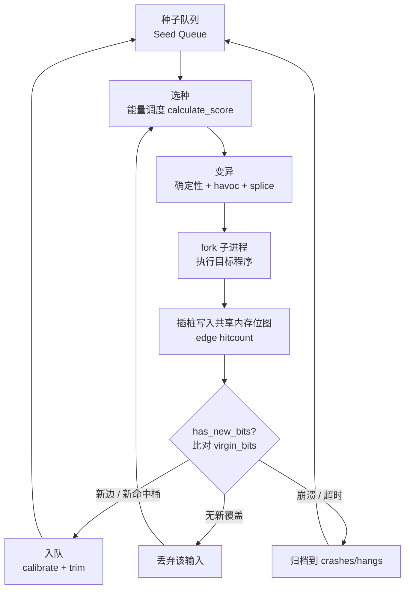
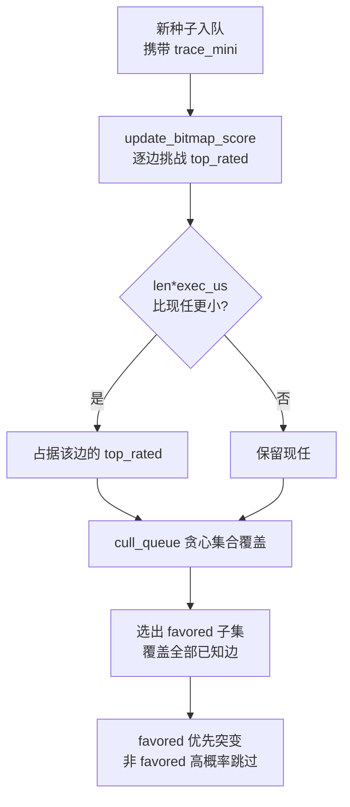
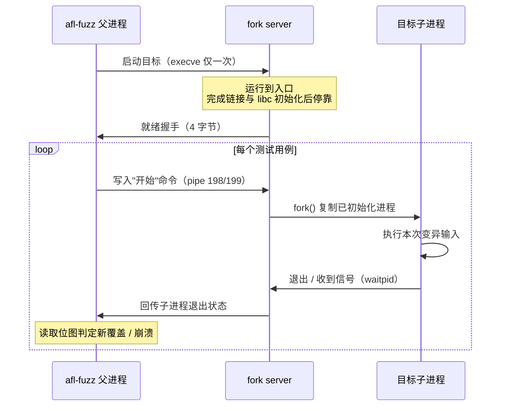

# Fuzzing与漏洞挖掘（2）· 覆盖率引导原理：AFL的核心思想
> [!abstract] TL;DR
> - AFL 的本质是一个跑在覆盖率反馈上的遗传算法：以「边覆盖」为适应度函数，只保留并繁殖能开拓新覆盖的输入，全程无需理解程序语义，用极轻的插桩换来近乎盲目的高效探索。
> - 边覆盖用 `当前块随机ID ^ (上一块ID >> 1)` 编码为 64KB 共享内存位图的下标，一条 XOR+右移就近似捕获了「从哪个分支跳到哪个分支」及其方向，右移是区分方向与自环的关键。
> - 命中次数按 2 的幂分桶（1 / 2 / 3 / 4-7 / … / 128+，共 8 桶），给循环一点点路径敏感度，又避免迭代次数的微小抖动把路径数量炸成天文数字。
> - 种子队列从不淘汰任何提升覆盖的输入；`cull_queue` 用贪心集合覆盖选出 favored 子集优先突变，`calculate_score` 依执行速度、覆盖规模、handicap 与深度给每颗种子发放突变能量。
> - 64KB 位图的哈希编码存在生日悖论式碰撞，是 AFL 覆盖精度的根本瓶颈，直接催生了 LTO 无碰撞插桩、更大位图与 CmpLog 等后续方案——理解这个瓶颈才能读懂第 3、4 篇的所有工程取舍。

## 概述与定位

在上一篇《模糊测试全景与分类》里，我们把模糊测试沿「反馈强度」这根轴划成了黑盒、灰盒、白盒三档。本篇聚焦其中最具工程影响力的一档——**覆盖率引导的灰盒模糊测试（Coverage-guided Greybox Fuzzing, CGF）**，并以它的开山之作 AFL（American Fuzzy Lop，Michał "lcamtuf" Zalewski 于 2013 年发布）为标本，把「为什么覆盖率能引导变异」这件事从直觉一路讲到位图的每一个字节。

要理解 AFL 的定位，先要看清它两侧的邻居。**黑盒模糊**（如早期的 zzuf、Peach 的纯随机模式）对着目标狂丢畸形输入，不看程序内部发生了什么——它便宜、通用，但像蒙着眼睛扔飞镖，绝大多数变异要么被入口的格式校验挡回，要么反复踩同一条已知路径，命中深层逻辑纯靠运气。**白盒模糊**（如 SAGE、KLEE 这类基于符号执行的方案）走另一个极端：它用约束求解器精确地为每个未走过的分支反解出触发输入，理论上能系统性地穿透条件判断，但符号执行有路径爆炸、约束求解慢、环境建模难三座大山，规模化代价极高。

AFL 的天才之处，是在这两端之间找到了一个**性价比奇高的中间态**：不做昂贵的符号推理，只在编译期给每个基本块插入几条指令，把「这次运行踩到了哪些边」记录进一块共享内存；然后用一句朴素到近乎简陋的规则驱动整个系统——**只要某个变异输入让程序走出了此前从未走过的边，就把它留下来，作为未来变异的新起点**。这句规则把模糊测试重新表述成了一个**遗传算法**：种子队列是种群，覆盖率是适应度函数，变异与拼接是变异算子，「是否带来新覆盖」是选择压力。没有语义、没有求解器，却能像进化一样，一层层把输入「养」得越来越深入程序腹地。

这个思路的威力在实践中被反复验证：AFL 及其衍生工具在 SQLite、OpenSSL、libpng、bash（著名的 Shellshock 相关变体）、各类图像/字体/压缩库中挖出了数以千计的崩溃，几乎重塑了整个软件行业对「模糊测试到底能不能挖到真 bug」的认知，也直接孕育了后来的 libFuzzer、honggfuzz、AFL++、OSS-Fuzz 生态。本篇讲透的是 AFL 的**核心思想与数据结构**——边覆盖、位图、能量调度、种子队列这四块基石；至于把这些思想工程化打磨到极致的 AFL++（第 3 篇）、编译期插桩的具体实现 SanitizerCoverage/PCGUARD（第 4 篇）、变异与调度算法的展开（第 10 篇），会在后续各篇分别深入，本篇只在必要处点到、不越界重复。

## 原理与机制

CGF 的运转是一个闭环。把它拆成流水线，AFL 的每一轮迭代大致如下：**从种子队列取一颗种子 → 按能量调度算法决定给它多少次变异 → 对其字节做确定性变异 / havoc 随机变异 / splice 拼接 → fork 出目标子进程喂入变异后的输入 → 目标运行时，插桩代码把「踩到的边」写进共享内存位图 → 父进程比对位图判断是否有新覆盖 / 崩溃 / 超时 → 有新边则校准、修剪后入队，崩溃则归档，否则丢弃 → 回到第一步**。下图是这个反馈闭环的骨架：



这条闭环里有五个必须讲清的机件，它们互相咬合：

**插桩（instrumentation）**。这是覆盖反馈的信息来源。AFL 在编译期（`afl-gcc`/`afl-clang-fast`）于每个基本块的入口注入一小段代码，其唯一职责是「在共享内存里为当前这条边的计数器加一」。没有插桩就没有反馈，AFL 就退化成黑盒。对只有二进制、无法重编译的目标，AFL 提供 QEMU 模式在动态翻译时打桩，代价是慢一个数量级。

**共享内存位图（shared bitmap）**。目标进程和 `afl-fuzz` 父进程通过一块 64KB 的 System V 共享内存通信，环境变量 `__AFL_SHM_ID` 传递其标识。位图的每个字节代表一条「边」的命中计数。它是整个系统的「视网膜」——程序这一次运行的全部行为，被压缩成这 65536 个字节里的一张热力图。

**边覆盖（edge coverage）**。AFL 不记录「走过哪些基本块」（那叫块覆盖），而是记录「从哪个块跳到了哪个块」，即控制流图上的边。原因下一节详解：边比块携带更多分支结构信息，又远比完整路径便宜。

**fork server**。为了避免每个测试用例都付出一次 `execve`＋动态链接＋libc 初始化的高昂开销，AFL 让目标在初始化完成后停在入口，之后每个用例只需 `fork` 一个已就绪进程的副本。这是 AFL 吞吐量（每秒上万次执行）的工程命脉。

**种子队列（seed queue）**与**能量调度**。所有带来新覆盖的输入被永久保存在队列里，构成不断膨胀的「已知有价值输入」集合。调度器决定下一颗喂哪颗、喂多少刀，这直接决定算力花在哪里、收敛有多快。

## 结构与算法详解

上一节是骨架，这一节把每块肌肉的纹理拆开。这也是本篇密度最高的部分——理解了这些数据结构与算法，你才能读懂 AFL 界面上每一个数字的含义，也才能判断一次 fuzzing 到底是「在探索」还是「在原地打转」。

### 边覆盖的编码：为什么是异或再右移

编译期，AFL 给每个基本块分配一个编译时随机常量 `cur_location`（16 位），并在块入口注入等价于下面这段的逻辑：

```c
cur_location = <COMPILE_TIME_RANDOM>;           /* 当前块的随机ID */
shared_mem[cur_location ^ prev_location]++;     /* 为这条边的计数器 +1 */
prev_location = cur_location >> 1;              /* 关键：右移一位后存为上一块 */
```

短短三行，藏着两个精心设计。**其一，用 `cur ^ prev` 作为位图下标**，等于把「上一块→当前块」这个有序对哈希成 0..65535 的一个位置，从而把「边」而非「块」记入位图。**其二，`prev_location` 存的是 `cur >> 1` 而不是 `cur` 本身**——这一步右移看似多余，却解决了两个致命歧义：

- **方向性**。XOR 满足交换律，若不右移，边 A→B 的下标是 `A^B`，边 B→A 的下标是 `B^A`，两者相等，方向信息彻底丢失。右移后，A→B 得到 `B ^ (A>>1)`，B→A 得到 `A ^ (B>>1)`，两者不同，方向被保留。
- **自环**。若不右移，自环边 A→A 的下标是 `A^A = 0`，所有自环都塌缩到位图第 0 号字节。右移后 A→A 得到 `A ^ (A>>1)`，只要 A 非零就落在不同位置，循环体的自跳转得以被区分。

这套编码的深层权衡是：它是**近似**的边覆盖，不是精确的。因为块 ID 是随机数、位图只有 64KB，不同的边有概率被哈希到同一个字节——这就是后文要重点谈的「碰撞」问题。但在 2013 年，用一次 XOR 换来无需构造完整控制流图、无需为每条边分配唯一 ID 的极简插桩，是完全值得的取舍。

**为什么是边而不是块，也不是完整路径？** 块覆盖只能回答「这个块被执行过吗」，但两个输入可能覆盖完全相同的块集合，却经由不同的分支组合到达——比如 `if(a) X; if(b) X;`，走 a 分支和走 b 分支都执行了 X，块覆盖看不出区别，边覆盖能。另一头，**完整路径覆盖**（记录整条执行序列）信息最全，但路径数量随分支呈指数爆炸，存储和判重都不现实。边覆盖恰好卡在中间：它捕获了分支转移这一层结构，成本却是常数级。AFL 再用「命中次数」给边覆盖掺入一点点路径敏感度，作为廉价的补偿。

### 位图与命中次数分桶

位图（`trace_bits`）大小 `MAP_SIZE = 1 << 16 = 65536` 字节，每字节是一条边的**命中计数器**（`u8`，会自然回绕）。但 AFL 在判断「是否新覆盖」时，并不直接比较原始计数，而是先把计数**归一化到 8 个对数桶**：

```
原始命中次数        归一化桶值（单个置位）
   0            →   0
   1            →   1     0b00000001
   2            →   2     0b00000010
   3            →   4     0b00000100
   4  – 7       →   8     0b00001000
   8  – 15      →   16    0b00010000
   16 – 31      →   32    0b00100000
   32 – 127     →   64    0b01000000
   128 – 255    →   128   0b10000000
```

这套映射由 `classify_counts` 借助查表 `count_class_lookup` 完成。**为什么要分桶？** 想象一段循环体，输入长度控制它迭代 10 次还是 11 次。如果按原始计数比较，10 次和 11 次会被判为「不同覆盖」，于是每多迭代一次就诞生一颗「新种子」——一个长度字段就能让种子队列瞬间灌进成千上万颗几乎无差别的输入，这就是**路径爆炸**。分桶把命中次数压到对数尺度：10 次和 11 次都落在 `8–15` 这个桶里，被视为「一样」；只有当迭代次数发生数量级跳变（比如 1 次 vs 100 次，往往对应真正有意义的行为变化，如某个长度校验被绕过）时，才跨桶、才算新覆盖。**分桶是「给循环一点路径敏感度」与「不被循环淹没」之间的精妙折衷**，边界（2 的幂）的选择让相邻桶之间大致差一个数量级。

### virgin_bits 与 has_new_bits：如何判定「新」

AFL 维护一张全局的 `virgin_bits`，初始全为 `0xff`，语义是「这些命中桶还从未被任何输入触及过」。每次运行后，`has_new_bits` 拿当前 `trace_bits`（已分桶）去和 `virgin_bits` 逐字节比对，并区分两种「新」：

- **返回 2——新边**：某字节此前为 0（该边从未被任何输入走过），现在非 0。这是最有价值的信号，意味着触达了一片全新的代码区域。
- **返回 1——新命中桶**：某字节此前非 0，但当前落入了此前没见过的桶（比如以前只见过循环跑 1 次，这次跑到了 8–15 桶）。价值次之，但仍值得保留，因为它可能对应更深的循环边界行为。

只要 `has_new_bits` 返回非 0，AFL 就从 `virgin_bits` 里清掉这些新触及的位（表示「已见过」），并把该输入入队。这个「新边优先、新桶其次」的分级，正是 AFL 探索深度的驱动力：它天然偏爱「打开新大门」的输入，同时不放过「把已知循环推向新量级」的输入。

### 种子队列与 favored 集合：cull_queue 的贪心集合覆盖

每颗入队的种子是一个 `queue_entry`，记录文件名、长度 `len`、执行耗时 `exec_us`、位图规模 `bitmap_size`、被发现时的 `handicap`、派生深度 `depth`、是否 `favored`、是否已 fuzz 过 `was_fuzzed`，以及一张压缩过的自身覆盖轨迹 `trace_mini`（`MAP_SIZE/8` 字节的位向量）。**AFL 从不删除任何带来新覆盖的种子**——这与经典遗传算法「淘汰低适应度个体」不同，它认为每颗曾开拓过新覆盖的输入都可能是通往更深处的跳板。

但队列会膨胀到成千上万颗，逐颗平等地 fuzz 既慢又浪费。AFL 用两级机制解决：`update_bitmap_score` 与 `cull_queue`。**`top_rated[MAP_SIZE]`** 数组为每条边记录「覆盖它的最优种子」，最优的定义是 `len * exec_us` 最小——**又小又快**。每当新种子入队，就用它去挑战它覆盖的每条边的现任 `top_rated`，更小更快者上位。

`cull_queue` 则在此基础上做一次**贪心集合覆盖**：目标是从队列里选出一个尽量小的子集（favored 集合），使其恰好覆盖当前已知的全部边。算法很直接——维护一张「尚未被 favored 集合覆盖」的边位图，遍历每条还没被覆盖、且存在 `top_rated` 的边，就把它的 `top_rated` 种子标为 `favored`，并从「尚未覆盖」位图里划掉这颗种子能覆盖的所有边；如此贪心地扫完整张位图。结果是一个「用最少、最快、最小的种子覆盖全部已知边」的精华子集。fuzz 时，favored 种子优先且几乎必被选中，非 favored 种子则以较高概率被跳过。界面上的 **`pending favs`** 就是「尚未 fuzz 过的 favored 种子数」，它归零往往标志着一轮探索接近饱和。



### 能量调度：calculate_score 如何分配突变配额

选中一颗种子后，`calculate_score` 决定给它多少「能量」（havoc 阶段的突变刀数与总配额）。基准分 `perf_score = 100`，再依四个维度上下浮动：

- **执行速度**：比全局平均快得多的种子加分（最高约 3 倍），慢得多的减分（最低约 0.1 倍）。**为什么？** 快种子单位时间能试更多变异，同样算力下产出更高，值得多给能量——这是纯粹的吞吐量经济学。
- **覆盖规模 `bitmap_size`**：覆盖的边越多，说明这颗种子处于程序中「分叉更密」的区域，周边更可能藏着未探索分支，加分（最高约 3 倍）。
- **handicap**：种子被发现得越晚（在很多轮循环之后才入队），说明它「起步晚、亏欠多」，给一段时间的额外倍数让它「追赶」，追平后 handicap 递减归零。这避免了后期发现的深层种子因起步太晚而长期挨饿。
- **depth**：种子在派生树上离初始语料越远（经历越多层变异才得到），略微加分（最高 5 倍）。深度大往往意味着已经穿过若干道校验、进入了输入格式的「腹地」，那里更可能有新东西。

最终 `perf_score` 被钳制在 `HAVOC_MAX_MULT * 100`（通常 16×100 = 1600）以内，防止个别种子把算力全吸走。这套打分本质是一个**手工调参的启发式优先级函数**：它没有任何理论最优性保证，却在实践中相当稳健地把算力导向「快、覆盖广、深、且起步晚需要补偿」的种子。

### AFLFast：把模糊测试建模为马尔可夫链

原版 AFL 的调度是启发式的，Böhme 等人在 CCS 2016 的 AFLFast 里给了它一层理论外衣：把「fuzz 一颗种子会以多大概率产出覆盖某条相邻路径的输入」建模为**马尔可夫链**的转移概率。关键观察是——**不同路径的「可达难度」相差巨大**：有些路径极易被随机变异命中（高频路径），有些极难（低频路径）。原版 AFL 对高频路径投入了过多冗余能量。AFLFast 的对策是让能量与路径被选中的次数、其邻域被探索的频次挂钩：越是低频、越少被光顾的路径，越该多给能量。它提出了 FAST、COE（cut-off exponential）、EXPLORE、QUAD、LIN、EXPLOIT 等多种**能量调度曲线**（power schedule），FAST 调度大致让能量随「该种子被选中次数」指数增长、随「其路径频次」反比衰减，并封顶。这些调度后来被 AFL++ 收编为 `-p` 选项（`explore`/`fast`/`exploit`/`seek`/`rare`/`coe`/`lin`/`quad` 等），成为现代 fuzzer 的标配旋钮——这部分的算法细节留待第 10 篇《变异策略与调度算法》展开，此处只需理解「能量调度是可插拔的策略层，而非铁板一块」。

### 校准、修剪与不稳定度

新种子入队前要经过 `calibrate_case`：连续跑若干遍，测准它的执行耗时（供能量调度算平均），并检测**不稳定度（instability）**——若同一输入多次运行得到的位图不一致（受未初始化内存、随机数、多线程、时间戳等影响），这些「时有时无」的边会污染覆盖判断，界面上的 `stability` 百分比就是它的度量，太低（比如低于 90%）意味着覆盖信号不可靠，需要排查目标里的非确定性来源。`trim_case` 则在不改变 `trace_bits` 轨迹的前提下尽量删短输入——更短的输入执行更快、变异更聚焦，是一种「无损压缩」。二者都是为了让后续的能量花在**又准又快**的种子上。

### fork server 与持久模式：吞吐量的工程

覆盖反馈再聪明，若每秒只能跑几十次也白搭。AFL 的吞吐量支柱是 **fork server**：插桩会在目标入口注入一段逻辑，让进程完成动态链接与 libc 初始化后停在原地，通过一对管道（文件描述符 198/199）与父进程握手；此后每个测试用例，父进程只需发一个「开始」命令，fork server 就 `fork` 出一个**已初始化好的进程副本**去执行，省掉了 `execve`＋链接＋初始化的重复开销。**deferred fork server**（把停靠点手动后移到「初始化完但还没读输入」处）和**持久模式**（在一个进程里用循环连跑成百上千个输入、周期性 fork 以隔离状态污染）进一步把吞吐量推高一到两个数量级——持久模式是第 5 篇《libFuzzer与持久模式》的主角，这里点明它与 fork server 一脉相承即可。



### 碰撞：64KB 位图的生日悖论

最后必须直面 AFL 覆盖精度的**根本瓶颈**。边 ID 由随机块 ID 异或而来、位图只有 65536 格，两条不同的边被哈希到同一格是必然的。按生日悖论，桶数 `M=65536` 时，大约 `sqrt(M) ≈ 256` 条边就会出现首次碰撞；对一个有 `E` 条边的程序，期望碰撞对数约 `E²/(2M)`——当 `E=50000` 时约为 `1.9 万`对碰撞，极其严重。碰撞的后果是：两条不同的边共用一个计数器，一条边的覆盖会**掩盖**另一条，导致「明明走了新边却判不出新覆盖」，深层 bug 被静默错过。这不是实现瑕疵，而是「用哈希换极简插桩」这一原始设计的代价。破解之道催生了后续一系列工作：把位图开大、用 **LTO（链接期）插桩**为每条边分配连续且唯一的 ID 从而**彻底无碰撞**（AFL++ 的 `afl-clang-lto`）、用 InsTrim 之类 CFG 感知插桩减少需打桩的块、以及用 CmpLog/laf-intel 破解 magic bytes。这些是第 3、4 篇的核心内容，而本篇把「碰撞为何存在、危害多大」讲透，正是为了让你读那两篇时明白：它们省的每一分力气、加的每一处复杂度，都是在偿还 AFL 这张 64KB 位图欠下的债。

## 工具视角与实战

理解了原理，再看 AFL 的命令与界面就一目了然。**插桩编译**用 `afl-gcc`/`afl-g++` 或更快的 `afl-clang-fast`（基于 LLVM Pass，AFL++ 里还有 `afl-clang-lto` 的无碰撞模式）替换原编译器；对拿不到源码、只有二进制的目标，用 `afl-fuzz -Q`（QEMU 用户态模式）在指令翻译时打桩，慢但通用，这是逆向工程场景里最常用的一招。**启动 fuzzing**：`afl-fuzz -i seeds/ -o out/ -- ./target @@`，`@@` 会被替换成当前测试用例的文件路径（若目标从 stdin 读则省略 `@@`），`seeds/` 放初始语料，`out/` 存队列、崩溃与状态。

跑起来后那块**状态面板**里的每个数字，现在都能对号入座：`map density`（位图密度）是已置位字节占 64KB 的比例，密度逼近饱和（比如 30%+）就要警惕碰撞在吞噬新覆盖；`count coverage` 反映命中桶的丰富度；`pending favs` 是尚未 fuzz 的 favored 种子数，对应 `cull_queue` 选出的精华子集，它迟迟不降说明还有大量高价值种子没轮到；`cycles done` 是队列被完整扫过几遍，配合 `stability`（不稳定度）判断信号是否可信——`stability` 偏低就去查目标里的随机源、未初始化内存或多线程。`exec speed` 直接决定产出，掉到每秒几十次通常是没插桩（退化黑盒）、fork server 没起来、或目标太重。

配套工具链同样围绕这四块基石：`afl-showmap` 单独跑一个输入并打印它命中的边，是「这颗种子到底覆盖了啥」的显微镜；`afl-cmin` 做**语料最小化**——用集合覆盖思想从一大堆样本里挑出覆盖等价的最小子集（和 `cull_queue` 同源思想），喂给 fuzzer 前先瘦身；`afl-tmin` 做**单样本最小化**，在保持覆盖轨迹不变的前提下把一个崩溃输入删到最短，便于人工分析。**并行 fuzzing** 用 `-M`（主实例，做确定性变异）配多个 `-S`（从实例，做 havoc），它们通过共享的 `out/` 目录周期性交换新种子，把多核算力汇聚到同一片种子队列上——这套并行范式的规模化终点是第 17 篇的 OSS-Fuzz/ClusterFuzz。从逆向视角看，AFL 给了你一个不需要读懂目标逻辑、就能自动摸清其输入格式「地形」的探测器：崩溃归档到 `out/crashes/`，随后如何判重、分类、评估可利用性，是第 16 篇的主题；而崩溃如何顺着内存破坏链变成真正的利用，见 [[33.二进制漏洞与利用基础/01.内存破坏漏洞全景与利用链模型]]。

## 安全性与正确使用

覆盖率引导模糊测试是一把典型的双刃工具：它既是软件厂商在发布前自查、OSS-Fuzz 为开源基础设施持续护航的**防御性质检手段**，也可能被用于对他人系统的未授权漏洞挖掘。本系列的立场是纯粹的防御与教育视角，因此使用边界必须明确。

> [!caution] 合规与伦理边界
> - AFL 及一切覆盖率引导 fuzzer **只应用于你自有、或已获得书面授权的软件与环境**，以及 CTF 靶场、公开的安全研究基准（如 OSS-Fuzz 已覆盖的项目、Google FuzzBench 等）。
> - 对**你不拥有、未获授权的生产系统或他人系统**进行 fuzzing——即便只是「跑跑看」——都可能触犯计算机犯罪相关法律，并对目标服务造成拒绝服务式的副作用（fuzzing 天然会制造大量崩溃与资源耗尽）。
> - 本文讲解的是**原理与自查方法**：如何为你自己的目标编写 harness、如何读懂覆盖反馈、如何最小化崩溃以便修复。它**不提供**针对任何真实生产目标的武器化步骤，也**不为绕过商业软件授权、DRM 或访问控制**提供成品配方。
> - 挖到第三方开源/商业软件的漏洞时，走**负责任披露（responsible disclosure）**：通过厂商安全渠道或 CVE 协调机构上报，给予合理修复窗口，而非公开 PoC 或私下利用。
> - fuzzing 请在**隔离环境**（容器、虚拟机、专用测试机）中进行：崩溃、内存耗尽、磁盘写满是常态，别在生产或他人共享的机器上跑。

技术上「原理讲透」与行为上「不越界」并不矛盾：理解边覆盖、位图、能量调度让你能更好地加固自己的代码、更快地定位并修复缺陷；把同样的能力对准未授权目标，则越过了研究与攻击的红线。

## 小结

AFL 用一句朴素规则——「留下能开拓新覆盖的输入」——把模糊测试重构成了跑在覆盖反馈上的遗传算法，从而在黑盒的盲目与白盒的昂贵之间开辟出灰盒这条极高性价比的中道。本篇拆解了支撑这套思想的四块基石：**边覆盖**以「`cur ^ (prev>>1)`」的极简编码近似捕获带方向的分支转移；**64KB 位图**以对数分桶的命中计数给循环恰到好处的敏感度，并靠 `virgin_bits`/`has_new_bits` 分级判定「新边」与「新桶」；**种子队列**永不淘汰有价值输入，靠 `top_rated` 与 `cull_queue` 的贪心集合覆盖蒸馏出 favored 精华子集；**能量调度** `calculate_score` 依速度、覆盖、handicap、深度给每颗种子发放突变配额，AFLFast 又用马尔可夫链模型把这层策略理论化、可插拔化。理解这些，也就理解了 AFL 的天花板——64KB 位图的**碰撞**是其覆盖精度的根本瓶颈，正是它逼出了后续 LTO 无碰撞插桩、更大位图、CmpLog 破 magic bytes 等一系列工程演进。带着「AFL 好在哪、瓶颈在哪」这两个问题，下一篇进入 AFL++ 的架构与使用，看这些思想如何被打磨到今天的形态。

## 相关阅读

- 系列上游：[[00.Fuzzing与漏洞挖掘总览]]、[[01.模糊测试全景与分类]]（黑盒/灰盒/白盒的分类坐标）
- 紧接下篇：[[03.AFL++架构与使用]]（本篇思想的工程化落地）、[[04.编译期插桩：SanitizerCoverage与PCGUARD]]（无碰撞插桩的实现）
- 算法深入：[[10.变异策略与调度算法]]（能量调度与 AFLFast 曲线展开）、[[12.覆盖率之外：污点与concolic]]（突破边覆盖极限）
- 引擎依赖：[[48.动态插桩与模拟执行引擎/12.插桩驱动的分析：覆盖率与污点与trace]]（覆盖率反馈的底层机制）
- 漏洞下游：[[33.二进制漏洞与利用基础/01.内存破坏漏洞全景与利用链模型]]（崩溃如何转为利用）
- 内核/浏览器方向：[[52.Linux内核机制与内核利用/18.内核Fuzzing与syzkaller]]、[[54.浏览器与JS引擎漏洞/00.浏览器与JS引擎漏洞总览]]、[[38.Windows内核与驱动逆向/30.内核Fuzzing]]
- 一手文献：lcamtuf《American Fuzzy Lop — technical_details》（AFL 官方设计文档）；Marcel Böhme 等《Coverage-based Greybox Fuzzing as Markov Chain》（CCS 2016，AFLFast）；Fioraldi 等《AFL++: Combining Incremental Steps of Fuzzing Research》（WOOT 2020）；Zeller 等《The Fuzzing Book》（在线教材，覆盖率引导章节）

[[00.Fuzzing与漏洞挖掘总览|⬆ 系列总览]] | [[01.模糊测试全景与分类|← 上一章]] | [[03.AFL++架构与使用|→ 下一章]]