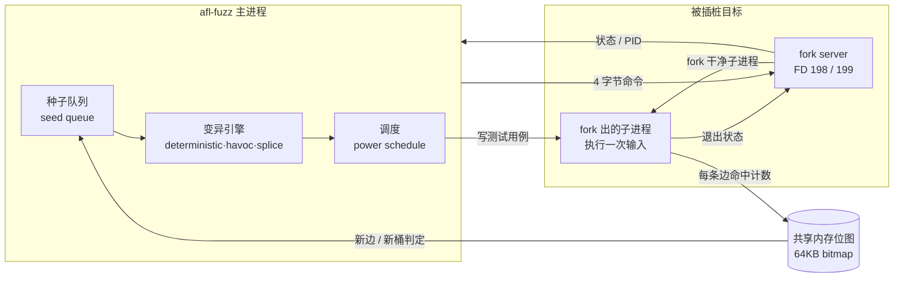
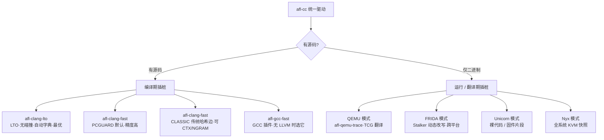
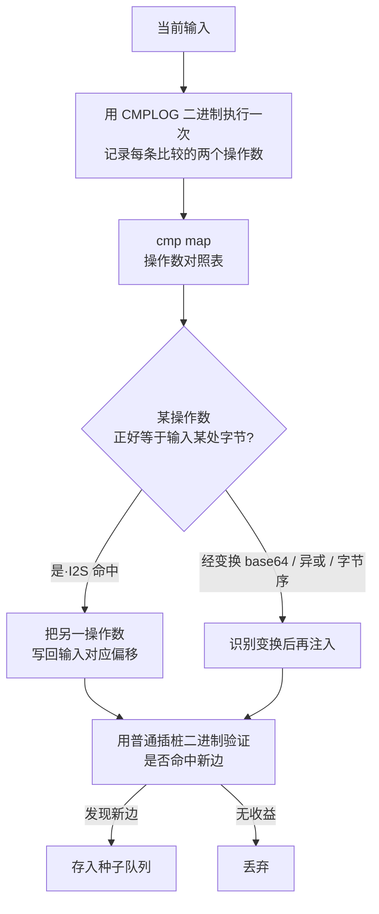
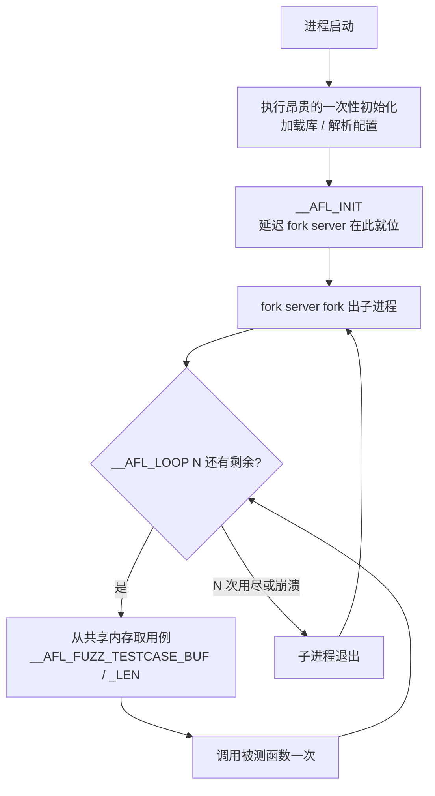

# Fuzzing与漏洞挖掘（3）· AFL++架构与使用
> [!abstract] TL;DR
> - AFL++ 是原始 AFL（停更于 2.52b）的社区续作，把十余年碎片化的模糊测试研究（AFLFast 调度、MOpt、RedQueen/CMPLOG、laf-intel、LTO 无碰撞插桩、QEMU/FRIDA 二进制模式）合并进一条可维护的主线，是当前源码可得目标的事实标准引擎之一。
> - 它的骨架仍是「afl-cc 插桩 + 共享内存位图 + fork server + afl-fuzz 驱动」四件套；把这条数据流理解透，是用好一切高级特性的前提。
> - 插桩模式是第一决策点：有源码优先 `afl-clang-lto`（无碰撞、自动字典），退而 `afl-clang-fast`（PCGUARD 默认）；无源码走 QEMU / FRIDA / Unicorn / Nyx。
> - CMPLOG（RedQueen 的输入到状态思想）在运行期记录比较操作数并把期望值回注输入，专治魔数、多字节比较与校验和这类随机变异几乎不可能跨越的「路障」。
> - persistent 模式用 `__AFL_LOOP` 在单进程内循环执行、配合共享内存投递用例，绕开 fork/execve 与静态初始化开销，常带来 10~20 倍吞吐。
> - 字典（`-x` / 自动字典 / `DICT2FILE`）与 CMPLOG 互补：一个是静态 token 注入，一个是动态求解；并行 fuzzing 靠 `-M/-S` 让多实例配置各异、经同步目录互相导入新种子。

## 概述与定位

AFL（American Fuzzy Lop）由 Michał Zalewski（lcamtuf）在 Google 开发，用一套「编译期插桩 + 遗传式变异 + 覆盖率反馈」的极简设计，几乎以一己之力把覆盖率引导灰盒模糊测试（coverage-guided greybox fuzzing）推成了行业默认范式。但原始 AFL 的开发在 2017 年的 2.52b 版本后基本停滞，此后学术界涌现出大量改进——更聪明的种子调度、更强的比较求解、更快的二进制插桩——却各自散落在一堆难以维护、互不兼容的 fork 里。**AFL++ 的定位，就是把这些「增量式研究成果」重新汇入一条工程化、持续维护的主干**，由 van Hauser（Marc Heuse）、hexcoder（Heiko Eißfeldt）、Andrea Fioraldi、Dominik Maier 等人领衔的 AFLplusplus 团队维护，并在 WOOT'20 以论文《AFL++: Combining Incremental Steps of Fuzzing Research》系统阐述了其设计取舍。

从使用者视角，AFL++ 与原始 AFL 命令行几乎兼容（`afl-fuzz -i in -o out -- ./target @@` 依然成立），却在几乎每一个环节都做了增强或替换：插桩从「汇编重写」升级为多种 LLVM/GCC 编译期方案乃至 LTO 全程序方案；变异器从固定流程扩展出可插拔的自定义变异器与 MOpt；调度从单一策略扩展为一整套 power schedule；并内建了 CMPLOG、laf-intel、持久模式、共享内存投递等提速与破障机制。当前主版本为 4.x 系列，长期活跃维护，支持 Linux 为主、并覆盖 macOS/BSD 与多种架构（x86/ARM 等）。

**本篇的边界需要先划清**，以免与相邻篇重复。覆盖率位图为何能引导搜索、AFL 的「边覆盖」核心思想与遗传算法直觉，属于上一篇 [[02.覆盖率引导原理：AFL的核心思想|覆盖率引导原理]]，本篇只做必要回顾并聚焦 AFL++ 的**具体实现与扩展**；PCGUARD / SanitizerCoverage 的编译器内部细节留给 [[04.编译期插桩：SanitizerCoverage与PCGUARD|下一篇]]；libFuzzer 自身的持久模型与进程内 fuzzing 留给 [[05.libFuzzer与持久模式]]；Sanitizer 家族的原理留给第 7 篇；字典/语料库的通用构造方法学、cmin/tmin 作为语料工程手段的深水区留给 [[09.语料库与字典与最小化]]；变异算子集合与调度算法的数学模型留给 [[10.变异策略与调度算法]]。本篇的主线是把 AFL++ 当作**一件要用好的工具与一套要理解的架构**：它由哪些部件组成、数据如何流动、四个种子要点（插桩模式、CMPLOG、persistent、字典）各自解决什么问题、以及在真实工程里如何组合。

## 原理与机制

AFL++ 的运行时可以拆成四个部件，理解它们之间的契约，胜过记住任何命令行选项。

**第一，afl-cc 编译器包装器。** 你不直接调用 clang/gcc，而是调用 `afl-clang-fast`、`afl-clang-lto`、`afl-gcc-fast` 这些包装器（它们都是统一驱动 `afl-cc` 的软链接）。包装器在正常编译之上，向目标注入「覆盖率采集代码」：在每条控制流边（edge，即基本块之间的跳转）上插入一小段逻辑，把这条边的命中信息写进一块共享内存。这就是灰盒的「灰」——不需要人读懂程序，编译器自动埋点。

**第二，共享内存位图（shared memory bitmap）。** 默认是一块 64 KB（2^16 字节）的数组 `__afl_area_ptr`，每个字节是一个「桶计数器」，对应一条边。经典编码方式沿用 AFL：给每个基本块分配一个随机 16 位 `cur_location`，边的下标由 `cur_location ^ prev_location` 得到，随后 `prev_location = cur_location >> 1`；右移一位是为了让 `A→B` 与 `B→A` 落到不同下标、区分方向。命中计数被「桶化」为 1、2、3、4-7、8-15、16-31、32-127、128-255 几档，只有跨桶变化才算「新行为」，避免循环次数抖动淹没信号。AFL++ 在此加了两处关键改良：其一是 **NeverZero**——原始 AFL 的计数器加到 255 再 +1 会回绕成 0，导致「这条边其实被命中过」被误判为「没命中」，AFL++ 让其带进位翻成 1，杜绝这种信号丢失（可用 `AFL_LLVM_SKIP_NEVERZERO` 关闭）；其二是**位图尺寸自适应**——在 LTO/PCGUARD 下编译器知道边的确切数量，AFL++ 会据此设定 `MAP_SIZE`，从根上减少哈希碰撞。

**第三，fork server（fork 服务器）。** 每测一个输入就 `execve` 一次整个程序，静态初始化、动态链接、`main` 之前的全部开销都要重来，慢得离谱。AFL 的经典优化是让目标在到达用户代码前先启动一个「fork 服务器」：它替 fuzzer 反复 `fork` 出干净子进程去执行单次输入。afl-fuzz 与 fork server 通过两个固定文件描述符（控制管道 198、状态管道 199）握手：fuzzer 写 4 字节「请 fork」，fork server 回子进程 PID，子进程跑完后 fork server 再回其退出状态（正常退出 / 被信号杀死 = 崩溃 / 超时）。这样每次执行只付出一次 `fork` 的代价，省掉了重复的镜像加载与初始化。

**第四，afl-fuzz 驱动主循环。** 它维护种子队列，从中挑选一个条目、施加变异、把变异后的用例交给 fork server 执行、读回共享内存位图，用位图判定「是否发现了此前未见过的边/桶」——若有新覆盖，就把该用例存入队列成为新种子；若导致崩溃/挂起，则存进 `crashes/` 或 `hangs/`。这个「选择—变异—执行—判定—入队」的闭环，就是遗传式搜索的引擎。



这四件套里，位图与 fork server 是 AFL 系一切性能与灵敏度的物理基础；后文的每一项高级特性，本质上都是在这条数据流的某个位置动刀：CMPLOG 在「变异」前插入一次带比较记录的执行，字典在「变异」阶段注入 token，persistent 模式改造「fork server + 执行」把单次执行变成进程内循环，各种插桩模式则替换掉「位图如何被填充」这一环。

## 插桩与关键机制详解：模式、CMPLOG、persistent 与字典

这一节把四个种子要点逐一讲透——它们既是 AFL++ 相对原始 AFL 的核心增量，也是实战中吞吐与命中率的分水岭。

### 插桩模式：第一决策点

AFL++ 通过 `afl-cc` 统一驱动暴露多种插桩后端，选哪种取决于「有没有源码、用什么编译器、追求速度还是精度」。



**有源码时的三档梯度。** 首选 `afl-clang-lto`（需 LLVM 11+ 与 lld）：它借链接期优化（LTO）在**看到整个程序**后，为每条边分配全局唯一的连续 ID，因此位图**无碰撞**——经典随机 16 位 ID 在边数上万时会大量哈希撞车，把不同的边混叠进同一个字节，覆盖率信号失真；LTO 从根上消除这个问题，并顺带做「自动字典」（见后）。次选 `afl-clang-fast` 的 **PCGUARD** 模式（现代 LLVM 上是默认），它复用 LLVM 的 SanitizerCoverage `trace-pc-guard` 机制，由编译器为每条边分配 guard 计数器，精度高、开销低（其编译器侧内幕见 [[04.编译期插桩：SanitizerCoverage与PCGUARD]]）。再次是 **CLASSIC** 模式，即原汁原味的 AFL 哈希边编码，兼容性最好，还可叠加 **上下文敏感覆盖**（`AFL_LLVM_CTX`，把调用栈上下文并入边 ID，区分「同一函数被不同路径调用」）与 **n-gram 覆盖**（`AFL_LLVM_NGRAM_SIZE`，把最近 N 条边的序列并入 ID，捕捉路径形状）——这两者提升灵敏度但也放大位图压力，属调优手段。没有 LLVM 的环境用 `afl-gcc-fast`（GCC 插件）。至于老式 `afl-gcc`/`afl-as` 汇编重写，AFL++ 仅为兼容保留、性能与精度都差，不应再用。

**无源码时的四条路。** **QEMU 模式**（`afl-qemu-trace`）用打过补丁的 QEMU 用户态模拟器，在 TCG 翻译基本块时插入覆盖记录，对纯二进制目标即插即用，代价是比源码插桩慢数倍；它也支持 QEMU 内的 CMPLOG（`AFL_QEMU_CMPLOG`）与持久模式（`AFL_QEMU_PERSISTENT_ADDR` 指定循环入口）。**FRIDA 模式**（`afl-frida-trace.so`）用 Frida 的 Stalker 做动态代码改写，跨平台性更好（可摸到闭源库、部分场景可用于 macOS），同样支持 CMPLOG 与持久点。**Unicorn 模式**针对没有完整进程上下文的裸代码/固件片段：你用 Unicorn Engine 手写一个模拟执行的 harness，在其中挂上 AFL++ 的钩子（`unicornafl`），常用于嵌入式/固件逆向。**Nyx 模式**走全系统路线，用 KVM 快照做极快的状态重置，适合内核、hypervisor、有状态服务这类必须「整机重放」的目标（详见 [[52.Linux内核机制与内核利用/18.内核Fuzzing与syzkaller]] 与 [[54.浏览器与JS引擎漏洞/00.浏览器与JS引擎漏洞总览]] 的相关讨论）。选择的深层逻辑是：**能拿到源码就别做二进制插桩**，源码方案在速度、精度、可叠加的破障特性上全面占优。

### CMPLOG：用输入到状态对应破「魔数」路障

覆盖率引导有个先天短板：面对 `if (x == 0xDEADBEEF)` 或 `if (memcmp(input, "MAGIC", 5) == 0)` 这类**多字节精确比较**，随机变异要恰好凑齐 4 字节魔数的概率是 2^-32，凑齐校验和更是天文数字——覆盖率位图对「差一个字节」和「差三个字节」给出的反馈完全相同，梯度为零，搜索会卡死在路障前。

CMPLOG 是 AFL++ 对 RedQueen 论文（NDSS'19《REDQUEEN: Fuzzing with Input-to-State Correspondence》）思想的落地。核心观察叫**输入到状态对应（input-to-state correspondence, I2S）**：程序里绝大多数「难跨越的比较」，其被比较的期望值其实**直接或经轻度变换地来自输入本身**——魔数常常就是把输入的某几个字节原样拿去和常量比。于是不必盲猜，而是**观察程序想要什么，再把它写回输入的对应位置**。



工程上分两步：先额外编译一个 **CMPLOG 二进制**（`AFL_LLVM_CMPLOG=1 afl-clang-fast ...`），它在每条比较指令、`memcmp/strcmp/strncmp` 等处埋点，把两侧操作数记进一块「cmp map」共享内存；运行时把它用 `-c 路径` 交给 afl-fuzz（`-c 0` 表示复用同一个已插桩二进制）。afl-fuzz 会先用 CMPLOG 二进制跑一遍当前输入、采集所有比较的操作数，再做**着色（colorization）**——扰动输入以确认哪些输入字节真正流入了哪个比较，建立偏移与期望值的对应，然后把期望值直接注入到输入的相应偏移，再用普通插桩二进制验证是否解锁新边。`-l` 控制强度：更高等级启用**变换识别**，能处理输入被 base64/十六进制/异或/字节序变换后再比较的情形，把「看似无关」的比较也还原成可注入的对应关系；`AFL_CMPLOG_ONLY_NEW` 让 CMPLOG 只作用于新发现的种子以省算力。CMPLOG 是 AFL++ 最具性价比的破障开关之一，遇到解析器/协议/带校验字段的目标几乎必开。

**与 laf-intel 的分工。** laf-intel 是**编译期**的互补方案（`AFL_LLVM_LAF_SPLIT_COMPARES`、`AFL_LLVM_LAF_SPLIT_SWITCHES`、`AFL_LLVM_LAF_TRANSFORM_COMPARES`，或 `AFL_LLVM_LAF_ALL` 全开）：它在编译时把「一次 4 字节比较」拆成嵌套的「逐字节比较」，于是每对上一个字节就多亮一条边、多一分覆盖率梯度，让普通变异也能「逐字节爬坡」跨过魔数。CMPLOG 是运行期直接求解、laf-intel 是编译期制造梯度，二者可同时用、也常分别部署在并行 fuzzing 的不同实例里以增加多样性。

### persistent 模式：单进程内循环，绕开 fork 开销

即便有了 fork server，每个用例仍要付一次 `fork` 的代价，且子进程要重新经历动态链接器解析符号、`main` 前的构造函数等。**persistent（持久）模式**更进一步：让目标在**同一个进程内**循环执行多次输入，只在积累若干次后才重启，从而把每用例的 `fork`/初始化摊薄到近乎为零。



典型的持久 harness 长这样（用 `afl-clang-fast` 编译，宏由它定义）：

```c
#include <stdint.h>
#include <unistd.h>

__AFL_FUZZ_INIT();                       // 文件作用域：声明共享内存用例缓冲

int main(void) {

  heavy_one_time_init();                 // 只需做一次的昂贵初始化

  __AFL_INIT();                          // 延迟 fork server：fork 点落在初始化之后
  unsigned char *buf = __AFL_FUZZ_TESTCASE_BUF;   // 指向共享内存的用例缓冲

  while (__AFL_LOOP(10000)) {            // 单进程内循环最多 1 万次再重启
    int len = __AFL_FUZZ_TESTCASE_LEN;  // 本次用例长度（afl-fuzz 写入）
    if (len < 4) continue;              // 长度门槛，跳过无意义调用
    target_parse(buf, len);            // 被测函数：解析一次输入
  }
  return 0;
}
```

这里有三个机制要拆开讲。**其一，`__AFL_INIT()` 延迟 fork server（deferred forkserver）**：默认 fork server 在 `main` 极早处启动，若目标启动要读大配置、连数据库、加载大模型，这些开销会被每个子进程重复付出；把 `__AFL_INIT()` 放在昂贵初始化**之后**，fork 点就落在「已初始化好的干净状态」上，每个子进程直接继承，省掉重复初始化。**其二，`__AFL_LOOP(N)`**：单进程内循环最多 N 次，期间不重启进程；跑够 N 次或中途崩溃才由 fork server 换新进程。为什么还要周期性重启？因为进程内循环会**累积状态**——未释放的内存、静态变量残留、堆碎片，久了会失真甚至假崩溃，定期 `fork` 一个干净副本可回收这些。**其三，共享内存投递用例**：`__AFL_FUZZ_TESTCASE_BUF`/`__AFL_FUZZ_TESTCASE_LEN` 让 afl-fuzz 把用例直接写进共享内存，harness 从内存指针取数，**彻底免掉文件读写与 `read()` 系统调用**，这是持久模式之上再叠一层的提速。

三者叠加，persistent 模式对「解析一个 buffer 就返回」类函数常有 **10~20 倍**吞吐提升，是把 CPU 喂饱的关键。但它有**必须遵守的正确性纪律**：被测函数若修改全局/静态状态，必须在每次迭代开始时复位，否则上一次用例的残留会污染这一次，制造**不可复现的假崩溃**或让稳定性（stability）掉下来；持有的文件句柄、内存必须每轮释放，否则句柄/内存泄漏会在循环中放大。判断一个目标是否适合持久化的经验法则是：**它能不能被反复调用而语义幂等**——纯解析器最理想，带持久副作用（写文件、改数据库、依赖全局单例）的目标要么改造要么降级用普通模式。需要补充边界：AFL++ 的持久模式与 libFuzzer 的 `LLVMFuzzerTestOneInput` 进程内模型是**两套等价思路**，AFL++ 甚至能直接编译 libFuzzer 风格的 harness（借 `aflpp_driver`/`libAFLDriver.a`）与之桥接——但 libFuzzer 自身的持久语义与 in-process 细节属于 [[05.libFuzzer与持久模式]]，harness 如何裁剪目标、如何写好一个入口属于 [[08.Harness编写与目标裁剪]]。

### 字典：静态 token 注入与自动提取

面对结构化输入（HTML、SQL、协议、文件格式），很多关键 token 是**多字节固定串**（`<script>`、`SELECT`、PNG 头 `\x89PNG...`），靠比特翻转拼出来同样是天方夜谭。字典的作用，就是把这些「有意义的原子」预置给变异器，让它在变异时**整块插入/覆盖**这些 token，直接跳到「语法上说得通」的输入空间。

用法上，`-x dict.file` 提供字典，格式简单：

```
# 每行一个 token，支持 \xNN 转义
keyword_html="<html>"
magic_png="\x89PNG\x0d\x0a\x1a\x0a"
sql_select="SELECT"
rare_token@2="only_used_at_level_2"    # @level 控制优先级层级
```

变异阶段会在确定性阶段（插入/覆盖字典项）与 havoc 阶段随机使用这些 token。**AFL++ 的增量在于两条自动化路径**：其一，**LTO 模式的自动字典（autodictionary）**——`afl-clang-lto` 在编译时扫描 `strcmp/memcmp/strncmp` 等对**常量字符串**的比较，把这些常量自动收集为字典，无需手工整理，这是「有源码就上 LTO」的又一理由；其二，`AFL_LLVM_DICT2FILE=/path/x.dict afl-clang-fast ...` 在编译期把发现的常量导出成字典文件，供后续 `-x` 复用。**字典与 CMPLOG 的关系是互补而非替代**：字典是**静态**的、编译期或人工准备好的 token 集合，命中稳定但覆盖不到运行期才计算出的期望值；CMPLOG 是**动态**的、逐次执行时求解真实比较值，能处理校验和/运行期常量，但每步有额外执行开销。实战中常「LTO 自动字典 + CMPLOG」同开，或在并行实例间分工：一部分实例吃手工字典、一部分吃 CMPLOG。至于字典的通用构造方法学、如何从格式规范/语料里挖 token、以及语料库最小化，属于 [[09.语料库与字典与最小化]]；把语法/protobuf 结构塞进变异器则要用自定义变异器，属于 [[11.结构化Fuzzing：语法与protobuf]]。

## 工具视角与实战

AFL++ 是一整套工具链，`afl-fuzz` 只是其中最显眼的一件。

**编译与准备。** 用 `afl-clang-lto`/`afl-clang-fast` 替换 `CC`/`CXX` 编译目标即可获得插桩二进制；库目标则先写 harness（读入 `@@` 指定的文件或走持久模式），再链接。语料准备是命中率的隐形杠杆：给 `-i` 一个**小而多样**的种子目录，格式越贴近真实输入、越能让 fuzzer 快速铺开覆盖。

**主控与状态屏。** 最小命令 `afl-fuzz -i in -o out -- ./target @@`（`@@` 会被替换为当前用例文件路径；走 stdin 则省略）。运行后那块著名的状态屏值得逐块读懂：`process timing` 看已跑多久、上次发现新路径/崩溃距今多久（长时间没新发现 = 可能收敛或卡住）；`overall results` 的 `cycles done` 表示队列被完整过了几轮，其颜色转绿意味着「大概率挖不动了」；`map coverage` 的 `map density` 是位图被点亮的比例——太低说明没铺开、逼近 100% 则位图可能饱和需换更大 map 或无碰撞插桩；`stage progress` 的 `exec speed`（exec/s）是吞吐命脉，个位数到几十基本等于没在 fuzzing，健康值常在数百到数万；`path geometry` 的 **stability%** 尤其关键——它衡量「相同输入是否每次点亮相同的边」，低于 ~90% 说明目标有不确定性（未初始化内存、多线程、哈希序、依赖 ASLR/时间/随机数），这会严重稀释覆盖率信号，需回头消除不确定性或用 persistent 模式复位状态。`fuzzing strategy yields` 则告诉你收益来自哪个阶段（bitflip / arithmetic / dictionary / havoc / splice），据此判断该不该加字典或开 CMPLOG。

**配套工具。** `afl-cmin` 做**语料最小化**（在保持相同边覆盖的前提下把语料集裁到最小子集，喂给 `-i` 前跑一遍能显著加速）；`afl-tmin` 做**单用例最小化**（在保持崩溃/行为不变的前提下把一个输入缩到最短，是崩溃三角化的第一刀）；`afl-showmap` 单次执行并导出命中的边集合，用于脚本化比较覆盖；`afl-whatsup` 汇总一整片并行实例的战况；`afl-plot` 从 `plot_data` 生成覆盖率/速度曲线；`afl-analyze` 分析输入里哪些字节影响行为（辅助理解格式）；`afl-system-config` 一键把内核参数（`core_pattern`、CPU 调频 governor 等）调到 fuzzing 友好态；`afl-gotcpu` 看空闲核。

**CMPLOG 与并行的实战组合。**

```bash
# 三个二进制：普通插桩、CMPLOG、（可选）laf-intel
afl-clang-fast -o tgt tgt.c
AFL_LLVM_CMPLOG=1  afl-clang-fast -o tgt.cmplog tgt.c
AFL_LLVM_LAF_ALL=1 afl-clang-fast -o tgt.laf tgt.c

# 并行：一个 -M 主实例做确定性 + 同步，多个 -S 次实例各带不同配置
afl-fuzz -i in -o sync -M main            -- ./tgt @@
afl-fuzz -i in -o sync -S s1 -c ./tgt.cmplog -- ./tgt @@       # 开 CMPLOG
afl-fuzz -i in -o sync -S s2 -p fast      -- ./tgt @@          # 换调度
afl-fuzz -i in -o sync -S s3 -L 0         -- ./tgt @@          # 开 MOpt
afl-fuzz -i in -o sync -S s4              -- ./tgt.laf @@      # 用 laf 二进制
```

**并行 fuzzing 的精髓是「多样性」**：所有实例共享同一个 `-o` 同步目录，各自有子目录，周期性把彼此队列里的新种子**互相导入**；因此不该让 N 个实例配置雷同，而要让它们在插桩方案、调度策略（`-p explore/fast/coe/exploit/rare/seek...`，机制细节见 [[10.变异策略与调度算法]]）、是否开 CMPLOG/laf/MOpt（`-L 0`）、字典是否不同上**刻意错开**——一个实例卡住的路障，另一个配置可能轻松跨过，再经同步扩散给全体。

**常用环境变量（AFL_*）。** 编译期：`AFL_USE_ASAN=1`/`AFL_USE_UBSAN=1`/`AFL_USE_MSAN=1` 叠加 Sanitizer（原理见第 7 篇）、`AFL_HARDEN=1` 加固检测。运行期：`AFL_PRELOAD` 给目标注入 `LD_PRELOAD`（如 desock 把网络服务改成读 stdin）、`AFL_CUSTOM_MUTATOR_LIBRARY`/`AFL_PYTHON_MODULE` 挂自定义变异器（结构化 fuzzing 的入口，API 有 `afl_custom_init`/`afl_custom_fuzz` 等）、`AFL_AUTORESUME=1` 断点续跑、`AFL_TESTCACHE_SIZE` 设内存内用例缓存换吞吐、`AFL_TMPDIR` 把临时文件放 tmpfs 省 IO、`AFL_SKIP_CPUFREQ`/`AFL_NO_AFFINITY` 处理调频与绑核。值得一提：AFL++ 默认**不限制目标内存**（老 AFL 默认 50MB 常误伤），`-m none` 是常态；`-t` 设执行超时、`-G`/`-g` 约束用例长度。

## 安全性与正确使用

模糊测试是把「让程序崩溃」当目标的技术，其产物是可复现的崩溃乃至可利用的漏洞，因此使用边界必须先立规矩。

> [!caution] 合规边界与免责
> AFL++ 及本文所述一切技术，**仅可用于你拥有所有权或已获得明确书面授权的目标、CTF 靶场与合法安全研究环境**。对第三方的生产系统、他人软件或未授权目标实施模糊测试与漏洞利用，可能违反计算机犯罪、软件许可与服务条款等法律法规。本文一律采取**防御 / 教育视角**：讲清覆盖率引导、CMPLOG、持久化、字典等机制的原理，是为了让你更好地**加固自有软件、复现并修复缺陷、辅助授权评估**；本文**不提供**针对真实生产系统或他人系统的武器化步骤，**不为绕过任何商业授权或版权保护**提供成品配方。发现真实软件缺陷时，应遵循**负责任披露**流程通知厂商，而非公开利用。

在此前提下，「正确使用」还有一层**工程正确性**含义，直接决定结果可信度。

**崩溃只是起点，不是终点。** AFL++ 报的每个 crash 都要经去重、三角化与可利用性判定：先用 `afl-tmin` 收敛输入，再叠加 ASan 等 Sanitizer 复现以拿到精确的越界/释放后使用位置，然后按崩溃点与调用栈去重（同一根因常炸出成百上千个「不同」用例）。这一整套属于 [[16.崩溃分类与去重与可利用性]]；而一个内存破坏崩溃如何顺着利用链变成实际危害、危害有多大，要接到 [[33.二进制漏洞与利用基础/01.内存破坏漏洞全景与利用链模型]] 去评估——**能崩不等于能利用**，可利用性判定要谨慎、留证据、走授权流程。

**别让环境骗了你。** 几个常见「假结果」来源：其一，`core_pattern` 若指向崩溃转储程序（如 apport），fork 出的崩溃子进程会卡在转储上、被 fuzzer 当成超时，务必按提示把 `/proc/sys/kernel/core_pattern` 设为 `core` 或用 `AFL_I_DONT_CARE_ABOUT_MISSING_CRASHES`/`afl-system-config` 处理；其二，**stability 偏低**（未初始化内存、多线程、ASLR/时间依赖）会让覆盖率信号失真，既拖慢搜索又制造不可复现崩溃，应优先消除不确定性（固定随机种子、单线程化 harness、持久模式每轮复位状态）；其三，持久模式下的**状态泄漏**会伪造崩溃，见上文纪律。

**资源与隔离。** fuzzing 会长时间跑满 CPU、频繁写盘，应在**隔离环境**（专用机/容器/虚机）里进行，把输出目录放 tmpfs 减损耗、限制核数留余量，切勿在共享的生产主机上直接开跑。开 Sanitizer 会显著增加内存占用，配合 `-m` 与系统内存要留意。对内核/驱动/浏览器这类高危目标，更要走快照/虚拟化隔离（分别见 [[52.Linux内核机制与内核利用/18.内核Fuzzing与syzkaller]]、[[38.Windows内核与驱动逆向/30.内核Fuzzing]]、[[54.浏览器与JS引擎漏洞/00.浏览器与JS引擎漏洞总览]]），避免污染宿主。

## 小结

AFL++ 的价值不在某个单点技巧，而在于它把「覆盖率引导灰盒 fuzzing」十余年的研究增量**收编进一条工程化主线**，且保持了 AFL 那套「插桩 + 位图 + fork server + 驱动」骨架的简洁与可理解性。用好它的心智模型是：先在**插桩模式**上做对第一决策（有源码就 LTO / PCGUARD，无源码按 QEMU/FRIDA/Unicorn/Nyx 选路），把无碰撞与自动字典这些红利吃到；再用 **CMPLOG**（运行期 I2S 求解）与 **laf-intel / 字典**（编译期梯度 / 静态 token）组合破除魔数与校验路障；用 **persistent 模式 + 共享内存投递**把吞吐拉高一个数量级、同时守住状态复位的正确性纪律；最后靠 **`-M/-S` 并行 + 配置多样性**让多实例互补、经同步目录扩散彼此的突破。理解每个特性「在四件套数据流的哪一环动刀、为解决什么问题」，比背命令行更重要——命令行会变，机制不会。把崩溃产物交给去重、三角化与利用链评估的下游，并始终守住「仅授权环境、防御视角」的合规底线，才让这台强大的引擎既有效、又正当。

## 相关阅读

- 官方与规范：AFL++ 官方仓库与文档 `github.com/AFLplusplus/AFLplusplus`（尤其 `docs/fuzzing_in_depth.md`、`docs/best_practices.md`、`instrumentation/README.*`、`docs/env_variables.md`）；lcamtuf 原始 AFL 的 `technical_details.txt` 白皮书。
- 论文：《AFL++: Combining Incremental Steps of Fuzzing Research》(WOOT 2020)；《REDQUEEN: Fuzzing with Input-to-State Correspondence》(NDSS 2019, CMPLOG 之源)；《Coverage-based Greybox Fuzzing as Markov Chain》(AFLFast, CCS 2016)；《MOPT: Optimized Mutation Scheduling for Fuzzers》(USENIX Security 2019)；《Nyx: Greybox Hypervisor Fuzzing using Fast Snapshots and Affine Types》(USENIX Security 2021)；laf-intel 博文《Circumventing Fuzzing Roadblocks with Compiler Transformations》。
- 本系列相邻篇：[[02.覆盖率引导原理：AFL的核心思想|← 覆盖率引导原理]]、[[04.编译期插桩：SanitizerCoverage与PCGUARD|→ 编译期插桩内幕]]、[[05.libFuzzer与持久模式]]、[[08.Harness编写与目标裁剪]]、[[09.语料库与字典与最小化]]、[[10.变异策略与调度算法]]、[[11.结构化Fuzzing：语法与protobuf]]、[[16.崩溃分类与去重与可利用性]]。
- 同库交叉：[[48.动态插桩与模拟执行引擎/12.插桩驱动的分析：覆盖率与污点与trace]]（覆盖率反馈的引擎侧实现）、[[33.二进制漏洞与利用基础/01.内存破坏漏洞全景与利用链模型]]（崩溃转利用）、[[52.Linux内核机制与内核利用/18.内核Fuzzing与syzkaller]]、[[54.浏览器与JS引擎漏洞/00.浏览器与JS引擎漏洞总览]]、[[38.Windows内核与驱动逆向/30.内核Fuzzing]]。

[[00.Fuzzing与漏洞挖掘总览|⬆ 系列总览]] | [[02.覆盖率引导原理：AFL的核心思想|← 上一章]] | [[04.编译期插桩：SanitizerCoverage与PCGUARD|→ 下一章]]
