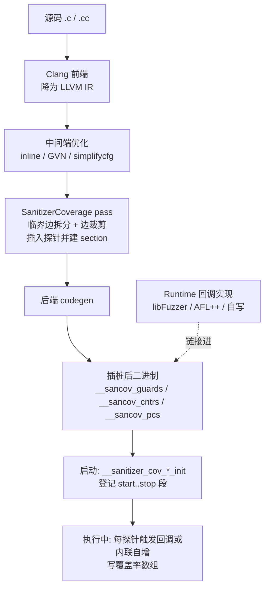
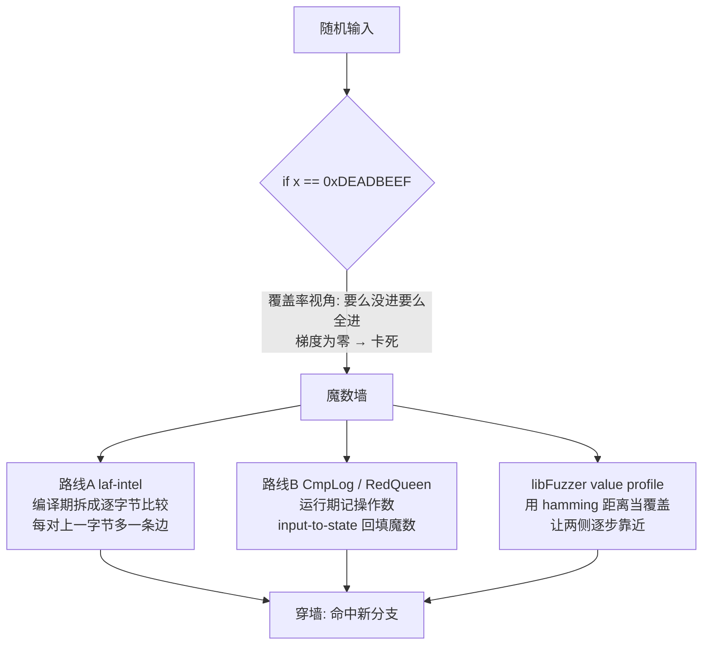

# Fuzzing与漏洞挖掘（4）· 编译期插桩：SanitizerCoverage与PCGUARD

> [!abstract] TL;DR
> - SanitizerCoverage（SanCov）是 LLVM 中间端的一个 module pass，把「覆盖率采集」直接编译进目标程序本身；libFuzzer、AFL++、honggfuzz 都以它为共同底座，因此编译期插桩比 QEMU 等运行期方案快 1~2 个数量级。
> - 三条主力通道各司其职：`trace-pc-guard` 每条边发一次回调、用 guard 变量映射唯一边 ID；`inline-8bit-counters` 内联把边计数器加一、零函数调用开销；`pc-table` 交出每个插桩点的 PC 供符号化与去重。
> - AFL++ 的默认模式 PCGUARD 正是 `trace-pc-guard` 的定制版：用「启动时连续赋唯一 ID」取代经典 AFL 的 `(prev>>1)^cur` 随机异或，从根上消除 64 KB 位图里的边碰撞。
> - 比较插桩攻克「魔数 / 多字节比较」这一覆盖率盲区，两条路线：laf-intel 在编译期把宽比较拆成逐字节比较制造中间覆盖；CmpLog/RedQueen 在运行期记操作数、做 input-to-state 把魔数直接回填进输入。
> - 计数器要配「计数分桶（count classes）」压掉循环噪声，还要用 NeverZero 的进位技巧躲开 255→0 溢出把「命中」误判成「未命中」。
> - 插桩粒度（func/bb/edge）、临界边拆分、边裁剪（no-prune）、allowlist/ignorelist 共同决定信噪比与开销，是实战调参的核心旋钮。

## 概述与定位

覆盖率引导型 fuzzing 由三件事咬合而成：变异器造输入、目标程序执行、覆盖率反馈告诉调度器「这条输入是否走到了新地方」。第 2 章讲透了「为什么覆盖率能当梯度」，本篇专攻这条链路里最底层、也最容易被当黑盒的一环——**反馈信号到底是怎么从二进制里被采出来的**，而且只钉死「编译期」这一支。

采集覆盖率有两条大路。一是**运行期插桩**：用 QEMU 用户态模拟、DynamoRIO/Pin 动态二进制改写、或 Intel PT 硬件轨迹，在没有源码的黑盒二进制上「边跑边记」，代价是翻译执行带来的几倍到几十倍拖慢（详见 [[48.动态插桩与模拟执行引擎/12.插桩驱动的分析：覆盖率与污点与trace]]）。二是**编译期插桩**：有源码时，在编译过程中就把「探针」织进程序，让目标**自己**在运行时把覆盖率写进一块共享内存。本篇讲的 SanitizerCoverage 与 PCGUARD 属于后者。

编译期插桩有三个压倒性优点。**速度**：一个探针往往只是一条内联自增指令，几乎无额外开销，比翻译执行快一到两个数量级，这决定了单核每秒能跑多少次目标、进而决定 fuzzing 的吞吐上限。**精度**：插桩在 LLVM IR 层面进行，能精确切到「边」、能读出 `icmp` 两侧的实际操作数、能和编译器优化协同。**可组合**：它与 AddressSanitizer 等检测器共享同一条编译管线，一次编译既拿覆盖率又拿越界检测（第 7 章）。代价也很实在：需要源码、需要重编、探针会改变代码布局与时序，因此插桩二进制不是「原程序」而是「为测试而生的孪生体」。

这里要厘清一个常被误解的定位：**SanitizerCoverage 不是一个 fuzzer，而是「编译器提供的覆盖率插桩基础设施」**。它只负责一件事——在合适的位置插入「对若干弱符号回调的调用」或「对某个全局数组元素的内联自增」；这些回调的**实现（runtime）**由使用者填：libFuzzer 自带一套、AFL++ 提供一套、你自己写十行也能提供一套。这种「机制与策略分离」正是它能成为所有主流引擎共同底座的根本原因。而 **PCGUARD 是 AFL++ 的默认、推荐插桩模式**，它是 SanCov `trace-pc-guard` 通道的一份定制 pass。

边界声明，避免与相邻篇重复：第 2 章是原理层（为什么覆盖率是梯度），第 3 章是工具层（AFL++ 怎么装怎么跑，见 [[03.AFL++架构与使用]]），第 5 章讲 libFuzzer 如何在**进程内**消费这些计数器（[[05.libFuzzer与持久模式]]），第 7 章讲 Sanitizers 如何把「到达」变成「抓到 bug」。本篇只回答一个问题：**编译器到底往二进制里插了什么、怎么插、每条通道的取舍是什么。**

## 原理与机制

**插桩发生在编译管线的哪一环？** SanCov 是一个运行在 LLVM 中间端的 pass（`ModuleSanitizerCoverage`），作用于**优化流水线后期**的 LLVM IR。这一点极关键：它在优化**之后**插桩，看到的是优化后的控制流图——被内联掉、被死代码消除掉的分支不会插桩。这既是特性（不给死代码浪费探针），也是陷阱（`-O0` 与 `-O2` 的覆盖率「形状」并不相同，换优化级别等于换了一张地图）。

**插桩插在什么位置？** 由「粒度」决定：`func` 每函数一个探针（最粗）；`bb` 每基本块一个；`edge`（默认）是边级——通过**临界边拆分（critical edge splitting）**，把 `A→B`、`A→C` 这类共享源块的边各自插入一个新块，从而近似「边覆盖」。为什么坚持边而非块？因为「走到块 B」远不如「从 A 走到 B」信息量大，边覆盖能区分不同的路径分叉，是灰盒 fuzzing 的黄金反馈粒度。

**边裁剪（prune）**：SanCov 默认会用支配关系裁掉「必然被其它探针覆盖」的冗余边以省探针与开销；`-fsanitize-coverage=no-prune` 关掉裁剪换取满分辨率。裁剪是开销与分辨率之间的一次默认取舍。

**运行期契约（runtime contract）——理解一切的钥匙。** SanCov 插桩产出两样东西：

1. 在每个插桩点插入「对某个弱符号回调的调用」或「对某个全局数组元素的内联自增」；
2. 把所有 guard / counter / pc 收进专门的 section（`__sancov_guards`、`__sancov_cntrs`、`__sancov_pcs`），并生成启动构造器，在程序 `main` 之前把每个 section 的 `[start, stop)` 区间传给对应的 `__sanitizer_cov_*_init` 回调。

链接器会为每个具名 section 自动合成 `__start___sancov_guards` / `__stop___sancov_guards` 这类边界符号，构造器读它们就拿到了「本模块全部探针的地址范围」。于是 runtime 只要实现这几个弱符号，就同时握有「全部探针的边界」与「每次命中的通知」两把信息——这就是它能被任意引擎接管的机制。

**最终形态永远是一段覆盖率数组**：无论走哪条通道，覆盖率落地都是「一段内存数组，索引 = 边 ID，值 = 命中信息」。AFL 家族是 64 KB 的 `__afl_area_ptr` 字节位图（放共享内存，供 forkserver 里的子进程写、父进程读比对）；libFuzzer 则是进程内的 8-bit 计数器数组加 PC 表。



## 插桩内核详解：三条覆盖率通道、比较插桩与位图

### trace-pc-guard：用 guard 变量换取无碰撞边 ID

`-fsanitize-coverage=trace-pc-guard` 给每个插桩点分配一个 `uint32_t` guard 变量，放进 `__sancov_guards` section，并在插桩点插入一句 `__sanitizer_cov_trace_pc_guard(&guard)`。启动时的 `__sanitizer_cov_trace_pc_guard_init(uint32_t* start, uint32_t* stop)` 会遍历 `[start, stop)`，给每个 guard 赋一个**全局唯一、连续**的编号——**这个编号就是边 ID**。

这里藏着 PCGUARD 全部优越性的来源：**边 ID 不是编译期写死的随机数，而是启动时按 section 顺序连续分配的。** 同一个二进制里，每条边天然拿到唯一且连续的 ID，互不碰撞；多个 `.o` / `.so` 各自登记、串成一段连续区间。对比经典 AFL 用编译期随机数当边 ID（下文详述），这是本质区别。

回调收到的是 guard 的**地址**而非值，这个设计不是多余——runtime 可以**回写** guard。最常见的用法是「首次命中即禁用」：在回调里 `if (!*guard) return;` 把已经数过的边置零，后续再走到这条边就直接短路返回，省掉重复回调开销。标准的最小 runtime 长这样：

```c
#include <stdint.h>
static uint32_t *g_start, *g_stop;
// 启动时被调用一次，登记 guard 段并给每个 guard 赋唯一 ID
void __sanitizer_cov_trace_pc_guard_init(uint32_t *start, uint32_t *stop) {
  static uint32_t N;                    // 全局边计数器
  if (start == stop || *start) return;  // 已初始化则跳过
  g_start = start; g_stop = stop;
  for (uint32_t *x = start; x < stop; x++)
    *x = ++N;                           // 连续、唯一的边 ID
}
// 每命中一条边被调用一次
void __sanitizer_cov_trace_pc_guard(uint32_t *guard) {
  if (!*guard) return;                  // 该边已记录 → 短路，避免重复开销
  void *pc = __builtin_return_address(0); // 需要时可拿到边的 PC
  // 真实引擎在此: 覆盖率数组第 *guard 格自增；或写共享内存位图
}
```

从 IR 视角看，pass 做的事就是在临界边拆分后的每个新块头部塞进一条 `call @__sanitizer_cov_trace_pc_guard(ptr @guard.i)`。删掉这段代码你也能讲清楚：**编译器给控制流图的每条边挂了一个门铃，按一次响一声，门铃编号在开机时依次编好。**

**AFL++ PCGUARD 的定制**是理解「无碰撞又不慢」的关键。AFL++ 并不走「每命中一次就调一次函数」这条慢路，而是 fork 了一份自己的 SanCov pass（`SanitizerCoveragePCGUARD.so.cc`），在插桩点**直接内联**生成等价于 `__afl_area_ptr[guard_id]++` 的 IR，省掉了函数调用、寄存器保存与回调体。可以把它理解为「guard 通道拿唯一 ID」与「下节 inline-counter 通道的内联自增」二者的合体——这解释了为什么 PCGUARD 既继承了 guard 的无碰撞，又达到了内联计数的速度。

作为对照，更老的 `-fsanitize-coverage=trace-pc`（无 guard）插入的是无参的 `__sanitizer_cov_trace_pc()`，runtime 只能靠 `__builtin_return_address` 拿 PC 再哈希进位图。PC 哈希会碰撞、且每次命中都要现算，已被 trace-pc-guard 全面取代，仅在极老工具链里还能见到。

### inline-8bit-counters：把回调压成一条自增指令

`-fsanitize-coverage=inline-8bit-counters` 给每个插桩点在 `__sancov_cntrs` section 里分配一个字节，插桩点**内联**生成 `counter++`（一条 load/add/store，在 x86 上可以是单条 `inc byte ptr`），**没有任何函数调用**。启动时 `__sanitizer_cov_8bit_counters_init(char* start, char* stop)` 登记数组区间，runtime 把这段内存直接当覆盖率数组读。

**为什么是 8 bit 而不是 1 bit？** 一个字节能记「命中次数」的粗略量级，配合下面的计数分桶，就能区分「这条边这次输入走了 1 遍 / 8 遍 / 100 遍」，路径分辨率比纯 hit/no-hit 高得多——循环体走的次数常常正是「输入触发了不同处理量」的信号。

**计数分桶（count classes）** 是必须搭配的一步。若把原始计数值直接当反馈，循环次数的微小抖动（走了 17 次还是 18 次）会制造海量「疑似新覆盖」的假信号，把种子队列撑爆。AFL 的经典做法是把计数值**桶化**成 8 个对数级等价类，落成 8 个互不相同的独热字节：

```
命中次数        桶(等价类字节)
0            →  0000_0000   (未命中，保持 0)
1            →  0000_0001
2            →  0000_0010
3            →  0000_0100
4  .. 7      →  0000_1000
8  .. 15     →  0001_0000
16 .. 31     →  0010_0000
32 .. 127    →  0100_0000
128 及以上    →  1000_0000
```

桶化后，只有「跨过桶边界」的量级变化才算「新覆盖」，既保留了「走 5 次 vs 走 50 次」这类有意义的差异，又把连续计数压成少数几个稳定状态，不再被循环噪声淹没。删掉表你也能记住这句话：**用对数分桶把「次数」量化成「量级」。**

**NeverZero 陷阱与进位修复**：字节计数器 `255 → 0` 会溢出。如果某条边恰好被走了 256 次，计数器归零后会被判成「从未命中」——等于凭空丢掉一条边，甚至让已入队的样本「回退」。AFL++ 的 NeverZero 用无分支进位修掉它：`cnt++; cnt += (cnt == 0);`（编译成 `add` 后跟一条 `adc`），溢出时落到 1 而非 0。这是个典型的「罕见但致命的正确性 bug，用一条指令的代价换绝对可靠」的工程决策。

**inline-bool-flag**（`-fsanitize-coverage=inline-bool-flag`）更省：每条边只用一个 bool 记 hit/no-hit，用 `__sanitizer_cov_bool_flag_init` 登记。适合只关心「是否到达」而不关心次数的场景，内存更小、cache 更友好。

**性能对比**：inline-8bit-counters 约等于「一条内存自增」，比 trace-pc-guard 的「call + 保存易失寄存器 + 执行回调体」快得多。这正是 **libFuzzer 默认用 `inline-8bit-counters` + `pc-table`** 的原因，也是 AFL++ PCGUARD 选择内联自增而非回调的原因。

### pc-table / stack-depth / indirect-calls：辅助通道

**pc-table**（`-fsanitize-coverage=pc-table`）生成 `__sancov_pcs` 段，每个插桩点记两个字：PC 与 flags（flags 标记「是否函数入口」等）。为什么需要它？计数器数组只知道「第 i 个字节命中了」，要把 i 映射回「哪一行代码」，必须有一张 PC 表；libFuzzer 用它做符号化、崩溃去重、`-print_pcs`。pc-table 必须与 inline-8bit-counters **一一对应、同序**，二者几乎总是一起开。

**stack-depth**（`-fsanitize-coverage=stack-depth`）维护线程局部的 `__sancov_lowest_stack`，在函数入口更新「最深栈」，可把「深递归 / 接近爆栈」也变成一种可反馈信号，或用于提前发现 stack-overflow / OOM 前兆。

**indirect-calls**（`-fsanitize-coverage=indirect-calls`）在每个间接调用点插入 `__sanitizer_cov_trace_pc_indir(callee)`，记录 `(caller, callee)` 对，用来刻画虚函数 / 函数指针分派带来的控制流，区分「到底调到了哪个实现」。此外还有较新的 `trace-loads` / `trace-stores` 内存访问插桩，为数据流敏感的 fuzzing 服务。

### 比较插桩：攻克魔数与多字节比较

先看问题。覆盖率反馈对 `if (x == 0xDEADBEEF)` 这类「全有或全无」的宽比较**无能为力**：随机变异几乎不可能一次凑齐这 4 个字节，位图上永远只有「没进这个分支」，梯度恒为零，fuzzer 卡死在门口。这堵墙叫「魔数墙 / magic bytes」，也是校验和、magic header、口令比较普遍制造的死路。比较插桩就是给这堵墙造梯子，业界有两条互补的技术路线。



**路线 A：laf-intel（编译期拆分，制造中间覆盖）。** 思想是「反优化」——把一个宽比较拆成逐字节的嵌套比较，每对上一个字节就多命中一条边、多一格覆盖，于是「全有或全无」被改写成「逐字节爬坡」。`x == 0xDEADBEEF` 被拆成先比最高字节 `0xDE`、再 `0xAD`、再 `0xBE`、再 `0xEF`，每一级都是独立分支，fuzzer 每凑对一个字节就得到一次正反馈。AFL++ 用环境变量开关：`AFL_LLVM_LAF_SPLIT_COMPARES`（拆整数比较）、`AFL_LLVM_LAF_TRANSFORM_COMPARES`（把 `strcmp`/`memcmp`/`strncmp` 等转成可拆的形式）、`AFL_LLVM_LAF_SPLIT_SWITCHES`（拆 switch）、`AFL_LLVM_LAF_SPLIT_FLOATS`（拆浮点比较）、`AFL_LLVM_LAF_ALL`（全开）。代价是分支数暴涨——位图占用与碰撞风险上升、编译变慢，而且它把「值信息」间接编码成「更多的边」，信号有噪声。

**路线 B：CmpLog / RedQueen（运行期记值 + input-to-state）。** 思想更直接：把每个比较的**实际操作数值**记下来，然后在当前输入里找到与操作数相同的字节串，把它替换成「被比较的另一侧值」。这就是 RedQueen 的 **input-to-state（I2S）推断**——程序内部拿去比较的那个值，很可能就是输入里某几个字节原样或简单编码搬进来的；找到「状态」里出现的值、反推它对应输入里的哪几个字节，就能精准地把魔数「回填」进正确偏移。AFL++ 的实现叫 **CmpLog**：需要**单独编译一份 `-c`（cmplog）二进制**（用 `AFL_LLVM_CMPLOG=1` 插桩，把每个比较两侧操作数写进 CmpLog map），fuzzer 拿**主二进制**跑覆盖、拿 **cmplog 二进制**取操作数做替换。相比 laf-intel，它不炸位图、且能一步到位地放对魔数，是现代 AFL++ 对付魔数的首选。

**SanCov trace-cmp（libFuzzer 消费的那一套）。** `-fsanitize-coverage=trace-cmp` 在每个 `icmp` 前插入回调，把值交给 runtime：

- `__sanitizer_cov_trace_cmp1/2/4/8(Arg1, Arg2)`：按 1/2/4/8 字节宽记录两侧操作数；
- `__sanitizer_cov_trace_const_cmp1/2/4/8(Arg1, Arg2)`：当一侧是**编译期常量**时用这个变体——常量能直接进 fuzzer 的**自动字典（autodict）**，把魔数当 token 喂给变异器；
- `__sanitizer_cov_trace_switch(Val, Cases[])`：switch 的多路比较；
- `__sanitizer_cov_trace_div4/8(Val)`：除法（抓「除以某魔数」，也帮着凑值）；
- `__sanitizer_cov_trace_gep(Idx)`：`getelementptr` 数组下标，帮助推断与索引相关的约束。

其中 switch 的 `Cases[]` 数组布局如下（这类紧凑二进制布局用代码块+文字说明，不硬塞进 mermaid）：

```
Cases[0]        = case 的个数 N
Cases[1]        = 操作数位宽 (8 / 16 / 32 / 64)
Cases[2 .. N+1] = 各 case 的常量值，已按升序排列
```

runtime 拿到 `Val` 和这张表，既能把所有 case 常量收进字典，又能算「离最近的 case 还差多少」以指导变异；升序排列是为了便于二分求最近值。

**libFuzzer 的 value profile**（`-use_value_profile=1`）是又一巧劲：它把每个比较点算成一个 `(PC, hamming(Arg1, Arg2))` 之类的特征，塞进覆盖率信号——两侧操作数越接近相等，这个特征越「新」，于是 fuzzer 被奖励「让两侧更靠近」，等于**用覆盖率机制模拟出一条对宽比较的连续距离梯度**，不改一行目标源码就把魔数墙削成缓坡。

### AFL 位图与边 ID：碰撞、生日悖论与三种模式

要真正理解 PCGUARD 好在哪，得看它取代的是什么。**经典 AFL 的边编码**是：

```
cur = <编译期随机数>              // 每个基本块一个随机 ID
shared_map[ cur ^ prev ]++       // 把"边"编码成一个索引并计数
prev = cur >> 1                  // 关键: 右移一位再留给下一步
```

`cur ^ prev` 把「边」（有序对 `prev→cur`）压成一个位图索引。`prev = cur >> 1`（而非 `prev = cur`）是个精心设计的小技巧：右移一位保证 `A→B` 与 `B→A` 得到**不同**索引（否则对称异或会把方向抹平），也让自环 `A→A` 不至于恒等于 0。位图大小 `MAP_SIZE = 1<<16 = 64 KB`，选这个尺寸是为了塞进 CPU cache、fork 后能极快清零与比对。

问题出在「随机 ID」上。随机边 ID 撒进 64 KB 空间，只要边数达到几百到几千，两条不同边撞进同一格的概率就因**生日悖论**迅速上升。碰撞意味着两条不同边共享一格——一条边的覆盖被另一条顶替，fuzzer 要么看不见真正的新边，要么把旧边误当新边。AFL++ 在大型目标上实测碰撞率可达两位数百分比，直接侵蚀反馈质量。

三种插桩模式由此分野：

| 模式 | 边 ID 来源 | 碰撞 | 要求 / 特点 |
| --- | --- | --- | --- |
| CLASSIC | 编译期随机数 + `(prev>>1)^cur` | 有（生日悖论） | 无需新特性；可叠 CTX（上下文敏感）、NGRAM（记最近 N 块）提分辨率，但进一步加剧位图压力 |
| PCGUARD（默认） | `trace-pc-guard` 启动时连续赋唯一 ID | 单模块内无碰撞 | 通用、稳、推荐；AFL++ 内联自增免回调开销 |
| LTO（`afl-clang-lto`） | 链接期全程序连续 ID | 彻底无碰撞（含跨模块） | 需 LLVM 11+ 且能 LTO；额外支持 autodictionary（编译期抽比较常量当字典） |

一句话收束：**PCGUARD 用「启动时连续赋 ID」消灭了 CLASSIC 的随机碰撞；LTO 再用「链接期全局视野」把无碰撞从单模块推到跨模块**，是「能用就用」的最优解。guard 从分配到写位图的完整生命周期如下：


## 工具视角与实战

**clang 侧速查**：

```bash
# 三条主力通道
clang -fsanitize-coverage=trace-pc-guard            prog.c   # guard 回调
clang -fsanitize-coverage=inline-8bit-counters,pc-table prog.c  # libFuzzer 式
clang -fsanitize-coverage=trace-cmp,trace-div,trace-gep prog.c  # 比较插桩

# 组合 + 显式粒度 + 关掉边裁剪(满分辨率)
clang -fsanitize-coverage=edge,no-prune,trace-pc-guard,pc-table prog.c

# 覆盖率 + bug 检测一起开(强烈建议)
clang -fsanitize=address -fsanitize-coverage=inline-8bit-counters,pc-table,trace-cmp prog.c

# libFuzzer 一键(隐含 inline-8bit-counters,pc-table,trace-cmp 等并链接 libFuzzer)
clang -g -O1 -fsanitize=fuzzer,address prog.c -o fuzzer
```

**精准插桩**用 `-fsanitize-coverage-allowlist=allow.txt` 与 `-fsanitize-coverage-ignorelist=ignore.txt`（旧名 blacklist）。为什么要用：屏蔽第三方库、日志、内存分配器等热点噪声函数，把探针集中到目标解析器上——既降低位图压力与碰撞，又提升信噪比。列表用 sancov 的段式语法（`fun:*`、`src:*` 等）指定包含 / 排除的函数与文件。

**AFL++ 侧实战**：

```bash
# 默认即 PCGUARD
afl-clang-fast  -o target target.c
# 最优: LTO 无碰撞 + autodictionary
afl-clang-lto   -o target target.c
# 显式选经典模式 / 开 laf-intel 拆比较
AFL_LLVM_INSTRUMENT=CLASSIC afl-clang-fast -o target target.c
AFL_LLVM_LAF_ALL=1          afl-clang-fast -o target target.c
# CmpLog: 单独再编一份 cmplog 二进制, fuzz 时用 -c 挂上
AFL_LLVM_CMPLOG=1 afl-clang-fast -o target.cmplog target.c
afl-fuzz -i in -o out -c ./target.cmplog -- ./target @@
```

**自写 runtime** 的价值在于：只要实现前文那十几行 `__sanitizer_cov_trace_pc_guard[_init]`，编译目标时链接进去，**无需 libFuzzer 也能采集覆盖率**——这对给自研引擎接 SanCov、或做覆盖率可视化很实用。

**验证插桩是否真的生效（逆向 / 自检视角，删掉命令你也要知道看什么）**：

- `nm -S ./target | grep -i sancov` 看有没有 `__start___sancov_*` / `__stop___sancov_*` 边界符号；
- `objdump -h ./target | grep sancov` 看 section 在不在、多大——`__sancov_cntrs` 的字节数≈可插桩边数，可粗估目标规模；
- `objdump -d ./target` 里搜 `__sanitizer_cov_trace_pc_guard` 的 call 密度，确认探针铺开了；
- AFL 家族用 `afl-showmap -o /dev/stdout -- ./target < input` 看命中了多少 tuple，tuple 数≈0 基本就是没插桩成功；
- `AFL_DEBUG=1` 与 `afl-fuzz` 启动 banner 会打印所用插桩模式、map 大小与「instrumented N locations」，是最快的自检点。

**常见失败模式（每条讲清 why + 症状 + 修法）**：

1. **「没插桩」**——build 用了系统 gcc/clang，或构建系统只吃了 `CC` 没吃 `CFLAGS`。症状：afl-fuzz 报 `no instrumentation detected`。修：`CC=afl-clang-fast CXX=afl-clang-fast++`，并确认**链接期**也走它（`-fsanitize-coverage` 编译、链接都要在场）。
2. **「覆盖率全 0 或极低」**——插了但 map 没登记：混链了未插桩的 `.o`、静态库没重编、或 `-fsanitize-coverage` 只加在编译没加在链接。修：全量重编依赖，确保插桩 flag 贯穿编译与链接。
3. **「找不到新边、进度停滞」**——CLASSIC 模式在大目标上碰撞。修：改 PCGUARD / LTO，或调大 `AFL_MAP_SIZE`。
4. **「比 QEMU 还慢」**——`AFL_LLVM_LAF_ALL` 或全套 trace-cmp 把分支炸了，探针过密。修：按需只开必要通道，或用 CmpLog 取代 laf-all。
5. **「map size mismatch / `__afl_area_ptr` 崩溃」**——LTO/CTX/NGRAM 会让位图变大，超出 fuzzer 预期。修：按 banner 提示设 `AFL_MAP_SIZE`。

## 安全性与正确使用

> [!caution] 合规边界
> 本篇的编译期插桩、比较插桩与 input-to-state 技术，**仅用于自有代码、获得授权的测试目标、CTF 靶场与安全研究**；一切以**防御与教育**为目的。请勿对未授权的生产系统或他人系统实施插桩、爬覆盖、魔数回填，也不要用这些手段绕过商业软件的授权 / 许可校验。把原理讲透，是为了让你**把自己的软件测得更狠、把被负责任披露的漏洞理解透**，而不是为攻击某个真实目标提供成品配方；本篇不给出针对真实生产系统的武器化步骤。

技术层面的「正确使用」同样有干货，别把插桩当免费午餐：

- **插桩二进制不进生产。** 探针改变了时序、放大了内存与 CPU 占用；`__sancov_*` 段还把内部 PC 布局与函数边界摊在明处，对攻击者相当于一张免费符号表；再叠 ASan 会几倍膨胀。它们是「为测试而生的孪生体」，只该待在测试环境。
- **警惕 ODR 违反与混插桩。** 同一符号在「插桩」与「未插桩」两种编译下混链（尤其 C++ 的 inline 函数与模板实例），会触发 ODR 违反、行为诡异。要么全量插桩，要么用 allowlist 明确切分边界。
- **可复现性依赖工具链固定。** 插桩改变了内联与布局，`-O0` 与 `-O2`、不同 LLVM 版本的覆盖率「形状」并不相同，语料与崩溃在不同插桩下不完全可移植；复现崩溃时务必锁死工具链版本与全部插桩 flags。
- **覆盖率不是安全性。** 高覆盖 ≠ 已发现所有 bug；插桩只负责「到达」，把「到达」变成「抓到 bug」要靠 Sanitizer（第 7 章）。二者必须一起开，光有覆盖率会「跑得欢但抓不到」。
- **分辨率是 tradeoff 不是纯增益。** CTX / NGRAM / laf-all 在提升路径分辨率的同时，会线性乃至超线性地抬高开销与位图压力，用之前先想清楚值不值。

## 小结

SanitizerCoverage 是一套「机制与策略分离」的编译期覆盖率基础设施：编译器只管在优化后的 IR 上、按 func/bb/edge 粒度铺探针并建 section，回调的实现交给引擎。三条主力通道各有取舍——`trace-pc-guard` 用 guard 换唯一连续边 ID，`inline-8bit-counters` 用内联自增换速度（配计数分桶压噪、NeverZero 防溢出），`pc-table` 提供符号化所需的 PC 映射。AFL++ 的默认 **PCGUARD** 正是把「trace-pc-guard 的无碰撞唯一 ID」与「内联自增」合体，从根上消灭了经典 AFL 随机边 ID 的生日悖论碰撞，而 LTO 模式进一步把无碰撞推到跨模块。比较插桩用 laf-intel（编译期拆分）与 CmpLog/RedQueen（运行期 input-to-state）两条路线补齐了魔数墙这一覆盖率盲区。承上启下：下一章看 libFuzzer 如何在**进程内**消费 `inline-8bit-counters + pc-table + value profile`，把这些计数器变成一台高速的进程内 fuzzing 引擎；再往后由 Sanitizers 负责把「到达」兑现为「抓到 bug」。

## 相关阅读

- 同系列：[[02.覆盖率引导原理：AFL的核心思想]]（本篇的原理前置）、[[03.AFL++架构与使用]]（工具层用法）、[[05.libFuzzer与持久模式]]（进程内消费计数器）、[[07.Sanitizers：ASan与UBSan与MSan]]（把到达变成 bug）
- 引擎依赖：[[48.动态插桩与模拟执行引擎/12.插桩驱动的分析：覆盖率与污点与trace]]（运行期插桩与覆盖率反馈的对照面）
- 漏洞下游：[[33.二进制漏洞与利用基础/01.内存破坏漏洞全景与利用链模型]]（崩溃如何转为利用链）
- 内核 / 浏览器场景：[[52.Linux内核机制与内核利用/18.内核Fuzzing与syzkaller]]、[[54.浏览器与JS引擎漏洞/00.浏览器与JS引擎漏洞总览]]、[[38.Windows内核与驱动逆向/30.内核Fuzzing]]
- 官方文档与一手资料：Clang《SanitizerCoverage》官方文档（`clang.llvm.org/docs/SanitizerCoverage.html`）、LLVM libFuzzer 文档、AFL++ 仓库 `instrumentation/README.*`（PCGUARD / LTO / laf-intel / CmpLog 各篇）、RedQueen 论文（NDSS 2019，Input-to-State Correspondence）、laf-intel 原始博文《Circumventing Fuzzing Roadblocks with Compiler Transformations》

[[00.Fuzzing与漏洞挖掘总览|⬆ 系列总览]] | [[03.AFL++架构与使用|← 上一章]] | [[05.libFuzzer与持久模式|→ 下一章]]
