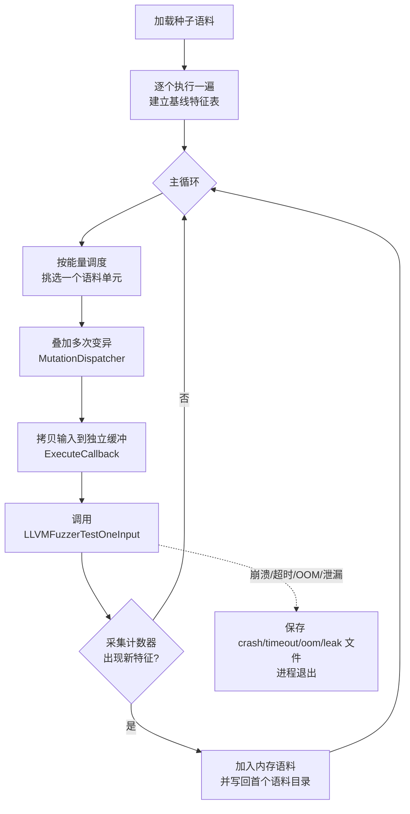
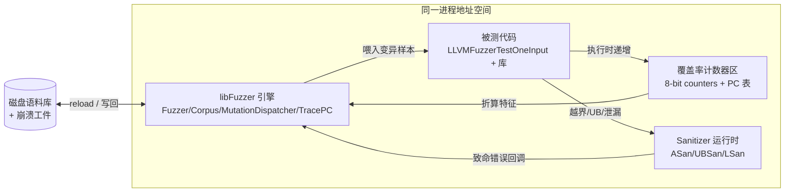
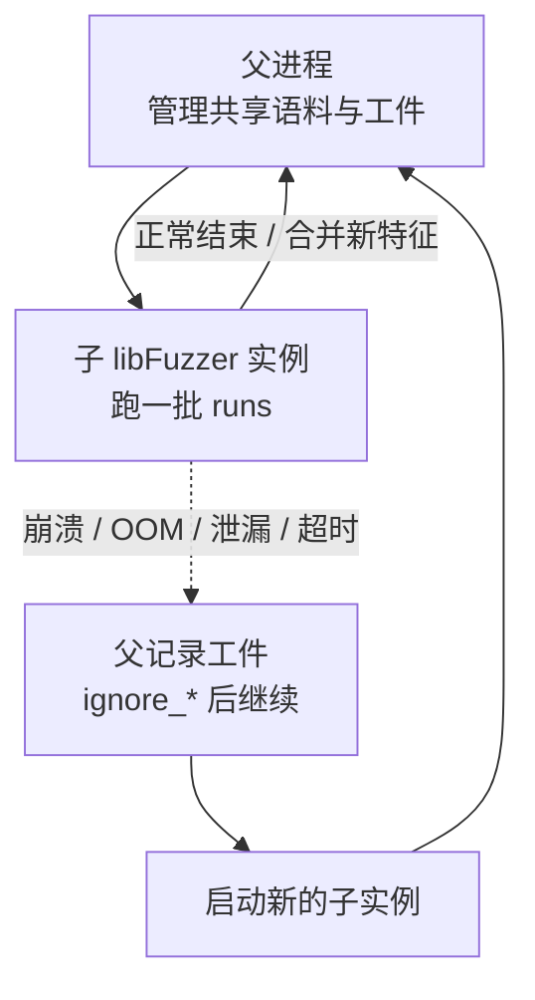
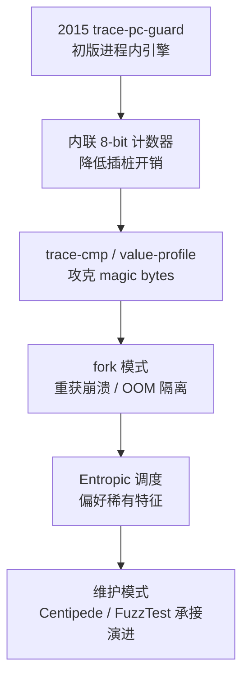

# Fuzzing与漏洞挖掘（5）· libFuzzer与持久模式
> [!abstract] TL;DR
> - libFuzzer 是 LLVM/compiler-rt 内置的「进程内、覆盖率引导、遗传变异」引擎：它替你提供 `main()`，把目标库函数 `LLVMFuzzerTestOneInput` 塞进一个**不 fork** 的紧循环里反复喂样本。
> - 「持久模式」的本质是去掉每样本一次 fork/exec 的开销；libFuzzer 是这条思路的**极端形态**（引擎与被测代码同进程），小目标可达每秒数十万乃至百万次执行。
> - 代价是一份**洁净 harness 契约**：无跨调用状态、确定性、不 `exit`、不泄漏、重初始化下沉到 `LLVMFuzzerInitialize`；违背则导致不可复现崩溃、假覆盖、累积 OOM。
> - 覆盖率来自 SanitizerCoverage 的内联 8-bit 计数器与 `trace-cmp`/value-profile（详见第 4 篇），libFuzzer 把它们折算成「特征（feature）」用于语料入库与 entropic 调度。
> - `fork` 模式（`-fork=1`）在保持吞吐的同时**重新买回**进程隔离，让活动扛得住崩溃/OOM/泄漏，是长时间与 OSS-Fuzz 场景的推荐姿势。
> - `LLVMFuzzerTestOneInput` 已成事实标准 harness 接口，AFL++、honggfuzz、Centipede 皆可驱动——**一次编写、多引擎复用**。

## 概述与定位

libFuzzer 不是一个独立可执行程序，而是一段**链接进你自己二进制里的模糊测试引擎**。它诞生于 2015 年前后的 LLVM/compiler-rt，作者是把 AddressSanitizer 带给世界的 Kostya Serebryany 一系人。它的世界观与 AFL 系恰好互补：AFL 把「整个被测程序」当黑/灰盒，从标准输入或文件喂数据，靠 fork 服务器一进程一样本地跑；libFuzzer 则把镜头拉近到**单个库函数**，用一个你手写的入口 `LLVMFuzzerTestOneInput(const uint8_t*, size_t)` 描述「拿到一段字节该怎么喂给这个 API」，然后由引擎在**同一个进程**里对这个函数施加成千上万次变异调用。

理解本篇，关键要先把「持久模式（persistent mode）」这个词摆正。它最初是 AFL 的术语：AFL 默认一进程一样本，`__AFL_LOOP(N)` 让同一进程连续处理 N 个样本再由 fork 服务器重置，用以摊薄 fork 成本。libFuzzer 把这条路走到尽头——**根本不 fork**，引擎自己就住在进程内，`LLVMFuzzerTestOneInput` 被反复直接调用。所以说 libFuzzer 是「天生持久模式」的引擎，而「持久模式」也就成了 in-process fuzzing 的同义标签。这一进程内模型带来吞吐的数量级跃升，也带来一整套对 harness 的苛刻要求，正是本篇要讲透的两面。

在系列里的定位很清楚：第 2、3 篇讲的是 AFL/AFL++ 那套**进程外、整程序**的灰盒范式；第 4 篇《编译期插桩：SanitizerCoverage与PCGUARD》讲的是 libFuzzer **赖以获取覆盖率的插桩底座**——本篇会大量「消费」它但不再重新推导；第 7 篇专讲 Sanitizers、第 8 篇专讲 harness 编写与目标裁剪、第 9 篇专讲语料与字典、第 10 篇专讲变异与调度、第 17 篇专讲 OSS-Fuzz 规模化。因此本篇聚焦 libFuzzer **引擎自身**：in-process 执行循环、`LLVMFuzzerTestOneInput` 契约、持久模式的收益与陷阱、`fork` 模式、泄漏检测、复现与多引擎互操作——这些是别处不会重复的「libFuzzer 本体」。它最适合的靶子是**纯函数式、可确定性重放的库 API**：解析器、解码器、序列化/反序列化、压缩、正则、图像/字体/协议报文解析——这类目标函数快、无副作用、单次调用即完成一轮语义，正是 in-process 的甜区。

## 原理与机制

libFuzzer 立在三根支柱上：**基于插桩的覆盖率反馈**、**进程内执行循环**、**基于变异的遗传式搜索**。三者环环相扣，缺一不成灰盒。

**入口契约（ABI）**。你唯一必须提供的是：

```cpp
extern "C" int LLVMFuzzerTestOneInput(const uint8_t *Data, size_t Size);
```

`extern "C"` 是为了让引擎用稳定的 C 符号名找到它（避免 C++ name mangling）。参数是**只读**的字节缓冲与长度：`Data` 的生命周期仅限本次调用，**不属于你**——不许 `free`/`delete`，也不该把指针存起来跨调用使用；缓冲**不保证以 `\0` 结尾**，需要 C 字符串就得自己拷一份补零。返回值**契约上应恒为 0**；历史上返回 `-1` 表示「即便触发新覆盖也拒绝把该输入纳入语料」，用于剔除不想要的输入类别，但官方建议除非确有需要，一律返回 0，其余值保留。这个极简签名是 libFuzzer 影响力的根源：它把「怎么把字节喂进 API」这件唯一需要人写的事标准化了。

**构建模型**。用 Clang 的 `-fsanitize=fuzzer` 一次开三样东西：SanitizerCoverage 插桩（默认 `inline-8bit-counters,pc-table,trace-cmp` 等）、libFuzzer 运行时、以及引擎自带的 `main()`。通常再叠一个 Sanitizer 做「崩溃探测器」，例如 `-fsanitize=fuzzer,address,undefined`。若工程庞大、只想给库代码插桩而稍后单独链接驱动，则用 `-fsanitize=fuzzer-no-link`：它只加插桩不加 `main`，最后由一个带驱动的翻译单元收口。`LLVMFuzzerInitialize`、自定义变异器等都是**弱符号**，定义了就用、不定义引擎照跑。

**执行循环**。引擎 `main` 的骨架是：读入命令行给出的语料目录 → 逐个把种子跑一遍建立基线特征表 → 进入主循环：按能量挑一个语料单元、叠加若干次变异、执行回调、采集覆盖、发现新特征就把该变异体纳入语料并写回首个语料目录；一旦触发致命 Sanitizer 错误/超时/OOM/泄漏，就把肇事输入落盘成 `crash-*`/`timeout-*`/`oom-*`/`leak-*` 并退出。



**一个常被忽略的机制细节**：`ExecuteCallback` 每次都会把当前输入**拷进一块尺寸恰为 `Size` 的独立缓冲区**再传给回调。为什么要多此一拷？其一，防止目标偷偷依赖引擎内部存储布局；其二，也是更妙的一点——这块缓冲紧邻 ASan 红区，若目标读越了 `Data+Size` 一个字节，ASan 会**当场**抓到堆越界，而不是读到引擎恰好放在后面的合法字节从而漏报。这就是为什么 libFuzzer 对「差一字节」的越界特别敏感。

**覆盖率如何被消费**（承接第 4 篇，不再展开插桩内部）。插桩在每条边放一个 8-bit 计数器，运行时通过 `__sanitizer_cov_8bit_counters_init(start, stop)` 把计数器区首尾登记给 libFuzzer 的 `TracePC`。引擎不直接比「计数器数组」，而是把每条边的命中次数**桶化**成 AFL 式的量级档，再折成一个 64 位「特征 id」：

```
边 e 的计数器 counter[e]  ──桶化──▶  bucket ∈ {1, 2, 3, 4–7, 8–15, 16–31, 32–127, 128+}
特征 feature      = 编码(边索引 e, 该边命中量级 bucket)     // “边 × 命中次数量级” → 唯一特征 id
value-profile 特征 = 编码(比较点 PC, 操作数 A 与 B 的相同前缀/相同位数)   // 由 trace-cmp 供给
```

于是「同一条边被命中 1 次」与「被命中 100 次」是**两个不同特征**——这让 libFuzzer 能感知循环次数的变化，而不只是「这行代码走没走过」。这正是灰盒比纯覆盖强的地方。value-profile 则解决「magic bytes」：`if (x == 0xDEADBEEF)` 这种深比较，光靠边覆盖永远迈不过去；`trace-cmp` 在每个比较点回调，记录两操作数「已经有多少位/字节相同」，随着变异让 `x` 逐步逼近常量，相同位数上升就产出**新的 value-profile 特征**，即便代码覆盖没变，这个「更接近」的输入也会被留下，一步步把 `x` 磨到相等。与此并行的还有 TORC（table of recent compares）：把最近比较到的常量直接作为「词」注入到输入里（`AddWordFromTORC` 变异器），常常一步就命中魔数。注意默认策略：`trace-cmp` 插桩与 TORC 注入**默认开**，而把比较派生特征计入特征集（`-use_value_profile=1`）**默认关**（怕语料膨胀），需要时手动开。

**统计行怎么读**。运行时你会看到滚动的一行行状态，读懂它是实战第一课：

```
#8123   NEW    cov: 512 ft: 1043 corp: 87/12Kb lim: 256 exec/s: 41000 rss: 78Mb L: 96/256 MS: 4 ChangeBit-CrossOver-InsertRepeatedBytes-ChangeBinInt
```

`#8123` 是累计执行次数；`NEW` 是事件类型（还有 `INITED` 初始化完成、`RELOAD` 重载兄弟进程新语料、`REDUCE` 用更短输入覆盖同一特征、`pulse` 心跳、`DONE`）；`cov` 是代码覆盖边数、`ft` 是特征数（含 value-profile，故常大于 `cov`）；`corp` 是语料条数/字节；`lim` 是当前最大长度（受 `len_control` 动态增长）；`exec/s` 是吞吐；`rss` 是内存；`L: 96/256` 是当前单元长度/上限；`MS: 4 ...` 是这次用了 4 个变异器及其名字。盯 `exec/s` 与 `ft` 的增长曲线，就能判断这个 harness 健不健康、是不是卡在某个 magic bytes 上。

## 持久模式与在进程执行：深度详解

这一段是 libFuzzer 的灵魂，也是它与 AFL 系分道扬镳之处。把「为什么快、为什么脆、怎么把脆补回来」讲透。

### 从 fork 服务器到纯进程内：吞吐的数量级之差

先算一笔账。AFL 最朴素的做法是每个样本 `fork()+execve()` 一个全新进程——`execve` 要重走动态链接、重跑全局构造函数、重建地址空间，单次开销动辄毫秒级，于是每秒撑死几百到几千次。fork 服务器是第一次优化：在 `main` 前把进程冻在一个「快照点」，之后只 `fork` 不 `execve`，靠写时复制（COW）省掉重初始化，吞吐能上万。AFL 持久模式是第二次优化：`while (__AFL_LOOP(N))` 让**同一进程处理 N 个样本**再重置，把 fork 都摊薄掉。

libFuzzer 把这条演进直接推到终点：**连 fork 都没有**，引擎在进程内一个 `for` 循环里直接 `call` 目标函数。对一个「解析几十字节、纯计算、无系统调用」的小目标，单次调用可能只花几微秒，于是**每秒数十万到百万次**成为常态。吞吐为什么是命根子？因为灰盒 fuzzing 本质是「变异—执行—反馈」的蒙特卡洛搜索，单位时间执行次数直接决定你能探到多深的分支组合。吞吐提升 100 倍，等价于用同样墙钟时间多跑 100 倍的路径抽样——这就是 in-process 模型存在的全部理由。



### 洁净 harness 契约：无状态、确定性、不逃逸

天下没有免费的吞吐。一进程跑百万次的前提是：**第 N 次调用与第 1 次调用等价**。这推出四条硬性契约，违背任何一条都会让 fuzzing「看着在跑、其实在骗你」。

其一，**无跨调用状态**。目标函数不该依赖或修改任何全局/静态量而不复位。理想是每次调用「自建上下文、用完即毁」——像范例里 `open→parse→close` 一条龙。为什么？因为一旦状态累积，第 500 万次的行为取决于前面 499 万次喂了什么，崩溃就**不可复现**：你把肇事输入单独重放却复现不出来，因为缺了前面那串「铺垫」。这类 bug 既难分诊也常常是 harness 的假阳性而非真漏洞。

其二，**确定性**。同一输入必须走同一条路径、给同一结果。任何非确定源——读真实时间、读 `/dev/urandom`、看线程调度、依赖哈希表遍历序——都会让「新特征」时有时无，污染语料、拖垮收敛。工程上要把随机源打桩成固定种子、把时间钉死。

其三，**不逃逸**。目标不许在正常路径上 `exit()`/`abort()`（会把整个 fuzzer 一起带走，且不是真 bug）、不许 `fork` 子进程、不许起后台线程活过本次调用、不许安装信号处理器抢走 Sanitizer 的处理器、不许做破坏性 I/O（删文件、发网络包）。in-process 意味着**目标与引擎共享命运**，任何越权副作用都会反噬引擎本身。

其四，**快且轻初始化**。凡「只需一次」的重活——加载模型、建查找表、解析配置——都要下沉到 `LLVMFuzzerInitialize(int* argc, char*** argv)`，它在进入循环前只跑一次。若把重初始化误放进 `LLVMFuzzerTestOneInput`，等于每次调用都交一遍智商税，吞吐从百万掉到几百，in-process 的意义荡然无存。

一句话自检法：**把 harness 想象成会被连调一亿次而进程永不重启**——凡是「连调会出问题」的写法，都是 bug。

### 状态泄漏的失败模式清单（逆向视角）

把常见翻车点列成清单，逆向或写 harness 时逐条排雷：

- **静态缓存 / 单例惰性初始化**：`static Foo* g = expensive();` 只在首次调用建，之后所有输入共享同一 `g`，一旦某输入把 `g` 改脏，后续全错。
- **全局分配器/内存池未重置**：库自带 arena 分配器跨调用累积，表现为 RSS 单调上涨，最终 `-rss_limit_mb`（默认 2048）触发**假 OOM**。
- **句柄/描述符泄漏**：每次 `open` 不 `close`，几万次后耗尽 fd，报错却与输入无关。libFuzzer 有 `-close_fd_mask` 可屏蔽 stdout/stderr 但治标不治本。
- **注册表/回调链只增不减**：把回调 `push_back` 进全局 vector 从不清，链越滚越长，行为随调用序漂移。
- **依赖上次解析残留**：解析器把中间态留在成员变量，下个输入「捡到」上个输入的碎片——最隐蔽的一类，常表现为**偶发**崩溃。

这些几乎都不是被测库的真漏洞，而是 harness 没守住无状态契约。分辨窍门：**把疑似崩溃输入用 `./fuzzer <crashfile>` 单独重放**，若复现不出来，八成是状态泄漏在作祟。

### 内存泄漏检测：LSan 的「跑两遍」启发式

in-process 有个副产品好处：**天然能查内存泄漏**。因为进程长活，泄漏会累积成可观测的 RSS 增长。当链接了 LeakSanitizer（ASan 自带），libFuzzer 默认 `-detect_leaks=1`。但它不能一见「有未释放内存」就报——很多是**一次性**的全局初始化（本就该活到进程结束）。libFuzzer 的办法是一个「跑两遍」启发式：怀疑泄漏时，用同一输入**再跑一次**，比较两次分配增量；若增量随调用次数线性增长，才判为真泄漏，落盘 `leak-*` 并跑一次完整 LSan 出栈回溯。这套机制让「每次调用漏 16 字节」这种在进程外模型里根本发现不了的问题浮出水面——进程外一样本一进程，进程一退所有泄漏都被内核回收了，你永远看不见。这是 in-process 相对 AFL 的一个独有诊断能力。

### fork 模式：把隔离性买回来

纯 in-process 的阿喀琉斯之踵是**脆**：一次崩溃/OOM/无穷循环就掀翻整个进程，内存里尚未落盘的语料增量随之蒸发；一个泄漏目标跑几小时必被 OOM 打断。早期只能靠外层脚本反复重启硬扛。于是 libFuzzer 引入 `-fork=N`：父进程只管**共享语料库与工件**，派生一批**子 libFuzzer 实例**各跑一小批 `runs`；子进程正常结束就把新特征合并回来，子进程崩溃/OOM/泄漏/超时则父进程记下工件、在 `-ignore_crashes/-ignore_ooms/-ignore_timeouts` 下**换一个新子进程继续**。



这本质是**把 AFL 的进程隔离性买了回来**，同时保住 in-process 的高吞吐（每个子进程内部仍是纯循环）。代价是多了 fork/进程管理开销与语料同步延迟，但对**跑几天、目标又难保证零泄漏**的长活动，这是唯一稳妥姿势，也是 OSS-Fuzz/ClusterFuzz 大规模跑法的底座（第 17 篇展开）。可以这样记忆 libFuzzer 的三态：默认纯 in-process 求**极致吞吐**；`-fork=1` 求**吞吐+鲁棒**；单文件重放（`./fuzzer crashfile`）求**确定性复现**。

### 语料调度与特征：entropic 为何偏爱稀有边

语料不是平权的。libFuzzer 为每个语料单元维护 `InputInfo`（覆盖了哪些特征、执行多快、多大、被选中过几次），据此算「能量（energy）」决定被挑中变异的概率。早期是朴素启发式；LLVM 12/13 起默认启用 **Entropic 调度**（源自 Böhme 等人的论文《Entropic: Boosting libFuzzer Performance》）。核心洞见：一个种子的价值不在「覆盖了多少特征」，而在「它揭示了多少**稀有**信息」。若某条边全语料库只有这一个种子能命中，那它就是通往新大陆的独木桥，应获更高能量、被反复变异；反之命中大众边的种子价值低。用信息论的话说，就是按种子对「特征分布」贡献的**熵/信息增益**加权。为什么这样更好？因为 fuzzing 后期的瓶颈是少数深、窄、难触发的分支，把算力集中砸向能碰到稀有特征的种子，等于把兵力压到突破口。同时引擎倾向用**更短更快**的输入去覆盖同一特征（统计行里的 `REDUCE`），既省内存又让后续变异更高效。调度与变异的完整理论留给第 10 篇，这里只需理解 libFuzzer 的「特征 → 能量 → 选择」这条反馈闭环。

### 变异器、字典与 FuzzedDataProvider

`MutationDispatcher` 内置一箩筐变异器：翻转位/字节、增删/重复字节、洗牌、改 ASCII/二进制整数、拷贝片段、`CrossOver`（两语料杂交）、从**人工字典**取词（`-dict=`，AFL 兼容格式）、从 **TORC** 取最近比较常量、从**自动持久字典**取词。一次变异常叠加多个（统计行 `MS: 4` 即叠了 4 层）。字典对越过协议关键字、magic、tag 值极关键（第 9 篇细说）。

结构化目标怎么办？两条路：`LLVMFuzzerCustomMutator`/`LLVMFuzzerCustomCrossOver` 让你接管变异（内部还能回调 `LLVMFuzzerMutate` 复用内置变异，典型如 libprotobuf-mutator，见第 11 篇）；更轻量的是 `FuzzedDataProvider.h`——它把一段裸字节切成有类型的值：`ConsumeIntegral<T>`、`ConsumeBool`、`ConsumeEnum`、`ConsumeIntegralInRange`、`ConsumeBytes`、`ConsumeRemainingBytes` 等。一个易被忽视的设计：**FDP 从字节流两端取数**——`ConsumeBytes` 类从**头部**取，`ConsumeIntegral`/`ConsumeBool` 等控制值从**尾部**取。为什么？因为变异器多在头部增删字节，把「体数据」放头、「控制位」放尾，能让「加一个字节」这类变异不至于把所有后续控制决策整体错位，从而**保留变异的语义稳定性**，让 fuzzer 的「小改动→小效果」假设成立、搜索更平滑。这是把裸字节可靠映射成结构输入的关键小技巧。

## 工具视角与实战

**构建与起跑**。最小闭环如下：

```bash
# 构建：插桩 + 引擎 main + ASan/UBSan 当崩溃探测器
clang++ -g -O1 -fsanitize=fuzzer,address,undefined \
        harness.cc mylib.c -o fuzz_mylib

# 仅插桩库、稍后单独链接驱动（大工程 / 复用为回归二进制）
clang -g -O1 -fsanitize=fuzzer-no-link -c mylib.c -o mylib.o

# 起跑：语料目录 + 字典 + 限长 + 工件落盘前缀 + 收尾统计
./fuzz_mylib corpus/ -dict=mylib.dict -max_len=4096 \
             -artifact_prefix=artifacts/ -print_final_stats=1

# 并行 8 路，进程间经语料目录交叉授粉（reload 默认开）
./fuzz_mylib corpus/ -jobs=8 -workers=8

# 长活动：fork 模式，容忍崩溃/OOM/泄漏不停机
./fuzz_mylib corpus/ -fork=1 -ignore_crashes=1 -ignore_ooms=1 -ignore_timeouts=1

# 复现单个崩溃：同一进程、同一 Sanitizer，确定性栈回溯
./fuzz_mylib artifacts/crash-deadbeef

# 崩溃最小化 / 语料集覆盖式合并（保覆盖去冗余）
./fuzz_mylib -minimize_crash=1 -runs=100000 artifacts/crash-deadbeef
./fuzz_mylib -merge=1 corpus_min/ corpus/ extra_corpus/
```

**一个真实味道的 harness**。要点全在注释里——`open/close` 保证无状态、`FuzzedDataProvider` 从尾取控制位、早退过滤、恒返回 0、重初始化下沉：

```cpp
#include <cstdint>
#include <cstddef>
#include <vector>
#include "FuzzedDataProvider.h"
#include "mylib.h"

extern "C" int LLVMFuzzerInitialize(int *argc, char ***argv) {
    mylib_global_init();                              // 仅一次的重初始化下沉到这里
    return 0;
}

extern "C" int LLVMFuzzerTestOneInput(const uint8_t *Data, size_t Size) {
    if (Size < 4) return 0;                           // 早退：过滤显然无意义的输入
    FuzzedDataProvider fdp(Data, Size);
    uint8_t opts = fdp.ConsumeIntegral<uint8_t>();    // 控制位从尾部取，稳定
    std::vector<uint8_t> body = fdp.ConsumeRemainingBytes<uint8_t>();

    mylib_ctx *ctx = mylib_open(opts);                // 每次调用自建
    mylib_parse(ctx, body.data(), body.size());
    mylib_close(ctx);                                 // 用后即毁 → 无跨调用状态
    return 0;                                          // 恒返回 0
}
```

**常用旋钮**（更全的语料/字典/最小化归第 9 篇）：

| 参数 | 作用 | 备注 |
| --- | --- | --- |
| `-max_len=N` | 输入长度上限 | 配合默认开的 `len_control` 从小到大逐步放开 |
| `-timeout=N` | 单样本超时（秒） | 默认 1200 近乎不限，实战应压到秒级 |
| `-rss_limit_mb=N` | 内存红线 | 默认 2048，触顶记 OOM；`-malloc_limit_mb` 管单次分配 |
| `-runs=N` / `-max_total_time=N` | 跑够次数/时长即退 | CI 里限时跑 |
| `-jobs / -workers` | 多进程并行 | 经语料目录 `reload` 交叉授粉 |
| `-fork=1` | fork 隔离模式 | 配 `-ignore_crashes/ooms/timeouts` 长跑 |
| `-dict=file` | 词典 | AFL 兼容格式 |
| `-use_value_profile=1` | 比较特征计入语料 | 默认关，攻魔数时开 |
| `-print_final_stats=1` `-print_coverage=1` | 收尾统计/覆盖 | 诊断收敛用 |
| `-seed=N` | 固定 RNG 种子 | 复现整轮活动 |

**多引擎互操作——这是 libFuzzer 影响力最大的遗产**。`LLVMFuzzerTestOneInput` 已成事实标准，同一份 harness 可被多引擎驱动：AFL++ 自带 driver 提供 `__AFL_LOOP` 版 `main` 去包裹它；honggfuzz 用 `libhfuzz` 的 `HF_ITER` 持久循环驱动它；`StandaloneFuzzTargetMain.c` 则给一个「只把每个文件参数跑一遍、零引擎」的 `main`，专用于 CI 回归与崩溃复跑。

```bash
# AFL++ 直接吃 libFuzzer harness（AFL 驱动提供带 __AFL_LOOP 的 main）
afl-clang-fast++ -fsanitize=fuzzer-no-link harness.cc mylib.c \
                 /path/to/libAFLDriver.a -o fuzz_afl
afl-fuzz -i corpus -o out -- ./fuzz_afl @@

# honggfuzz 持久模式驱动同一 harness
hfuzz-clang++ -fsanitize=fuzzer-no-link harness.cc mylib.c \
              /path/to/libhfuzz/libhfuzz.a -o fuzz_hf
honggfuzz -i corpus -- ./fuzz_hf

# 无引擎回归复跑：每个文件跑一遍，适合 CI 与崩溃确认
clang++ harness.cc mylib.c StandaloneFuzzTargetMain.c -o repro
./repro corpus/* artifacts/crash-*
```

写一次、四处跑：libFuzzer 引擎求极致吞吐，AFL++ 求变异多样性与 QEMU/持久混跑，honggfuzz 求硬件 trace（详见第 6 篇），Standalone 求确定性复现——同一个入口函数，覆盖了从研发自测到规模化运营的整条链路。

**历史演进与「维护模式」**。理解 libFuzzer 也要知道它的当下位置：



如今 LLVM 官方将 libFuzzer 标注为**维护模式**（bug 修复为主、不再加大特性）。Google 后续把重心转向 **Centipede**（进程外、面向超大/超慢目标、可分布式）与 **FuzzTest**（把 fuzzing 写成 GoogleTest 风格的属性测试）。但这丝毫不减 libFuzzer 的现实分量：OSS-Fuzz 上海量目标仍以它为主力，`LLVMFuzzerTestOneInput` 生态早已根深叶茂。对逆向与研究者，它依然是「拿到一个库、几分钟写出一个高吞吐灰盒」的最短路径。

## 安全性与正确使用

> [!caution] 合规边界（务必先读）
> 本篇所有内容仅用于**你拥有或已获书面授权**的代码与系统、CTF 靶场与安全研究，且一律以**防御 / 教育**视角呈现。libFuzzer 是缺陷发现工具，不是攻击武器：
> - **只对自有或明确授权的目标 fuzzing**。对他人生产系统、第三方闭源商业软件在未授权下做 fuzzing、逆向或崩溃利用，可能违反计算机犯罪与软件许可条款。
> - **不提供针对真实生产目标的武器化步骤**，不为绕过任何商业授权/许可、DRM、许可校验提供成品配方。原理讲透，但不给「打某个真实目标」的一键方案。
> - 发现漏洞走**负责任披露**：优先上报维护方，OSS-Fuzz 类平台遵循其披露时限（通常 90 天）；未修复细节不公开传播 PoC。

除了合规红线，「正确使用」还包含一层**技术正确性**——因为 in-process 模型太容易「看着在跑其实在骗你」：

**别把 harness bug 当成库漏洞**。in-process 下，harness 自己的越界/UAF 会和目标崩在同一个 ASan 栈里，极易误判为「库有漏洞」。定位铁律：先用 `./fuzzer <crashfile>` 单独重放，复现不出→怀疑状态泄漏（见前文清单）；复现得出→再看栈顶是落在**你的 harness 代码**还是**被测库**里。前者是你的锅，别去给上游提假 issue。

**给引擎套好资源笼子**。持久进程会放大一切资源问题：用 `-rss_limit_mb`、`-malloc_limit_mb`、`-timeout` 把内存与耗时钉死，避免一个畸形输入把机器拖垮；破坏性副作用（写文件、发包、改全局配置）要么打桩要么在容器/沙箱里跑。长活动一律 `-fork=1` 兜底崩溃与 OOM。

**Sanitizer 的取舍要清醒**（细节归第 7 篇）。ASan 抓空间/时序内存错误、UBSan 抓未定义行为，二者可同开；MSan（未初始化读）要求**全量插桩**、通常单独构建一份；ASan 与 MSan **不能同进程共存**。别忘了配合 `ASAN_OPTIONS`（如 `detect_leaks`、`abort_on_error`）与符号化，否则栈回溯不可读、分诊事倍功半。

**结果可信度取决于语料与运行量**。「跑了没崩」≠「没漏洞」——只说明在你给的种子、字典、时长、`max_len` 覆盖到的路径上没触发已插桩能捕获的错误。覆盖率停滞往往指向缺字典、缺种子或目标里有你没跨过的强校验（校验和、magic），而非「代码是安全的」。把 `-print_coverage=1` 的结果与源码对照，才知道到底测到了哪。这些正确性纪律，和合规边界同等重要：一个会骗自己的 fuzzing 活动，既浪费算力，也可能把假阳性当成果误报出去。

## 小结

libFuzzer 用一个极简入口 `LLVMFuzzerTestOneInput` 和「引擎住进被测进程」的 in-process 模型，把持久模式推到极致，换来数量级的吞吐提升——这是它一切优点的源头，也是一切约束的源头。它消费第 4 篇的 SanitizerCoverage 插桩（8-bit 计数器 + `trace-cmp`），把命中折成含「命中量级」的特征，喂给 entropic 调度与变异闭环；它用 `ExecuteCallback` 的精确拷贝换来贴边越界的敏感度，用长活进程换来独有的泄漏检测能力。代价是一份洁净 harness 契约：无状态、确定性、不逃逸、轻初始化，违背则收获不可复现崩溃与假覆盖。当纯 in-process 的「脆」成为长跑瓶颈时，`-fork=1` 把进程隔离买回来，成就了 OSS-Fuzz 级的规模化。而 `LLVMFuzzerTestOneInput` 作为跨引擎事实标准，让一份 harness 通吃 libFuzzer/AFL++/honggfuzz/Standalone——这份「一次编写、多引擎复用」的遗产，比引擎本身活得更久。下一篇转向 honggfuzz 与其他引擎，看看在软件与硬件反馈、进程模型上还有哪些不同取舍。

## 相关阅读

- 同系列上游·插桩底座：[[04.编译期插桩：SanitizerCoverage与PCGUARD|SanitizerCoverage 与 PCGUARD]]（libFuzzer 覆盖率来源）
- 同系列并列·灰盒范式对照：[[03.AFL++架构与使用|AFL++ 架构与使用]]、[[02.覆盖率引导原理：AFL的核心思想|覆盖率引导原理]]
- 同系列下游·继续深挖：[[06.honggfuzz与其他引擎|honggfuzz 与其他引擎]]、[[07.Sanitizers：ASan与UBSan与MSan|Sanitizers 详解]]、[[08.Harness编写与目标裁剪|Harness 编写与目标裁剪]]、[[09.语料库与字典与最小化|语料库与字典与最小化]]、[[10.变异策略与调度算法|变异与调度算法]]、[[11.结构化Fuzzing：语法与protobuf|结构化 Fuzzing]]、[[17.规模化：OSS-Fuzz与ClusterFuzz|OSS-Fuzz 与 ClusterFuzz]]
- 漏洞下游：崩溃如何经 [[33.二进制漏洞与利用基础/01.内存破坏漏洞全景与利用链模型|内存破坏漏洞全景与利用链模型]] 转为利用
- 引擎依赖·覆盖率反馈：[[48.动态插桩与模拟执行引擎/12.插桩驱动的分析：覆盖率与污点与trace|插桩驱动的分析：覆盖率与污点与 trace]]
- 内核与浏览器方向：[[52.Linux内核机制与内核利用/18.内核Fuzzing与syzkaller|内核 Fuzzing 与 syzkaller]]、[[54.浏览器与JS引擎漏洞/00.浏览器与JS引擎漏洞总览|浏览器与 JS 引擎漏洞总览]]、[[38.Windows内核与驱动逆向/30.内核Fuzzing|Windows 内核 Fuzzing]]
- 官方文档：LLVM libFuzzer 手册（llvm.org/docs/LibFuzzer.html）、SanitizerCoverage 手册（clang.llvm.org/docs/SanitizerCoverage.html）、Google fuzzing-tutorial（github.com/google/fuzzing）、论文《Entropic: Boosting LLVM-libFuzzer Performance》

[[00.Fuzzing与漏洞挖掘总览|⬆ 系列总览]] | [[04.编译期插桩：SanitizerCoverage与PCGUARD|← 上一章]] | [[06.honggfuzz与其他引擎|→ 下一章]]
