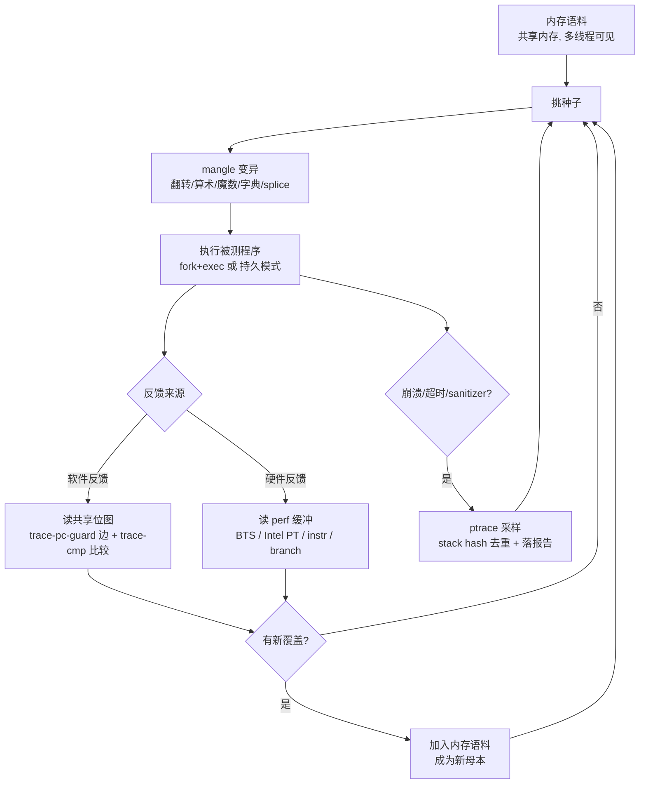
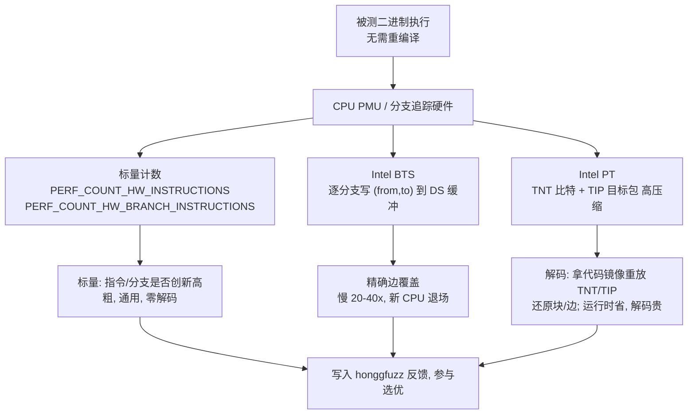

# Fuzzing与漏洞挖掘（6）· honggfuzz与其他引擎
> [!abstract] TL;DR
> - honggfuzz 是最早的反馈驱动 fuzzer 之一（Robert Swiecki，约 2010 年），最独特之处是「多线程共享内存语料 + 同时支持硬件反馈与软件反馈」两套覆盖率来源并存，而不是二选一。
> - 软件反馈复用 SanitizerCoverage 的 ABI（trace-pc-guard 记边、trace-cmp 记比较），由 `libhfuzz` 运行时把命中写进共享内存位图，并把比较操作数喂进「动态字典 + 逐字节渐进匹配」以攻破魔数与校验和。
> - 硬件反馈是它的看家本领：用 `perf_event_open` 读 Intel BTS（精确边、极慢、已在新微架构退场）、Intel PT（压缩控制流包、运行时开销约个位数百分比但解码昂贵）、以及 instr/branch 标量计数器，从而给「闭源二进制」提供近乎零插桩的覆盖率。
> - 进程模型独树一帜：N 个 fuzzing 线程共享同一份内存语料，无需 AFL 那样靠文件系统同步；持久模式直接兼容 `LLVMFuzzerTestOneInput`，netdriver 还能不改一行业务代码地 fuzz 网络服务器。
> - 崩溃检测走 ptrace，采集寄存器/回溯并算 stack hash 去重，报告详尽；honggfuzz 是 OSS-Fuzz 三大内置引擎之一（另两者为 libFuzzer、AFL++）。
> - 横向看：AFL 的哈希位图有碰撞、libFuzzer 精确但只在进程内且要源码、honggfuzz 横跨软/硬反馈；而 LibAFL 把 Observer→Feedback→Objective 抽象成可组合的框架，是这套「反馈」思想的集大成者。

## 概述与定位

前几篇把「覆盖率引导」这条主线的两个主流实现讲透了：AFL/AFL++（第 2、3 篇）代表**外部进程 + 编译期边位图**的路线，libFuzzer（第 5 篇）代表**进程内持久化 + SanitizerCoverage 精确计数器**的路线。本篇要补齐这张地图上第三块、也是气质最不一样的一块——**honggfuzz**，并借它把整章的真正主题拎出来：一台 fuzzer 的「反馈」到底可以从哪里来。种子清单给的三个词——硬件反馈、软件反馈、引擎横向对比——正是本篇的三根骨头。

honggfuzz 由 Google 的 Robert Swiecki 开发，起点在 2010 年前后，比 AFL 公开（2013）还早。它诞生时的卖点不是软件插桩，而是**用 CPU 的性能计数与分支追踪硬件来「看」被测程序走了哪些路**——这在当年是相当超前的思路。后来软件插桩（SanitizerCoverage）成为业界标配，honggfuzz 也补上了自己的编译器包装器与运行时，于是形成了它今天最鲜明的特征：**同一个引擎里，硬件反馈与软件反馈是两条并列、可切换、可叠加的覆盖率通道**。这一点，AFL 系（软件插桩 + QEMU/Frida 兜底）和 libFuzzer（纯软件）都不具备，是本篇把 honggfuzz 单独立传的根本理由。

把它放进坐标系里，定位就清楚了。相对 libFuzzer，honggfuzz 也能吃同一套 `LLVMFuzzerTestOneInput` 的 harness（见第 5 篇），但它默认是**多进程/多线程 + 外部执行**而非纯进程内，鲁棒性更高——一个输入把子进程打崩了，主控还在，语料不丢。相对 AFL，honggfuzz 用**共享内存里的单一语料 + 多线程**取代了「主从进程靠 `sync_dir` 抄文件」的架构，省掉了同步开销；更关键的是它给出了 AFL 早年没有的**硬件反馈**能力。而崩溃发现之后的下游——把崩溃变成利用——则接到系列 33 的 [[33.二进制漏洞与利用基础/01.内存破坏漏洞全景与利用链模型|内存破坏漏洞全景与利用链模型]]；崩溃如何去重与判可利用性留给第 16 篇；用 sanitizer 把「静默错误」变成「响亮崩溃」留给第 7 篇。本篇聚焦「引擎与反馈来源」本身。

本篇的后半段会从 honggfuzz 出发，横向扫过一圈「其他引擎」：Windows 上的 WinAFL（含 Intel PT 模式）、Ivan Fratric 的黑盒 Jackalope/TinyInst、基于虚拟化 + Intel PT 的内核/快照 fuzzer kAFL 与 Nyx、以及把所有这些抽象统一起来的现代 Rust 框架 **LibAFL**，还有 Jazzer/Atheris/go-fuzz/cargo-fuzz 这些面向托管语言的前端。目的不是逐个教程，而是用「反馈来自哪里、进程怎么组织、覆盖粒度多细」这三把尺子，把整个引擎生态量一遍。

## 原理与机制

### 进化式反馈循环：所有覆盖率 fuzzer 的共同骨架

无论软件还是硬件反馈，honggfuzz 的主循环都是同一套「进化算法」骨架，和第 2 篇讲的 AFL 核心思想同源，但值得在这里用 honggfuzz 的术语再走一遍，因为后面软/硬反馈的差异全都挂在这个循环的「观测」这一步上：

1. 从**内存语料**里挑一个种子（honggfuzz 的语料默认整份驻留在共享内存，不是每次读盘）；
2. 用变异引擎 `mangle` 对它施加若干次随机变异，得到一个测试输入；
3. **执行**被测程序，喂入这个输入（`___FILE___` 占位落地成文件，或标准输入，或持久模式下直接传缓冲区）；
4. **观测反馈**——这是软件/硬件路线唯一分叉的地方：软件路线读共享内存位图里新增了哪些边/PC 与比较进展；硬件路线读 perf 缓冲里 BTS/PT 记录的分支，或 instr/branch 标量计数；
5. **判定「有趣」**：若这次运行触达了全局从未见过的覆盖（新边、新块、更高的计数器桶），就把该输入**加入内存语料**，成为后续变异的新母本；
6. 若程序**崩溃/超时/触发 sanitizer**，走崩溃处理管线（ptrace 采样 + stack hash 去重 + 落报告）。

这个「变异→执行→观测→选优」的闭环就是「进化」二字的由来：能扩大覆盖的输入被保留、被反复杂交变异，覆盖率像爬山一样单调上升。honggfuzz 与同类的所有差异，都是这个循环里**第 3 步（怎么执行）**和**第 4 步（怎么观测）**的不同实现。



### 多线程 + 共享内存语料：与 AFL 主从模型的分野

honggfuzz 的执行组织是它相对 AFL 的第一个结构性差异。AFL 早期靠「一个 master 多个 slave、各自独立进程、通过 `-o` 输出目录下的 `sync_dir` 定期把彼此的新种子抄过来」实现并行；这在单机多核上要么复制大量文件、要么产生同步延迟。honggfuzz 走的是另一条路：**单个 honggfuzz 进程内起 `-n` 个 fuzzing 线程，它们共享同一份驻留内存的语料和同一张反馈位图**。某个线程发现了新覆盖的输入，其它线程立刻在同一份内存语料里就能看到——不需要写盘、不需要跨进程同步。

这带来两个直接后果。其一，**扩核效率高、I/O 压力小**：语料不落地反复读写，位图是共享内存里的原子更新。其二，**天然适合「一份语料、多线程猛跑」的单机场景**；而跨机器的大规模分布式协作（多机共享语料）则不是它的强项，那属于第 17 篇 OSS-Fuzz/ClusterFuzz 的话题。需要提醒的边界是：多线程共享一张全局位图，意味着覆盖判定要用原子操作，且不同线程对「谁先抢到某条新边」存在竞态——honggfuzz 用 per-run 的本地位图与全局位图做比对合并来处理，逻辑上等价于「本次运行相对全局是否有增量」。

被测程序的每次执行，默认是 **fork + exec 一个全新子进程**（干净、隔离，但每次进程创建有开销）；持久模式（下一节）则让子进程内循环复用，去掉进程创建成本。崩溃监控默认挂在 **ptrace** 上：honggfuzz 作为 tracer 附加到子进程，子进程收到 `SIGSEGV/SIGABRT/SIGBUS/SIGFPE` 等信号时被 tracer 截获，采集寄存器、故障地址、调用回溯，算出一个 **stack hash** 用于去重（相同崩溃点只留一份），再把详情写成报告。这套 ptrace 机制让 honggfuzz 的崩溃报告比「只知道退出码」的黑盒方式详尽得多，也让它能优雅地和 ASan/UBSan/MSan（第 7 篇）配合——sanitizer 打印报告、进程 abort，honggfuzz 捕获并解析。

### 变异引擎 mangle：无确定性阶段的随机改写

honggfuzz 的变异器叫 `mangle`，风格上更接近 AFL++ 的 havoc 而非经典 AFL 的「确定性阶段（逐位翻转、逐字节加减）+ 随机阶段」两段式——honggfuzz **没有独立的确定性阶段**，从头就是随机施加一批 mangle 操作。每次运行施加的操作数量由 `-r/--mutations_per_run`（默认 6 左右）控制。mangle 的操作族包括：位/字节翻转，字节插入/删除/覆写，内存块的移动与复制，插入各种**魔数**（8/16/32/64 位的大小端边界值，如 0、-1、0x7fffffff、0x80000000），插入 ASCII 数字，从**字典**（`-w` 提供或从 trace-cmp 自动采集）里插入 token，以及把语料里两个输入**拼接（splice）**。这套组合的目标和所有 fuzzer 一样：以尽量小的代价打出「结构上略微不同、但能触达新分支」的输入。变异策略与调度的深水区（能量分配、种子权重）留给第 10 篇，本篇只需知道 honggfuzz 的变异是「全程随机 + 由比较反馈动态喂字典」这一取向。

## 硬件反馈与软件反馈详解

这一段是全篇技术核心。整章的题眼是「反馈从哪来」，而 honggfuzz 恰好是唯一把两条来源都做成一等公民的主流引擎。先把大问题摆正：**fuzzer 要拿到「这次执行走了哪些代码」，本质上有四条路**——(1) 编译期软件插桩（要源码或 IR）；(2) 二进制改写（静态重写目标插入桩，如 afl-dyninst/RetroWrite/ZAFL）；(3) 动态二进制插桩 DBI（运行时插桩，如 QEMU/Frida/Pin/DynamoRIO/TinyInst，见系列 48）；(4) **硬件追踪**（让 CPU 自己把控制流吐出来）。honggfuzz 覆盖了其中的 (1) 软件插桩 和 (4) 硬件追踪 两端，这两端正好是「有源码时最快最准」与「没源码时最省插桩」的两个极点。

### 软件反馈：复用 SanitizerCoverage，但吃法不同

当你用 honggfuzz 自带的编译器包装器 `hfuzz-clang` / `hfuzz-clang++`（或 `hfuzz-gcc`）编译目标时，它做两件事：给编译加上 SanitizerCoverage 插桩（`-fsanitize-coverage=trace-pc-guard` 记录边覆盖、`trace-cmp` 记录比较、还可带 `trace-div`/`indirect-calls`），并把 honggfuzz 的运行时 `libhfuzz` 链接进去。SanitizerCoverage 的插桩机制本身（编译器在每条边的起点插一个回调、`trace-pc-guard` 的 guard 变量表、`-inline-8bit-counters` 等）在第 4 篇已经讲透，这里**不重复其编译期原理，只讲 honggfuzz 如何消费这些回调**——这正是它和 libFuzzer「吃同一份插桩、做不同文章」的地方。

关键在于：SanitizerCoverage 只是**定义了回调 ABI**（`__sanitizer_cov_trace_pc_guard`、`__sanitizer_cov_trace_cmp1/2/4/8`、`__sanitizer_cov_trace_const_cmp*`、`__sanitizer_cov_trace_switch` 等），**谁来实现这些回调、把数据存到哪、怎么解释，是运行时的自由**。libFuzzer 用自己的运行时把它们变成进程内的计数器数组；honggfuzz 的 `libhfuzz` 则把它们写进一块**父子进程共享内存**里的反馈结构：

- **边/PC 位图**：`trace-pc-guard` 的回调按 guard 索引在共享位图里记命中（并做计数分桶，思路类似 AFL 的 8-bit 桶：把命中次数归入 1/2/3/4-7/8-15/… 这样的桶，让「循环跑了 3 次 vs 4 次」被视为同一覆盖、而「1 次 vs 100 次」被视为不同）。父进程据此判断本次运行有没有新边。
- **比较进展反馈（cmp feedback）**：`trace-cmp` 的回调把每次比较的**两个操作数**交给 honggfuzz。这是攻破「魔数 / 校验和 / 长串等值判断」的钥匙——原理和 AFL++ 的 CMPLOG、laf-intel、Redqueen 的「input-to-state」同源（第 3、12 篇）：直接暴力翻转很难一次性猜中 `if (x == 0xDEADBEEF)`（32 位约 40 亿分之一），但如果 fuzzer 能看见「你比较的另一边是 0xDEADBEEF」，它就能把这个常数**自动收进字典**、直接拼进输入；更进一步，honggfuzz 还用「两个操作数**有多少字节/前缀相同**」作为一个**渐进的梯度信号**——哪怕没完全相等，匹配前缀变长了也算「进步」，于是多字节比较被拆成可被逐步逼近的爬坡，而不是一个全或无的悬崖。

一句话概括软件反馈的性价比：**有源码（或能重编译）时它最优**——插桩精确到编译器认识的每条边，`trace-cmp` 还能顺手解魔数，开销可控。它的边界也很清楚：需要能重新编译目标；插桩会改变二进制、可能被目标的自校验发现；对第三方闭源库（没源码那部分）是盲区。

### 硬件反馈：让 CPU 替你记录控制流

当目标是**闭源二进制、无法重编译**时，软件插桩这条路断了。honggfuzz 的答案是走 Linux 的 `perf_event_open` 系统调用，直接读 CPU 的性能监控单元（PMU）与分支追踪硬件。它提供由粗到细的几档：

**第一档——标量计数器（最粗、最通用）。** `--linux_perf_instr` 用 `PERF_COUNT_HW_INSTRUCTIONS` 读「本次执行退休了多少条指令」，`--linux_perf_branch` 用 `PERF_COUNT_HW_BRANCH_INSTRUCTIONS` 读「退休了多少条分支」。反馈信号就是一个**标量**：这次执行的指令数/分支数是不是**创了新高**？直觉是「走了更多代码 ≈ 触达了新路径」。它的优点是**任何 CPU、任何二进制都能用、几乎零解码成本**；缺点是**极其粗糙**——大量结构不同的路径可能有相同的指令总数，它分辨不出「新在哪」，只能感知「多少」。作为覆盖率它很弱，但作为「完全没有其它反馈时的兜底novelty信号」聊胜于无，也常用来做辅助维度。

**第二档——Intel BTS（精确边、极慢、正在退场）。** `--linux_perf_bts_edge` 启用 Intel 的 Branch Trace Store：CPU 把**每一条已执行的跳转**都以 `(from, to)` 记录写进内存里的 Debug Store 缓冲。honggfuzz 收集这些 `(from,to)` 对，去重后就是**精确的边覆盖**——和软件插桩拿到的边在语义上等价，却不需要改一个字节的目标代码。听起来完美，代价却极其昂贵：**每条分支都要产生一次内存写**，实测拖慢可达 20~40 倍；缓冲区也容易被高分支密度的代码写满。更现实的问题是，BTS 在较新的 Intel 微架构上逐渐被弱化甚至移除，可用性越来越差。所以 BTS 今天更多是「原理上精确、工程上过时」的教学样本。

**第三档——Intel PT（压缩控制流、低运行时开销、解码昂贵）。** `--linux_perf_ipt_block` 启用 Intel Processor Trace（Broadwell/Skylake 起）。PT 的设计哲学和 BTS 相反：它不逐条记全地址，而是把控制流**极限压缩**成小包——**条件分支**只用 **TNT 包**里的 1 个比特记「taken / not-taken」，**间接分支/返回**才用 **TIP 包**记目标地址（还常做压缩），加上周期性的同步包。因为「能静态推断方向的东西一律不记」，PT 的**运行时开销通常只有个位数百分比**，这才让它适合当 fuzzing 的反馈源。天下没有免费的午餐：PT 的成本转移到了**离线解码**——一串 TNT 比特本身不含地址，你必须**拿着被测二进制的代码镜像，沿着这些「拐/不拐」的比特一步步重放控制流**，才能还原出走过的边/块。这个解码不便宜，也需要准确的代码视图（还得处理 ASLR、动态生成代码等）。honggfuzz 的 `ipt_block` 模式为了快，采取的是**较粗的近似**：主要基于 PT 包里出现的目标 IP（间接跳转/块入口）来统计「唯一块」，而不做完整的、逐条件分支的边重建——用一点精度换解码速度。

一句话对比这三档硬件反馈：**标量计数器测「多少」、BTS 与 PT 测「哪些」；BTS 精确但慢且过时，PT 运行时便宜但解码贵且偏近似。** 它们的共同前提是——**目标不需要重编译**，这正是硬件反馈存在的全部理由。



### 硬件反馈的现实门槛与平台差异

硬件反馈好用，但门槛真实存在，逆向/研究中常在这里翻车：

- **权限**：`perf_event_open` 受 `kernel.perf_event_paranoid` 约束。默认较严的系统（值为 2 甚至更高）下，普通用户拿不到 BTS/PT 这类特性，需要把它调低（如 1 或更低）或以特权运行。**这本身是一处安全权衡**——调低 paranoid 会放大侧信道面，绝不能在共享/生产主机上随手改（详见安全一节）。容器里 perf 常被 seccomp/权限直接挡死。
- **硬件依赖**：BTS/PT 是 **Intel 特性**；AMD 有自己的分支采样（BRS/近似方案），ARM 则是 **CoreSight ETM/PTM** 这套完全不同的追踪体系（Nyx-arm、部分 ARM 覆盖方案走这条路）。honggfuzz 的 perf 硬件反馈以 Linux + Intel 为最佳路径。
- **平台**：honggfuzz 在 **Linux** 上功能最全（软件 + 全部硬件档）。在 **macOS / *BSD / Windows** 上，硬件 perf 反馈基本没有，只能退回软件插桩（用 hfuzz 编译器）或纯黑盒。**跨平台的硬件覆盖**因此催生了「其他引擎」的分工：Windows 上要拿闭源二进制覆盖，人们用 WinAFL 的 Intel PT 模式或 DBI 模式；内核/整机要 PT 覆盖，用 kAFL/Nyx 的虚拟化方案。这条平台裂缝，正是下一节横向对比的起点。

## 工具视角与实战

### 安装、编译目标、起跑

典型的**软件反馈**用法分两步：用 honggfuzz 的编译器包装器构建带插桩的目标，再让 honggfuzz 驱动它。

```bash
# 1) 用 hfuzz 包装器编译, 自动加 SanitizerCoverage 插桩并链接 libhfuzz
#    叠加 ASan 让内存错误变成响亮崩溃(见第 7 篇)
export CC=hfuzz-clang CXX=hfuzz-clang++
hfuzz-clang -fsanitize=address -g -O2 target.c -o target

# 2) 起跑: -i 语料目录, -- 之后是目标命令, ___FILE___ 会被替换成输入文件路径
honggfuzz -i ./corpus -W ./workspace -- ./target ___FILE___
# 从标准输入喂: 用 -s;  只跑 N 次: -N;  首个崩溃即停: --exit_upon_crash
# 线程数: -n 8;  每次超时(秒): -t 5;  字典: -w dict.txt
```

honggfuzz 会把整份语料load进内存共享给各线程；发现能扩大覆盖的输入会补回语料目录，崩溃与详细报告（含寄存器、faulting 地址、stack hash 命名）落到 `-W` 指定的 workspace。

**硬件反馈**用法几乎一样，区别只在**目标不必用 hfuzz 编译**（可以是任意闭源可执行文件），改用 perf 开关指定反馈档：

```bash
# 闭源二进制的硬件反馈(需 perf 权限、Intel CPU)
honggfuzz -i ./corpus --linux_perf_ipt_block  -- ./closed_bin ___FILE___   # Intel PT 块覆盖
honggfuzz -i ./corpus --linux_perf_bts_edge   -- ./closed_bin ___FILE___   # BTS 精确边(慢)
honggfuzz -i ./corpus --linux_perf_instr      -- ./closed_bin ___FILE___   # 指令数标量(最粗)
# 前置: sysctl kernel.perf_event_paranoid=1  (评估风险后, 仅限自有实验机)
```

### 持久模式与 libFuzzer harness 互操作

honggfuzz 和第 5 篇的 libFuzzer 在 harness 层**高度互通**，这是工程上的一大便利：**同一个 `LLVMFuzzerTestOneInput` 既能被 libFuzzer 驱动，也能被 honggfuzz 驱动**。你只要用 hfuzz 编译器编译这个 harness，honggfuzz 会提供 `main` 并进入持久循环，把每个输入喂给这个函数：

```c
#include <stdint.h>
#include <stddef.h>
// 与 libFuzzer 完全相同的入口, 无需改写即可被 honggfuzz 持久驱动
int LLVMFuzzerTestOneInput(const uint8_t *data, size_t size) {
    parse_config(data, size);   // 被测逻辑
    return 0;
}
```

如果想要更底层的控制，honggfuzz 提供原生的持久 API `HF_ITER`：

```c
#include <libhfuzz/libhfuzz.h>
int main(void) {
    for (;;) {
        const uint8_t *buf; size_t len;
        HF_ITER(&buf, &len);    // 阻塞取下一个输入(进程内复用, 免 fork 开销)
        parse_config(buf, len);
    }
}
```

持久模式的价值和 libFuzzer 一样：**去掉每次 fork+exec 的进程创建成本**，把吞吐从「每秒几千次」拉到「每秒几万甚至几十万次」。区别是 honggfuzz 的持久循环仍由外部主控监督，单次崩溃不会像纯进程内 libFuzzer 那样直接终结整场——鲁棒性更好。harness 编写与状态清理（每轮之间别让全局状态污染下一轮）是第 8 篇的专题，这里只需记住互操作这个事实：**为 libFuzzer 写的 harness，几乎零成本就能拿给 honggfuzz 跑，反之亦然。**

### netdriver：不改代码地 fuzz 网络服务器

honggfuzz 一个相当独特的实战武器是 **netdriver（`libhfnetdriver`）**。传统上要 fuzz 一个网络服务器，你得把它的协议解析逻辑抠出来写成 harness——工作量大且容易和真实收包路径不一致。netdriver 换了个思路：**让服务器照常在本地监听端口，由 fuzzer 把变异输入通过一个本地 TCP 连接灌进这个真实端口**。你把服务器的 `main` 换成 `HFND_FUZZING_ENTRY_FUNCTION`，libhfnetdriver 会在后台线程里启动服务器原本的主逻辑，然后在每轮 fuzzing 里连接到它监听的端口（端口可由 `HFND_TCP_PORT` 指定）并发送输入。好处是**几乎不改业务代码就能覆盖真实的收包→解析→处理全链路**；代价是每轮要走 TCP 回环、吞吐低于纯内存 harness，且要处理连接生命周期。这类能力也把 honggfuzz 推向了「服务端软件持续 fuzzing」的实用场景——但请注意，它的正当用途是**你自有/授权的服务器**，对他人生产服务发流量是另一回事（见安全一节）。

### 横向对比：用三把尺子量整个引擎生态

把种子清单的「引擎横向对比」落到实处，用**反馈来源 / 进程模型 / 覆盖粒度**三把尺子把主流引擎排成一张表：

| 引擎 | 进程模型 | 反馈来源 | 覆盖粒度 / 比较处理 | 崩溃检测 | 二进制-only / 平台 | 独门特性 |
| --- | --- | --- | --- | --- | --- | --- |
| **AFL / AFL++** | 外部进程 + fork server；多实例靠 sync_dir | 编译期边插桩位图；二进制走 QEMU/Frida/Unicorn 模式 | 哈希边元组，**有碰撞**；AFL++ CMPLOG 解魔数 | 信号 + fork server | 是（QEMU/Frida，第 13 篇） | 生态最大、模式最多 |
| **libFuzzer** | **进程内**、持久 | SanitizerCoverage `inline-8bit-counters` + value profile | 边/计数**精确无碰撞**；value profile 解比较 | 进程内信号/sanitizer，**一崩即止** | 否（要源码，clang 生态） | 与 sanitizer 同体、极快 |
| **honggfuzz** | 多线程 + **共享内存语料**；持久可选 | **软件（SanCov）＋硬件（BTS/PT/instr/branch）** 双通道 | 边/PC 分桶 + trace-cmp 渐进匹配 | **ptrace** 采样 + stack hash 去重 | **是（硬件反馈）**；Linux 最全 | 硬件反馈、netdriver |
| **WinAFL** | 外部进程 + 持久 | DBI（DynamoRIO）/ **Intel PT** / 硬件 | 基本块覆盖 | Windows 调试事件 | 是；**Windows** | 把覆盖 fuzzing 带上 Windows |
| **Jackalope + TinyInst** | 外部进程 | 轻量 DBI（调试器式插桩） | 基本块覆盖 | 调试器 | 是；**Win/macOS/ARM** | 跨平台黑盒、易移植 |
| **kAFL / Nyx** | **虚拟化（KVM）+ 快照** | **Intel PT** | 内核/整机块覆盖 | Hypervisor 捕获 | 是；**内核/整机** | 快照 fuzzing、OS 无关 |
| **LibAFL** | 可组合（进程内/forkserver/QEMU/Frida/TinyInst 皆可） | **抽象化**：任意 Observer→Feedback | 由所选组件决定 | 由 Objective 定义 | 取决于 Executor | 把上面所有思路统一成积木 |

这张表里最该读出的三条结论：其一，**反馈来源决定了「能不能碰闭源目标」**——libFuzzer 与源码绑定，AFL 靠 QEMU/Frida 兜底，而 honggfuzz/WinAFL/kAFL 把「硬件追踪」做成一等公民，才真正省掉了插桩。其二，**进程模型决定了鲁棒性与吞吐的取舍**——进程内（libFuzzer）最快但一崩即止，外部进程（AFL/honggfuzz）稍慢但抗崩、可去重。其三，**覆盖粒度决定了灵敏度**——AFL 的哈希位图会把不同边碰撞成同一格（丢覆盖），libFuzzer 的 inline counters 精确无碰撞，honggfuzz 用分桶 + 比较渐进反馈在灵敏度上向 libFuzzer 看齐。

### 其他引擎巡礼：黑盒、快照与「集大成者」LibAFL

- **WinAFL**（Ivan Fratric）把覆盖 fuzzing 带到 Windows：用 DynamoRIO 做 DBI 拿基本块覆盖，也有 **Intel PT 模式**（硬件追踪，理念与 honggfuzz 的 PT 反馈一致，只是平台在 Windows）。
- **Jackalope + TinyInst**（同为 Fratric 出品）代表**跨平台黑盒**路线：TinyInst 是一个「调试器式」的轻量动态插桩库（Win/macOS，含 ARM），只在需要的模块打桩拿块覆盖，移植性好，特别适合 macOS/闭源 GUI 程序这类 DBI 传统工具难啃的目标。
- **kAFL / Nyx**（Schumilo 等）把 **Intel PT + KVM 虚拟化 + 快照**结合，做**内核与整机的覆盖 fuzzing**：PT 拿覆盖、hypervisor 捕获崩溃、快照让每个输入都从同一个干净状态出发（免去内核重启的天文成本）。这条线与第 14 篇 syzkaller（[[52.Linux内核机制与内核利用/18.内核Fuzzing与syzkaller|系列 52 · 内核Fuzzing与syzkaller]]）以及 Windows 内核 fuzzing（[[38.Windows内核与驱动逆向/30.内核Fuzzing|系列 38 · 内核Fuzzing]]）呼应，本篇只点其「硬件反馈 + 快照」的引擎特征。
- **面向托管语言的前端**：**Jazzer**（JVM，字节码插桩 + libFuzzer 内核）、**Atheris**（Python，字节码插桩 + libFuzzer）、**go-fuzz** 与 Go 1.18+ 原生 fuzzing（自带覆盖插桩）、**cargo-fuzz**（Rust，包装 libFuzzer）。它们说明「覆盖反馈」这套思想已经跨出 C/C++，在每种语言里长出自己的插桩后端，但反馈循环骨架完全一致。
- **LibAFL**（AFL++ 团队，Rust）是这份名单的收束点，也是理解本章的最佳视角。它不是「又一个 fuzzer」，而是一个**把 fuzzer 拆成可组合积木的框架**：`Observer`（从一次运行里取出原始数据，如一张覆盖图或一组比较值）、`Feedback`（解释 Observer，判定「有趣」）、`Objective`（判定「达成目标」，如崩溃/超时）、`Corpus`、`Scheduler`（能量调度）、`Mutator`、`Stage`、`Executor`（进程内/forkserver/QEMU/Frida/TinyInst 都可插）。honggfuzz 的软件位图、硬件 PT 追踪、libFuzzer 的 value profile、AFL 的边元组，在 LibAFL 里全都只是「不同的 Observer + Feedback 组合」。它还用 LLMP 消息传递做多核扩展。可以说 **LibAFL 把本章反复出现的「反馈从哪来、怎么解释」显式抽象成了类型**——学完 honggfuzz 的软/硬双通道，再看 LibAFL 的 Observer/Feedback，会有豁然贯通之感。

## 安全性与正确使用

fuzzing 是纯正的攻击性技术：它的产出就是能让程序崩溃、进而可能被利用的输入。honggfuzz 的两项特色能力——**硬件反馈**与 **netdriver**——还各自带来额外的合规与安全考量，必须讲清楚。

> [!caution] 合规边界（务必遵守）
> 本篇所有内容仅用于**自有/获授权的环境、CTF 靶场与安全研究**，且一律为**防御与教育视角**。
> - **只 fuzz 你拥有或已获书面授权的目标**：对他人生产系统、线上服务、未授权的第三方软件进行 fuzzing 或用 netdriver 发送流量，可能造成拒绝服务、数据损坏，且往往越过法律红线。
> - **netdriver 尤其敏感**：它向真实监听端口灌流量，本质是把 fuzzing 变成对该服务的压力/异常输入攻击——仅限指向你自己的测试实例，**不得指向真实生产或他人服务器**。
> - 本文不提供针对任何真实目标的**武器化配方**，也不为绕过商业软件授权/保护提供成品步骤；发现漏洞后走**负责任披露**，不传播可直接打击真实系统的 PoC。
> - **不为绕过授权/DRM 而 fuzz**：把 fuzzing 用于破解商业保护不在正当研究范畴内。

除了合规，还有若干**技术性的正确使用**要点，误用会直接毁掉结果或危及主机：

- **`perf_event_paranoid` 是把双刃剑**：硬件反馈要求放宽 perf 权限，但放宽本身会扩大侧信道/信息泄露面。**只在隔离的自有实验机上临时调低**，评估过风险再动手，绝不在共享或生产主机上放宽；用完还原。容器/CI 里 perf 常被策略挡死，属预期行为，别为了跑 PT 去削弱宿主隔离。
- **沙箱化被测目标**：fuzzer 会驱动程序执行海量畸形输入，目标可能写文件、发网络、fork 子进程、耗尽内存/磁盘。务必在**受限、可丢弃的环境**（容器/VM/最小权限用户 + 资源上限 + 关网）里跑，防止「fuzzing 把开发机搞挂」或被测程序的副作用外溢。
- **崩溃产物可能含敏感数据**：崩溃输入与报告里可能夹带真实语料衍生出的隐私/密钥片段，按敏感数据对待、别随手上传公共仓库。
- **别把「静默错误」当「没错误」**：honggfuzz 只能捕获它看得见的崩溃/信号。很多内存错误默认不崩（越界读、UAF 有时静默）——**务必叠加 ASan/UBSan/MSan**（第 7 篇）把它们变成响亮崩溃，否则会漏报，得出「很安全」的错误结论。
- **反馈选错 = 结论错**：对闭源目标只开了 `--linux_perf_instr`（标量计数）却以为拿到了边覆盖，会严重高估自己的探索深度；能用软件插桩（可重编译）就别硬上硬件近似。硬件反馈是「没得选时的好办法」，不是「有源码时的首选」。

## 小结

本篇以 honggfuzz 为主角，把整章的题眼——**fuzzer 的反馈从哪来**——讲透。honggfuzz 的历史地位（最早的反馈驱动 fuzzer 之一）和它今天的独特性是一体的：它是唯一把**软件反馈**（复用 SanitizerCoverage 的 trace-pc-guard 边覆盖 + trace-cmp 比较渐进反馈，由 `libhfuzz` 写进共享内存位图）与**硬件反馈**（`perf_event_open` 读 Intel BTS 精确边、Intel PT 压缩控制流、instr/branch 标量计数）都做成一等公民的主流引擎。软件反馈在「有源码」时最快最准，硬件反馈在「闭源二进制」时用近乎零插桩换来覆盖——BTS 精确但慢且过时、PT 运行时便宜但解码昂贵且偏近似、标量计数最粗但最通用，这条「精度—开销—通用性」的三角权衡是硬件追踪的本质。架构上，honggfuzz 用多线程 + 共享内存语料取代 AFL 的主从文件同步，用 ptrace + stack hash 做详尽的崩溃采样与去重，用持久模式兼容 `LLVMFuzzerTestOneInput`、用 netdriver 不改代码地 fuzz 网络服务器。横向对比里，AFL 的哈希位图有碰撞、libFuzzer 精确但绑源码且进程内一崩即止、honggfuzz 横跨软硬双通道；而 WinAFL/Jackalope/kAFL/Nyx 各自把「DBI/硬件/快照」的覆盖能力带到 Windows、黑盒、内核与整机；最后 **LibAFL** 把这一切统一成 `Observer→Feedback→Objective` 的可组合抽象，等于把本章反复出现的「反馈」思想显式类型化。理解了软/硬反馈这对分野，你再看任何一台 fuzzer，第一个该问的问题就固定下来了：它的覆盖率，究竟从哪里、以多大代价、多细的粒度被观测到。

## 相关阅读

- 官方与源码：honggfuzz 官方仓库 GitHub `google/honggfuzz` —— 重点读 `docs/USAGE.md`（命令与 perf 开关）、`libhfuzz/`（`HF_ITER`、SanCov 回调的运行时实现）、`libhfnetdriver/`（netdriver）；Robert Swiecki 关于硬件反馈 fuzzing 的早期文章。
- 硬件追踪一手资料：《Intel 64 and IA-32 Architectures SDM》Vol.3 中 Intel Processor Trace 与 Branch Trace Store 章节；Linux `perf_event_open(2)` man page 与 `kernel.perf_event_paranoid` 说明。
- 论文：kAFL（Schumilo 等，USENIX Security 2017，Intel-PT 内核 fuzzing）、Nyx（快照 fuzzing）、Redqueen（input-to-state，比较反馈的理论基础）、LibAFL（Fioraldi/Maier 等，CCS 2022，模块化 fuzzer 框架）。
- 前置依赖（本系列）：[[04.编译期插桩：SanitizerCoverage与PCGUARD|第 4 篇 · SanitizerCoverage与PCGUARD]]（软件反馈的插桩 ABI）、[[05.libFuzzer与持久模式|第 5 篇 · libFuzzer与持久模式]]（同一 harness 的互操作与持久模式）、[[02.覆盖率引导原理：AFL的核心思想|第 2 篇 · AFL的核心思想]]、[[03.AFL++架构与使用|第 3 篇 · AFL++架构与使用]]（CMPLOG 与二进制模式对照）。
- 后续承接（本系列）：[[07.Sanitizers：ASan与UBSan与MSan|第 7 篇 · Sanitizers]]（把静默错误变响亮崩溃）、[[13.黑盒与灰盒Fuzzing|第 13 篇 · 黑盒与灰盒Fuzzing]]（二进制-only 的 DBI/QEMU 覆盖）、[[16.崩溃分类与去重与可利用性|第 16 篇 · 崩溃分类与去重]]（stack hash 去重的下游）、[[17.规模化：OSS-Fuzz与ClusterFuzz|第 17 篇 · OSS-Fuzz]]（honggfuzz 作为三大引擎之一）。
- 引擎与插桩底座：[[48.动态插桩与模拟执行引擎/12.插桩驱动的分析：覆盖率与污点与trace|系列 48 · 插桩驱动的分析：覆盖率与污点与trace]]（覆盖率反馈的通用原理）；下游利用 [[33.二进制漏洞与利用基础/01.内存破坏漏洞全景与利用链模型|系列 33 · 内存破坏漏洞全景与利用链模型]]。
- 内核与整机 fuzzing：[[52.Linux内核机制与内核利用/18.内核Fuzzing与syzkaller|系列 52 · 内核Fuzzing与syzkaller]]、[[38.Windows内核与驱动逆向/30.内核Fuzzing|系列 38 · 内核Fuzzing]]（硬件反馈 + 快照路线的去处）；浏览器/JS 引擎方向见 [[54.浏览器与JS引擎漏洞/00.浏览器与JS引擎漏洞总览|系列 54 · 浏览器与JS引擎漏洞总览]]。

[[00.Fuzzing与漏洞挖掘总览|⬆ 系列总览]] | [[05.libFuzzer与持久模式|← 上一章]] | [[07.Sanitizers：ASan与UBSan与MSan|→ 下一章]]
