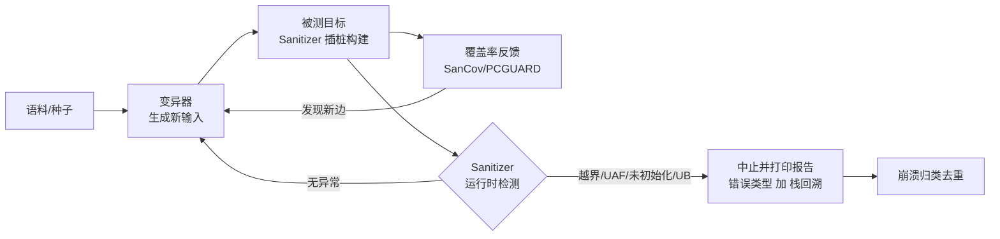
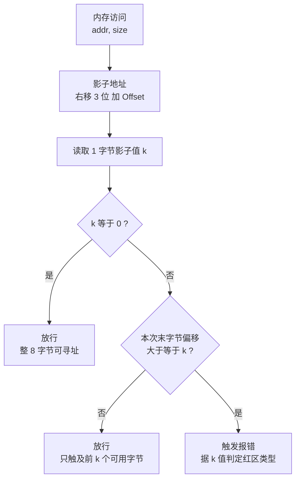
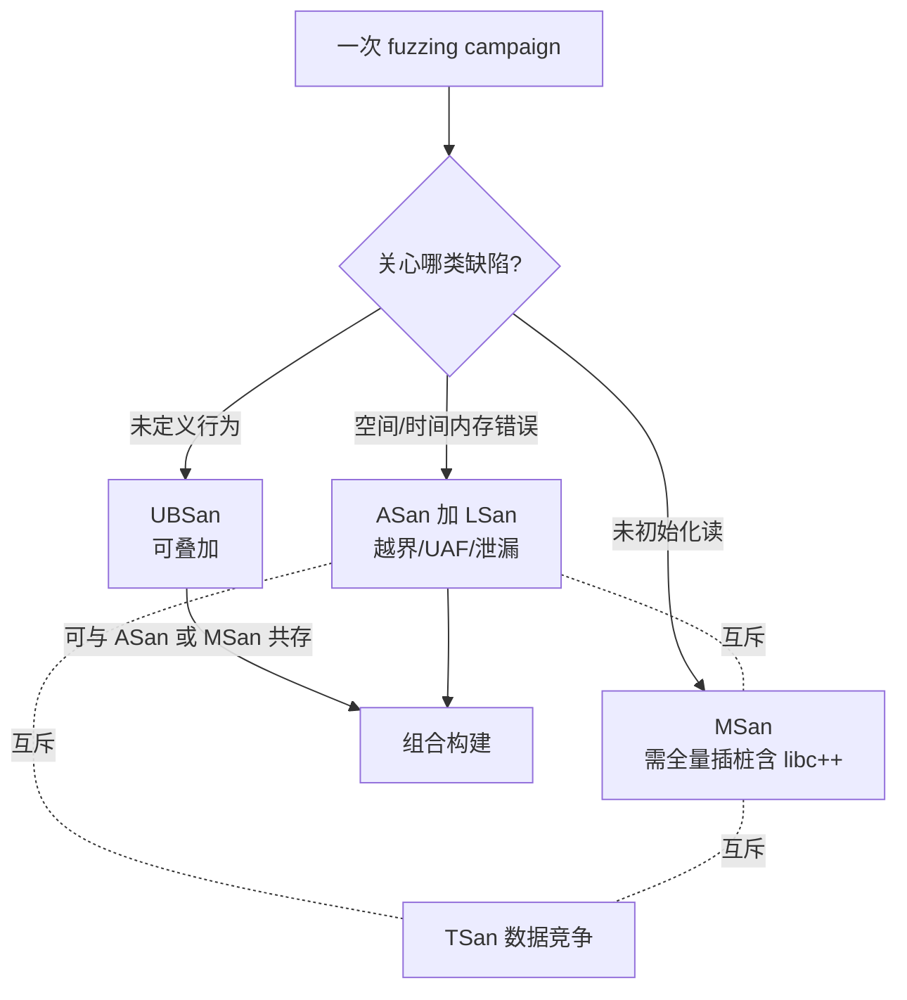

# Fuzzing与漏洞挖掘（7）· Sanitizers：ASan与UBSan与MSan

> [!abstract] TL;DR
> - Sanitizer 是 fuzzing 三元组里的**缺陷预言机（oracle）**：变异器负责造输入、覆盖率反馈负责导航、Sanitizer 负责把「本来不崩溃的静默内存破坏」在第一现场变成确定性 abort。没有它，fuzzer 只能抓到会触发 SIGSEGV 的那一小撮 bug。
> - **ASan** 用「1 字节影子管 8 字节应用内存 + 分配红区 + free 隔离区（quarantine）」检测堆栈全局越界、use-after-free/return/scope、double-free 与泄漏；开销约 2× CPU、2–3× 内存。
> - **MSan** 用「逐比特影子 + 数据流传播 + origin 溯源」检测**未初始化读**，且只在未初始化值影响控制流/解引用/进内核时才报警；代价是**必须全量插桩（含 libc++）**，否则未插桩代码的写入会造成假阳性。
> - **UBSan** 不用影子内存，而是在可能 UB 的运算前**内联检查 + 调用 handler**；覆盖有符号溢出、移位越界、空指针、错位、`vptr` 类型混淆等。**默认可恢复（只打印不中止）**，接到 fuzzer 上必须 `-fno-sanitize-recover` 否则漏报。
> - 三者的**兼容性**是硬约束：ASan⊥MSan⊥TSan 两两互斥（都要独占影子/语义冲突），UBSan 可叠加到 ASan/MSan 上；因此实践中是**每种 sanitizer 一次独立 campaign**（OSS-Fuzz 正是如此）。
> - 演进路线：Valgrind Memcheck（DBI、免重编、20–50× 慢）→ 编译期 Sanitizer（快但要源码）→ HWASan/MTE（内存标签、低内存开销）与 GWP-ASan（采样、可上生产）。

## 概述与定位

在《Fuzzing与漏洞挖掘》系列里，前几篇分别解决了「怎么造输入」（变异、[[03.AFL++架构与使用|AFL++]]）、「怎么知道走没走到新代码」（[[04.编译期插桩：SanitizerCoverage与PCGUARD|SanitizerCoverage/PCGUARD]] 覆盖率反馈）、「用哪个引擎去驱动」（[[05.libFuzzer与持久模式|libFuzzer]]、[[06.honggfuzz与其他引擎|honggfuzz]]）。本篇补上最后、也是最关键的一块拼图：**缺陷预言机**——程序到底有没有出 bug，由谁来判定。

要理解 Sanitizer 的定位，先要认清一个反直觉的事实：**绝大多数内存破坏并不会当场崩溃**。一个越界写只要还落在同一个内存页里，MMU 不会报错；一个 use-after-free 只要那块内存还没被 `munmap` 归还给内核，CPU 照样能读能写；读一段未初始化的栈只是拿到脏数据，不产生任何硬件异常。于是在**裸构建**下，fuzzer 喂进一个真正能触发漏洞的输入，程序却「安然无恙」地跑完，退出码为 0——bug 被静默吞掉，成了**假阴性**。fuzzer 能自动抓到的，只有那些恰好把访问打到未映射页、触发 `SIGSEGV`/`SIGABRT` 的「幸运崩溃」，可能只占真实 bug 的一小部分。

Sanitizer 做的事，就是把这些**静默的、概率性的、远离案发现场的**破坏，改造成**响亮的、确定性的、发生在第一次非法访问那一刻的** abort，并附上错误类型 + 完整栈回溯。它是编译期插桩（在每次内存访问/每个可疑运算前插入检查代码）加运行时库（维护影子内存、拦截 `malloc`/`free`、打印报告）的组合。这样一来，fuzzer 的「崩溃即信号」假设才真正成立——只要 Sanitizer 报错就 abort，fuzzer 立刻把这条输入存进 crash 目录。可以说，**现代覆盖率引导 fuzzing 的威力，一半来自覆盖率反馈，另一半来自 Sanitizer 这个预言机**；两者正交、可组合，缺一不可。

三大 Sanitizer 各管一类缺陷，边界清晰：

- **AddressSanitizer（ASan）**——空间与时间上的内存错误：堆/栈/全局缓冲区越界、use-after-free、use-after-return、use-after-scope、double-free、非法 free、`new`/`delete` 与 `malloc`/`free` 配对错误，以及（借 LeakSanitizer）内存泄漏。
- **MemorySanitizer（MSan）**——**未初始化内存的使用**，且带数据流传播：不是「读了未初始化」就报，而是「未初始化的值最终影响了程序可观测行为」才报。
- **UndefinedBehaviorSanitizer（UBSan）**——C/C++ **未定义行为**：有符号整数溢出、移位越界、空指针解引用、未对齐访问、数组越界（编译期已知界）、`bool`/`enum` 非法值、`vptr` 类型混淆等。

它们与相邻篇的输入输出关系是：Sanitizer 消费 fuzzer 的输入、产出结构化崩溃报告，报告再进入 [[16.崩溃分类与去重与可利用性|崩溃分类与去重]]（`SUMMARY` 行是天然去重键），可利用性判断则要接到 [[33.二进制漏洞与利用基础/01.内存破坏漏洞全景与利用链模型|内存破坏漏洞全景与利用链模型]] 去看。规模化时，[[17.规模化：OSS-Fuzz与ClusterFuzz|OSS-Fuzz]] 会为同一目标分别构建 address/memory/undefined 三套二进制，各跑各的。

从历史看，这是「动态二进制插桩（DBI）」到「编译期插桩」的一次范式迁移。前 Sanitizer 时代的王者是 **Valgrind Memcheck**：它在运行时翻译原生指令、无需重编译、能查未初始化和堆错误，但代价是 **20–50× 减速**、串行化线程、对栈/全局越界几乎无能为力。2012 年 Google 的 Serebryany 等人发表 AddressSanitizer（USENIX ATC），把检查逻辑下沉到编译器、开销压到 ~2×，从此重编译换来的速度让 Sanitizer 与 fuzzing 珠联璧合。之后 MSan、UBSan、TSan 相继补齐，再往后是面向 ARM64 的 HWASan（内存标签）和可上生产的采样式 GWP-ASan。

## 原理与机制

三大 Sanitizer 共享同一套骨架——**编译期插桩 + 运行时库 + 函数拦截器（interceptor）**——但检测机制迥异。下面先看它们在 fuzzing 回路里的位置，再拆各自原理。



**ASan 的三根支柱**：影子内存（shadow memory）、红区（redzone）、隔离区（quarantine）。

1. **影子内存**：ASan 把整个进程地址空间按 **8:1** 映射出一份影子——每 8 字节应用内存对应 1 字节影子。地址转换是一条纯算术：`Shadow = (Addr >> 3) + Offset`（Linux x86-64 上 `Offset = 0x7fff8000`）。这块影子在启动时用 `mmap(PROT_NONE)` 预留出巨大的虚拟区间，按需换页。编译器在**每一次**内存 load/store 前插入代码：算出影子地址、读那 1 字节、判定这次访问是否踩到「中毒（poisoned）」区域。
2. **红区**：ASan 的分配器给每块内存的**前后都垫上「中毒」的红区**，全局变量、栈上局部变量同样被红区包夹。任何越界只要落进红区，影子字节非零，检查立即命中。
3. **隔离区**：`free` 掉的内存不马上还给分配器复用，而是先打上「已释放」毒标、扔进一个 FIFO 隔离队列停一会儿。这样一段时间内对已释放内存的任何访问都能被抓成 use-after-free；隔离区越大，UAF 检出窗口越长（但吃内存越多）。

**UBSan 的机制截然不同**——它**不用影子内存**。编译器针对每一处可能产生 UB 的运算（一次可能溢出的有符号加法、一次可能越界的移位、一次可能为空的解引用……）内联一段前置判断；一旦条件触发，就调用运行时里对应的 `__ubsan_handle_*` handler 打印诊断。它是「点状」插桩：不插桩内存访问全局，只插桩语言层面被标准判定为 UB 的那些具体操作。这也决定了它的开销弹性极大——只开 `signed-integer-overflow` 几乎无感，全开 `undefined` 组则有可观成本。

**MSan 也用影子内存，但是逐比特的**：每个应用比特对应一个影子比特，`1` 表示「这一位是未初始化的」。关键在于它要**沿数据流传播**这份「脏」信息：`c = a + b`，只要 `a` 或 `b` 有未初始化位，`c` 的相应位就被标脏。MSan 不在「读到未初始化」时立刻报警（否则 `memcpy` 一段含 padding 的结构体都要炸），而是**推迟到未初始化值真正影响可观测行为**才报——用它做条件分支、拿它当指针解引用、把它交给系统调用。这套「延迟到 use」的语义把误报压到可接受，但也带来 MSan 最大的软肋：**必须全量插桩**（见下节）。

## 影子内存、红区与传播详解

这一节把三者的内部构造拆到「不看代码也能讲清」的程度。

### ASan 影子字节的编码与快慢路径

影子字节不是简单的「0=好、1=坏」，而是一套精心设计的编码，既能表达「部分可寻址」又能区分红区种类：

```text
影子值    含义
00        对应 8 字节全部可寻址（正常内存）
01..07    只有前 N 个字节可寻址（分配尾部不满 8 字节时）
fa        堆左红区（heap-buffer-overflow）
fd        已释放的堆区（heap-use-after-free）
f1/f2/f3  栈左 / 栈中 / 栈右红区
f5        栈已返回（stack-use-after-return）
f8        栈已出作用域（stack-use-after-scope）
f9        全局变量红区（global-buffer-overflow）
f6        全局初始化顺序（init-order）
f7        用户手动 poison
fc        容器越界（container-overflow，如 std::vector）
ca/cb     alloca 左 / 右红区
bb        对象内字段间红区（intra-object）
```

为什么要「01..07 部分可寻址」？因为分配大小往往不是 8 的倍数，比如申请 20 字节，第 3 个 8 字节格子只有前 4 字节合法，影子就记 `04`。检查逻辑分**快路径**与**慢路径**：

```c
// 编译器在每次 N 字节访问前内联的等价逻辑
uint8_t k = *(uint8_t*)(((uintptr_t)addr >> 3) + Offset);
if (__builtin_expect(k != 0, 0)) {           // 快路径：影子为 0 直接放行
    // 慢路径：本次访问触及的最后一个字节在格内偏移
    int last = ((uintptr_t)addr & 7) + N - 1;
    if (last >= k)                            // 越过了「前 k 字节可用」的边界
        __asan_report_error(addr, N, is_write);
}
```

绝大多数访问命中快路径（一次比较、一次条件跳转），这正是 ASan 只有 ~2× 开销的原因。下图是判定流：



有个精巧细节：影子内存自己也要防越界——ASan 在影子区和应用区之间留了一段「shadow gap」并整体 poison（影子值 `fe`/`cc`），一旦有人误算出落在 gap 的地址，也会被逮住。

### 栈、全局与堆的三种插桩

- **堆**：ASan 用拦截器替换 `malloc`/`calloc`/`realloc`/`free` 与 `operator new/delete`。分配时在用户区两侧加红区（默认最小 16 字节，随分配增大到上限 `max_redzone`，默认 2048），把红区影子标毒；`free` 时把整块标 `fd` 并压入隔离区（`quarantine_size_mb` 默认 256MB）。这也顺带查 double-free（对 `fd` 区再 free）、`alloc_dealloc_mismatch`（`new[]` 配 `delete`）等。
- **栈**：编译器改写函数栈帧，在每个局部变量之间插红区，并在函数入口/出口写影子。**use-after-return** 靠「假栈（fake stack）」实现：把可能被逃逸引用的局部变量搬到一块单独分配、返回后仍保持中毒（`f5`）的影子区；这样函数返回后别人还拿着旧指针访问就被抓（`detect_stack_use_after_return`，新版 clang 默认开启）。**use-after-scope**（`f8`）则在 `{}` 作用域进出时 poison/unpoison。
- **全局**：每个全局变量后面跟一段红区（`f9`），运行时启动阶段统一注册；还能查 `init-order`（跨编译单元的全局初始化顺序依赖）。
- **对象内越界**：默认 ASan 抓不到「结构体里从字段 A 溢出到字段 B」这种同一分配内部的越界。`-fsanitize-address-field-padding` 会在字段间插红区（`bb`）把它也纳入检测，代价是改变对象布局、需要 ignorelist 排除有 ABI 约束的类型。

### MSan 的传播、origin 与「全量插桩」铁律

MSan 的影子是 1:1 逐比特的，另有一份 **origin 内存**（4 字节应用对应 4 字节 origin id）用于**溯源**。开 `-fsanitize-memory-track-origins=2` 后，每次向内存写入脏值都会记下「这份未初始化最初从哪来、经过哪几跳」，报告里能打印出从 `malloc`/栈变量声明处到当前使用点的完整链路——这是 MSan 排障的杀手锏，因为「未初始化读」的因和果往往隔得很远。

传播是逐运算近似的：算术、位运算、比较、类型转换……每条 IR 指令都有对应的影子计算规则，把输入的脏位按语义合成输出的脏位。报警时机严格限定在「未初始化值逃逸出纯数据流」的几处：**条件分支**、**指针解引用（拿脏值当地址）**、**传入系统调用**（经拦截器检查）。

代价是那条**铁律：所有被执行到的代码都必须插桩**。道理很直白——MSan 只知道「插过桩的写入」会把某块内存标为「已初始化」；如果一段未插桩的库代码（比如没重编的 libc++）往缓冲区写了合法数据，MSan **看不见这次写**，仍以为该内存是脏的，等你用它时就报一个**假阳性**。所以用 MSan 必须连 C++ 标准库、乃至所有第三方依赖一起用 MSan 重编（社区提供 MSan 版 libc++ 构建方式）；C 库函数则靠 MSan 自带的大量拦截器兜住。这正是 MSan 比 ASan 难用得多、也更少被随手启用的根本原因。

### UBSan 的检查族、trap 模式与可恢复语义

UBSan 是一组可独立开关的检查，`-fsanitize=undefined` 是常用合集，细分包括：`signed-integer-overflow`、`shift`、`null`、`alignment`、`bounds`（编译期已知界的数组越界）、`object-size`、`vla-bound`、`integer-divide-by-zero`、`float-cast-overflow`、`return`（非 void 函数走到结尾）、`unreachable`、`vptr`（C++ 多态对象类型混淆，能抓类型混淆漏洞）、`function`（间接调用签名不符）等。注意**无符号整数溢出在 C 里是有定义的**，不在 `undefined` 里，要单独开 `unsigned-integer-overflow`（属排错而非 UB）。

三种运行形态要分清，对 fuzzing 尤其关键：

- **完整运行时**：调用 `__ubsan_handle_*` 打印详尽诊断（默认）。
- **trap 模式**（`-fsanitize-trap=undefined`）：不进运行时，直接 `ud2`/`__builtin_trap` 触发 `SIGILL`，二进制小、无诊断信息（只知道在哪条指令 trap）。
- **minimal runtime**（`-fsanitize-minimal-runtime`）：极简报告，面向生产（如 CFI）。

**最大的坑**：UBSan 默认是**可恢复（recoverable）**的——报个警就继续跑，不 abort。接到 fuzzer 上，程序不崩溃 = fuzzer 收不到信号 = bug 被当没发生。所以 fuzzing 构建**必须** `-fno-sanitize-recover=undefined`（或运行时 `UBSAN_OPTIONS=halt_on_error=1`），把「打印后继续」改成「打印后中止」。

### 演进：HWASan 与 GWP-ASan

经典 ASan 的痛点是**内存开销**（影子 1/8 + 隔离区 + 红区）。**HWASan** 借 ARM64 的 Top-Byte-Ignore/内存标签（MTE）机制：给每次分配和对应指针的高位打一个小 tag，访问时硬件/软件比对 tag 是否一致，不匹配即报。它把影子从 1/8 压到约 1/16 甚至更省，且天然能查「远距离」重用，缺点是仅限 ARM64、与经典 ASan 互斥。**GWP-ASan** 走另一条路：采样式 guard-page 分配器，只对极少数分配启用页级保护，开销近乎为零、可长期挂在生产环境，用概率换来对真实用户侧偶发内存错误的捕获——它不是 fuzzing 的预言机，而是生产遥测的补充。内核侧还有 KASAN/KMSAN，是 [[52.Linux内核机制与内核利用/18.内核Fuzzing与syzkaller|syzkaller]] 与 [[38.Windows内核与驱动逆向/30.内核Fuzzing|内核 Fuzzing]] 的检测底座。

## 工具视角与实战

**构建标志**（clang 为主，GCC 亦支持 `address`/`undefined`/`leak`/`thread`，MSan 仅 clang）：

```bash
# ASan + UBSan（可共存），并让 UBSan 遇错即停、保留符号与帧指针
clang -O1 -g -fno-omit-frame-pointer \
      -fsanitize=address,undefined -fno-sanitize-recover=all \
      target.c -o target_asan

# MSan：注意要全量插桩，通常配合 MSan 版 libc++
clang -O1 -g -fsanitize=memory -fsanitize-memory-track-origins=2 \
      -stdlib=libc++ target.cc -o target_msan
```

**与引擎对接**：libFuzzer 直接把 sanitizer 与 `fuzzer` 一起编进去：

```bash
clang -g -O1 -fsanitize=fuzzer,address       harness.c -o fuzz_asan
clang -g -O1 -fsanitize=fuzzer,memory        harness.c -o fuzz_msan   # 单独一套
clang -g -O1 -fsanitize=fuzzer,undefined -fno-sanitize-recover=all harness.c -o fuzz_ubsan
```

AFL++ 则用环境变量在编译期开关：`AFL_USE_ASAN=1`、`AFL_USE_UBSAN=1`、`AFL_USE_MSAN=1`、`AFL_USE_CFISAN=1`（配合 `afl-clang-fast`）。覆盖率插桩由引擎那侧提供（见 [[04.编译期插桩：SanitizerCoverage与PCGUARD|第 4 篇]]），Sanitizer 与覆盖率是两条正交的插桩，同时开即可。

**运行期选项**（各自的 `*_OPTIONS` 环境变量，用冒号分隔）——fuzzing 场景最常用的一组：

```bash
export ASAN_OPTIONS=abort_on_error=1:halt_on_error=1:detect_leaks=1:\
detect_stack_use_after_return=1:allocator_may_return_null=1:\
quarantine_size_mb=64:malloc_context_size=20:symbolize=1
export UBSAN_OPTIONS=halt_on_error=1:print_stacktrace=1
export MSAN_OPTIONS=halt_on_error=1:exitcode=86
```

要点解释：`abort_on_error=1` 让 ASan 用 `abort()`（`SIGABRT`）退出，libFuzzer/AFL 才能识别为崩溃；`allocator_may_return_null=1` 让超大分配返回 NULL 而不是直接 abort（否则一堆「申请 4GB」的输入全被当崩溃，污染结果）；`quarantine_size_mb` 调小以省内存换吞吐；`malloc_context_size` 控制每次分配记录的栈深（影响报告质量与内存）。若无法设环境变量（如 OSS-Fuzz 沙箱），可在目标里定义弱符号 `__asan_default_options()`/`__msan_default_options()`/`__ubsan_default_options()` 把选项**焊进二进制**。

**符号化**：报告要有文件行号，需 `-g` 且 `llvm-symbolizer` 在 `PATH`（或设 `ASAN_SYMBOLIZER_PATH`/`external_symbolizer_path`）。一份典型 ASan 报告的骨架：

```text
==12345==ERROR: AddressSanitizer: heap-use-after-free on address 0x...
READ of size 4 at 0x... thread T0
    #0 0x... in process_record parser.c:88
    ...
0x... is located 0 bytes inside of 32-byte region freed by thread T0 here:
    #0 0x... in free
    #1 0x... in release_ctx parser.c:60
previously allocated by thread T0 here:
    #0 0x... in malloc
SUMMARY: AddressSanitizer: heap-use-after-free parser.c:88 in process_record
```

那行 `SUMMARY` 是崩溃去重的天然指纹（错误类型 + 顶帧位置），[[16.崩溃分类与去重与可利用性|第 16 篇]] 的去重就吃它。

**该用哪个、能不能一起用**——这是实战第一决策，被兼容性硬约束框死：



结论：**ASan、MSan、TSan 两两互斥**（都要独占影子、语义相冲），必须各编一套、各跑一轮；**UBSan 轻量且不占影子，可搭到 ASan 或 MSan 上**。所以规模化实践是「一目标 × 多 sanitizer = 多套二进制、多条 campaign 并行」，[[17.规模化：OSS-Fuzz与ClusterFuzz|OSS-Fuzz]] 用 `SANITIZER=address|memory|undefined` 环境变量批量出这几套构建。

**吞吐权衡**：Sanitizer 会砍掉 exec/s（ASan ~2×、MSan ~3× 慢），而 fuzzing 的产出与执行速度强相关。常见折中是「分层」：用开销更低的构建（甚至临时无 sanitizer）快速铺覆盖率、扩语料，再用 ASan/MSan/UBSan 构建做深度检测（复跑语料或并行独立 campaign）。libFuzzer 还提供 `-rss_limit_mb`/`-malloc_limit_mb` 防止 sanitizer 下内存暴涨拖垮机器。

**自定义分配器要手动标注**：ASan 只认它拦截的 `malloc`/`free`。如果目标用内存池、arena、slab 自管理内存，ASan 对池内越界一无所知。这时用手动 poison API 教会它边界：

```c
#include <sanitizer/asan_interface.h>
ASAN_POISON_MEMORY_REGION(ptr, size);      // 标记为不可访问（回收进池时）
ASAN_UNPOISON_MEMORY_REGION(ptr, size);    // 分配出去时解毒
// MSan 侧：__msan_unpoison / __msan_check_mem_is_initialized / __msan_allocated_memory
```

`std::vector` 一类容器的「容量已分配但未使用」区域也靠库里的 annotation 实现 `container-overflow` 检测——注意这要求**容器和使用它的代码用同一份 ASan 编译**，否则会假阳性，必要时用 `detect_container_overflow=0` 关掉。要局部关闭插桩，用 `__attribute__((no_sanitize("address")))` 或 `-fsanitize-ignorelist=list.txt`。

## 安全性与正确使用

> [!caution] 合规边界
> 本篇所述 Sanitizer 技术仅用于**自有代码、获授权的目标、CTF 靶场与安全研究**，一律以**防御与教育**为立场：用 Sanitizer 加固自己维护的软件、在授权范围内做漏洞挖掘并**负责任地披露**。请勿将其用于未授权系统的攻击性测试，也不要据此产出针对真实生产系统或他人资产的武器化步骤。Sanitizer 报告能精确定位缺陷，把它用于修复与加固，而非为绕过他方授权或攻击他人服务铺路。挖到的崩溃如何转化为利用，属于 [[33.二进制漏洞与利用基础/01.内存破坏漏洞全景与利用链模型|漏洞利用]] 范畴，本系列只在授权研究语境下讨论原理、不提供打真实目标的成品配方。

**Sanitizer 是调试/测试工具，绝不能上生产**。这条要特别强调，因为它常被误解：

- **它扩大而非缩小攻击面**：ASan 运行时本身有可观代码量与全局状态；更致命的是，为了让影子映射成立，ASan 会占用固定虚拟地址布局，某种程度上削弱了 ASLR 的随机性——把一个「防御工具」放到面向不可信输入的生产服务上，反而可能给攻击者提供确定性。
- **DoS 面**：Sanitizer 一遇错就 `abort`，等于把「本可容忍的小 bug」升级成「服务当场挂掉」，可被恶意输入用作拒绝服务。
- **性能与体积**：2–3× 的 CPU/内存、显著膨胀的二进制，对生产不可接受。生产侧要「带保护上线」应选 **GWP-ASan（采样、低开销）** 或硬件 **MTE**，而不是把 fuzzing 用的 ASan 直接部署。

**正确解读报告，避免被假阴性/假阳性误导**：

- **ASan 的假阴性**：越界步长若**跨过整个红区**打到下一块合法内存，ASan 抓不到（红区有限宽）；UAF 若隔离区已被后续分配挤满、内存提前复用，检出窗口就关了（调大 `quarantine_size_mb` 可缓解，代价是内存）；同一分配内部字段间越界默认不查（需 `field-padding`）。所以「ASan 跑干净」不等于「无内存 bug」。
- **MSan 的假阳性**：几乎都源于**未全量插桩**——某段没重编的库写了内存，MSan 以为还脏。诊断此类问题正是 `track-origins` 的用途：若 origin 指向某个未插桩模块的分配，八成是插桩不全而非真 bug。切勿在依赖没编进来的情况下轻信 MSan 报警。
- **UBSan 的「报了不停」陷阱**：默认可恢复，若忘了 `-fno-sanitize-recover`，fuzzer 会**完全错过**这些 bug（程序没崩）——这是最隐蔽的漏配。
- **拦截器与沙箱冲突**：Sanitizer 的 `malloc`/syscall 拦截器可能与目标自带的 `seccomp`/自定义分配器/`LD_PRELOAD` 打架，导致启动即挂或行为异常；在裁剪目标（见 [[08.Harness编写与目标裁剪|下一章]]）时要留意放行必要 syscall、避免与 sanitizer 抢 hook。

一句忠告：**Sanitizer 报告是「有 bug」的强证据，但「无报告」只是「这套 sanitizer + 这次输入没发现」的弱证据**。要提高置信度，就多种 sanitizer 轮着上、语料铺得够广、campaign 跑得够久——这也是把它与覆盖率反馈、多引擎并行绑在一起的意义所在。

## 小结

- Sanitizer 是 fuzzing 的**缺陷预言机**，把静默内存破坏变成第一现场的确定性 abort；它与覆盖率反馈正交，共同撑起现代灰盒 fuzzing。
- **ASan**＝影子内存（8:1）＋红区＋隔离区，查越界/UAF/UAR/泄漏，~2× 开销；**MSan**＝逐比特影子＋数据流传播＋origin，查未初始化读，须**全量插桩**；**UBSan**＝内联检查＋handler，查 UB，**默认可恢复、须显式 `-fno-sanitize-recover`**。
- 兼容性是硬约束：**ASan⊥MSan⊥TSan** 两两互斥，UBSan 可叠加；实践即「一目标 × 多 sanitizer × 多 campaign」。
- 实战关键：`*_OPTIONS`（`abort_on_error`/`halt_on_error`/`allocator_may_return_null`/`quarantine_size_mb`）、符号化、自定义分配器手动 poison、按吞吐分层构建。
- 边界意识：ASan 有红区宽度/隔离区容量导致的假阴性，MSan 有插桩不全导致的假阳性；Sanitizer 是测试工具、**绝不上生产**，生产侧用 GWP-ASan/MTE。

## 相关阅读

- 上游反馈：[[04.编译期插桩：SanitizerCoverage与PCGUARD]]（覆盖率插桩与 Sanitizer 正交组合）、[[05.libFuzzer与持久模式]]（`-fsanitize=fuzzer` 一体化构建）
- 下游处置：[[16.崩溃分类与去重与可利用性]]（以 `SUMMARY` 行去重）、[[33.二进制漏洞与利用基础/01.内存破坏漏洞全景与利用链模型]]（崩溃转利用）
- 目标裁剪：[[08.Harness编写与目标裁剪]]（拦截器与沙箱/分配器的冲突处理）
- 规模化：[[17.规模化：OSS-Fuzz与ClusterFuzz]]（address/memory/undefined 多套构建并行）
- 引擎依赖：[[48.动态插桩与模拟执行引擎/12.插桩驱动的分析：覆盖率与污点与trace]]（DBI 侧的覆盖率与污点，与编译期 Sanitizer 对照）
- 内核与浏览器：[[52.Linux内核机制与内核利用/18.内核Fuzzing与syzkaller]]、[[38.Windows内核与驱动逆向/30.内核Fuzzing]]（KASAN/KMSAN 检测底座）、[[54.浏览器与JS引擎漏洞/00.浏览器与JS引擎漏洞总览]]
- 官方文档：Clang `AddressSanitizer` / `MemorySanitizer` / `UndefinedBehaviorSanitizer` 文档；Serebryany 等《AddressSanitizer: A Fast Address Sanity Checker》(USENIX ATC 2012)；Google `sanitizers` 项目 Wiki

[[00.Fuzzing与漏洞挖掘总览|⬆ 系列总览]] | [[06.honggfuzz与其他引擎|← 上一章]] | [[08.Harness编写与目标裁剪|→ 下一章]]