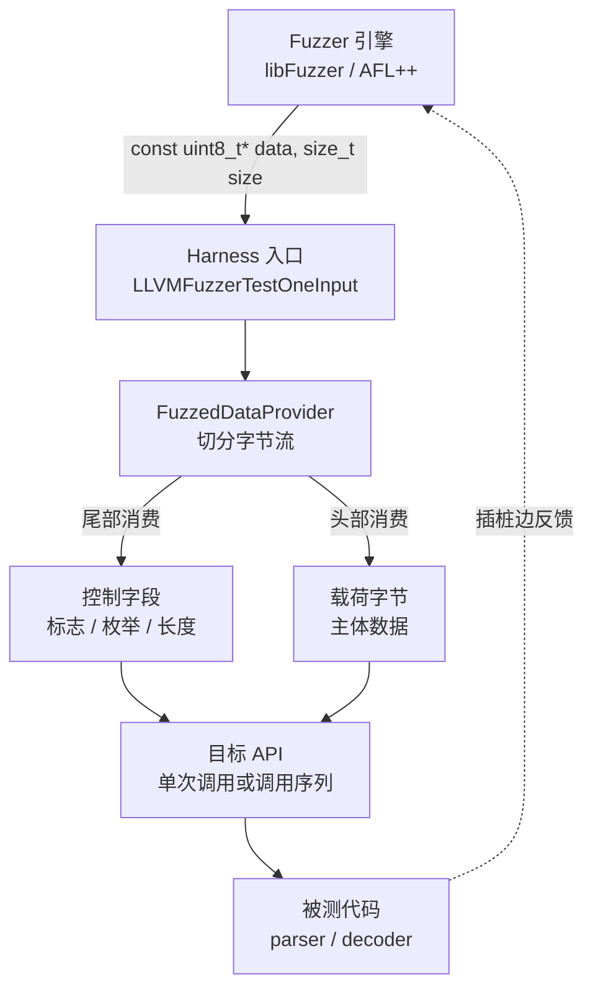
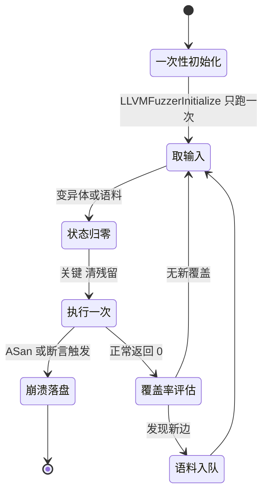
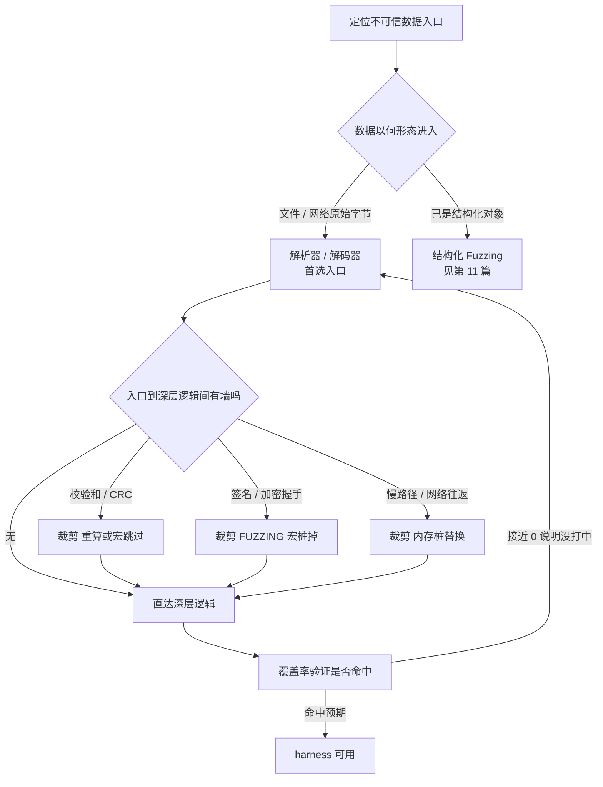

# Fuzzing与漏洞挖掘（8）· Harness编写与目标裁剪
> [!abstract] TL;DR
> - Harness 是把模糊器吐出的随机字节翻译成一次「看似合法」的目标 API 调用的胶水代码；它决定「测什么、多快、能不能复现」，是决定 fuzzing 成败 60% 以上、最不性感却最关键的一环。
> - 现代 in-process 持久化模糊在一个进程里连跑几百万次迭代，由此派生出 harness 三条铁律：入口要落在不可信数据的第一现场、每次迭代状态必须归零、执行必须去随机化以可复现。
> - 入口选择的本质是攻击面裁剪：优先解析器/解码器/反序列化，用 `FuzzedDataProvider` 把一段字节切成多参数与调用序列，在「窄而深」与「宽而真」之间权衡。
> - 目标裁剪是把挡在深层逻辑前的「墙」（校验和、签名、加密握手、慢路径、网络往返）用 `FUZZING_BUILD_MODE_UNSAFE_FOR_PRODUCTION` 之类的构建期开关桩掉或重算，让变异体真正抵达被测代码。
> - 去随机化要连根拔除 time/pid/rand/ASLR/哈希序/线程调度等一切非确定源；否则覆盖率反馈被污染、崩溃无法复现，triage 直接失效。
> - 最隐蔽的失败是 harness 自身的 bug 被误当成目标漏洞（越界、泄漏、状态残留），以及 harness 校验过严反而成了新的墙——写完必须用覆盖率报告验证真的打进了目标。

## 概述与定位

Harness（又叫 fuzz target、driver、stub、桩函数）是模糊器与被测代码之间的一层胶水。它的职责可以浓缩成一句话：**把模糊器生成的一段无结构随机字节，翻译成对目标 API 的一次「看起来合法」的调用**。libFuzzer 把这层胶水固化成一个标准签名——`int LLVMFuzzerTestOneInput(const uint8_t *data, size_t size)`——引擎负责生成与变异 `data`，你负责把它喂进目标的正确位置。

要理解 harness 的分量，得把它放回整条流水线里看。前面几篇解决的是「引擎怎么跑」：第2-4篇讲覆盖率插桩（引擎如何「看见」路径），第5篇讲 libFuzzer 与持久模式（如何高速迭代），第7篇讲 sanitizers（如何把静默的内存错误变成可观测的崩溃）。但引擎再强，也只能测到 **harness 把字节送达的地方**。发动机和方向盘的关系——引擎是发动机，harness 是方向盘；油门踩到底也没用，方向错了就撞墙。工业界的共识相当一致：一个项目的 fuzzing 有没有成效，六七成取决于 harness 写得好不好，而不是换用哪个引擎、开哪个 sanitizer。

「目标裁剪」是 harness 的一体两面。一面是**攻击面选择**：在动辄百万行的代码里，挑哪个函数当入口、暴露多大的接口给模糊器。另一面是**障碍移除**：把挡在入口和深层 bug 之间的那些「墙」——校验和、数字签名、加密握手、网络往返——拆掉或绕过，让变异真正抵达要测的代码。二者共同回答一个问题：怎样用最短的字节路径，把最多的模糊器算力送到 bug 密度最高的地方。

本篇聚焦三个决定性维度：**入口选择**（测什么）、**状态清理**（迭代间独立）、**去随机化**（可复现）。这三者不是三个并列的小技巧，而是「in-process 持久化模糊」这一执行模型的直接推论——理解了模型，三条铁律就是必然。边界上：结构化 harness（语法/protobuf）在第11篇深讲，本篇只给「用字节驱动状态机」的轻量前身；语料、字典、最小化在第9篇；本篇讲 harness 骨架、入口裁剪、状态与确定性工程，以及围绕它们的失败模式与陷阱。

## 原理与机制

一切要从「为什么是 in-process 持久化模糊」讲起，三条铁律都是它的推论。

**吞吐决定一切。** 最朴素的模糊是「每个输入 fork+exec 一个全新进程」，好处是天然隔离、状态永远干净，坏处是慢——一次 fork/exec 在 Linux 上是毫秒量级，撑死几千次每秒。而覆盖引导模糊的探索效率几乎线性正比于 execs/sec：吞吐翻 100 倍，等价于同样时间多探索约 100 倍的路径。libFuzzer 与 AFL++ 的持久模式因此选择**在同一个进程里循环调用 harness 几万到几百万次**，把吞吐拉到 10^4–10^6/秒。代价是：进程不再天然干净，于是所有「干净」都得 harness 自己维持——这正是「状态清理」与「去随机化」的根源。而「入口选择」则决定这几百万次迭代每一次落在哪里。

**harness 契约（libFuzzer 语义，AFL++ 兼容）。** 这几条不是风格建议，违背任何一条都会让模糊会话直接失效：

1. 函数**每次都返回 0**。返回值保留给引擎；较新的 libFuzzer 把返回 `-1` 解释为「别把这个输入收进语料」，用于廉价的预校验拒绝——但正常路径永远返回 0。
2. **绝不能对正常输入 `exit()`/`abort()`**。那会杀死整个会话。只有真正的 bug 才允许通过 ASan/断言崩溃。
3. **对畸形输入必须优雅处理**：解析失败要返回错误码，而不是 `assert`。fuzzing 的全部意义就是喂畸形数据，harness 若对畸形数据自我了断，等于把引擎永远锁在门口。
4. **不得读越界**：`data[size]` 之后的字节不属于你。对非 NUL 结尾的 `data` 用 `strlen`/`strcpy`/`atoi` 是最经典的 harness bug。
5. **要快、要确定、要无状态残留**（下面两大维度展开）。

初始化钩子 `int LLVMFuzzerInitialize(int *argc, char ***argv)` 在整个会话开始前**只调用一次**，用来做「昂贵但一次性」的准备：加载模型、构建只读全局表、播种 RNG、设定环境。它是安放一次性开销的唯一合法位置，但放进去的东西必须**不产生可变的跨迭代状态**。

下面两张图分别刻画「字节如何流经 harness」和「持久化迭代循环的状态机」。注意状态机里显式画出的「状态归零」一步——它就是「状态清理」铁律在执行模型里的位置。





## 三维裁剪详解：入口、状态与确定性

这一节把三条铁律各自的原理、手段、边界与陷阱逐一拆开，穿插横向对比与逆向视角。

### 入口选择：在不可信数据的第一现场落刀

**原理。** 漏洞的必要条件是「不可信数据 + 危险操作」。所以入口要选在**不可信数据刚进入程序、还没被清洗**的第一现场。按 bug 密度经验排序：解析器（PNG/PDF/ELF/各种协议）、解码器（图像/音视频/压缩）、反序列化（protobuf/JSON/自定义二进制帧）、字符集转换/正则引擎/模板引擎——这些「吃外部字节、吐内部结构」的函数，几乎是所有内存破坏漏洞的产房。为什么？因为它们的工作就是根据外部字节里的长度、偏移、类型标签去分配内存、跳转分支、复制数据，任何一处对「攻击者可控的长度/偏移」缺乏校验，就是一个越界。

**窄而深 vs 宽而真。** 这是入口选择的核心权衡：

- **窄**：直接调用最底层的单个解析函数。execs/sec 高、覆盖集中、崩溃易复现，但会漏掉「模块间集成」类 bug（A 解析出的对象被 B 误用）。
- **宽**：走完整 pipeline（读文件 → 解析 → 构建对象 → 再序列化）。真实、能抓集成 bug，但慢，而且早期的格式校验容易变成墙，把模糊器堵在浅层。
- 工程上（OSS-Fuzz 风格）的主流做法是**一个项目写多个 harness**，每个格式/入口一个，各自窄而深，用数量去覆盖广度——而不是妄图用一个巨型 harness 包打天下。

**字节切分——「一段字节喂多参数」难题。** 目标函数往往需要多个参数（缓冲区、长度、标志位、模式枚举），而模糊器只给你一维字节流。早期靠手写切分（前 4 字节当长度、下一字节选模式……），脆弱且偏置严重：一旦某个字段的语义变了，整个语料就报废。现代标准是 **`FuzzedDataProvider`**（头文件 `<fuzzer/FuzzedDataProvider.h>`），它把字节流优雅切成强类型参数：`ConsumeIntegralInRange`、`ConsumeBool`、`ConsumeEnum`、`PickValueInArray`、`ConsumeRandomLengthString`、`ConsumeBytes`、`ConsumeRemainingBytes`。

这里有个值得讲透的设计：**整型/控制类从缓冲区尾部消费，字节数组类从头部消费**。为什么要分两头？因为这样「载荷主体」始终留在前段、连续且稳定，而「控制决策」堆在尾段；当你日后新增一个 `Consume` 调用、或语料在演化时，前段的载荷不会整体错位，语料的稳定性与可迁移性大幅提升。代价是 `ConsumeIntegralInRange` 用取模映射区间会引入分布偏置（低值略多），但对模糊而言完全可接受——我们要的是覆盖广度，不是均匀分布。

```cpp
#include <fuzzer/FuzzedDataProvider.h>

extern "C" int LLVMFuzzerTestOneInput(const uint8_t *data, size_t size) {
    FuzzedDataProvider fdp(data, size);
    // 控制字段从尾部消费，载荷从头部消费 —— 保持语料稳定
    bool verbose      = fdp.ConsumeBool();
    int  level        = fdp.ConsumeIntegralInRange<int>(0, 9);
    auto mode         = fdp.ConsumeEnum<Mode>();
    std::string name  = fdp.ConsumeRandomLengthString(64);
    std::vector<uint8_t> payload = fdp.ConsumeRemainingBytes<uint8_t>();

    Decoder dec(level, mode, verbose);
    dec.decode(name, payload.data(), payload.size());  // 不让异常逃逸出 harness
    return 0;
}
```

**有状态 API 的序列化。** 不少目标不是「一发入魂」的纯函数，而是状态机：流式解析的 `feed()`/`finish()`、数据库的 op 序列、句柄的 open/read/write/close 生命周期。这类目标的 bug（use-after-free、double-free、状态混淆）往往只在**特定调用序列**下暴露，单次调用永远测不到。范式是**把字节流当成一段字节码**：读一个 opcode → 分派到某个操作 → 再读操作数，循环直到字节耗尽。模糊器于是在探索「操作序列空间」，而覆盖率反馈会引导它拼出触发深层状态的序列。这正是第11篇结构化 fuzzing 的轻量前身。

```cpp
extern "C" int LLVMFuzzerTestOneInput(const uint8_t *data, size_t size) {
    FuzzedDataProvider fdp(data, size);
    Handle *h = api_open();
    while (fdp.remaining_bytes() > 0) {
        switch (fdp.ConsumeIntegralInRange<uint8_t>(0, 3)) {  // 把字节当 opcode
            case 0: { auto b = fdp.ConsumeBytes<uint8_t>(
                        fdp.ConsumeIntegralInRange<size_t>(0, 256));
                      api_write(h, b.data(), b.size()); break; }
            case 1: api_seek(h, fdp.ConsumeIntegral<int64_t>()); break;
            case 2: api_flush(h); break;
            case 3: api_read(h, fdp.ConsumeIntegralInRange<size_t>(0, 4096)); break;
        }
    }
    api_close(h);  // 无论序列如何，句柄都必须归还
    return 0;
}
```

**两种进阶范式**（此处点到，能抓的是「不崩溃但错」的逻辑 bug）：**差分 harness**——同一输入喂两套实现（两个 JSON 解析器、gzip 与 zlib、两版协议栈），比对输出，不一致即 bug；**往返/不变式 harness**——断言 `decode(encode(x)) == x`、或 parse→serialize→parse 结果一致。差分 harness 尤其强大，因为它不依赖 sanitizer 报错，能发现纯粹的语义分歧（常见于安全边界不一致，如两个解析器对同一 URL 解读不同导致的 SSRF 绕过）。

### 状态清理：让每一次迭代都像第一次

**原理。** in-process 意味着上一次迭代的一切残留——全局变量、静态局部、堆上未释放的对象、打开的文件描述符、只增不减的缓存——都会带进下一次。残留会造成三类灾难，且都极难排查：

1. **假崩溃 / 不可复现**：迭代 N 的崩溃其实由迭代 N-1 的残留触发；单独回放那个「崩溃输入」却复现不了，triage 抓瞎，工程师会怀疑人生。
2. **假泄漏**：libFuzzer 默认 `-detect_leaks=1`，会在**每次迭代后运行 LeakSanitizer**。harness 每轮漏一点，立刻被报成 leak「崩溃」——其实是 harness 的锅，不是目标的锅，白白浪费一次「疑似漏洞」的排查。
3. **缓慢劣化 / OOM**：memoization 表、日志缓冲、单例缓存只增不减，几十万次迭代后撑爆 `-rss_limit_mb`（默认 2048 MB），被当成 OOM bug；fd 泄漏则在几千次后触发 `EMFILE`（too many open files），整个会话卡死。

**工程手段。**

- **首选无状态**：每次迭代内构造/析构对象，绝不复用可变全局。RAII 或显式 `free` 到底，出口只有一个。
- 昂贵的一次性初始化放 `LLVMFuzzerInitialize`，但必须确认它**真的不留可变状态**——只读表 OK，可变缓存不 OK。
- 手动复位那些不得不用的全局：清空容器、重置计数器、`fflush` 并截断日志、关闭并归还每一个 fd。
- 警惕**库内部的隐藏全局**：OpenSSL 的错误栈（`ERR_clear_error`）、libxml2 的全局解析上下文、`errno`、C++ 的 `std::cout` 缓冲、`setlocale` 状态。这些是最容易被忽略的残留源，因为它们不在你的代码里。
- 反过来用 ASan/LSan 当「状态泄漏探针」：一个干净的 harness，在关掉目标真实 bug 之后，应当能连续跑几百万次而**零泄漏、内存零增长**。跑一段时间 RSS 持续爬升，几乎必然是状态没清干净。

### 去随机化：把非确定性连根拔起

**原理。** 覆盖引导模糊的**反馈信号是「输入 → 覆盖」这张映射表**。如果同一输入两次跑出不同覆盖（flaky），信号就被污染：引擎会把「其实不新」的输入误当新路径收进语料、把能量浪费在反复重跑同一输入上、更致命的是——**崩溃无法稳定复现**，第16篇的崩溃分类/去重/可利用性判定整条流水线全部失效。所以 harness 必须消灭一切非确定源。

**非确定源清单**（务必逐一排查，隐蔽程度递增）：

- **时间**：`time`/`gettimeofday`/`clock`/`std::chrono::now`。任何分支依赖时间戳就 flaky。
- **进程/线程 id**：`getpid`/`gettid`，常被塞进临时文件名或哈希种子。
- **随机数**：`rand`/`random`/`arc4random`/`/dev/urandom`/`getrandom`。
- **ASLR 衍生**：指针值本身、`%p` 格式化、以及**由指针或 ASLR 播种的哈希表迭代序**——abseil Swiss table、Go map、Python dict 都会随机化迭代顺序，这是极隐蔽的 flaky 源，因为代码看起来完全确定，只有迭代次序在变。
- **线程调度**：多线程数据竞争导致每次结果不同；能单线程就单线程跑。
- **未初始化内存读**：MSan（第7篇）能抓，同时它本身就是 flaky 源——读到的「垃圾值」每次都不同。
- **环境**：环境变量、locale（`LC_ALL`）、时区（`TZ`）、当前工作目录、文件系统状态、DNS/网络应答。

**去随机化手段**（按介入层次由高到低）：

- **构建期桩**：用 `-D` 宏在 fuzzing 构建里把上述调用替换成常量。最干净，但要能改目标源码。
- **链接期改写**：ld 的 `--wrap=time`、weak symbol 覆盖，或 `LD_PRELOAD` 一个假的 `time`/`rand`/`getrandom`。改不了源码时的利器。
- **`LLVMFuzzerInitialize` 里做全局设定**：用固定种子播 RNG、`setenv("TZ","UTC")`、`setlocale(LC_ALL,"C")`。
- **ASLR**：它主要影响「复现」而非「覆盖」；复现崩溃时可 `setarch -R`（或 `personality(ADDR_NO_RANDOMIZE)`）关掉。哈希序问题则要么禁用随机化种子、要么对输出**排序后再比较**。

下图把「入口选择 + 目标裁剪」合起来画成一条决策流——从定位入口，到识别路上的墙并逐一裁剪，最后回到覆盖率验证形成闭环。



**目标裁剪的四类墙。** 上图右侧那几堵墙，值得单独讲清「为什么必须裁、怎么裁」：

- **校验和 / CRC / 魔术字**：文件格式头部往往有 CRC32 或魔数。随机变异有 99.99% 的概率破坏它，于是所有变异体都卡在「CRC 不符 → 直接返回错误」这一步，永远进不了解析主体。裁剪有三条路子：改目标源码在 fuzzing 构建里**跳过校验**；或在 harness 里**替 fuzzer 把 CRC 重算修对**再喂进去；或写**自定义变异器**（第10/11篇）在变异后 fixup 校验和。
- **数字签名 / 加密握手**：TLS、固件验签、加密容器——验签失败直接拒绝，是比 CRC 更硬的墙。BoringSSL/OpenSSL 的官方 fuzzer 用 `-DFUZZING_BUILD_MODE_UNSAFE_FOR_PRODUCTION` 把 RNG 变确定、把 MAC/签名校验短路，让握手能在没有真实密钥的情况下走完。
- **慢路径**：高压缩级、`sleep`、重试循环、真实磁盘 I/O。它们不挡路但吃满时间预算，把 execs/sec 拖垮。裁剪就是降级或桩掉。
- **网络 / 外部依赖**：socket、DB、DNS。用内存缓冲替换 socket、用桩替换 DB，既提速又去随机化，一举两得。

## 工具视角与实战

**最小 libFuzzer harness 与构建。** 骨架永远是「新建上下文 → 喂数据 → 全部释放 → 返回 0」：

```c
#include <stdint.h>
#include <stddef.h>
#include "target.h"

extern "C" int LLVMFuzzerTestOneInput(const uint8_t *data, size_t size) {
    if (size == 0) return 0;          // 处理空输入，别在下面越界
    target_ctx *ctx = target_new();   // 每轮新建，保证迭代独立
    target_parse(ctx, data, size);    // 畸形数据只返回错误码，绝不 abort
    target_free(ctx);                 // 全部释放，零残留
    return 0;                         // 恒返回 0
}
```

构建时的关键是**分离插桩与运行时**：目标对象只要覆盖率插桩、不要 libFuzzer 的 `main`，用 `-fsanitize=fuzzer-no-link`；harness 才链接进 `-fsanitize=fuzzer` 运行时。这样避免多个目标文件各自带一个 `main` 冲突。

```bash
# 目标对象：只插桩，不链接 libFuzzer 的 main
clang   -O1 -g -fsanitize=fuzzer-no-link,address -c target.c   -o target.o
# harness：链接 libFuzzer 运行时 + ASan
clang++ -O1 -g -fsanitize=fuzzer,address harness.cc target.o -o fuzz_target
# 跑起来：限制长度、内存、单次超时；-jobs/-workers 并行
./fuzz_target -max_len=8192 -rss_limit_mb=2560 -malloc_limit_mb=2048 \
              -timeout=10 -detect_leaks=1 -jobs=8 -workers=8 corpus/
```

这几个开关是实战护栏：`-max_len` 挡住「长度字段被变异成天文数字 → 巨额分配」的假 OOM；`-malloc_limit_mb` 单次分配上限、`-rss_limit_mb` 常驻内存上限、`-timeout` 单输入超时，三者把资源型假阳性关在门外，让报出来的 OOM/超时更可能是真 bug。

**AFL++ 持久模式。** 同一套「无状态、清残留、去随机」的纪律，换个 API：

```c
#include <unistd.h>
__AFL_FUZZ_INIT();

int main(void) {
    __AFL_INIT();                                 // 延迟 forkserver：昂贵初始化放到这之前，只做一次
    unsigned char *buf = __AFL_FUZZ_TESTCASE_BUF; // 共享内存缓冲，免去每轮读文件
    while (__AFL_LOOP(100000)) {                   // 子进程内连跑 10 万次再重 fork
        int len = __AFL_FUZZ_TESTCASE_LEN;
        target_parse(buf, len);
    }
    return 0;
}
```

用 `afl-clang-fast`/`afl-clang-lto` 编译。`__AFL_LOOP(N)` 的 N 是「重 fork 前的迭代数」：调大提速，但状态残留的风险也随之放大——这恰好把「状态清理」的重要性量化了。AFL++ 还能**直接复用 libFuzzer harness**：链接它的 `libAFLDriver.a`（`AFL_LLVMFuzzerTestOneInput` 驱动），一份 `LLVMFuzzerTestOneInput` 两个引擎通吃，这是当下的最佳实践——写一次 harness，libFuzzer/AFL++/honggfuzz 都能跑。

**校验和墙的防御式裁剪。** 两条路子，都强调「仅 fuzzing 生效」：

```c
// 路子一：改目标，仅在 fuzzing 构建跳过校验，绝不进生产
#ifdef FUZZING_BUILD_MODE_UNSAFE_FOR_PRODUCTION
    (void)stored_crc;                                  // 不比对，让变异体直达解析主体
#else
    if (crc32(payload, n) != stored_crc) return ERR_BAD_CRC;
#endif
```

```cpp
// 路子二：不改目标，在 harness 里替 fuzzer 把 CRC 修对再喂
patch_crc32(buf, size);   // 就地重算头部 CRC 字段
target_parse(buf, size);
```

**覆盖率验证——写完必做的一步。** harness 能编译能跑，不代表它打中了目标；一个覆盖率接近 0 的 harness 是彻底的浪费，而且它「不崩溃」会给你虚假的安全感。务必生成覆盖率报告核对：

```bash
clang++ -fprofile-instr-generate -fcoverage-mapping \
        -fsanitize=fuzzer,address harness.cc target.o -o fuzz_cov
./fuzz_cov -runs=200000 corpus/
llvm-profdata merge -sparse *.profraw -o cov.profdata
llvm-cov report ./fuzz_cov -instr-profile=cov.profdata
# 盯住目标源文件的行/函数覆盖：接近 0 = harness 没打中；符合预期才算过关
```

**OSS-Fuzz 集成惯例。** 大规模持续模糊（第17篇）要求 harness 遵守约定：用注入的 `$CC`/`$CXX`/`$CFLAGS`/`$CXXFLAGS` 编译，sanitizer 由 `$SANITIZER` 决定，最终链接 `$LIB_FUZZING_ENGINE`（它会在不同引擎/模式间切换），种子语料与字典按 `<target>_seed_corpus.zip`、`<target>.dict` 命名放进 `$OUT`。

```bash
$CXX $CXXFLAGS -std=c++17 -I. -c harness.cc -o harness.o
$CXX $CXXFLAGS harness.o -o $OUT/fuzz_target ./libtarget.a $LIB_FUZZING_ENGINE
cp seed_corpus.zip $OUT/fuzz_target_seed_corpus.zip
cp target.dict     $OUT/fuzz_target.dict
```

**历史演进的一条线。** 值得记住这条脉络：手写字节切分 → `FuzzedDataProvider` 标准化；fork-per-input → 持久/in-process 模式；单一巨型 harness → 多 harness + OSS-Fuzz 规模化；分散的 `-fsanitize-coverage` + 手工链接 → 统一的 `-fsanitize=fuzzer` 一键把插桩与运行时打包。每一步都在削减 harness 的样板、放大它的杠杆。

## 安全性与正确使用

Harness 与目标裁剪是把双刃剑：为了让模糊器抵达深层逻辑而桩掉的那些校验（尤其签名与加密），恰恰是生产环境的安全基石。用错了地方，等于亲手拆掉防线。

> [!caution] 合规边界
> Harness 编写与目标裁剪只应用于**你拥有或已获书面授权的代码、CTF 靶场与安全研究环境**，全程站在**防御 / 教育**视角。
> - 桩掉签名 / 加密 / 校验和的 `FUZZING_BUILD_MODE_UNSAFE_FOR_PRODUCTION` 分支**绝不能编入任何生产或分发的二进制**——一份把安全校验短路的构建一旦泄漏或误发布，等价于亲手交出一个后门。构建系统要从物理上隔离 fuzzing 产物与发布产物。
> - 不为**绕过他人商业软件的授权 / DRM / 许可校验**编写武器化 harness，也不针对**真实生产系统或他人资产**提供「打某个具体目标」的成品配方。原理可以讲透，但不给可直接复用的攻击成品。
> - 发现的崩溃走**负责任披露**流程：先复现、去重、判可利用性（第16篇），再联系维护者；在获得授权前不公开可直接复现的完整利用链。

**两类工程上的「正确使用」也关乎安全结论的可信度。** 其一，**分清 harness bug 与目标 bug**：harness 自身的越界读、状态残留、假泄漏会伪装成「目标漏洞」，把它当成真漏洞上报既浪费维护者精力、也损害你的信誉——每个崩溃都要先排除 harness 自身嫌疑（最小复现 + 覆盖率核对 + 干净 harness 回归）。其二，**警惕 harness 校验过严变成新的墙**：如果你在 harness 里对输入做了太多「合法性预筛」，模糊器会被你自己挡在浅层，得出「没有漏洞」的虚假结论——这种假阴性比假阳性更危险，因为它让人误以为目标是安全的。裁剪的分寸永远是「拆掉挡路的墙，但不替目标做本该由目标做的校验」。

## 小结

Harness 是模糊器的方向盘，目标裁剪是清障。三条铁律全都源自「in-process 持久化模糊在一个进程里连跑百万次」这一执行模型：

- **入口选择**回答「测什么」——落在不可信数据的第一现场（解析器/解码器/反序列化），用 `FuzzedDataProvider` 把一维字节切成多参数与调用序列，在窄而深与宽而真之间按项目权衡，必要时一个项目多个 harness。
- **状态清理**回答「迭代间独立」——无状态优先，一次性开销进 `LLVMFuzzerInitialize`，手动复位隐藏全局，用 LSan/RSS 曲线当泄漏探针，否则会收获假崩溃、假泄漏与 OOM。
- **去随机化**回答「能否复现」——消灭 time/pid/rand/ASLR/哈希序/线程调度一切非确定源，否则覆盖反馈被污染、triage 失效。
- **目标裁剪**是贯穿始终的清障：校验和重算或宏跳过、签名加密用 `FUZZING_BUILD_MODE_UNSAFE_FOR_PRODUCTION` 桩掉、慢路径与网络用内存桩替换——但绝不进生产，也不替目标做校验。
- 最后别忘了闭环：写完用覆盖率报告验证真的打进了目标，一个覆盖率为 0 的 harness 比没有更危险，因为它给你虚假的安全感。

把 harness 写对，引擎（第3、5、6篇）与 sanitizer（第7篇）的威力才能真正落到被测代码上；写错，再强的引擎也只是在空转。

## 相关阅读

- 上游引擎与运行时：[[05.libFuzzer与持久模式]]、[[03.AFL++架构与使用]]、[[07.Sanitizers：ASan与UBSan与MSan]]
- 紧接下游：[[09.语料库与字典与最小化]]（种子/字典喂给 harness）、[[11.结构化Fuzzing：语法与protobuf]]（本篇「字节驱动状态机」的重量级版本）、[[16.崩溃分类与去重与可利用性]]（去随机化保证可复现后如何 triage）
- 覆盖率反馈的引擎侧：[[48.动态插桩与模拟执行引擎/12.插桩驱动的分析：覆盖率与污点与trace]]
- 崩溃转利用：[[33.二进制漏洞与利用基础/01.内存破坏漏洞全景与利用链模型]]
- 内核 / 浏览器场景的 harness 与目标裁剪：[[52.Linux内核机制与内核利用/18.内核Fuzzing与syzkaller]]、[[54.浏览器与JS引擎漏洞/00.浏览器与JS引擎漏洞总览]]、[[38.Windows内核与驱动逆向/30.内核Fuzzing]]
- 官方文档与资料：LLVM libFuzzer 文档（`llvm.org/docs/LibFuzzer.html`）、`FuzzedDataProvider.h` 头文件源码、AFL++ 官方文档（persistent mode 一节）、OSS-Fuzz「Ideal Integration」与 New Project Guide、Google fuzzing tutorial 仓库、《The Fuzzing Book》

[[00.Fuzzing与漏洞挖掘总览|⬆ 系列总览]] | [[07.Sanitizers：ASan与UBSan与MSan|← 上一章]] | [[09.语料库与字典与最小化|→ 下一章]]
