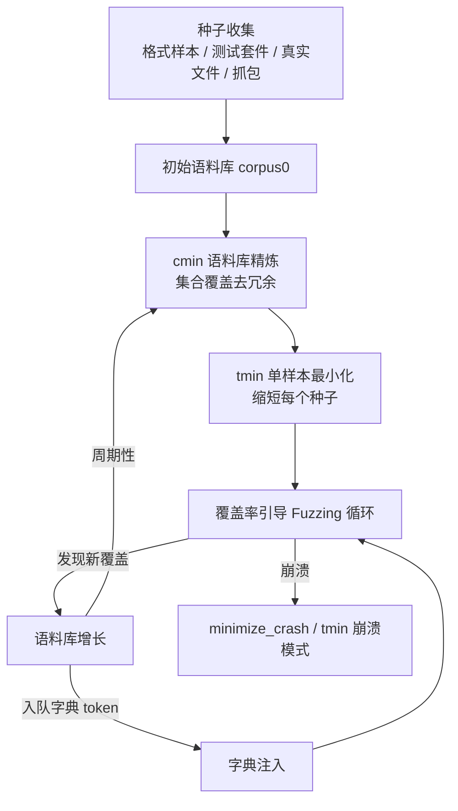
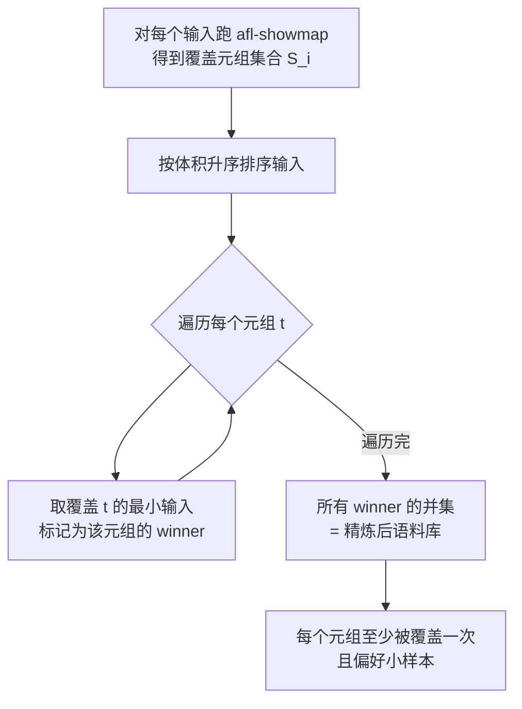
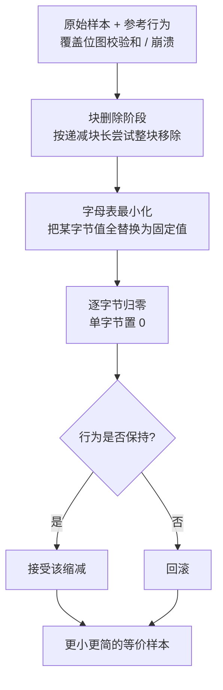
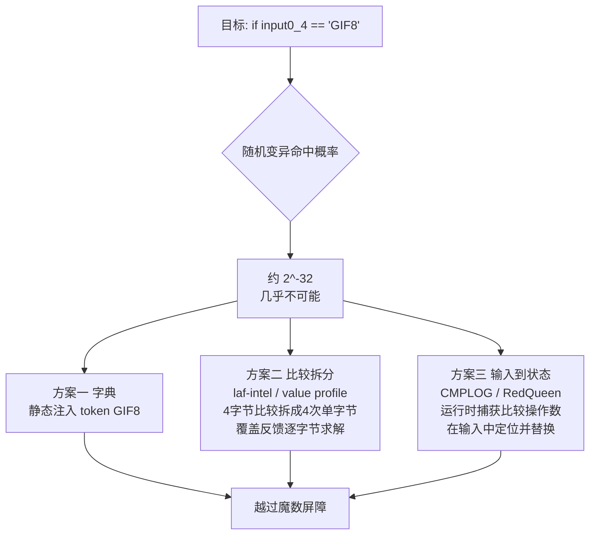

# Fuzzing与漏洞挖掘（9）· 语料库与字典与最小化
> [!abstract] TL;DR
> - 语料库（corpus）是覆盖率引导 Fuzzing 的“种群”，种子质量往往比引擎选型更决定成败：合法且**小而多样**的种子把搜索起点直接投放到解析器深处。
> - 最小化分两个正交层次——**语料库级**（`afl-cmin` / libFuzzer `-merge`，本质是最小集合覆盖，去掉覆盖冗余的样本）与**单样本级**（`afl-tmin` / `-minimize_crash`，缩短单个文件到等价最小形态）。
> - 字典（dictionary）用**领域先验的 token** 跨越随机变异无法逾越的“魔数屏障”：4 字节魔数随机命中概率约 2⁻³²，注入 token 后近乎必然命中。
> - 越过魔数有三条互补路线：静态字典、比较拆分（laf-intel / value-profile 改造目标）、输入到状态（CMPLOG/RedQueen 运行时观察并替换），原理与代价各异。
> - 精炼要求插桩**确定性**：非确定性覆盖会让集合覆盖误删关键样本，是最隐蔽的失败模式。
> - 语料库精炼不是一次性动作，而是与 Fuzzing 循环并行的**持续数据工程**：收集 → 精炼 → 喂料 → 增长 → 再精炼。

## 概述与定位

在覆盖率引导模糊测试的三大要素——引擎、Harness、数据——里，本篇聚焦最容易被忽视却最能拉开产出差距的“数据侧”：**语料库、字典、最小化**。经验上，一个覆盖良好的种子集加一份贴合格式的字典，常常胜过把引擎从 AFL 换成某个更花哨的变种；反过来，引擎再强，喂给它一堆同质、臃肿、无法通过魔数校验的输入，也只能在浅层解析路径上空转。

要理解这三者为何重要，先回到覆盖率引导的本质（详见 [[02.覆盖率引导原理：AFL的核心思想]]）：Fuzzer 是一个**由覆盖反馈引导的输入空间搜索器**，语料库就是它维护的“种群/前沿”。每个种子是一段“基因”，覆盖率是“适应度”，凡带来新覆盖的变异输入被收编进语料库、成为后续变异的母本。这个进化视角立刻解释了三件事：

- **种子（seed）决定搜索起点**。变异是对已有输入的局部扰动，若初始种群离“有趣区域”很远，Fuzzer 要靠随机游走一点点摸过去，代价极高。好种子等于把搜索直接空投到深处。
- **冗余拖慢进化**。语料库里若有成百上千个覆盖完全相同的样本，每一轮调度都在重复劳动、稀释变异预算——这正是**最小化**要解决的：用尽量少的样本保住全部覆盖。
- **魔数屏障挡住变异**。当目标用 `magic == 0x46464952` 这类精确比较守门时，随机字节翻转几乎不可能凑出那个 32 位常量——**字典**就是把这些常量作为先验知识“喂”进变异器。

本篇与相邻篇目的边界：Harness 如何切目标见 [[08.Harness编写与目标裁剪]]；havoc/splice 等**变异算子本身**与调度/能量分配见 [[10.变异策略与调度算法]]（本篇只讲字典 token 如何被“插入/覆盖”，不展开变异算子全集）；用语法/protobuf 生成**结构完全合法**的输入属 [[11.结构化Fuzzing：语法与protobuf]]，而字典是更轻量的 token 级先验，二者是“词典 vs 文法”的关系；CMPLOG/污点/concolic 求解约束的深水区见 [[12.覆盖率之外：污点与concolic]]。

## 原理与机制

**语料库作为进化种群。** 把语料库想成遗传算法的当前种群更利于建立直觉：初始种群=种子；适应度函数=“是否带来新的覆盖元组”；选择+变异=调度器挑样本、变异器扰动它；存活规则=只有触发新边（edge/tuple）的后代才被写回磁盘语料库。于是“语料库工程”本质是在维护这个种群的**质量、规模与多样性**。

**种子质量的四个维度。** 判断一个种子好不好，看四点：

1. **合法性（validity）**。合法输入能穿过前置校验（魔数、长度、校验和），直达真正复杂的解析逻辑；一堆非法输入只会反复卡在“格式不对，return”的浅层分支。但也不能全合法——保留少量“接近合法”的畸形样本，有助于探测错误处理路径。
2. **体积（size）**。小种子几乎在每个维度都占优：执行更快（单位时间更多次执行）、变异更“局部可控”（改一个字节的相对影响更大）、内存与磁盘占用更低，调度器（[[10.变异策略与调度算法]] 的能量分配）也更青睐小而快的样本。一个 5 MB 的种子和一个 500 B 的种子若覆盖相同，几乎总应保留后者。
3. **多样性（diversity）**。种群要覆盖格式的不同特性分支——图片格式的不同色彩模式、不同压缩算法、不同 chunk 类型。多样性直接决定初始覆盖面。
4. **覆盖贡献（coverage）**。最终要落到“这个种子覆盖了哪些别人没覆盖的边”，这也是最小化算法的度量基准。

**为什么要最小化，以及两个层次。** 随着 Fuzzing 进行，语料库会因不断收编“新覆盖”样本而膨胀；同时用户导入的原始种子集里也充满冗余（同一 PNG 的一百个变体覆盖几乎一致）。冗余的直接危害是：调度器要遍历整个语料库，冗余越多，单轮 cycle 越长、有效变异预算被稀释。最小化因此分两个**正交**层次，务必区分：

- **语料库级最小化（corpus minimization / distillation）**：在样本集合层面去冗余，目标是“用最少的文件数保住全集覆盖”。工具是 `afl-cmin`、libFuzzer `-merge=1`。改变的是**集合的基数**。
- **单样本级最小化（test case minimization）**：把**单个**文件在保持其行为（相同覆盖或相同崩溃）的前提下缩到最小。工具是 `afl-tmin`、libFuzzer `-minimize_crash`。改变的是**单个样本的字节数**。

二者可叠加使用：先 `cmin` 砍集合，再对留下的每个样本 `tmin` 缩体积。

**魔数屏障的数学。** 设目标含 `if (read_u32(input) != 0x89504E47) return;`（PNG 头）。纯随机变异要在某 4 字节位置恰好写出这个常量，概率约 $2^{-32}\approx 2.3\times10^{-10}$。即便每秒上万次执行，也要几十年。覆盖反馈在这里**帮不上忙**：比较要么相等要么不等，是个“悬崖”而非“斜坡”，反馈没有中间梯度可循。字典、比较拆分、输入到状态，正是三种把悬崖改造成可攀爬路径（或直接绕过）的手段，下一节详解。



## 集合覆盖、语料库精炼与字典注入详解

### 语料库精炼 = 最小集合覆盖

把语料库精炼形式化：设全集 $U$ 为“所有出现过的覆盖特征”（AFL 里是边元组 tuple，libFuzzer 里是 edge + 可选的 value-profile 特征）。每个输入 $i$ 覆盖一个子集 $S_i\subseteq U$。目标是找最小的输入集合 $C$，使 $\bigcup_{i\in C}S_i=U$。这正是经典的**最小集合覆盖（Minimum Set Cover）**，NP-hard；贪心近似能给出 $\ln n$ 因子的解，实践足够。

**`afl-cmin` 的实际启发式。** 值得强调：`afl-cmin` **不用**教科书贪心（每步挑“覆盖最多未覆盖元素的集合”），而用一个更快的近似：

1. 对每个输入跑 `afl-showmap`（一次插桩执行），拿到它命中的元组集合。
2. 把所有输入**按体积升序**排序。
3. 对每个元组，取“覆盖它的最小输入”作为该元组的 *winner*（因已按体积排序，遍历中第一个命中者即最小者）。
4. 所有当过 winner 的输入的**并集**即精炼结果。

这个启发式保证每个元组至少被覆盖一次，且**系统性偏好小样本**——与前面“小种子更优”的原则一致。它不追求理论最优基数，但一遍扫描即可完成，对大语料库友好。



**libFuzzer `-merge=1` 的特征增量式合并。** libFuzzer 走另一条路：`./fuzzer -merge=1 DST SRC1 SRC2 ...` 把 `SRC*` 合并进目标目录 `DST`。它先算出 `DST` 已有的特征全集，再遍历源文件，**只把带来新特征的文件拷入** `DST`。用它做纯精炼的惯用法是：`-merge=1 <空目录> <大语料库>`，等价于从零累加、只留有增量贡献者。libFuzzer 的“特征”比 AFL 元组更细——开启 `-use_value_profile=1` 后，比较指令的操作数差异也计入特征，于是合并能保留“在魔数上更接近”的样本。

**为什么精炼必须确定性。** 集合覆盖的正确性建立在“同一输入每次覆盖相同”这一前提上。若目标有非确定性（多线程调度、时间戳、未初始化读、ASLR 影响的路径），`afl-showmap` 两次结果不一致，winner 判定就会抖动：某元组这次算它覆盖、精炼时把它删了，实跑却不覆盖——**精炼后覆盖不升反降**。这是最隐蔽的失败模式。对策：编译期消除非确定性（固定随机源、`AFL_LLVM_...` 去时间戳）、多跑几次取稳定元组、或对关键样本保守保留。

### 单样本最小化：`afl-tmin` 的分阶段收敛

`afl-tmin` 在**保持行为不变**的前提下把单个样本缩到最小。“行为不变”的判据：普通模式下要求覆盖位图的**执行校验和**完全一致（走同一条路径）；崩溃模式（`-C`）下只要求“仍然崩溃”。算法分阶段、由粗到细：

1. **块删除**：按递减的块长（如先删大段、再删小段）尝试整块移除字节，每删一次就验证行为是否保持，保持则接受。这一步砍掉大片无关填充，收益最大。
2. **字母表最小化**：把输入中某个字节值的**所有出现**统一替换成一个固定值（通常 0）。目的是降低输入的“字母表复杂度”，让样本更规整、更利于人读和后续判定。
3. **逐字节归零**：对仍在起作用的字节逐个尝试置 0。这一步把“非零但其实无所谓”的字节清干净。

最终得到一个**更小、字节更单一、却触发等价行为**的样本。tmin 对崩溃复现尤其有用——把一个几 MB 的 crash input 压成几十字节，极大方便定位（见 [[16.崩溃分类与去重与可利用性]]）。libFuzzer 的对应物是 `-minimize_crash=1 -runs=N crash_file`，思路一致：反复删减并复跑，只要还崩就接受更小者。



### 字典：token 级先验及其三种越障路线

**字典格式（AFL 与 libFuzzer 通用）。** 一行一个条目，形如 `name="value"` 或直接 `"value"`，值用 C 风格转义写任意字节：

```
# 注释行
header_png="\x89PNG\x0d\x0a\x1a\x0a"
chunk_ihdr="IHDR"
kw_gif="GIF89a"
sql_select="SELECT"
```

AFL/AFL++ 还支持 `@level` 分级（如 `keyword@1`），让不同强度的 token 在不同阶段启用。变异器使用字典的方式主要两种：**插入**（在随机位置插入整条 token）与**覆盖**（用 token 替换某段字节）。有了 `GIF89a` 这条，命中魔数从 2⁻⁴⁸ 级别的偶然变成“几乎每轮都会试”的必然。

**token 从哪来。** 三条途径：(a) **照规范手写**——从格式/协议标准里抄魔数、关键字、chunk 名、操作码；(b) **从源码/二进制提取**——`strings` 抽字符串常量、grep 源码里的字面量；(c) **自动字典**——AFL++ 编译期用 `AFL_LLVM_DICT2FILE` 收集 `__sanitizer_cov_trace_const_cmp*` 与 `memcmp/strcmp` 中的常量操作数，直接生成字典。AFL++ 仓库 `dictionaries/` 与 libprotobuf-mutator 生态也自带大量现成字典（XML、JSON、PNG、SQL……）。

**越过魔数屏障的三条互补路线，深层差异如下：**

- **路线一·静态字典**：把已知常量作为 token 注入变异。优点是零运行时开销、可跨引擎复用；缺点是**只覆盖你事先知道的常量**，对运行时计算出来的比较值（如动态校验和、状态相关魔数）无能为力。
- **路线二·比较拆分（改造目标）**：laf-intel 在编译期把一个 4 字节比较**拆成 4 次单字节比较**，于是把 $2^{-32}$ 的一次性悬崖变成 $4\times2^{-8}$ 的四级台阶——每对一个字节，覆盖反馈就多给一次“中间进度”奖励，Fuzzer 得以**逐字节爬坡求解**。AFL++ 用 `AFL_LLVM_LAF_ALL` 开启；libFuzzer 的 `-use_value_profile=1` 是等效思路的运行时版（把比较距离计入特征）。代价是插桩变重、覆盖位图更易饱和。
- **路线三·输入到状态（观察并替换）**：CMPLOG（源自 RedQueen 的 *input-to-state correspondence*）在运行时**记录每条比较指令的实际操作数**，然后在当前输入里搜索“被比较的那一侧值”，把它替换成“期望值”。它不需要预先知道常量，能解运行时动态值，是介于字典与污点/concolic（[[12.覆盖率之外：污点与concolic]]）之间的轻量利器。AFL++ 用 `-c` 构建 CMPLOG 伴随二进制启用。

三者不是替代而是叠加：实战常同时上字典（廉价先验）+ CMPLOG（动态求解）+ 必要时 laf-intel。



### 种子选择理论一瞥

“该保留哪些种子”本身是有理论的。Rebert 等人（USENIX Security 2014，*Optimizing Seed Selection for Fuzzing*）系统比较了多种最小集合选择（minset）加权策略：不加权、按体积加权、按执行时间加权等。核心发现是——**做最小化通常优于不做**，但“最优加权”依目标而异，且过度追求最小基数有时会牺牲鲁棒性（删掉看似冗余、实则在别的构建配置下有用的样本）。工程结论：以 `cmin`（偏好小样本的集合覆盖）为默认，保留原始大语料库的备份以便换插桩配置后重新精炼。

## 工具视角与实战

**标准工作流（推荐顺序）：** 收集 → 语料库精炼（`cmin`/`merge`）→ 可选单样本 `tmin` → 上字典与 CMPLOG → Fuzzing → 周期性再精炼与多实例同步。

**AFL/AFL++ 精炼：**

```bash
# 语料库级：去冗余，输出到 corpus_min（-C 崩溃模式；-m/-t 控内存与超时）
afl-cmin -i corpus_raw -o corpus_min -- ./target @@

# 单样本级：把某个样本缩到最小（保持同一路径）
afl-tmin -i corpus_min/big_seed -o seeds/small_seed -- ./target @@
# 崩溃最小化：
afl-tmin -C -i crashes/id_000 -o crash_min -- ./target @@
```

**AFL++ 越障构建与字典：**

```bash
# CMPLOG 伴随二进制（-c）+ 主插桩二进制
export AFL_LLVM_LAF_ALL=1            # laf-intel 比较拆分（可选）
afl-cc -o target_cmplog -c target.c # CMPLOG 构建
afl-cc -o target target.c           # 主构建
export AFL_LLVM_DICT2FILE=$PWD/auto.dict  # 自动抽取字典（编译期）

afl-fuzz -i seeds -o out -x auto.dict -x png.dict \
         -c ./target_cmplog -- ./target @@
```

**libFuzzer 精炼与字典：**

```bash
# 语料库精炼（合并进空目录 = distill）
./fuzzer -merge=1 corpus_min/ corpus_raw/

# 崩溃最小化
./fuzzer -minimize_crash=1 -runs=100000 crash_file

# 字典 + value profile（把比较距离当反馈）
./fuzzer -dict=png.dict -use_value_profile=1 corpus_min/
```

**种子从哪弄：** 目标库自带的 `tests/`、`testsuite/`、`samples/` 目录是金矿；格式类目标可用公开样本仓（各类 *TestSuite*、真实文件抓取）；协议类用 `pcap` 抓包再抽 payload；已有 Fuzzing 项目可直接借 OSS-Fuzz 的公开语料库（[[17.规模化：OSS-Fuzz与ClusterFuzz]]）。导入后**第一件事就是 `cmin`**——原始集合的冗余度往往惊人。

**手写字典的最快姿势：** 对开源目标，`strings target | sort -u` 结合源码里 grep `memcmp("..."`、`== 0x...`、`case '...'` 抽关键字；对协议，直接把 RFC 里的方法名/状态码/字段名列进去。哪怕十几条高频 token，收益也立竿见影。

**常见坑：** ① `cmin`/`showmap` 依赖插桩确定性，非确定目标先去噪再精炼；② 超大种子（数 MB）会拖垮 forkserver 吞吐，务必先 `tmin` 或干脆剔除；③ 字典 token 过多会稀释变异（每轮试的 token 变多），保持精而非多；④ 跨构建复用语料库时，插桩方案变了（如从 AFL 经典改到 PCGUARD，见 [[04.编译期插桩：SanitizerCoverage与PCGUARD]]）覆盖度量口径变了，**应重新精炼**而非沿用旧 minset；⑤ 多实例并行时定期用 `merge`/同步语料库，避免各实例各挖各的、覆盖不共享。

## 安全性与正确使用

> [!caution] 合规边界
> 本篇涉及的语料库、字典与最小化技术，仅可用于**你拥有或已获书面授权**的软件、CTF 靶场与安全研究环境，且一律以**防御/教育**视角使用：定位并修复自有代码缺陷、构建回归语料库、复现并最小化崩溃以便上报。**不得**将其用于未授权的真实生产系统或他人系统，不提供针对特定真实目标的武器化配方，也不得用于绕过商业软件授权/校验。原理讲透，是为了让防御者把 Fuzzing 纳入 SDL，而非为攻击真实资产提供成品。崩溃转化为可利用性的下游分析见 [[16.崩溃分类与去重与可利用性]] 与 [[33.二进制漏洞与利用基础/01.内存破坏漏洞全景与利用链模型]]，同样限授权范围。

除法律合规外，语料库工程有若干**数据卫生**问题必须重视：

- **语料库的来源风险**。用真实文件当种子时，PDF/图片/文档里可能夹带**个人隐私（PII）、商业机密或受版权保护的内容**；用真实流量抓包做种子可能含凭证与会话令牌。这些数据会随语料库、随崩溃样本扩散。务必在隔离环境处理，分享前脱敏，切勿把含敏感数据的语料库或 crash 集公开（OSS-Fuzz 对崩溃语料库默认不公开正是此理）。
- **恶意样本当种子**。拿野外恶意文件当种子挖解析器时，本质是在处置活体恶意样本，须在离线沙箱、禁网、快照可回滚的环境中进行。
- **最小化的正确性即安全性**。前文强调的确定性要求，在防御场景里直接关系到“你以为覆盖没降、其实降了”——被误删样本对应的代码路径从此不再被测试，形成**盲区**。上线关键项目前，应对精炼前后做一次覆盖对比校验，确认最小化没有偷偷丢覆盖。
- **崩溃样本即敏感物料**。最小化后的 crash input 往往仍能触发漏洞，等同于半成品 PoC，应按敏感数据管理其存储与流转，遵循负责任披露流程。

## 小结

- 语料库是覆盖率引导 Fuzzing 的进化种群，种子的**合法性/体积/多样性/覆盖贡献**四维决定搜索起点，通常“小而多样”优先。
- 最小化有两个正交层次：**语料库级**（`cmin`/`merge`，最小集合覆盖去冗余）与**单样本级**（`tmin`/`minimize_crash`，缩单个文件到等价最小）；`afl-cmin` 用“按体积排序、每元组取最小 winner”的快速启发式而非教科书贪心。
- 字典把领域先验的 token 注入变异，跨越随机变异无法逾越的**魔数屏障**（2⁻³² 量级）；越障有静态字典、比较拆分（laf-intel/value-profile 改造目标）、输入到状态（CMPLOG/RedQueen 观察并替换）三条互补路线。
- 精炼的正确性依赖插桩**确定性**，非确定性会让集合覆盖误删关键样本，是最隐蔽的失败模式。
- 实战是持续的数据工程：收集 → 精炼 → 上字典+CMPLOG → Fuzzing → 周期性再精炼与多实例同步；变异算子与调度细节见下一章。

## 相关阅读

- 同系列上下游：[[08.Harness编写与目标裁剪|← 上一章：Harness编写]]、[[10.变异策略与调度算法|→ 下一章：变异与调度]]、[[02.覆盖率引导原理：AFL的核心思想]]、[[11.结构化Fuzzing：语法与protobuf]]（token vs 文法的边界）、[[12.覆盖率之外：污点与concolic]]（CMPLOG 之上的约束求解）、[[16.崩溃分类与去重与可利用性]]、[[17.规模化：OSS-Fuzz与ClusterFuzz]]、[[04.编译期插桩：SanitizerCoverage与PCGUARD]]
- 引擎与反馈依赖：[[48.动态插桩与模拟执行引擎/12.插桩驱动的分析：覆盖率与污点与trace]]（覆盖率反馈的底层）
- 漏洞下游：[[33.二进制漏洞与利用基础/01.内存破坏漏洞全景与利用链模型]]（崩溃→利用链）
- 内核/浏览器场景的语料库与结构种子：[[52.Linux内核机制与内核利用/18.内核Fuzzing与syzkaller]]、[[54.浏览器与JS引擎漏洞/00.浏览器与JS引擎漏洞总览]]、[[38.Windows内核与驱动逆向/30.内核Fuzzing]]
- 官方文档与论文：AFL 白皮书（lcamtuf，`technical_details.txt`，`afl-cmin`/`afl-tmin` 设计）、AFL++ 文档（`docs/`，CMPLOG 与 `AFL_LLVM_LAF_*`、`dictionaries/`）、LLVM libFuzzer 文档（`-merge`/`-minimize_crash`/`-dict`/`-use_value_profile`）、Rebert et al. *Optimizing Seed Selection for Fuzzing*（USENIX Security 2014）、Aschermann et al. *REDQUEEN: Fuzzing with Input-to-State Correspondence*（NDSS 2019）、laf-intel *Circumventing Fuzzing Roadblocks with Compiler Transformations*（2016）

[[00.Fuzzing与漏洞挖掘总览|⬆ 系列总览]] | [[08.Harness编写与目标裁剪|← 上一章]] | [[10.变异策略与调度算法|→ 下一章]]
